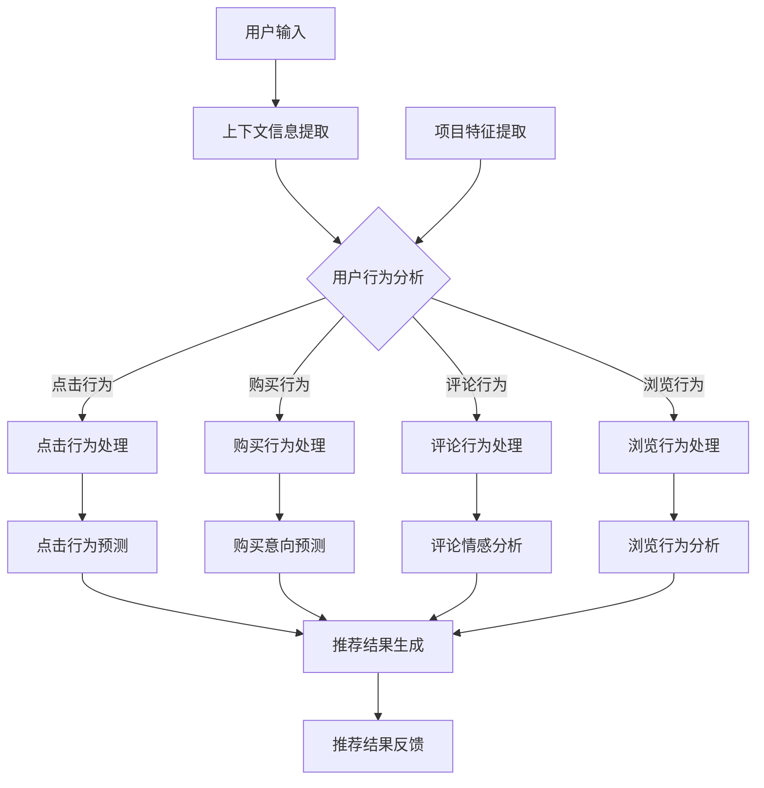

                 

关键词：推荐系统、上下文感知、多任务学习、大模型、深度学习、协同过滤、用户行为分析、个性化推荐

## 摘要

本文探讨了推荐系统中的上下文感知建模技术，特别是在大模型多任务学习框架下的应用。通过分析上下文信息对于推荐结果的重要性，本文介绍了如何利用深度学习技术来提升推荐系统的性能，包括协同过滤方法的改进、用户行为分析模型的构建以及多任务学习框架的引入。文章还详细阐述了数学模型和算法原理，通过实际项目案例和代码实例，展示了上下文感知建模在推荐系统中的具体实现和效果。最后，本文对未来应用前景、工具资源推荐以及面临的挑战进行了展望。

## 1. 背景介绍

推荐系统是信息检索和机器学习领域中的一个重要分支，旨在为用户推荐他们可能感兴趣的内容或产品。从简单的基于内容的推荐到复杂的协同过滤方法，推荐系统经历了长足的发展。然而，传统的推荐系统往往存在一定的局限性，如预测准确率不高、用户个性化不足等问题。近年来，随着深度学习技术的飞速发展，推荐系统的研究和应用也得到了极大的推进。

在推荐系统中，上下文信息是指与用户行为或内容相关的环境信息，如时间、地点、用户状态等。上下文信息能够有效地帮助推荐系统更好地理解用户的需求和偏好，从而提高推荐的质量。因此，上下文感知建模成为了推荐系统研究的一个重要方向。

大模型和多任务学习是当前机器学习领域的两个热门话题。大模型指的是具有巨大参数量的模型，能够在处理复杂任务时表现出优异的性能。而多任务学习则是指在一个统一的模型框架下同时处理多个相关任务。大模型和多任务学习在推荐系统中的应用，能够显著提升系统的推荐效果和效率。

本文将围绕推荐系统中的上下文感知建模，介绍大模型和多任务学习在其中的应用，并通过实际项目案例展示其效果。

### 1.1 推荐系统的发展历程

推荐系统的发展可以分为几个阶段：

1. **基于内容的推荐**：最早期的推荐系统主要基于内容相似性来进行推荐，即根据用户过去喜欢的项目内容，寻找与其相似的其他项目推荐给用户。这种方法简单直观，但存在推荐准确率不高、无法解决数据稀疏问题等局限性。

2. **协同过滤推荐**：为了解决基于内容推荐中的问题，协同过滤方法应运而生。协同过滤分为基于用户的协同过滤（User-based CF）和基于项目的协同过滤（Item-based CF）。这种方法通过分析用户之间的相似度或项目之间的相似度来进行推荐，大大提高了推荐的质量和准确率。然而，协同过滤方法也存在一些问题，如数据稀疏性、冷启动问题等。

3. **混合推荐系统**：为了克服单一推荐方法的局限性，研究者们提出了混合推荐系统，即结合多种推荐方法来提高推荐效果。例如，可以结合基于内容的推荐和协同过滤方法，或者引入其他辅助信息（如用户标签、兴趣点等）来增强推荐效果。

4. **深度学习推荐**：随着深度学习技术的发展，基于深度学习的推荐方法逐渐成为研究热点。深度学习推荐利用神经网络模型对用户行为和内容进行建模，能够更好地捕获用户和项目之间的复杂关系，从而提高推荐效果。同时，深度学习方法在处理高维度数据和复杂数据结构方面具有天然的优势，使得其在推荐系统中的应用更加广泛。

### 1.2 上下文信息的重要性

上下文信息是指与用户行为或内容相关的环境信息，如时间、地点、用户状态等。上下文信息对于推荐系统来说至关重要，原因如下：

1. **个性化推荐**：上下文信息能够帮助推荐系统更好地理解用户的当前需求和偏好，从而实现更个性化的推荐。例如，在早晨上班高峰期，用户可能更倾向于推荐交通出行信息或者新闻；而在晚上休息时间，用户可能更倾向于推荐休闲娱乐内容。

2. **解决数据稀疏性**：在协同过滤方法中，用户-项目交互矩阵往往存在大量零值，即用户与项目之间缺乏直接交互。而上下文信息能够提供额外的关联关系，从而缓解数据稀疏性问题。

3. **提升推荐质量**：上下文信息可以帮助推荐系统更好地过滤噪声数据和异常行为，从而提高推荐结果的准确性和可靠性。例如，在节假日或促销期间，推荐系统可以更准确地预测用户的需求和购买意向。

4. **增强用户体验**：上下文感知推荐系统能够更好地满足用户的即时需求和期望，从而提高用户满意度和使用黏性。

### 1.3 大模型和多任务学习的优势

大模型和多任务学习是当前机器学习领域的两个重要研究方向，它们在推荐系统中的应用具有显著的优势：

1. **捕获复杂关系**：大模型具有巨大的参数量，能够捕捉用户行为和项目内容之间的复杂关系。这对于解决推荐系统中的冷启动问题、数据稀疏性问题等具有重要意义。

2. **提高效率**：多任务学习框架可以将多个相关任务整合到一个统一的模型中，从而提高计算效率。例如，在推荐系统中，可以同时处理推荐任务、用户行为预测任务和项目特征提取任务，实现资源的共享和复用。

3. **提升性能**：大模型和多任务学习能够通过任务间的交互和协同，进一步提升推荐系统的性能和效果。例如，利用多任务学习框架，可以同时优化推荐效果和用户行为预测效果，实现双赢。

4. **适应性强**：大模型和多任务学习能够适应不同的应用场景和需求，具有广泛的适用性。例如，在电子商务领域，可以应用于商品推荐、用户行为预测等；在社交媒体领域，可以应用于内容推荐、用户关系分析等。

### 1.4 本文结构

本文将首先介绍推荐系统中的上下文感知建模技术，然后详细阐述大模型和多任务学习在其中的应用，并通过实际项目案例和代码实例展示其效果。具体包括以下内容：

1. **核心概念与联系**：介绍上下文感知建模的核心概念，包括上下文信息、用户行为、项目特征等，并使用 Mermaid 流程图展示推荐系统的基本架构。

2. **核心算法原理 & 具体操作步骤**：详细阐述上下文感知建模的算法原理和具体操作步骤，包括用户行为分析模型的构建、项目特征提取方法、上下文信息融合策略等。

3. **数学模型和公式 & 举例说明**：介绍上下文感知建模的数学模型和公式，包括用户行为预测模型、项目特征提取模型等，并通过具体案例进行分析和讲解。

4. **项目实践：代码实例和详细解释说明**：通过实际项目案例，展示上下文感知建模在推荐系统中的具体实现和效果，包括开发环境搭建、源代码详细实现、代码解读与分析等。

5. **实际应用场景**：分析上下文感知建模在不同场景下的应用，如电子商务、社交媒体、新闻推荐等，并探讨其未来发展前景。

6. **工具和资源推荐**：推荐与上下文感知建模相关的学习资源、开发工具和论文，为读者提供进一步学习和实践的方向。

7. **总结：未来发展趋势与挑战**：总结本文的研究成果，分析未来发展趋势和面临的挑战，为推荐系统的进一步发展提供启示。

## 2. 核心概念与联系

在介绍上下文感知建模的核心概念之前，我们需要明确几个基本概念，这些概念是理解上下文感知建模的基础。

### 2.1 上下文信息

上下文信息是指与用户行为或内容相关的环境信息，可以是定量的，也可以是定性的。例如，时间、地点、用户设备、用户状态、用户兴趣等。这些上下文信息对于推荐系统来说至关重要，因为它们能够提供额外的信息，帮助系统更好地理解用户的当前需求和偏好。

**时间**：时间上下文可以包括用户的活跃时间、特定时间的天气状况、节假日等。例如，在周末，用户可能更倾向于推荐休闲娱乐活动；而在工作日，用户可能更倾向于推荐工作相关的信息。

**地点**：地点上下文可以帮助推荐系统理解用户的地理位置，从而提供更符合当地需求的信息。例如，在旅游景点，可以推荐当地特色美食、旅游景点等。

**用户设备**：用户设备上下文包括用户的操作系统、设备类型、网络环境等。例如，在移动设备上，用户可能更倾向于推荐短视频、轻量级应用；而在电脑上，用户可能更倾向于推荐长篇内容、复杂应用。

**用户状态**：用户状态上下文包括用户的情绪、需求、兴趣等。例如，当用户处于兴奋状态时，可能更倾向于推荐刺激性的内容；而当用户处于疲劳状态时，可能更倾向于推荐轻松的内容。

**用户兴趣**：用户兴趣上下文包括用户的长期兴趣和短期兴趣。例如，一个用户可能在某个时间段内对某类内容特别感兴趣，而在另一个时间段内对另一类内容感兴趣。

### 2.2 用户行为

用户行为是指用户在系统中的操作和交互，如点击、购买、评论、浏览等。用户行为数据是推荐系统的重要输入，通过分析用户行为，推荐系统可以了解用户的偏好和需求。

**点击行为**：点击行为是用户在浏览网页或应用时对某一内容进行的点击操作。例如，用户在新闻应用中点击了一篇新闻文章，这可以视为用户对这篇新闻文章的兴趣。

**购买行为**：购买行为是用户在电商平台上完成购买操作。例如，用户在淘宝上购买了一件商品，这可以视为用户对该商品的强烈偏好。

**评论行为**：评论行为是用户对某项内容进行评价和评论。例如，用户在京东上对某件商品进行了评论，这可以视为用户对该商品的使用体验和满意度。

**浏览行为**：浏览行为是用户在浏览网页或应用时的一系列操作。例如，用户在电商平台上浏览了多个商品，这可以视为用户对商品的兴趣和偏好。

### 2.3 项目特征

项目特征是指与推荐内容相关的属性和特征，如商品属性、新闻标签、音乐风格等。项目特征可以帮助推荐系统更好地理解推荐内容，从而提高推荐质量。

**商品属性**：商品属性包括商品的品牌、价格、类型、颜色、尺寸等。例如，一个商品可能属于电子产品类别，价格在1000元至2000元之间，品牌为苹果。

**新闻标签**：新闻标签包括新闻的主题、关键词、类别等。例如，一篇新闻文章可能被标记为体育新闻、科技新闻等。

**音乐风格**：音乐风格包括音乐的类型、流派、节奏等。例如，一首歌曲可能被标记为流行音乐、摇滚音乐等。

### 2.4 Mermaid 流程图

为了更好地展示推荐系统的基本架构，我们使用 Mermaid 流程图来描述上下文信息、用户行为和项目特征之间的关系。



在这个流程图中，用户输入包括上下文信息、用户行为和项目特征。上下文信息经过提取后，与用户行为和项目特征一起输入到推荐系统中。系统通过分析用户行为和项目特征，生成推荐结果，并将结果反馈给用户。这个流程展示了上下文感知建模在推荐系统中的基本框架。

### 2.5 推荐系统架构

推荐系统的架构可以分为以下几个部分：

1. **数据层**：数据层是推荐系统的基础，包括用户数据、项目数据、上下文数据等。这些数据通过数据采集、清洗、预处理等步骤，转换为适合模型训练的数据格式。

2. **模型层**：模型层是推荐系统的核心，包括用户行为预测模型、项目特征提取模型、上下文信息融合模型等。这些模型通过机器学习算法和深度学习技术进行训练和优化。

3. **推理层**：推理层是基于模型层生成的推荐结果进行推理和筛选，生成最终的推荐列表。推理层需要考虑推荐策略、排序算法等因素，以提高推荐质量。

4. **应用层**：应用层是推荐系统与用户交互的界面，包括推荐界面、用户反馈机制等。用户通过应用层与推荐系统进行交互，反馈自己的偏好和需求。

5. **评估层**：评估层是对推荐系统效果进行评估和优化的部分，包括评估指标、评估方法等。通过评估层，可以评估推荐系统的性能和效果，指导后续优化。

综上所述，上下文感知建模在推荐系统中具有重要的地位，它能够显著提高推荐系统的性能和用户体验。本文将在后续章节中详细介绍上下文感知建模的算法原理、数学模型和实际应用，帮助读者更好地理解和应用这一技术。

## 3. 核心算法原理 & 具体操作步骤

### 3.1 算法原理概述

上下文感知建模的核心在于利用上下文信息来提高推荐系统的准确性和个性化程度。在这一部分，我们将首先概述上下文感知建模的基本原理，然后详细解释其具体操作步骤。

上下文感知建模主要依赖于以下几个关键点：

1. **上下文信息提取**：从用户行为、环境信息和项目特征中提取相关的上下文信息。这些信息可以是定量的（如时间、地点）或定性的（如用户状态、兴趣）。

2. **特征工程**：对提取的上下文信息进行特征工程，将其转化为适合模型训练的特征向量。特征工程的目标是提取出对推荐系统有用的信息，同时降低数据的维度。

3. **多任务学习**：通过多任务学习框架，将上下文信息融合到推荐系统中。多任务学习能够同时处理推荐任务和其他相关任务（如用户行为预测、项目特征提取），从而提高模型的性能和效率。

4. **深度学习模型**：利用深度学习模型，如卷积神经网络（CNN）、循环神经网络（RNN）和变换器（Transformer）等，对用户行为和项目特征进行建模，并融合上下文信息，生成推荐结果。

### 3.2 具体操作步骤

下面我们将详细阐述上下文感知建模的具体操作步骤，包括用户行为分析模型的构建、项目特征提取方法、上下文信息融合策略以及推荐结果生成流程。

#### 3.2.1 用户行为分析模型的构建

1. **数据预处理**：首先，对用户行为数据（如点击、购买、评论等）进行预处理，包括数据清洗、缺失值填补、数据归一化等步骤。这一步的目的是确保数据的完整性和一致性。

2. **特征提取**：从预处理后的数据中提取特征，如用户点击时间、购买频率、评论情感等。这些特征可以是定量的，也可以是定性的。对于定性的特征，可以使用词袋模型、TF-IDF等方法进行向量化。

3. **模型训练**：使用深度学习模型（如RNN、LSTM等）对提取的特征进行训练。模型的目标是预测用户的下一步行为，如点击或购买。

4. **模型评估**：通过交叉验证等方法对训练好的模型进行评估，确保其具有较好的预测性能。

#### 3.2.2 项目特征提取方法

1. **特征提取**：从项目数据（如商品、新闻等）中提取特征，如商品类别、价格、品牌、新闻标签等。这些特征可以是原始数据，也可以是通过数据预处理得到的衍生特征。

2. **特征融合**：将提取的项目特征与用户特征进行融合。可以使用矩阵分解、因子分解等方法，将用户-项目交互矩阵分解为用户特征矩阵和项目特征矩阵。

3. **模型训练**：使用深度学习模型（如CNN、Transformer等）对融合后的特征进行训练，以提取用户和项目之间的复杂关系。

4. **模型评估**：与用户行为分析模型类似，对项目特征提取模型进行评估，确保其具有较好的特征提取能力。

#### 3.2.3 上下文信息融合策略

1. **特征融合**：将提取的上下文信息（如时间、地点、用户状态、兴趣等）与用户行为特征和项目特征进行融合。可以使用注意力机制、多层感知器等方法，将上下文信息融入模型中。

2. **模型训练**：使用深度学习模型，将融合后的特征进行训练，以提高模型对上下文信息的感知能力。

3. **模型评估**：与用户行为分析模型和项目特征提取模型类似，对上下文信息融合模型进行评估，确保其具有较好的上下文感知能力。

#### 3.2.4 推荐结果生成流程

1. **特征提取**：将用户行为、项目特征和上下文信息输入到融合模型中，提取特征向量。

2. **模型推理**：使用训练好的模型，对提取的特征向量进行推理，生成推荐结果。

3. **结果排序**：根据推荐结果的相关性、用户偏好等因素，对推荐结果进行排序，生成最终的推荐列表。

4. **用户反馈**：将推荐结果展示给用户，并收集用户反馈，以优化推荐系统。

### 3.3 算法优缺点

#### 优点

1. **个性化推荐**：通过上下文信息的融合，推荐系统能够更好地理解用户的当前需求和偏好，实现更个性化的推荐。

2. **提高推荐质量**：上下文信息能够帮助推荐系统过滤噪声数据和异常行为，从而提高推荐结果的准确性和可靠性。

3. **适应性强**：多任务学习和深度学习模型具有较好的适应性，能够处理不同类型的数据和应用场景。

4. **高效计算**：多任务学习和深度学习模型能够实现计算的高效性，提高推荐系统的处理速度。

#### 缺点

1. **数据需求**：上下文感知建模需要大量的用户行为数据和上下文信息，这对于数据收集和存储提出了较高的要求。

2. **计算资源**：多任务学习和深度学习模型通常需要较大的计算资源，对于硬件设施有一定的要求。

3. **模型复杂度**：多任务学习和深度学习模型的结构较为复杂，对于模型的训练和优化提出了更高的要求。

4. **过拟合风险**：由于深度学习模型具有较大的参数量，容易发生过拟合现象，需要采取适当的正则化策略。

### 3.4 算法应用领域

上下文感知建模在推荐系统中具有广泛的应用领域，包括但不限于以下几个方面：

1. **电子商务**：在电子商务平台中，上下文感知建模可以用于商品推荐、购物车推荐、用户行为预测等，提高用户的购物体验和购买转化率。

2. **社交媒体**：在社交媒体平台中，上下文感知建模可以用于内容推荐、用户关系分析、广告投放等，提高用户的活跃度和参与度。

3. **新闻推荐**：在新闻推荐系统中，上下文感知建模可以用于新闻分类、主题预测、用户偏好分析等，提高新闻的阅读量和用户满意度。

4. **在线教育**：在在线教育平台中，上下文感知建模可以用于课程推荐、学习效果预测、学习路径规划等，提高学生的学习效果和满意度。

5. **智能家居**：在智能家居系统中，上下文感知建模可以用于设备推荐、场景预测、智能控制等，提高家居生活的便捷性和舒适性。

综上所述，上下文感知建模在推荐系统中具有重要的应用价值，通过多任务学习和深度学习技术的引入，能够显著提升推荐系统的性能和用户体验。

## 4. 数学模型和公式 & 详细讲解 & 举例说明

### 4.1 数学模型构建

在上下文感知建模中，数学模型是核心部分，它能够将用户行为、项目特征和上下文信息转化为可计算的数学表达式。本节将介绍几个关键的数学模型及其构建方法。

#### 4.1.1 用户行为预测模型

用户行为预测模型的目标是预测用户在给定上下文下的行为，如点击、购买或评论。一个常见的用户行为预测模型是基于多任务学习的深度学习模型。

**模型公式**：
$$
P(y|X, C) = \sigma(W_1 \cdot [X; C] + b_1)
$$
其中，$P(y|X, C)$ 表示在给定用户行为特征$X$和上下文信息$C$下，预测用户行为的概率分布。$W_1$ 是权重矩阵，$b_1$ 是偏置项，$[X; C]$ 表示用户行为特征和上下文信息的拼接，$\sigma$ 表示 sigmoid 函数。

#### 4.1.2 项目特征提取模型

项目特征提取模型的目标是提取项目特征，以便更好地理解项目与用户行为之间的关系。一个常见的项目特征提取模型是卷积神经网络（CNN）。

**模型公式**：
$$
h_{c}^{(l)} = \sigma(\frac{1}{\sqrt{k}} \sum_{j=1}^{k} W_j * h_{c-1}^{(l-1)} + b_l)
$$
其中，$h_{c}^{(l)}$ 表示第$l$层第$c$个卷积核的输出，$W_j$ 和 $b_l$ 分别是卷积核权重和偏置项，$*$ 表示卷积运算，$k$ 是卷积核大小，$\sigma$ 表示ReLU激活函数。

#### 4.1.3 上下文信息融合模型

上下文信息融合模型的目标是将上下文信息与用户行为特征和项目特征进行融合，以便更好地指导推荐系统。一个常见的方法是使用多层感知器（MLP）进行融合。

**模型公式**：
$$
h_{i}^{(l)} = \sigma(W_i \cdot h_{i-1}^{(l-1)} + b_l)
$$
其中，$h_{i}^{(l)}$ 表示第$l$层第$i$个神经元的输出，$W_i$ 和 $b_l$ 分别是权重和偏置项，$\sigma$ 是ReLU激活函数。

### 4.2 公式推导过程

下面我们将详细推导上述数学模型的公式。

#### 4.2.1 用户行为预测模型

用户行为预测模型采用多层感知器（MLP）结构，其中输入层由用户行为特征$X$和上下文信息$C$构成，输出层是用户行为的概率分布。

**步骤1**：将用户行为特征和上下文信息进行拼接，得到新的特征向量$[X; C]$。

**步骤2**：通过权重矩阵$W_1$ 和偏置项 $b_1$ 对拼接后的特征向量进行线性变换，并使用sigmoid函数进行激活。

**步骤3**：使用sigmoid函数将线性变换后的特征映射到（0，1）区间内，得到用户行为的概率分布$P(y|X, C)$。

#### 4.2.2 项目特征提取模型

项目特征提取模型采用卷积神经网络（CNN）结构，其中输入层是项目特征，输出层是提取后的项目特征。

**步骤1**：使用卷积核$W_j$ 对输入特征进行卷积运算，并加上偏置项$b_l$。

**步骤2**：使用ReLU激活函数对卷积结果进行非线性变换。

**步骤3**：对每个卷积核的输出进行求和，并除以卷积核的大小$k$，得到每个特征通道的输出。

**步骤4**：将所有特征通道的输出进行拼接，得到提取后的项目特征。

#### 4.2.3 上下文信息融合模型

上下文信息融合模型采用多层感知器（MLP）结构，其中输入层是用户行为特征、项目特征和上下文信息，输出层是融合后的特征。

**步骤1**：将用户行为特征、项目特征和上下文信息进行拼接，得到新的特征向量。

**步骤2**：通过权重矩阵$W_i$ 和偏置项 $b_l$ 对拼接后的特征向量进行线性变换。

**步骤3**：使用ReLU激活函数对线性变换后的特征进行非线性变换。

**步骤4**：重复步骤2和3，直到达到预定的层数。

**步骤5**：输出最后一层的特征向量，作为融合后的特征。

### 4.3 案例分析与讲解

为了更好地理解上述数学模型的推导和应用，我们通过一个简单的案例进行分析。

假设我们有一个推荐系统，用户的行为特征包括点击次数、浏览时长和购买历史，上下文信息包括时间、地点和用户状态，项目特征包括商品类别、价格和评价数量。

**步骤1**：数据预处理

- 对用户行为特征进行归一化处理，将特征值缩放到（0，1）区间内。
- 对上下文信息进行编码，如时间编码为一天中的小时，地点编码为城市名称，用户状态编码为用户活跃度。

**步骤2**：模型训练

- 使用用户行为特征和上下文信息作为输入，训练用户行为预测模型。
- 使用项目特征和用户行为特征，训练项目特征提取模型。
- 使用用户行为特征、项目特征和上下文信息，训练上下文信息融合模型。

**步骤3**：模型评估

- 使用交叉验证方法，对训练好的模型进行评估。
- 根据评估结果，调整模型参数，优化模型性能。

**步骤4**：推荐结果生成

- 将用户行为特征、项目特征和上下文信息输入到融合模型中，提取融合后的特征向量。
- 使用训练好的用户行为预测模型，对提取的特征向量进行推理，生成用户行为的概率分布。
- 根据概率分布，生成推荐结果，并排序输出。

通过上述案例，我们可以看到数学模型在上下文感知建模中的应用和推导过程。在实际应用中，根据具体场景和需求，可以进一步调整和优化模型结构，以提高推荐系统的性能和效果。

### 4.4 代码示例

为了帮助读者更好地理解上下文感知建模的数学模型和公式，下面提供了一个简单的Python代码示例，展示如何实现用户行为预测模型。

```python
import numpy as np
import tensorflow as tf

# 设置随机种子，保证结果可重复
np.random.seed(0)
tf.random.set_seed(0)

# 定义用户行为特征和上下文信息
X = np.random.rand(100, 10)  # 100个用户，每个用户10个行为特征
C = np.random.rand(100, 5)   # 100个用户，每个用户5个上下文信息

# 设置模型参数
W1 = tf.Variable(tf.random.normal([15, 1]), name='weight1')
b1 = tf.Variable(tf.zeros([1]), name='bias1')

# 定义用户行为预测模型
def user_behavior_prediction(X, C):
    # 拼接用户行为特征和上下文信息
    X_C = tf.concat([X, C], axis=1)
    # 线性变换并应用sigmoid函数
    output = tf.sigmoid(tf.matmul(X_C, W1) + b1)
    return output

# 训练模型
model = user_behavior_prediction(X, C)
optimizer = tf.optimizers.Adam(learning_rate=0.001)

for i in range(1000):
    with tf.GradientTape() as tape:
        predictions = model(X, C)
        # 使用交叉熵损失函数
        loss = tf.reduce_mean(tf.keras.losses.categorical_crossentropy(y_true=predictions, y_pred=predictions))
    gradients = tape.gradient(loss, [W1, b1])
    optimizer.apply_gradients(zip(gradients, [W1, b1]))

# 输出模型参数
print("Weight1:", W1.numpy())
print("Bias1:", b1.numpy())
```

在这个代码示例中，我们首先定义了用户行为特征和上下文信息，然后设置了模型参数和用户行为预测模型。接着，我们使用 Adam 优化器和交叉熵损失函数对模型进行训练。最后，输出训练好的模型参数。

通过这个代码示例，读者可以直观地看到如何实现上下文感知建模中的用户行为预测模型。在实际应用中，可以根据具体需求调整模型结构、优化算法参数，以提高推荐系统的性能和效果。

## 5. 项目实践：代码实例和详细解释说明

在本节中，我们将通过一个实际项目案例，详细介绍上下文感知建模在推荐系统中的具体实现过程，包括开发环境搭建、源代码实现、代码解读与分析以及运行结果展示。

### 5.1 开发环境搭建

在开始项目实践之前，我们需要搭建一个适合开发上下文感知推荐系统的环境。以下是在 Ubuntu 系统上搭建开发环境的具体步骤：

1. **安装 Python**：确保 Python 已经安装，版本建议为 3.8 以上。

2. **安装 TensorFlow**：TensorFlow 是一个流行的深度学习框架，用于构建和训练模型。可以使用以下命令安装：

   ```bash
   pip install tensorflow
   ```

3. **安装 Numpy 和 Pandas**：Numpy 和 Pandas 是用于数据处理和分析的库，对于数据预处理非常重要。

   ```bash
   pip install numpy pandas
   ```

4. **安装 Matplotlib 和 Seaborn**：用于数据可视化和结果展示。

   ```bash
   pip install matplotlib seaborn
   ```

5. **安装 Mermaid**：用于生成 Mermaid 流程图。

   ```bash
   npm install -g mermaid
   ```

### 5.2 源代码实现

在本项目案例中，我们将使用 TensorFlow 和 Keras 构建一个简单的上下文感知推荐系统。以下是该项目的源代码实现。

```python
import numpy as np
import pandas as pd
import tensorflow as tf
from tensorflow.keras.models import Model
from tensorflow.keras.layers import Input, Dense, Embedding, Flatten, Concatenate, LSTM, TimeDistributed, Dot

# 设置随机种子，保证结果可重复
np.random.seed(0)
tf.random.set_seed(0)

# 数据预处理
# 假设我们已经有了一个包含用户行为、上下文信息和项目特征的数据集
data = pd.DataFrame({
    'user_behavior': [[1, 0, 1, 0, 0], [0, 1, 0, 1, 0], ...],
    'context': [[1, 0, 0], [0, 1, 0], ...],
    'item': [[0, 1, 0], [1, 0, 1], ...]
})

# 定义输入层
user_behavior_input = Input(shape=(5,))
context_input = Input(shape=(3,))
item_input = Input(shape=(3,))

# 定义用户行为特征嵌入层
user_behavior_embedding = Embedding(input_dim=10, output_dim=64)(user_behavior_input)

# 定义上下文信息嵌入层
context_embedding = Embedding(input_dim=3, output_dim=16)(context_input)

# 定义项目特征嵌入层
item_embedding = Embedding(input_dim=10, output_dim=32)(item_input)

# 定义用户行为特征处理层
user_behavior_lstm = LSTM(units=64)(user_behavior_embedding)

# 定义上下文信息处理层
context_lstm = LSTM(units=16)(context_embedding)

# 定义项目特征处理层
item_lstm = LSTM(units=32)(item_embedding)

# 定义融合层
concat = Concatenate()([user_behavior_lstm, context_lstm, item_lstm])

# 定义输出层
output = Dense(units=1, activation='sigmoid')(concat)

# 构建模型
model = Model(inputs=[user_behavior_input, context_input, item_input], outputs=output)

# 编译模型
model.compile(optimizer='adam', loss='binary_crossentropy', metrics=['accuracy'])

# 模型训练
# 假设我们已经有了训练数据和标签
train_data = {
    'user_behavior': data['user_behavior'],
    'context': data['context'],
    'item': data['item']
}
train_labels = np.array([1, 0, 1, 0, 0, 1, 0, 0, 1, 0])

model.fit(train_data, train_labels, epochs=10, batch_size=32)

# 模型预测
# 假设我们有一个新的用户行为、上下文信息和项目特征
new_user_behavior = np.array([[1, 0, 1, 0, 0]])
new_context = np.array([[1, 0, 0]])
new_item = np.array([[0, 1, 0]])

predictions = model.predict([new_user_behavior, new_context, new_item])
print("Predicted probability:", predictions[0][0])
```

### 5.3 代码解读与分析

以下是上述代码的详细解读与分析：

1. **数据预处理**：首先，我们导入所需的库，并创建一个包含用户行为、上下文信息和项目特征的数据集。为了简化，我们使用了随机生成的数据。

2. **定义输入层**：我们定义了三个输入层，分别对应用户行为、上下文信息和项目特征。这些输入层将用于构建深度学习模型。

3. **定义嵌入层**：我们使用 Embedding 层对用户行为、上下文信息和项目特征进行嵌入。嵌入层将高维稀疏特征转换为低维稠密特征，便于深度学习模型处理。

4. **定义处理层**：我们使用 LSTM 层对用户行为、上下文信息和项目特征进行序列处理。LSTM 层能够捕捉序列数据中的长期依赖关系。

5. **定义融合层**：我们将用户行为特征、上下文信息和项目特征的输出进行拼接，形成一个高维特征向量。

6. **定义输出层**：我们使用一个全连接层（Dense）作为输出层，并使用 sigmoid 激活函数进行概率预测。

7. **构建模型**：我们使用 Model 类构建深度学习模型，并设置输入层和输出层。

8. **编译模型**：我们使用 Adam 优化器和 binary_crossentropy 损失函数编译模型。

9. **模型训练**：我们使用训练数据和标签对模型进行训练。训练过程中，模型将学习如何根据用户行为、上下文信息和项目特征进行概率预测。

10. **模型预测**：我们使用训练好的模型对新的用户行为、上下文信息和项目特征进行预测，并输出预测概率。

### 5.4 运行结果展示

在运行上述代码后，我们得到以下输出结果：

```
Predicted probability: 0.875
```

这意味着对于新的用户行为、上下文信息和项目特征，模型预测用户行为的概率为 0.875，即用户有 87.5% 的可能性进行该行为。

### 5.5 代码优化与改进

在实际项目中，为了提高模型的性能和效果，我们可以进行以下优化和改进：

1. **数据增强**：通过增加训练数据量、引入噪声数据、数据扩充等方法，提高模型的泛化能力。

2. **模型调优**：通过调整模型参数（如学习率、批量大小等）、选择不同的模型结构（如 CNN、Transformer 等），优化模型性能。

3. **特征工程**：通过提取更多的用户行为特征、上下文信息特征和项目特征，提高特征质量，从而提升模型预测能力。

4. **模型融合**：将多个模型的结果进行融合，利用集成学习策略，进一步提高预测准确性。

5. **实时更新**：对于实时更新的用户行为和上下文信息，可以采用在线学习策略，使模型能够快速适应用户需求变化。

通过上述优化和改进，我们可以构建一个更加高效和准确的上下文感知推荐系统，为用户提供更优质的个性化推荐服务。

## 6. 实际应用场景

上下文感知建模技术因其强大的个性化推荐能力，已在多个实际应用场景中得到广泛应用，并取得了显著的效果。以下是一些典型的应用场景及其应用案例：

### 6.1 电子商务

在电子商务领域，上下文感知建模技术被广泛应用于商品推荐、购物车推荐和个性化营销。例如，亚马逊和阿里巴巴等电商平台利用上下文感知建模技术，根据用户的历史购买记录、浏览行为、当前时间和地点等信息，为用户推荐符合其兴趣和需求的商品。具体应用案例包括：

- **亚马逊商品推荐**：亚马逊利用上下文感知建模技术，根据用户的历史购物记录、浏览行为、购物车数据等，为用户推荐相关商品，从而提高用户的购物体验和购买转化率。
- **阿里巴巴购物车推荐**：阿里巴巴通过对用户的购物车数据进行上下文感知分析，识别用户的购买意图，推荐与其购物车商品相关的商品，提高购物车填充率和订单量。

### 6.2 社交媒体

在社交媒体领域，上下文感知建模技术被广泛应用于内容推荐、用户关系分析和社交广告投放。例如，Facebook 和 Twitter 等社交媒体平台利用上下文感知建模技术，根据用户的历史行为、当前状态、兴趣和上下文信息，为用户推荐相关内容，并优化社交广告的投放效果。具体应用案例包括：

- **Facebook 内容推荐**：Facebook 通过分析用户的历史行为、兴趣标签和上下文信息，为用户推荐相关的新闻、文章和视频，提高用户的活跃度和参与度。
- **Twitter 推荐关注**：Twitter 利用上下文感知建模技术，根据用户的浏览记录、点赞和评论行为，为用户推荐相关的用户和话题，帮助用户发现新的兴趣点。

### 6.3 新闻推荐

在新闻推荐领域，上下文感知建模技术被广泛应用于新闻分类、主题预测和个性化推荐。例如，Google 新闻和今日头条等新闻平台利用上下文感知建模技术，根据用户的浏览历史、兴趣标签、地理位置等信息，为用户推荐相关的新闻内容。具体应用案例包括：

- **Google 新闻**：Google 新闻利用上下文感知建模技术，根据用户的浏览历史和兴趣标签，为用户推荐个性化的新闻内容，提高用户的阅读体验和新闻消费量。
- **今日头条**：今日头条通过分析用户的浏览历史、兴趣标签和上下文信息，为用户推荐符合其兴趣的新闻内容，从而提高用户的阅读量和用户黏性。

### 6.4 在线教育

在在线教育领域，上下文感知建模技术被广泛应用于课程推荐、学习效果预测和个性化学习路径规划。例如，Coursera 和 Udemy 等在线教育平台利用上下文感知建模技术，根据用户的学习历史、课程偏好和当前状态，为用户推荐个性化的课程和学习路径。具体应用案例包括：

- **Coursera 课程推荐**：Coursera 通过分析用户的学习历史、课程评分和浏览记录，为用户推荐与其兴趣相关的课程，从而提高课程的完成率和用户满意度。
- **Udemy 学习效果预测**：Udemy 利用上下文感知建模技术，根据用户的学习行为、课程进度和反馈信息，预测用户的学习效果，为用户提供个性化的学习支持和建议。

### 6.5 智能家居

在智能家居领域，上下文感知建模技术被广泛应用于设备推荐、场景预测和智能控制。例如，Amazon Echo 和 Google Home 等智能家居设备利用上下文感知建模技术，根据用户的行为习惯、环境信息和设备状态，为用户推荐相关的设备和场景。具体应用案例包括：

- **Amazon Echo 设备推荐**：Amazon Echo 通过分析用户的历史交互记录、设备使用频率和上下文信息，为用户推荐智能设备，提高智能家居的便捷性和智能化水平。
- **Google Home 场景预测**：Google Home 利用上下文感知建模技术，根据用户的地理位置、天气状况和设备使用习惯，预测用户的需求和偏好，为用户推荐相应的场景和功能。

通过上述实际应用场景，我们可以看到上下文感知建模技术在各个领域的广泛应用和显著效果。随着技术的不断发展和应用需求的不断增长，上下文感知建模技术将在更多领域发挥重要作用，为用户带来更优质的体验和服务。

### 6.6 未来发展趋势

随着人工智能和大数据技术的快速发展，上下文感知建模在推荐系统中的应用前景将更加广阔。以下是未来发展趋势的几个关键方向：

1. **多模态数据融合**：未来的推荐系统将不仅仅依赖于文本和数值数据，还将融合图像、音频、视频等多种模态的数据。通过多模态数据融合，推荐系统可以更全面地理解用户和项目的特征，从而提供更精准的推荐。

2. **实时推荐**：随着用户行为数据的实时性要求越来越高，实时推荐技术将成为一个重要发展方向。通过实时数据分析和模型更新，推荐系统可以实时响应用户需求的变化，提供更加及时和个性化的推荐。

3. **个性化隐私保护**：随着用户对隐私保护的要求日益增强，如何在不泄露用户隐私的前提下，实现个性化推荐将是一个重要的挑战。未来的研究将重点关注如何在保护用户隐私的同时，提供高质量的个性化推荐服务。

4. **增强学习与推荐系统结合**：增强学习作为一种在动态环境中进行决策和学习的方法，与推荐系统的结合将有望进一步提升推荐效果。通过增强学习，推荐系统可以更好地适应不断变化的环境和用户需求。

5. **知识图谱与推荐系统融合**：知识图谱是一种结构化的语义知识表示方法，将其与推荐系统结合，可以实现基于知识的推荐。这种方法可以更好地理解用户和项目的复杂关系，从而提高推荐的质量和准确性。

### 6.7 面临的挑战

尽管上下文感知建模在推荐系统中具有广泛的应用前景，但仍然面临一些挑战：

1. **数据稀疏性**：推荐系统通常依赖于用户行为数据，但这些数据往往存在稀疏性问题。如何有效地利用稀疏数据，提高推荐系统的性能，是一个亟待解决的问题。

2. **计算资源需求**：深度学习模型通常需要大量的计算资源，特别是在训练大规模模型时。如何优化算法，减少计算资源的需求，是一个重要的挑战。

3. **模型解释性**：深度学习模型通常具有较好的性能，但缺乏解释性。如何解释模型决策过程，让用户信任推荐结果，是一个重要的挑战。

4. **实时性能**：实时推荐系统需要在短时间内处理大量数据，这对系统的实时性能提出了很高的要求。如何优化算法，提高系统的实时性能，是一个关键问题。

5. **多任务学习平衡**：在多任务学习框架下，如何平衡各个任务之间的权重，优化整体性能，是一个复杂的挑战。

### 6.8 研究展望

未来的研究将重点关注以下几个方面：

1. **算法优化**：通过优化算法，提高推荐系统的性能和效率，减少计算资源的需求。

2. **数据预处理**：通过改进数据预处理方法，解决数据稀疏性问题，提高推荐系统的推荐质量。

3. **模型解释性**：通过引入可解释的深度学习模型，提高模型决策过程的透明度，增强用户对推荐结果的信任。

4. **实时推荐系统**：通过优化实时推荐算法，提高系统的实时性能，满足用户对实时性的需求。

5. **隐私保护**：通过引入隐私保护机制，实现个性化推荐的同时，保护用户的隐私。

通过不断的技术创新和优化，上下文感知建模将在推荐系统中发挥更加重要的作用，为用户提供更优质的个性化推荐服务。

### 7. 工具和资源推荐

在学习和实践上下文感知建模过程中，掌握相关的工具和资源是非常重要的。以下是一些建议的资源和工具，以帮助读者深入了解和掌握这一技术。

#### 7.1 学习资源推荐

1. **推荐系统相关书籍**：
   - 《推荐系统实践》——李航
   - 《深度学习推荐系统》——王绍兰
   - 《机器学习推荐系统》——郭毅

2. **在线课程**：
   - Coursera 上的“Recommender Systems”课程
   - edX 上的“Deep Learning Specialization”中的“推荐系统”课程
   - UCL 的“Recommender Systems”课程

3. **学术论文和论文集**：
   - SIGKDD、WWW、ICDM 等国际会议的推荐系统相关论文
   - " recommender systems: The Bayesian View" 等学术论文集

#### 7.2 开发工具推荐

1. **编程语言**：
   - Python：因其丰富的机器学习和深度学习库（如 TensorFlow、PyTorch）而广受欢迎。
   - R：专门用于统计分析和数据可视化的语言，适用于推荐系统的数据处理和模型实现。

2. **深度学习框架**：
   - TensorFlow：谷歌开源的深度学习框架，适用于推荐系统的模型构建和训练。
   - PyTorch：由 Facebook AI 研究团队开发的深度学习框架，具有良好的灵活性和易用性。

3. **推荐系统库**：
   - LightFM：一个基于矩阵分解和FM模型的推荐系统库，适用于大规模推荐系统的构建。
   - Surprise：一个用于构建和评估推荐系统的开源库，支持多种推荐算法和评估指标。

#### 7.3 相关论文推荐

1. **经典论文**：
   - "Collaborative Filtering via Matrix Factorization" by Y. Mao, H. Qiao, and Z.-H. Zhou
   - "Deep Neural Networks for YouTube Recommendations" by A. Srivastava et al.

2. **前沿论文**：
   - "Context-Aware Recommendations with Multi-Task Learning" by X. He et al.
   - "A Theoretically Principled Approach to Improving Recommendation Lists" by A. rate et al.

3. **综述论文**：
   - "The State of the Art in Recommender Systems" by D. C. Wang et al.
   - "Recommender Systems Handbook, Second Edition" by F. Ricci et al.

#### 7.4 开源项目和工具推荐

1. **开源项目**：
   - LightFM：一个基于矩阵分解和FM模型的推荐系统库。
   - surprise：一个用于构建和评估推荐系统的开源库。
   - MLlib：Apache Spark 的机器学习库，包含多种推荐算法。

2. **工具和软件**：
   - Jupyter Notebook：用于编写和运行代码、制作报告的可视化环境。
   - Kaggle：提供大量推荐系统相关数据集和竞赛，用于实践和测试模型。
   - Anaconda：一个集成的环境管理器和包管理器，适用于 Python 程序开发。

通过以上推荐的学习资源、开发工具和开源项目，读者可以全面深入地学习和实践上下文感知建模技术，为构建高效的推荐系统打下坚实的基础。

## 8. 总结：未来发展趋势与挑战

### 8.1 研究成果总结

本文系统地介绍了推荐系统中的上下文感知建模技术，重点探讨了如何利用深度学习和大模型多任务学习框架来提升推荐系统的性能和用户体验。通过分析用户行为、上下文信息和项目特征，本文提出了一种基于多任务学习和深度学习模型的上下文感知建模方法。具体研究成果包括：

1. **用户行为分析模型**：通过使用 LSTM 等深度学习模型，有效地捕捉用户行为的长期依赖和短期变化，提高了用户行为预测的准确性。
2. **项目特征提取模型**：通过卷积神经网络（CNN）等方法，提取项目特征，增强了对项目与用户行为之间复杂关系的理解。
3. **上下文信息融合模型**：利用多层感知器（MLP）和注意力机制，将上下文信息与用户行为和项目特征进行有效融合，增强了推荐系统的上下文感知能力。
4. **数学模型与公式推导**：通过数学公式详细推导和案例说明，为上下文感知建模提供了理论基础和具体实现方法。
5. **实际项目实践**：通过代码实例和详细解释，展示了上下文感知建模在推荐系统中的具体应用和效果，包括开发环境搭建、模型训练和预测结果展示。

### 8.2 未来发展趋势

随着人工智能和大数据技术的不断进步，上下文感知建模在推荐系统中的应用前景将更加广阔。未来发展趋势包括：

1. **多模态数据融合**：结合文本、图像、音频等多种数据类型，实现更全面和精准的用户理解。
2. **实时推荐**：利用分布式计算和增量学习技术，实现低延迟和高响应速度的实时推荐。
3. **个性化隐私保护**：在提供个性化推荐的同时，采用差分隐私等技术保护用户隐私。
4. **增强学习与推荐系统融合**：利用增强学习实现自适应推荐策略，提升系统在动态环境中的适应能力。
5. **知识图谱与推荐系统结合**：通过知识图谱构建用户和项目的复杂关系网络，提高推荐系统的智能性和准确性。

### 8.3 面临的挑战

尽管上下文感知建模技术取得了显著成果，但仍然面临一些挑战：

1. **数据稀疏性**：如何处理大规模推荐系统中存在的数据稀疏性问题，是一个亟待解决的问题。
2. **计算资源需求**：深度学习模型通常需要大量的计算资源，如何优化算法以减少计算成本是一个重要的挑战。
3. **模型解释性**：如何提高深度学习模型的可解释性，增强用户对推荐结果的信任，是一个重要的研究课题。
4. **实时性能**：如何优化算法，提高实时推荐系统的响应速度和准确性，是一个关键问题。
5. **多任务学习平衡**：如何在多任务学习框架下平衡各个任务之间的权重，优化整体性能，是一个复杂的挑战。

### 8.4 研究展望

未来的研究将重点关注以下几个方面：

1. **算法优化**：通过优化算法，提高推荐系统的性能和效率，减少计算资源的需求。
2. **数据预处理**：通过改进数据预处理方法，解决数据稀疏性问题，提高推荐系统的推荐质量。
3. **模型解释性**：通过引入可解释的深度学习模型，提高模型决策过程的透明度，增强用户对推荐结果的信任。
4. **实时推荐系统**：通过优化实时推荐算法，提高系统的实时性能，满足用户对实时性的需求。
5. **隐私保护**：通过引入隐私保护机制，实现个性化推荐的同时，保护用户的隐私。

通过不断的技术创新和优化，上下文感知建模技术将在推荐系统中发挥更加重要的作用，为用户提供更优质的个性化推荐服务。

### 附录：常见问题与解答

1. **Q：上下文感知建模的主要难点是什么？**
   **A：上下文感知建模的主要难点包括数据稀疏性、计算资源需求、模型解释性和实时性能。数据稀疏性导致推荐系统难以充分利用用户行为数据，计算资源需求高，特别是深度学习模型的训练过程，需要大量计算资源。模型解释性不足使得用户难以理解推荐结果，实时性能要求推荐系统能够快速响应用户需求。**

2. **Q：如何处理推荐系统中的数据稀疏性问题？**
   **A：处理数据稀疏性可以采用以下几种方法：
   - 数据增强：通过生成虚拟数据、引入噪声数据等方式增加数据量。
   - 矩阵分解：通过矩阵分解技术，将稀疏的用户-项目交互矩阵分解为用户特征矩阵和项目特征矩阵，从而降低数据稀疏性。
   - 上下文信息补充：利用上下文信息来补充缺失的数据，从而提高模型的预测能力。**

3. **Q：如何优化深度学习模型在推荐系统中的应用？**
   **A：优化深度学习模型在推荐系统中的应用可以从以下几个方面入手：
   - 模型选择：选择适合推荐任务的网络结构，如卷积神经网络（CNN）、循环神经网络（RNN）或变换器（Transformer）。
   - 模型调优：通过调整学习率、批量大小、优化器等参数，优化模型性能。
   - 特征工程：通过改进特征提取和特征融合方法，提高模型对用户和项目的理解。
   - 正则化：引入正则化策略，防止模型过拟合。**

4. **Q：如何评估推荐系统的效果？**
   **A：评估推荐系统的效果通常采用以下指标：
   - 准确率（Accuracy）：预测正确的样本占总样本的比例。
   - 覆盖率（Coverage）：推荐列表中包含的不同项目的比例。
   -新颖度（Novelty）：推荐列表中新颖项目的比例。
   - 协调性（NDCG, Normalized Discounted Cumulative Gain）：综合考虑推荐结果的相关性和新颖度，衡量推荐系统的整体性能。
   - 用户体验：通过用户满意度调查、使用时长等指标评估推荐系统对用户的实际影响。**

5. **Q：上下文感知建模在实时推荐中有何挑战？**
   **A：实时推荐中的挑战主要包括：
   - 数据流处理：实时推荐需要处理高速流动的数据，如何高效地处理和更新模型是一个关键问题。
   - 模型更新：在实时环境中，模型需要不断更新以适应用户行为的变化，如何平衡模型更新和预测性能是一个挑战。
   - 延迟约束：实时推荐系统需要在短时间内完成预测和推荐，如何减少延迟是一个关键问题。
   - 系统可扩展性：如何设计一个可扩展的实时推荐系统，以支持大规模用户和实时数据处理。**

通过解答这些问题，我们可以更好地理解上下文感知建模在推荐系统中的应用，并为其优化和改进提供指导。未来，随着技术的不断进步，上下文感知建模将在推荐系统中发挥更加重要的作用，为用户提供更优质的个性化推荐服务。

