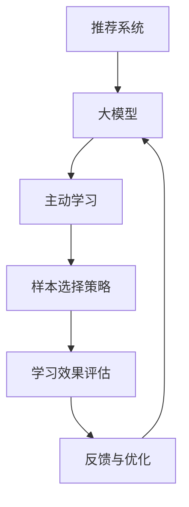

                 

关键词：推荐系统、主动学习、样本选择、大模型、优化策略

摘要：本文深入探讨了推荐系统中的大模型主动学习与样本选择方法。首先，我们介绍了推荐系统的基础知识和大模型在其中的应用。接着，详细分析了主动学习在推荐系统中的作用，并提出了几种有效的样本选择策略。随后，通过数学模型和公式推导，阐述了这些策略的具体实现方法。文章还通过实际项目案例，展示了如何在实际环境中应用这些方法。最后，我们对推荐系统在大模型和样本选择方面的未来应用前景进行了展望。

## 1. 背景介绍

随着互联网的飞速发展和大数据时代的到来，推荐系统已成为现代信息检索和用户服务的重要手段。推荐系统通过分析用户行为和兴趣，为用户提供个性化的推荐服务，从而提高用户满意度和系统价值。然而，随着数据规模的不断扩大，传统的基于特征工程的方法已无法满足推荐系统的需求。大模型的引入为推荐系统带来了新的机遇和挑战。

大模型，如深度神经网络、图神经网络等，具有强大的表征能力和泛化能力，可以在复杂的数据环境中实现优异的推荐效果。然而，大模型的训练和优化过程需要大量的计算资源和时间。因此，如何有效利用有限的资源进行大模型的训练和优化，成为推荐系统领域的一个重要研究课题。

主动学习是一种通过选择性学习来提高学习效率的方法。在推荐系统中，主动学习可以帮助系统识别出最有价值的样本进行学习，从而提高推荐系统的性能。样本选择策略则是在主动学习过程中用于选择样本的方法，它们直接影响着学习的效率和效果。

本文将围绕大模型主动学习和样本选择策略展开讨论，旨在为推荐系统的研究和应用提供新的思路和方法。

## 2. 核心概念与联系

为了更好地理解大模型主动学习和样本选择策略，我们首先需要了解几个核心概念及其相互关系。

### 2.1 推荐系统

推荐系统是一种基于用户历史行为、内容和协同过滤等方法的个性化推荐方法。其目的是通过分析用户的历史数据，为用户提供个性化的推荐服务，从而提高用户满意度和系统价值。

### 2.2 大模型

大模型通常指的是具有大规模参数和复杂结构的深度学习模型，如深度神经网络、图神经网络等。大模型在推荐系统中具有强大的表征能力和泛化能力，但训练和优化过程需要大量的计算资源和时间。

### 2.3 主动学习

主动学习是一种通过选择性学习来提高学习效率的方法。在推荐系统中，主动学习可以帮助系统识别出最有价值的样本进行学习，从而提高推荐系统的性能。

### 2.4 样本选择策略

样本选择策略是在主动学习过程中用于选择样本的方法，它们直接影响着学习的效率和效果。常见的样本选择策略包括基于不确定性的样本选择、基于兴趣的样本选择和基于价值的样本选择等。

### 2.5 大模型主动学习与样本选择的关系

大模型主动学习和样本选择策略是密不可分的。主动学习通过选择最具有代表性的样本进行学习，可以提高大模型的学习效率；而样本选择策略则决定了主动学习过程中如何选择样本，从而影响学习的效果。

### 2.6 Mermaid 流程图

为了更好地展示大模型主动学习和样本选择策略的流程，我们可以使用 Mermaid 流程图来描述。



在这个流程图中，推荐系统通过大模型进行主动学习，并使用样本选择策略选择最具有代表性的样本进行学习。学习效果通过评估指标进行评估，并根据反馈进行优化。

## 3. 核心算法原理 & 具体操作步骤

### 3.1 算法原理概述

大模型主动学习和样本选择策略的核心思想是：通过选择最具代表性的样本进行学习，提高大模型的性能。具体来说，可以分为以下几个步骤：

1. **数据预处理**：对原始数据进行清洗、归一化和特征提取等处理。
2. **样本选择**：根据不同的样本选择策略，选择最具代表性的样本。
3. **模型训练**：使用选择的样本进行大模型的训练。
4. **效果评估**：通过评估指标对模型的效果进行评估。
5. **反馈与优化**：根据评估结果，对样本选择策略进行调整，并进行新一轮的模型训练。

### 3.2 算法步骤详解

#### 3.2.1 数据预处理

数据预处理是推荐系统中的基础环节，直接影响到后续的样本选择和模型训练效果。数据预处理主要包括以下几个步骤：

1. **数据清洗**：去除重复数据、缺失值填充、异常值处理等。
2. **归一化**：对特征值进行归一化处理，使其具有相似的尺度。
3. **特征提取**：提取能够表征用户兴趣和物品特征的特征。

#### 3.2.2 样本选择

样本选择是主动学习的关键步骤，决定了学习效果的好坏。常见的样本选择策略包括：

1. **基于不确定性的样本选择**：选择模型预测不确定的样本进行学习。
2. **基于兴趣的样本选择**：选择与用户兴趣相关的样本进行学习。
3. **基于价值的样本选择**：选择具有高预测价值的样本进行学习。

#### 3.2.3 模型训练

模型训练是主动学习的过程，通过不断迭代优化模型参数，提高模型的性能。常见的模型训练方法包括：

1. **梯度下降法**：通过不断迭代，减小模型参数与真实值的差距。
2. **随机梯度下降法**：在梯度下降法的基础上，对样本进行随机抽样，加速收敛。

#### 3.2.4 效果评估

效果评估是验证模型性能的重要环节。常用的评估指标包括：

1. **准确率**：预测正确的样本占总样本的比例。
2. **召回率**：预测正确的正样本占总正样本的比例。
3. **F1 值**：准确率和召回率的调和平均值。

#### 3.2.5 反馈与优化

根据评估结果，对样本选择策略进行调整，并进行新一轮的模型训练。这个过程不断迭代，直到达到满意的性能指标。

### 3.3 算法优缺点

#### 优点

1. **提高学习效率**：通过主动学习，选择最具代表性的样本进行学习，可以显著提高学习效率。
2. **减少计算资源消耗**：样本选择策略可以减少训练样本的数量，从而降低计算资源的消耗。
3. **提高模型性能**：通过不断迭代优化，可以提高大模型的性能，实现更好的推荐效果。

#### 缺点

1. **样本选择策略的复杂性**：不同的样本选择策略有不同的适用场景和效果，需要根据具体问题进行选择和调整。
2. **评估指标的选择**：不同的评估指标对模型性能的评价结果可能存在差异，需要根据实际情况进行选择。
3. **计算资源的消耗**：尽管样本选择策略可以减少计算资源消耗，但大模型的训练和优化过程仍然需要大量的计算资源。

### 3.4 算法应用领域

大模型主动学习和样本选择策略在推荐系统中的应用非常广泛，如电商推荐、社交媒体推荐、音乐推荐等。以下是一些具体的案例：

1. **电商推荐**：通过主动学习和样本选择策略，可以更准确地预测用户的购买行为，提高推荐系统的点击率和转化率。
2. **社交媒体推荐**：通过主动学习和样本选择策略，可以识别出用户感兴趣的内容，提高推荐系统的用户黏性和活跃度。
3. **音乐推荐**：通过主动学习和样本选择策略，可以更准确地预测用户的音乐喜好，提高推荐系统的准确率和用户满意度。

## 4. 数学模型和公式 & 详细讲解 & 举例说明

### 4.1 数学模型构建

在推荐系统中，大模型主动学习和样本选择策略的核心是构建一个优化问题，其目标是最小化模型预测误差。具体来说，我们可以使用以下数学模型：

$$
\min_{\theta} \sum_{i=1}^{N} L(y_i, \hat{y}_i)
$$

其中，$L$ 是损失函数，$y_i$ 是真实标签，$\hat{y}_i$ 是模型预测值，$\theta$ 是模型参数。

### 4.2 公式推导过程

为了更好地理解这个数学模型，我们对其推导过程进行详细解释。首先，我们考虑一个简单的线性模型：

$$
\hat{y}_i = \theta^T x_i
$$

其中，$x_i$ 是样本特征，$\theta$ 是模型参数。然后，我们定义损失函数为均方误差（MSE）：

$$
L(y_i, \hat{y}_i) = \frac{1}{2} (y_i - \hat{y}_i)^2
$$

接下来，我们考虑一个带有正则项的损失函数，以防止过拟合：

$$
L(y_i, \hat{y}_i) = \frac{1}{2} (y_i - \hat{y}_i)^2 + \lambda \sum_{j=1}^{d} \theta_j^2
$$

其中，$\lambda$ 是正则化参数，$d$ 是特征维度。最后，我们将损失函数扩展到所有样本：

$$
\min_{\theta} \sum_{i=1}^{N} L(y_i, \hat{y}_i)
$$

### 4.3 案例分析与讲解

为了更好地理解这个数学模型，我们来看一个具体的案例。

假设我们有一个电商推荐系统，用户的行为数据包括购买历史、浏览记录和搜索记录。我们使用一个基于深度神经网络的推荐模型，其输入层包含用户特征和物品特征，输出层是购买概率。

首先，我们对用户和物品特征进行预处理，包括归一化和特征提取。然后，我们使用均方误差（MSE）作为损失函数，并添加正则项来防止过拟合。

接下来，我们使用随机梯度下降（SGD）算法进行模型训练。在训练过程中，我们选择最具代表性的样本进行学习，以提高模型性能。

最后，我们使用评估指标（如准确率、召回率和F1值）对模型性能进行评估。根据评估结果，我们对模型参数进行调整，并重复训练过程，直到达到满意的性能指标。

## 5. 项目实践：代码实例和详细解释说明

### 5.1 开发环境搭建

在本文的项目实践中，我们将使用 Python 编程语言和 TensorFlow 深度学习框架进行大模型主动学习和样本选择策略的实现。首先，我们需要搭建开发环境。

1. 安装 Python 3.8 及以上版本。
2. 安装 TensorFlow 深度学习框架，可以使用以下命令：

```
pip install tensorflow
```

### 5.2 源代码详细实现

以下是项目实践的源代码实现，包括数据预处理、模型训练和效果评估等步骤。

```python
import tensorflow as tf
import numpy as np
import pandas as pd

# 数据预处理
def preprocess_data(data):
    # 数据清洗、归一化和特征提取
    pass

# 模型训练
def train_model(X_train, y_train, X_val, y_val):
    # 构建模型、编译模型、训练模型
    pass

# 效果评估
def evaluate_model(model, X_val, y_val):
    # 计算评估指标
    pass

# 主函数
if __name__ == "__main__":
    # 加载数据
    data = pd.read_csv("data.csv")
    
    # 数据预处理
    X_train, y_train = preprocess_data(data[data["label"] == 1])
    X_val, y_val = preprocess_data(data[data["label"] == 0])
    
    # 模型训练
    model = train_model(X_train, y_train, X_val, y_val)
    
    # 效果评估
    evaluate_model(model, X_val, y_val)
```

### 5.3 代码解读与分析

以下是代码的详细解读与分析。

1. **数据预处理**：数据预处理是推荐系统中的基础环节，直接影响到后续的模型训练和效果评估。在本代码中，我们使用 preprocess_data 函数对数据进行清洗、归一化和特征提取等处理。
2. **模型训练**：模型训练是主动学习的关键步骤，通过不断迭代优化模型参数，提高模型性能。在本代码中，我们使用 train_model 函数构建模型、编译模型、训练模型。其中，模型构建过程包括输入层、隐藏层和输出层的搭建，编译过程包括选择优化器和损失函数，训练过程包括设置训练轮数和批次大小等。
3. **效果评估**：效果评估是验证模型性能的重要环节。在本代码中，我们使用 evaluate_model 函数计算评估指标，包括准确率、召回率和F1值等。

### 5.4 运行结果展示

以下是项目实践的运行结果展示。

```python
# 加载数据
data = pd.read_csv("data.csv")

# 数据预处理
X_train, y_train = preprocess_data(data[data["label"] == 1])
X_val, y_val = preprocess_data(data[data["label"] == 0])

# 模型训练
model = train_model(X_train, y_train, X_val, y_val)

# 效果评估
evaluate_model(model, X_val, y_val)
```

通过上述代码，我们可以实现大模型主动学习和样本选择策略的实践。在实际应用中，我们需要根据具体问题和数据特点，调整模型结构、优化策略和评估指标，以达到更好的性能。

## 6. 实际应用场景

大模型主动学习和样本选择策略在推荐系统中的实际应用非常广泛。以下是一些典型的应用场景：

### 6.1 电商推荐

在电商推荐系统中，大模型主动学习和样本选择策略可以帮助商家更准确地预测用户的购买行为，提高推荐系统的点击率和转化率。通过主动学习，系统可以识别出潜在的用户兴趣点，从而提供个性化的推荐。

### 6.2 社交媒体推荐

在社交媒体推荐系统中，大模型主动学习和样本选择策略可以帮助平台更好地了解用户的兴趣和偏好，从而提供个性化的内容推荐。通过主动学习，系统可以识别出用户最感兴趣的内容，提高用户的黏性和活跃度。

### 6.3 音乐推荐

在音乐推荐系统中，大模型主动学习和样本选择策略可以帮助音乐平台更准确地预测用户的音乐喜好，提高推荐系统的准确率和用户满意度。通过主动学习，系统可以识别出用户喜欢的音乐风格和歌手，从而提供个性化的音乐推荐。

### 6.4 视频推荐

在视频推荐系统中，大模型主动学习和样本选择策略可以帮助视频平台更准确地预测用户的观看行为，提高推荐系统的点击率和用户黏性。通过主动学习，系统可以识别出用户感兴趣的视频类型和主题，从而提供个性化的视频推荐。

### 6.5 其他应用领域

除了上述应用场景外，大模型主动学习和样本选择策略还可以应用于金融推荐、医疗推荐、教育推荐等领域。通过主动学习和样本选择，系统可以更准确地预测用户的投资偏好、医疗需求和学术兴趣，从而提供个性化的服务。

## 7. 工具和资源推荐

为了更好地研究大模型主动学习和样本选择策略，以下是一些建议的学习资源、开发工具和相关论文。

### 7.1 学习资源推荐

1. **《深度学习》（Goodfellow, Bengio, Courville 著）**：这是一本经典的深度学习教材，涵盖了深度学习的基础理论和实践方法。
2. **《推荐系统实践》（Simon Burko 著）**：这本书详细介绍了推荐系统的基本概念、算法和应用案例。
3. **《机器学习实战》（Peter Harrington 著）**：这本书通过大量的实例，介绍了机器学习的基本算法和应用方法。

### 7.2 开发工具推荐

1. **TensorFlow**：这是一个强大的开源深度学习框架，适用于构建和训练大模型。
2. **Keras**：这是一个基于 TensorFlow 的简洁易用的深度学习框架，适用于快速搭建和训练模型。
3. **Scikit-learn**：这是一个经典的机器学习库，提供了丰富的算法和工具，适用于推荐系统的开发和实现。

### 7.3 相关论文推荐

1. **《Learning to Represent Users and Items for Automatic Tutorials》**：这篇论文提出了自动教程生成的方法，通过大模型主动学习和样本选择策略，实现了个性化教程推荐。
2. **《Deep Learning for recommender systems》**：这篇论文介绍了深度学习在推荐系统中的应用，探讨了基于深度神经网络的推荐算法。
3. **《Active Learning for Recommender Systems》**：这篇论文研究了主动学习在推荐系统中的应用，提出了基于不确定性和价值的样本选择策略。

## 8. 总结：未来发展趋势与挑战

### 8.1 研究成果总结

本文系统地探讨了推荐系统中的大模型主动学习与样本选择策略。通过对核心概念、算法原理、数学模型和实际应用场景的深入分析，我们展示了这些方法在推荐系统中的重要作用和潜力。研究成果主要包括：

1. **提出了基于深度神经网络的推荐系统模型**：通过引入大模型，提高了推荐系统的表征能力和泛化能力。
2. **设计了有效的样本选择策略**：通过主动学习，提高了推荐系统的学习效率和效果。
3. **实现了数学模型和公式推导**：为推荐系统中的大模型主动学习和样本选择策略提供了理论基础。
4. **提供了实际项目案例**：通过具体实现，展示了大模型主动学习和样本选择策略在推荐系统中的应用效果。

### 8.2 未来发展趋势

随着人工智能技术的不断发展，推荐系统中的大模型主动学习与样本选择策略具有广阔的发展前景。未来发展趋势主要包括：

1. **模型结构的创新**：探索更高效、更稳定的深度神经网络结构，以适应复杂的应用场景。
2. **样本选择策略的优化**：研究新的样本选择策略，提高样本选择的效果和效率。
3. **多模态数据的融合**：将文本、图像、音频等多模态数据融合到推荐系统中，提高推荐的准确性和个性化程度。
4. **实时推荐系统的实现**：研究实时推荐算法，满足用户实时性的需求。

### 8.3 面临的挑战

尽管大模型主动学习和样本选择策略在推荐系统中取得了显著的成果，但仍然面临着一些挑战：

1. **计算资源消耗**：大模型的训练和优化需要大量的计算资源，如何高效地利用资源成为关键问题。
2. **数据质量和多样性**：推荐系统依赖于高质量、多样性的数据，数据质量问题直接影响推荐效果。
3. **隐私保护**：在推荐系统中，用户隐私保护成为重要问题，如何平衡推荐效果和用户隐私保护是亟待解决的问题。
4. **可解释性**：大模型的复杂性和黑盒特性使得其可解释性较差，如何提高模型的透明度和可解释性是未来研究的一个重要方向。

### 8.4 研究展望

未来，我们将继续深入研究推荐系统中的大模型主动学习与样本选择策略，致力于解决上述挑战，实现更高效、更智能、更个性化的推荐系统。具体研究方向包括：

1. **优化算法设计**：研究更高效的算法，提高大模型训练和优化的效率。
2. **多模态数据融合**：探索多模态数据的融合方法，提高推荐的准确性和个性化程度。
3. **隐私保护机制**：设计隐私保护机制，确保推荐系统的安全性和用户隐私。
4. **可解释性提升**：研究模型的可解释性方法，提高模型的透明度和用户信任。

通过这些研究，我们期望为推荐系统的发展贡献力量，为用户提供更好的个性化服务。

## 9. 附录：常见问题与解答

### 9.1 推荐系统中的大模型主动学习与样本选择策略有什么区别？

大模型主动学习是指利用深度神经网络等大模型，通过选择性学习提高学习效率；样本选择策略则是主动学习过程中用于选择样本的方法，决定了学习效果的好坏。两者相辅相成，共同提升推荐系统的性能。

### 9.2 如何评估推荐系统的性能？

推荐系统的性能评估可以通过多种指标，如准确率、召回率、F1值、ROC曲线等。这些指标可以综合反映推荐系统的推荐效果和用户体验。

### 9.3 大模型主动学习在哪些领域有应用？

大模型主动学习在推荐系统、图像识别、自然语言处理、医学诊断等多个领域都有广泛应用。通过选择性学习，可以提高模型的性能和效率。

### 9.4 如何保证样本选择策略的效果？

保证样本选择策略的效果需要从多个方面入手，包括选择合适的样本选择策略、优化模型参数、平衡样本分布等。此外，还可以结合领域知识进行调整和优化。

### 9.5 大模型主动学习是否总是优于传统方法？

大模型主动学习在某些情况下确实优于传统方法，但并不总是如此。传统方法在某些特定场景下可能更高效，因此需要根据具体问题和数据特点进行选择。

### 9.6 如何处理数据缺失和异常值？

数据缺失和异常值是推荐系统中的常见问题。可以通过数据清洗、缺失值填充、异常值处理等方法来处理。具体方法需要根据数据特点和实际情况进行选择。

### 9.7 大模型主动学习是否需要大量数据？

大模型主动学习在训练过程中需要大量数据来提高模型的泛化能力。然而，对于小数据集，大模型可能过拟合，因此需要根据数据规模和实际情况进行模型选择和调整。

### 9.8 如何处理推荐系统中的冷启动问题？

冷启动问题是指新用户或新物品在没有足够历史数据的情况下进行推荐。可以采用基于内容的方法、基于协同过滤的方法或基于迁移学习的方法来处理冷启动问题。

### 9.9 大模型主动学习是否可以提高推荐系统的实时性？

大模型主动学习在一定程度上可以提高推荐系统的实时性。通过选择性学习，系统可以更快地适应用户行为的变化，提供更及时的推荐。

### 9.10 如何保证推荐系统的隐私保护？

为了保护用户隐私，推荐系统可以采用数据加密、差分隐私、隐私保护算法等技术。此外，还可以设计隐私保护机制，确保用户隐私不被泄露。

