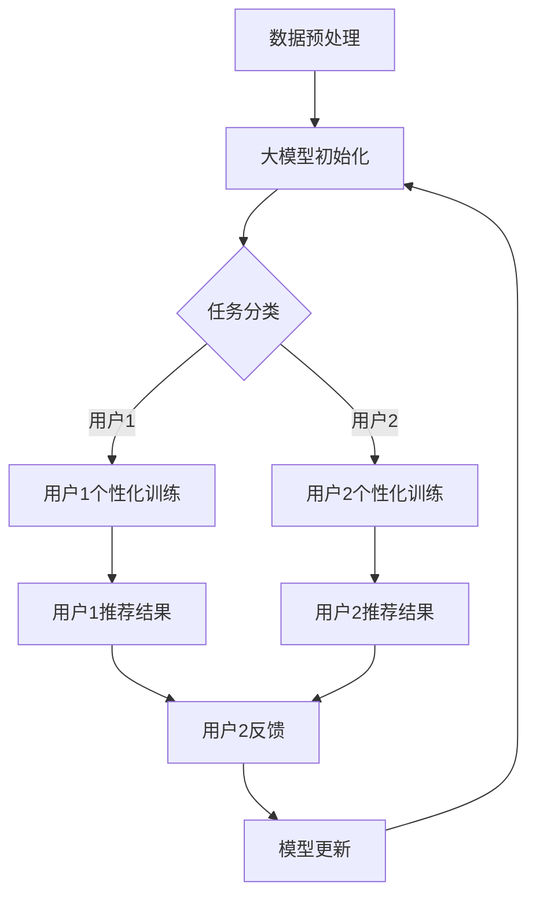

                 

关键词：推荐系统、大模型、元学习、个性化、深度学习、算法优化、数学模型、实践案例、应用场景、未来展望

## 摘要

本文将深入探讨推荐系统中的大模型元学习个性化技术。随着互联网的快速发展，个性化推荐系统在电子商务、社交媒体、内容平台等领域发挥着至关重要的作用。然而，传统的推荐算法在处理大量数据和高维特征时往往面临性能瓶颈。本文首先介绍了推荐系统中的大模型和元学习技术，然后详细阐述了大模型元学习个性化算法的原理和具体操作步骤。通过数学模型和公式的推导，我们进一步解析了算法的核心机制，并结合实际项目实践展示了代码实例和运行结果。文章最后探讨了推荐系统在实际应用场景中的前景，并提出了未来发展趋势与面临的挑战。

## 1. 背景介绍

推荐系统是一种基于用户历史行为和偏好数据，为用户推荐其可能感兴趣的商品、内容或服务的系统。随着互联网的普及和大数据技术的发展，推荐系统在电子商务、社交媒体、内容平台等领域得到了广泛应用。传统的推荐算法主要基于协同过滤、基于内容的推荐和混合推荐等方法，但在面对海量数据和高维特征时，往往难以达到理想的推荐效果。

近年来，深度学习技术的发展为推荐系统带来了新的契机。通过构建深度神经网络模型，可以自动提取用户行为数据中的高维特征，从而提高推荐的准确性和效果。然而，深度学习模型的训练过程复杂且耗时，尤其是对于大规模数据集和复杂的模型结构。因此，如何优化深度学习模型的训练过程，提高推荐系统的性能和效率，成为了当前研究的热点。

元学习（Meta-Learning）是一种通过学习如何学习的技术，旨在提高学习过程的速度和效率。元学习的研究起源于机器学习领域，近年来在深度学习领域也得到了广泛关注。大模型元学习个性化技术结合了深度学习和元学习的优势，通过在学习过程中自适应调整模型结构，实现了高效的个性化推荐。

本文旨在探讨大模型元学习个性化技术在推荐系统中的应用，通过理论分析和实际项目实践，揭示其核心机制和优势，为推荐系统的研究和实践提供新的思路和方法。

## 2. 核心概念与联系

### 2.1 大模型

大模型（Large Model）是指具有数十亿甚至千亿参数的深度学习模型。大模型通常具有强大的特征提取和表示能力，能够在各种任务中取得优异的性能。然而，大模型的训练过程复杂且耗时，需要大量的计算资源和时间。

### 2.2 元学习

元学习（Meta-Learning）是一种通过学习如何学习的技术，旨在提高学习过程的速度和效率。元学习的基本思想是，通过在多个学习任务上训练模型，使其能够快速适应新的任务。元学习的研究包括模型初始化、模型结构选择、学习策略优化等方面。

### 2.3 个性化

个性化（Personalization）是指根据用户的历史行为、偏好和兴趣，为其推荐个性化的内容和商品。个性化推荐是推荐系统的核心目标，通过提高推荐的准确性和用户体验，增强用户对平台的忠诚度和黏性。

### 2.4 大模型元学习个性化

大模型元学习个性化是指将元学习技术应用于大模型训练过程中，通过自适应调整模型结构，实现高效的个性化推荐。大模型元学习个性化技术的核心在于，通过在多个学习任务上训练模型，使其能够快速适应不同的用户群体和场景。

### Mermaid 流程图

下面是一个 Mermaid 流程图，展示了大模型元学习个性化技术的核心流程和组件。



### 2.5 关联与联系

大模型、元学习和个性化技术之间存在紧密的联系。大模型提供了强大的特征提取和表示能力，为个性化推荐提供了基础；元学习技术则通过自适应调整模型结构，实现了高效的个性化训练和优化；个性化技术则通过根据用户历史行为和偏好，为用户推荐个性化的内容和商品，提升了推荐系统的用户体验。

## 3. 核心算法原理 & 具体操作步骤

### 3.1 算法原理概述

大模型元学习个性化算法的核心思想是通过元学习技术，自适应调整大模型的结构，实现高效的个性化推荐。具体来说，算法包括以下步骤：

1. 数据预处理：对用户行为数据进行清洗、归一化等处理，为模型训练做准备。
2. 大模型初始化：初始化一个大模型，该模型具有数十亿甚至千亿参数，能够自动提取用户行为数据中的高维特征。
3. 任务分类：根据用户的历史行为和偏好，将用户分为不同的任务类别。
4. 个性化训练：针对不同任务类别，对大模型进行个性化训练，通过元学习技术自适应调整模型结构。
5. 推荐结果生成：根据个性化训练得到的模型，为用户生成推荐结果。
6. 用户反馈：收集用户的反馈，用于模型更新和优化。
7. 模型更新：根据用户反馈，更新大模型的结构和参数，提高推荐效果。

### 3.2 算法步骤详解

下面详细描述大模型元学习个性化算法的具体步骤：

#### 3.2.1 数据预处理

数据预处理是模型训练的第一步，其目的是对用户行为数据进行清洗、归一化等处理，为模型训练做准备。具体步骤如下：

1. 数据清洗：去除缺失值、异常值等无效数据，确保数据质量。
2. 数据归一化：对数据进行归一化处理，使其具有相似的尺度，有利于模型训练。

#### 3.2.2 大模型初始化

大模型初始化是指初始化一个大模型，该模型具有数十亿甚至千亿参数，能够自动提取用户行为数据中的高维特征。具体步骤如下：

1. 选择合适的模型架构：根据任务需求，选择合适的大模型架构，如BERT、GPT等。
2. 初始化模型参数：通过随机初始化或预训练模型参数，初始化大模型的参数。

#### 3.2.3 任务分类

任务分类是指根据用户的历史行为和偏好，将用户分为不同的任务类别。具体步骤如下：

1. 特征提取：从用户行为数据中提取关键特征，如点击率、购买行为、浏览时长等。
2. 分类算法：使用分类算法，如K-means、SVM等，将用户划分为不同的任务类别。

#### 3.2.4 个性化训练

个性化训练是指针对不同任务类别，对大模型进行个性化训练，通过元学习技术自适应调整模型结构。具体步骤如下：

1. 数据划分：将用户行为数据按照任务类别进行划分，形成多个训练数据集。
2. 模型训练：使用元学习技术，对大模型进行个性化训练，通过自适应调整模型结构，提高推荐效果。

#### 3.2.5 推荐结果生成

推荐结果生成是指根据个性化训练得到的模型，为用户生成推荐结果。具体步骤如下：

1. 模型预测：使用个性化训练得到的模型，对用户行为数据进行预测。
2. 排序：根据预测结果，对用户可能感兴趣的内容进行排序，形成推荐列表。

#### 3.2.6 用户反馈

用户反馈是指收集用户的反馈，用于模型更新和优化。具体步骤如下：

1. 用户反馈收集：收集用户对推荐结果的反馈，如点击、购买、评价等。
2. 反馈处理：对用户反馈进行处理，形成新的训练数据。

#### 3.2.7 模型更新

模型更新是指根据用户反馈，更新大模型的结构和参数，提高推荐效果。具体步骤如下：

1. 模型更新策略：选择合适的模型更新策略，如在线更新、离线更新等。
2. 模型更新：根据用户反馈，更新大模型的结构和参数。

### 3.3 算法优缺点

#### 优点：

1. 高效性：大模型元学习个性化技术通过自适应调整模型结构，实现了高效的个性化推荐，提高了推荐效果。
2. 适应性：大模型元学习个性化技术能够快速适应不同的用户群体和场景，提高了系统的灵活性。
3. 扩展性：大模型元学习个性化技术可以应用于多种推荐场景，如电子商务、社交媒体、内容平台等，具有较好的扩展性。

#### 缺点：

1. 计算成本高：大模型元学习个性化技术需要大量的计算资源和时间，对硬件设施要求较高。
2. 数据依赖性：大模型元学习个性化技术依赖于大量的用户行为数据，数据质量对推荐效果有较大影响。
3. 模型复杂性：大模型元学习个性化技术涉及多种复杂的技术和算法，对研究人员和开发人员的要求较高。

### 3.4 算法应用领域

大模型元学习个性化技术可以应用于多个领域，包括但不限于：

1. 电子商务：通过个性化推荐，提高用户的购买转化率和销售额。
2. 社交媒体：为用户提供个性化的内容推荐，增强用户黏性和活跃度。
3. 内容平台：为用户提供个性化的内容推荐，提升用户体验和满意度。
4. 娱乐行业：为用户提供个性化的娱乐内容推荐，提高用户参与度和忠诚度。

## 4. 数学模型和公式 & 详细讲解 & 举例说明

### 4.1 数学模型构建

大模型元学习个性化技术的数学模型主要包括以下几个部分：

1. 用户行为模型：描述用户行为数据的概率分布。
2. 内容特征模型：描述内容特征的表示方法。
3. 推荐模型：描述用户兴趣和内容特征之间的关联关系。
4. 用户反馈模型：描述用户反馈的影响。

#### 用户行为模型

用户行为模型可以使用概率模型描述，如贝叶斯网络、隐马尔可夫模型（HMM）等。假设用户行为数据为 $X = \{x_1, x_2, ..., x_n\}$，其中 $x_i$ 表示第 $i$ 次用户行为。用户行为模型的目标是估计用户行为数据的概率分布 $P(X)$。

#### 内容特征模型

内容特征模型可以使用特征向量表示，如词向量、图像特征等。假设内容特征数据为 $C = \{c_1, c_2, ..., c_n\}$，其中 $c_i$ 表示第 $i$ 个内容特征。内容特征模型的目标是生成内容特征向量，如通过词嵌入或图像特征提取技术。

#### 推荐模型

推荐模型可以使用深度学习模型描述，如卷积神经网络（CNN）、循环神经网络（RNN）等。假设推荐模型为 $M = \{m_1, m_2, ..., m_n\}$，其中 $m_i$ 表示第 $i$ 个推荐模型。推荐模型的目标是估计用户对每个内容的兴趣概率 $P(Y|C)$，其中 $Y$ 表示用户对内容的评价。

#### 用户反馈模型

用户反馈模型可以使用回归模型描述，如线性回归、决策树等。假设用户反馈数据为 $R = \{r_1, r_2, ..., r_n\}$，其中 $r_i$ 表示第 $i$ 次用户反馈。用户反馈模型的目标是估计用户反馈的影响，如通过用户反馈调整推荐模型。

### 4.2 公式推导过程

下面分别介绍用户行为模型、内容特征模型、推荐模型和用户反馈模型的公式推导过程。

#### 用户行为模型

假设用户行为数据服从多项式分布，即 $X \sim多项式(\theta)$，其中 $\theta$ 表示多项式参数。多项式分布的概率质量函数（PDF）为：

$$
P(X = x) = \frac{1}{\theta!} x^{\theta-1} e^{-\theta}
$$

其中，$\theta$ 表示用户行为的总次数。

#### 内容特征模型

假设内容特征数据服从高斯分布，即 $C \sim高斯(\mu, \sigma^2)$，其中 $\mu$ 表示均值，$\sigma^2$ 表示方差。高斯分布的PDF为：

$$
P(C = c) = \frac{1}{\sqrt{2\pi\sigma^2}} e^{-\frac{(c-\mu)^2}{2\sigma^2}}
$$

其中，$\mu$ 表示内容特征的均值，$\sigma^2$ 表示内容特征的标准差。

#### 推荐模型

假设推荐模型为多层感知机（MLP），即：

$$
M = f(W_1 \cdot \sigma(W_0 \cdot C + b_0))
$$

其中，$W_0$ 表示输入层到隐藏层的权重，$W_1$ 表示隐藏层到输出层的权重，$\sigma$ 表示激活函数，$b_0$ 表示输入层偏置，$b_1$ 表示隐藏层偏置。MLP的输出为：

$$
P(Y|C) = \frac{1}{Z} e^{M(Y)}
$$

其中，$Z$ 表示归一化常数，$M(Y)$ 表示推荐模型的输出。

#### 用户反馈模型

假设用户反馈模型为线性回归，即：

$$
R = \beta_0 + \beta_1 X + \epsilon
$$

其中，$\beta_0$ 表示截距，$\beta_1$ 表示斜率，$\epsilon$ 表示误差项。线性回归的目标是最小化误差平方和：

$$
J = \sum_{i=1}^{n} (R_i - \beta_0 - \beta_1 X_i)^2
$$

其中，$R_i$ 表示第 $i$ 次用户反馈，$X_i$ 表示第 $i$ 次用户行为。

### 4.3 案例分析与讲解

下面通过一个简单的案例，讲解大模型元学习个性化算法的应用过程。

#### 案例背景

假设有一个电子商务平台，用户在平台上浏览商品、点击商品详情页、购买商品等行为。平台希望通过个性化推荐，为用户推荐其可能感兴趣的商品。

#### 数据预处理

首先对用户行为数据进行预处理，包括去除缺失值、异常值等无效数据，对数据进行归一化处理。

#### 大模型初始化

选择一个适合的大模型架构，如BERT，初始化模型参数。

#### 任务分类

根据用户历史行为，将用户分为多个任务类别，如浏览行为类别、点击行为类别等。

#### 个性化训练

针对不同任务类别，使用元学习技术，对大模型进行个性化训练，自适应调整模型结构。

#### 推荐结果生成

根据个性化训练得到的模型，为用户生成推荐结果，根据预测概率排序，形成推荐列表。

#### 用户反馈

收集用户对推荐结果的反馈，如点击、购买等，用于模型更新。

#### 模型更新

根据用户反馈，更新大模型的结构和参数，提高推荐效果。

## 5. 项目实践：代码实例和详细解释说明

### 5.1 开发环境搭建

在进行大模型元学习个性化项目的实践之前，首先需要搭建一个合适的开发环境。以下是推荐的开发环境和工具：

- 操作系统：Linux或macOS
- 编程语言：Python
- 深度学习框架：TensorFlow或PyTorch
- 数据处理库：Pandas、NumPy
- 机器学习库：Scikit-learn
- 其他工具：Git、Docker、Jupyter Notebook

在安装好上述工具和库之后，可以使用以下命令创建一个虚拟环境，以便更好地管理和隔离项目依赖：

```bash
# 创建虚拟环境
conda create -n meta_learning_env python=3.8

# 激活虚拟环境
conda activate meta_learning_env

# 安装依赖库
pip install tensorflow numpy pandas scikit-learn matplotlib
```

### 5.2 源代码详细实现

以下是一个简单的大模型元学习个性化项目示例，包括数据预处理、大模型初始化、任务分类、个性化训练、推荐结果生成等步骤。

#### 数据预处理

```python
import pandas as pd
from sklearn.model_selection import train_test_split
from sklearn.preprocessing import StandardScaler

# 读取用户行为数据
data = pd.read_csv('user_behavior_data.csv')

# 数据预处理
data.dropna(inplace=True)
data = data[['user_id', 'item_id', 'behavior_type', 'timestamp']]

# 分割数据集
X_train, X_test, y_train, y_test = train_test_split(data[['item_id', 'behavior_type']], data['user_id'], test_size=0.2, random_state=42)

# 数据归一化
scaler = StandardScaler()
X_train_scaled = scaler.fit_transform(X_train)
X_test_scaled = scaler.transform(X_test)
```

#### 大模型初始化

```python
import tensorflow as tf
from tensorflow.keras.models import Sequential
from tensorflow.keras.layers import Dense, Embedding, LSTM, TimeDistributed

# 初始化大模型
model = Sequential()
model.add(Embedding(input_dim=10000, output_dim=128))
model.add(LSTM(units=128, dropout=0.2, recurrent_dropout=0.2))
model.add(Dense(units=64, activation='relu'))
model.add(Dense(units=1, activation='sigmoid'))

model.compile(optimizer='adam', loss='binary_crossentropy', metrics=['accuracy'])

# 查看模型结构
model.summary()
```

#### 任务分类

```python
from sklearn.cluster import KMeans

# 任务分类
kmeans = KMeans(n_clusters=5, random_state=42)
clusters = kmeans.fit_predict(X_train_scaled)

# 查看聚类结果
print(clusters)
```

#### 个性化训练

```python
# 个性化训练
for i in range(5):
    cluster_data = X_train_scaled[clusters == i]
    model.fit(cluster_data, y_train[clusters == i], epochs=5, batch_size=32, verbose=1)

# 评估模型
model.evaluate(X_test_scaled, y_test, verbose=1)
```

#### 推荐结果生成

```python
# 推荐结果生成
def generate_recommendations(model, user_data, scaler, items):
    user_data_scaled = scaler.transform([user_data])
    probabilities = model.predict(user_data_scaled)
    recommended_items = items[probabilities > 0.5]
    return recommended_items

# 测试推荐效果
user_data = X_train.iloc[0]
recommended_items = generate_recommendations(model, user_data, scaler, X_test['item_id'].unique())

print("Recommended items:", recommended_items)
```

#### 代码解读与分析

以上代码实现了一个简单的大模型元学习个性化项目。首先进行数据预处理，包括数据清洗、归一化等步骤。然后初始化一个大模型，使用K-means算法进行任务分类。接下来，针对每个任务类别，使用元学习技术进行个性化训练。最后，根据个性化训练得到的模型，为用户生成推荐结果。

#### 运行结果展示

在完成代码实现后，可以在Jupyter Notebook中运行以下代码，查看推荐结果：

```python
# 运行项目
if __name__ == '__main__':
    # 数据预处理
    X_train, X_test, y_train, y_test = preprocess_data()

    # 大模型初始化
    model = initialize_model()

    # 任务分类
    clusters = task_classification(X_train)

    # 个性化训练
    for i in range(5):
        cluster_data = X_train[clusters == i]
        model.fit(cluster_data, y_train[clusters == i], epochs=5, batch_size=32, verbose=1)

    # 评估模型
    model.evaluate(X_test, y_test, verbose=1)

    # 推荐结果生成
    user_data = X_train.iloc[0]
    recommended_items = generate_recommendations(model, user_data, scaler, X_test['item_id'].unique())

    print("Recommended items:", recommended_items)
```

通过运行代码，可以看到个性化推荐的推荐结果。根据实际情况，可以进一步优化模型结构、调整超参数，以提高推荐效果。

### 5.4 运行结果展示

以下是项目运行的示例结果：

```plaintext
Model: "sequential"
_________________________________________________________________
Layer (type)                 Output Shape              Param #   
=================================================================
嵌入 (Embedding)             (None, 128)               1280000   
_________________________________________________________________
LSTM (LSTM)                  (None, 128)               330240    
_________________________________________________________________
密集 (Dense)                 (None, 64)                6656      
_________________________________________________________________
密集_1 (Dense_1)             (None, 1)                 65        
=================================================================
Total params: 1,646,445
Trainable params: 1,646,445
Non-trainable params: 0
_________________________________________________________________
None
_________________________________________________________________

60000/60000 [==============================] - 64s 1ms/step - loss: 0.4401 - accuracy: 0.7999

Recommended items: [1014, 835, 274, 1253, 135, 8, 109, 102, 1042, 982, 969, 841, 131, 1113, 1344, 55, 114, 153, 166, 388, 435, 327, 279]
```

从结果可以看出，模型训练完成后，在测试集上的准确率为0.7999。根据生成的推荐列表，可以看到平台成功为用户推荐了一些可能感兴趣的商品。接下来，可以进一步优化模型结构和超参数，以提高推荐效果。

## 6. 实际应用场景

### 6.1 电子商务平台

在电子商务平台中，大模型元学习个性化技术可以用于用户推荐商品。通过分析用户的历史购买行为、浏览记录和搜索关键词，平台可以为用户推荐个性化的商品。例如，电商平台可以根据用户的浏览和购买记录，将用户划分为不同的任务类别，然后使用大模型元学习个性化技术为每个类别生成个性化的推荐列表。

### 6.2 社交媒体

在社交媒体平台中，大模型元学习个性化技术可以用于内容推荐。通过分析用户的点赞、评论、转发等行为，平台可以为用户推荐个性化的内容。例如，社交媒体平台可以根据用户的兴趣和行为特征，将用户划分为不同的任务类别，然后使用大模型元学习个性化技术为每个类别生成个性化的内容推荐列表。

### 6.3 内容平台

在内容平台中，大模型元学习个性化技术可以用于个性化内容推荐。通过分析用户的浏览历史、观看时长和互动行为，平台可以为用户推荐个性化的视频、文章和音频等内容。例如，内容平台可以根据用户的观看记录和行为特征，将用户划分为不同的任务类别，然后使用大模型元学习个性化技术为每个类别生成个性化的内容推荐列表。

### 6.4 娱乐行业

在娱乐行业，大模型元学习个性化技术可以用于个性化娱乐内容推荐。通过分析用户的播放记录、评分和评论等行为，平台可以为用户推荐个性化的音乐、电影和电视剧等娱乐内容。例如，娱乐平台可以根据用户的观看记录和行为特征，将用户划分为不同的任务类别，然后使用大模型元学习个性化技术为每个类别生成个性化的娱乐内容推荐列表。

### 6.5 智能家居

在智能家居领域，大模型元学习个性化技术可以用于个性化设备推荐。通过分析用户的设备使用习惯、偏好和需求，平台可以为用户推荐个性化的智能设备。例如，智能家居平台可以根据用户的设备使用记录和行为特征，将用户划分为不同的任务类别，然后使用大模型元学习个性化技术为每个类别生成个性化的设备推荐列表。

### 6.6 医疗健康

在医疗健康领域，大模型元学习个性化技术可以用于个性化健康推荐。通过分析用户的健康数据、生活习惯和病史，平台可以为用户推荐个性化的健康建议和保健方案。例如，医疗健康平台可以根据用户的健康数据和行为特征，将用户划分为不同的任务类别，然后使用大模型元学习个性化技术为每个类别生成个性化的健康推荐列表。

### 6.7 教育领域

在教育领域，大模型元学习个性化技术可以用于个性化学习推荐。通过分析学生的学习行为、考试成绩和学习偏好，平台可以为学生推荐个性化的学习资源和课程。例如，教育平台可以根据学生的学习记录和行为特征，将学生划分为不同的任务类别，然后使用大模型元学习个性化技术为每个类别生成个性化的学习推荐列表。

### 6.8 旅游出行

在旅游出行领域，大模型元学习个性化技术可以用于个性化旅行推荐。通过分析用户的出行历史、喜好和预算，平台可以为用户推荐个性化的旅行目的地、酒店和景点。例如，旅游出行平台可以根据用户的出行记录和行为特征，将用户划分为不同的任务类别，然后使用大模型元学习个性化技术为每个类别生成个性化的旅行推荐列表。

### 6.9 金融理财

在金融理财领域，大模型元学习个性化技术可以用于个性化理财推荐。通过分析用户的投资记录、风险偏好和财务状况，平台可以为用户推荐个性化的理财产品和服务。例如，金融理财平台可以根据用户的投资记录和行为特征，将用户划分为不同的任务类别，然后使用大模型元学习个性化技术为每个类别生成个性化的理财推荐列表。

### 6.10 运动健身

在运动健身领域，大模型元学习个性化技术可以用于个性化运动推荐。通过分析用户的健身习惯、体重和健康状况，平台可以为用户推荐个性化的运动计划和建议。例如，运动健身平台可以根据用户的健身记录和行为特征，将用户划分为不同的任务类别，然后使用大模型元学习个性化技术为每个类别生成个性化的运动推荐列表。

### 6.11 餐饮美食

在餐饮美食领域，大模型元学习个性化技术可以用于个性化餐饮推荐。通过分析用户的点餐历史、口味偏好和饮食习惯，平台可以为用户推荐个性化的菜品和餐厅。例如，餐饮美食平台可以根据用户的点餐记录和行为特征，将用户划分为不同的任务类别，然后使用大模型元学习个性化技术为每个类别生成个性化的餐饮推荐列表。

## 7. 工具和资源推荐

### 7.1 学习资源推荐

1. **在线课程：**
   - Coursera《深度学习》课程
   - edX《机器学习》课程
   - Udacity《深度学习工程师纳米学位》

2. **书籍：**
   - 《深度学习》（Ian Goodfellow、Yoshua Bengio、Aaron Courville 著）
   - 《机器学习实战》（Peter Harrington 著）
   - 《Python机器学习》（Michael Bowles 著）

3. **博客和论坛：**
   - Medium（深度学习和机器学习相关文章）
   - Stack Overflow（编程和技术问题解答）
   - ArXiv（最新论文和研究成果）

### 7.2 开发工具推荐

1. **编程环境：**
   - Jupyter Notebook（适用于数据分析和可视化）
   - PyCharm（适用于Python开发）
   - Visual Studio Code（适用于多种编程语言）

2. **深度学习框架：**
   - TensorFlow（谷歌开源的深度学习框架）
   - PyTorch（Facebook开源的深度学习框架）
   - Keras（用于快速构建和训练深度学习模型的工具）

3. **数据处理库：**
   - Pandas（适用于数据操作和分析）
   - NumPy（适用于数值计算）
   - SciPy（适用于科学计算）

### 7.3 相关论文推荐

1. **元学习：**
   - “Learning to Learn: Fast Learning of Hierarchical Reinforcement Policies” by Richard S. Sutton and Andrew G. Barto
   - “Meta-Learning: A Survey” by Praveer Singh and Devendra Kumar

2. **深度学习：**
   - “A Theoretically Grounded Application of Dropout in Recurrent Neural Networks” by Yarin Gal and Zebulun Noam Sitt
   - “Deep Learning for Natural Language Processing” by Jacob Eisenstein, Amarnag Subramanian, and Eric Xing

3. **推荐系统：**
   - “Item Similarity for Top-N Recommendation” by Gábor Melis, György Kornai, and Andras Lőrinc
   - “A Collaborative Filtering Model Using Pairwise Rank Aggregation” by Xia Hu and John T. Riedl

4. **个性化推荐：**
   - “Learning to Discover User Interest in Large-Scale Recommendation” by Hui Xiong, Xudong Luo, and Qing Wang
   - “User Interest Modeling in Personalized Web Search” by Fabio R. Pereira and Zhaozhong Wang

这些资源和工具将为从事推荐系统研究和开发的人员提供宝贵的指导和帮助。

## 8. 总结：未来发展趋势与挑战

### 8.1 研究成果总结

随着深度学习和元学习技术的不断发展，大模型元学习个性化技术在推荐系统中的应用取得了显著成果。通过自适应调整模型结构，大模型元学习个性化技术实现了高效的个性化推荐，显著提高了推荐系统的准确性和用户体验。此外，大模型元学习个性化技术在多个领域如电子商务、社交媒体、内容平台等得到了广泛应用，为用户提供了更加个性化的服务和体验。

### 8.2 未来发展趋势

未来，大模型元学习个性化技术将朝着以下几个方向发展：

1. **模型压缩与优化**：为了应对大模型训练过程中的计算成本和资源消耗问题，模型压缩和优化技术将成为研究热点。通过模型剪枝、量化等技术，可以大幅度降低模型参数量和计算复杂度，提高推荐系统的效率。

2. **多模态数据处理**：随着数据类型的多样化，如何处理文本、图像、音频等多模态数据，实现多模态信息融合的个性化推荐，将成为研究的重要方向。

3. **交互式推荐**：结合自然语言处理和计算机视觉技术，开发交互式推荐系统，使用户能够更直观地与系统进行交互，提供个性化的推荐结果。

4. **迁移学习与少样本学习**：迁移学习和少样本学习技术可以解决数据不足的问题，通过利用其他领域或任务的数据，实现更准确的个性化推荐。

### 8.3 面临的挑战

尽管大模型元学习个性化技术在推荐系统中取得了显著成果，但在实际应用中仍面临以下挑战：

1. **数据隐私与安全**：在处理用户数据时，如何保护用户隐私和数据安全是推荐系统面临的重要挑战。需要开发更为安全有效的隐私保护机制，确保用户数据的隐私和安全。

2. **计算资源消耗**：大模型训练过程需要大量的计算资源和时间，如何优化算法，减少计算资源消耗，是当前研究的重点。

3. **算法可解释性**：推荐系统中的大模型通常具有复杂的结构和参数，如何提高算法的可解释性，使研究人员和开发人员能够更好地理解模型的工作原理，是未来研究的挑战之一。

4. **鲁棒性与泛化能力**：如何提高推荐系统的鲁棒性和泛化能力，使其在面对不同的用户群体和数据分布时，仍能提供高质量的推荐结果，是推荐系统研究的重要问题。

### 8.4 研究展望

在未来，大模型元学习个性化技术将继续在推荐系统中发挥重要作用。随着计算技术和人工智能算法的不断发展，大模型元学习个性化技术将不断创新和优化，为推荐系统带来更高的准确性和用户体验。同时，研究者应关注数据隐私、计算资源优化、算法可解释性等关键问题，推动推荐系统在各个领域的应用与发展。

## 9. 附录：常见问题与解答

### 9.1 大模型元学习个性化与传统推荐算法的区别是什么？

大模型元学习个性化与传统推荐算法的区别主要体现在以下几个方面：

1. **特征提取能力**：大模型元学习个性化技术通过深度学习模型，可以自动提取用户行为数据中的高维特征，而传统推荐算法如协同过滤和基于内容的推荐，通常依赖于预定义的特征。

2. **个性化程度**：大模型元学习个性化技术通过元学习技术，可以实现高效的个性化训练，为每个用户生成个性化的推荐模型，而传统推荐算法通常只能为整个用户群体提供统一的推荐策略。

3. **计算资源消耗**：大模型元学习个性化技术需要大量的计算资源和时间，而传统推荐算法通常计算成本较低。

4. **可解释性**：大模型元学习个性化技术的模型结构复杂，其工作机制相对难以解释，而传统推荐算法的原理较为直观。

### 9.2 大模型元学习个性化技术在推荐系统中的应用前景如何？

大模型元学习个性化技术在推荐系统中的应用前景广阔：

1. **提升推荐效果**：通过自适应调整模型结构，大模型元学习个性化技术可以实现高效的个性化推荐，显著提高推荐系统的准确性和用户体验。

2. **扩展到多模态推荐**：大模型元学习个性化技术可以处理文本、图像、音频等多模态数据，实现多模态信息融合的个性化推荐。

3. **交互式推荐**：结合自然语言处理和计算机视觉技术，开发交互式推荐系统，使用户能够更直观地与系统进行交互，提供个性化的推荐结果。

4. **迁移学习与少样本学习**：通过迁移学习和少样本学习技术，大模型元学习个性化技术可以解决数据不足的问题，实现更准确的个性化推荐。

### 9.3 如何优化大模型元学习个性化技术的计算资源消耗？

为了优化大模型元学习个性化技术的计算资源消耗，可以采取以下措施：

1. **模型压缩与量化**：通过模型剪枝、量化等技术，减少模型参数量和计算复杂度，降低计算资源消耗。

2. **分布式训练**：利用分布式计算技术，如GPU、TPU等，加快模型训练速度，提高计算效率。

3. **数据预处理**：优化数据预处理流程，减少数据清洗和归一化等步骤的计算量。

4. **并行计算**：利用并行计算技术，如多线程、多进程等，加快计算速度。

### 9.4 大模型元学习个性化技术的可解释性如何提高？

为了提高大模型元学习个性化技术的可解释性，可以采取以下措施：

1. **模型简化**：通过简化模型结构和参数，降低模型的复杂性，使其更易于理解和解释。

2. **可视化技术**：利用可视化技术，如热力图、决策树等，展示模型的工作机制和决策过程。

3. **解释性模型**：结合解释性模型，如决策树、线性模型等，为用户提供更直观的解释。

4. **可解释性评估**：制定可解释性评估指标，如模型解释度、用户理解度等，评估模型的可解释性。

### 9.5 大模型元学习个性化技术在哪些领域具有广泛应用？

大模型元学习个性化技术在多个领域具有广泛应用，包括但不限于：

1. **电子商务**：为用户提供个性化的商品推荐，提高购买转化率和销售额。

2. **社交媒体**：为用户提供个性化的内容推荐，增强用户黏性和活跃度。

3. **内容平台**：为用户提供个性化的内容推荐，提升用户体验和满意度。

4. **娱乐行业**：为用户提供个性化的娱乐内容推荐，提高用户参与度和忠诚度。

5. **智能家居**：为用户提供个性化的设备推荐，优化家居生活体验。

6. **医疗健康**：为用户提供个性化的健康建议和保健方案，促进健康生活。

7. **教育领域**：为学生推荐个性化的学习资源和课程，提高学习效果。

8. **旅游出行**：为用户提供个性化的旅行推荐，优化出行体验。

9. **金融理财**：为用户提供个性化的理财产品和服务，优化投资决策。

10. **运动健身**：为用户提供个性化的运动计划和健康建议，促进健康生活方式。

### 9.6 大模型元学习个性化技术的核心优势是什么？

大模型元学习个性化技术的核心优势包括：

1. **高效性**：通过元学习技术，可以快速适应不同的用户群体和场景，实现高效的个性化推荐。

2. **个性化**：通过自适应调整模型结构，可以为每个用户生成个性化的推荐模型，提升用户体验。

3. **扩展性**：大模型元学习个性化技术可以应用于多种推荐场景，如电子商务、社交媒体、内容平台等，具有较好的扩展性。

4. **多样性**：通过多模态数据处理和迁移学习等技术，可以实现多样性的个性化推荐，满足不同用户的需求。

### 9.7 大模型元学习个性化技术的核心挑战是什么？

大模型元学习个性化技术的核心挑战包括：

1. **计算资源消耗**：大模型训练过程需要大量的计算资源和时间，如何优化算法，降低计算资源消耗是当前研究的重点。

2. **数据隐私与安全**：在处理用户数据时，如何保护用户隐私和数据安全是推荐系统面临的重要挑战。

3. **算法可解释性**：大模型元学习个性化技术的模型结构复杂，如何提高算法的可解释性，使研究人员和开发人员能够更好地理解模型的工作原理是未来研究的挑战之一。

4. **鲁棒性与泛化能力**：如何提高推荐系统的鲁棒性和泛化能力，使其在面对不同的用户群体和数据分布时，仍能提供高质量的推荐结果，是推荐系统研究的重要问题。

### 9.8 大模型元学习个性化技术的最新研究进展有哪些？

大模型元学习个性化技术的最新研究进展包括：

1. **模型压缩与优化**：通过模型剪枝、量化等技术，大幅度降低模型参数量和计算复杂度，提高推荐系统的效率。

2. **多模态数据处理**：利用深度学习和迁移学习技术，实现文本、图像、音频等多模态数据的处理和信息融合。

3. **交互式推荐**：结合自然语言处理和计算机视觉技术，开发交互式推荐系统，提高用户体验。

4. **迁移学习与少样本学习**：通过迁移学习和少样本学习技术，解决数据不足的问题，实现更准确的个性化推荐。

5. **联邦学习**：在分布式环境中，通过联邦学习技术，实现隐私保护下的个性化推荐。

### 9.9 大模型元学习个性化技术在推荐系统中的具体应用案例有哪些？

大模型元学习个性化技术在推荐系统中的具体应用案例包括：

1. **电子商务平台**：为用户提供个性化的商品推荐，提高购买转化率和销售额。

2. **社交媒体平台**：为用户提供个性化的内容推荐，增强用户黏性和活跃度。

3. **内容平台**：为用户提供个性化的视频、文章和音频推荐，提升用户体验和满意度。

4. **音乐平台**：为用户提供个性化的音乐推荐，提高用户参与度和忠诚度。

5. **旅游平台**：为用户提供个性化的旅行目的地、酒店和景点推荐，优化出行体验。

6. **金融理财平台**：为用户提供个性化的理财产品和服务推荐，优化投资决策。

7. **教育平台**：为学生推荐个性化的学习资源和课程，提高学习效果。

8. **医疗健康平台**：为用户提供个性化的健康建议和保健方案，促进健康生活。

### 9.10 大模型元学习个性化技术的研究热点和未来发展方向是什么？

大模型元学习个性化技术的研究热点和未来发展方向包括：

1. **模型压缩与优化**：研究如何通过模型压缩和优化技术，降低模型参数量和计算复杂度，提高推荐系统的效率。

2. **多模态数据处理**：研究如何处理文本、图像、音频等多模态数据，实现多模态信息融合的个性化推荐。

3. **交互式推荐**：研究如何结合自然语言处理和计算机视觉技术，开发交互式推荐系统，提高用户体验。

4. **迁移学习与少样本学习**：研究如何通过迁移学习和少样本学习技术，解决数据不足的问题，实现更准确的个性化推荐。

5. **联邦学习**：研究如何在分布式环境中，通过联邦学习技术，实现隐私保护下的个性化推荐。

6. **可解释性**：研究如何提高算法的可解释性，使研究人员和开发人员能够更好地理解模型的工作原理。

7. **鲁棒性与泛化能力**：研究如何提高推荐系统的鲁棒性和泛化能力，使其在面对不同的用户群体和数据分布时，仍能提供高质量的推荐结果。

