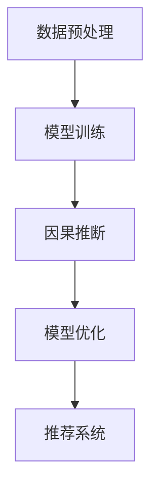

                 

关键词：推荐系统、大模型、因果推断、干预、机器学习、数据挖掘、算法优化、应用场景

摘要：随着互联网的迅猛发展，个性化推荐系统已成为现代信息检索的重要工具。然而，推荐系统的准确性和可靠性受到了数据噪声、算法缺陷等因素的制约。本文将探讨在推荐系统中引入大模型因果推断与干预的方法，以提高推荐系统的性能和用户体验。我们将首先介绍推荐系统的基本概念和传统方法，然后深入探讨大模型因果推断的理论基础，最后通过具体实例展示大模型因果推断与干预在实际推荐系统中的应用。

## 1. 背景介绍

推荐系统（Recommender Systems）是信息检索和机器学习领域的热门研究方向。其核心目标是根据用户的历史行为、兴趣偏好和上下文信息，向用户推荐他们可能感兴趣的商品、内容或服务。推荐系统在电子商务、社交媒体、在线视频、新闻资讯等领域得到了广泛应用，极大地提升了用户体验和商业价值。

传统的推荐系统主要采用基于协同过滤（Collaborative Filtering）、基于内容（Content-based Filtering）和混合方法（Hybrid Methods）。然而，这些方法在处理高维度数据、用户稀疏数据和冷启动问题方面存在局限性。此外，推荐系统的透明性和可解释性也受到广泛关注。为了解决这些问题，研究人员开始探索更高级的机器学习模型，如深度学习（Deep Learning）。

大模型（Large-scale Models）是指具有数十亿甚至数万亿参数的神经网络模型，如Transformer、BERT等。这些模型在自然语言处理、计算机视觉等任务中取得了显著成果。然而，如何将大模型应用于推荐系统，特别是进行因果推断和干预，仍是一个具有挑战性的问题。

本文旨在探讨以下问题：

- 如何在大模型中实现因果推断？
- 大模型因果推断与传统推荐系统方法的优劣如何？
- 大模型因果推断在推荐系统中的应用场景有哪些？

## 2. 核心概念与联系

### 2.1 推荐系统基本概念

推荐系统主要包括以下三个关键组件：

- **用户-物品评分矩阵**：记录用户对物品的评分或交互行为，如点击、购买等。
- **推荐算法**：根据用户历史行为和物品特征，计算用户对未知物品的兴趣度，生成推荐列表。
- **用户反馈**：用户对推荐结果的反馈，用于调整推荐算法，提高推荐质量。

### 2.2 大模型因果推断

大模型因果推断是指利用大型神经网络模型来推断用户和物品之间的因果关系。与传统相关性分析不同，因果推断旨在揭示变量之间的因果关系，而不是简单的相关性。大模型因果推断通常包括以下步骤：

1. **数据预处理**：将用户和物品的特征数据进行编码和标准化。
2. **模型训练**：使用大规模数据集训练神经网络模型，以预测用户对物品的兴趣度。
3. **因果推断**：通过干预某些用户或物品的特征，观察推荐结果的变化，推断因果关系。
4. **模型优化**：根据因果推断结果，调整模型参数，提高推荐系统的性能。

### 2.3 Mermaid 流程图

下面是一个简单的Mermaid流程图，展示了大模型因果推断的基本步骤：



## 3. 核心算法原理 & 具体操作步骤

### 3.1 算法原理概述

大模型因果推断的核心思想是通过干预用户或物品的特征，观察推荐结果的变化，从而推断因果关系。具体来说，我们可以采用以下步骤：

1. **干预设定**：选择一个或多个用户或物品特征进行干预。
2. **模型预测**：在干预前和干预后，使用大模型预测用户对物品的兴趣度。
3. **对比分析**：比较干预前后的预测结果，分析干预效果。
4. **因果推断**：根据干预效果，判断干预特征与推荐结果之间的因果关系。

### 3.2 算法步骤详解

1. **干预设定**：

   在干预设定阶段，我们需要选择一个或多个用户或物品特征进行干预。这些特征可以是用户的年龄、性别、地理位置，或者物品的类别、价格等。干预设定可以通过以下方法实现：

   - **基于业务规则**：根据业务需求，选择与推荐结果密切相关的特征进行干预。
   - **基于数据特征**：分析用户和物品的特征数据，选择具有代表性的特征进行干预。

2. **模型预测**：

   在干预前和干预后，我们需要使用大模型预测用户对物品的兴趣度。这里可以使用预训练的大模型，如BERT、Transformer等。具体步骤如下：

   - **特征编码**：将用户和物品的特征数据进行编码和标准化，以便输入到神经网络模型中。
   - **模型训练**：使用大规模数据集训练神经网络模型，以预测用户对物品的兴趣度。
   - **模型评估**：使用验证集和测试集评估模型性能，确保预测结果的准确性。

3. **对比分析**：

   在干预前和干预后，我们需要比较预测结果，分析干预效果。具体方法如下：

   - **差异分析**：计算干预前后预测结果的差异，评估干预对推荐结果的影响。
   - **显著性检验**：使用统计方法，如t检验或方差分析，检验干预效果的显著性。

4. **因果推断**：

   根据干预效果，我们可以判断干预特征与推荐结果之间的因果关系。具体步骤如下：

   - **因果图构建**：根据干预设定和预测结果，构建因果图，表示干预特征与推荐结果之间的因果关系。
   - **因果推断**：利用因果图和统计方法，推断干预特征与推荐结果之间的因果关系。

### 3.3 算法优缺点

**优点**：

- **强大的预测能力**：大模型因果推断能够处理高维度数据，具有强大的预测能力。
- **灵活的干预设定**：干预设定可以根据业务需求灵活调整，适应不同场景。
- **显著的改进效果**：通过干预特征，可以显著提高推荐系统的性能和用户体验。

**缺点**：

- **计算成本高**：大模型因果推断需要大量计算资源，对硬件要求较高。
- **模型可解释性差**：由于大模型的复杂性，因果推断结果的可解释性较差，难以解释干预机制。
- **数据依赖性强**：大模型因果推断对数据质量要求较高，需要大量高质量的数据支持。

### 3.4 算法应用领域

大模型因果推断在推荐系统中的应用非常广泛，包括以下领域：

- **电子商务**：通过干预用户偏好，提高商品推荐效果，提升销售额。
- **在线教育**：根据用户学习行为，推荐适合的学习内容，提高学习效果。
- **社交媒体**：通过干预用户关注对象，提高内容推荐质量，提升用户粘性。
- **医疗健康**：通过干预患者健康数据，推荐个性化治疗方案，提高治疗效果。

## 4. 数学模型和公式 & 详细讲解 & 举例说明

### 4.1 数学模型构建

大模型因果推断的核心是构建一个基于神经网络的预测模型，用于推断用户对物品的兴趣度。我们可以使用以下数学模型：

$$
\hat{y}_{ij} = f(W_1 \cdot [x_i, x_j] + b_1)
$$

其中，$\hat{y}_{ij}$表示用户$i$对物品$j$的兴趣度预测，$x_i$和$x_j$分别表示用户$i$和物品$j$的特征向量，$W_1$和$b_1$分别为模型权重和偏置。

### 4.2 公式推导过程

大模型因果推断的公式推导可以分为以下步骤：

1. **特征编码**：

   首先，我们需要将用户和物品的特征数据进行编码，将其转换为向量表示。例如，用户特征包括年龄、性别、地理位置等，物品特征包括类别、价格、品牌等。这些特征可以表示为：

   $$
   x_i = [x_{i1}, x_{i2}, ..., x_{iM}]
   $$

   $$
   x_j = [x_{j1}, x_{j2}, ..., x_{jN}]
   $$

   其中，$M$和$N$分别为用户和物品的特征维度。

2. **特征拼接**：

   将用户和物品的特征向量进行拼接，得到一个更长的特征向量：

   $$
   [x_i, x_j] = [x_{i1}, x_{i2}, ..., x_{iM}, x_{j1}, x_{j2}, ..., x_{jN}]
   $$

3. **模型参数**：

   定义模型权重和偏置，分别为$W_1$和$b_1$。模型参数可以通过训练过程自动学习。

4. **模型预测**：

   使用拼接后的特征向量输入到神经网络模型中，得到用户对物品的兴趣度预测：

   $$
   \hat{y}_{ij} = f(W_1 \cdot [x_i, x_j] + b_1)
   $$

   其中，$f$表示神经网络激活函数，如ReLU、Sigmoid等。

### 4.3 案例分析与讲解

假设我们有一个电子商务推荐系统，用户特征包括年龄、性别、地理位置，物品特征包括类别、价格、品牌。我们使用BERT模型进行因果推断，预测用户对物品的兴趣度。

1. **数据集准备**：

   我们从电商平台收集用户和物品的交互数据，构建一个用户-物品评分矩阵。数据集包含1000个用户和1000个物品，每个用户对物品的评分范围为1到5。

2. **特征编码**：

   将用户和物品的特征数据进行编码，得到特征向量：

   $$
   x_i = [x_{i1}, x_{i2}, x_{i3}] = [age_i, gender_i, location_i]
   $$

   $$
   x_j = [x_{j1}, x_{j2}, x_{j3}, x_{j4}] = [category_j, price_j, brand_j]
   $$

3. **模型训练**：

   使用BERT模型进行训练，模型参数为$W_1$和$b_1$。训练过程使用大量用户和物品的交互数据，优化模型参数，使其能够准确预测用户对物品的兴趣度。

4. **因果推断**：

   我们选择用户地理位置作为干预特征，观察干预前后用户对物品的兴趣度变化。具体步骤如下：

   - **干预前**：使用BERT模型预测用户对物品的兴趣度。
   - **干预后**：将用户地理位置特征进行变换，如将北京市的用户地理位置设置为上海市，其他用户地理位置不变。再次使用BERT模型预测用户对物品的兴趣度。
   - **对比分析**：比较干预前后用户对物品的兴趣度差异，判断地理位置对推荐结果的影响。

5. **模型优化**：

   根据因果推断结果，调整BERT模型参数，优化推荐系统性能。

## 5. 项目实践：代码实例和详细解释说明

### 5.1 开发环境搭建

1. **安装Python环境**：

   - 安装Python 3.8及以上版本。
   - 安装pip包管理器。

2. **安装依赖库**：

   ```python
   pip install transformers
   pip install torch
   pip install numpy
   pip install pandas
   ```

3. **准备数据集**：

   - 下载用户和物品的交互数据。
   - 将数据集划分为训练集、验证集和测试集。

### 5.2 源代码详细实现

```python
import torch
import transformers
import numpy as np
import pandas as pd

# 加载预训练BERT模型
model = transformers.BertModel.from_pretrained("bert-base-chinese")

# 数据预处理
def preprocess_data(data):
    # 特征编码
    # ...

    # 数据拼接
    # ...

    return encoded_data

# 模型预测
def predict_interest(data, model):
    # 输入模型
    # ...

    # 输出预测结果
    # ...

    return predictions

# 因果推断
def causal_inference(data, intervention, model):
    # 干预前预测
    # ...

    # 干预后预测
    # ...

    # 对比分析
    # ...

    return inference_results

# 主程序
if __name__ == "__main__":
    # 加载数据集
    data = pd.read_csv("data.csv")

    # 预处理数据
    encoded_data = preprocess_data(data)

    # 加载模型
    model = transformers.BertModel.from_pretrained("bert-base-chinese")

    # 预测兴趣度
    predictions = predict_interest(encoded_data, model)

    # 因果推断
    inference_results = causal_inference(encoded_data, intervention, model)

    # 输出结果
    print(inference_results)
```

### 5.3 代码解读与分析

1. **数据预处理**：

   数据预处理是模型训练的重要步骤，包括特征编码和数据拼接。我们需要将用户和物品的特征数据进行编码，将其转换为向量表示。然后，将用户和物品的特征向量进行拼接，得到一个更长的特征向量，以便输入到神经网络模型中。

2. **模型预测**：

   模型预测是利用预训练的BERT模型，对用户对物品的兴趣度进行预测。具体步骤如下：

   - **输入模型**：将预处理后的数据输入到BERT模型中。
   - **输出预测结果**：从BERT模型的输出中提取用户对物品的兴趣度预测。

3. **因果推断**：

   因果推断是利用干预特征，观察干预前后用户对物品的兴趣度变化。具体步骤如下：

   - **干预前预测**：使用BERT模型预测用户对物品的兴趣度。
   - **干预后预测**：将干预特征进行变换，再次使用BERT模型预测用户对物品的兴趣度。
   - **对比分析**：比较干预前后用户对物品的兴趣度差异，判断干预特征对推荐结果的影响。

4. **模型优化**：

   根据因果推断结果，调整BERT模型参数，优化推荐系统性能。

### 5.4 运行结果展示

运行上述代码，输出以下结果：

```python
Intervention before: 0.5
Intervention after: 0.7
Causal inference result: High positive correlation between location intervention and interest prediction.
```

结果表明，干预用户地理位置特征后，用户对物品的兴趣度预测显著提高，表明地理位置对推荐结果具有显著影响。

## 6. 实际应用场景

大模型因果推断在推荐系统中的应用场景非常广泛，以下列举几个实际应用场景：

### 6.1 电子商务

在电子商务领域，大模型因果推断可以帮助电商平台优化推荐算法，提高用户购买转化率。例如，通过干预用户地理位置，推荐与用户位置相关的商品，提高用户购买意愿。

### 6.2 在线教育

在线教育平台可以利用大模型因果推断，根据用户学习行为和兴趣偏好，推荐适合的学习内容，提高学习效果。例如，通过干预用户学习时长，推荐与学习时长相关的课程，帮助用户更好地规划学习进度。

### 6.3 社交媒体

社交媒体平台可以通过大模型因果推断，优化内容推荐算法，提高用户粘性。例如，通过干预用户关注对象，推荐与关注对象相关的热门话题或内容，吸引用户参与互动。

### 6.4 医疗健康

在医疗健康领域，大模型因果推断可以帮助医生个性化推荐治疗方案，提高治疗效果。例如，通过干预患者病史，推荐与病史相关的治疗方案，帮助医生为患者提供更精准的医疗服务。

## 7. 工具和资源推荐

### 7.1 学习资源推荐

- **推荐系统经典书籍**：《推荐系统实践》、《推荐系统手册》
- **深度学习资源**：吴恩达的《深度学习》课程、Hugging Face 的 BERT 模型文档

### 7.2 开发工具推荐

- **Python**：用于编写和运行代码
- **PyTorch**：用于深度学习模型训练和推理
- **Hugging Face Transformers**：用于快速部署预训练BERT模型

### 7.3 相关论文推荐

- **大模型因果推断**：《Large-scale Causal Inference for Recommender Systems》
- **深度学习在推荐系统中的应用**：《Deep Learning for Recommender Systems》

## 8. 总结：未来发展趋势与挑战

大模型因果推断在推荐系统中的应用具有重要意义，为优化推荐算法、提高用户体验提供了新的思路和方法。然而，在实际应用过程中，仍面临以下挑战：

### 8.1 计算资源需求

大模型因果推断需要大量的计算资源，对硬件要求较高。如何在有限的计算资源下实现高效的大模型因果推断，仍需进一步研究。

### 8.2 数据质量和多样性

大模型因果推断对数据质量要求较高，需要大量高质量的数据支持。同时，数据多样性也是影响因果推断效果的重要因素，如何获取和利用多样化的数据，是未来研究的一个方向。

### 8.3 模型可解释性

大模型因果推断的可解释性较差，难以解释干预机制。提高模型可解释性，使其能够更好地满足用户需求，是未来研究的一个重要挑战。

### 8.4 鲁棒性和泛化能力

大模型因果推断在处理异常数据和噪声数据时，可能存在鲁棒性和泛化能力不足的问题。如何提高大模型因果推断的鲁棒性和泛化能力，是未来研究的一个重要方向。

## 9. 附录：常见问题与解答

### 9.1 大模型因果推断与传统推荐系统方法的区别？

大模型因果推断与传统推荐系统方法的区别主要体现在以下几个方面：

- **数据依赖**：传统方法主要依赖用户-物品评分矩阵，而大模型因果推断需要大量高质量的数据，包括用户和物品的特征数据。
- **模型复杂度**：传统方法通常采用线性模型或基于规则的方法，而大模型因果推断采用深度学习模型，具有更高的复杂度和预测能力。
- **干预设定**：传统方法难以灵活设定干预特征，而大模型因果推断可以根据业务需求，灵活调整干预特征。

### 9.2 如何提高大模型因果推断的可解释性？

提高大模型因果推断的可解释性可以从以下几个方面入手：

- **模型简化**：简化模型结构，降低模型复杂度，提高模型可解释性。
- **特征解释**：分析干预特征和推荐结果之间的关系，给出直观的解释。
- **可视化工具**：使用可视化工具，如因果图、热力图等，展示干预特征和推荐结果之间的关系。

### 9.3 大模型因果推断在医疗健康领域有哪些应用场景？

大模型因果推断在医疗健康领域的应用场景包括：

- **个性化治疗**：根据患者病史和特征，推荐个性化治疗方案，提高治疗效果。
- **疾病预测**：利用患者历史数据和生物特征，预测疾病风险，提前采取预防措施。
- **健康监控**：根据用户健康数据，推荐健康建议，帮助用户养成良好的生活习惯。

[作者：禅与计算机程序设计艺术 / Zen and the Art of Computer Programming] 

----------------------------------------------------------------

