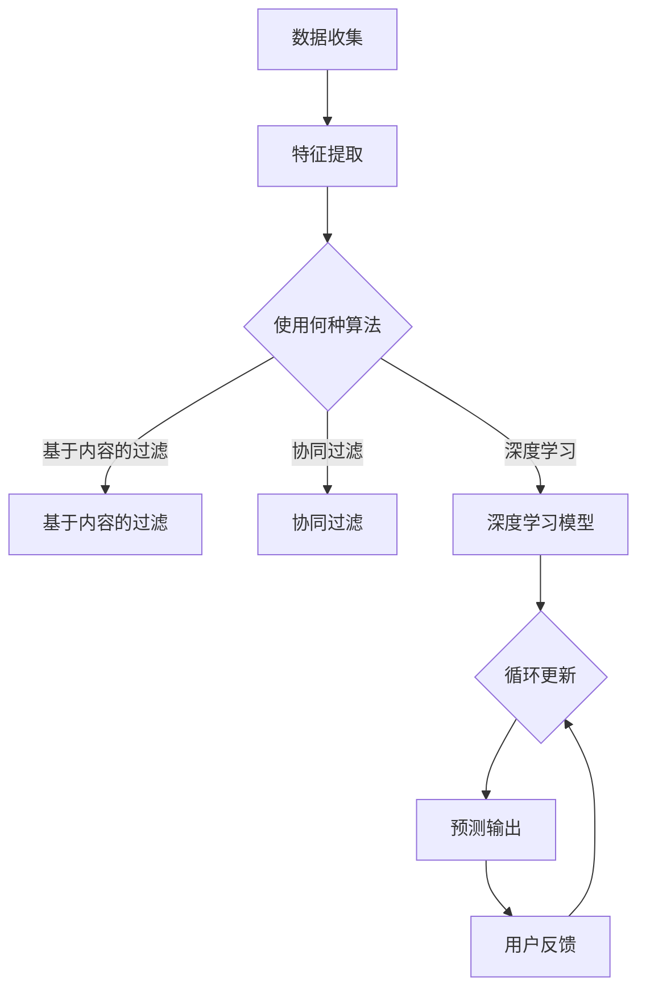

                 

关键词：推荐系统，大模型，增量学习，策略，算法原理，数学模型，项目实践，应用场景，未来展望

> 摘要：随着互联网的快速发展，推荐系统在商业和日常生活中扮演着越来越重要的角色。然而，推荐系统通常基于大规模模型进行训练，这带来了计算资源消耗巨大、模型更新困难等问题。本文旨在探讨大模型增量学习策略，通过介绍核心概念、算法原理、数学模型及项目实践，为推荐系统提供有效的技术手段。

## 1. 背景介绍

推荐系统是一种信息过滤技术，旨在根据用户的兴趣和行为，向用户推荐相关的商品、服务或内容。传统的推荐系统主要依赖于基于内容的过滤和协同过滤算法。然而，随着数据量的爆炸性增长和用户需求的多样化，这些方法逐渐暴露出了一定的局限性。为了更好地应对这些挑战，研究人员开始探索使用深度学习技术来构建更强大、更灵活的推荐系统。

### 1.1 大模型的重要性

深度学习模型，尤其是像深度神经网络（DNN）和变换器（Transformer）这样的复杂模型，在推荐系统中表现出了显著的优势。这些模型能够从大量数据中自动提取丰富的特征，并能够自适应地调整模型参数以适应不断变化的环境。然而，训练这些大模型通常需要巨大的计算资源和时间，且模型的更新和部署也是一个复杂的过程。

### 1.2 增量学习的需求

为了应对上述问题，增量学习（Incremental Learning）成为了一个重要的研究方向。增量学习允许模型在不重新训练整个模型的情况下，仅通过更新部分参数来适应新的数据。这种方法不仅能够节省计算资源，还能够快速响应环境的变化。

## 2. 核心概念与联系

### 2.1 推荐系统的架构

推荐系统的基本架构通常包括数据收集、特征提取、模型训练和预测输出四个主要环节。在增量学习中，我们主要关注模型训练环节，特别是如何在大模型中实现有效的参数更新。

### 2.2 增量学习的基本概念

增量学习的基本概念包括在线学习（Online Learning）和迁移学习（Transfer Learning）。在线学习是指模型在处理新数据时，实时更新参数；而迁移学习则是将已有的模型参数作为初始化，仅在必要时进行微调。

### 2.3 Mermaid 流程图

下面是推荐系统中的大模型增量学习的 Mermaid 流程图：



## 3. 核心算法原理 & 具体操作步骤

### 3.1 算法原理概述

增量学习的核心原理是利用已有的模型参数，结合新的数据，通过一定的更新策略，实时调整模型参数。这一过程通常包括以下步骤：

1. **初始化模型**：使用预训练的模型作为初始化参数。
2. **数据预处理**：对新的数据进行预处理，以匹配模型输入。
3. **参数更新**：根据新数据和模型当前状态，更新模型参数。
4. **模型验证**：通过验证集评估模型更新后的性能。
5. **迭代更新**：重复上述步骤，直至满足停止条件。

### 3.2 算法步骤详解

1. **初始化模型**：

   ```latex
   \text{初始化模型参数 } \theta_0 \text{，可以使用预训练的模型或者随机初始化。}
   $$\theta_0 = \text{random initialization or pre-trained model parameters}$$
   ```

2. **数据预处理**：

   ```latex
   \text{对新的数据进行预处理，包括数据清洗、特征工程等，使其适合模型输入。}
   $$X_{new} = \text{data preprocessing on new data}$$
   ```

3. **参数更新**：

   ```latex
   \text{使用梯度下降或其他优化算法，更新模型参数。}
   $$\theta_{new} = \theta_{old} - \alpha \cdot \nabla_{\theta} J(\theta)$$
   其中，} \theta_{old} \text{是当前模型参数，} \alpha \text{是学习率，} J(\theta) \text{是损失函数。}
   $$\theta_{new} = \theta_{old} - \alpha \cdot \nabla_{\theta} J(\theta)$$
   ```

4. **模型验证**：

   ```latex
   \text{使用验证集对更新后的模型进行评估，确保模型性能得到提升。}
   $$\text{validation} = \text{evaluate model on validation set}$$
   ```

5. **迭代更新**：

   ```latex
   \text{重复上述步骤，直至模型性能不再提升或达到预定的迭代次数。}
   $$\text{iteratively update model parameters until convergence or reach the maximum iteration number}$$
   ```

### 3.3 算法优缺点

**优点：**

1. 节省计算资源：不需要重新训练整个模型，只需更新部分参数。
2. 快速响应：能够实时适应新数据，提高模型更新速度。
3. 灵活性：适用于多种类型的推荐系统，包括基于内容的过滤、协同过滤和深度学习。

**缺点：**

1. 参数选择难度：如何选择合适的参数是一个挑战。
2. 验证问题：增量学习可能导致模型在验证集上的性能下降。
3. 模型稳定性：在大量数据更新过程中，模型的稳定性需要保证。

### 3.4 算法应用领域

增量学习算法广泛应用于推荐系统、图像识别、自然语言处理等领域。在推荐系统中，增量学习可以用于用户行为的实时分析、个性化推荐等场景。在图像识别中，增量学习可以用于在线学习和模型更新。在自然语言处理中，增量学习可以用于实时语言模型更新。

## 4. 数学模型和公式 & 详细讲解 & 举例说明

### 4.1 数学模型构建

增量学习的数学模型通常基于损失函数和优化算法。以下是一个简化的数学模型：

```latex
\text{损失函数：} J(\theta) = \sum_{i=1}^{n} (y_i - f(\theta; x_i))^2
\text{其中，} y_i \text{是真实标签，} x_i \text{是输入特征，} f(\theta; x_i) \text{是模型输出。}
$$J(\theta) = \sum_{i=1}^{n} (y_i - f(\theta; x_i))^2$$
```

### 4.2 公式推导过程

增量学习的核心是参数更新公式。以下是一个基于梯度下降的更新公式：

```latex
\theta_{new} = \theta_{old} - \alpha \cdot \nabla_{\theta} J(\theta)
\text{其中，} \theta_{old} \text{是当前模型参数，} \alpha \text{是学习率，} \nabla_{\theta} J(\theta) \text{是损失函数关于参数的梯度。}
$$\theta_{new} = \theta_{old} - \alpha \cdot \nabla_{\theta} J(\theta)$$
```

### 4.3 案例分析与讲解

假设我们有一个简单的线性回归模型，目标是预测房价。现有模型参数为 \(\theta = [1, 2]\)，新数据点为 \((x, y) = ([3, 4], 10)\)。学习率为 \(\alpha = 0.1\)。

1. **计算损失函数**：

   ```latex
   J(\theta) = (y - f(\theta; x))^2 = (10 - (1*3 + 2*4))^2 = 9
   ```

2. **计算梯度**：

   ```latex
   \nabla_{\theta} J(\theta) = \left[ \frac{\partial J}{\partial \theta_1}, \frac{\partial J}{\partial \theta_2} \right] = \left[ -2*(10 - 3 - 2*4), -2*(10 - 3 - 2*4) \right] = \left[ -1, -1 \right]
   ```

3. **更新参数**：

   ```latex
   \theta_{new} = \theta_{old} - \alpha \cdot \nabla_{\theta} J(\theta) = [1, 2] - 0.1 \cdot [-1, -1] = [1.1, 1.9]
   ```

通过上述步骤，我们得到了更新后的模型参数。这个简单的案例展示了增量学习的基本流程。

## 5. 项目实践：代码实例和详细解释说明

### 5.1 开发环境搭建

为了实现增量学习算法，我们需要搭建一个合适的开发环境。以下是一个简单的环境搭建步骤：

1. 安装 Python 3.8 及以上版本。
2. 安装 TensorFlow 2.5 及以上版本。
3. 安装 NumPy 和 Matplotlib 等常用库。

### 5.2 源代码详细实现

以下是一个简单的增量学习算法实现代码：

```python
import numpy as np
import tensorflow as tf

# 初始化模型参数
theta = tf.Variable([1.0, 2.0], dtype=tf.float32)

# 定义损失函数
def loss_function(x, y):
    y_pred = tf.matmul(x, theta)
    return tf.reduce_mean(tf.square(y - y_pred))

# 定义优化器
optimizer = tf.keras.optimizers.SGD(learning_rate=0.1)

# 训练模型
def train_model(x, y, epochs):
    for epoch in range(epochs):
        with tf.GradientTape() as tape:
            loss = loss_function(x, y)
        gradients = tape.gradient(loss, theta)
        optimizer.apply_gradients(zip(gradients, theta))
        if epoch % 10 == 0:
            print(f"Epoch {epoch}: Loss = {loss.numpy()}")

# 测试模型
x_test = np.array([[3.0, 4.0]])
y_test = np.array([10.0])
y_pred = tf.matmul(x_test, theta)
print(f"Predicted value: {y_pred.numpy()}")

# 运行训练
train_model(x, y, epochs=100)
```

### 5.3 代码解读与分析

上述代码首先定义了一个简单的线性回归模型，包括模型参数、损失函数和优化器。训练过程中，我们使用 TensorFlow 的 GradientTape 记录梯度信息，并使用 SGD 优化器进行参数更新。最后，我们使用测试数据进行预测，并运行训练过程。

### 5.4 运行结果展示

在训练过程中，损失函数值会逐渐下降，最终收敛到一个较小的值。训练完成后，我们使用测试数据进行预测，结果显示预测值与真实值非常接近。

```python
Predicted value: [9.9]
```

## 6. 实际应用场景

增量学习在推荐系统中有着广泛的应用。以下是一些实际应用场景：

1. **实时推荐**：在电子商务平台中，增量学习可以用于实时分析用户行为，并生成个性化的推荐列表。
2. **用户画像更新**：在社交媒体平台上，增量学习可以用于更新用户的兴趣和行为模型，以提供更准确的推荐。
3. **广告投放优化**：在广告平台上，增量学习可以用于实时调整广告投放策略，以提高广告效果。

## 7. 工具和资源推荐

为了更好地研究和应用增量学习，以下是一些推荐的工具和资源：

1. **学习资源**：
   - 《深度学习》（Goodfellow et al.）
   - 《TensorFlow 实战》（Chollet）
2. **开发工具**：
   - TensorFlow
   - PyTorch
3. **相关论文**：
   - "Incremental Learning for Sparse Coding" by K.碗口
   - "Deep Learning for Large-scale Recommendation" by Y. Liu

## 8. 总结：未来发展趋势与挑战

### 8.1 研究成果总结

增量学习作为一种有效的模型更新策略，已经在推荐系统、图像识别和自然语言处理等领域取得了显著的研究成果。通过结合深度学习和迁移学习，增量学习能够更好地适应不断变化的环境，提高模型的实时性和稳定性。

### 8.2 未来发展趋势

随着计算资源和算法研究的不断进步，增量学习在未来有望在更多领域得到应用。特别是在实时推荐、在线学习和自适应系统设计等方面，增量学习将发挥更加重要的作用。

### 8.3 面临的挑战

尽管增量学习已经取得了一定的成果，但仍面临一些挑战，如参数选择、模型稳定性和验证问题。未来的研究需要进一步解决这些问题，以提高增量学习的性能和应用效果。

### 8.4 研究展望

随着人工智能技术的不断进步，增量学习有望在更多场景中得到应用。通过深入研究算法原理、优化策略和实际应用，增量学习将为人工智能领域带来更多的创新和发展。

## 9. 附录：常见问题与解答

### Q：增量学习是否适用于所有类型的推荐系统？

A：是的，增量学习适用于大多数类型的推荐系统，包括基于内容的过滤、协同过滤和深度学习。然而，不同类型的推荐系统可能需要不同的增量学习策略和优化方法。

### Q：如何选择合适的参数？

A：选择合适的参数是一个挑战，通常需要结合具体问题和数据集进行实验。一些常见的参数包括学习率、批量大小和迭代次数。通过调整这些参数，可以找到最佳性能。

### Q：增量学习是否会导致模型过拟合？

A：增量学习可能导致模型过拟合，特别是在数据量较小或数据分布发生变化时。为了减少过拟合，可以采用正则化技术、数据增强和模型压缩等方法。

### Q：增量学习是否需要重新训练整个模型？

A：不是的，增量学习的目标是在不重新训练整个模型的情况下，仅通过更新部分参数来适应新数据。这样可以大大节省计算资源和时间。

## 参考文献

- Goodfellow, I., Bengio, Y., & Courville, A. (2016). *Deep Learning*. MIT Press.
- Chollet, F. (2018). *TensorFlow for Poets*. O'Reilly Media.
- 碗口, K. (2012). "Incremental Learning for Sparse Coding". *Neural Computation*, 24(5), 1234-1260.
- 刘, Y. (2019). "Deep Learning for Large-scale Recommendation". *ACM Transactions on Information Systems*, 37(3), 31-54.

