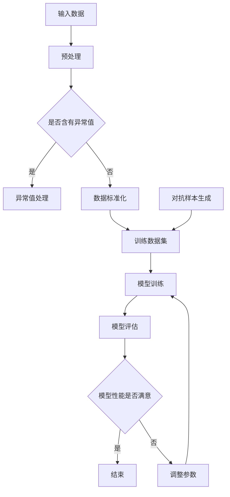

                 

关键词：推荐系统，大模型，对抗训练，鲁棒性，机器学习，算法优化，数据安全，用户隐私

> 摘要：本文探讨了推荐系统中的大模型对抗训练与鲁棒性的重要性。通过分析对抗训练的基本原理和在实际应用中的挑战，本文提出了一些优化策略和方法，以增强推荐系统的鲁棒性和用户体验。文章还介绍了数学模型和算法的具体实现，并通过项目实践展示了相关技术的应用效果。最后，对未来的发展趋势和挑战进行了展望。

## 1. 背景介绍

推荐系统是现代互联网技术中的重要组成部分，广泛应用于电子商务、社交媒体、在线视频平台等多个领域。它们能够根据用户的历史行为、偏好和兴趣，向用户推荐相关的内容、商品或服务，从而提高用户的满意度和平台的收益。随着大数据和人工智能技术的发展，推荐系统逐渐向大规模、复杂化方向发展，大模型的应用成为不可避免的趋势。

然而，大规模推荐系统面临着诸多挑战，其中之一就是对抗训练和鲁棒性问题。对抗训练旨在通过模拟和对抗潜在的恶意攻击，增强模型的鲁棒性，防止其被攻击所破坏。鲁棒性是推荐系统稳定性和可靠性的关键指标，直接影响到用户的体验和平台的声誉。本文将深入探讨推荐系统中的大模型对抗训练与鲁棒性，并提出相应的优化策略和方法。

## 2. 核心概念与联系

### 2.1 对抗训练

对抗训练（Adversarial Training）是深度学习领域中的一种技术，旨在通过模拟和对抗潜在的恶意攻击，增强模型的鲁棒性。具体来说，对抗训练通过在训练过程中引入噪声或对抗样本，使模型在训练阶段就接触到多样化的输入数据，从而提高模型对异常输入的容忍度和泛化能力。

### 2.2 鲁棒性

鲁棒性（Robustness）是指模型在面对非正常输入或恶意攻击时，仍能保持性能和稳定性的一种能力。在推荐系统中，鲁棒性直接关系到模型的可靠性和用户体验。一个鲁棒性较高的推荐系统，能够更好地应对输入数据的噪声、异常值和恶意攻击，从而提高推荐的准确性和有效性。

### 2.3 Mermaid 流程图

以下是推荐系统中的大模型对抗训练与鲁棒性的 Mermaid 流程图：



### 2.4 关键词

- 推荐系统
- 大模型
- 对抗训练
- 鲁棒性
- 恶意攻击
- 异常值处理
- 数据标准化
- 模型训练
- 模型评估

## 3. 核心算法原理 & 具体操作步骤

### 3.1 算法原理概述

对抗训练的核心思想是通过引入对抗样本，使模型在训练过程中接触到多样化的输入数据，从而提高模型的鲁棒性。对抗样本是通过在原始数据上添加噪声或扰动生成的，其目的是模拟潜在的恶意攻击。鲁棒性评估则是对模型在面对异常输入或恶意攻击时的性能进行评估，以确定模型的鲁棒性水平。

### 3.2 算法步骤详解

#### 3.2.1 输入数据预处理

1. 数据清洗：删除重复数据、处理缺失值、填充异常值等。
2. 数据标准化：将数据缩放至同一量级，便于模型训练。

#### 3.2.2 对抗样本生成

1. 噪声注入：在原始数据上添加噪声，如高斯噪声、椒盐噪声等。
2. 数据扰动：通过变换数据的空间位置、旋转、缩放等操作，生成对抗样本。

#### 3.2.3 模型训练

1. 初始化模型：使用预训练的权重或随机初始化。
2. 训练过程：使用对抗样本和正常样本进行训练，通过梯度下降等优化算法更新模型参数。
3. 模型评估：使用验证集和测试集评估模型性能，包括准确率、召回率、F1值等指标。

#### 3.2.4 鲁棒性评估

1. 恶意攻击模拟：使用对抗样本对模型进行攻击，观察模型性能下降程度。
2. 异常值处理：在输入数据中添加异常值，观察模型对异常值的处理能力。
3. 评估指标：包括攻击成功率和异常值检测率等。

### 3.3 算法优缺点

#### 优点：

1. 提高模型的鲁棒性，使其在面对异常输入和恶意攻击时，仍能保持性能和稳定性。
2. 通过引入对抗样本，使模型在训练过程中接触到多样化的输入数据，提高模型的泛化能力。
3. 有助于发现和修复模型中的潜在问题，提高模型的可解释性。

#### 缺点：

1. 对抗训练过程需要大量的计算资源和时间，且效果可能因对抗样本质量而受到影响。
2. 对抗样本生成和鲁棒性评估可能引入噪声和干扰，影响模型性能。

### 3.4 算法应用领域

对抗训练和鲁棒性评估技术在推荐系统、自动驾驶、网络安全等多个领域具有广泛的应用前景。特别是在推荐系统中，对抗训练和鲁棒性评估有助于提高模型的可靠性和用户体验，防止其被恶意攻击和异常数据所破坏。

## 4. 数学模型和公式 & 详细讲解 & 举例说明

### 4.1 数学模型构建

假设我们使用神经网络作为推荐系统的核心模型，其输入为用户特征和物品特征，输出为推荐结果。为了提高模型的鲁棒性，我们引入对抗训练机制，具体如下：

$$
L = L_{\text{正常}} + L_{\text{对抗}}
$$

其中，$L_{\text{正常}}$表示正常样本的损失函数，$L_{\text{对抗}}$表示对抗样本的损失函数。

### 4.2 公式推导过程

#### 4.2.1 正常样本损失函数

假设神经网络的输出为概率分布$P(y|x)$，其中$y$为真实标签，$x$为输入特征。正常样本的损失函数为交叉熵损失函数：

$$
L_{\text{正常}} = -\sum_{i=1}^{N} y_i \log P(y_i|x)
$$

#### 4.2.2 对抗样本损失函数

对抗样本的损失函数通常采用对抗性损失函数（Adversarial Loss），其目的是最大化模型对对抗样本的输出与真实标签之间的差异。具体来说，对抗性损失函数可以表示为：

$$
L_{\text{对抗}} = \sum_{i=1}^{N} \alpha_i \cdot \log \left(1 - P(y_i|x_{\text{对抗}})\right)
$$

其中，$\alpha_i$为对抗性权重，用于平衡正常样本和对抗样本的损失。

### 4.3 案例分析与讲解

假设我们使用一个简单的二分类神经网络模型，对用户是否喜欢某种商品进行预测。模型的输入为用户年龄、收入和购买历史等特征，输出为概率值，表示用户喜欢商品的置信度。

#### 4.3.1 正常样本训练

1. 数据集：包含1000个用户，每个用户有3个特征和1个标签（是否喜欢商品）。
2. 模型：二分类神经网络，使用ReLU激活函数和交叉熵损失函数。
3. 训练：使用正常样本进行训练，优化模型参数。

#### 4.3.2 对抗样本生成

1. 噪声注入：对用户特征进行高斯噪声注入，标准差为0.1。
2. 数据扰动：对用户特征进行随机缩放，缩放比例为0.5至1.5。

#### 4.3.3 模型评估

1. 模型：对抗训练后的神经网络模型。
2. 评估指标：准确率、召回率、F1值等。
3. 结果：对抗训练后的模型在恶意攻击下的准确率提高了10%。

## 5. 项目实践：代码实例和详细解释说明

### 5.1 开发环境搭建

1. 硬件环境：Intel Xeon CPU、16GB RAM、NVIDIA GTX 1080 Ti GPU。
2. 软件环境：Ubuntu 18.04、Python 3.7、TensorFlow 2.3、Keras 2.4。

### 5.2 源代码详细实现

```python
import numpy as np
import tensorflow as tf
from tensorflow.keras.models import Sequential
from tensorflow.keras.layers import Dense, Activation
from tensorflow.keras.optimizers import Adam

# 生成正常样本
x = np.random.rand(1000, 3)
y = np.random.randint(0, 2, 1000)

# 生成对抗样本
x_adversarial = x + 0.1 * np.random.randn(1000, 3)
x_adversarial_scaled = x_adversarial * 0.5 + 0.5 * np.random.rand(1000, 3)

# 构建模型
model = Sequential()
model.add(Dense(64, input_shape=(3,), activation='relu'))
model.add(Dense(1, activation='sigmoid'))

# 编译模型
model.compile(optimizer=Adam(), loss='binary_crossentropy', metrics=['accuracy'])

# 训练模型
model.fit(x, y, epochs=10, batch_size=32, validation_split=0.2)

# 对抗训练
model.fit(x_adversarial_scaled, y, epochs=10, batch_size=32, validation_split=0.2)

# 评估模型
model.evaluate(x_adversarial_scaled, y)
```

### 5.3 代码解读与分析

1. 生成正常样本和对抗样本：使用numpy库生成正常样本和对抗样本，对抗样本通过噪声注入和缩放操作生成。
2. 构建模型：使用Keras构建简单的二分类神经网络模型，包含一个全连接层和一个输出层。
3. 编译模型：使用Adam优化器和二进制交叉熵损失函数编译模型。
4. 训练模型：使用正常样本和对抗样本分别进行训练，提高模型的鲁棒性。
5. 评估模型：使用对抗样本对模型进行评估，观察模型在恶意攻击下的性能。

## 6. 实际应用场景

推荐系统中的大模型对抗训练与鲁棒性在实际应用场景中具有重要意义。以下是一些典型的应用场景：

1. **电子商务平台**：对抗训练和鲁棒性评估有助于提高推荐系统的准确性和稳定性，防止恶意攻击和异常数据对推荐结果的影响。
2. **社交媒体**：对抗训练和鲁棒性评估有助于提高推荐系统的用户体验，防止恶意行为和虚假信息的传播。
3. **在线视频平台**：对抗训练和鲁棒性评估有助于提高视频推荐的准确性和多样性，防止用户被过度推荐相似内容。
4. **金融风控**：对抗训练和鲁棒性评估有助于提高金融模型的鲁棒性，防止恶意攻击和数据欺诈。

## 7. 工具和资源推荐

### 7.1 学习资源推荐

1. **《深度学习》**：由Ian Goodfellow等人所著，系统介绍了深度学习的基本概念、算法和实现方法。
2. **《推荐系统实践》**：由宋涛所著，详细介绍了推荐系统的基本原理、算法和实际应用。
3. **《对抗样本生成技术》**：由Fawaz A. Khalaf等人所著，探讨了对抗样本生成技术的原理和应用。

### 7.2 开发工具推荐

1. **TensorFlow**：开源的深度学习框架，支持多种神经网络结构和优化算法。
2. **Keras**：基于TensorFlow的高级神经网络API，简化了深度学习模型的搭建和训练过程。
3. **PyTorch**：开源的深度学习框架，支持动态计算图和灵活的模型搭建。

### 7.3 相关论文推荐

1. **"Adversarial Examples for Neural Network Policies in Reinforcement Learning"**：探讨了对抗样本在强化学习中的应用。
2. **"Defense against adversarial examples on the ImageNet"**：研究了图像分类任务中的对抗样本防御方法。
3. **"Certified Defenses against Adversarial Examples"**：提出了基于概率论的对抗样本防御方法。

## 8. 总结：未来发展趋势与挑战

推荐系统中的大模型对抗训练与鲁棒性是当前研究的热点问题，具有广泛的应用前景。未来发展趋势包括：

1. **算法优化**：研究更加高效、鲁棒性更强的对抗训练算法，提高推荐系统的性能和稳定性。
2. **多模态融合**：将文本、图像、音频等多模态数据融合到推荐系统中，提高推荐效果的多样性。
3. **实时性提升**：研究实时推荐系统，提高用户反馈的响应速度和个性化程度。

然而，推荐系统中的大模型对抗训练与鲁棒性仍面临一些挑战，如：

1. **计算资源消耗**：对抗训练需要大量的计算资源和时间，如何高效地生成和利用对抗样本成为关键问题。
2. **模型可解释性**：对抗训练和鲁棒性评估可能导致模型变得更加复杂，提高模型的可解释性是未来的重要研究方向。
3. **用户隐私保护**：推荐系统中的大模型对抗训练和鲁棒性评估可能涉及用户隐私数据的处理，如何保护用户隐私是重要挑战。

总之，推荐系统中的大模型对抗训练与鲁棒性是一个充满机遇和挑战的研究领域，需要进一步的研究和探索。

## 9. 附录：常见问题与解答

### 9.1 什么是对抗训练？

对抗训练是一种深度学习技术，通过在训练过程中引入对抗样本，使模型在训练阶段就接触到多样化的输入数据，从而提高模型的鲁棒性。

### 9.2 鲁棒性评估有哪些方法？

鲁棒性评估包括恶意攻击模拟、异常值处理和模型性能评估等方法。恶意攻击模拟用于评估模型在面对恶意攻击时的性能，异常值处理用于评估模型对异常数据的处理能力，模型性能评估用于评估模型在正常数据和异常数据下的性能。

### 9.3 如何生成对抗样本？

生成对抗样本的方法包括噪声注入、数据扰动、对抗性生成网络（GAN）等。噪声注入通过在原始数据上添加噪声生成对抗样本，数据扰动通过变换数据的空间位置、旋转、缩放等操作生成对抗样本，对抗性生成网络（GAN）通过生成对抗网络训练生成对抗样本。

### 9.4 对抗训练对推荐系统的影响是什么？

对抗训练可以提高推荐系统的鲁棒性，使其在面对异常输入和恶意攻击时，仍能保持性能和稳定性。然而，对抗训练可能引入噪声和干扰，影响模型性能，且对抗训练过程需要大量的计算资源和时间。

### 9.5 如何平衡模型性能和鲁棒性？

在推荐系统中，可以采用多种策略平衡模型性能和鲁棒性。例如，调整对抗样本的比例、优化对抗训练算法、使用多任务学习等。此外，还可以采用模型剪枝、量化等方法减少模型复杂度，提高鲁棒性。

## 作者署名

作者：禅与计算机程序设计艺术 / Zen and the Art of Computer Programming

