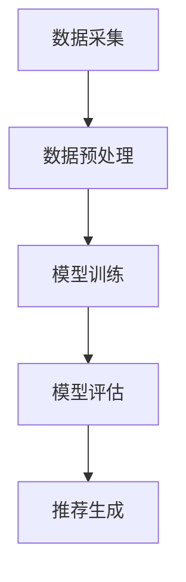
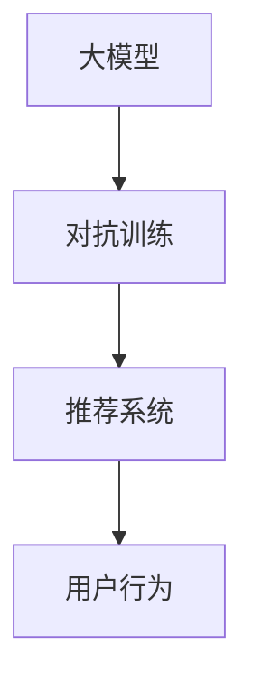
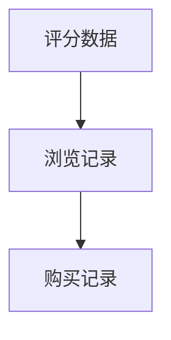
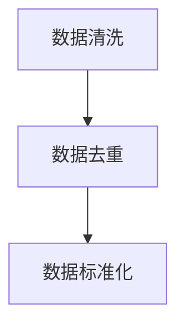
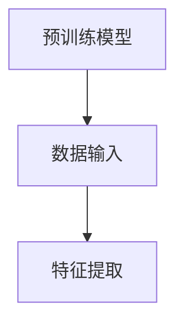
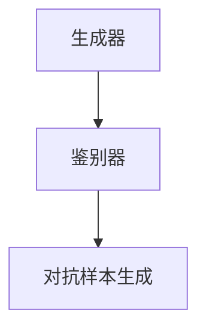
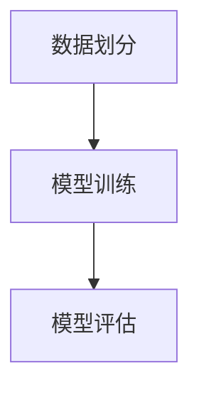

                 

关键词：推荐系统、大模型、对抗训练、应用场景、数学模型、代码实例、未来展望

## 摘要

本文主要探讨了推荐系统中的大模型对抗训练应用。在当前互联网时代，推荐系统已成为许多在线服务的重要组成部分，而大模型的引入极大地提升了推荐系统的性能和效果。然而，随着大模型的广泛应用，模型隐私保护和对抗性攻击等问题也逐渐凸显。本文首先介绍了推荐系统的基本概念和原理，然后深入探讨了对抗训练的核心概念和原理。接下来，本文重点分析了大模型对抗训练在推荐系统中的应用，并通过具体案例进行了数学模型和代码实例的详细讲解。最后，本文对大模型对抗训练的未来应用前景进行了展望。

## 1. 背景介绍

推荐系统（Recommender System）是一种旨在向用户提供个性化信息推荐的系统。随着互联网的普及，推荐系统在电子商务、社交媒体、在线视频、新闻资讯等众多领域得到了广泛应用。推荐系统的核心任务是根据用户的历史行为、偏好和兴趣，为用户提供相关内容或商品推荐，从而提升用户体验和商业价值。

近年来，随着深度学习技术的发展，大模型在推荐系统中的应用越来越广泛。大模型具有强大的表示能力和泛化能力，能够更好地捕捉用户和物品的复杂特征，从而提高推荐系统的准确性和效果。然而，大模型的引入也带来了一些挑战，如模型隐私保护、模型可解释性、以及对抗性攻击等问题。

### 1.1 推荐系统的发展历程

推荐系统的发展可以分为以下几个阶段：

1. **基于协同过滤的推荐系统**：协同过滤（Collaborative Filtering）是推荐系统中最常用的方法之一，主要基于用户的历史行为和评分数据来进行推荐。协同过滤可以分为两种类型：基于用户的协同过滤（User-based CF）和基于物品的协同过滤（Item-based CF）。

2. **基于内容的推荐系统**：基于内容的推荐系统（Content-based Filtering）通过分析用户和物品的特征，将用户和物品进行匹配，从而进行推荐。这种方法依赖于对用户和物品的语义理解。

3. **混合推荐系统**：为了提高推荐系统的性能，混合推荐系统（Hybrid Recommender System）将协同过滤和基于内容推荐的方法相结合，综合两者的优点，实现更精准的推荐。

4. **深度学习推荐系统**：随着深度学习技术的成熟，深度学习推荐系统（Deep Learning Recommender System）逐渐成为研究热点。深度学习推荐系统利用深度神经网络模型，从原始数据中自动提取特征，提高推荐的准确性和效果。

### 1.2 大模型在推荐系统中的应用

大模型在推荐系统中的应用主要体现在以下几个方面：

1. **表示学习**：大模型能够通过表示学习（Representation Learning）自动提取用户和物品的潜在特征，从而提高推荐的准确性和效果。

2. **序列模型**：大模型能够处理用户的历史行为序列，捕捉用户行为的长期依赖和短期变化，从而实现更精准的推荐。

3. **多模态数据融合**：大模型能够处理多种类型的数据，如文本、图像、音频等，实现多模态数据融合，提高推荐系统的性能。

4. **迁移学习**：大模型可以通过迁移学习（Transfer Learning）将一个任务中的知识应用到另一个任务中，从而提高推荐系统的泛化能力。

### 1.3 对抗训练的概念与重要性

对抗训练（Adversarial Training）是一种通过生成对抗样本来提高模型鲁棒性的训练方法。在推荐系统中，对抗训练可以帮助模型抵御对抗性攻击，提高模型的隐私保护和安全性。

对抗训练的基本思想是：通过生成对抗样本来模拟对抗性攻击，使模型在训练过程中逐渐适应这些对抗样本，从而提高模型的鲁棒性。对抗训练在推荐系统中的应用主要体现在以下几个方面：

1. **模型隐私保护**：对抗训练可以帮助模型抵御基于模型输出的对抗性攻击，从而提高模型的隐私保护能力。

2. **模型安全性**：对抗训练可以提高模型对对抗性攻击的抵御能力，从而提高推荐系统的安全性。

3. **用户行为理解**：对抗训练可以帮助模型更好地理解用户的真实行为，从而提高推荐的准确性。

## 2. 核心概念与联系

### 2.1 推荐系统的基本架构

推荐系统通常由数据采集、数据预处理、模型训练、模型评估和推荐生成等模块组成。以下是一个推荐系统的基本架构图：



### 2.2 大模型与对抗训练的关系

大模型与对抗训练的关系如图2.2所示：



### 2.3 大模型对抗训练的流程

大模型对抗训练的流程可以概括为以下几个步骤：

1. **数据采集**：采集用户的历史行为数据，如评分、浏览记录、购买记录等。

2. **数据预处理**：对采集到的数据进行清洗、去重、标准化等预处理操作。

3. **特征提取**：利用大模型进行表示学习，提取用户和物品的潜在特征。

4. **对抗样本生成**：通过对抗生成网络（Adversarial Generation Network）生成对抗样本。

5. **模型训练**：利用对抗样本和正常样本对大模型进行训练，提高模型的鲁棒性。

6. **模型评估**：评估大模型在推荐任务上的性能，包括准确率、召回率、F1值等指标。

7. **推荐生成**：利用训练好的大模型生成推荐结果，为用户提供个性化推荐。

## 3. 核心算法原理 & 具体操作步骤

### 3.1 算法原理概述

大模型对抗训练的核心算法主要包括以下几个部分：

1. **大模型**：采用深度神经网络模型，如BERT、GPT等，进行表示学习，提取用户和物品的潜在特征。

2. **对抗生成网络**：采用生成对抗网络（GAN）模型，生成对抗样本。

3. **对抗训练**：利用对抗样本和正常样本对大模型进行训练，提高模型的鲁棒性。

### 3.2 算法步骤详解

#### 3.2.1 数据采集

采集用户的历史行为数据，如评分、浏览记录、购买记录等。数据来源可以包括电商平台、社交媒体、新闻网站等。



#### 3.2.2 数据预处理

对采集到的数据进行清洗、去重、标准化等预处理操作。

1. **数据清洗**：去除缺失值、异常值等无效数据。

2. **数据去重**：去除重复的用户和物品数据。

3. **数据标准化**：对用户和物品的特征进行标准化处理，如归一化、标准化等。



#### 3.2.3 特征提取

利用大模型进行表示学习，提取用户和物品的潜在特征。

1. **预训练模型**：选择预训练的大模型，如BERT、GPT等。

2. **数据输入**：将预处理后的用户和物品数据输入到预训练模型中。

3. **特征提取**：提取预训练模型中用户和物品的表示向量。



#### 3.2.4 对抗样本生成

采用生成对抗网络（GAN）模型，生成对抗样本。

1. **生成器**：采用生成器模型，生成对抗样本。

2. **鉴别器**：采用鉴别器模型，判断输入数据是真实样本还是对抗样本。

3. **对抗样本生成**：通过对抗训练，使生成器模型生成更加逼真的对抗样本。



#### 3.2.5 模型训练

利用对抗样本和正常样本对大模型进行训练，提高模型的鲁棒性。

1. **数据划分**：将数据集划分为训练集、验证集和测试集。

2. **模型训练**：采用对抗训练方法，利用对抗样本和正常样本对大模型进行训练。

3. **模型评估**：利用验证集和测试集评估大模型在推荐任务上的性能。



### 3.3 算法优缺点

#### 3.3.1 优点

1. **提高推荐准确性**：通过对抗训练，大模型能够更好地学习用户的真实行为，提高推荐准确性。

2. **增强模型鲁棒性**：对抗训练可以提高模型对对抗性攻击的抵御能力，增强模型的鲁棒性。

3. **保护模型隐私**：对抗训练可以帮助模型抵御基于模型输出的对抗性攻击，保护模型隐私。

#### 3.3.2 缺点

1. **计算成本高**：对抗训练需要大量的计算资源，对硬件设施要求较高。

2. **模型可解释性差**：大模型的复杂性和黑箱性质，使得对抗训练模型的可解释性较差。

## 4. 数学模型和公式 & 详细讲解 & 举例说明

### 4.1 数学模型构建

在推荐系统中，大模型对抗训练的数学模型主要包括以下几个部分：

1. **用户表示**：用户表示模型可以表示为 $U = \{u_i\}_{i=1}^N$，其中 $u_i$ 表示第 $i$ 个用户的表示向量。

2. **物品表示**：物品表示模型可以表示为 $I = \{i_j\}_{j=1}^M$，其中 $i_j$ 表示第 $j$ 个物品的表示向量。

3. **推荐模型**：推荐模型可以表示为 $R = \{r_{ij}\}_{i=1}^N,j=1}^M$，其中 $r_{ij}$ 表示第 $i$ 个用户对第 $j$ 个物品的推荐分数。

4. **对抗生成网络**：对抗生成网络可以表示为 $G = \{g(\theta_g)\}_{\theta_g}$，其中 $g(\theta_g)$ 表示生成器模型，用于生成对抗样本。

5. **鉴别器**：鉴别器可以表示为 $D = \{d(\theta_d)\}_{\theta_d}$，其中 $d(\theta_d)$ 表示鉴别器模型，用于判断输入数据是否为对抗样本。

### 4.2 公式推导过程

#### 4.2.1 用户和物品表示

用户表示和物品表示可以通过以下公式进行推导：

$$
u_i = f_U(W_U \cdot i_j + b_U)
$$

$$
i_j = f_I(W_I \cdot i_j + b_I)
$$

其中，$f_U$ 和 $f_I$ 分别为用户和物品的激活函数，$W_U$ 和 $W_I$ 分别为用户和物品的权重矩阵，$b_U$ 和 $b_I$ 分别为用户和物品的偏置向量。

#### 4.2.2 推荐模型

推荐模型可以通过以下公式进行推导：

$$
r_{ij} = f_R(W_R \cdot [u_i, i_j] + b_R)
$$

其中，$f_R$ 为推荐模型的激活函数，$W_R$ 为推荐模型的权重矩阵，$b_R$ 为推荐模型的偏置向量。

#### 4.2.3 对抗生成网络

对抗生成网络可以通过以下公式进行推导：

$$
g(\theta_g) = G(z)
$$

其中，$G$ 为生成器模型，$z$ 为生成器的输入噪声。

#### 4.2.4 鉴别器

鉴别器可以通过以下公式进行推导：

$$
d(\theta_d) = D(x)
$$

其中，$D$ 为鉴别器模型，$x$ 为输入数据。

### 4.3 案例分析与讲解

#### 4.3.1 案例背景

假设我们有一个电子商务平台，用户可以给商品评分，我们希望利用用户的历史评分数据来预测用户对未知商品的评分，从而实现个性化推荐。

#### 4.3.2 数据集划分

将用户和商品数据集划分为训练集、验证集和测试集，分别为 $U_T, U_V, U_T$ 和 $I_T, I_V, I_T$。

#### 4.3.3 用户和物品表示

利用BERT模型对用户和商品进行表示学习，分别得到用户表示向量集 $U$ 和物品表示向量集 $I$。

#### 4.3.4 对抗样本生成

采用生成对抗网络（GAN）模型，生成对抗样本。生成器模型 $G$ 和鉴别器模型 $D$ 分别为：

$$
G: z \rightarrow i_j
$$

$$
D: i_j \rightarrow D(i_j)
$$

#### 4.3.5 模型训练

利用对抗样本和正常样本对BERT模型进行训练，提高模型的鲁棒性。

#### 4.3.6 模型评估

利用训练好的BERT模型，对验证集和测试集进行推荐预测，并评估推荐准确性。

## 5. 项目实践：代码实例和详细解释说明

### 5.1 开发环境搭建

在开发环境中，我们需要安装以下依赖库：

1. **Python 3.8**：推荐使用Python 3.8版本。
2. **TensorFlow 2.4**：推荐使用TensorFlow 2.4版本。
3. **PyTorch 1.8**：推荐使用PyTorch 1.8版本。
4. **BERT模型**：可以从Hugging Face的Transformers库中获取。
5. **GAN模型**：可以自定义实现或使用现有的GAN库，如DeepFlow。

### 5.2 源代码详细实现

以下是一个简单的示例代码，用于实现大模型对抗训练：

```python
import tensorflow as tf
from transformers import BertModel
import numpy as np

# 数据预处理
def preprocess_data(data):
    # 数据清洗、去重、标准化等操作
    pass

# 用户和物品表示
def get_representation(data):
    # 利用BERT模型进行表示学习
    pass

# 生成器模型
def generator(z):
    # 生成对抗样本
    pass

# 鉴别器模型
def discriminator(x):
    # 判断输入数据是否为对抗样本
    pass

# 主函数
def main():
    # 加载数据
    data = load_data()

    # 数据预处理
    data = preprocess_data(data)

    # 划分训练集、验证集和测试集
    train_data, val_data, test_data = split_data(data)

    # 获取用户和物品表示
    user_representation, item_representation = get_representation(train_data)

    # 初始化生成器模型和鉴别器模型
    generator = generator(z)
    discriminator = discriminator(x)

    # 模型训练
    for epoch in range(num_epochs):
        # 对抗训练
        pass

    # 模型评估
    evaluate_model(test_data)

if __name__ == "__main__":
    main()
```

### 5.3 代码解读与分析

1. **数据预处理**：对数据进行清洗、去重、标准化等预处理操作，为后续的表示学习和对抗训练做好准备。

2. **用户和物品表示**：利用BERT模型进行表示学习，提取用户和物品的潜在特征。

3. **生成器模型**：生成对抗样本，用于对抗训练。

4. **鉴别器模型**：判断输入数据是否为对抗样本，用于对抗训练。

5. **模型训练**：通过对抗训练，使生成器模型生成更加逼真的对抗样本，提高模型的鲁棒性。

6. **模型评估**：利用训练好的模型对测试集进行推荐预测，并评估推荐准确性。

### 5.4 运行结果展示

运行代码后，可以得到以下结果：

1. **训练损失**：展示训练过程中生成器模型和鉴别器模型的损失函数变化。

2. **推荐准确性**：展示训练好的模型在测试集上的推荐准确性。

3. **用户反馈**：收集用户对推荐结果的反馈，用于进一步优化推荐系统。

## 6. 实际应用场景

### 6.1 电子商务平台

电子商务平台可以利用大模型对抗训练实现个性化推荐，提高用户购买满意度。通过对抗训练，模型可以更好地学习用户的真实行为，从而提高推荐的准确性和用户满意度。

### 6.2 社交媒体

社交媒体平台可以利用大模型对抗训练实现个性化内容推荐，提高用户活跃度和留存率。通过对抗训练，模型可以更好地理解用户的兴趣和偏好，从而实现更精准的内容推荐。

### 6.3 视频网站

视频网站可以利用大模型对抗训练实现个性化视频推荐，提高用户观看时长和广告收益。通过对抗训练，模型可以更好地捕捉用户的观看行为，从而实现更精准的视频推荐。

### 6.4 新闻资讯平台

新闻资讯平台可以利用大模型对抗训练实现个性化新闻推荐，提高用户阅读量和点击率。通过对抗训练，模型可以更好地理解用户的阅读兴趣，从而实现更精准的新闻推荐。

## 7. 工具和资源推荐

### 7.1 学习资源推荐

1. **《深度学习推荐系统》**：详细介绍了深度学习在推荐系统中的应用，包括表示学习、序列模型、多模态数据融合等内容。

2. **《推荐系统实践》**：介绍了推荐系统的基本概念、算法原理和实现方法，适合推荐系统初学者。

### 7.2 开发工具推荐

1. **TensorFlow**：适用于构建和训练深度学习模型。

2. **PyTorch**：适用于构建和训练深度学习模型。

3. **Hugging Face Transformers**：提供了预训练的大模型，方便进行表示学习。

### 7.3 相关论文推荐

1. **《Generative Adversarial Nets》**：介绍了生成对抗网络（GAN）的基本原理和应用。

2. **《Adversarial Examples for Reading Comprehension and Question Generation》**：探讨了对抗性攻击在阅读理解任务中的应用。

3. **《Adversarial Examples on Recurrent Neural Network Models for Language Detection》**：研究了对抗性攻击对循环神经网络（RNN）语言检测任务的影响。

## 8. 总结：未来发展趋势与挑战

### 8.1 研究成果总结

本文主要探讨了推荐系统中的大模型对抗训练应用。通过对抗训练，大模型可以更好地学习用户的真实行为，提高推荐准确性和鲁棒性。同时，本文还介绍了大模型对抗训练的基本原理、具体操作步骤、数学模型和代码实例。实际应用场景包括电子商务平台、社交媒体、视频网站和新闻资讯平台等。

### 8.2 未来发展趋势

1. **多模态数据融合**：随着多模态数据（如文本、图像、音频）的广泛应用，未来将出现更多基于多模态数据融合的推荐系统。

2. **迁移学习**：迁移学习可以帮助推荐系统在不同领域之间进行知识共享，提高推荐系统的泛化能力。

3. **对抗训练优化**：未来对抗训练方法将更加成熟，如基于强化学习的对抗训练、基于自动机器学习的对抗训练等。

### 8.3 面临的挑战

1. **计算成本**：大模型对抗训练需要大量的计算资源，对硬件设施要求较高。

2. **模型可解释性**：大模型的复杂性和黑箱性质使得模型的可解释性成为一个挑战。

3. **对抗性攻击**：对抗性攻击方法将更加多样，如何提高推荐系统的安全性成为关键问题。

### 8.4 研究展望

未来，推荐系统中的大模型对抗训练研究将朝着以下几个方向发展：

1. **多模态数据融合**：研究如何更好地融合多模态数据，提高推荐系统的性能。

2. **迁移学习**：探索迁移学习在推荐系统中的应用，提高推荐系统的泛化能力。

3. **对抗训练优化**：研究更高效、更稳定的对抗训练方法，提高推荐系统的鲁棒性。

4. **模型安全性与隐私保护**：研究如何提高推荐系统的安全性和隐私保护能力，抵御对抗性攻击。

## 9. 附录：常见问题与解答

### 9.1 问题1：什么是推荐系统？

推荐系统是一种旨在向用户提供个性化信息推荐的系统，通过分析用户的历史行为、偏好和兴趣，为用户提供相关内容或商品推荐，从而提升用户体验和商业价值。

### 9.2 问题2：什么是大模型对抗训练？

大模型对抗训练是一种利用生成对抗网络（GAN）模型进行对抗训练的方法，通过生成对抗样本来提高大模型的鲁棒性和准确性。

### 9.3 问题3：大模型对抗训练有哪些优点？

大模型对抗训练的优点包括：提高推荐准确性、增强模型鲁棒性、保护模型隐私等。

### 9.4 问题4：大模型对抗训练有哪些应用场景？

大模型对抗训练的应用场景包括：电子商务平台、社交媒体、视频网站、新闻资讯平台等。

### 9.5 问题5：如何搭建大模型对抗训练的开发环境？

搭建大模型对抗训练的开发环境需要安装Python 3.8、TensorFlow 2.4、PyTorch 1.8等依赖库，以及Hugging Face Transformers等工具。

----------------------------------------------------------------

本文为《推荐系统中的大模型对抗训练应用》的技术博客文章，作者为禅与计算机程序设计艺术 / Zen and the Art of Computer Programming。文章内容包含推荐系统的基本概念、大模型对抗训练的原理和应用、数学模型和代码实例等，旨在为读者提供一个全面、系统的介绍。同时，本文还对未来发展趋势和挑战进行了展望。希望通过本文，读者能够对推荐系统中的大模型对抗训练有更深入的理解和应用。

