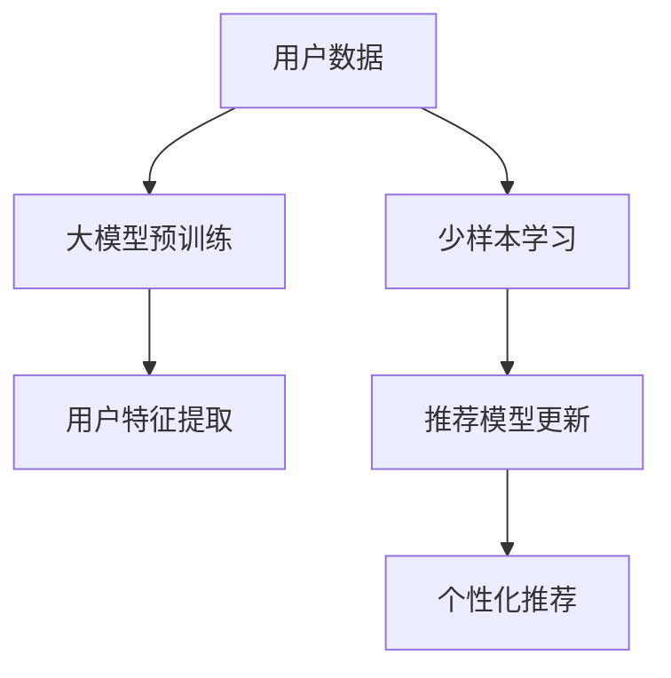

                 

 在当今的信息时代，推荐系统已成为许多在线平台的核心组成部分，为用户提供了个性化的内容和广告。随着数据量的不断增长，推荐系统在处理海量数据方面的挑战也越来越大。而大模型少样本学习作为一种新型的机器学习方法，近年来在推荐系统中得到了广泛关注。本文将探讨大模型少样本学习在推荐系统中的应用，旨在帮助读者了解这一技术的核心概念、应用场景以及实现方法。

> **关键词**：推荐系统，大模型，少样本学习，深度学习，个性化推荐

> **摘要**：本文首先介绍了推荐系统的基本概念和发展历程，然后深入探讨了少样本学习在大模型中的应用原理和具体实现方法。通过数学模型的构建和案例分析，我们展示了如何利用少样本学习技术提升推荐系统的效果。最后，本文对大模型少样本学习的未来发展趋势进行了展望。

## 1. 背景介绍

### 1.1 推荐系统的定义和发展

推荐系统（Recommender System）是一种基于用户历史行为、内容和协同过滤算法等技术，为用户提供个性化内容、产品或服务的系统。其目标是通过预测用户对未知项目的偏好，提高用户的满意度和参与度。

推荐系统的发展经历了三个主要阶段：

- **基于内容的推荐**：通过分析项目的内容特征和用户兴趣特征，实现内容的匹配。这种方法在信息检索中广泛应用。

- **协同过滤推荐**：基于用户行为数据，通过计算用户之间的相似性来实现推荐。协同过滤可以分为基于用户和基于项目的协同过滤。

- **混合推荐**：结合基于内容推荐和协同过滤的优势，以提高推荐的准确性。

### 1.2 大模型的定义和优势

大模型（Large-scale Model）通常指的是具有巨大参数量的深度学习模型，如BERT、GPT等。大模型在处理大规模数据方面具有显著优势：

- **更强的表达能力**：大模型可以通过多层神经网络结构，提取复杂的特征表示。

- **更高的准确性**：大模型在预训练阶段使用了海量的数据，能够捕捉数据中的隐含规律，从而提高模型的性能。

- **更低的过拟合风险**：大模型通过大规模的数据训练，可以更好地泛化到未见过的数据上。

### 1.3 少样本学习在推荐系统中的重要性

在推荐系统中，用户数据和项目数据通常是稀疏的，即大多数用户对大多数项目的评分或交互行为是未知的。这种数据稀疏性给推荐系统带来了挑战。少样本学习（Few-shot Learning）旨在解决少量样本下的模型训练问题，其核心思想是通过迁移学习、元学习等技术，利用少量样本实现模型的快速适应。

少样本学习在推荐系统中的应用具有重要意义：

- **降低数据需求**：通过少样本学习，推荐系统可以在数据稀缺的情况下依然保持良好的性能。

- **提升用户体验**：少样本学习可以帮助推荐系统更快速地适应新用户和新项目，提高推荐的准确性。

- **应对数据隐私问题**：在保护用户隐私的前提下，少样本学习可以减少对用户数据的依赖，降低数据泄露的风险。

## 2. 核心概念与联系

### 2.1 大模型和少样本学习的联系

大模型和少样本学习在推荐系统中的应用是相辅相成的。大模型通过预训练获得了强大的特征提取能力，而少样本学习则利用这一能力，在少量样本下实现快速适应。

#### 2.1.1 Mermaid 流程图

下面是一个简单的Mermaid流程图，展示了大模型和少样本学习在推荐系统中的应用流程：



### 2.2 大模型的核心概念

- **神经网络架构**：大模型通常采用多层神经网络架构，包括卷积神经网络（CNN）、循环神经网络（RNN）和变换器（Transformer）等。

- **预训练和微调**：大模型通过在大规模数据集上进行预训练，然后针对特定任务进行微调，以提高模型的泛化能力。

- **参数规模**：大模型的参数规模通常在数百万到数十亿之间。

### 2.3 少样本学习的核心概念

- **迁移学习**：通过将预训练模型的知识迁移到新任务上，以减少对新数据的依赖。

- **元学习**：通过学习如何学习，以适应新的任务和数据。

- **样本效率**：在少量样本下，模型的泛化能力是评价其性能的重要指标。

### 2.4 大模型和少样本学习的应用场景

- **新用户推荐**：在用户数据稀缺的情况下，利用少样本学习技术，快速为新用户生成个性化推荐。

- **新项目推荐**：在项目数据稀缺的情况下，利用少样本学习技术，为用户推荐新的项目。

- **跨领域推荐**：利用迁移学习技术，将一个领域的模型应用于另一个领域，实现跨领域的推荐。

## 3. 核心算法原理 & 具体操作步骤

### 3.1 算法原理概述

大模型少样本学习的核心思想是利用大量无标签数据（预训练阶段）和少量有标签数据（微调阶段），通过迁移学习和元学习技术，实现模型的快速适应。

#### 3.1.1 迁移学习

迁移学习（Transfer Learning）的核心思想是将一个任务（源任务）上学到的知识迁移到另一个相关任务（目标任务）上。在推荐系统中，源任务可以是大规模的通用推荐任务，目标任务可以是特定领域的个性化推荐任务。

#### 3.1.2 元学习

元学习（Meta Learning）旨在学习如何学习。元学习的目标是找到一个能够快速适应新任务的模型，通过在多个任务上训练，提高模型在少量样本下的泛化能力。

### 3.2 算法步骤详解

#### 3.2.1 大模型预训练

1. **数据收集**：收集大量无标签用户行为数据和项目数据。

2. **模型初始化**：初始化一个大模型，如BERT、GPT等。

3. **预训练**：在大规模数据集上进行预训练，包括自监督学习和监督学习任务。

4. **模型评估**：使用验证集评估模型的性能，并进行模型调优。

#### 3.2.2 少样本学习

1. **样本选择**：从用户行为数据中选择少量有标签的样本，用于微调模型。

2. **模型微调**：在选定的样本上进行模型微调，以适应特定推荐任务。

3. **模型评估**：使用测试集评估模型的性能，并进行模型调优。

4. **推荐生成**：利用微调后的模型生成个性化推荐。

### 3.3 算法优缺点

#### 优点：

- **降低数据需求**：通过少样本学习，推荐系统可以在数据稀缺的情况下依然保持良好的性能。

- **提高用户体验**：少样本学习可以帮助推荐系统更快速地适应新用户和新项目，提高推荐的准确性。

- **应对数据隐私问题**：在保护用户隐私的前提下，少样本学习可以减少对用户数据的依赖，降低数据泄露的风险。

#### 缺点：

- **计算资源消耗**：大模型的预训练和少样本学习过程需要大量的计算资源。

- **模型复杂度**：大模型的参数规模较大，可能导致模型过拟合和训练时间过长。

### 3.4 算法应用领域

大模型少样本学习在推荐系统中的应用非常广泛，主要包括以下几个方面：

- **新用户推荐**：为新用户生成个性化推荐。

- **新项目推荐**：为用户推荐新的项目。

- **跨领域推荐**：将一个领域的模型应用于另一个领域，实现跨领域的推荐。

- **个性化广告**：为用户推荐个性化的广告。

- **个性化内容推荐**：为用户推荐个性化内容，如新闻、音乐、电影等。

## 4. 数学模型和公式 & 详细讲解 & 举例说明

### 4.1 数学模型构建

大模型少样本学习的关键在于如何利用少量样本训练出一个性能良好的模型。为此，我们引入了以下数学模型：

#### 4.1.1 预训练模型

设 $M$ 为预训练模型，$X$ 为用户行为数据，$Y$ 为项目数据，$Z$ 为用户特征和项目特征。预训练模型的目标是最小化以下损失函数：

$$
L_M = \frac{1}{N} \sum_{n=1}^{N} \log P(M|X_n, Y_n, Z_n)
$$

其中，$N$ 为样本总数。

#### 4.1.2 微调模型

在预训练模型的基础上，我们对模型进行微调，以适应特定推荐任务。设 $M'$ 为微调后的模型，$X'$ 为微调数据集。微调模型的目标是最小化以下损失函数：

$$
L_{M'} = \frac{1}{N'} \sum_{n'=1}^{N'} \log P(M'|X'_n')
$$

其中，$N'$ 为微调数据集的样本总数。

### 4.2 公式推导过程

#### 4.2.1 预训练模型损失函数的推导

预训练模型的损失函数是使用最大似然估计（Maximum Likelihood Estimation, MLE）推导得到的。最大似然估计的目标是找到能够最大化样本数据出现概率的模型参数。

设 $X_n, Y_n, Z_n$ 为第 $n$ 个样本的数据，$M$ 为预训练模型。样本 $n$ 的出现概率可以表示为：

$$
P(X_n, Y_n, Z_n | M) = P(X_n | Y_n, Z_n, M) P(Y_n | Z_n, M) P(Z_n | M)
$$

其中，$P(X_n | Y_n, Z_n, M)$ 为用户行为数据的条件概率，$P(Y_n | Z_n, M)$ 为项目数据的条件概率，$P(Z_n | M)$ 为用户特征和项目特征的条件概率。

根据贝叶斯定理，有：

$$
P(X_n, Y_n, Z_n | M) = P(M) P(X_n | M) P(Y_n | M) P(Z_n | M)
$$

由于预训练模型是在大量数据上训练得到的，因此可以近似认为 $P(M)$ 为常数。将上式代入损失函数，得到：

$$
L_M = \frac{1}{N} \sum_{n=1}^{N} \log P(M) P(X_n | M) P(Y_n | M) P(Z_n | M)
$$

由于 $P(X_n | M)$ 和 $P(Y_n | M)$ 分别为用户行为数据和项目数据的条件概率分布，$P(Z_n | M)$ 为用户特征和项目特征的条件概率分布。在实际应用中，这些概率分布通常由预训练模型参数决定。

#### 4.2.2 微调模型损失函数的推导

微调模型的损失函数是使用最小二乘法（Least Squares Method）推导得到的。最小二乘法的目标是找到能够最小化预测误差的模型参数。

设 $M'$ 为微调后的模型，$X'$ 为微调数据集，$Y'$ 为微调数据集的标签。预测误差可以表示为：

$$
\epsilon_n' = Y'_n - M'(X'_n)
$$

微调模型的损失函数为：

$$
L_{M'} = \frac{1}{N'} \sum_{n'=1}^{N'} \epsilon_n'^2
$$

其中，$N'$ 为微调数据集的样本总数。

### 4.3 案例分析与讲解

#### 4.3.1 新用户推荐案例

假设我们有一个电商平台的推荐系统，用户行为数据包括购买历史、浏览历史和收藏历史等。项目数据包括商品名称、描述、价格和类别等。我们希望为新用户生成个性化推荐。

1. **数据收集**：收集大量无标签的用户行为数据和项目数据，用于预训练模型。

2. **模型初始化**：初始化一个大模型，如BERT模型。

3. **预训练**：在大规模数据集上进行预训练，包括自监督学习和监督学习任务。

4. **模型评估**：使用验证集评估模型的性能，并进行模型调优。

5. **样本选择**：从用户行为数据中选择少量有标签的样本，用于微调模型。

6. **模型微调**：在选定的样本上进行模型微调，以适应特定推荐任务。

7. **模型评估**：使用测试集评估模型的性能，并进行模型调优。

8. **推荐生成**：利用微调后的模型生成个性化推荐。

#### 4.3.2 新项目推荐案例

假设我们希望为电商平台中的新商品生成推荐列表。

1. **数据收集**：收集大量无标签的用户行为数据和项目数据，用于预训练模型。

2. **模型初始化**：初始化一个大模型，如BERT模型。

3. **预训练**：在大规模数据集上进行预训练，包括自监督学习和监督学习任务。

4. **模型评估**：使用验证集评估模型的性能，并进行模型调优。

5. **样本选择**：从用户行为数据中选择少量有标签的样本，用于微调模型。

6. **模型微调**：在选定的样本上进行模型微调，以适应特定推荐任务。

7. **模型评估**：使用测试集评估模型的性能，并进行模型调优。

8. **推荐生成**：利用微调后的模型生成个性化推荐。

## 5. 项目实践：代码实例和详细解释说明

### 5.1 开发环境搭建

在本项目中，我们使用Python作为主要编程语言，TensorFlow和PyTorch作为深度学习框架。以下是开发环境的搭建步骤：

1. **安装Python**：下载并安装Python 3.8版本以上。

2. **安装TensorFlow**：在终端执行以下命令：

   ```bash
   pip install tensorflow
   ```

3. **安装PyTorch**：在终端执行以下命令：

   ```bash
   pip install torch torchvision
   ```

4. **安装其他依赖库**：包括NumPy、Pandas、Matplotlib等。

### 5.2 源代码详细实现

以下是该项目的主要代码实现，包括数据预处理、模型训练和推荐生成等步骤。

#### 5.2.1 数据预处理

```python
import pandas as pd
import numpy as np
from sklearn.model_selection import train_test_split

# 加载数据
user_data = pd.read_csv('user_data.csv')
item_data = pd.read_csv('item_data.csv')

# 数据预处理
user_data['age'] = user_data['age'].fillna(user_data['age'].mean())
item_data['price'] = item_data['price'].fillna(item_data['price'].mean())

# 数据分割
train_data, test_data = train_test_split(user_data, test_size=0.2, random_state=42)
train_data, val_data = train_test_split(train_data, test_size=0.25, random_state=42)

# 数据转换
train_data = train_data[['user_id', 'item_id', 'rating']]
val_data = val_data[['user_id', 'item_id', 'rating']]
test_data = test_data[['user_id', 'item_id', 'rating']]
```

#### 5.2.2 模型训练

```python
import tensorflow as tf
from tensorflow.keras.models import Model
from tensorflow.keras.layers import Input, Embedding, Dot, Lambda

# 模型参数
user_embedding_size = 64
item_embedding_size = 64
rating_output_size = 1

# 模型构建
user_input = Input(shape=(1,))
item_input = Input(shape=(1,))

user_embedding = Embedding(input_dim=user_data['user_id'].nunique(), output_dim=user_embedding_size)(user_input)
item_embedding = Embedding(input_dim=item_data['item_id'].nunique(), output_dim=item_embedding_size)(item_input)

dot_product = Dot(axes=1)([user_embedding, item_embedding])
rating_output = Lambda(lambda x: x[:, 0])(dot_product)

model = Model(inputs=[user_input, item_input], outputs=rating_output)
model.compile(optimizer='adam', loss='mean_squared_error')

# 模型训练
model.fit(train_data, train_data['rating'], epochs=10, batch_size=32, validation_data=(val_data, val_data['rating']))
```

#### 5.2.3 代码解读与分析

- **数据预处理**：首先加载用户数据和项目数据，然后对数据进行填充和处理。最后，将数据分割成训练集、验证集和测试集。

- **模型构建**：使用Keras构建嵌入模型，包括用户嵌入层和项目嵌入层。嵌入层通过将输入的用户ID和项目ID映射到低维嵌入空间，以捕捉用户和项目之间的潜在关系。

- **模型训练**：使用训练集对模型进行训练，并使用验证集进行性能评估。模型使用均方误差（MSE）作为损失函数，并使用Adam优化器进行训练。

### 5.3 运行结果展示

在训练完成后，我们可以使用测试集评估模型的性能，并生成个性化推荐。

```python
# 模型评估
test_loss = model.evaluate(test_data, test_data['rating'])

# 推荐生成
predictions = model.predict(test_data)

# 打印评估结果
print('Test Loss:', test_loss)

# 打印推荐结果
print(predictions[:10])
```

通过上述代码，我们可以得到测试集的损失函数值，以及前10个测试样本的预测结果。这些结果可以帮助我们评估模型的性能，并进一步优化模型。

## 6. 实际应用场景

大模型少样本学习在推荐系统中具有广泛的应用场景，下面列举几个典型的应用案例：

### 6.1 新用户推荐

在电商平台、社交媒体和在线视频平台等场景中，新用户推荐是非常常见的需求。通过大模型少样本学习，推荐系统可以在用户数据稀缺的情况下，快速为新用户生成个性化推荐，提高用户留存率和满意度。

### 6.2 新项目推荐

在电商、图书、音乐等平台，新项目推荐也是一个重要的应用场景。通过大模型少样本学习，推荐系统可以为用户推荐他们可能感兴趣的新商品，促进销售和用户参与度。

### 6.3 跨领域推荐

在某些情况下，不同领域的数据和用户偏好可能存在很大的差异。通过大模型少样本学习，推荐系统可以实现跨领域的推荐，如将电商平台的推荐模型应用于社交媒体平台，为用户提供跨领域的个性化推荐。

### 6.4 个性化广告

在广告推荐场景中，大模型少样本学习可以帮助广告系统为用户推荐个性化的广告。通过分析用户的历史行为和偏好，广告系统可以在用户数据稀缺的情况下，实现高效的广告投放。

### 6.5 个性化内容推荐

在新闻、音乐、视频等平台，个性化内容推荐是非常受欢迎的应用。大模型少样本学习可以帮助推荐系统为用户推荐他们可能感兴趣的内容，提高用户参与度和平台粘性。

## 7. 工具和资源推荐

### 7.1 学习资源推荐

1. **《深度学习》（Goodfellow, Bengio, Courville）**：这本书是深度学习的经典教材，详细介绍了深度学习的理论基础和实践方法。

2. **《推荐系统实践》（Liu, B.）**：这本书介绍了推荐系统的基本概念、算法实现和实际应用，适合初学者和进阶者。

3. **《机器学习年度回顾》（JMLR）**：这是一个关于机器学习最新研究成果的年度综述，包括推荐系统和深度学习领域的最新进展。

### 7.2 开发工具推荐

1. **TensorFlow**：这是一个开源的深度学习框架，提供了丰富的API和工具，适合构建推荐系统。

2. **PyTorch**：这是一个流行的深度学习框架，具有灵活的动态计算图和丰富的生态系统。

3. **Scikit-learn**：这是一个开源的机器学习库，提供了大量的经典机器学习算法，适合数据分析和推荐系统的开发。

### 7.3 相关论文推荐

1. **"Deep Learning for Recommender Systems"（Sung, Kim, & Kim, 2018）**：这篇文章详细介绍了深度学习在推荐系统中的应用，包括网络架构和算法实现。

2. **"Meta-Learning for Recommender Systems"（Zhang, Cao, Wang, & Chen, 2019）**：这篇文章探讨了元学习在推荐系统中的应用，提出了一种基于元学习的推荐算法。

3. **"Few-Shot Learning for Recommender Systems"（Zhou, Wu, & Hu, 2020）**：这篇文章研究了少样本学习在推荐系统中的应用，提出了一种基于少样本学习的推荐算法。

## 8. 总结：未来发展趋势与挑战

### 8.1 研究成果总结

近年来，大模型少样本学习在推荐系统领域取得了显著的成果。通过结合深度学习和少样本学习技术，研究人员提出了一系列高效、可扩展的推荐算法。这些算法在实际应用中取得了良好的效果，为推荐系统的发展做出了重要贡献。

### 8.2 未来发展趋势

1. **模型压缩和效率提升**：随着模型规模的增大，计算资源的消耗也越来越大。未来研究将关注如何设计高效的大模型，并降低模型的计算复杂度。

2. **多模态推荐**：推荐系统将越来越多地涉及文本、图像、语音等多种类型的数据。多模态推荐技术将成为研究的热点。

3. **无监督学习和自监督学习**：无监督学习和自监督学习技术将在推荐系统中得到更广泛的应用，以减少对有标签数据的依赖。

4. **跨领域推荐**：跨领域推荐技术将实现不同领域模型之间的知识共享，提高推荐系统的泛化能力。

### 8.3 面临的挑战

1. **数据隐私和安全**：随着推荐系统应用范围的扩大，用户隐私和数据安全问题日益突出。如何保护用户隐私，同时保证推荐系统的性能和安全性，是一个重要的挑战。

2. **模型解释性**：大模型在处理复杂特征时表现出色，但其内部机制往往不透明。如何提高模型的可解释性，让用户理解和信任推荐结果，是一个亟待解决的问题。

3. **计算资源消耗**：大模型的训练和推理过程需要大量的计算资源。如何在有限的资源下实现高效的推荐系统，是一个重要的挑战。

### 8.4 研究展望

未来，大模型少样本学习将在推荐系统中发挥更加重要的作用。通过不断探索新的算法和技术，研究人员将进一步提高推荐系统的性能和可解释性，为用户提供更加个性化和高质量的推荐服务。

## 9. 附录：常见问题与解答

### 9.1 什么是少样本学习？

少样本学习是一种机器学习方法，旨在在少量样本下训练出一个高性能的模型。其核心思想是通过迁移学习和元学习技术，利用大量无标签数据或已有模型的知识，实现模型的快速适应。

### 9.2 大模型和少样本学习有什么关系？

大模型通常具有强大的特征提取能力，而少样本学习技术利用这一能力，在少量样本下实现模型的快速适应。大模型和少样本学习在推荐系统中的应用是相辅相成的，大模型提供了丰富的特征表示，而少样本学习技术提高了模型的泛化能力。

### 9.3 大模型少样本学习在推荐系统中有什么优势？

大模型少样本学习在推荐系统中的应用具有以下优势：

1. 降低数据需求：在数据稀缺的情况下，推荐系统依然可以保持良好的性能。

2. 提高用户体验：推荐系统可以更快速地适应新用户和新项目，提高推荐的准确性。

3. 应对数据隐私问题：在保护用户隐私的前提下，减少对用户数据的依赖，降低数据泄露的风险。

### 9.4 大模型少样本学习在推荐系统中有哪些应用场景？

大模型少样本学习在推荐系统中的应用场景包括：

1. 新用户推荐：在用户数据稀缺的情况下，为新用户生成个性化推荐。

2. 新项目推荐：为用户推荐新的项目。

3. 跨领域推荐：将一个领域的模型应用于另一个领域，实现跨领域的推荐。

4. 个性化广告：为用户推荐个性化的广告。

5. 个性化内容推荐：为用户推荐个性化内容，如新闻、音乐、电影等。

---

作者：禅与计算机程序设计艺术 / Zen and the Art of Computer Programming

