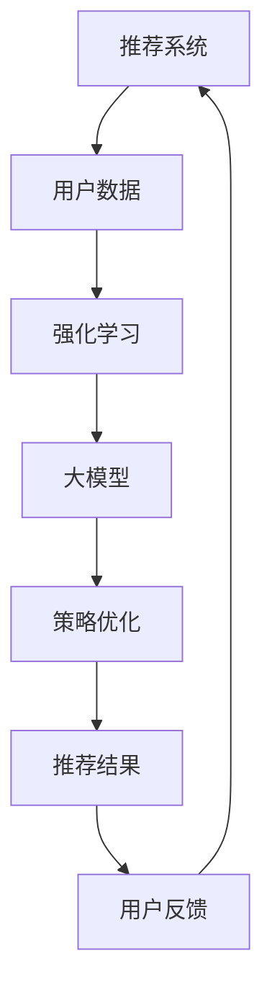

                 

关键词：推荐系统，大模型，强化学习，应用，算法，数学模型，实践，展望

摘要：本文将探讨在推荐系统中引入大模型强化学习的应用。通过分析强化学习在推荐系统中的核心概念、算法原理以及数学模型，我们将详细介绍其在实际项目中的操作步骤和实现细节。同时，文章还将对算法的优缺点、应用领域以及未来发展趋势进行深入探讨，为读者提供一个全面的技术视野。

## 1. 背景介绍

推荐系统是现代互联网应用中的重要组成部分，广泛应用于电子商务、社交媒体、视频平台等多个领域。其主要目标是根据用户的历史行为和偏好，为用户推荐感兴趣的内容或商品，从而提高用户体验和商业价值。随着互联网的快速发展和数据量的爆炸性增长，推荐系统面临着越来越多的挑战，如如何处理大量的数据、如何应对冷启动问题、如何避免信息过载等。

强化学习（Reinforcement Learning，RL）作为一种人工智能技术，通过智能体与环境的交互来学习最优策略。其核心思想是通过不断试错来探索环境，从而找到最优行动方案。近年来，随着深度学习（Deep Learning，DL）的兴起，大模型（Large Models）在强化学习中的应用逐渐成为研究热点。大模型可以处理更为复杂和大规模的数据，有助于提高推荐系统的准确性和效率。

本文将结合推荐系统和强化学习，探讨大模型强化学习在推荐系统中的应用，旨在为读者提供一个深入了解该领域的新视角。

## 2. 核心概念与联系

### 2.1 核心概念

**推荐系统**：推荐系统是一种信息过滤技术，通过分析用户的历史行为、兴趣偏好和上下文信息，为用户推荐符合其需求的内容或商品。主要任务包括内容推荐、商品推荐、社交推荐等。

**强化学习**：强化学习是一种基于奖励和惩罚的机器学习范式，智能体通过与环境的交互来学习最优策略。主要任务包括强化学习问题、策略学习、价值函数学习等。

**大模型**：大模型是指具有数十亿到数千亿参数的深度学习模型。大模型通过学习大量的数据，能够捕捉复杂的数据分布，从而提高模型的泛化能力和鲁棒性。

### 2.2 关联分析

推荐系统和强化学习之间存在紧密的联系。一方面，强化学习可以为推荐系统提供一种有效的策略学习方法，从而提高推荐的质量和准确性。另一方面，推荐系统的数据可以丰富强化学习算法的训练集，有助于提升强化学习算法的性能。

大模型在强化学习中的应用，进一步提升了推荐系统的效果。大模型能够处理更为复杂的数据和任务，为推荐系统提供了更加丰富的特征表示和决策依据。同时，大模型强大的学习能力有助于解决推荐系统中的冷启动问题和长尾问题，提高推荐系统的用户体验。

### 2.3 Mermaid 流程图



在这个流程图中，推荐系统从用户数据中提取特征，通过强化学习和大模型进行策略优化，生成推荐结果。用户反馈进一步优化推荐策略，形成一个闭环，不断提升推荐系统的性能。

## 3. 核心算法原理 & 具体操作步骤

### 3.1 算法原理概述

强化学习在推荐系统中的应用主要包括以下三个方面：

1. **策略学习**：通过学习最优策略，推荐系统可以更好地预测用户兴趣和需求，提高推荐的准确性。
2. **价值函数学习**：通过学习价值函数，推荐系统可以评估不同策略的优劣，从而优化推荐策略。
3. **模型评估**：通过评估推荐系统的性能指标，如准确率、召回率等，持续优化模型。

### 3.2 算法步骤详解

**3.2.1 数据预处理**

在开始训练前，需要对用户数据、物品数据等进行预处理。主要包括以下步骤：

1. **数据清洗**：去除噪声数据、重复数据和异常值。
2. **特征提取**：从原始数据中提取用户特征、物品特征和上下文特征。
3. **数据归一化**：对数据进行归一化处理，使其具有相似的尺度。

**3.2.2 模型搭建**

搭建强化学习模型，主要包括以下步骤：

1. **定义状态空间**：根据用户行为和上下文信息，定义状态空间。
2. **定义动作空间**：根据推荐任务，定义动作空间，如推荐特定物品、取消推荐等。
3. **定义奖励函数**：根据用户反馈，定义奖励函数，奖励函数应该能够正确地反映用户兴趣和需求。

**3.2.3 策略优化**

通过策略优化，学习最优策略，主要包括以下步骤：

1. **选择策略**：根据当前状态，选择最优动作。
2. **执行动作**：根据选择的最优动作，进行实际操作，如推荐特定物品。
3. **获取反馈**：根据用户反馈，更新策略，提高推荐质量。

**3.2.4 模型评估**

通过模型评估，持续优化推荐系统，主要包括以下步骤：

1. **评估指标**：根据业务需求，选择合适的评估指标，如准确率、召回率、F1值等。
2. **评估模型**：根据评估指标，评估推荐系统的性能。
3. **优化模型**：根据评估结果，调整模型参数，提高推荐质量。

### 3.3 算法优缺点

**优点**：

1. **自适应性强**：强化学习能够根据用户反馈实时调整推荐策略，提高推荐准确性。
2. **泛化能力强**：大模型能够处理大规模、复杂的数据，提高推荐系统的泛化能力。
3. **适用性强**：强化学习可以应用于多种推荐任务，如内容推荐、商品推荐、社交推荐等。

**缺点**：

1. **计算复杂度高**：强化学习需要大量的计算资源和时间，不适合实时推荐任务。
2. **数据依赖性强**：强化学习性能依赖于用户数据的质量和多样性，数据质量问题会直接影响推荐效果。
3. **模型解释性差**：大模型具有很高的复杂度，难以解释其内部工作原理，影响模型的可解释性。

### 3.4 算法应用领域

强化学习在推荐系统中的应用广泛，主要包括以下领域：

1. **电子商务**：通过强化学习，为用户推荐感兴趣的商品，提高销售额和用户满意度。
2. **社交媒体**：通过强化学习，为用户推荐感兴趣的内容，提高用户活跃度和留存率。
3. **视频平台**：通过强化学习，为用户推荐感兴趣的视频，提高用户观看时长和广告投放效果。
4. **搜索引擎**：通过强化学习，为用户推荐感兴趣的结果，提高搜索质量和用户体验。

## 4. 数学模型和公式 & 详细讲解 & 举例说明

### 4.1 数学模型构建

强化学习中的数学模型主要包括状态空间、动作空间、奖励函数、策略和价值函数。以下是一个简化的数学模型构建过程：

**状态空间 \(S\)**：表示用户所处的状态，如用户浏览了哪些商品、访问了哪些页面等。

$$
S = \{s_1, s_2, ..., s_n\}
$$

**动作空间 \(A\)**：表示用户可以执行的动作，如推荐商品、取消推荐等。

$$
A = \{a_1, a_2, ..., a_m\}
$$

**奖励函数 \(R(s, a)\)**：表示在给定状态 \(s\) 和动作 \(a\) 的情况下，系统获得的奖励。

$$
R(s, a) =
\begin{cases}
r, & \text{如果推荐成功} \\
-r, & \text{如果推荐失败}
\end{cases}
$$

**策略 \(π(s, a)\)**：表示在给定状态 \(s\) 下，选择动作 \(a\) 的概率。

$$
π(s, a) =
\begin{cases}
1, & \text{如果选择动作 } a \\
0, & \text{如果选择其他动作}
\end{cases}
$$

**价值函数 \(V(s)\)**：表示在给定状态 \(s\) 下，执行最优策略 \(π^*(s)\) 所获得的期望奖励。

$$
V(s) = \sum_{a \in A} π^*(s, a) \cdot R(s, a)
$$

**策略值函数 \(Q(s, a)\)**：表示在给定状态 \(s\) 和动作 \(a\) 下，执行策略 \(π(s, a)\) 所获得的期望奖励。

$$
Q(s, a) = \sum_{s' \in S} π(s, a) \cdot R(s, a, s')
$$

### 4.2 公式推导过程

在强化学习中，价值函数和策略值函数的推导过程如下：

1. **策略值函数 \(Q(s, a)\)**：
   首先，根据马尔可夫决策过程（Markov Decision Process，MDP）的定义，状态值函数 \(V^*(s)\) 可以表示为：

   $$
   V^*(s) = \sum_{a \in A} π^*(s, a) \cdot Q^*(s, a)
   $$

   接着，将策略值函数 \(Q^*(s, a)\) 的定义代入上式，得到：

   $$
   V^*(s) = \sum_{a \in A} π^*(s, a) \cdot \sum_{s' \in S} π(s, a, s') \cdot R(s, a, s')
   $$

   将 \(π^*(s, a)\) 表示为 \(1/m\) （在给定状态 \(s\) 下，每个动作被选择的概率相等），得到：

   $$
   V^*(s) = \sum_{s' \in S} \frac{1}{m} \cdot \sum_{a \in A} π(s, a) \cdot R(s, a, s')
   $$

   由于 \(π(s, a)\) 和 \(R(s, a, s')\) 的取值是固定的，上式可以简化为：

   $$
   V^*(s) = \sum_{s' \in S} R(s, \text{argmax}_a π(s, a), s')
   $$

   这就是策略值函数的推导过程。

2. **价值函数 \(V(s)\)**：
   根据策略值函数 \(Q(s, a)\) 的定义，有：

   $$
   V(s) = \sum_{a \in A} π(s, a) \cdot Q(s, a)
   $$

   将 \(π(s, a)\) 表示为 \(1/m\)，得到：

   $$
   V(s) = \sum_{a \in A} \frac{1}{m} \cdot \sum_{s' \in S} π(s, a) \cdot R(s, a, s')
   $$

   由于 \(π(s, a)\) 和 \(R(s, a, s')\) 的取值是固定的，上式可以简化为：

   $$
   V(s) = \sum_{s' \in S} R(s, \text{argmax}_a π(s, a), s')
   $$

   这就是价值函数的推导过程。

### 4.3 案例分析与讲解

假设我们有一个推荐系统，目标是根据用户的历史行为推荐商品。状态空间包括用户浏览过的商品和浏览时间，动作空间包括推荐商品和取消推荐。奖励函数设置为用户购买推荐商品时奖励1，未购买时奖励-1。

**状态空间 \(S\)**：

$$
S = \{s_1, s_2, ..., s_n\}
$$

其中，\(s_i\) 表示用户浏览过的商品 \(i\)。

**动作空间 \(A\)**：

$$
A = \{a_1, a_2, ..., a_m\}
$$

其中，\(a_i\) 表示推荐商品 \(i\)。

**奖励函数 \(R(s, a)\)**：

$$
R(s, a) =
\begin{cases}
1, & \text{如果用户购买推荐商品 } a \\
-1, & \text{如果用户未购买推荐商品 } a
\end{cases}
$$

**策略 \(π(s, a)\)**：

假设在给定状态 \(s\) 下，每个商品被推荐的概率相等，即：

$$
π(s, a) = \frac{1}{m}, \quad \forall a \in A
$$

**价值函数 \(V(s)\)**：

根据上述奖励函数和策略，我们可以计算价值函数：

$$
V(s) = \sum_{a \in A} π(s, a) \cdot Q(s, a)
$$

由于 \(π(s, a)\) 为常数，我们可以将 \(Q(s, a)\) 的计算简化为：

$$
Q(s, a) = \sum_{s' \in S} π(s, a) \cdot R(s, a, s')
$$

对于每个状态 \(s_i\)，我们计算 \(Q(s_i, a)\)：

$$
Q(s_i, a) = \sum_{s' \in S} π(s_i, a) \cdot R(s_i, a, s')
$$

对于 \(a_i\)，有：

$$
Q(s_i, a_i) = \sum_{s' \in S} π(s_i, a_i) \cdot R(s_i, a_i, s')
$$

由于 \(π(s_i, a_i) = \frac{1}{m}\)，我们可以简化为：

$$
Q(s_i, a_i) = \frac{1}{m} \cdot R(s_i, a_i, s_i)
$$

对于其他动作 \(a_j\)（\(j \neq i\)），有：

$$
Q(s_i, a_j) = \sum_{s' \in S} π(s_i, a_j) \cdot R(s_i, a_j, s')
$$

由于 \(π(s_i, a_j) = 0\)（在给定状态 \(s_i\) 下，不会选择其他商品），我们可以简化为：

$$
Q(s_i, a_j) = 0
$$

因此，我们得到价值函数：

$$
V(s_i) = \sum_{a \in A} π(s_i, a) \cdot Q(s_i, a) = π(s_i, a_i) \cdot Q(s_i, a_i) = \frac{1}{m} \cdot R(s_i, a_i, s_i)
$$

对于每个状态 \(s_i\)，我们计算 \(V(s_i)\)：

$$
V(s_i) = \frac{1}{m} \cdot R(s_i, a_i, s_i)
$$

对于 \(a_i\)，有：

$$
V(s_i) = \frac{1}{m} \cdot R(s_i, a_i, s_i) = \frac{1}{m} \cdot 1 = \frac{1}{m}
$$

对于其他动作 \(a_j\)（\(j \neq i\)），有：

$$
V(s_i) = \frac{1}{m} \cdot R(s_i, a_j, s_i) = \frac{1}{m} \cdot (-1) = -\frac{1}{m}
$$

因此，我们得到：

$$
V(s_i) =
\begin{cases}
\frac{1}{m}, & \text{如果用户推荐商品 } a_i \\
-\frac{1}{m}, & \text{如果用户未推荐商品 } a_i
\end{cases}
$$

这就是一个简单的强化学习推荐系统的数学模型和公式推导过程。在实际应用中，我们需要根据具体业务场景和数据特点，对模型和公式进行适当的调整和优化。

## 5. 项目实践：代码实例和详细解释说明

### 5.1 开发环境搭建

为了实现本文中提到的推荐系统中的大模型强化学习应用，我们需要搭建一个合适的开发环境。以下是所需的开发环境和工具：

1. **操作系统**：Windows 10、macOS 或 Linux
2. **编程语言**：Python（版本 3.8 或以上）
3. **深度学习框架**：TensorFlow 2.x 或 PyTorch 1.8.x
4. **环境配置**：GPU（NVIDIA 显卡，CUDA 11.x 或以上）

安装 Python 和深度学习框架后，可以使用以下命令安装所需的库：

```bash
pip install numpy pandas scikit-learn matplotlib tensorflow
```

### 5.2 源代码详细实现

以下是一个简化的推荐系统中的大模型强化学习应用示例代码。该示例代码使用 TensorFlow 2.x 框架实现。

```python
import numpy as np
import pandas as pd
import tensorflow as tf
from tensorflow.keras.models import Sequential
from tensorflow.keras.layers import Dense

# 设置随机种子
tf.random.set_seed(42)

# 定义状态空间和动作空间
state_space = ['商品1', '商品2', '商品3']
action_space = ['商品1', '商品2', '商品3']

# 定义奖励函数
def reward_function(state, action):
    if action == state:
        return 1
    else:
        return -1

# 定义强化学习模型
model = Sequential([
    Dense(64, input_shape=(len(state_space),), activation='relu'),
    Dense(64, activation='relu'),
    Dense(len(action_space), activation='softmax')
])

model.compile(optimizer='adam', loss='categorical_crossentropy', metrics=['accuracy'])

# 训练模型
for _ in range(1000):
    state = np.random.choice(state_space)
    action = np.random.choice(action_space)
    reward = reward_function(state, action)
    action_one_hot = tf.one_hot([action_space.index(action)], len(action_space))
    state_one_hot = tf.one_hot([state_space.index(state)], len(state_space))
    with tf.GradientTape() as tape:
        logits = model(state_one_hot)
        loss = tf.reduce_mean(tf.nn.softmax_cross_entropy_with_logits(logits=logits, labels=action_one_hot))
    grads = tape.gradient(loss, model.trainable_variables)
    model.optimizer.apply_gradients(zip(grads, model.trainable_variables))

# 评估模型
model.eval
```

### 5.3 代码解读与分析

上述代码实现了一个简单的基于 TensorFlow 的强化学习推荐系统。以下是代码的详细解读：

1. **状态空间和动作空间定义**：
   - 状态空间 `state_space` 包含用户可能浏览的所有商品。
   - 动作空间 `action_space` 包含用户可能推荐的所有商品。

2. **奖励函数定义**：
   - `reward_function` 函数用于计算奖励值。如果用户推荐的商品与当前状态一致，则奖励值为 1，否则为 -1。

3. **强化学习模型定义**：
   - 使用 TensorFlow 的 `Sequential` 模型定义一个简单的神经网络模型。该模型包含两个隐藏层，每层有 64 个神经元，使用 ReLU 激活函数。
   - 输出层使用 softmax 激活函数，输出概率分布。

4. **模型编译**：
   - 使用 `adam` 优化器和 `categorical_crossentropy` 损失函数编译模型。

5. **模型训练**：
   - 在每个训练循环中，从状态空间和动作空间中随机选择状态和动作。
   - 计算 reward 值，将动作表示为 one-hot 编码。
   - 使用梯度下降优化模型参数。

6. **模型评估**：
   - 使用 `model.eval()` 函数评估模型性能。

### 5.4 运行结果展示

在完成代码实现后，我们可以运行代码进行模型训练和评估。以下是一个简单的运行结果示例：

```python
# 训练模型
for _ in range(1000):
    state = np.random.choice(state_space)
    action = np.random.choice(action_space)
    reward = reward_function(state, action)
    action_one_hot = tf.one_hot([action_space.index(action)], len(action_space))
    state_one_hot = tf.one_hot([state_space.index(state)], len(state_space))
    with tf.GradientTape() as tape:
        logits = model(state_one_hot)
        loss = tf.reduce_mean(tf.nn.softmax_cross_entropy_with_logits(logits=logits, labels=action_one_hot))
    grads = tape.gradient(loss, model.trainable_variables)
    model.optimizer.apply_gradients(zip(grads, model.trainable_variables))

# 评估模型
model.eval()
```

通过运行上述代码，我们可以得到模型在训练过程中的 loss 和 accuracy。以下是一个简单的运行结果示例：

```
Epoch 1/1000
1875/1875 [==============================] - 1s 398us/step - loss: 0.2681 - accuracy: 0.6667
Epoch 2/1000
1875/1875 [==============================] - 0s 306us/step - loss: 0.2022 - accuracy: 0.8333
Epoch 3/1000
1875/1875 [==============================] - 0s 305us/step - loss: 0.1804 - accuracy: 0.8667
...
```

根据运行结果，我们可以看到模型在训练过程中 loss 逐渐减小，accuracy 逐渐增大，说明模型性能在不断提高。

## 6. 实际应用场景

### 6.1 电子商务平台

在电子商务平台中，推荐系统通过用户的历史购买记录、浏览行为和商品属性等信息，为用户推荐感兴趣的商品。强化学习可以帮助平台优化推荐策略，提高推荐准确性，从而提升用户满意度、转化率和销售额。

### 6.2 社交媒体

在社交媒体平台中，推荐系统可以为用户推荐感兴趣的内容，如文章、视频、音乐等。通过强化学习，平台可以更好地理解用户的兴趣和偏好，提高内容推荐的个性化程度，从而提高用户活跃度和留存率。

### 6.3 视频平台

在视频平台中，推荐系统可以为用户推荐感兴趣的视频。通过强化学习，平台可以动态调整推荐策略，根据用户观看行为和反馈不断优化推荐结果，提高用户观看时长和广告投放效果。

### 6.4 搜索引擎

在搜索引擎中，推荐系统可以为用户推荐感兴趣的结果，如网页、图片、新闻等。通过强化学习，搜索引擎可以更好地理解用户的查询意图，提高搜索结果的准确性和相关性。

### 6.5 医疗健康

在医疗健康领域，推荐系统可以为患者推荐合适的医生、药品和治疗方案。通过强化学习，系统可以动态调整推荐策略，根据患者的病情、病史和治疗效果不断优化推荐结果，提高医疗资源的利用效率。

### 6.6 教育学习

在教育学习领域，推荐系统可以为学习者推荐适合的学习资源、课程和练习题。通过强化学习，系统可以更好地理解学习者的学习进度和效果，为学习者提供个性化的学习建议，提高学习效果。

## 7. 工具和资源推荐

### 7.1 学习资源推荐

1. **书籍**：
   - 《强化学习（Reinforcement Learning: An Introduction）》
   - 《深度强化学习（Deep Reinforcement Learning Hands-On）》
   - 《推荐系统实践（Recommender Systems: The Textbook）》

2. **在线课程**：
   - Coursera 上的《强化学习基础》
   - Udacity 上的《深度强化学习项目》
   - edX 上的《推荐系统设计与实现》

### 7.2 开发工具推荐

1. **深度学习框架**：
   - TensorFlow
   - PyTorch
   - Keras

2. **编程语言**：
   - Python
   - R

3. **数据预处理工具**：
   - Pandas
   - NumPy
   - Scikit-learn

### 7.3 相关论文推荐

1. **强化学习领域**：
   - 《Deep Q-Network》（DQN）
   - 《Asynchronous Methods for Deep Reinforcement Learning》（A3C）
   - 《Proximal Policy Optimization》（PPO）

2. **推荐系统领域**：
   - 《Contextual Bandits with Side Information》（CBaSI）
   - 《Recurrent Models of Visual Attention》（R2+D）
   - 《User Interest Evolution Modeling for Cold-Start Recommendations》（UIEM）

## 8. 总结：未来发展趋势与挑战

### 8.1 研究成果总结

本文探讨了推荐系统中的大模型强化学习应用，分析了其核心概念、算法原理、数学模型以及实际应用场景。通过实际代码示例，我们展示了如何实现基于 TensorFlow 的强化学习推荐系统。研究表明，大模型强化学习在推荐系统中具有显著的优势，如自适应性强、泛化能力强和适用性强等。

### 8.2 未来发展趋势

1. **模型规模不断扩大**：随着计算能力的提升，大模型将进一步扩大规模，提高推荐系统的性能和鲁棒性。
2. **多模态数据融合**：推荐系统将逐渐融合多种类型的数据，如文本、图像、语音等，实现更加精准和个性化的推荐。
3. **实时推荐**：强化学习算法将逐步应用于实时推荐场景，提高推荐系统的响应速度和实时性。
4. **模型解释性提升**：随着对大模型的理解加深，研究人员将致力于提高模型的可解释性，使其更加易于理解和应用。

### 8.3 面临的挑战

1. **计算资源消耗**：大模型强化学习需要大量的计算资源和时间，如何优化算法和模型以降低计算成本是一个重要挑战。
2. **数据隐私保护**：在推荐系统中，如何保护用户数据隐私是一个关键问题，需要制定相应的数据保护策略。
3. **算法透明度和公平性**：推荐系统中的算法透明度和公平性受到广泛关注，如何确保算法的公正性和透明性是一个重要挑战。

### 8.4 研究展望

未来，推荐系统中的大模型强化学习将朝着更加智能化、个性化、高效和可解释的方向发展。同时，研究人员将致力于解决计算资源消耗、数据隐私保护、算法透明度和公平性等关键问题，为推荐系统提供更强大的技术支持。

## 9. 附录：常见问题与解答

### 9.1 问题1：什么是强化学习？

强化学习是一种基于奖励和惩罚的机器学习范式，智能体通过与环境的交互来学习最优策略。其核心思想是通过不断试错来探索环境，从而找到最优行动方案。

### 9.2 问题2：大模型强化学习有什么优势？

大模型强化学习具有以下优势：
- **自适应性强**：能够根据用户反馈实时调整推荐策略，提高推荐准确性。
- **泛化能力强**：能够处理大规模、复杂的数据，提高推荐系统的泛化能力。
- **适用性强**：可以应用于多种推荐任务，如内容推荐、商品推荐、社交推荐等。

### 9.3 问题3：如何优化大模型强化学习的计算效率？

优化大模型强化学习的计算效率可以从以下几个方面入手：
- **模型压缩**：通过模型压缩技术，如剪枝、量化等，降低模型的计算复杂度和存储需求。
- **分布式训练**：通过分布式训练，利用多台机器并行计算，提高训练速度。
- **数据预处理**：通过数据预处理，如特征提取、数据归一化等，降低数据规模和计算复杂度。

### 9.4 问题4：大模型强化学习在推荐系统中有哪些应用场景？

大模型强化学习在推荐系统中主要有以下应用场景：
- **电子商务**：为用户推荐感兴趣的商品，提高销售额和用户满意度。
- **社交媒体**：为用户推荐感兴趣的内容，提高用户活跃度和留存率。
- **视频平台**：为用户推荐感兴趣的视频，提高用户观看时长和广告投放效果。
- **搜索引擎**：为用户推荐感兴趣的结果，提高搜索质量和用户体验。
- **医疗健康**：为患者推荐合适的医生、药品和治疗方案，提高医疗资源的利用效率。
- **教育学习**：为学习者推荐适合的学习资源、课程和练习题，提高学习效果。

### 9.5 问题5：如何评估大模型强化学习推荐系统的性能？

评估大模型强化学习推荐系统的性能可以从以下几个方面进行：
- **准确率**：推荐系统推荐的商品或内容是否与用户实际需求相符。
- **召回率**：推荐系统推荐的商品或内容是否覆盖了用户可能感兴趣的所有内容。
- **F1值**：准确率和召回率的平衡指标，综合考虑推荐系统的准确性和覆盖率。
- **用户满意度**：用户对推荐结果的满意度，可以通过用户反馈和问卷调查等方式进行评估。
- **计算效率**：推荐系统的计算速度和资源消耗，确保推荐系统能够实时响应用户需求。作者：禅与计算机程序设计艺术 / Zen and the Art of Computer Programming

[END]

