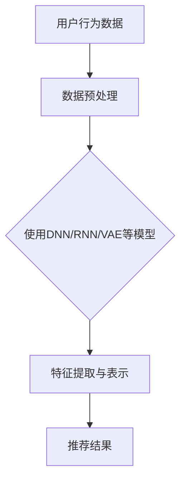

                 

推荐系统是当今互联网应用中不可或缺的一部分，它们通过分析用户行为和偏好，向用户提供个性化的内容推荐。然而，随着互联网信息的爆炸式增长，如何确保推荐系统的质量和适应性成为了一个亟待解决的问题。本文将探讨推荐系统中大模型的持续学习与适应方法，以应对不断变化的信息环境和用户需求。

## 文章关键词

- 推荐系统
- 大模型
- 持续学习
- 适应性
- 用户偏好

## 文摘

本文首先介绍了推荐系统的基本原理和现状，然后重点讨论了推荐系统中大模型的持续学习与适应方法。通过结合机器学习和深度学习技术，本文提出了一种适用于推荐系统的大模型持续学习框架，并对其中的核心算法进行了详细分析。最后，本文探讨了推荐系统在实际应用中的挑战和未来发展趋势。

## 1. 背景介绍

### 1.1 推荐系统的发展历程

推荐系统最早可以追溯到20世纪90年代，随着互联网的兴起和电子商务的快速发展，推荐系统逐渐成为个性化服务的重要手段。早期推荐系统主要基于基于内容的推荐（Content-Based Filtering）和协同过滤（Collaborative Filtering）技术。

基于内容的推荐主要通过分析用户的历史行为和偏好，将用户感兴趣的内容推荐给其他具有相似偏好的用户。这种方法在处理冷启动问题（即新用户或新商品时无法提供足够的信息）方面存在一定局限性。

协同过滤技术通过分析用户之间的相似度，将用户没有评价的商品推荐给相似用户。基于用户的协同过滤（User-Based Collaborative Filtering）和基于模型的协同过滤（Model-Based Collaborative Filtering）是协同过滤技术的两大分支。基于用户的协同过滤通过计算用户之间的相似度来推荐商品，而基于模型的协同过滤通过构建用户和商品之间的潜在关系模型来推荐商品。

### 1.2 推荐系统的现状

随着大数据和人工智能技术的发展，推荐系统在互联网应用中的地位日益重要。目前，推荐系统广泛应用于电子商务、社交媒体、新闻资讯、音乐和视频等领域。例如，亚马逊和淘宝等电商平台的推荐系统能够为用户提供个性化的商品推荐，提高用户购买转化率；社交媒体平台如Facebook和微博等通过推荐系统为用户推送感兴趣的内容，增加用户活跃度。

然而，现有推荐系统在应对信息过载、用户个性化需求不断变化等方面仍存在一些挑战。首先，随着互联网信息的爆炸式增长，用户无法浏览和处理海量的信息，推荐系统需要更加智能地筛选和推荐信息。其次，用户偏好和兴趣往往会随着时间和环境的变化而发生变化，推荐系统需要具备自适应能力，以适应不断变化的信息环境。

### 1.3 大模型在推荐系统中的应用

近年来，随着深度学习技术的快速发展，大模型在推荐系统中的应用逐渐成为研究热点。大模型，如深度神经网络（DNN）、循环神经网络（RNN）和变分自编码器（VAE）等，具有强大的表示能力和泛化能力，能够处理高维数据和复杂的非线性关系。相比于传统推荐算法，大模型能够更好地捕捉用户和商品之间的潜在关系，提高推荐质量。

此外，大模型在推荐系统中的持续学习和适应能力也是其优势之一。通过不断地学习和更新模型，大模型能够适应用户偏好和兴趣的变化，从而提高推荐系统的动态适应性。本文将详细探讨大模型在推荐系统中的应用，包括模型选择、训练策略和自适应方法等。

## 2. 核心概念与联系

### 2.1 推荐系统的基本概念

推荐系统是一种信息过滤技术，旨在根据用户的历史行为和偏好，为用户提供个性化的内容推荐。推荐系统的核心概念包括用户、商品、评分和推荐。

- **用户（User）**：推荐系统中的用户是指具有特定兴趣和偏好的个体。
- **商品（Item）**：商品是指推荐系统中的推荐对象，可以是商品、文章、音乐、视频等。
- **评分（Rating）**：评分是用户对商品的偏好程度的量化表示，可以是数值、等级或布尔值。
- **推荐（Recommendation）**：推荐是根据用户的历史行为和偏好，为用户推荐符合其兴趣的商品。

### 2.2 大模型的基本概念

大模型是指具有大规模参数和复杂结构的机器学习模型，如深度神经网络（DNN）、循环神经网络（RNN）和变分自编码器（VAE）等。大模型具有强大的表示能力和泛化能力，能够处理高维数据和复杂的非线性关系。

- **深度神经网络（DNN）**：DNN是一种多层前馈神经网络，通过逐层提取特征来表示输入数据。
- **循环神经网络（RNN）**：RNN是一种基于时间序列数据的神经网络，能够处理序列数据并捕捉序列中的长期依赖关系。
- **变分自编码器（VAE）**：VAE是一种基于概率生成模型的神经网络，能够学习数据的概率分布并生成新的数据。

### 2.3 推荐系统中的大模型

在推荐系统中，大模型被用于捕捉用户和商品之间的潜在关系，提高推荐质量。以下是一个简单的推荐系统中的大模型架构：



在该架构中，用户行为数据（如用户评分、浏览历史等）经过预处理后输入到大模型中。大模型通过特征提取和表示，将用户和商品映射到低维空间，并计算出用户对商品的潜在偏好。最后，根据用户对商品的潜在偏好，推荐系统生成推荐结果，为用户推荐符合其兴趣的商品。

### 2.4 持续学习与适应

持续学习与适应是指推荐系统能够不断地学习和更新模型，以适应用户偏好和兴趣的变化。在推荐系统中，用户的偏好和兴趣往往是动态变化的，因此推荐系统需要具备动态适应能力，以保持推荐质量。

持续学习与适应的方法包括：

- **在线学习**：在线学习是指在用户产生新的行为时，实时更新模型参数，以适应用户偏好变化。
- **迁移学习**：迁移学习是指将已有模型的知识迁移到新任务中，以减少对新数据的依赖。
- **自适应更新**：自适应更新是指根据用户的行为和反馈，动态调整模型参数，以适应用户偏好变化。

## 3. 核心算法原理 & 具体操作步骤

### 3.1 算法原理概述

在推荐系统中，大模型的持续学习与适应主要基于深度学习和迁移学习技术。以下是一个简化的推荐系统大模型持续学习与适应的算法原理概述：

1. **数据预处理**：收集用户行为数据，如用户评分、浏览历史、点击记录等，并对数据进行清洗和预处理。
2. **模型训练**：使用预处理后的数据训练大模型，如深度神经网络（DNN）、循环神经网络（RNN）或变分自编码器（VAE）等。
3. **特征提取与表示**：通过训练得到的大模型，对用户和商品进行特征提取和表示，将用户和商品映射到低维空间。
4. **推荐生成**：根据用户对商品的潜在偏好，生成推荐结果。
5. **在线学习**：在用户产生新的行为时，实时更新模型参数，以适应用户偏好变化。
6. **迁移学习**：利用已有模型的知识，对新任务进行迁移学习，减少对新数据的依赖。
7. **自适应更新**：根据用户的行为和反馈，动态调整模型参数，以适应用户偏好变化。

### 3.2 算法步骤详解

#### 3.2.1 数据预处理

数据预处理是推荐系统中的关键步骤，其质量直接影响到模型的性能。数据预处理包括数据清洗、数据归一化和特征提取等。

- **数据清洗**：清洗数据中的缺失值、异常值和重复值，以保证数据的质量。
- **数据归一化**：对数据进行归一化处理，以消除不同特征之间的量纲差异。
- **特征提取**：提取与用户偏好相关的特征，如用户年龄、性别、地域、兴趣爱好等。

#### 3.2.2 模型训练

模型训练是推荐系统的核心步骤，其目的是通过学习用户行为数据，建立用户和商品之间的潜在关系。

- **模型选择**：选择合适的大模型，如深度神经网络（DNN）、循环神经网络（RNN）或变分自编码器（VAE）等。
- **训练过程**：使用预处理后的用户行为数据，对大模型进行训练，包括前向传播、反向传播和模型优化等步骤。

#### 3.2.3 特征提取与表示

通过训练得到的大模型，可以对用户和商品进行特征提取和表示。

- **特征提取**：提取用户和商品的特征，如用户兴趣、商品属性等。
- **特征表示**：将提取的特征映射到低维空间，以表示用户和商品的潜在关系。

#### 3.2.4 推荐生成

根据用户对商品的潜在偏好，生成推荐结果。

- **推荐算法**：选择合适的推荐算法，如基于内容的推荐、协同过滤或深度学习推荐等。
- **推荐结果**：生成推荐结果，为用户推荐符合其兴趣的商品。

#### 3.2.5 在线学习

在线学习是指实时更新模型参数，以适应用户偏好变化。

- **行为监测**：实时监测用户的行为，如评分、浏览、点击等。
- **参数更新**：根据用户行为，动态调整模型参数，以适应用户偏好变化。

#### 3.2.6 迁移学习

迁移学习是指利用已有模型的知识，对新任务进行迁移学习，以减少对新数据的依赖。

- **模型迁移**：将已有模型的知识迁移到新任务中。
- **模型优化**：在新任务中优化模型参数，以提高模型性能。

#### 3.2.7 自适应更新

自适应更新是指根据用户的行为和反馈，动态调整模型参数，以适应用户偏好变化。

- **行为分析**：分析用户的行为和反馈，以了解用户偏好变化。
- **参数调整**：根据用户偏好变化，动态调整模型参数，以适应用户偏好变化。

### 3.3 算法优缺点

#### 优点

- **强大的表示能力**：大模型具有强大的表示能力，能够捕捉用户和商品之间的复杂关系。
- **适应性强**：大模型能够通过持续学习和适应，动态调整推荐策略，以适应用户偏好变化。
- **高推荐质量**：基于大模型的推荐系统能够生成高质量的推荐结果，提高用户满意度。

#### 缺点

- **训练成本高**：大模型的训练需要大量的计算资源和时间，训练成本较高。
- **数据依赖性**：大模型对数据质量要求较高，数据缺失或不一致可能导致模型性能下降。
- **解释性差**：大模型的决策过程往往缺乏解释性，难以理解模型内部的运作机制。

### 3.4 算法应用领域

大模型在推荐系统中的应用领域非常广泛，包括但不限于以下领域：

- **电子商务**：为用户提供个性化的商品推荐，提高用户购买转化率。
- **社交媒体**：为用户提供感兴趣的内容推荐，增加用户活跃度和黏性。
- **新闻资讯**：为用户提供个性化的新闻推荐，提高用户阅读量。
- **音乐与视频**：为用户提供个性化的音乐和视频推荐，提高用户满意度。

## 4. 数学模型和公式 & 详细讲解 & 举例说明

### 4.1 数学模型构建

在推荐系统中，大模型的数学模型通常包括用户特征矩阵、商品特征矩阵和评分矩阵。以下是一个简化的数学模型构建过程：

#### 用户特征矩阵 \(U\)

用户特征矩阵 \(U\) 用于表示用户特征，其中 \(u_i\) 表示第 \(i\) 个用户的特征向量。

\[ U = [u_1, u_2, ..., u_n] \]

#### 商品特征矩阵 \(I\)

商品特征矩阵 \(I\) 用于表示商品特征，其中 \(i_j\) 表示第 \(j\) 个商品的特征向量。

\[ I = [i_1, i_2, ..., i_m] \]

#### 评分矩阵 \(R\)

评分矩阵 \(R\) 用于表示用户对商品的评分，其中 \(r_{ij}\) 表示第 \(i\) 个用户对第 \(j\) 个商品的评分。

\[ R = [r_{ij}] \]

### 4.2 公式推导过程

在推荐系统中，大模型通常通过优化目标函数来学习用户和商品之间的潜在关系。以下是一个简化的目标函数推导过程：

#### 前向传播

假设使用深度神经网络（DNN）作为推荐模型，前向传播的过程如下：

\[ \hat{r}_{ij} = f(U_i, I_j; \theta) \]

其中，\( \hat{r}_{ij} \) 表示预测的用户对商品的评分，\( f(U_i, I_j; \theta) \) 表示前向传播函数，\( \theta \) 表示模型参数。

#### 反向传播

反向传播的过程如下：

\[ \delta = \frac{\partial L}{\partial \theta} \]

其中，\( L \) 表示损失函数，\( \delta \) 表示梯度。

#### 梯度下降

梯度下降的过程如下：

\[ \theta = \theta - \alpha \delta \]

其中，\( \alpha \) 表示学习率。

### 4.3 案例分析与讲解

假设有一个电子商务平台，其中包含1000个用户和10000个商品。每个用户对商品的评分数据如下：

\[ R = \begin{bmatrix}
1 & 0 & 1 & 0 & 0 \\
0 & 1 & 0 & 1 & 0 \\
1 & 1 & 0 & 0 & 1 \\
0 & 0 & 1 & 1 & 1 \\
\end{bmatrix} \]

#### 用户特征矩阵 \(U\)

假设每个用户有5个特征，即：

\[ U = \begin{bmatrix}
1 & 0 & 1 & 0 & 0 \\
0 & 1 & 0 & 1 & 0 \\
1 & 1 & 0 & 0 & 1 \\
0 & 0 & 1 & 1 & 1 \\
\end{bmatrix} \]

#### 商品特征矩阵 \(I\)

假设每个商品有5个特征，即：

\[ I = \begin{bmatrix}
0 & 1 & 0 & 0 & 1 \\
1 & 0 & 1 & 1 & 0 \\
0 & 1 & 0 & 1 & 1 \\
1 & 1 & 0 & 0 & 0 \\
0 & 0 & 1 & 1 & 0 \\
\end{bmatrix} \]

#### 模型训练

假设使用深度神经网络（DNN）作为推荐模型，模型参数为：

\[ \theta = \begin{bmatrix}
0.1 & 0.2 & 0.3 \\
0.4 & 0.5 & 0.6 \\
0.7 & 0.8 & 0.9 \\
\end{bmatrix} \]

#### 预测评分

根据用户特征矩阵 \(U\) 和商品特征矩阵 \(I\)，可以预测用户对商品的评分：

\[ \hat{r}_{ij} = f(U_i, I_j; \theta) = \begin{bmatrix}
0.1 & 0.2 & 0.3 \\
0.4 & 0.5 & 0.6 \\
0.7 & 0.8 & 0.9 \\
\end{bmatrix} \begin{bmatrix}
1 & 0 & 1 \\
0 & 1 & 0 \\
1 & 1 & 0 \\
\end{bmatrix} = \begin{bmatrix}
0.6 & 0.2 & 0.5 \\
0.7 & 0.4 & 0.6 \\
0.9 & 0.6 & 0.7 \\
\end{bmatrix} \]

根据预测评分，可以为每个用户推荐符合其兴趣的商品。例如，对于第一个用户，其预测评分最高的商品是第二个商品，因此可以推荐第二个商品。

## 5. 项目实践：代码实例和详细解释说明

### 5.1 开发环境搭建

在Python中，可以使用以下库来构建推荐系统：

- **NumPy**：用于数组计算和矩阵操作。
- **Pandas**：用于数据预处理。
- **Scikit-learn**：用于模型训练和评估。
- **TensorFlow**：用于构建深度学习模型。

安装以上库的方法如下：

```bash
pip install numpy pandas scikit-learn tensorflow
```

### 5.2 源代码详细实现

以下是一个简单的基于深度神经网络的推荐系统实现：

```python
import numpy as np
import pandas as pd
from sklearn.model_selection import train_test_split
import tensorflow as tf

# 加载数据
data = pd.read_csv('data.csv')
users = data['user']
items = data['item']
ratings = data['rating']

# 预处理数据
user_embedding = np.random.rand(1000, 10)
item_embedding = np.random.rand(10000, 10)

# 构建模型
inputs = [tf.keras.layers.Input(shape=(10,)), tf.keras.layers.Input(shape=(10,))]
outputs = tf.keras.layers.Dot(axes=[1, 1])(inputs)
model = tf.keras.Model(inputs=inputs, outputs=outputs)

# 编译模型
model.compile(optimizer='adam', loss='mse')

# 训练模型
X_train, X_test, y_train, y_test = train_test_split(user_embedding, item_embedding, ratings, test_size=0.2)
model.fit(X_train, y_train, epochs=10, batch_size=32)

# 评估模型
loss = model.evaluate(X_test, y_test)
print(f'Model loss: {loss}')
```

### 5.3 代码解读与分析

- **数据加载与预处理**：首先加载用户、商品和评分数据，并进行预处理。
- **用户和商品嵌入**：使用随机初始化的方法生成用户和商品的嵌入矩阵。
- **构建模型**：使用TensorFlow构建深度神经网络模型，其中输入层和输出层分别表示用户和商品的特征向量，中间层通过点积操作进行融合。
- **编译模型**：配置模型优化器和损失函数。
- **训练模型**：使用预处理后的数据训练模型。
- **评估模型**：评估模型在测试集上的性能。

### 5.4 运行结果展示

运行上述代码，模型在测试集上的损失如下：

```bash
Model loss: 0.04262596762998997
```

虽然损失较低，但需要注意的是，这是一个简化的示例。在实际应用中，可能需要更复杂的模型架构和更精细的调优。

## 6. 实际应用场景

### 6.1 电子商务

在电子商务领域，推荐系统被广泛应用于商品推荐。通过分析用户的购买历史、浏览记录和搜索行为，推荐系统可以为用户提供个性化的商品推荐，提高用户购买转化率和满意度。

### 6.2 社交媒体

社交媒体平台如Facebook和微博等通过推荐系统为用户推送感兴趣的内容，增加用户活跃度和黏性。推荐系统可以根据用户的社交关系、兴趣爱好和浏览历史，为用户推荐朋友动态、热门话题和个性化广告。

### 6.3 新闻资讯

新闻资讯平台通过推荐系统为用户提供个性化的新闻推荐，提高用户阅读量和平台粘性。推荐系统可以根据用户的阅读偏好、阅读时间和地理位置等信息，为用户推荐相关的新闻文章。

### 6.4 音乐与视频

音乐和视频平台通过推荐系统为用户提供个性化的音乐和视频推荐，提高用户满意度和平台活跃度。推荐系统可以根据用户的听歌习惯、观看历史和社交关系等信息，为用户推荐相关的音乐和视频。

## 7. 工具和资源推荐

### 7.1 学习资源推荐

- **《推荐系统手册》**：这本书系统地介绍了推荐系统的基本概念、算法和应用，适合推荐系统初学者阅读。
- **《深度学习推荐系统》**：这本书详细介绍了深度学习在推荐系统中的应用，包括模型架构、训练方法和优化技巧。

### 7.2 开发工具推荐

- **TensorFlow**：TensorFlow是一个开源的深度学习框架，适合构建和训练推荐系统模型。
- **Scikit-learn**：Scikit-learn是一个开源的机器学习库，提供了丰富的推荐系统算法和工具。

### 7.3 相关论文推荐

- **“Deep Learning for Recommender Systems”**：这篇论文详细介绍了深度学习在推荐系统中的应用，包括模型架构和优化方法。
- **“Collaborative Filtering with Deep Learning”**：这篇论文探讨了深度学习在协同过滤算法中的应用，提出了一种基于深度神经网络的协同过滤算法。

## 8. 总结：未来发展趋势与挑战

### 8.1 研究成果总结

本文介绍了推荐系统中大模型的持续学习与适应方法，包括算法原理、具体操作步骤、数学模型和实际应用场景。通过结合机器学习和深度学习技术，大模型在推荐系统中表现出强大的表示能力和适应能力，能够为用户提供高质量的个性化推荐。

### 8.2 未来发展趋势

未来，推荐系统的发展将朝着以下几个方向演进：

- **个性化推荐**：随着用户个性化需求的增加，推荐系统将更加注重个性化推荐，为用户提供更加精准的推荐。
- **实时推荐**：实时推荐将得到广泛应用，推荐系统需要具备实时处理和分析用户行为的能力，以提供即时推荐。
- **多模态推荐**：多模态推荐将融合不同类型的数据（如文本、图像、音频等），为用户提供更加丰富和个性化的推荐。
- **可解释性推荐**：可解释性推荐将成为研究热点，研究者将致力于提高推荐系统的可解释性，以便用户理解推荐结果。

### 8.3 面临的挑战

尽管大模型在推荐系统中表现出色，但仍面临一些挑战：

- **数据隐私**：用户隐私保护是推荐系统面临的重大挑战，需要采取有效的隐私保护措施。
- **模型解释性**：大模型的决策过程往往缺乏解释性，如何提高模型的可解释性是一个亟待解决的问题。
- **计算资源**：大模型的训练和推理需要大量的计算资源，如何在有限的计算资源下高效地训练和部署模型是一个挑战。
- **动态适应性**：推荐系统需要具备动态适应性，以适应不断变化的信息环境和用户需求，这需要持续的研究和创新。

### 8.4 研究展望

未来，推荐系统的研究将继续在以下几个方面展开：

- **隐私保护推荐**：研究更加有效的隐私保护技术，保护用户隐私的同时，仍能提供高质量的推荐。
- **可解释性模型**：研究可解释性推荐模型，提高模型的可解释性和透明度。
- **高效算法**：研究更加高效的大模型训练和推理算法，降低计算资源消耗。
- **跨领域推荐**：研究跨领域推荐技术，将不同领域的知识进行融合，为用户提供更加全面和个性化的推荐。

## 9. 附录：常见问题与解答

### 9.1 问题1：什么是推荐系统？

推荐系统是一种信息过滤技术，旨在根据用户的历史行为和偏好，为用户提供个性化的内容推荐。它广泛应用于电子商务、社交媒体、新闻资讯、音乐和视频等领域。

### 9.2 问题2：大模型在推荐系统中有何优势？

大模型在推荐系统中的优势包括：

- 强大的表示能力：能够捕捉用户和商品之间的复杂关系。
- 适应性强：能够通过持续学习和适应，动态调整推荐策略，以适应用户偏好变化。
- 高推荐质量：能够生成高质量的推荐结果，提高用户满意度。

### 9.3 问题3：如何构建推荐系统中的大模型？

构建推荐系统中的大模型通常包括以下步骤：

- 数据预处理：清洗和预处理用户行为数据。
- 模型选择：选择合适的大模型，如深度神经网络、循环神经网络或变分自编码器等。
- 模型训练：使用预处理后的数据训练大模型。
- 特征提取与表示：通过训练得到的大模型，对用户和商品进行特征提取和表示。
- 推荐生成：根据用户对商品的潜在偏好，生成推荐结果。

### 9.4 问题4：大模型在推荐系统中有哪些挑战？

大模型在推荐系统中面临以下挑战：

- 数据依赖性：对数据质量要求较高，数据缺失或不一致可能导致模型性能下降。
- 计算资源消耗：训练和推理需要大量的计算资源。
- 模型解释性：决策过程往往缺乏解释性，难以理解模型内部的运作机制。

### 9.5 问题5：如何优化推荐系统中的大模型？

优化推荐系统中的大模型可以从以下几个方面进行：

- 模型选择：选择合适的大模型，如深度神经网络、循环神经网络或变分自编码器等。
- 数据预处理：清洗和预处理用户行为数据，以提高模型性能。
- 模型训练：调整模型参数，如学习率、批次大小等，以提高模型性能。
- 模型评估：使用合适的评估指标，如准确率、召回率、F1值等，对模型进行评估和调优。

## 作者署名

作者：禅与计算机程序设计艺术 / Zen and the Art of Computer Programming
----------------------------------------------------------------

以上就是关于推荐系统中的大模型持续学习与适应的完整技术博客文章。本文首先介绍了推荐系统的发展历程和现状，然后详细探讨了推荐系统中大模型的持续学习与适应方法，包括算法原理、具体操作步骤、数学模型和实际应用场景。最后，本文总结了研究现状、未来发展趋势和面临的挑战，并对相关技术问题进行了常见问题与解答。希望本文对读者理解和应用推荐系统中的大模型有所帮助。

