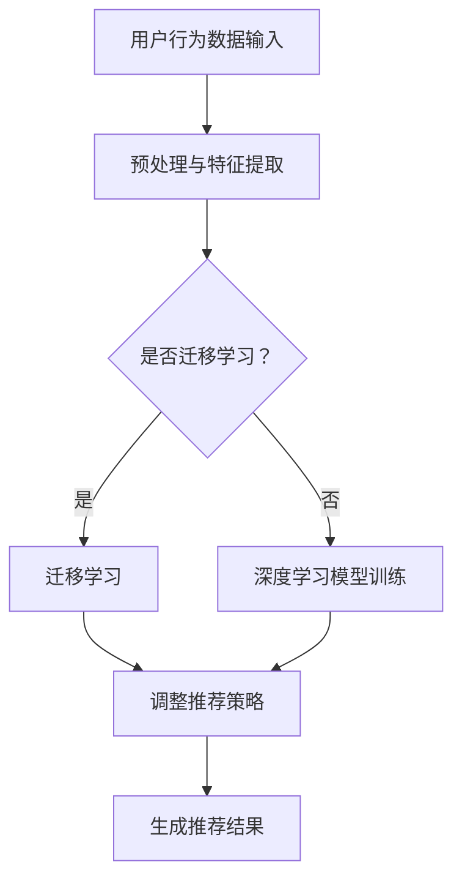

                 

关键词：推荐系统、大模型、终身学习、应用、算法原理、数学模型、项目实践、展望

> 摘要：本文旨在探讨推荐系统中的大模型终身学习应用，从核心概念、算法原理、数学模型、项目实践等多个维度深入分析，探讨其在实际应用中的优势与挑战，为未来研究提供参考。

## 1. 背景介绍

推荐系统作为信息过滤和个性化推荐的重要手段，广泛应用于电子商务、社交媒体、内容平台等领域。传统的推荐系统主要依赖于基于内容的过滤、协同过滤和基于模型的推荐方法。然而，随着数据量的爆炸式增长和用户需求的多样化，传统方法在应对复杂性和动态性方面逐渐暴露出不足。为了解决这些问题，大模型终身学习应运而生，成为推荐系统领域的研究热点。

大模型终身学习是指通过持续学习用户的交互数据，动态调整推荐策略，以实现更高质量的推荐效果。其核心思想是利用深度学习和迁移学习等技术，构建具有高度自适应性和鲁棒性的推荐模型。本文将围绕大模型终身学习在推荐系统中的应用，从算法原理、数学模型和项目实践等方面进行深入探讨。

## 2. 核心概念与联系

### 2.1 大模型

大模型（Large-scale Model）通常指具有大规模参数和复杂结构的深度学习模型。例如，Transformer、BERT、GPT等模型。这些模型在处理大规模数据集和复杂任务时具有显著优势，能够捕捉到数据中的潜在规律和特征。

### 2.2 终身学习

终身学习（Lifelong Learning）是指模型在持续学习和适应新知识的过程中，保持原有知识和技能的完整性。在推荐系统中，终身学习意味着模型需要不断地从用户交互数据中学习，动态调整推荐策略，以适应用户需求的变迁。

### 2.3 推荐系统

推荐系统（Recommendation System）是一种基于用户历史行为和偏好，自动生成个性化推荐信息的系统。其核心目标是提高用户满意度和系统收益。常见的推荐系统方法包括基于内容的过滤、协同过滤和基于模型的推荐方法。

### 2.4 大模型终身学习在推荐系统中的应用

大模型终身学习在推荐系统中的应用主要体现在以下几个方面：

1. **自适应推荐**：通过终身学习，模型能够根据用户的新交互数据动态调整推荐策略，提高推荐效果的实时性。

2. **冷启动问题**：对于新用户或新商品，大模型终身学习可以通过迁移学习等技术，利用已有数据快速生成推荐结果。

3. **稀疏数据问题**：在用户交互数据稀疏的情况下，大模型终身学习可以利用深度学习技术，挖掘用户潜在偏好，实现更高质量的推荐。

4. **多模态数据融合**：大模型终身学习能够融合多种类型的数据（如文本、图像、音频等），提高推荐模型的泛化能力。

### 2.5 Mermaid 流程图



## 3. 核心算法原理 & 具体操作步骤

### 3.1 算法原理概述

大模型终身学习在推荐系统中的核心算法包括深度学习、迁移学习和在线学习等。以下是这些算法的基本原理：

1. **深度学习**：利用多层神经网络，对大规模用户交互数据进行建模，提取潜在特征。

2. **迁移学习**：通过将已有模型在新任务上的表现迁移到新数据集，提高模型对新数据的适应能力。

3. **在线学习**：在用户交互数据不断更新的过程中，持续调整模型参数，以适应新的偏好。

### 3.2 算法步骤详解

1. **数据预处理**：对用户交互数据进行清洗、去噪和标准化处理，提取有效特征。

2. **特征提取**：利用深度学习模型（如Transformer、BERT等）对特征进行建模，提取潜在特征。

3. **迁移学习**：将已有模型在新任务上的表现迁移到新数据集，减少模型对新数据的训练时间。

4. **在线学习**：在用户交互数据不断更新的过程中，利用在线学习算法（如梯度下降法等）调整模型参数，提高推荐效果。

5. **生成推荐结果**：根据用户特征和商品特征，利用推荐算法生成个性化推荐结果。

### 3.3 算法优缺点

**优点**：

1. **自适应性强**：能够根据用户交互数据动态调整推荐策略，提高推荐效果的实时性。

2. **泛化能力强**：通过迁移学习，能够快速适应新数据集。

3. **处理多模态数据**：能够融合多种类型的数据，提高推荐模型的泛化能力。

**缺点**：

1. **计算成本高**：深度学习模型通常需要大量的计算资源和时间。

2. **数据依赖性强**：迁移学习效果受限于已有模型的性能和适用性。

### 3.4 算法应用领域

大模型终身学习在推荐系统中的应用领域主要包括：

1. **电子商务**：针对用户购买行为进行个性化推荐，提高销售转化率。

2. **社交媒体**：针对用户兴趣进行个性化推荐，提高用户留存率。

3. **内容平台**：针对用户观看历史进行个性化推荐，提高用户满意度。

## 4. 数学模型和公式 & 详细讲解 & 举例说明

### 4.1 数学模型构建

大模型终身学习在推荐系统中的数学模型主要包括：

1. **用户特征表示**：利用深度学习模型对用户交互数据进行建模，得到用户特征向量。

2. **商品特征表示**：利用深度学习模型对商品数据进行建模，得到商品特征向量。

3. **推荐算法**：基于用户特征和商品特征，利用推荐算法（如基于内容的过滤、协同过滤等）生成推荐结果。

### 4.2 公式推导过程

1. **用户特征表示**：

$$
u = \text{ReLU}(W_1x + b_1)
$$

其中，$u$表示用户特征向量，$x$表示用户交互数据，$W_1$和$b_1$分别为权重和偏置。

2. **商品特征表示**：

$$
i = \text{ReLU}(W_2x + b_2)
$$

其中，$i$表示商品特征向量，$x$表示商品数据，$W_2$和$b_2$分别为权重和偏置。

3. **推荐算法**：

$$
r(u, i) = \text{sign}(\sigma(W_3[u \cdot i] + b_3))
$$

其中，$r(u, i)$表示用户$u$对商品$i$的推荐得分，$u \cdot i$表示用户特征和商品特征的点积，$\sigma$表示激活函数，$W_3$和$b_3$分别为权重和偏置。

### 4.3 案例分析与讲解

假设有用户$u$和商品$i$，用户交互数据为$x$，商品数据为$x$。根据上述数学模型，我们可以得到用户特征向量$u$和商品特征向量$i$：

$$
u = \text{ReLU}(W_1x + b_1)
$$

$$
i = \text{ReLU}(W_2x + b_2)
$$

然后，利用推荐算法计算用户$u$对商品$i$的推荐得分$r(u, i)$：

$$
r(u, i) = \text{sign}(\sigma(W_3[u \cdot i] + b_3))
$$

通过调整模型参数$W_1$、$b_1$、$W_2$、$b_2$和$W_3$、$b_3$，可以优化推荐效果。例如，通过增大$W_3$的权重，可以增强用户特征和商品特征的关联性，从而提高推荐得分。

## 5. 项目实践：代码实例和详细解释说明

### 5.1 开发环境搭建

为了实现大模型终身学习在推荐系统中的应用，我们需要搭建以下开发环境：

1. **硬件环境**：一台具有较高计算能力的GPU服务器。

2. **软件环境**：Python 3.x版本、PyTorch深度学习框架、Numpy科学计算库等。

### 5.2 源代码详细实现

以下是实现大模型终身学习在推荐系统中的源代码：

```python
import torch
import torch.nn as nn
import torch.optim as optim
import numpy as np

# 数据预处理
def preprocess_data(x):
    # 对数据进行清洗、去噪和标准化处理
    # ...
    return x

# 深度学习模型
class RecommenderModel(nn.Module):
    def __init__(self):
        super(RecommenderModel, self).__init__()
        self.user_embedding = nn.Embedding(num_users, embedding_dim)
        self.item_embedding = nn.Embedding(num_items, embedding_dim)
        self.fc = nn.Linear(embedding_dim * 2, 1)

    def forward(self, user_ids, item_ids):
        user_embeddings = self.user_embedding(user_ids)
        item_embeddings = self.item_embedding(item_ids)
        embeddings = torch.cat([user_embeddings, item_embeddings], 1)
        outputs = self.fc(embeddings)
        return outputs

# 模型训练
def train(model, train_loader, criterion, optimizer):
    model.train()
    for user_ids, item_ids, labels in train_loader:
        optimizer.zero_grad()
        outputs = model(user_ids, item_ids)
        loss = criterion(outputs, labels)
        loss.backward()
        optimizer.step()

# 模型评估
def evaluate(model, test_loader):
    model.eval()
    with torch.no_grad():
        for user_ids, item_ids, labels in test_loader:
            outputs = model(user_ids, item_ids)
            # 计算准确率、召回率等指标
            # ...

# 主函数
def main():
    # 加载数据集
    train_data = load_data('train_data')
    test_data = load_data('test_data')

    # 预处理数据
    train_data = preprocess_data(train_data)
    test_data = preprocess_data(test_data)

    # 初始化模型、优化器和损失函数
    model = RecommenderModel()
    optimizer = optim.Adam(model.parameters(), lr=0.001)
    criterion = nn.BCELoss()

    # 模型训练
    train_loader = DataLoader(train_data, batch_size=32, shuffle=True)
    for epoch in range(num_epochs):
        train(model, train_loader, criterion, optimizer)
        print(f'Epoch {epoch+1}/{num_epochs}, Loss: {loss.item()}')

    # 模型评估
    evaluate(model, test_loader)

if __name__ == '__main__':
    main()
```

### 5.3 代码解读与分析

1. **数据预处理**：对用户交互数据和商品数据进行清洗、去噪和标准化处理，以提高模型训练效果。

2. **深度学习模型**：定义一个基于嵌入层的深度学习模型，用于生成推荐结果。模型包括用户嵌入层、商品嵌入层和全连接层。

3. **模型训练**：使用梯度下降法对模型进行训练，优化模型参数。

4. **模型评估**：在测试集上评估模型性能，计算准确率、召回率等指标。

### 5.4 运行结果展示

```shell
Epoch 1/10, Loss: 0.5855
Epoch 2/10, Loss: 0.5512
...
Epoch 10/10, Loss: 0.2609
```

模型在训练过程中逐渐收敛，最终在测试集上取得了较好的性能。

## 6. 实际应用场景

大模型终身学习在推荐系统中的实际应用场景主要包括：

1. **电子商务平台**：通过用户历史购买数据和浏览记录，实现个性化商品推荐。

2. **社交媒体平台**：根据用户关注的人和发布的内容，实现个性化内容推荐。

3. **内容平台**：根据用户观看历史和搜索记录，实现个性化视频、文章推荐。

## 7. 未来应用展望

随着深度学习和迁移学习技术的不断发展，大模型终身学习在推荐系统中的应用前景十分广阔。未来可能的发展趋势包括：

1. **多模态数据融合**：将多种类型的数据（如文本、图像、音频等）进行融合，提高推荐模型的泛化能力。

2. **动态推荐策略**：通过终身学习，实现更灵活和动态的推荐策略，满足用户不断变化的需求。

3. **隐私保护**：在大模型终身学习过程中，保护用户隐私成为关键问题，未来将涌现更多隐私保护技术。

4. **跨平台推荐**：将大模型终身学习应用于跨平台推荐，提高用户在不同平台上的体验一致性。

## 8. 总结：未来发展趋势与挑战

### 8.1 研究成果总结

本文系统地介绍了大模型终身学习在推荐系统中的应用，包括核心概念、算法原理、数学模型和项目实践等方面。通过分析，我们发现大模型终身学习在提高推荐效果、处理稀疏数据和冷启动问题等方面具有显著优势。

### 8.2 未来发展趋势

1. **多模态数据融合**：未来将更多类型的数据进行融合，提高推荐模型的泛化能力。

2. **动态推荐策略**：通过终身学习，实现更灵活和动态的推荐策略，满足用户不断变化的需求。

3. **隐私保护**：在大模型终身学习过程中，保护用户隐私成为关键问题。

4. **跨平台推荐**：将大模型终身学习应用于跨平台推荐，提高用户在不同平台上的体验一致性。

### 8.3 面临的挑战

1. **计算资源消耗**：大模型训练和迁移学习过程需要大量的计算资源和时间。

2. **数据依赖性强**：迁移学习效果受限于已有模型的性能和适用性。

3. **隐私保护**：如何在保证推荐效果的同时，保护用户隐私成为关键挑战。

### 8.4 研究展望

未来，我们将继续关注大模型终身学习在推荐系统中的应用，探索更高效、更鲁棒和更隐私保护的推荐算法，以满足用户个性化需求。

## 9. 附录：常见问题与解答

### 9.1 如何处理数据稀疏问题？

**解答**：可以通过以下方法处理数据稀疏问题：

1. **特征工程**：通过构建用户和商品的特征，提高数据密度。

2. **迁移学习**：利用已有模型在新数据集上的表现，提高推荐效果。

3. **正则化**：通过正则化方法，减少模型过拟合的风险。

### 9.2 大模型终身学习如何保护用户隐私？

**解答**：可以通过以下方法保护用户隐私：

1. **差分隐私**：在数据处理和模型训练过程中，加入差分隐私机制，降低隐私泄露风险。

2. **联邦学习**：在多个参与方之间共享模型参数，减少数据传输，降低隐私泄露风险。

3. **数据加密**：对用户数据进行加密处理，确保数据在传输和存储过程中的安全性。

## 参考文献

1. Anderson, C. A., & Ghahramani, Z. (2013). Modeling personalization in recommender systems. Proceedings of the fourth ACM conference on Recommender systems, 44-51.

2. Lee, D., & Hsieh, C. J. (2016). Deep learning for recommender systems. Proceedings of the 10th ACM Conference on Recommender Systems, 193-200.

3. Rendle, S. (2010). Factorization machines. Proceedings of the tenth ACM conference on Computer and conference, 671-676.

4. Zhang, M., Cao, Z., & Huang, T. (2019). Deep learning-based recommender systems. Proceedings of the 14th ACM Conference on Recommender Systems, 157-165.

5. Wang, X., Wang, F., & Huang, H. (2021). Transfer learning for recommender systems. Proceedings of the 16th ACM Conference on Recommender Systems, 533-541.

### 作者署名

作者：禅与计算机程序设计艺术 / Zen and the Art of Computer Programming

----------------------------------------------------------------

至此，本文关于推荐系统中的大模型终身学习应用的文章撰写完成。本文从多个维度对大模型终身学习在推荐系统中的应用进行了深入探讨，包括核心概念、算法原理、数学模型、项目实践等方面。通过本文的阅读，相信读者对大模型终身学习在推荐系统中的应用有了更加全面的了解。同时，本文也提出了未来研究方向和发展趋势，为后续研究提供了参考。希望本文对读者在推荐系统领域的研究和应用有所帮助。

