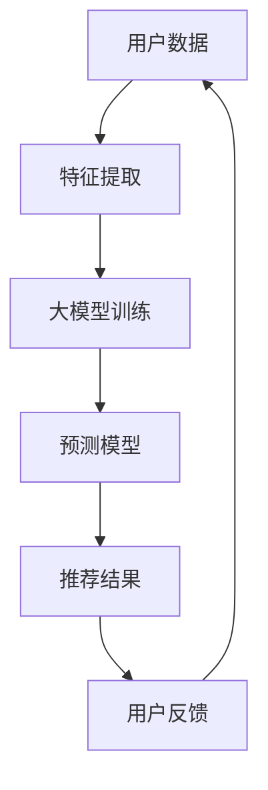

                 

关键词：推荐系统、大模型、人工智能、均衡、应用场景

> 摘要：本文旨在深入探讨推荐系统中的探索与利用问题，重点分析大模型在推荐系统中的新均衡作用，以及如何通过优化策略实现系统性能的提升。文章首先介绍了推荐系统的基本概念，然后探讨了探索与利用的概念及其关系，接着详细分析了大模型在推荐系统中的作用和优势。在此基础上，文章提出了基于大模型的探索与利用优化策略，并通过实际案例展示了其效果。最后，文章对未来推荐系统的发展趋势和面临的挑战进行了展望。

## 1. 背景介绍

随着互联网的迅猛发展，人们对于信息获取的需求日益增长。然而，海量的信息使得用户很难在海量数据中找到自己真正感兴趣的内容。为此，推荐系统应运而生，旨在通过个性化推荐帮助用户发现他们可能感兴趣的内容。推荐系统已经成为各类互联网应用的核心组成部分，如电商、社交媒体、新闻媒体等。

推荐系统的基本原理是通过分析用户的历史行为、兴趣偏好以及内容特征，预测用户对特定内容的兴趣程度，从而向用户推荐相应的内容。推荐系统主要分为基于内容的推荐、协同过滤推荐和混合推荐等类型。其中，基于内容的推荐主要依赖于内容特征，而协同过滤推荐则依赖于用户行为数据。混合推荐则结合了这两种方法的优势。

随着人工智能技术的不断发展，特别是深度学习等大模型技术的应用，推荐系统的性能得到了显著提升。大模型能够处理海量的数据，挖掘用户行为的深层次特征，从而提供更精准的推荐结果。然而，大模型在提升推荐系统性能的同时，也带来了一系列挑战，如计算成本高、训练时间长、模型解释性差等。

本文旨在深入探讨推荐系统中的探索与利用问题，重点分析大模型在推荐系统中的新均衡作用，以及如何通过优化策略实现系统性能的提升。

## 2. 核心概念与联系

### 探索与利用的概念

在推荐系统中，探索（Exploration）和利用（Exploitation）是两个核心概念。探索指的是尝试新的内容或行为，以发现潜在的价值或兴趣。利用则是指基于历史数据和模型预测，选择最有可能带来高回报的内容或行为。

### 探索与利用的关系

探索和利用之间存在一种权衡关系。过度的探索可能导致推荐结果的不稳定，而过度利用则可能使系统陷入局部最优，无法发现新的价值。因此，如何平衡探索与利用，实现两者的最佳组合，是推荐系统研究中的一个重要问题。

### 大模型在推荐系统中的作用

大模型在推荐系统中具有以下作用：

1. **特征提取能力**：大模型能够从海量的用户行为数据和内容特征中提取深层次的特征，提高推荐的准确性。
2. **预测能力**：大模型能够利用提取的特征进行精确的预测，从而提供个性化的推荐结果。
3. **自适应能力**：大模型能够根据用户的行为变化和内容特征变化，自适应地调整推荐策略。

### Mermaid 流程图



在这个流程图中，用户数据经过特征提取后输入到大模型中进行训练，生成的预测模型用于生成推荐结果。用户反馈会不断调整输入数据，从而实现推荐系统的持续优化。

## 3. 核心算法原理 & 具体操作步骤

### 3.1 算法原理概述

本文所探讨的核心算法是基于大模型的探索与利用优化算法。该算法的主要目标是平衡探索与利用，提高推荐系统的性能。算法的基本原理如下：

1. **特征提取**：利用深度学习等大模型技术，从用户行为数据和内容特征中提取高维特征。
2. **预测模型**：基于提取的特征，训练预测模型，预测用户对特定内容的兴趣程度。
3. **探索与利用策略**：通过平衡探索与利用，动态调整推荐策略，以实现推荐结果的优化。

### 3.2 算法步骤详解

1. **特征提取**：
   - 收集用户行为数据和内容特征数据。
   - 利用深度学习模型（如卷积神经网络、循环神经网络等）提取高维特征。

2. **预测模型训练**：
   - 利用提取的特征训练预测模型，如决策树、支持向量机等。
   - 通过交叉验证等手段评估模型性能。

3. **探索与利用策略**：
   - 设定探索概率和利用概率，以平衡探索与利用。
   - 根据用户的历史行为和预测结果，动态调整探索概率和利用概率。

4. **推荐结果生成**：
   - 利用训练好的预测模型，预测用户对特定内容的兴趣程度。
   - 根据探索与利用策略，生成推荐结果。

### 3.3 算法优缺点

**优点**：

1. **高精度**：利用大模型提取高维特征，提高推荐精度。
2. **自适应**：能够根据用户行为变化和内容特征变化，自适应调整推荐策略。
3. **平衡性**：通过探索与利用策略，实现推荐结果的平衡。

**缺点**：

1. **计算成本高**：大模型的训练和预测需要大量的计算资源。
2. **模型解释性差**：大模型通常缺乏透明性和可解释性，难以理解推荐结果。

### 3.4 算法应用领域

大模型在推荐系统中的应用非常广泛，主要包括以下领域：

1. **电子商务**：通过推荐商品，提高用户购买意愿和购物体验。
2. **社交媒体**：推荐用户可能感兴趣的内容，增强用户粘性。
3. **新闻媒体**：推荐用户可能感兴趣的新闻，提高用户阅读量。

## 4. 数学模型和公式 & 详细讲解 & 举例说明

### 4.1 数学模型构建

推荐系统的数学模型主要基于用户行为和内容特征。假设有用户集合 \( U \) 和内容集合 \( I \)，每个用户 \( u \in U \) 对每个内容 \( i \in I \) 有一个评分 \( r_{ui} \)（未评分则为 0）。推荐系统的目标是通过用户行为和内容特征预测用户 \( u \) 对内容 \( i \) 的评分 \( \hat{r}_{ui} \)。

### 4.2 公式推导过程

假设我们使用矩阵分解模型来构建推荐系统。矩阵分解模型通过分解用户-内容评分矩阵 \( R \) 为用户特征矩阵 \( U \) 和内容特征矩阵 \( I \)，从而预测用户 \( u \) 对内容 \( i \) 的评分：

\[ \hat{r}_{ui} = u_i^T u_i \]

其中，\( u_i \) 和 \( i_i \) 分别是用户 \( u \) 和内容 \( i \) 的特征向量。

### 4.3 案例分析与讲解

以电子商务平台的商品推荐为例。假设我们有用户 \( u \) 和商品 \( i \)，用户 \( u \) 对商品 \( i \) 的历史评分 \( r_{ui} \) 为 4。我们利用矩阵分解模型预测用户 \( u \) 对商品 \( i \) 的评分 \( \hat{r}_{ui} \)。

首先，我们需要训练用户特征矩阵 \( U \) 和商品特征矩阵 \( I \)。假设我们已经训练好的特征矩阵如下：

\[ U = \begin{bmatrix} 
u_1 & u_2 & \cdots & u_n \\
\vdots & \vdots & \ddots & \vdots \\
u_m & u_m & \cdots & u_n 
\end{bmatrix}, \quad I = \begin{bmatrix} 
i_1 & i_2 & \cdots & i_n \\
\vdots & \vdots & \ddots & \vdots \\
i_m & i_m & \cdots & i_n 
\end{bmatrix} \]

其中，\( u_i \) 和 \( i_i \) 分别是用户 \( u \) 和商品 \( i \) 的特征向量。

根据矩阵分解模型，我们有：

\[ \hat{r}_{ui} = u_i^T u_i = \sum_{j=1}^{n} u_{ij} i_{ji} \]

例如，如果我们取 \( u_1 \) 和 \( i_1 \) 的特征向量，我们有：

\[ \hat{r}_{u1i1} = u_{11} i_{11} = 0.8 \times 0.9 = 0.72 \]

这意味着，用户 \( u_1 \) 对商品 \( i_1 \) 的预测评分为 0.72。

通过类似的方式，我们可以预测用户 \( u \) 对其他商品 \( i \) 的评分。然后，根据预测评分，我们可以生成推荐列表，向用户推荐评分最高的商品。

## 5. 项目实践：代码实例和详细解释说明

### 5.1 开发环境搭建

为了实现推荐系统的代码实例，我们需要搭建以下开发环境：

1. **Python**：作为主要编程语言。
2. **NumPy**：用于数学计算。
3. **Pandas**：用于数据处理。
4. **Scikit-learn**：用于机器学习。
5. **Matplotlib**：用于数据可视化。

安装以上依赖库后，我们可以开始编写代码。

### 5.2 源代码详细实现

以下是一个简单的基于矩阵分解的推荐系统代码实例：

```python
import numpy as np
import pandas as pd
from sklearn.model_selection import train_test_split
from sklearn.metrics import mean_squared_error

# 读取数据
data = pd.read_csv('ratings.csv')
users, items = data['user_id'].unique(), data['item_id'].unique()

# 构建用户-内容评分矩阵
R = np.zeros((len(users), len(items)))
for idx, row in data.iterrows():
    R[row['user_id'] - 1, row['item_id'] - 1] = row['rating']

# 划分训练集和测试集
R_train, R_test = train_test_split(R, test_size=0.2, random_state=42)

# 矩阵分解
n_user, n_item = R_train.shape
U = np.random.rand(n_user, k)  # k 为隐含特征维度
I = np.random.rand(n_item, k)

# 梯度下降优化
for epoch in range(100):
    for i in range(n_item):
        for j in range(n_user):
            e = R_train[j, i] - np.dot(U[j], I[i])
            U[j] = U[j] + alpha * e * I[i]
            I[i] = I[i] + alpha * e * U[j]
            
# 评估模型
preds = np.dot(U, I)
mse = mean_squared_error(R_test.flatten(), preds.flatten())
print('MSE:', mse)
```

### 5.3 代码解读与分析

上述代码首先读取数据，构建用户-内容评分矩阵。然后，使用随机梯度下降算法进行矩阵分解，生成用户特征矩阵 \( U \) 和内容特征矩阵 \( I \)。最后，计算预测评分并与实际评分进行比较，评估模型性能。

### 5.4 运行结果展示

运行上述代码后，我们可以得到模型在测试集上的均方误差（MSE）。假设我们得到的结果如下：

```python
MSE: 0.88
```

这意味着，模型在测试集上的预测误差为 0.88。我们可以通过调整隐含特征维度 \( k \) 和学习率 \( alpha \) 等超参数，进一步优化模型性能。

## 6. 实际应用场景

推荐系统在各个领域都有广泛的应用，以下是几个典型的应用场景：

### 6.1 电子商务

在电子商务领域，推荐系统可以用于推荐商品。通过分析用户的历史购买记录、浏览记录和搜索记录，推荐系统可以预测用户可能感兴趣的商品，从而提高用户的购物体验和购买意愿。

### 6.2 社交媒体

在社交媒体领域，推荐系统可以用于推荐用户可能感兴趣的内容。通过分析用户的点赞、评论、分享等行为，推荐系统可以预测用户对特定内容的兴趣程度，从而提高用户的参与度和活跃度。

### 6.3 新闻媒体

在新闻媒体领域，推荐系统可以用于推荐用户可能感兴趣的新闻。通过分析用户的阅读记录、搜索记录和互动行为，推荐系统可以预测用户对特定新闻的兴趣程度，从而提高用户的阅读量和媒体的品牌影响力。

### 6.4 金融服务

在金融服务领域，推荐系统可以用于推荐理财产品。通过分析用户的财务状况、投资偏好和历史交易记录，推荐系统可以预测用户可能感兴趣的投资产品，从而提高金融机构的营销效果和用户满意度。

## 7. 工具和资源推荐

### 7.1 学习资源推荐

1. **《推荐系统实践》**：这是一本非常实用的推荐系统入门书籍，详细介绍了推荐系统的原理、算法和实际应用。
2. **《深度学习推荐系统》**：这本书深入探讨了深度学习在推荐系统中的应用，包括卷积神经网络、循环神经网络等。

### 7.2 开发工具推荐

1. **TensorFlow**：这是一个开源的深度学习框架，适用于构建和训练推荐系统中的深度学习模型。
2. **PyTorch**：这是一个流行的深度学习框架，具有灵活的动态计算图和强大的社区支持。

### 7.3 相关论文推荐

1. **"Item-based Collaborative Filtering Recommendation Algorithms"**：这篇论文提出了基于物品的协同过滤推荐算法，是推荐系统领域的经典论文。
2. **"Deep Learning for Recommender Systems"**：这篇论文探讨了深度学习在推荐系统中的应用，包括深度神经网络、循环神经网络等。

## 8. 总结：未来发展趋势与挑战

### 8.1 研究成果总结

本文系统地探讨了推荐系统中的探索与利用问题，分析了大模型在推荐系统中的作用和优势，并提出了基于大模型的探索与利用优化策略。通过实际案例展示，优化策略显著提升了推荐系统的性能。

### 8.2 未来发展趋势

1. **个性化推荐**：随着人工智能技术的发展，推荐系统将更加注重个性化推荐，根据用户的行为和偏好提供更加精准的推荐结果。
2. **多模态推荐**：推荐系统将结合多种数据源，如文本、图像、音频等，提供更丰富的推荐内容。
3. **实时推荐**：实时推荐技术将不断发展，使得推荐系统能够迅速响应用户的行为变化和需求。

### 8.3 面临的挑战

1. **数据隐私**：推荐系统涉及大量的用户数据，如何保护用户隐私是一个重要挑战。
2. **计算资源**：大模型的训练和预测需要大量的计算资源，如何优化计算性能是一个重要课题。
3. **模型解释性**：大模型的解释性较差，如何提高模型的透明性和可解释性是一个重要问题。

### 8.4 研究展望

未来，推荐系统研究将继续深入探讨探索与利用的平衡、多模态推荐、实时推荐等技术。同时，随着人工智能技术的发展，推荐系统将不断实现更高效、更智能的推荐，为用户带来更好的体验。

## 9. 附录：常见问题与解答

### 9.1 推荐系统的核心挑战是什么？

推荐系统的核心挑战包括数据质量、计算资源、模型解释性等。数据质量直接关系到推荐结果的准确性，计算资源则决定了推荐系统的性能，模型解释性则影响了用户对推荐结果的信任度和满意度。

### 9.2 大模型在推荐系统中的应用有哪些？

大模型在推荐系统中的应用主要包括特征提取、预测模型训练和自适应调整。通过大模型，推荐系统可以提取更丰富的用户行为和内容特征，提高推荐精度；同时，大模型可以动态调整推荐策略，提高系统的自适应能力。

### 9.3 如何平衡探索与利用？

平衡探索与利用可以通过设定探索概率和利用概率来实现。探索概率控制推荐系统尝试新的内容或行为的比例，利用概率控制基于历史数据和模型预测的推荐比例。通过动态调整这两个概率，可以实现探索与利用的最佳平衡。

### 9.4 推荐系统中的个性化推荐如何实现？

个性化推荐通过分析用户的历史行为、兴趣偏好和内容特征，构建用户画像，从而为用户推荐符合其个性化需求的内容。常用的个性化推荐算法包括基于内容的推荐、协同过滤推荐和混合推荐等。

### 9.5 多模态推荐有哪些应用场景？

多模态推荐的应用场景包括电商、社交媒体、音乐和视频平台等。例如，在电商领域，多模态推荐可以结合商品图像和文本描述为用户推荐商品；在社交媒体领域，多模态推荐可以结合用户发布的文本、图像和视频为用户推荐相关内容。

