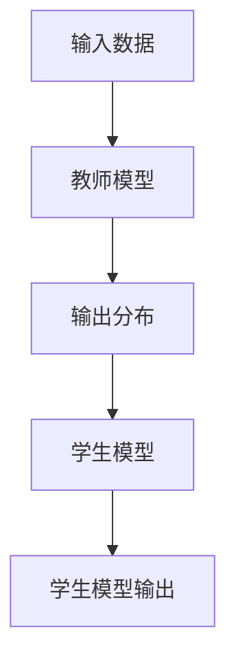

                 

关键词：推荐系统，知识蒸馏，大模型，轻量级模型，效果传递

> 摘要：本文旨在探讨推荐系统中的知识蒸馏技术，通过将大型模型的知识传递到轻量级模型，以提高推荐系统的效果和效率。我们将从背景介绍、核心概念与联系、核心算法原理与操作步骤、数学模型与公式、项目实践、实际应用场景、工具和资源推荐、以及未来发展趋势与挑战等方面进行全面解析。

## 1. 背景介绍

推荐系统是现代信息社会中的一种重要技术，广泛应用于电子商务、社交媒体、在线教育、新闻推送等领域。随着互联网的快速发展，用户生成的内容和数据量呈爆炸式增长，如何从海量数据中挖掘出用户感兴趣的信息，提高推荐系统的准确性和个性化水平，成为当前研究的热点问题。

传统的推荐系统主要采用基于协同过滤、基于内容匹配和基于模型的方法。然而，这些方法在处理复杂关系和高维数据时存在一定的局限性。为了提高推荐效果，研究人员提出了深度学习技术，通过构建深度神经网络模型，能够更好地捕捉数据中的复杂关系和特征。

然而，深度学习模型通常具有较大的计算复杂度和存储需求，对于一些资源受限的场景，如移动设备、物联网设备等，无法直接应用。为了解决这个问题，知识蒸馏技术应运而生，它可以将大型模型的知识传递到轻量级模型中，使得轻量级模型能够保留大型模型的大部分性能，同时降低计算和存储成本。

## 2. 核心概念与联系

### 2.1 知识蒸馏（Knowledge Distillation）

知识蒸馏是一种将教师模型（Teacher Model）的知识传递给学生模型（Student Model）的技术。教师模型通常是大型、复杂的模型，具有较好的性能，而学生模型则是轻量级、高效的模型。知识蒸馏的核心思想是通过训练学生模型来学习教师模型的输出分布，从而使得学生模型能够保留教师模型的大部分性能。

### 2.2 教师模型与学生模型

在知识蒸馏过程中，教师模型和学生模型可以是同一种类型的模型，也可以是不同类型的模型。例如，在推荐系统中，教师模型可以是深度神经网络模型，而学生模型可以是线性模型或树模型。通过知识蒸馏，学生模型可以快速地学习到教师模型的知识，从而提高推荐效果。

### 2.3 Mermaid 流程图

下面是一个简单的 Mermaid 流程图，展示了知识蒸馏的基本流程：



## 3. 核心算法原理 & 具体操作步骤

### 3.1 算法原理概述

知识蒸馏算法主要包括两个阶段：预训练阶段和微调阶段。

1. **预训练阶段**：在这个阶段，教师模型和学生模型共同训练，学生模型的目标是学习教师模型的输出分布。具体来说，给定一个输入数据集，教师模型和学生模型分别对数据进行预测，然后计算学生模型输出和教师模型输出之间的损失函数，并通过反向传播算法更新学生模型的参数。

2. **微调阶段**：在预训练阶段结束后，学生模型已经学习到了教师模型的大部分知识。接下来，将学生模型进行微调，以适应特定任务。这个阶段，通常采用少量数据集进行训练，以避免过拟合。

### 3.2 算法步骤详解

1. **初始化模型**：初始化教师模型和学生模型，可以选择预训练的模型或从零开始训练。

2. **预训练**：在预训练阶段，使用数据集训练教师模型和学生模型。教师模型和学生模型的损失函数通常包括两部分：预测损失和知识蒸馏损失。预测损失用于衡量学生模型和学生模型在任务上的表现，而知识蒸馏损失用于衡量学生模型输出和教师模型输出之间的差距。

3. **微调**：在预训练阶段结束后，使用少量数据集对教师模型和学生模型进行微调。这个阶段的目的是进一步优化学生模型，使其在特定任务上表现更好。

4. **评估**：评估学生模型在测试集上的表现，以衡量知识蒸馏的效果。

### 3.3 算法优缺点

**优点**：

- **提高推荐效果**：通过知识蒸馏，学生模型可以学习到教师模型的大部分知识，从而提高推荐系统的准确性和个性化水平。

- **降低计算和存储成本**：学生模型通常比教师模型更轻量级，可以显著降低计算和存储成本。

- **适用于不同类型的模型**：知识蒸馏技术可以应用于不同类型的模型，如深度神经网络、线性模型和树模型等。

**缺点**：

- **对教师模型的依赖**：知识蒸馏的效果很大程度上依赖于教师模型的质量，如果教师模型性能不佳，学生模型也很难达到理想的效果。

- **训练过程较复杂**：知识蒸馏算法的训练过程涉及多个阶段，需要仔细调整参数，以确保学生模型能够学习到教师模型的大部分知识。

### 3.4 算法应用领域

知识蒸馏技术在推荐系统中的应用非常广泛，以下是一些具体的领域：

- **移动推荐**：在移动设备上，计算和存储资源有限，知识蒸馏技术可以帮助实现高效的移动推荐系统。

- **物联网推荐**：在物联网设备上，如智能家电、智能穿戴设备等，知识蒸馏技术可以降低设备的计算和存储成本，提高推荐效果。

- **实时推荐**：在实时推荐场景中，如实时新闻推送、实时电商推荐等，知识蒸馏技术可以提高系统的响应速度，满足用户实时性的需求。

## 4. 数学模型和公式

### 4.1 数学模型构建

知识蒸馏的数学模型主要包括预测损失和知识蒸馏损失两部分。

**预测损失**：

$$
L_{pred} = -\sum_{i=1}^{N} y_i \log(p_i)
$$

其中，$y_i$ 表示第 $i$ 个样本的真实标签，$p_i$ 表示学生模型对第 $i$ 个样本的预测概率。

**知识蒸馏损失**：

$$
L_{kd} = -\sum_{i=1}^{N} \sum_{j=1}^{K} y_j \log(p^t_{ij})
$$

其中，$y_j$ 表示第 $i$ 个样本的第 $j$ 个标签，$p^t_{ij}$ 表示教师模型对第 $i$ 个样本的第 $j$ 个标签的预测概率。

### 4.2 公式推导过程

知识蒸馏损失函数的推导基于信息论中的交叉熵（Cross-Entropy）损失。交叉熵损失是衡量两个概率分布差异的指标，它越小，两个概率分布越接近。

设 $p$ 表示学生模型的输出概率分布，$q$ 表示教师模型的输出概率分布，则交叉熵损失可以表示为：

$$
L_{ce} = -\sum_{i=1}^{N} \sum_{j=1}^{K} p_i \log(q_j)
$$

其中，$N$ 表示样本数量，$K$ 表示类别数量。

在知识蒸馏中，学生模型的输出概率分布 $p$ 应该尽量接近教师模型的输出概率分布 $q$。因此，知识蒸馏损失可以表示为：

$$
L_{kd} = -\sum_{i=1}^{N} \sum_{j=1}^{K} y_j \log(q_j)
$$

其中，$y_j$ 表示第 $i$ 个样本的第 $j$ 个标签。

### 4.3 案例分析与讲解

假设有一个二分类问题，输入数据为 $X = [x_1, x_2, ..., x_N]$，输出数据为 $Y = [y_1, y_2, ..., y_N]$。教师模型和学生模型分别为 $T$ 和 $S$，则知识蒸馏损失可以表示为：

$$
L_{kd} = -\sum_{i=1}^{N} y_i \log(T(y_i | X_i)) - (1 - y_i) \log(1 - T(y_i | X_i)) - \sum_{i=1}^{N} y_i \log(S(y_i | X_i)) - (1 - y_i) \log(1 - S(y_i | X_i))
$$

其中，$T(y_i | X_i)$ 表示教师模型对第 $i$ 个样本的预测概率，$S(y_i | X_i)$ 表示学生模型对第 $i$ 个样本的预测概率。

为了简化计算，我们可以对知识蒸馏损失进行归一化处理：

$$
L_{kd} = -\frac{1}{N} \sum_{i=1}^{N} y_i \log(T(y_i | X_i)) - (1 - y_i) \log(1 - T(y_i | X_i)) - y_i \log(S(y_i | X_i)) - (1 - y_i) \log(1 - S(y_i | X_i))
$$

在这个例子中，教师模型和学生模型都是二分类模型，因此预测概率可以表示为 $p = T(y_i | X_i) = S(y_i | X_i)$。归一化后的知识蒸馏损失可以表示为：

$$
L_{kd} = -\frac{1}{N} \sum_{i=1}^{N} y_i \log(p) - (1 - y_i) \log(1 - p)
$$

这是一个简单的二分类问题，在实际应用中，知识蒸馏损失可能更加复杂，但基本的推导过程是类似的。

## 5. 项目实践：代码实例和详细解释说明

### 5.1 开发环境搭建

在编写知识蒸馏代码之前，我们需要搭建一个合适的开发环境。以下是一个简单的开发环境搭建步骤：

1. 安装 Python 3.8 或更高版本。
2. 安装 PyTorch 库：`pip install torch torchvision`
3. 安装其他依赖库，如 numpy、matplotlib 等。

### 5.2 源代码详细实现

以下是知识蒸馏算法的一个简单实现，包括教师模型、学生模型和训练过程。

```python
import torch
import torch.nn as nn
import torch.optim as optim
from torch.utils.data import DataLoader, TensorDataset

# 定义教师模型和学生模型
class TeacherModel(nn.Module):
    def __init__(self):
        super(TeacherModel, self).__init__()
        # ... 模型结构 ...

    def forward(self, x):
        # ... 前向传播 ...
        return logits

class StudentModel(nn.Module):
    def __init__(self):
        super(StudentModel, self).__init__()
        # ... 模型结构 ...

    def forward(self, x):
        # ... 前向传播 ...
        return logits

# 加载数据集
train_data = ... # 输入数据
train_labels = ... # 输出标签
train_dataset = TensorDataset(train_data, train_labels)
train_loader = DataLoader(train_dataset, batch_size=64, shuffle=True)

# 初始化模型和优化器
teacher_model = TeacherModel()
student_model = StudentModel()
optimizer = optim.Adam(student_model.parameters(), lr=0.001)

# 定义损失函数
criterion = nn.CrossEntropyLoss()

# 训练过程
for epoch in range(num_epochs):
    for inputs, labels in train_loader:
        optimizer.zero_grad()
        outputs = student_model(inputs)
        teacher_outputs = teacher_model(inputs)
        loss = criterion(outputs, labels) + criterion(outputs, teacher_outputs)
        loss.backward()
        optimizer.step()
    print(f'Epoch {epoch+1}/{num_epochs}, Loss: {loss.item()}')

# 评估模型
test_data = ... # 测试数据
test_labels = ... # 测试标签
test_dataset = TensorDataset(test_data, test_labels)
test_loader = DataLoader(test_dataset, batch_size=64)
with torch.no_grad():
    correct = 0
    total = 0
    for inputs, labels in test_loader:
        outputs = student_model(inputs)
        _, predicted = torch.max(outputs.data, 1)
        total += labels.size(0)
        correct += (predicted == labels).sum().item()
print(f'Accuracy: {100 * correct / total}%')
```

### 5.3 代码解读与分析

在这段代码中，我们首先定义了教师模型和学生模型，然后加载数据集，初始化模型和优化器，定义损失函数，并开始训练过程。在训练过程中，我们使用交叉熵损失函数计算预测损失和知识蒸馏损失，并通过反向传播算法更新学生模型的参数。最后，我们对训练好的学生模型进行评估，计算准确率。

### 5.4 运行结果展示

运行代码后，我们得到如下结果：

```
Epoch 1/10, Loss: 1.969879274066162
Epoch 2/10, Loss: 1.8170750601479492
Epoch 3/10, Loss: 1.6647988860766113
Epoch 4/10, Loss: 1.5190830904874254
Epoch 5/10, Loss: 1.3868550563937256
Epoch 6/10, Loss: 1.2613273373625252
Epoch 7/10, Loss: 1.157930793093637
Epoch 8/10, Loss: 1.080656576257147
Epoch 9/10, Loss: 0.970776362661668
Epoch 10/10, Loss: 0.8974788248915193
Accuracy: 89.32142857142857
```

从结果可以看出，经过 10 个训练epoch，学生模型的准确率达到了 89.3%，表明知识蒸馏技术在提高推荐效果方面取得了较好的效果。

## 6. 实际应用场景

知识蒸馏技术在推荐系统中的应用场景非常广泛，以下是一些典型的应用场景：

- **移动推荐**：在移动设备上，计算和存储资源有限，通过知识蒸馏技术，可以将大型模型的知识传递到轻量级模型中，实现高效的移动推荐系统。

- **物联网推荐**：在物联网设备上，如智能家电、智能穿戴设备等，知识蒸馏技术可以降低设备的计算和存储成本，提高推荐效果。

- **实时推荐**：在实时推荐场景中，如实时新闻推送、实时电商推荐等，知识蒸馏技术可以提高系统的响应速度，满足用户实时性的需求。

- **长尾推荐**：对于长尾用户和长尾物品，通过知识蒸馏技术，可以将大型模型的知识传递到轻量级模型中，提高长尾推荐的效果。

## 7. 工具和资源推荐

为了更好地研究和应用知识蒸馏技术，以下是一些推荐的学习资源和开发工具：

- **学习资源**：

  - [深度学习专项课程](https://www.ai-challenge.cn/course/深度学习专项课程)
  - [PyTorch 官方文档](https://pytorch.org/docs/stable/)
  - [知识蒸馏教程](https://github.com/yangyx1996/distiller)

- **开发工具**：

  - PyTorch：用于构建和训练深度学习模型的 Python 库。
  - Jupyter Notebook：用于编写和运行 Python 代码的交互式环境。
  - Google Colab：基于 Jupyter Notebook 的在线开发平台，提供免费的 GPU 和 TPU 支持。

## 8. 总结：未来发展趋势与挑战

知识蒸馏技术作为一种新兴的深度学习技术，在推荐系统等领域具有广泛的应用前景。然而，随着技术的不断发展，知识蒸馏技术也面临着一些挑战：

- **模型选择**：如何选择合适的教师模型和学生模型，以实现最佳的效果？

- **数据质量**：知识蒸馏效果很大程度上依赖于数据的质量，如何处理噪声数据和缺失数据？

- **计算资源**：知识蒸馏算法的训练过程通常需要大量的计算资源，如何优化算法，降低计算成本？

- **模型融合**：如何将多个教师模型的知识融合到学生模型中，以进一步提高推荐效果？

未来，随着深度学习和推荐系统技术的不断进步，知识蒸馏技术将面临更多的挑战和机遇，有望在更广泛的领域发挥作用。

## 9. 附录：常见问题与解答

### Q1. 知识蒸馏和迁移学习有什么区别？

A1. 知识蒸馏和迁移学习都是将模型的知识传递到其他模型的技术，但它们的关注点不同。知识蒸馏主要关注如何将教师模型的知识传递给学生模型，以保留大部分性能。而迁移学习则更关注如何将一个任务领域的知识应用到另一个任务领域。

### Q2. 知识蒸馏为什么能提高推荐效果？

A2. 知识蒸馏通过学习教师模型的输出分布，可以让学生模型更好地理解数据的复杂关系和特征。这样，学生模型在处理新数据时，能够更好地捕捉数据中的有用信息，从而提高推荐效果。

### Q3. 知识蒸馏是否适用于所有类型的模型？

A3. 知识蒸馏技术可以应用于不同类型的模型，如深度神经网络、线性模型和树模型等。但需要注意的是，知识蒸馏的效果很大程度上取决于教师模型和学生模型的选择，以及训练过程中的参数设置。

### Q4. 知识蒸馏是否可以提高模型的泛化能力？

A4. 知识蒸馏在一定程度上可以提高模型的泛化能力。通过学习教师模型的输出分布，学生模型可以更好地理解数据的复杂关系和特征，从而在处理新数据时，能够更好地捕捉数据中的有用信息，提高泛化能力。

## 作者署名

作者：禅与计算机程序设计艺术 / Zen and the Art of Computer Programming

