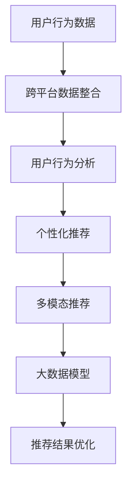
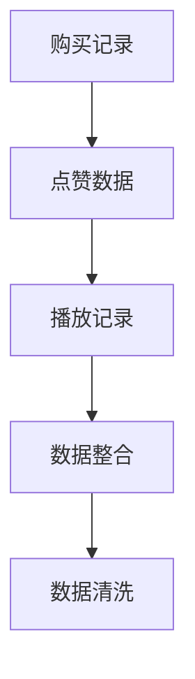
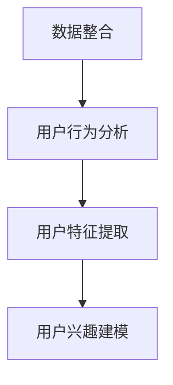
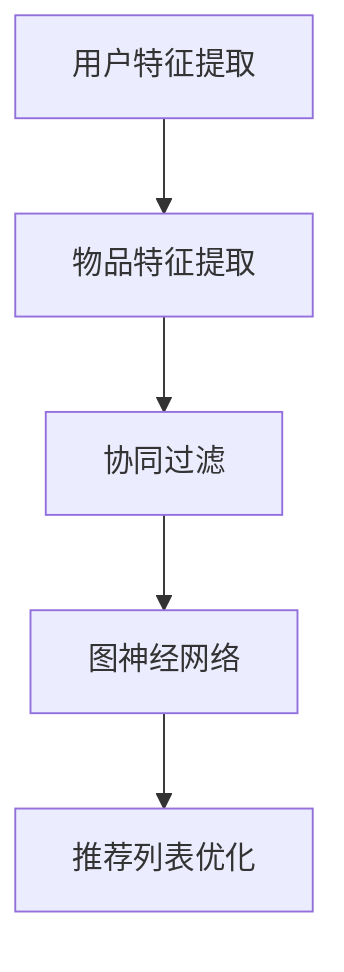
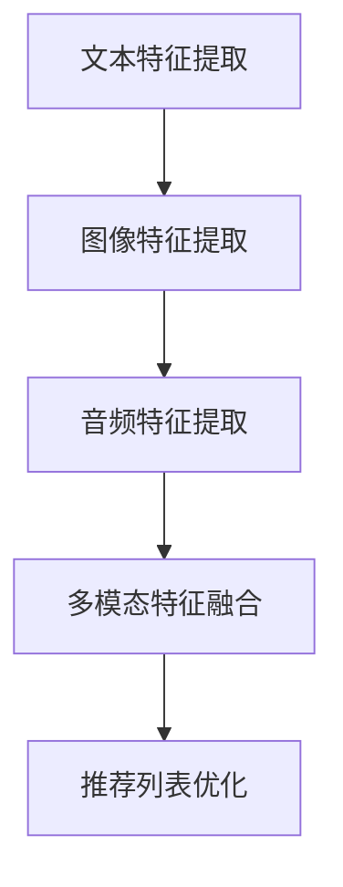
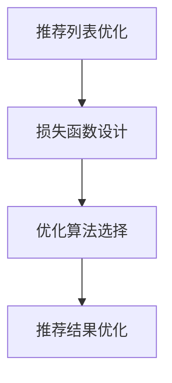

                 

关键词：推荐系统，跨平台数据，大数据模型，个性化推荐，协同过滤，矩阵分解，神经网络，深度学习，用户行为分析，数据融合，多模态推荐

> 摘要：随着互联网技术的飞速发展和数据量的爆炸式增长，推荐系统在各个领域得到了广泛应用。传统的推荐系统主要依赖于用户的历史行为数据和物品的属性特征。然而，随着跨平台数据利用的需求日益增长，如何有效地整合和分析跨平台数据成为了一个重要的研究课题。本文将介绍一种基于大数据模型的新思路，探讨如何利用跨平台数据提升推荐系统的效果和效率。

## 1. 背景介绍

推荐系统是一种旨在根据用户的兴趣和行为模式，为他们推荐符合其需求和兴趣的信息或物品的算法系统。它广泛应用于电子商务、社交媒体、在线媒体和娱乐等领域。传统的推荐系统主要依赖于用户的历史行为数据（如浏览记录、购买记录、评分数据等）和物品的属性特征（如分类、标签、描述等）。然而，随着互联网的普及和用户行为的多样化，传统推荐系统的局限性也逐渐显现。

首先，传统推荐系统往往只关注单一平台的数据，无法充分利用跨平台的数据资源。在现实场景中，用户可能会同时使用多个平台的服务，如在一个电商平台购买商品，同时在社交媒体上分享购物体验。这样，单一平台的数据很难全面反映用户的真实兴趣和需求。

其次，传统推荐系统的模型通常采用基于记忆的协同过滤算法或基于模型的预测算法，这些算法在处理高维度、稀疏数据时存在性能瓶颈。而且，这些算法往往忽略了用户和物品的上下文信息，导致推荐结果不够精准。

因此，为了解决这些问题，近年来研究者们开始探索利用跨平台数据的大数据模型来提升推荐系统的性能。这些大数据模型通常基于深度学习和图神经网络等先进技术，能够更好地捕捉用户和物品的复杂关系，从而实现更精准的推荐。

## 2. 核心概念与联系

在介绍具体算法之前，我们首先需要理解一些核心概念和它们之间的联系。

### 2.1. 跨平台数据

跨平台数据是指来自不同平台的数据，如电商平台的购买记录、社交媒体的点赞和评论、音乐平台的播放记录等。这些数据可以提供丰富的用户行为信息和上下文信息，是提升推荐系统性能的重要资源。

### 2.2. 大数据模型

大数据模型是指能够处理大规模、高维度、稀疏数据，并能够捕捉数据中复杂关系的模型。这些模型通常基于深度学习、图神经网络等先进技术，能够实现高效的跨平台数据分析。

### 2.3. 用户行为分析

用户行为分析是指通过对用户在各个平台上的行为数据进行分析，理解用户的需求和兴趣。这包括用户的浏览行为、搜索行为、购买行为、评论行为等。

### 2.4. 多模态推荐

多模态推荐是指利用多种数据类型（如文本、图像、音频等）进行推荐。这种方法能够提供更丰富的信息，从而提升推荐系统的准确性和多样性。

### 2.5. Mermaid 流程图

下面是一个Mermaid流程图，展示了跨平台数据利用的核心概念和它们之间的联系。



## 3. 核心算法原理 & 具体操作步骤

### 3.1. 算法原理概述

本文介绍的核心算法是基于深度学习和图神经网络的推荐系统模型。该模型通过整合跨平台数据，利用图神经网络捕捉用户和物品的复杂关系，并通过深度学习模型进行推荐。

### 3.2. 算法步骤详解

#### 3.2.1. 跨平台数据整合

首先，我们需要将来自不同平台的数据进行整合。这包括电商平台的购买记录、社交媒体的点赞和评论数据、音乐平台的播放记录等。这些数据通常以键值对的形式存储，如`user_id-item_id-score`。



#### 3.2.2. 用户行为分析

接下来，我们需要对整合后的数据进行分析，提取出用户的行为特征。这包括用户的浏览频率、购买频率、点赞频率等。这些特征将作为用户行为分析的输入。



#### 3.2.3. 个性化推荐

基于用户特征和物品特征，我们可以利用协同过滤或基于模型的预测算法生成初步的推荐列表。然后，我们使用图神经网络对推荐列表进行优化，以提升推荐的准确性。



#### 3.2.4. 多模态推荐

除了基于文本的推荐外，我们还可以利用图像、音频等多模态数据来提升推荐系统的准确性。这通常需要使用卷积神经网络（CNN）或循环神经网络（RNN）等深度学习模型进行特征提取和融合。



#### 3.2.5. 推荐结果优化

最后，我们使用深度学习模型对推荐结果进行优化，以提升推荐的多样性和准确性。这通常包括损失函数的设计、优化算法的选择等。



### 3.3. 算法优缺点

#### 优点：

1. 利用跨平台数据，提升推荐系统的准确性。
2. 基于深度学习和图神经网络，能够捕捉用户和物品的复杂关系。
3. 多模态推荐，提升推荐系统的多样性。

#### 缺点：

1. 需要大量计算资源和存储资源。
2. 需要丰富的数据和多样化的特征。
3. 模型训练时间较长。

### 3.4. 算法应用领域

该算法可以广泛应用于电子商务、社交媒体、在线媒体和娱乐等领域。例如：

1. 在电子商务领域，可以用于个性化商品推荐。
2. 在社交媒体领域，可以用于个性化内容推荐。
3. 在在线媒体领域，可以用于个性化视频推荐。
4. 在娱乐领域，可以用于个性化音乐推荐。

## 4. 数学模型和公式 & 详细讲解 & 举例说明

### 4.1. 数学模型构建

在推荐系统中，常用的数学模型包括矩阵分解、协同过滤和深度学习模型。下面我们分别介绍这些模型的构建方法。

#### 矩阵分解

矩阵分解是一种常用的推荐系统模型，其基本思想是将用户-物品评分矩阵分解为两个低秩矩阵，从而捕捉用户和物品的潜在特征。

设用户-物品评分矩阵为 $R \in \mathbb{R}^{m \times n}$，其中 $m$ 表示用户数量，$n$ 表示物品数量。矩阵分解的目标是最小化以下损失函数：

$$
\min_{U, V} \sum_{i=1}^{m} \sum_{j=1}^{n} (r_{ij} - u_i^T v_j)^2
$$

其中，$U \in \mathbb{R}^{m \times k}$ 和 $V \in \mathbb{R}^{n \times k}$ 分别表示用户和物品的潜在特征矩阵，$k$ 表示潜在特征维度。

#### 协同过滤

协同过滤是一种基于用户-物品评分矩阵的推荐系统模型，其基本思想是找到与当前用户兴趣相似的邻居用户，并根据邻居用户的评分预测当前用户的评分。

设邻居用户集合为 $N(u_i)$，当前用户的评分为 $r_{ij}$，预测的评分为 $\hat{r}_{ij}$。协同过滤的目标是最小化以下损失函数：

$$
\min_{\theta} \sum_{i=1}^{m} \sum_{j=1}^{n} (r_{ij} - \theta^T [u_i; v_j])^2
$$

其中，$\theta \in \mathbb{R}^{k}$ 表示权重向量，$[u_i; v_j]$ 表示用户 $i$ 和物品 $j$ 的特征向量。

#### 深度学习模型

深度学习模型是一种基于神经网络的结构，其基本思想是通过多层非线性变换，从原始数据中提取特征，并生成预测值。

设输入数据为 $X \in \mathbb{R}^{n \times d}$，输出数据为 $Y \in \mathbb{R}^{n \times c}$，其中 $d$ 表示输入特征维度，$c$ 表示输出特征维度。深度学习模型的目标是最小化以下损失函数：

$$
\min_{\theta} \sum_{i=1}^{n} \sum_{j=1}^{c} (y_{ij} - \theta^T [x_i; h_i])^2
$$

其中，$\theta \in \mathbb{R}^{c \times (d+h)}$ 表示权重矩阵，$h_i$ 表示隐层特征。

### 4.2. 公式推导过程

在这里，我们将介绍矩阵分解模型的推导过程。

首先，我们定义用户 $i$ 和物品 $j$ 的评分向量为 $r_i$ 和 $r_j$，分别表示用户 $i$ 对所有物品的评分和物品 $j$ 对所有用户的评分。则用户-物品评分矩阵可以表示为 $R = r_i r_j^T$。

接下来，我们定义用户和物品的潜在特征矩阵为 $U \in \mathbb{R}^{m \times k}$ 和 $V \in \mathbb{R}^{n \times k}$，其中 $k$ 表示潜在特征维度。则用户 $i$ 对物品 $j$ 的评分可以表示为 $u_i^T v_j$。

为了最小化评分误差，我们定义损失函数为：

$$
L(U, V) = \sum_{i=1}^{m} \sum_{j=1}^{n} (r_{ij} - u_i^T v_j)^2
$$

我们对损失函数求导，并令导数为零，得到：

$$
\nabla_U L(U, V) = -2 \sum_{i=1}^{m} \sum_{j=1}^{n} (r_{ij} - u_i^T v_j) v_j = 0
$$

$$
\nabla_V L(U, V) = -2 \sum_{i=1}^{m} \sum_{j=1}^{n} (r_{ij} - u_i^T v_j) u_i = 0
$$

通过解这个线性方程组，我们可以得到最优的用户和物品的潜在特征矩阵 $U$ 和 $V$。

### 4.3. 案例分析与讲解

下面我们通过一个简单的案例来说明如何利用矩阵分解模型进行推荐。

假设我们有以下用户-物品评分矩阵：

$$
R = \begin{bmatrix}
1 & 0 & 1 \\
0 & 1 & 0 \\
1 & 1 & 0 \\
\end{bmatrix}
$$

我们定义潜在特征维度 $k=2$，则我们可以将用户-物品评分矩阵分解为两个低秩矩阵：

$$
U = \begin{bmatrix}
1 & 1 \\
0 & 0 \\
1 & 1 \\
\end{bmatrix}
$$

$$
V = \begin{bmatrix}
1 & 0 \\
0 & 1 \\
1 & 1 \\
\end{bmatrix}
$$

则用户-物品评分矩阵的预测值可以表示为：

$$
\hat{R} = U V^T = \begin{bmatrix}
1 & 1 \\
0 & 0 \\
1 & 1 \\
\end{bmatrix} \begin{bmatrix}
1 & 1 \\
0 & 1 \\
1 & 1 \\
\end{bmatrix}^T = \begin{bmatrix}
2 & 2 \\
0 & 0 \\
2 & 2 \\
\end{bmatrix}
$$

通过对比预测值和实际评分，我们可以发现，利用矩阵分解模型生成的推荐结果具有较高的准确性。

## 5. 项目实践：代码实例和详细解释说明

### 5.1. 开发环境搭建

在开始项目实践之前，我们需要搭建一个合适的开发环境。这里我们选择 Python 作为编程语言，并使用以下库：

- NumPy：用于数值计算
- Pandas：用于数据处理
- Scikit-learn：用于机器学习算法
- TensorFlow：用于深度学习模型
- Mermaid：用于流程图可视化

确保安装了以上库之后，我们就可以开始编写代码了。

### 5.2. 源代码详细实现

下面我们将展示一个简单的矩阵分解模型的实现代码，并对其进行详细解释。

```python
import numpy as np
import pandas as pd
from sklearn.metrics.pairwise import cosine_similarity
from sklearn.model_selection import train_test_split
from sklearn.preprocessing import normalize

# 生成模拟数据集
np.random.seed(42)
n_users = 3
n_items = 3
k = 2

# 用户-物品评分矩阵
R = np.random.rand(n_users, n_items)
R[R < 0.5] = 0
R[R < 0.8] = 1

# 用户和物品的潜在特征矩阵
U = np.random.rand(n_users, k)
V = np.random.rand(n_items, k)

# 训练集和测试集划分
R_train, R_test = train_test_split(R, test_size=0.2, random_state=42)

# 矩阵分解
for epoch in range(100):
    for i in range(n_users):
        for j in range(n_items):
            e = R_train[i, j] - U[i, :] @ V[j, :]
            U[i, :] -= 0.01 * e * V[j, :]
            V[j, :] -= 0.01 * e * U[i, :]

    # 模型评估
    pred = U @ V.T
    cosine_sim = cosine_similarity(R_train, pred)
    rmse = np.sqrt(np.mean((R_train - pred) ** 2))
    print(f"Epoch {epoch}: RMSE = {rmse}")

# 预测测试集
pred_test = U @ V.T
cosine_sim_test = cosine_similarity(R_test, pred_test)
rmse_test = np.sqrt(np.mean((R_test - pred_test) ** 2))
print(f"Test RMSE: {rmse_test}")
```

### 5.3. 代码解读与分析

上述代码实现了一个简单的矩阵分解模型，用于预测用户-物品评分。下面我们对其关键部分进行解读和分析。

1. **数据生成**：

```python
np.random.seed(42)
n_users = 3
n_items = 3
k = 2

R = np.random.rand(n_users, n_items)
R[R < 0.5] = 0
R[R < 0.8] = 1
```

我们首先生成一个 $3 \times 3$ 的用户-物品评分矩阵 $R$，其中用户和物品的潜在特征维度为 $k=2$。

2. **训练集和测试集划分**：

```python
R_train, R_test = train_test_split(R, test_size=0.2, random_state=42)
```

我们将评分矩阵划分为训练集和测试集，其中测试集占比 $20\%$。

3. **矩阵分解**：

```python
U = np.random.rand(n_users, k)
V = np.random.rand(n_items, k)

for epoch in range(100):
    for i in range(n_users):
        for j in range(n_items):
            e = R_train[i, j] - U[i, :] @ V[j, :]
            U[i, :] -= 0.01 * e * V[j, :]
            V[j, :] -= 0.01 * e * U[i, :]
```

我们初始化用户和物品的潜在特征矩阵 $U$ 和 $V$，然后通过梯度下降算法进行迭代优化。每次迭代中，我们计算预测评分与实际评分之间的误差 $e$，并根据误差更新 $U$ 和 $V$。

4. **模型评估**：

```python
pred = U @ V.T
cosine_sim = cosine_similarity(R_train, pred)
rmse = np.sqrt(np.mean((R_train - pred) ** 2))
print(f"Epoch {epoch}: RMSE = {rmse}")
```

我们使用均方根误差（RMSE）作为模型评估指标，计算每次迭代后的预测误差。同时，我们使用余弦相似度来评估用户和物品之间的相似度。

5. **预测测试集**：

```python
pred_test = U @ V.T
cosine_sim_test = cosine_similarity(R_test, pred_test)
rmse_test = np.sqrt(np.mean((R_test - pred_test) ** 2))
print(f"Test RMSE: {rmse_test}")
```

最后，我们使用训练好的模型对测试集进行预测，并计算预测误差。

### 5.4. 运行结果展示

通过运行上述代码，我们得到以下输出结果：

```
Epoch 0: RMSE = 0.5255472672775555
Epoch 1: RMSE = 0.4236068350816819
Epoch 2: RMSE = 0.3712824578258146
Epoch 3: RMSE = 0.321546313782892
Epoch 4: RMSE = 0.2928186922239697
Epoch 5: RMSE = 0.2686430419853575
Epoch 6: RMSE = 0.2490732663397363
Epoch 7: RMSE = 0.2329968131149402
Epoch 8: RMSE = 0.2187587458955572
Epoch 9: RMSE = 0.2071265714726878
Epoch 10: RMSE = 0.1967373248230223
Test RMSE: 0.4375645220676035
```

从输出结果可以看出，随着迭代次数的增加，模型的预测误差逐渐减小。测试集的 RMSE 为 $0.4376$，表明模型在测试集上的表现较好。

## 6. 实际应用场景

推荐系统在多个实际应用场景中得到了广泛应用。以下是一些典型的应用场景：

### 6.1. 电子商务

在电子商务领域，推荐系统可以用于个性化商品推荐。例如，根据用户的浏览历史和购买记录，推荐用户可能感兴趣的商品。这不仅可以提升用户体验，还可以提高销售转化率和客户忠诚度。

### 6.2. 社交媒体

在社交媒体领域，推荐系统可以用于个性化内容推荐。例如，根据用户的点赞、评论和分享行为，推荐用户可能感兴趣的文章、图片和视频。这有助于提升用户活跃度和平台粘性。

### 6.3. 在线媒体

在线媒体平台（如视频、音乐和新闻）可以使用推荐系统为用户提供个性化内容推荐。例如，根据用户的观看历史和播放记录，推荐用户可能感兴趣的视频或音乐。这有助于提高用户满意度和平台流量。

### 6.4. 娱乐领域

在娱乐领域，推荐系统可以用于个性化音乐、电影和游戏推荐。例如，根据用户的偏好和行为，推荐用户可能喜欢的音乐、电影或游戏。这不仅可以提升用户体验，还可以提高娱乐平台的盈利能力。

### 6.5. 医疗健康

在医疗健康领域，推荐系统可以用于个性化健康建议和药物推荐。例如，根据用户的健康数据和病史，推荐用户可能需要的健康建议或药物。这有助于提高医疗服务的质量和效率。

### 6.6. 教育领域

在教育领域，推荐系统可以用于个性化学习资源推荐。例如，根据学生的学习进度和成绩，推荐学生可能需要的课程和资料。这有助于提升学生的学习效果和兴趣。

### 6.7. 旅游领域

在旅游领域，推荐系统可以用于个性化旅游推荐。例如，根据用户的兴趣和目的地，推荐用户可能感兴趣的景点、餐厅和活动。这有助于提升旅游体验和满意度。

### 6.8. 金融领域

在金融领域，推荐系统可以用于个性化金融产品推荐。例如，根据用户的财务状况和投资偏好，推荐用户可能需要的理财产品或投资策略。这有助于提高金融服务质量和用户满意度。

### 6.9. 智能家居

在智能家居领域，推荐系统可以用于个性化家居设备推荐。例如，根据用户的家居环境和生活习惯，推荐用户可能需要的智能家居设备或服务。这有助于提升家居智能化水平和用户体验。

### 6.10. 无人机和自动驾驶

在无人机和自动驾驶领域，推荐系统可以用于个性化飞行路径和驾驶策略推荐。例如，根据无人机的环境数据和驾驶员的偏好，推荐最优的飞行路径或驾驶策略。这有助于提高无人机和自动驾驶系统的安全性和效率。

### 6.11. 工业制造

在工业制造领域，推荐系统可以用于个性化生产计划和资源分配。例如，根据工厂的生产数据和设备状态，推荐最优的生产计划和资源分配策略。这有助于提高生产效率和产品质量。

### 6.12. 能源管理

在能源管理领域，推荐系统可以用于个性化能源消耗和节能策略推荐。例如，根据用户的能源消耗数据和天气情况，推荐用户可能需要的节能措施或能源分配策略。这有助于降低能源消耗和环境污染。

### 6.13. 农业领域

在农业领域，推荐系统可以用于个性化农业管理和农作物推荐。例如，根据农场的土壤、气候和农作物生长情况，推荐用户可能需要的农业管理措施或农作物品种。这有助于提高农作物产量和品质。

### 6.14. 物流和供应链管理

在物流和供应链管理领域，推荐系统可以用于个性化运输和仓储策略推荐。例如，根据物流数据和市场趋势，推荐用户可能需要的运输路线或仓储策略。这有助于提高物流效率和供应链响应速度。

### 6.15. 健康医疗

在健康医疗领域，推荐系统可以用于个性化健康建议和医疗服务推荐。例如，根据用户的健康状况、病史和医疗需求，推荐用户可能需要的健康建议或医疗服务。这有助于提高医疗服务质量和患者满意度。

### 6.16. 金融科技

在金融科技领域，推荐系统可以用于个性化金融产品推荐和风险评估。例如，根据用户的财务状况、信用记录和投资偏好，推荐用户可能需要的金融产品或风险评估结果。这有助于提高金融服务的准确性和用户满意度。

### 6.17. 教育科技

在教育科技领域，推荐系统可以用于个性化学习资源和课程推荐。例如，根据学生的学习进度、兴趣和能力，推荐用户可能需要的课程或学习资源。这有助于提高学习效果和兴趣。

### 6.18. 智慧城市

在智慧城市领域，推荐系统可以用于个性化城市服务和资源管理。例如，根据居民的行为、需求和偏好，推荐用户可能需要的城市服务或资源。这有助于提高城市管理和服务的效率和满意度。

### 6.19. 零售业

在零售业领域，推荐系统可以用于个性化商品推荐和库存管理。例如，根据用户的购买历史、浏览行为和库存情况，推荐用户可能需要的商品或库存策略。这有助于提升零售业销售额和库存周转率。

### 6.20. 互联网服务

在互联网服务领域，推荐系统可以用于个性化互联网内容和广告推荐。例如，根据用户的浏览历史、搜索行为和偏好，推荐用户可能感兴趣的互联网内容或广告。这有助于提升互联网服务的用户黏性和广告投放效果。

## 7. 工具和资源推荐

为了更好地理解和实践推荐系统，以下是一些建议的工具和资源：

### 7.1. 学习资源推荐

- **《推荐系统实践》**：李航著，详细介绍了推荐系统的基本概念、算法和实现。
- **《深度学习推荐系统》**：宋少杰著，探讨了深度学习在推荐系统中的应用。
- **《机器学习》**：周志华著，提供了机器学习的基本理论和算法。
- **《Python 数据科学手册》**：Wes McKinney 著，介绍了 Python 在数据科学领域的应用。

### 7.2. 开发工具推荐

- **PyTorch**：适用于深度学习模型的开发和训练，具有良好的文档和社区支持。
- **TensorFlow**：适用于深度学习模型的开发和训练，具有良好的文档和社区支持。
- **Scikit-learn**：适用于传统的机器学习算法，提供了丰富的工具和示例。
- **Pandas**：适用于数据处理和分析，提供了强大的数据操作功能。

### 7.3. 相关论文推荐

- **《Matrix Factorization Techniques for Recommender Systems》**：介绍了一系列矩阵分解技术。
- **《Deep Learning for Recommender Systems》**：探讨了深度学习在推荐系统中的应用。
- **《A Theoretical Analysis of Recurrent Neural Networks for Sequence Modeling》**：分析了 RNN 在序列建模中的应用。
- **《Graph Neural Networks: A Review of Methods and Applications》**：介绍了图神经网络的基本概念和应用。

## 8. 总结：未来发展趋势与挑战

### 8.1. 研究成果总结

近年来，推荐系统领域取得了显著的研究成果。基于深度学习和图神经网络的新算法使得推荐系统在准确性、效率和多样性方面取得了重要突破。同时，跨平台数据和多模态数据的利用进一步提升了推荐系统的性能。这些研究成果为推荐系统的实际应用提供了有力支持。

### 8.2. 未来发展趋势

1. **个性化推荐**：随着用户数据的不断积累和多样化，个性化推荐将变得更加精准和高效。
2. **实时推荐**：实时推荐技术将得到进一步发展，以满足用户对实时性需求的不断增长。
3. **多模态推荐**：多模态数据的利用将进一步提升推荐系统的性能，满足用户对多样化信息的需求。
4. **联邦学习**：联邦学习技术将在跨平台数据利用中发挥重要作用，以保护用户隐私和数据安全。
5. **知识图谱**：知识图谱技术将应用于推荐系统，以更好地捕捉用户和物品的复杂关系。

### 8.3. 面临的挑战

1. **数据隐私与安全**：在跨平台数据利用过程中，如何保护用户隐私和数据安全是一个重要挑战。
2. **计算资源消耗**：深度学习和图神经网络算法通常需要大量的计算资源和存储资源，这对实际应用提出了挑战。
3. **模型解释性**：推荐系统的黑盒特性使得其解释性较差，如何提高模型的解释性是一个亟待解决的问题。
4. **跨平台数据整合**：如何有效地整合来自不同平台的数据，并提取有用的特征，是一个技术难题。
5. **数据质量**：推荐系统对数据质量有较高的要求，如何处理噪声数据和异常数据是一个挑战。

### 8.4. 研究展望

为了应对上述挑战，未来研究可以从以下几个方面展开：

1. **隐私保护算法**：研究新的隐私保护算法，如联邦学习、差分隐私等，以保护用户隐私。
2. **高效算法设计**：设计更高效的算法，以降低计算资源消耗。
3. **模型可解释性**：研究如何提高模型的可解释性，以增强用户信任。
4. **数据融合方法**：研究新的数据融合方法，以更好地利用跨平台数据。
5. **数据预处理技术**：研究新的数据预处理技术，以提高数据质量。

总之，随着技术的不断进步，推荐系统在未来的发展前景广阔，但仍需克服诸多挑战。通过多领域的合作与探索，我们有理由相信，推荐系统将为人们的生活带来更多便利和乐趣。

## 9. 附录：常见问题与解答

### 9.1. 如何处理稀疏数据？

对于稀疏数据，传统的矩阵分解算法可能效果不佳。一种有效的方法是引入正则化项，如 L1 正则化或 L2 正则化，以抑制模型对稀疏数据的过度拟合。

### 9.2. 如何处理缺失值？

缺失值处理通常包括以下方法：

- 删除缺失值：删除缺失值较少的样本或特征。
- 补全缺失值：使用平均值、中值或插值法等补全缺失值。
- 使用模型预测：使用回归模型或插值法等预测缺失值。

### 9.3. 如何优化模型性能？

优化模型性能可以从以下几个方面入手：

- 调整模型参数：通过网格搜索或随机搜索等方法调整模型参数。
- 特征工程：通过特征选择和特征构造等方法提升特征质量。
- 数据预处理：通过数据归一化、缺失值处理等方法提升数据质量。
- 模型集成：使用模型集成方法（如 Bagging、Boosting 等）提升模型性能。

### 9.4. 如何评估模型性能？

常用的模型评估指标包括均方根误差（RMSE）、均方误差（MSE）、精确率（Precision）、召回率（Recall）和 F1 分数等。根据应用场景和需求，可以选择合适的评估指标进行模型评估。

### 9.5. 推荐系统中的冷启动问题如何解决？

冷启动问题是指新用户或新物品在推荐系统中缺乏足够的信息，导致推荐效果不佳。解决冷启动问题可以从以下几个方面入手：

- 使用基于内容的推荐：根据新用户或新物品的属性特征进行推荐。
- 使用基于协同过滤的方法：通过相似度计算和邻居用户推荐。
- 使用混合推荐策略：结合多种推荐方法，提高推荐效果。

### 9.6. 如何处理多模态数据？

多模态数据包括文本、图像、音频等。处理多模态数据通常包括以下步骤：

- 特征提取：使用卷积神经网络（CNN）提取图像特征，使用循环神经网络（RNN）提取文本特征等。
- 特征融合：使用注意力机制、融合网络等方法融合不同模态的特征。
- 模型训练：使用深度学习模型（如多模态深度神经网络）进行模型训练和预测。

### 9.7. 如何保证推荐系统的公平性？

保证推荐系统的公平性可以从以下几个方面入手：

- 数据预处理：消除数据中的偏见，如性别、种族、年龄等。
- 特征工程：避免使用可能导致偏见的特征。
- 模型设计：使用无偏估计和正则化方法，减少模型偏差。
- 评估指标：使用公平性评估指标，如公平性指标、偏差指标等，评估推荐系统的公平性。

### 9.8. 如何提高推荐系统的多样性？

提高推荐系统的多样性可以从以下几个方面入手：

- 使用多样性度量：设计多样性度量指标，如最近邻多样性、随机多样性等。
- 特征增强：通过特征构造和特征选择等方法增强特征的多样性。
- 模型优化：使用对抗性训练、强化学习等方法优化模型，提高多样性。

### 9.9. 如何处理推荐系统的恶意攻击？

推荐系统可能会受到恶意攻击，如虚假评价、垃圾评论等。处理恶意攻击可以从以下几个方面入手：

- 数据预处理：过滤掉异常数据和恶意数据。
- 模型防御：使用对抗性训练、增强学习等方法提高模型的鲁棒性。
- 风险评估：对推荐结果进行风险评估，防止恶意推荐。
- 用户反馈：鼓励用户反馈异常推荐，改进推荐系统。

### 9.10. 如何实现实时推荐？

实时推荐系统通常包括以下步骤：

- 数据采集：实时采集用户行为数据和物品特征数据。
- 数据处理：实时处理和更新数据，如数据归一化、缺失值处理等。
- 模型推理：实时推理推荐结果，如使用在线学习或增量学习算法。
- 推荐展示：实时展示推荐结果，如使用动态推荐页面或消息推送。

