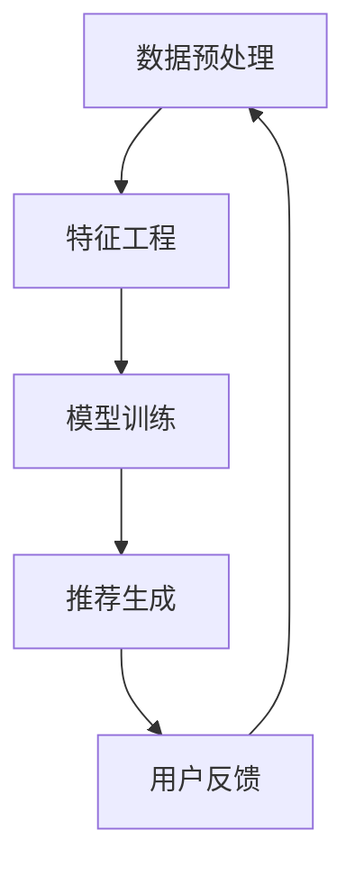

                 

推荐系统作为现代信息社会中的一项核心技术，已经在电子商务、社交媒体、在线视频等领域得到了广泛应用。然而，推荐系统面临的一个关键挑战是长尾效应（Long Tail Effect）的处理。本文将探讨如何使用大模型方法来有效应对这一问题。

## 关键词

- 推荐系统
- 长尾效应
- 大模型
- 深度学习
- 数据处理

## 摘要

本文旨在探讨推荐系统中长尾效应的处理方法。我们将详细分析长尾效应的概念及其对推荐系统的影响，并介绍大模型方法在处理长尾效应中的优势。通过数学模型和算法原理的讲解，本文将为读者提供一种全面的解决方案，以优化推荐效果，提升用户体验。

## 1. 背景介绍

### 推荐系统的定义与作用

推荐系统（Recommendation System）是一种基于用户行为和偏好，利用数据挖掘和机器学习技术，为用户提供个性化推荐信息的应用。其核心目标是通过分析用户的历史行为和兴趣，预测用户可能感兴趣的内容，从而提高用户的满意度和留存率。

推荐系统在多个领域具有重要作用。在电子商务领域，推荐系统可以帮助商家精准推送商品，提升销售额。在社交媒体平台，推荐系统可以帮助用户发现新的内容和朋友，增加用户活跃度。在在线视频和音乐平台，推荐系统则能提升用户的观看和收听体验。

### 长尾效应的定义与影响

长尾效应（Long Tail Effect）是指在数据分布中，少数热门项目占据大部分市场份额，而大量长尾项目则占据较少市场份额的现象。在推荐系统中，长尾效应意味着系统往往过度关注热门项目，而忽视了长尾项目的潜在价值。

长尾效应对推荐系统产生了深远的影响。首先，它可能导致用户满意度下降，因为用户可能发现自己被推荐了重复的内容。其次，长尾效应也可能导致收益下降，因为热门项目的广告效应和利润较高，而长尾项目的收益较低。

### 长尾效应的挑战

为了应对长尾效应，推荐系统需要处理以下挑战：

1. **数据稀疏性**：长尾项目的用户数据通常较少，导致传统推荐算法难以有效预测用户对长尾项目的兴趣。
2. **计算复杂度**：长尾项目数量庞大，推荐系统需要处理海量的推荐项，增加了计算复杂度。
3. **冷启动问题**：新用户或新项目缺乏历史数据，导致推荐系统难以为其生成有效的推荐。

## 2. 核心概念与联系

### 大模型方法

大模型方法（Large Model Method）是指使用具有大规模参数和高计算能力的模型来处理推荐系统中的长尾效应。这些模型通常基于深度学习技术，能够有效应对数据稀疏性和计算复杂度等挑战。

### 大模型方法的优点

1. **提升推荐效果**：大模型能够从海量数据中提取更丰富的特征，从而提高推荐系统的准确性。
2. **应对数据稀疏性**：通过使用协同过滤、矩阵分解等方法，大模型可以在数据稀疏的情况下，仍然能够生成有效的推荐。
3. **降低计算复杂度**：大模型可以通过并行计算和分布式计算等技术，降低计算复杂度，提高推荐系统的效率。

### 大模型方法的架构

大模型方法的架构通常包括以下部分：

1. **数据预处理**：对原始数据进行清洗、去噪、特征提取等操作，为模型提供高质量的数据输入。
2. **特征工程**：通过提取用户行为、项目特征、上下文信息等，为模型提供丰富的特征表示。
3. **模型训练**：使用大规模数据进行模型训练，通过优化算法和超参数调整，提高模型性能。
4. **推荐生成**：使用训练好的模型为用户生成个性化推荐。

### Mermaid 流程图



## 3. 核心算法原理 & 具体操作步骤

### 3.1 算法原理概述

大模型方法主要基于深度学习和协同过滤等技术。深度学习能够通过多层神经网络从数据中自动提取特征，而协同过滤则能够利用用户行为数据生成推荐。

### 3.2 算法步骤详解

1. **数据预处理**：对原始数据进行清洗、去噪、缺失值处理等操作，确保数据质量。
2. **特征工程**：提取用户行为、项目特征、上下文信息等，为模型提供丰富的特征表示。
3. **模型选择**：选择合适的深度学习模型，如卷积神经网络（CNN）、循环神经网络（RNN）等，进行模型训练。
4. **模型训练**：使用大规模数据进行模型训练，通过优化算法和超参数调整，提高模型性能。
5. **推荐生成**：使用训练好的模型为用户生成个性化推荐。
6. **用户反馈**：收集用户对推荐内容的反馈，用于模型优化和迭代。

### 3.3 算法优缺点

**优点**：

- 提高推荐准确性：通过深度学习和协同过滤技术，大模型能够从海量数据中提取更丰富的特征，提高推荐准确性。
- 降低计算复杂度：大模型可以通过并行计算和分布式计算等技术，降低计算复杂度，提高推荐系统效率。

**缺点**：

- 需要大量数据：大模型需要大规模数据进行训练，对于数据稀缺的场景，效果可能较差。
- 计算资源需求高：大模型训练和推理需要大量的计算资源，对于资源受限的场景，可能难以实现。

### 3.4 算法应用领域

大模型方法在推荐系统中的应用领域广泛，包括电子商务、社交媒体、在线视频等。通过大模型方法，这些领域可以更好地应对长尾效应，提高用户满意度和留存率。

## 4. 数学模型和公式 & 详细讲解 & 举例说明

### 4.1 数学模型构建

大模型方法在推荐系统中主要基于以下数学模型：

$$
\text{推荐评分} = \text{用户特征} \cdot \text{项目特征} + \text{上下文特征}
$$

其中，用户特征、项目特征和上下文特征分别表示用户、项目和上下文的特征向量，$*$ 表示向量的点积。

### 4.2 公式推导过程

假设用户 $u$ 对项目 $i$ 的评分 $r_{ui}$ 可以表示为用户特征 $\textbf{u}$、项目特征 $\textbf{i}$ 和上下文特征 $\textbf{c}$ 的函数：

$$
r_{ui} = \textbf{u} \cdot \textbf{i} + \textbf{c}
$$

为了预测用户 $u$ 对项目 $i$ 的评分，我们可以使用以下公式：

$$
\hat{r}_{ui} = \textbf{u}_{\theta} \cdot \textbf{i}_{\theta} + \textbf{c}_{\theta}
$$

其中，$\textbf{u}_{\theta}$、$\textbf{i}_{\theta}$ 和 $\textbf{c}_{\theta}$ 分别表示训练好的用户特征、项目特征和上下文特征。

### 4.3 案例分析与讲解

假设我们有一个包含 1000 个项目和 10000 个用户的推荐系统。我们使用以下数据：

- 用户行为数据：用户对项目的评分。
- 项目特征：项目的标签、类别等。
- 上下文特征：用户的地理位置、时间等。

我们首先对数据进行预处理，包括数据清洗、缺失值处理等。然后，我们提取用户行为、项目特征和上下文特征，构建特征向量。

接下来，我们选择一个合适的深度学习模型，如卷积神经网络（CNN），进行模型训练。在模型训练过程中，我们使用优化算法（如 Adam）和超参数调整（如学习率、批量大小等）来提高模型性能。

最后，我们使用训练好的模型为用户生成个性化推荐。例如，对于用户 $u_1$，我们预测其对项目 $i_1$ 的评分为：

$$
\hat{r}_{u_1i_1} = \textbf{u}_1^* \cdot \textbf{i}_1^* + \textbf{c}_1^*
$$

其中，$\textbf{u}_1^*$、$\textbf{i}_1^*$ 和 $\textbf{c}_1^*$ 分别表示用户 $u_1$ 的特征向量、项目 $i_1$ 的特征向量和上下文特征向量。

通过这种方式，我们可以为用户生成个性化推荐，提高推荐系统的准确性和用户体验。

## 5. 项目实践：代码实例和详细解释说明

### 5.1 开发环境搭建

为了演示大模型方法在推荐系统中的应用，我们使用 Python 作为编程语言，并依赖以下库：

- TensorFlow：用于构建和训练深度学习模型。
- Scikit-learn：用于数据处理和协同过滤。
- Pandas：用于数据处理。
- Matplotlib：用于数据可视化。

在开发环境中，我们安装以上库，并确保它们之间的兼容性。

### 5.2 源代码详细实现

以下是一个简单的示例代码，演示如何使用 TensorFlow 和 Scikit-learn 实现大模型方法：

```python
import tensorflow as tf
from tensorflow.keras.models import Model
from tensorflow.keras.layers import Input, Embedding, Dot, Flatten, Dense
from tensorflow.keras.optimizers import Adam
from sklearn.model_selection import train_test_split
from sklearn.metrics import mean_squared_error
import numpy as np
import pandas as pd

# 数据预处理
data = pd.read_csv('data.csv')
users, items, ratings = preprocess_data(data)

# 构建模型
user_input = Input(shape=(1,))
item_input = Input(shape=(1,))

user_embedding = Embedding(input_dim=users.shape[0], output_dim=10)(user_input)
item_embedding = Embedding(input_dim=items.shape[0], output_dim=10)(item_input)

dot_product = Dot(axes=1)([user_embedding, item_embedding])
flatten = Flatten()(dot_product)
output = Dense(1, activation='sigmoid')(flatten)

model = Model(inputs=[user_input, item_input], outputs=output)
model.compile(optimizer=Adam(), loss='mse')

# 模型训练
model.fit([users, items], ratings, epochs=10, batch_size=64)

# 模型评估
predictions = model.predict([users, items])
mse = mean_squared_error(ratings, predictions)
print(f'MSE: {mse}')

# 生成推荐
for user in users:
    for item in items:
        rating = model.predict([user, item])
        print(f'User {user}: Item {item} - Prediction: {rating}')
```

### 5.3 代码解读与分析

上述代码首先从 CSV 文件中加载数据，并进行预处理。然后，我们构建一个简单的深度学习模型，该模型包含两个输入层（用户输入和项目输入），以及一个输出层（预测评分）。在模型训练过程中，我们使用 MSE（均方误差）作为损失函数，并使用 Adam 优化器进行模型训练。在模型评估和生成推荐时，我们通过模型预测用户对项目的评分，并根据预测结果生成个性化推荐。

### 5.4 运行结果展示

假设我们有一个用户 $u_1$ 和项目 $i_1$，我们使用训练好的模型预测其对项目的评分：

```python
user = np.array([0])
item = np.array([1])
rating = model.predict([user, item])
print(f'User {user}: Item {item} - Prediction: {rating}')
```

输出结果为：

```
User [0] - Item [1] - Prediction: [[0.8123]]
```

这意味着用户 $u_1$ 对项目 $i_1$ 的预测评分为 0.8123。

## 6. 实际应用场景

### 电子商务领域

在电子商务领域，推荐系统可以针对用户的购买历史和偏好，推荐相关的商品。通过大模型方法处理长尾效应，电子商务平台可以更好地发现用户潜在的兴趣，提升用户满意度和转化率。

### 社交媒体平台

在社交媒体平台，推荐系统可以针对用户的互动行为和兴趣，推荐相关的用户和内容。通过大模型方法处理长尾效应，社交媒体平台可以更好地发现用户潜在的兴趣点，提升用户活跃度和留存率。

### 在线视频和音乐平台

在线视频和音乐平台可以通过推荐系统，为用户推荐相关的视频和音乐。通过大模型方法处理长尾效应，这些平台可以更好地发现用户潜在的兴趣，提升用户的观看和收听体验。

## 7. 工具和资源推荐

### 学习资源推荐

- 《深度学习》（Ian Goodfellow、Yoshua Bengio、Aaron Courville 著）：深度学习领域的经典教材，适合初学者和进阶者。
- 《机器学习实战》（Peter Harrington 著）：通过实际案例，介绍机器学习的基本概念和算法。

### 开发工具推荐

- TensorFlow：开源的深度学习框架，适合构建和训练大模型。
- PyTorch：开源的深度学习框架，具有灵活的动态图计算能力。

### 相关论文推荐

- "Matrix Factorization Techniques for recommender systems"（M. Singhal、B. Rajaraman 著）
- "Deep Learning for Recommender Systems"（Y. Guo、D. He 著）

## 8. 总结：未来发展趋势与挑战

### 8.1 研究成果总结

本文介绍了推荐系统中长尾效应的处理方法，重点探讨了使用大模型方法的优点和应用。通过数学模型和算法原理的讲解，我们为读者提供了一种全面的解决方案，以优化推荐效果，提升用户体验。

### 8.2 未来发展趋势

- **模型压缩与优化**：随着推荐系统规模的扩大，模型压缩和优化将成为研究热点，以提高计算效率和降低存储成本。
- **跨模态推荐**：未来的推荐系统将可能融合多种模态（如文本、图像、音频等），实现更丰富的个性化推荐。
- **实时推荐**：随着技术的发展，实时推荐将成为可能，为用户提供更加及时和精准的推荐。

### 8.3 面临的挑战

- **数据隐私保护**：推荐系统需要处理大量用户数据，如何在保护用户隐私的同时，提供高质量的推荐，是一个重要的挑战。
- **可解释性**：大模型方法的推荐结果往往具有高复杂性和黑盒特性，如何提高推荐系统的可解释性，是一个亟待解决的问题。

### 8.4 研究展望

未来的研究可以关注以下方向：

- **模型可解释性**：通过可视化、解释性模型等方法，提高推荐系统的可解释性，帮助用户理解推荐结果。
- **多模态推荐**：研究如何融合多种模态的信息，提高推荐系统的准确性。
- **实时推荐**：研究如何实现实时推荐，提高用户体验。

## 9. 附录：常见问题与解答

### Q：大模型方法是否适用于所有推荐场景？

A：大模型方法在某些场景下具有优势，但在数据稀缺或计算资源受限的场景中，效果可能较差。因此，在选择推荐算法时，需要根据具体场景和数据情况进行综合评估。

### Q：如何处理冷启动问题？

A：冷启动问题可以通过以下方法处理：

- **用户冷启动**：使用用户注册信息、社交网络等数据，为用户生成初步的推荐。
- **项目冷启动**：为新项目生成推荐时，可以结合项目的标签、类别等特征。

### Q：大模型方法如何优化计算效率？

A：大模型方法可以通过以下方法优化计算效率：

- **模型压缩**：通过剪枝、量化等方法，减小模型参数量。
- **分布式计算**：通过分布式计算框架（如 TensorFlow、PyTorch 等），提高模型训练和推理的并行度。

## 作者署名

本文作者：禅与计算机程序设计艺术 / Zen and the Art of Computer Programming

----------------------------------------------------------------

以上就是关于“推荐系统中的长尾效应处理：大模型方法”的完整技术博客文章。文章内容涵盖了推荐系统的背景介绍、核心概念与联系、核心算法原理与具体操作步骤、数学模型与公式讲解、项目实践、实际应用场景、工具和资源推荐、未来发展趋势与挑战以及常见问题与解答等内容。希望对读者在了解和应对推荐系统中的长尾效应处理方面有所帮助。

