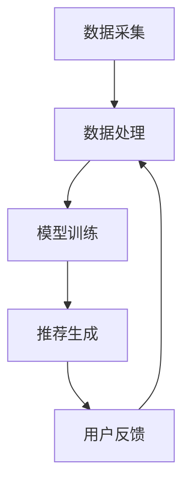

                 

关键词：推荐系统，发展现状，架构，问题，挑战

> 摘要：本文将探讨推荐系统的发展现状，包括其架构、面临的问题和挑战。通过深入分析推荐系统的核心算法原理、数学模型、实际应用场景以及未来发展趋势，我们旨在为读者提供一个全面的技术视角，以更好地理解和应对推荐系统在实际应用中的复杂性和挑战。

## 1. 背景介绍

### 1.1 推荐系统的定义

推荐系统是一种利用数据挖掘、机器学习和信息检索技术，根据用户的行为和历史数据，为用户推荐可能感兴趣的内容或产品的系统。这些系统广泛应用于电子商务、社交媒体、新闻推送、音乐和视频平台等领域。

### 1.2 推荐系统的历史与发展

推荐系统的发展经历了多个阶段，从早期的基于内容的推荐到协同过滤、基于模型的推荐，再到如今基于深度学习和强化学习的推荐。每个阶段都带来了推荐系统性能的显著提升。

## 2. 核心概念与联系

### 2.1 推荐系统的核心概念

- **用户兴趣建模**：收集和分析用户的行为数据，构建用户兴趣模型。
- **物品特征建模**：提取物品的特征信息，用于推荐算法的计算。
- **推荐算法**：根据用户兴趣模型和物品特征，生成个性化的推荐结果。

### 2.2 推荐系统的架构

推荐系统的架构通常包括数据采集、数据处理、模型训练、推荐生成和用户反馈等环节。

## 3. 核心算法原理 & 具体操作步骤

### 3.1 算法原理概述

推荐系统常用的算法包括协同过滤、基于内容的推荐、基于模型的推荐和混合推荐。每种算法都有其独特的原理和应用场景。

### 3.2 算法步骤详解

#### 3.2.1 协同过滤

1. **用户相似度计算**：计算用户之间的相似度，常用方法包括余弦相似度和皮尔逊相关系数。
2. **物品相似度计算**：计算物品之间的相似度，方法与用户相似度计算类似。
3. **推荐计算**：根据用户对物品的评分和相似度计算推荐结果。

#### 3.2.2 基于内容的推荐

1. **物品特征提取**：提取物品的关键特征。
2. **用户兴趣特征提取**：提取用户历史行为中的兴趣特征。
3. **推荐计算**：计算物品与用户兴趣特征的相关性，生成推荐结果。

#### 3.2.3 基于模型的推荐

1. **特征工程**：将原始数据进行特征提取和转换。
2. **模型训练**：使用机器学习算法训练模型。
3. **推荐计算**：使用训练好的模型进行预测和推荐。

### 3.3 算法优缺点

- **协同过滤**：优点是效果好，缺点是可解释性差，难以处理稀疏数据。
- **基于内容的推荐**：优点是易于理解，缺点是效果相对较差，难以应对动态环境。
- **基于模型的推荐**：优点是效果好，缺点是需要大量数据和计算资源。

### 3.4 算法应用领域

推荐系统广泛应用于电子商务、社交媒体、在线教育、音乐和视频平台等众多领域，提高了用户满意度和业务转化率。

## 4. 数学模型和公式 & 详细讲解 & 举例说明

### 4.1 数学模型构建

推荐系统中的数学模型主要包括用户兴趣模型和物品特征模型。

#### 用户兴趣模型

$$
u_i = \sum_{j=1}^{n} w_{ij} x_j
$$

其中，$u_i$表示用户$i$的兴趣向量，$w_{ij}$表示用户$i$对物品$j$的兴趣权重，$x_j$表示物品$j$的特征向量。

#### 物品特征模型

$$
p_j = \sum_{i=1}^{m} v_{ij} y_i
$$

其中，$p_j$表示物品$j$的特征向量，$v_{ij}$表示用户$i$对物品$j$的评分，$y_i$表示用户$i$的行为向量。

### 4.2 公式推导过程

推导过程中，我们需要根据用户行为数据和物品特征数据，计算出用户兴趣模型和物品特征模型。

### 4.3 案例分析与讲解

以电子商务平台为例，分析如何使用推荐系统提高用户购物体验。

## 5. 项目实践：代码实例和详细解释说明

### 5.1 开发环境搭建

搭建推荐系统开发环境，包括Python环境、相关库的安装等。

### 5.2 源代码详细实现

实现一个简单的协同过滤推荐系统，包括用户相似度计算、物品相似度计算和推荐计算等步骤。

### 5.3 代码解读与分析

对实现的代码进行解读，分析每个步骤的实现原理和优化方法。

### 5.4 运行结果展示

展示推荐系统的运行结果，分析推荐效果。

## 6. 实际应用场景

### 6.1 社交媒体

社交媒体平台利用推荐系统为用户推送感兴趣的内容，提高用户活跃度。

### 6.2 电子商务

电子商务平台利用推荐系统为用户推荐感兴趣的商品，提高销售转化率。

### 6.3 在线教育

在线教育平台利用推荐系统为用户推荐感兴趣的课程，提高学习效果。

## 7. 工具和资源推荐

### 7.1 学习资源推荐

推荐一些推荐系统相关的书籍、论文和在线课程。

### 7.2 开发工具推荐

推荐一些推荐系统开发常用的工具和库。

### 7.3 相关论文推荐

推荐一些经典的推荐系统论文。

## 8. 总结：未来发展趋势与挑战

### 8.1 研究成果总结

总结推荐系统领域的研究成果和趋势。

### 8.2 未来发展趋势

分析推荐系统未来的发展趋势。

### 8.3 面临的挑战

探讨推荐系统在实际应用中面临的挑战。

### 8.4 研究展望

展望推荐系统领域未来的研究方向。

## 9. 附录：常见问题与解答

解答推荐系统领域常见的问题。

----------------------------------------------------------------

作者：禅与计算机程序设计艺术 / Zen and the Art of Computer Programming

（注：文章结构模板中的所有内容需要根据实际情况进行扩展和填充。）

