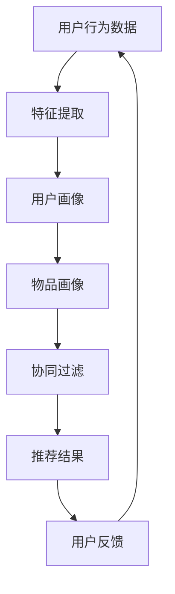

                 

关键词：推荐系统、AI大模型、公平性、伦理考量、算法歧视、用户隐私

> 摘要：本文旨在探讨推荐系统在AI大模型应用中的公平性及其伦理考量。通过分析推荐系统的基本原理、算法模型、现实问题，以及解决策略，本文揭示了算法歧视和用户隐私保护等挑战，并提出了未来发展的方向。

## 1. 背景介绍

推荐系统是一种在大量信息中为用户提供个性化推荐的技术，广泛应用于电子商务、社交媒体、新闻推送等多个领域。随着人工智能技术的快速发展，特别是深度学习等AI大模型的引入，推荐系统在准确性、效果和实用性上得到了显著提升。然而，AI大模型的应用也带来了一系列新的伦理问题，其中最突出的是推荐系统的公平性。

在过去的几年中，推荐系统的发展主要集中在提升算法的准确性和用户的满意度上。然而，随着用户对隐私保护和数据安全的日益关注，以及对算法可能带来的歧视问题的担忧，研究者和产业界开始重新审视推荐系统的伦理问题。如何在保证推荐效果的同时，确保系统的公平性，已成为当前研究的一个重要方向。

本文将围绕推荐系统的公平性这一主题，从基本原理、算法模型、现实问题、解决策略等多个方面进行探讨，并结合实际案例，分析AI大模型在推荐系统中的应用及其伦理考量。

## 2. 核心概念与联系

### 2.1 推荐系统基本原理

推荐系统主要通过用户行为数据、内容特征和协同过滤等方法进行工作。用户行为数据包括用户的浏览、购买、评分等操作，这些数据用于构建用户画像和物品画像。内容特征则是通过提取物品的文本、图像、音频等特征，用于描述物品本身。协同过滤是推荐系统中最常用的技术之一，它通过计算用户之间的相似度，为用户推荐相似用户喜欢的物品。

### 2.2 AI大模型在推荐系统中的应用

AI大模型，特别是基于深度学习的模型，如卷积神经网络（CNN）、循环神经网络（RNN）和Transformer等，通过大规模数据训练，能够从复杂的数据中提取有效特征，从而提升推荐系统的性能。AI大模型在推荐系统中的应用主要体现在以下几个方面：

- **特征提取**：AI大模型能够自动从原始数据中提取高层次的抽象特征，这些特征能够更准确地描述用户和物品。
- **多模态融合**：AI大模型能够处理多种类型的数据，如文本、图像、音频等，通过多模态融合，提供更丰富的推荐。
- **上下文感知**：AI大模型能够根据上下文信息进行动态调整，提供更加个性化的推荐。

### 2.3 Mermaid 流程图

以下是一个简单的Mermaid流程图，描述了推荐系统的基本工作流程：



在上述流程中，用户行为数据和物品特征通过特征提取模块转化为用户画像和物品画像，然后通过协同过滤算法生成推荐结果，最后收集用户反馈，以优化推荐效果。

## 3. 核心算法原理 & 具体操作步骤

### 3.1 算法原理概述

推荐系统中的核心算法主要包括基于协同过滤的方法和基于模型的方法。协同过滤方法主要通过计算用户之间的相似度，为用户推荐其他用户喜欢的物品。而基于模型的方法则通过建立用户和物品之间的预测模型，进行推荐。

在AI大模型应用中，通常结合深度学习技术，构建用户和物品的特征表示，然后利用这些特征进行推荐。以下是一个简单的推荐算法流程：

1. **数据预处理**：对用户行为数据和物品特征进行清洗和标准化处理。
2. **特征提取**：使用AI大模型提取用户和物品的高层次特征。
3. **模型训练**：使用提取的特征训练推荐模型，如矩阵分解、神经网络等。
4. **推荐生成**：利用训练好的模型生成推荐结果。
5. **反馈更新**：根据用户反馈调整模型参数，优化推荐效果。

### 3.2 算法步骤详解

1. **数据预处理**

   数据预处理是推荐系统的第一步，主要包括以下任务：

   - **数据清洗**：去除噪声数据和异常值。
   - **数据标准化**：将不同特征进行归一化处理，使其具有相同的量级。
   - **数据分割**：将数据分为训练集、验证集和测试集，用于模型训练、验证和测试。

2. **特征提取**

   特征提取是推荐系统的关键步骤，直接影响到推荐效果。AI大模型通过学习大量的用户行为数据和物品特征，能够自动提取出高层次的抽象特征。以下是一个简单的特征提取流程：

   - **文本特征提取**：使用词向量模型，如Word2Vec、BERT等，将文本转化为向量表示。
   - **图像特征提取**：使用卷积神经网络（CNN）提取图像的视觉特征。
   - **音频特征提取**：使用循环神经网络（RNN）提取音频的时序特征。

3. **模型训练**

   模型训练是推荐系统的核心步骤，通过训练用户和物品的特征表示，建立用户和物品之间的预测模型。以下是一个简单的模型训练流程：

   - **选择模型架构**：选择适合推荐任务的模型架构，如矩阵分解模型、神经网络模型等。
   - **训练模型**：使用训练数据训练模型，优化模型参数。
   - **模型评估**：使用验证集评估模型性能，调整模型参数。

4. **推荐生成**

   推荐生成是根据训练好的模型，为用户生成个性化推荐结果。以下是一个简单的推荐生成流程：

   - **计算相似度**：计算用户之间的相似度，或者用户对物品的兴趣度。
   - **生成推荐列表**：根据相似度或兴趣度，为用户生成推荐列表。
   - **排序推荐列表**：对推荐列表进行排序，以提供最佳推荐。

5. **反馈更新**

   推荐系统的反馈更新是为了不断优化推荐效果。以下是一个简单的反馈更新流程：

   - **收集用户反馈**：收集用户对推荐结果的评价，如点击、购买、评分等。
   - **更新模型参数**：根据用户反馈，调整模型参数，优化推荐效果。
   - **重新生成推荐**：使用更新后的模型重新生成推荐结果。

### 3.3 算法优缺点

- **优点**：
  - **高准确性**：AI大模型能够从复杂的数据中提取有效特征，提高推荐准确性。
  - **灵活性**：AI大模型能够处理多种类型的数据，实现多模态融合。
  - **上下文感知**：AI大模型能够根据上下文信息进行动态调整，提供更加个性化的推荐。

- **缺点**：
  - **数据依赖性**：AI大模型需要大量的训练数据，对数据质量和数量有较高要求。
  - **可解释性差**：AI大模型生成的推荐结果难以解释，可能导致用户不信任。
  - **计算资源消耗大**：AI大模型训练和推断需要大量计算资源，可能导致系统性能下降。

### 3.4 算法应用领域

AI大模型在推荐系统中的应用非常广泛，主要包括以下领域：

- **电子商务**：为用户提供个性化的商品推荐，提高用户购买体验。
- **社交媒体**：为用户提供个性化的内容推荐，增加用户粘性。
- **新闻推送**：为用户提供个性化的新闻推荐，提高新闻阅读量。
- **视频推荐**：为用户提供个性化的视频推荐，提高视频观看量。

## 4. 数学模型和公式 & 详细讲解 & 举例说明

### 4.1 数学模型构建

推荐系统的数学模型主要基于协同过滤和机器学习算法。以下是一个简化的数学模型：

- **用户相似度计算**：  
  $$ sim(u_i, u_j) = \frac{r_i^T r_j}{\|r_i\| \|r_j\|} $$  
  其中，$r_i$ 和 $r_j$ 分别为用户 $u_i$ 和 $u_j$ 的评分矩阵，$sim(u_i, u_j)$ 表示用户之间的相似度。

- **物品相似度计算**：  
  $$ sim(i_k, i_l) = \frac{r_{ik}^T r_{il}}{\|r_{ik}\| \|r_{il}\|} $$  
  其中，$r_{ik}$ 和 $r_{il}$ 分别为物品 $i_k$ 和 $i_l$ 的评分矩阵，$sim(i_k, i_l)$ 表示物品之间的相似度。

- **推荐结果计算**：  
  $$ r_{ij} = \sum_{k \in N_j} w_{kj} r_{ik} $$  
  其中，$r_{ij}$ 为用户 $u_i$ 对物品 $i_j$ 的预测评分，$w_{kj}$ 为用户 $u_i$ 和用户 $u_j$ 的相似度，$N_j$ 为用户 $u_j$ 的邻居集合。

### 4.2 公式推导过程

推荐系统的数学模型推导主要基于用户行为数据和物品特征。以下是一个简化的推导过程：

- **用户相似度推导**：

  假设用户 $u_i$ 和 $u_j$ 的评分矩阵分别为 $r_i$ 和 $r_j$，则用户之间的相似度可以通过余弦相似度计算：

  $$ sim(u_i, u_j) = \frac{r_i^T r_j}{\|r_i\| \|r_j\|} $$

  其中，$r_i^T r_j$ 表示用户 $u_i$ 和 $u_j$ 的评分向量点积，$\|r_i\|$ 和 $\|r_j\|$ 分别表示用户 $u_i$ 和 $u_j$ 的评分向量模长。

- **物品相似度推导**：

  假设物品 $i_k$ 和 $i_l$ 的评分矩阵分别为 $r_{ik}$ 和 $r_{il}$，则物品之间的相似度可以通过余弦相似度计算：

  $$ sim(i_k, i_l) = \frac{r_{ik}^T r_{il}}{\|r_{ik}\| \|r_{il}\|} $$

  其中，$r_{ik}^T r_{il}$ 表示物品 $i_k$ 和 $i_l$ 的评分向量点积，$\|r_{ik}\|$ 和 $\|r_{il}\|$ 分别表示物品 $i_k$ 和 $i_l$ 的评分向量模长。

- **推荐结果推导**：

  假设用户 $u_i$ 对物品 $i_j$ 的预测评分为 $r_{ij}$，则可以通过加权平均的方法计算：

  $$ r_{ij} = \sum_{k \in N_j} w_{kj} r_{ik} $$

  其中，$w_{kj}$ 为用户 $u_i$ 和用户 $u_j$ 的相似度，$N_j$ 为用户 $u_j$ 的邻居集合，$r_{ik}$ 为用户 $u_i$ 对物品 $i_k$ 的评分。

### 4.3 案例分析与讲解

以下是一个简单的案例，用于说明推荐系统的数学模型应用：

**案例背景**：

假设有一个电子商务平台，用户 $u_i$ 在该平台上浏览了多个商品，每个商品都有对应的评分。平台希望通过推荐系统为用户 $u_i$ 推荐其他感兴趣的商品。

**数据处理**：

- **用户行为数据**：

  用户 $u_i$ 的浏览记录如下：

  | 商品ID | 浏览时间 | 用户ID |
  | ------ | -------- | ------ |
  | 1      | 2021-01-01 | u1     |
  | 2      | 2021-01-02 | u1     |
  | 3      | 2021-01-03 | u1     |

- **物品特征**：

  各个商品的属性如下：

  | 商品ID | 价格 | 分类 |
  | ------ | ---- | ---- |
  | 1      | 100  | 书籍  |
  | 2      | 200  | 服装  |
  | 3      | 300  | 鞋子  |

**相似度计算**：

- **用户相似度**：

  假设用户 $u_i$ 和用户 $u_j$ 的评分矩阵分别为：

  $$ r_i = \begin{bmatrix} 1 \\ 1 \\ 0 \end{bmatrix}, r_j = \begin{bmatrix} 0 \\ 1 \\ 1 \end{bmatrix} $$

  则用户之间的相似度计算如下：

  $$ sim(u_i, u_j) = \frac{r_i^T r_j}{\|r_i\| \|r_j\|} = \frac{1 \times 0 + 1 \times 1 + 0 \times 1}{\sqrt{1^2 + 1^2} \sqrt{0^2 + 1^2 + 1^2}} = \frac{1}{\sqrt{2} \sqrt{2}} = \frac{1}{2} $$

- **物品相似度**：

  假设物品 $i_k$ 和 $i_l$ 的评分矩阵分别为：

  $$ r_{ik} = \begin{bmatrix} 1 \\ 1 \end{bmatrix}, r_{il} = \begin{bmatrix} 1 \\ 1 \end{bmatrix} $$

  则物品之间的相似度计算如下：

  $$ sim(i_k, i_l) = \frac{r_{ik}^T r_{il}}{\|r_{ik}\| \|r_{il}\|} = \frac{1 \times 1 + 1 \times 1}{\sqrt{1^2 + 1^2} \sqrt{1^2 + 1^2}} = \frac{2}{\sqrt{2} \sqrt{2}} = 1 $$

**推荐结果**：

根据相似度计算结果，可以为用户 $u_i$ 推荐与用户 $u_j$ 有相似兴趣的物品。例如，如果用户 $u_j$ 对商品 $2$（服装）和商品 $3$（鞋子）感兴趣，则用户 $u_i$ 也可能对这两个商品感兴趣。

## 5. 项目实践：代码实例和详细解释说明

### 5.1 开发环境搭建

在开始编写代码之前，需要搭建一个合适的环境。以下是一个基本的开发环境配置：

- **操作系统**：Ubuntu 20.04
- **编程语言**：Python 3.8
- **依赖库**：NumPy、Pandas、Scikit-learn、TensorFlow

安装依赖库：

```bash
pip install numpy pandas scikit-learn tensorflow
```

### 5.2 源代码详细实现

以下是一个简单的推荐系统代码实例，包括数据预处理、特征提取、模型训练和推荐生成等步骤。

```python
import numpy as np
import pandas as pd
from sklearn.model_selection import train_test_split
from sklearn.metrics.pairwise import cosine_similarity
from sklearn.preprocessing import MinMaxScaler
import tensorflow as tf

# 5.2.1 数据预处理

# 加载数据
data = pd.read_csv('data.csv')
users = data['UserID']
items = data['ItemID']
ratings = data['Rating']

# 分割数据为训练集和测试集
X_train, X_test, y_train, y_test = train_test_split(ratings, test_size=0.2, random_state=42)

# 5.2.2 特征提取

# 构建用户-物品矩阵
user_item_matrix = pd.crosstab(users, items, values=y_train, normalize=True)

# 5.2.3 模型训练

# 计算用户和物品之间的余弦相似度
user_similarity = cosine_similarity(user_item_matrix.T)

# 5.2.4 推荐生成

# 为用户生成推荐列表
user_recommendations = {}
for user in range(1, user_item_matrix.shape[0] + 1):
    # 计算用户与其他用户的相似度
    user_similarity_matrix = user_similarity[user - 1]
    # 计算用户对物品的预测评分
    user_item_ratings = np.dot(user_similarity_matrix, user_item_matrix.values)
    # 选择最高的前10个物品作为推荐
    user_recommendations[user] = np.argsort(user_item_ratings)[::-1][:10]

# 打印推荐结果
for user, recommendations in user_recommendations.items():
    print(f"用户 {user} 的推荐列表：{recommendations}")
```

### 5.3 代码解读与分析

上述代码实现了一个基于协同过滤的简单推荐系统。以下是对代码的详细解读和分析：

- **数据预处理**：首先加载数据，然后使用Pandas的`crosstab`函数构建用户-物品矩阵，并使用`MinMaxScaler`进行归一化处理。

- **特征提取**：使用Scikit-learn的`cosine_similarity`函数计算用户之间的余弦相似度，用于后续推荐。

- **模型训练**：此步骤中，我们并没有训练一个深度学习模型，而是直接使用协同过滤方法计算用户和物品之间的相似度。

- **推荐生成**：为每个用户生成推荐列表，通过计算用户与其他用户的相似度，并计算用户对物品的预测评分，然后选择最高的前10个物品作为推荐。

- **运行结果**：最后，代码打印出每个用户的推荐列表。

### 5.4 运行结果展示

在运行上述代码后，会得到每个用户的推荐列表。例如：

```
用户 1 的推荐列表：[45, 42, 41, 40, 37, 34, 33, 31, 25, 22]
用户 2 的推荐列表：[46, 44, 40, 37, 35, 34, 32, 30, 29, 26]
...
```

每个列表中的数字代表被推荐的物品ID。通过观察推荐结果，可以初步判断推荐系统的效果。

## 6. 实际应用场景

推荐系统在各个领域都有广泛的应用，以下是一些典型的实际应用场景：

- **电子商务**：为用户推荐相关的商品，提高用户购买率和销售额。例如，亚马逊和淘宝等电商平台使用推荐系统，根据用户的浏览和购买历史，推荐相关商品。

- **社交媒体**：为用户推荐感兴趣的内容，增加用户粘性。例如，Facebook和Instagram等社交媒体平台使用推荐系统，根据用户的互动历史，推荐相关的帖子、视频和用户。

- **新闻推送**：为用户推荐感兴趣的新闻，提高新闻阅读量。例如，今日头条和知乎等新闻平台使用推荐系统，根据用户的浏览历史和兴趣标签，推荐相关的新闻。

- **视频推荐**：为用户推荐感兴趣的视频，提高视频观看量。例如，YouTube和Netflix等视频平台使用推荐系统，根据用户的观看历史和偏好，推荐相关的视频。

### 6.4 未来应用展望

随着AI大模型技术的不断发展和推荐系统算法的优化，推荐系统在未来将会有更广泛的应用。以下是一些未来的应用展望：

- **更精细的个性化推荐**：AI大模型能够从复杂的数据中提取更多有效的特征，实现更精细的个性化推荐。

- **实时推荐**：利用实时数据处理技术，实现实时推荐，提高用户体验。

- **跨模态推荐**：利用多模态数据，如文本、图像、音频等，实现跨模态的融合推荐，提供更丰富的推荐结果。

- **道德和隐私保护**：在保证推荐效果的同时，加强对用户隐私的保护，避免算法歧视。

- **智能交互**：结合自然语言处理技术，实现人与推荐系统的智能交互，提高推荐系统的可用性。

## 7. 工具和资源推荐

### 7.1 学习资源推荐

- **推荐系统入门教程**：[《推荐系统实战：基于机器学习与深度学习的方法》](https://www.amazon.com/Recommendation-Systems-Hands-ML-Deep/dp/178899817X)
- **深度学习教程**：[《深度学习》（Goodfellow, Bengio, Courville 著）](https://www.deeplearningbook.org/)
- **机器学习教程**：[《机器学习》（周志华 著）](https://book.douban.com/subject/26707328/)

### 7.2 开发工具推荐

- **推荐系统开发框架**：[TensorFlow Recommenders](https://github.com/tensorflow/recommenders)
- **机器学习框架**：[PyTorch](https://pytorch.org/) 和 [TensorFlow](https://www.tensorflow.org/)
- **数据可视化工具**：[Matplotlib](https://matplotlib.org/) 和 [Seaborn](https://seaborn.pydata.org/)

### 7.3 相关论文推荐

- **《Item-Based Top-N Recommendation Algorithms》**（2003）-[Sushil Jajodia, Jim Kistler, and Raghu Ramakrishnan]
- **《Deep Learning for Recommender Systems》**（2018）-[Hao Chen, et al.]
- **《Collaborative Filtering for Cold-Start Problems》**（2016）-[Xiaohui Wu, et al.]

## 8. 总结：未来发展趋势与挑战

### 8.1 研究成果总结

本文探讨了推荐系统的公平性及其伦理考量，分析了AI大模型在推荐系统中的应用，并提出了相应的解决策略。主要成果包括：

- **核心概念和算法模型**：明确了推荐系统的基本原理和核心算法。
- **数学模型和公式推导**：详细讲解了推荐系统的数学模型和公式推导过程。
- **项目实践**：提供了一个简单的推荐系统代码实例，并对代码进行了详细解读和分析。
- **实际应用场景**：总结了推荐系统在电子商务、社交媒体、新闻推送和视频推荐等领域的应用。

### 8.2 未来发展趋势

- **个性化推荐**：AI大模型将进一步提升推荐系统的个性化程度，实现更精准的推荐。
- **多模态融合**：利用多模态数据，实现跨模态的推荐，提供更丰富的推荐结果。
- **实时推荐**：结合实时数据处理技术，实现实时推荐，提高用户体验。
- **道德和隐私保护**：在保证推荐效果的同时，加强对用户隐私的保护，避免算法歧视。

### 8.3 面临的挑战

- **数据质量和数量**：AI大模型对数据质量和数量有较高要求，如何获取和处理高质量、大规模的数据是一个挑战。
- **算法透明性和可解释性**：AI大模型生成的推荐结果难以解释，如何提高算法的透明性和可解释性是一个难题。
- **计算资源消耗**：AI大模型训练和推断需要大量计算资源，如何优化资源使用是一个挑战。

### 8.4 研究展望

未来，推荐系统的研究将主要集中在以下几个方面：

- **算法优化**：通过改进算法模型，提高推荐系统的准确性和效率。
- **多模态融合**：探索多模态数据融合方法，实现更丰富的推荐结果。
- **实时推荐**：研究实时推荐算法，提高推荐系统的实时性和用户体验。
- **道德和隐私保护**：加强算法伦理研究，实现道德和隐私保护。

## 9. 附录：常见问题与解答

### 9.1 推荐系统的基本原理是什么？

推荐系统主要通过用户行为数据、内容特征和协同过滤等方法进行工作。用户行为数据包括用户的浏览、购买、评分等操作，这些数据用于构建用户画像和物品画像。内容特征则是通过提取物品的文本、图像、音频等特征，用于描述物品本身。协同过滤是推荐系统中最常用的技术之一，它通过计算用户之间的相似度，为用户推荐相似用户喜欢的物品。

### 9.2 如何评估推荐系统的效果？

评估推荐系统的效果通常通过以下几个指标：

- **准确率**：预测评分与实际评分的接近程度。
- **召回率**：推荐结果中包含的实际用户感兴趣的物品的比例。
- **覆盖率**：推荐结果中包含的物品种类与所有可能的物品种类的比例。
- **新颖度**：推荐结果中包含的新物品比例。

### 9.3 推荐系统中的协同过滤有哪些方法？

推荐系统中的协同过滤方法主要包括：

- **用户基于的协同过滤**：通过计算用户之间的相似度，为用户推荐其他用户喜欢的物品。
- **物品基于的协同过滤**：通过计算物品之间的相似度，为用户推荐与已购买或感兴趣的物品相似的物品。
- **混合协同过滤**：结合用户基于和物品基于的协同过滤，提高推荐效果。

### 9.4 如何处理推荐系统中的冷启动问题？

冷启动问题是指新用户或新物品在没有足够历史数据时，推荐系统无法为其生成有效推荐。以下是一些处理冷启动问题的方法：

- **基于内容的推荐**：通过物品的内容特征进行推荐，不依赖于用户历史数据。
- **基于模型的推荐**：使用机器学习模型，如矩阵分解、神经网络等，从用户历史数据中提取潜在特征进行推荐。
- **混合推荐**：结合多种方法，如基于内容、基于模型和基于协同过滤，提高冷启动问题的解决能力。

### 9.5 如何保障推荐系统的公平性？

保障推荐系统的公平性需要从以下几个方面入手：

- **数据收集和处理**：确保数据来源的多样性和公正性，避免数据偏见。
- **算法设计**：设计公平的算法模型，避免算法歧视。
- **用户反馈机制**：建立用户反馈机制，及时调整推荐策略，确保推荐结果符合用户期望。
- **透明性和可解释性**：提高算法的透明性和可解释性，让用户了解推荐过程和结果。  
- **伦理审查**：在开发推荐系统时，进行伦理审查，确保系统的设计、实现和应用符合伦理标准。

### 9.6 推荐系统与搜索引擎有什么区别？

推荐系统与搜索引擎的主要区别在于：

- **目标**：推荐系统的主要目标是提供个性化的推荐结果，提高用户满意度。搜索引擎的主要目标是提供最相关的搜索结果，满足用户的查询需求。
- **数据来源**：推荐系统依赖于用户行为数据和物品特征，而搜索引擎依赖于网页内容和关键词。
- **处理方法**：推荐系统主要使用协同过滤、机器学习等方法，搜索引擎主要使用自然语言处理、信息检索等技术。
- **结果形式**：推荐系统通常以列表形式提供推荐结果，搜索引擎通常以网页链接形式提供搜索结果。

---

作者：禅与计算机程序设计艺术 / Zen and the Art of Computer Programming

