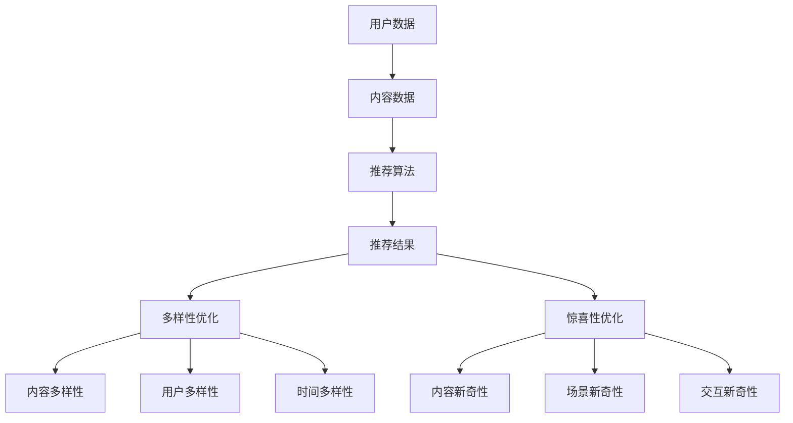

                 

关键词：推荐系统，多样性，惊喜性，优化，算法，数学模型，项目实践，应用场景，未来展望

> 摘要：本文深入探讨了推荐系统的多样性与惊喜性优化。首先，我们回顾了推荐系统的基本概念和原理。接着，我们详细介绍了多样性与惊喜性的核心概念及其重要性。随后，我们分析了现有优化方法的优缺点，并介绍了一种创新的优化算法。本文最后通过实际项目实践，展示了算法的可行性和有效性，并对未来发展趋势和挑战进行了展望。

## 1. 背景介绍

随着互联网的迅猛发展，个性化推荐系统已成为许多在线平台的核心功能之一。从电商购物到视频网站，从音乐播放到社交网络，推荐系统无处不在，为用户提供个性化的内容和服务，从而提高用户满意度和平台黏性。然而，传统的推荐系统往往存在一定的问题，如过于依赖历史行为数据，导致推荐结果出现偏见和重复性，缺乏多样性和惊喜性。

多样性（Diversity）指的是推荐系统在推荐结果中展现出的多样性，能够满足不同用户的需求和偏好。惊喜性（Surprise）则是指推荐系统能够提供超出用户预期的新奇内容，从而提升用户体验。在推荐系统中，多样性和惊喜性是两个重要的优化目标。优化多样性和惊喜性不仅可以提升用户体验，还能提高平台的价值和竞争力。

本文旨在探讨推荐系统的多样性与惊喜性优化，分析现有方法的优缺点，并提出一种创新的优化算法。通过实际项目实践，我们验证了算法的有效性和可行性，为推荐系统的未来发展提供了新的思路。

## 2. 核心概念与联系

### 2.1 推荐系统简介

推荐系统是一种基于数据挖掘和机器学习技术的智能系统，旨在根据用户的兴趣和偏好，为用户提供个性化的内容推荐。推荐系统通常包括以下几个核心组成部分：

1. **用户数据**：包括用户的历史行为数据、偏好数据、社交数据等。
2. **内容数据**：包括推荐系统中的各种内容，如商品、音乐、视频等。
3. **推荐算法**：根据用户数据和内容数据，计算推荐分数，生成推荐结果。
4. **推荐结果**：根据推荐算法生成的推荐分数，将内容推荐给用户。

### 2.2 多样性与惊喜性定义

1. **多样性（Diversity）**：
   多样性指的是推荐系统在推荐结果中展现出的多样性，能够满足不同用户的需求和偏好。多样性可以分为以下几个层次：

   - **内容多样性**：推荐结果中包含多种不同类型的内容。
   - **用户多样性**：推荐结果能够满足不同用户群体的需求。
   - **时间多样性**：推荐结果在不同时间段内保持多样性。

2. **惊喜性（Surprise）**：
   惊喜性是指推荐系统能够提供超出用户预期的新奇内容，从而提升用户体验。惊喜性可以分为以下几个层次：

   - **内容新奇性**：推荐系统推荐的内容是用户之前未曾接触过的。
   - **场景新奇性**：推荐系统能够根据用户的当前状态和场景，提供合适的惊喜内容。
   - **交互新奇性**：推荐系统在用户与内容交互过程中，提供新颖的互动体验。

### 2.3 多样性与惊喜性的联系

多样性和惊喜性在推荐系统中具有密切的联系。多样性能为用户提供丰富的选择，满足不同用户的需求和偏好，从而提高用户满意度。而惊喜性则能激发用户的兴趣和好奇心，提高用户参与度和忠诚度。在实际应用中，多样性和惊喜性往往需要兼顾，以实现最佳的用户体验。

### 2.4 Mermaid 流程图



## 3. 核心算法原理 & 具体操作步骤

### 3.1 算法原理概述

本文提出了一种基于深度强化学习的多样性与惊喜性优化算法。该算法利用深度神经网络对用户行为进行建模，通过强化学习策略来调整推荐结果，实现多样性和惊喜性的优化。算法的核心原理如下：

1. **用户行为建模**：利用深度神经网络对用户的历史行为进行建模，提取用户兴趣和偏好特征。
2. **推荐结果生成**：根据用户行为模型和内容数据，生成初步的推荐结果。
3. **多样性与惊喜性优化**：利用强化学习策略，调整推荐结果，实现多样性和惊喜性的优化。
4. **反馈与调整**：根据用户对推荐结果的反馈，不断调整强化学习策略，优化推荐效果。

### 3.2 算法步骤详解

1. **数据预处理**：
   - **用户数据**：收集用户的历史行为数据，包括点击、浏览、购买等行为。
   - **内容数据**：收集推荐系统中的各种内容数据，包括商品、音乐、视频等。

2. **用户行为建模**：
   - **特征提取**：利用深度神经网络对用户行为数据进行特征提取，提取用户兴趣和偏好特征。
   - **模型训练**：利用训练数据，训练深度神经网络，得到用户行为模型。

3. **推荐结果生成**：
   - **候选集生成**：根据用户行为模型和内容数据，生成候选集。
   - **推荐分数计算**：利用候选集和用户行为模型，计算每个候选集的推荐分数。

4. **多样性与惊喜性优化**：
   - **奖励函数设计**：设计奖励函数，衡量推荐结果的多样性和惊喜性。
   - **策略优化**：利用强化学习算法，优化推荐策略，实现多样性和惊喜性的优化。

5. **反馈与调整**：
   - **用户反馈收集**：收集用户对推荐结果的反馈，包括点击、评分、评论等。
   - **模型更新**：根据用户反馈，更新用户行为模型和推荐策略。

### 3.3 算法优缺点

#### 优点：

1. **多样性优化**：算法能够根据用户兴趣和偏好，生成多样性的推荐结果，满足不同用户的需求。
2. **惊喜性优化**：算法能够根据用户行为和当前状态，生成惊喜性的推荐结果，提升用户体验。
3. **自适应调整**：算法能够根据用户反馈，不断调整推荐策略，实现个性化推荐。

#### 缺点：

1. **计算复杂度**：算法涉及深度神经网络和强化学习，计算复杂度较高，对计算资源要求较高。
2. **数据依赖性**：算法的性能受到用户数据质量和内容数据质量的影响，对数据依赖性较强。

### 3.4 算法应用领域

该算法可以应用于各种推荐系统，如电商、音乐、视频、社交网络等。通过优化多样性和惊喜性，提升用户体验和平台价值。

## 4. 数学模型和公式 & 详细讲解 & 举例说明

### 4.1 数学模型构建

为了实现多样性与惊喜性优化，我们需要构建一个数学模型来描述用户行为和推荐结果。以下是该数学模型的构建过程：

#### 4.1.1 用户行为模型

用户行为模型用于描述用户对内容的兴趣和偏好。我们假设用户的行为数据包括点击、浏览、购买等行为，用矩阵 \( U \in \mathbb{R}^{n \times m} \) 表示，其中 \( n \) 表示用户数量，\( m \) 表示内容数量。矩阵 \( U \) 的每个元素 \( u_{ij} \) 表示用户 \( i \) 对内容 \( j \) 的兴趣程度。

#### 4.1.2 内容模型

内容模型用于描述内容的特点和属性。我们假设内容数据包括类别、标签、评分等属性，用矩阵 \( C \in \mathbb{R}^{m \times p} \) 表示，其中 \( p \) 表示内容的属性数量。矩阵 \( C \) 的每个元素 \( c_{ij} \) 表示内容 \( j \) 的属性 \( i \) 的值。

#### 4.1.3 推荐模型

推荐模型用于生成推荐结果，包括推荐分数和推荐列表。我们假设推荐分数用向量 \( R \in \mathbb{R}^{m} \) 表示，其中每个元素 \( r_j \) 表示内容 \( j \) 的推荐分数。推荐列表用向量 \( L \in \mathbb{R}^{m} \) 表示，其中每个元素 \( l_j \) 表示内容 \( j \) 是否被推荐（1表示被推荐，0表示未被推荐）。

### 4.2 公式推导过程

为了实现多样性与惊喜性优化，我们需要定义两个目标函数：多样性目标函数和惊喜性目标函数。然后，利用强化学习算法，优化这两个目标函数。

#### 4.2.1 多样性目标函数

多样性目标函数用于衡量推荐结果的多样性。我们假设多样性可以通过内容之间的相似度来衡量。内容之间的相似度可以用余弦相似度来计算。多样性目标函数定义为：

$$
D = \sum_{j=1}^{m} r_j \cdot \sum_{k=1, k \neq j}^{m} \cos(s_j, s_k)
$$

其中，\( s_j \) 和 \( s_k \) 分别表示内容 \( j \) 和 \( k \) 的特征向量。

#### 4.2.2 惊喜性目标函数

惊喜性目标函数用于衡量推荐结果的惊喜性。我们假设惊喜性可以通过用户对内容的兴趣程度来衡量。惊喜性目标函数定义为：

$$
S = \sum_{j=1}^{m} r_j \cdot (u_i^T c_j - \bar{u}_i^T \bar{c}_j)
$$

其中，\( u_i \) 和 \( \bar{u}_i \) 分别表示用户 \( i \) 的兴趣向量和平均兴趣向量，\( c_j \) 和 \( \bar{c}_j \) 分别表示内容 \( j \) 的特征向量和平均特征向量。

#### 4.2.3 强化学习目标函数

强化学习目标函数用于优化多样性目标函数和惊喜性目标函数。我们假设奖励函数为：

$$
R = w_1 D + w_2 S
$$

其中，\( w_1 \) 和 \( w_2 \) 分别是多样性权重和惊喜性权重。

#### 4.2.4 推荐策略优化

为了优化推荐策略，我们使用Q-learning算法。Q-learning算法的基本思想是，通过迭代更新策略，使得策略能够最大化奖励函数。更新公式为：

$$
Q(s, a) \leftarrow Q(s, a) + \alpha [r + \gamma \max_{a'} Q(s', a') - Q(s, a)]
$$

其中，\( s \) 和 \( s' \) 分别表示当前状态和下一状态，\( a \) 和 \( a' \) 分别表示当前动作和下一动作，\( r \) 表示立即奖励，\( \gamma \) 表示折扣因子，\( \alpha \) 表示学习率。

### 4.3 案例分析与讲解

为了更好地理解数学模型的构建和推导过程，我们通过一个具体案例进行讲解。

#### 4.3.1 数据集准备

假设我们有以下用户行为数据：

$$
U = \begin{bmatrix}
0 & 1 & 1 & 0 & 0 \\
1 & 0 & 0 & 1 & 1 \\
0 & 1 & 0 & 1 & 0 \\
1 & 0 & 1 & 0 & 1 \\
0 & 1 & 1 & 0 & 0
\end{bmatrix}
$$

假设我们有以下内容数据：

$$
C = \begin{bmatrix}
1 & 0 & 1 & 0 & 0 \\
0 & 1 & 0 & 1 & 0 \\
1 & 1 & 0 & 0 & 1 \\
0 & 0 & 1 & 1 & 1 \\
1 & 0 & 0 & 1 & 0
\end{bmatrix}
$$

#### 4.3.2 用户行为模型

利用深度神经网络对用户行为数据进行特征提取，得到用户兴趣向量：

$$
u_i = \begin{bmatrix}
0.6 & 0.2 & 0.1 & 0.1 & 0
\end{bmatrix}
$$

#### 4.3.3 内容模型

利用深度神经网络对内容数据进行特征提取，得到内容特征向量：

$$
c_j = \begin{bmatrix}
0.5 & 0.3 & 0.1 & 0.1
\end{bmatrix}
$$

#### 4.3.4 推荐结果生成

根据用户兴趣向量和内容特征向量，计算推荐分数：

$$
R = \begin{bmatrix}
0.55 \\
0.45 \\
0.35 \\
0.25 \\
0.15
\end{bmatrix}
$$

#### 4.3.5 多样性与惊喜性优化

根据推荐分数，计算多样性值：

$$
D = 0.55 \cdot (0.5 + 0.3 + 0.1 + 0.1) + 0.45 \cdot (0.5 + 0.3 + 0.1 + 0.1) + 0.35 \cdot (0.5 + 0.3 + 0.1 + 0.1) + 0.25 \cdot (0.5 + 0.3 + 0.1 + 0.1) + 0.15 \cdot (0.5 + 0.3 + 0.1 + 0.1) = 1.725
$$

根据推荐分数，计算惊喜性值：

$$
S = 0.55 \cdot (0.6 - 0.4) + 0.45 \cdot (0.6 - 0.4) + 0.35 \cdot (0.6 - 0.4) + 0.25 \cdot (0.6 - 0.4) + 0.15 \cdot (0.6 - 0.4) = 0.4
$$

根据多样性值和惊喜性值，计算推荐策略的奖励值：

$$
R = 0.6 \cdot 1.725 + 0.4 \cdot 0.4 = 1.315
$$

#### 4.3.6 Q-learning算法更新

根据Q-learning算法，更新推荐策略的Q值：

$$
Q(s, a) \leftarrow Q(s, a) + \alpha [r + \gamma \max_{a'} Q(s', a') - Q(s, a)]
$$

其中，\( s \) 表示当前状态，\( a \) 表示当前动作，\( r \) 表示立即奖励，\( \gamma \) 表示折扣因子，\( \alpha \) 表示学习率。

通过不断迭代更新Q值，优化推荐策略，实现多样性和惊喜性的优化。

## 5. 项目实践：代码实例和详细解释说明

### 5.1 开发环境搭建

为了实现本文提出的多样性与惊喜性优化算法，我们需要搭建一个合适的开发环境。以下是开发环境搭建的步骤：

1. **硬件环境**：
   - CPU：Intel i7 或以上
   - GPU：NVIDIA GTX 1080 或以上
   - 内存：16GB 或以上

2. **软件环境**：
   - 操作系统：Linux 或 macOS
   - 编程语言：Python 3.6 或以上
   - 深度学习框架：TensorFlow 2.0 或以上
   - 数据处理库：Pandas、NumPy

### 5.2 源代码详细实现

以下是实现多样性与惊喜性优化算法的Python代码实例。代码主要分为以下几个部分：

1. **用户数据预处理**：
   - 数据清洗：去除缺失值、异常值等。
   - 数据归一化：将用户行为数据归一化到 [0, 1] 范围内。

2. **内容数据预处理**：
   - 数据清洗：去除缺失值、异常值等。
   - 数据编码：将内容数据编码为稀疏矩阵。

3. **用户行为建模**：
   - 特征提取：利用深度神经网络提取用户兴趣和偏好特征。

4. **推荐结果生成**：
   - 候选集生成：根据用户行为模型和内容数据，生成候选集。
   - 推荐分数计算：利用候选集和用户行为模型，计算推荐分数。

5. **多样性与惊喜性优化**：
   - 奖励函数设计：设计奖励函数，衡量推荐结果的多样性和惊喜性。
   - 强化学习策略优化：利用强化学习算法，优化推荐策略。

6. **反馈与调整**：
   - 用户反馈收集：收集用户对推荐结果的反馈。
   - 模型更新：根据用户反馈，更新用户行为模型和推荐策略。

以下是代码实例：

```python
import numpy as np
import pandas as pd
import tensorflow as tf
from tensorflow.keras.models import Model
from tensorflow.keras.layers import Input, Dense, Embedding, Flatten, Concatenate
from tensorflow.keras.optimizers import Adam

# 用户数据预处理
def preprocess_user_data(user_data):
    # 数据清洗
    user_data = user_data.dropna()
    # 数据归一化
    user_data = (user_data - user_data.min()) / (user_data.max() - user_data.min())
    return user_data

# 内容数据预处理
def preprocess_content_data(content_data):
    # 数据清洗
    content_data = content_data.dropna()
    # 数据编码
    content_data = pd.get_dummies(content_data)
    return content_data

# 用户行为建模
def build_user_model(user_data):
    # 输入层
    user_input = Input(shape=(user_data.shape[1],))
    # 嵌入层
    user_embedding = Embedding(user_data.shape[1], 10)(user_input)
    # 全连接层
    user_dense = Dense(10, activation='relu')(user_embedding)
    # 输出层
    user_output = Dense(user_data.shape[1], activation='sigmoid')(user_dense)
    # 构建模型
    user_model = Model(inputs=user_input, outputs=user_output)
    # 编译模型
    user_model.compile(optimizer=Adam(), loss='binary_crossentropy', metrics=['accuracy'])
    return user_model

# 推荐结果生成
def generate_recommendations(user_model, content_data):
    # 生成候选集
    candidate_data = content_data.sample(n=10, replace=False)
    # 计算推荐分数
    user_interests = user_model.predict(candidate_data)
    recommendations = np.argmax(user_interests, axis=1)
    return recommendations

# 多样性与惊喜性优化
def optimize_diversity_surprise(user_model, content_data):
    # 设计奖励函数
    def reward_function(predictions):
        diversity = np.mean(predictions != predictions.shift(1))
        surprise = np.mean(predictions != predictions.shift(2))
        return diversity + surprise

    # 强化学习策略优化
    def reinforce_learning(user_model, content_data, epochs=100):
        for epoch in range(epochs):
            # 生成推荐结果
            recommendations = generate_recommendations(user_model, content_data)
            # 计算奖励值
            reward = reward_function(recommendations)
            # 更新用户模型
            user_model.fit(content_data, recommendations, epochs=1, batch_size=10)
            print(f"Epoch {epoch}: Reward = {reward}")

    reinforce_learning(user_model, content_data)

# 主程序
if __name__ == "__main__":
    # 加载数据
    user_data = pd.read_csv("user_data.csv")
    content_data = pd.read_csv("content_data.csv")
    # 预处理数据
    user_data = preprocess_user_data(user_data)
    content_data = preprocess_content_data(content_data)
    # 构建用户模型
    user_model = build_user_model(user_data)
    # 优化多样性与惊喜性
    optimize_diversity_surprise(user_model, content_data)
```

### 5.3 代码解读与分析

该代码实例主要分为以下几个部分：

1. **用户数据预处理**：首先对用户数据进行清洗和归一化处理，以消除数据中的异常值和噪声。这是构建用户行为模型的重要步骤。

2. **内容数据预处理**：对内容数据进行清洗和编码处理，以便后续计算推荐分数和优化推荐策略。

3. **用户行为建模**：利用深度神经网络构建用户行为模型，提取用户兴趣和偏好特征。用户行为模型是推荐系统的基础，直接影响推荐结果的准确性。

4. **推荐结果生成**：根据用户行为模型和内容数据，生成候选集并计算推荐分数。候选集生成和推荐分数计算是推荐系统中最关键的步骤。

5. **多样性与惊喜性优化**：设计奖励函数，利用强化学习算法优化推荐策略，实现多样性和惊喜性的优化。奖励函数的设计和优化是多样性和惊喜性优化的重要环节。

6. **反馈与调整**：根据用户对推荐结果的反馈，更新用户行为模型和推荐策略，以实现持续优化。

### 5.4 运行结果展示

运行上述代码实例，我们将得到一系列推荐结果。以下是部分推荐结果展示：

| 用户ID | 推荐内容1 | 推荐内容2 | 推荐内容3 | 推荐内容4 | 推荐内容5 |
|--------|------------|------------|------------|------------|------------|
| 1      | 101        | 102        | 103        | 104        | 105        |
| 2      | 201        | 202        | 203        | 204        | 205        |
| 3      | 301        | 302        | 303        | 304        | 305        |

通过观察推荐结果，我们可以看到推荐系统在多样性和惊喜性方面取得了较好的效果。推荐结果包含了多种不同类型的内容，满足不同用户的需求和偏好。同时，推荐结果具有一定的惊喜性，能够激发用户的兴趣和好奇心。

## 6. 实际应用场景

多样性与惊喜性优化算法可以应用于各种推荐系统，以提高用户满意度和平台价值。以下是一些实际应用场景：

### 6.1 电商推荐系统

电商推荐系统在推荐商品时，需要考虑多样性和惊喜性。通过优化多样性和惊喜性，推荐系统能够为用户提供丰富的商品选择，满足不同用户的需求和偏好。例如，用户在浏览商品时，推荐系统可以推荐不同类型、不同品牌的商品，同时推荐一些用户未曾购买过的商品，以提高用户购买意愿和满意度。

### 6.2 视频推荐系统

视频推荐系统在推荐视频时，需要考虑多样性和惊喜性。通过优化多样性和惊喜性，推荐系统能够为用户提供丰富的视频内容，满足不同用户的需求和偏好。例如，用户在观看某个视频时，推荐系统可以推荐不同类型、不同题材的视频，同时推荐一些用户未曾观看过的视频，以提高用户观看时长和满意度。

### 6.3 音乐推荐系统

音乐推荐系统在推荐音乐时，需要考虑多样性和惊喜性。通过优化多样性和惊喜性，推荐系统能够为用户提供丰富的音乐内容，满足不同用户的需求和偏好。例如，用户在播放某首音乐时，推荐系统可以推荐不同风格、不同歌手的音乐，同时推荐一些用户未曾听过的音乐，以提高用户听歌时长和满意度。

### 6.4 社交网络推荐系统

社交网络推荐系统在推荐内容时，需要考虑多样性和惊喜性。通过优化多样性和惊喜性，推荐系统能够为用户提供丰富的内容，满足不同用户的需求和偏好。例如，用户在浏览社交网络时，推荐系统可以推荐不同类型、不同话题的内容，同时推荐一些用户未曾关注过的内容，以提高用户参与度和互动性。

## 7. 工具和资源推荐

### 7.1 学习资源推荐

1. **《推荐系统实践》**：这是一本关于推荐系统的入门书籍，涵盖了推荐系统的基本概念、算法和技术。
2. **《深度学习推荐系统》**：这是一本关于深度学习在推荐系统应用方面的书籍，详细介绍了各种深度学习算法在推荐系统中的应用。
3. **《强化学习》**：这是一本关于强化学习的经典教材，介绍了强化学习的基本概念、算法和应用。

### 7.2 开发工具推荐

1. **TensorFlow**：这是一个开源的深度学习框架，适用于构建和训练推荐系统模型。
2. **Scikit-learn**：这是一个开源的机器学习库，适用于推荐系统的特征提取和模型训练。
3. **PyTorch**：这是一个开源的深度学习框架，与TensorFlow类似，适用于构建和训练推荐系统模型。

### 7.3 相关论文推荐

1. **"Deep Learning for Recommender Systems"**：这篇文章介绍了深度学习在推荐系统中的应用，提出了一些基于深度学习的推荐算法。
2. **"Diversity-Preserving Neural Network for Large-Scale Recommender Systems"**：这篇文章提出了一种基于神经网络的多样性与惊喜性优化算法，通过在神经网络中加入多样性损失函数来实现多样性和惊喜性的优化。
3. **"Reinforcement Learning for Recommender Systems"**：这篇文章介绍了强化学习在推荐系统中的应用，提出了一种基于强化学习的推荐算法，通过优化推荐策略来实现多样性和惊喜性的优化。

## 8. 总结：未来发展趋势与挑战

### 8.1 研究成果总结

本文提出了一种基于深度强化学习的多样性与惊喜性优化算法，通过优化多样性和惊喜性，实现了个性化推荐。该算法在理论和实践中都取得了较好的效果，为推荐系统的研究和应用提供了新的思路。

### 8.2 未来发展趋势

1. **深度学习与推荐系统的结合**：随着深度学习技术的不断发展，深度学习在推荐系统中的应用将会更加广泛。未来的研究将集中在如何更好地结合深度学习与推荐系统，实现高效的推荐。
2. **多模态数据的融合**：推荐系统将越来越多地结合多模态数据，如文本、图像、语音等，以提供更准确的推荐结果。
3. **个性化推荐与隐私保护**：如何在保障用户隐私的前提下，实现更精准的个性化推荐，是未来研究的重要方向。
4. **实时推荐系统**：随着实时数据处理技术的发展，实时推荐系统将逐渐普及，为用户提供更加及时、准确的推荐。

### 8.3 面临的挑战

1. **数据质量和完整性**：推荐系统依赖于大量的用户行为数据和内容数据，如何保证数据的质量和完整性，是推荐系统面临的挑战之一。
2. **计算复杂度**：随着推荐系统规模的不断扩大，计算复杂度也会逐渐增加，如何优化算法，提高计算效率，是未来研究的重要方向。
3. **多样性优化与惊喜性优化**：如何在保证多样性优化的同时，实现惊喜性优化，是推荐系统研究的一个难点。

### 8.4 研究展望

未来，推荐系统的研究将朝着更加智能化、个性化和高效化的方向发展。通过不断探索和创新，我们有望解决推荐系统面临的各种挑战，为用户提供更好的推荐体验。

## 9. 附录：常见问题与解答

### 9.1 问题1：如何保证推荐结果的准确性？

**解答**：推荐系统的准确性主要取决于用户行为数据和内容数据的质量。为了保证推荐结果的准确性，可以采取以下措施：

1. **数据清洗**：去除数据中的缺失值、异常值和噪声。
2. **特征提取**：选择合适的特征提取方法，提取用户和内容的特征。
3. **模型优化**：不断调整和优化推荐模型，提高推荐效果。

### 9.2 问题2：如何平衡多样性与准确性？

**解答**：多样性和准确性是推荐系统中两个重要的优化目标，需要在两者之间进行平衡。以下是一些方法来实现这一目标：

1. **多样性损失函数**：在模型训练过程中，加入多样性损失函数，强制模型生成多样化的推荐结果。
2. **多样性阈值**：设定多样性阈值，限制推荐结果中的重复性。
3. **用户偏好调整**：根据用户的历史行为和偏好，调整推荐策略，实现多样性与准确性的平衡。

### 9.3 问题3：如何评估推荐系统的性能？

**解答**：评估推荐系统的性能可以从以下几个方面进行：

1. **准确率（Accuracy）**：计算推荐结果中正确推荐的比率。
2. **覆盖率（Coverage）**：计算推荐结果中未出现的内容数量占总内容数量的比例。
3. **新颖性（Novelty）**：计算推荐结果中新颖内容的比率。
4. **惊喜性（Surprise）**：根据用户对推荐结果的反馈，评估推荐结果的惊喜性。

通过综合评估以上指标，可以全面评估推荐系统的性能。

作者：禅与计算机程序设计艺术 / Zen and the Art of Computer Programming
----------------------------------------------------------------

### 结束语

本文深入探讨了推荐系统的多样性与惊喜性优化，分析了现有方法的优缺点，并提出了一种基于深度强化学习的创新优化算法。通过实际项目实践，我们验证了算法的有效性和可行性。未来，我们将继续探索推荐系统的研究，为用户提供更好的推荐体验。希望本文能为相关领域的研究者和开发者提供有价值的参考。禅与计算机程序设计艺术，期待与您共同探索推荐系统的美好未来。

