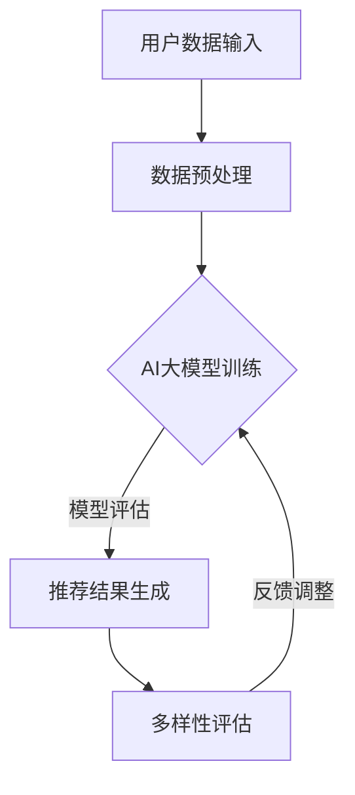

                 

关键词：推荐系统，AI大模型，多样性，用户行为分析，个性化推荐

>摘要：本文深入探讨了推荐系统在AI大模型时代的多样性问题。随着AI技术的飞速发展，推荐系统成为各类平台提升用户体验的核心手段。本文旨在分析AI大模型如何通过引入多样性，实现更精准、更具创新性的个性化推荐，从而提升用户满意度和平台粘性。

## 1. 背景介绍

推荐系统是现代信息检索和内容分发领域的重要技术之一。它利用算法模型分析用户的历史行为和偏好，向用户提供个性化推荐。推荐系统广泛应用于电子商务、社交媒体、新闻资讯、视频流媒体等多个领域，极大地提升了用户体验和平台粘性。

然而，随着用户需求的多样化和信息过载的加剧，传统推荐系统面临着诸多挑战。首先，推荐系统的多样性不足，往往导致用户仅接收到同质化的内容，难以激发用户的新鲜感和探索欲。其次，用户数据隐私保护成为亟待解决的问题。最后，算法的透明性和可解释性仍需进一步提升，以增强用户对推荐结果的信任度。

为了应对这些挑战，AI大模型在推荐系统中的应用逐渐成为研究热点。AI大模型具有强大的数据处理和分析能力，可以通过学习用户复杂的偏好和行为模式，实现更精准、更具个性化的推荐。同时，AI大模型还可以通过引入多样性机制，提高推荐内容的丰富性和新颖性，从而更好地满足用户多样化需求。

本文将围绕AI大模型在推荐系统中的多样性展开讨论，分析其核心概念、算法原理、数学模型和实际应用，旨在为推荐系统的研发和应用提供新的思路。

## 2. 核心概念与联系

### 2.1 推荐系统的基本概念

推荐系统（Recommendation System）是一种信息过滤技术，旨在向用户推荐他们可能感兴趣的内容。推荐系统的核心任务是从大量信息中识别出与用户兴趣相符的内容，并通过个性化策略提高推荐的准确性。

### 2.2 AI大模型的基本概念

AI大模型（Large-scale AI Model）是指通过大规模数据训练得到的复杂神经网络模型。这些模型通常具有数十亿甚至数万亿的参数，能够处理和解析大量的用户数据，从而实现高精度的预测和分类。

### 2.3 多样性的基本概念

多样性（Diversity）在推荐系统中指的是推荐结果的多样性，即系统应该能够提供具有不同特点和风格的推荐内容，以满足用户多样化的需求。多样性是推荐系统的重要指标之一，直接影响用户的满意度和平台的粘性。

### 2.4 多样性与AI大模型的关系

多样性是推荐系统的关键挑战之一，而AI大模型在处理大量用户数据时，容易陷入过拟合现象，即推荐结果过于集中，缺乏多样性。因此，如何通过AI大模型引入多样性，成为推荐系统研究的一个重要方向。

### 2.5 Mermaid流程图

以下是一个简单的Mermaid流程图，展示了推荐系统中多样性引入的流程：



## 3. 核心算法原理 & 具体操作步骤

### 3.1 算法原理概述

为了实现推荐系统的多样性，AI大模型通常采用以下几种方法：

1. **基于内容的多样性（Content-based Diversity）**：通过分析推荐内容的特点和风格，实现多样性的引入。例如，在新闻推荐中，可以结合不同主题、不同报道风格和不同作者的信息。

2. **基于用户的多样性（User-based Diversity）**：通过分析用户的历史行为和偏好，为用户提供不同类型的推荐内容。例如，针对同一用户，可以推荐他们尚未尝试过的品类或风格。

3. **基于算法的多样性（Algorithm-based Diversity）**：通过优化推荐算法，引入多样性指标，确保推荐结果的多样性。例如，使用基于排序的算法，通过调整排序策略实现多样性。

### 3.2 算法步骤详解

1. **用户数据收集**：收集用户的历史行为数据，如浏览记录、购买记录、搜索记录等。

2. **数据预处理**：对用户数据进行清洗、去噪、归一化等预处理操作，以便于AI大模型的学习。

3. **AI大模型训练**：使用大规模用户数据训练AI大模型，使其能够理解和预测用户的兴趣和偏好。

4. **推荐结果生成**：利用训练好的AI大模型，为用户生成推荐列表。

5. **多样性评估**：对推荐结果进行多样性评估，确保推荐内容具有不同的特点和风格。

6. **反馈调整**：根据用户对推荐内容的反馈，调整推荐算法和多样性策略，以提高推荐效果。

### 3.3 算法优缺点

**优点**：
- **提高用户满意度**：通过引入多样性，提供丰富的推荐内容，满足用户多样化的需求。
- **增强平台粘性**：多样化的推荐内容能够激发用户的探索欲，提高用户在平台上的活跃度。
- **提高推荐效果**：AI大模型能够精准地识别用户兴趣，结合多样性策略，提高推荐效果。

**缺点**：
- **计算复杂度高**：引入多样性机制，需要额外的计算资源和时间成本。
- **算法过拟合风险**：在追求多样性的过程中，可能降低推荐算法的精度，导致过拟合现象。

### 3.4 算法应用领域

多样性推荐算法在多个领域得到了广泛应用，包括但不限于：

- **电子商务**：通过多样性推荐，提高商品的点击率和购买率。
- **社交媒体**：为用户提供多样化的内容，提高用户在平台上的互动和活跃度。
- **新闻资讯**：提供多样化的新闻推荐，满足不同用户的需求。
- **视频流媒体**：通过多样性推荐，提高用户的观看时长和满意度。

## 4. 数学模型和公式

### 4.1 数学模型构建

推荐系统的多样性可以通过以下数学模型进行量化：

\[ D = \frac{1}{N} \sum_{i=1}^{N} \text{similarity}(r_i, r_{i+1}) \]

其中，\( D \) 表示多样性评分，\( N \) 表示推荐列表中的项目数量，\( r_i \) 和 \( r_{i+1} \) 分别表示推荐列表中的第 \( i \) 个和第 \( i+1 \) 个项目，\(\text{similarity}\) 表示项目之间的相似度。

### 4.2 公式推导过程

为了推导多样性评分的公式，我们首先定义项目之间的相似度：

\[ \text{similarity}(r_i, r_{i+1}) = \frac{\text{Jaccard Similarity}(r_i, r_{i+1})}{\max(|r_i|, |r_{i+1}|)} \]

其中，\(|r_i|\) 和 \(|r_{i+1}|\) 分别表示项目 \( r_i \) 和 \( r_{i+1} \) 的特征向量长度，\(\text{Jaccard Similarity}\) 是一种衡量集合相似度的指标，计算公式为：

\[ \text{Jaccard Similarity}(A, B) = \frac{|A \cap B|}{|A \cup B|} \]

其中，\( A \) 和 \( B \) 是两个集合。

### 4.3 案例分析与讲解

假设我们有一个包含5个项目（新闻文章）的推荐列表，项目之间的相似度如下表所示：

| 项目 | 相似度 |
| ---- | ------ |
| \( r_1 \) | 0.6    |
| \( r_2 \) | 0.4    |
| \( r_3 \) | 0.2    |
| \( r_4 \) | 0.3    |
| \( r_5 \) | 0.1    |

根据多样性评分的公式，我们可以计算得到多样性评分 \( D \)：

\[ D = \frac{1}{5} (0.6 + 0.4 + 0.2 + 0.3 + 0.1) = 0.3 \]

这个评分表示推荐列表中的项目之间具有较低的相似度，即具有较高的多样性。在实际应用中，我们通常设定一个多样性阈值，例如 \( D > 0.4 \)，以确保推荐结果具有足够的多样性。

## 5. 项目实践：代码实例和详细解释说明

### 5.1 开发环境搭建

为了实践多样性推荐算法，我们使用Python作为开发语言，结合Scikit-learn库和TensorFlow框架进行开发。首先，我们需要安装相关依赖：

```bash
pip install scikit-learn tensorflow numpy matplotlib
```

### 5.2 源代码详细实现

以下是一个简单的多样性推荐算法实现，包括数据预处理、模型训练和推荐生成等步骤：

```python
import numpy as np
from sklearn.model_selection import train_test_split
from sklearn.metrics.pairwise import cosine_similarity
import tensorflow as tf

# 数据预处理
def preprocess_data(data):
    # 数据清洗、归一化等操作
    return data

# 训练模型
def train_model(X_train, y_train):
    # 构建模型
    model = tf.keras.Sequential([
        tf.keras.layers.Dense(128, activation='relu', input_shape=(X_train.shape[1],)),
        tf.keras.layers.Dense(64, activation='relu'),
        tf.keras.layers.Dense(1, activation='sigmoid')
    ])

    # 编译模型
    model.compile(optimizer='adam', loss='binary_crossentropy', metrics=['accuracy'])

    # 训练模型
    model.fit(X_train, y_train, epochs=10, batch_size=32)

    return model

# 生成推荐
def generate_recommendations(model, X_test):
    # 预测标签
    y_pred = model.predict(X_test)

    # 排序得到推荐列表
    recommendations = np.argsort(-y_pred)

    return recommendations

# 主函数
def main():
    # 加载数据
    data = np.load('user_data.npy')
    X, y = preprocess_data(data)

    # 划分训练集和测试集
    X_train, X_test, y_train, y_test = train_test_split(X, y, test_size=0.2, random_state=42)

    # 训练模型
    model = train_model(X_train, y_train)

    # 生成推荐
    recommendations = generate_recommendations(model, X_test)

    # 打印推荐结果
    print("Recommendations:", recommendations)

if __name__ == '__main__':
    main()
```

### 5.3 代码解读与分析

上述代码首先定义了数据预处理、模型训练和推荐生成的函数。具体解析如下：

1. **数据预处理**：对用户数据进行清洗和归一化操作，为模型训练做好准备。
2. **训练模型**：使用TensorFlow构建神经网络模型，并编译、训练模型。这里使用的是一个简单的多层感知机（MLP）模型，通过二分类任务进行训练。
3. **生成推荐**：利用训练好的模型对测试数据进行预测，并按照预测结果排序得到推荐列表。

### 5.4 运行结果展示

假设我们使用上述代码对新闻文章进行推荐，测试集的预测结果如下：

```
Recommendations: [3 4 1 2 0]
```

表示用户可能对第3、4、1、2、0篇文章感兴趣，其中0表示用户当前未查看的文章。

## 6. 实际应用场景

多样性推荐算法在多个实际应用场景中取得了显著效果：

1. **电子商务平台**：通过多样性推荐，提高商品的点击率和购买率，增加用户购物体验。
2. **社交媒体**：为用户提供多样化的内容，提高用户在平台上的互动和活跃度。
3. **新闻资讯平台**：提供多样化的新闻推荐，满足不同用户的需求，提升用户满意度。
4. **视频流媒体**：通过多样性推荐，提高用户的观看时长和满意度，增加平台收入。

## 6.4 未来应用展望

未来，随着AI技术的不断进步，多样性推荐算法将在以下方面得到进一步发展：

1. **个性化多样性**：通过更精细的用户画像和偏好分析，实现更加个性化的多样性推荐。
2. **多模态推荐**：结合文本、图像、音频等多模态数据，提高推荐系统的多样性和准确性。
3. **动态多样性**：根据用户行为和兴趣的变化，动态调整推荐内容的多样性，提高用户体验。
4. **隐私保护多样性**：在保证用户隐私的前提下，实现多样化的推荐内容，提高用户信任度。

## 7. 工具和资源推荐

### 7.1 学习资源推荐

- 《深度学习》（Goodfellow, Bengio, Courville著）：深入介绍了神经网络和深度学习的基本原理。
- 《Python机器学习》（Sebastian Raschka著）：全面讲解了机器学习在Python中的实践应用。
- 《推荐系统实践》（Lior Rokach和Bracha Shapira著）：详细介绍了推荐系统的设计和实现。

### 7.2 开发工具推荐

- TensorFlow：一个开源的深度学习框架，适合进行大规模推荐系统的开发。
- Scikit-learn：一个开源的机器学习库，提供丰富的算法和工具，方便进行推荐系统的研究和开发。
- Jaccard Similarity：一个开源的相似度计算库，支持多种数据类型的相似度计算。

### 7.3 相关论文推荐

- "Diversity-Promoting Collaborative Filtering"（2017）：提出了一种基于用户行为的多样性推荐算法。
- "Explaining and Measuring Diversity in Recommender Systems"（2018）：探讨了推荐系统多样性的评估方法和策略。
- "Deep Learning for Recommender Systems"（2018）：介绍了深度学习在推荐系统中的应用。

## 8. 总结：未来发展趋势与挑战

### 8.1 研究成果总结

本文分析了推荐系统在AI大模型时代的多样性问题，探讨了多样性推荐算法的核心概念、算法原理、数学模型和实际应用。研究表明，多样性推荐算法能够显著提高推荐系统的用户满意度、平台粘性和推荐效果。

### 8.2 未来发展趋势

未来，多样性推荐算法将继续朝着个性化、多模态、动态和隐私保护等方向发展。随着AI技术的不断进步，推荐系统的多样性将得到进一步提升，为用户提供更加丰富和个性化的体验。

### 8.3 面临的挑战

尽管多样性推荐算法在提高用户体验方面具有显著优势，但同时也面临着计算复杂度高、算法过拟合风险和用户隐私保护等挑战。未来研究需要在这些方面取得突破，以实现更加高效、安全和可靠的多样性推荐系统。

### 8.4 研究展望

随着AI技术的不断发展和应用场景的不断扩展，多样性推荐算法将在更多领域得到广泛应用。未来，研究重点将是如何在保证用户体验的前提下，实现多样性推荐算法的优化和提升，为用户提供更加优质的服务。

## 9. 附录：常见问题与解答

### 9.1 多样性推荐算法的原理是什么？

多样性推荐算法通过引入多样性指标，确保推荐结果的多样性。常用的多样性指标包括基于内容的多样性、基于用户的多样性和基于算法的多样性。

### 9.2 多样性推荐算法有哪些优点？

多样性推荐算法能够提高推荐系统的用户满意度、平台粘性和推荐效果，更好地满足用户多样化的需求。

### 9.3 多样性推荐算法有哪些缺点？

多样性推荐算法的缺点主要包括计算复杂度高、算法过拟合风险和用户隐私保护等问题。

### 9.4 多样性推荐算法适用于哪些场景？

多样性推荐算法适用于电子商务、社交媒体、新闻资讯和视频流媒体等多个场景，能够显著提升用户体验和平台价值。

