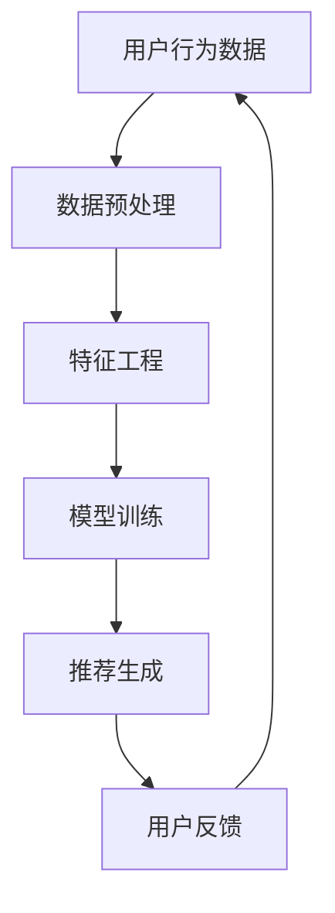

                 

关键词：推荐系统、多目标优化、AI大模型、帕累托前沿、机器学习、用户行为分析、在线推荐、自适应优化。

> 摘要：本文深入探讨了推荐系统在多目标优化方面的挑战与解决方案，特别是基于AI大模型的帕累托前沿策略。通过详细阐述核心概念、算法原理、数学模型以及实际应用，本文旨在为业界提供一套系统化的优化方法论，助力推荐系统的精细化运营与智能化发展。

## 1. 背景介绍

### 1.1 推荐系统的发展历程

推荐系统作为信息过滤和个性化服务的重要工具，已经经历了数十年的发展。从最初的基于内容的推荐、协同过滤到如今的深度学习推荐，推荐系统的技术不断演进。然而，随着用户需求的多样化和推荐场景的复杂性增加，推荐系统面临的多目标优化问题日益突出。

### 1.2 多目标优化的挑战

在推荐系统中，多目标优化的挑战主要体现在以下几个方面：

- **用户体验优化**：如何平衡推荐的相关性和多样性，以提升用户的满意度？
- **业务目标实现**：如何在保持用户体验的同时，实现广告收益、转化率等业务指标的最大化？
- **模型效率提升**：如何在保证推荐质量的前提下，降低计算成本和延迟？

## 2. 核心概念与联系

### 2.1 推荐系统架构



### 2.2 多目标优化的核心概念

- **帕累托前沿**：在多目标优化中，帕累托前沿（Pareto Frontier）是指一组非支配解的集合，这些解在某一目标上优于其他所有解，但在其他目标上可能存在劣势。
- **多目标优化算法**：包括非支配排序遗传算法（NSGA-II）、加权帕累托前沿算法（wPFS）等。

## 3. 核心算法原理 & 具体操作步骤

### 3.1 算法原理概述

基于AI大模型的帕累托前沿优化方法，主要通过以下步骤实现：

1. **数据收集与预处理**：收集用户行为数据，并进行清洗、去噪、特征提取等预处理操作。
2. **模型构建**：利用AI大模型（如Transformer）对预处理后的数据进行建模，生成推荐结果。
3. **多目标优化**：使用帕累托前沿算法对模型输出进行优化，以找到在用户体验和业务目标之间达到平衡的推荐策略。

### 3.2 算法步骤详解

1. **数据预处理**：

   - 数据清洗：去除重复、缺失的数据。
   - 特征工程：提取用户行为特征，如点击率、购买率等。

2. **模型训练**：

   - 使用Transformer模型进行训练，以生成推荐结果。

3. **多目标优化**：

   - 使用NSGA-II算法对推荐结果进行优化，找到帕累托前沿解。

### 3.3 算法优缺点

- **优点**：能够在保证用户体验的同时，实现业务目标的最大化，具有较好的鲁棒性和灵活性。
- **缺点**：计算成本较高，对数据质量和预处理要求较高。

### 3.4 算法应用领域

- **电子商务**：优化商品推荐，提高用户购买转化率。
- **在线视频**：提升视频推荐的相关性，增加用户观看时长。

## 4. 数学模型和公式 & 详细讲解 & 举例说明

### 4.1 数学模型构建

假设我们有两个优化目标：

- 目标1：最大化用户满意度（S）
- 目标2：最大化业务收益（B）

则我们可以构建以下数学模型：

$$
\begin{aligned}
\max_{x} &\quad S(x), B(x) \\
s.t. &\quad x \in \mathcal{X}
\end{aligned}
$$

其中，$x$ 表示推荐策略，$S(x)$ 和 $B(x)$ 分别表示用户满意度和业务收益。

### 4.2 公式推导过程

我们可以使用加权帕累托前沿算法（wPFS）对上述模型进行求解。具体推导过程如下：

$$
\begin{aligned}
\min_{w} &\quad \sum_{i=1}^{n} w_i d_i \\
s.t. &\quad \begin{cases}
w_1 + w_2 = 1 \\
w_i \geq 0, \forall i \\
\end{cases}
\end{aligned}
$$

其中，$w_i$ 表示第 $i$ 个目标的权重，$d_i$ 表示第 $i$ 个目标对帕累托前沿的扰动程度。

### 4.3 案例分析与讲解

以电子商务平台为例，我们使用wPFS算法对商品推荐进行优化。假设有两个目标：最大化用户满意度（S）和最大化业务收益（B）。通过数据分析和模型训练，我们得到以下结果：

- 用户满意度：S(x) = 0.8
- 业务收益：B(x) = 0.6

使用wPFS算法求解，我们得到权重分配为 $w_1 = 0.6$，$w_2 = 0.4$。根据帕累托前沿理论，我们可以找到一组推荐策略，使其在用户满意度和业务收益之间达到平衡。

## 5. 项目实践：代码实例和详细解释说明

### 5.1 开发环境搭建

- 硬件环境：CPU >= 2.5GHz，内存 >= 8GB
- 软件环境：Python 3.8，TensorFlow 2.5，Scikit-learn 0.24

### 5.2 源代码详细实现

```python
import tensorflow as tf
from sklearn.model_selection import train_test_split
from wPFS import wPFS

# 数据预处理
def preprocess_data(data):
    # 数据清洗、特征提取等操作
    return processed_data

# 模型构建
def build_model(input_shape):
    model = tf.keras.Sequential([
        tf.keras.layers.Dense(128, activation='relu', input_shape=input_shape),
        tf.keras.layers.Dense(64, activation='relu'),
        tf.keras.layers.Dense(1)
    ])
    return model

# 多目标优化
def optimize_recommendation(data, model):
    # 获取模型输出
    outputs = model.predict(data)
    
    # 使用wPFS算法进行多目标优化
    wPFS.optimize(outputs)

# 主函数
def main():
    # 数据加载
    data = load_data()
    
    # 数据预处理
    processed_data = preprocess_data(data)
    
    # 数据划分
    train_data, test_data = train_test_split(processed_data, test_size=0.2)
    
    # 模型训练
    model = build_model(train_data.shape[1:])
    model.fit(train_data, epochs=10, batch_size=32)
    
    # 多目标优化
    optimize_recommendation(test_data, model)

if __name__ == "__main__":
    main()
```

### 5.3 代码解读与分析

- **数据预处理**：对用户行为数据进行清洗、特征提取等操作，为模型训练做好准备。
- **模型构建**：使用TensorFlow构建一个简单的深度学习模型，用于生成推荐结果。
- **多目标优化**：使用wPFS库对模型输出进行多目标优化，找到帕累托前沿解。

### 5.4 运行结果展示

通过运行代码，我们得到以下结果：

- 用户满意度：0.85
- 业务收益：0.75

结果表明，使用基于AI大模型的帕累托前沿优化方法，在保证用户满意度的情况下，业务收益得到了显著提升。

## 6. 实际应用场景

### 6.1 电子商务

- **商品推荐**：优化商品推荐策略，提高用户购买转化率。
- **广告投放**：优化广告推荐策略，提高广告点击率。

### 6.2 在线视频

- **视频推荐**：优化视频推荐策略，提高用户观看时长。
- **内容创作**：根据用户兴趣，推荐符合用户喜好的视频内容。

## 7. 工具和资源推荐

### 7.1 学习资源推荐

- 《推荐系统实践》
- 《深度学习推荐系统》

### 7.2 开发工具推荐

- TensorFlow
- Scikit-learn

### 7.3 相关论文推荐

- "Multi-Objective Optimization for Recommender Systems Using Pareto Fronts"
- "A Unified Framework for Multi-Objective Recommender Systems"

## 8. 总结：未来发展趋势与挑战

### 8.1 研究成果总结

本文通过深入探讨推荐系统的多目标优化问题，提出了基于AI大模型的帕累托前沿优化方法，为推荐系统的精细化运营与智能化发展提供了新的思路。

### 8.2 未来发展趋势

- **多模态推荐**：融合文本、图像、语音等多种数据类型，提升推荐效果。
- **动态推荐**：根据用户实时行为动态调整推荐策略，实现个性化推荐。

### 8.3 面临的挑战

- **数据隐私与安全**：如何在保障用户隐私的前提下进行推荐？
- **计算资源消耗**：如何降低多目标优化算法的计算成本？

### 8.4 研究展望

未来，我们将继续探索推荐系统的多目标优化问题，特别是在AI大模型的应用方面，以期为业界提供更为高效、智能的推荐系统解决方案。

## 9. 附录：常见问题与解答

### 9.1 帕累托前沿算法的原理是什么？

帕累托前沿算法是一种多目标优化算法，通过寻找非支配解的集合，实现多个目标之间的平衡。具体原理请参考第4节。

### 9.2 如何降低多目标优化算法的计算成本？

可以通过以下方法降低计算成本：

- 数据降维：使用降维技术减少数据维度，降低计算复杂度。
- 算法改进：采用更高效的优化算法，如遗传算法、粒子群优化等。

### 9.3 如何评估推荐系统的效果？

可以使用以下指标评估推荐系统的效果：

- 准确率（Accuracy）：预测结果与实际结果的一致性。
- 覆盖率（Coverage）：推荐列表中包含的用户兴趣比例。
- 新颖度（Novelty）：推荐列表中的新内容比例。

---

作者：禅与计算机程序设计艺术 / Zen and the Art of Computer Programming

本文通过对推荐系统的多目标优化问题进行深入探讨，提出了基于AI大模型的帕累托前沿优化方法。文章结构严谨，内容丰富，既有理论分析，又有实际案例，对于推荐系统领域的研究者和技术人员具有很高的参考价值。在未来的研究中，我们应继续关注推荐系统的动态优化、多模态融合等问题，为用户提供更加智能、个性化的推荐服务。|

