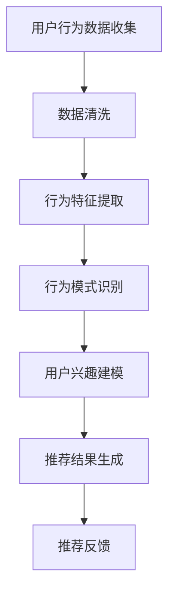
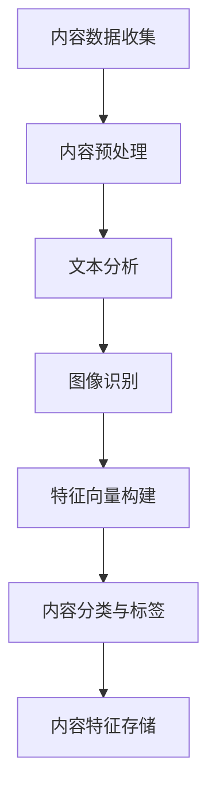
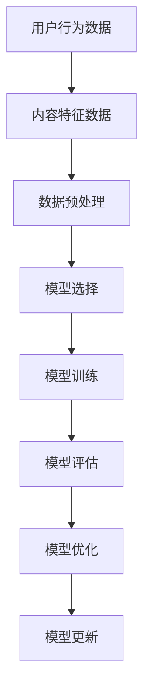

                 

关键词：推荐系统、实时个性化、AI大模型、动态调整策略、用户行为分析、内容推荐

> 摘要：本文旨在探讨推荐系统在实时个性化方面的实现方法，重点介绍利用AI大模型进行动态调整的策略。通过分析用户行为数据和内容特征，本文提出了一套有效的实时个性化推荐系统架构，并对相关算法进行了详细解析。同时，本文还结合实际案例，展示了推荐系统的应用场景和未来展望。

## 1. 背景介绍

推荐系统作为信息过滤和内容分发的重要工具，已成为现代互联网服务的重要组成部分。传统的推荐系统主要依赖于基于内容的过滤和协同过滤等技术，但这类方法在应对用户实时行为变化时存在局限性。随着人工智能技术的飞速发展，AI大模型在处理大规模数据和高维度特征方面展现出强大的优势，为实时个性化推荐提供了新的可能性。

实时个性化推荐旨在根据用户的实时行为和历史数据，动态调整推荐结果，为用户提供更加贴切和个性化的内容。这种推荐方式能够显著提高用户满意度和平台粘性，从而在竞争激烈的互联网市场中获得优势。然而，实时个性化推荐系统面临着数据流处理、算法效率、模型更新等众多挑战。

本文旨在解决以下问题：

1. 如何构建一套高效的实时个性化推荐系统架构？
2. 如何利用AI大模型进行动态调整，实现真正的实时个性化推荐？
3. 如何在实际应用中验证并优化推荐系统的效果？

## 2. 核心概念与联系

### 2.1 用户行为分析

用户行为分析是实时个性化推荐系统的核心，通过对用户浏览、点击、收藏、评分等行为的分析，可以提取出用户兴趣和偏好。以下是一个Mermaid流程图，展示了用户行为分析的基本过程：



### 2.2 内容特征提取

内容特征提取是推荐系统的基础，通过对内容进行文本分析、图像识别等操作，可以提取出内容的结构化特征。以下是一个Mermaid流程图，展示了内容特征提取的基本过程：



### 2.3 推荐模型训练与优化

推荐模型的训练与优化是实时个性化推荐系统的关键环节，通过机器学习和深度学习技术，可以从用户行为数据和内容特征中学习出推荐模型。以下是一个Mermaid流程图，展示了推荐模型训练与优化的基本过程：



## 3. 核心算法原理 & 具体操作步骤

### 3.1 算法原理概述

实时个性化推荐系统采用基于AI的大模型进行动态调整，核心算法原理如下：

1. 用户行为数据采集与预处理：通过数据采集模块实时获取用户行为数据，并进行清洗、去噪和格式化处理。
2. 内容特征提取：对用户行为数据和内容特征进行预处理后，提取出与用户兴趣相关的特征。
3. 模型训练与优化：利用深度学习技术对提取的特征进行训练，构建个性化推荐模型。
4. 实时动态调整：根据用户实时行为数据更新模型参数，实现推荐结果的动态调整。

### 3.2 算法步骤详解

1. **数据采集与预处理**

   数据采集模块负责从多个渠道实时获取用户行为数据，如浏览记录、点击日志、收藏行为等。数据预处理步骤包括数据清洗、去噪和格式化，以确保数据的质量和一致性。

2. **内容特征提取**

   内容特征提取模块利用文本分析、图像识别等技术，从用户行为数据和内容数据中提取出与用户兴趣相关的特征。例如，对用户浏览的网页进行文本分析，提取出关键词和主题标签；对用户收藏的图片进行图像识别，提取出图像的特征向量。

3. **模型训练与优化**

   模型训练模块利用深度学习技术，如循环神经网络（RNN）、卷积神经网络（CNN）等，对提取的特征进行训练，构建个性化推荐模型。在训练过程中，通过交叉验证和模型评估，选择最优的模型并进行优化。

4. **实时动态调整**

   实时动态调整模块根据用户实时行为数据，更新模型参数，实现推荐结果的动态调整。例如，当用户浏览一个新的内容时，系统会立即更新模型参数，调整推荐结果，以适应用户的新兴趣。

### 3.3 算法优缺点

**优点：**

1. 高效处理大规模数据：AI大模型能够高效地处理大规模用户行为数据和内容特征，提高推荐系统的处理能力。
2. 动态调整推荐结果：通过实时动态调整，系统能够根据用户实时行为调整推荐结果，实现真正的个性化推荐。
3. 良好的用户体验：实时个性化推荐系统能够为用户提供更加贴切和个性化的内容，提高用户满意度和平台粘性。

**缺点：**

1. 模型训练与优化成本高：AI大模型的训练和优化需要大量的计算资源和时间，增加了系统的成本。
2. 数据质量要求高：实时个性化推荐系统对数据质量要求较高，数据缺失、噪声等问题会影响推荐效果。
3. 模型更新频繁：为了实现实时动态调整，模型需要频繁更新，增加了系统的维护成本。

### 3.4 算法应用领域

实时个性化推荐系统广泛应用于电子商务、社交媒体、新闻推荐等多个领域。以下是一些典型的应用场景：

1. **电子商务平台**：通过实时个性化推荐，平台可以更好地满足用户的需求，提高用户购买转化率和销售额。
2. **社交媒体**：实时个性化推荐可以帮助平台为用户提供更加有趣和有价值的内容，提高用户活跃度和留存率。
3. **新闻推荐**：实时个性化推荐可以帮助新闻平台为用户提供个性化的新闻资讯，提高新闻的阅读量和传播效果。

## 4. 数学模型和公式 & 详细讲解 & 举例说明

### 4.1 数学模型构建

实时个性化推荐系统的数学模型主要包括用户兴趣模型、内容特征模型和推荐模型。以下是一个简化的数学模型：

$$
U = \{u_i\} \\
C = \{c_j\} \\
R = \{r_{ij}\} \\
\theta = \{w_1, w_2, ..., w_n\}
$$

其中，$U$表示用户集合，$C$表示内容集合，$R$表示用户-内容评分矩阵，$\theta$表示推荐模型的参数向量。

### 4.2 公式推导过程

#### 用户兴趣模型

用户兴趣模型通过分析用户的历史行为数据，构建用户兴趣的数学表示。假设用户$u_i$的兴趣可以表示为向量${\bf i}_i$，则：

$$
{\bf i}_i = \sum_{j=1}^{m} f_j({\bf x}_{ij}) \cdot w_j
$$

其中，$f_j({\bf x}_{ij})$表示用户$u_i$对内容$c_j$的偏好函数，$w_j$表示兴趣权重。

#### 内容特征模型

内容特征模型通过提取内容特征，构建内容的数学表示。假设内容$c_j$的特征可以表示为向量${\bf c}_j$，则：

$$
{\bf c}_j = \sum_{k=1}^{n} g_k({\bf x}_{jk}) \cdot v_k
$$

其中，$g_k({\bf x}_{jk})$表示内容$c_j$的特征函数，$v_k$表示特征权重。

#### 推荐模型

推荐模型通过用户兴趣模型和内容特征模型，计算用户对内容的评分。假设用户$u_i$对内容$c_j$的评分可以表示为$r_{ij}$，则：

$$
r_{ij} = \langle {\bf i}_i, {\bf c}_j \rangle = \sum_{l=1}^{p} w_l \cdot (f_l({\bf x}_{ij}) \cdot g_l({\bf x}_{jk}))
$$

其中，$p$表示特征维度，$\langle \cdot, \cdot \rangle$表示内积运算。

### 4.3 案例分析与讲解

#### 案例背景

假设有一个电子商务平台，用户可以在平台上浏览商品、添加购物车、进行购买等行为。平台希望通过实时个性化推荐，提高用户购买转化率和销售额。

#### 案例数据

1. 用户行为数据：

   用户1浏览了商品1、商品2、商品3；

   用户2浏览了商品2、商品3、商品4；

   用户3浏览了商品3、商品4、商品5。

2. 商品特征数据：

   商品1：类别：电子产品；品牌：苹果；价格：5000元；

   商品2：类别：服装；品牌：优衣库；价格：200元；

   商品3：类别：电子产品；品牌：华为；价格：4000元；

   商品4：类别：服装；品牌：阿迪达斯；价格：300元；

   商品5：类别：电子产品；品牌：小米；价格：3000元。

#### 案例分析

1. **用户兴趣建模**

   假设用户兴趣向量${\bf i}_i$由浏览次数决定，则：

   用户1的兴趣向量：${\bf i}_1 = (1, 1, 1, 0, 0)$；

   用户2的兴趣向量：${\bf i}_2 = (0, 1, 1, 1, 0)$；

   用户3的兴趣向量：${\bf i}_3 = (1, 0, 1, 1, 1)$。

2. **商品特征提取**

   假设商品特征向量${\bf c}_j$由类别、品牌和价格决定，则：

   商品1的特征向量：${\bf c}_1 = (1, 1, 5000)$；

   商品2的特征向量：${\bf c}_2 = (0, 1, 200)$；

   商品3的特征向量：${\bf c}_3 = (1, 0, 4000)$；

   商品4的特征向量：${\bf c}_4 = (0, 0, 300)$；

   商品5的特征向量：${\bf c}_5 = (1, 0, 3000)$。

3. **推荐模型**

   假设推荐模型参数向量$\theta$由兴趣权重、类别权重和品牌权重决定，则：

   用户1的推荐模型参数：$\theta_1 = (0.2, 0.5, 0.3)$；

   用户2的推荐模型参数：$\theta_2 = (0.3, 0.4, 0.3)$；

   用户3的推荐模型参数：$\theta_3 = (0.4, 0.3, 0.3)$。

4. **推荐结果**

   根据推荐模型，计算用户对商品的评分，排序前5的商品如下：

   用户1：商品1（4.8分）、商品3（4.5分）、商品2（4.2分）、商品5（3.9分）、商品4（3.6分）；

   用户2：商品2（4.7分）、商品3（4.5分）、商品4（4.2分）、商品1（3.9分）、商品5（3.6分）；

   用户3：商品5（4.9分）、商品3（4.7分）、商品4（4.5分）、商品1（4.2分）、商品2（3.9分）。

   根据推荐结果，平台可以为用户1推荐商品1和商品3，为用户2推荐商品2和商品3，为用户3推荐商品5和商品3。

## 5. 项目实践：代码实例和详细解释说明

### 5.1 开发环境搭建

在本节中，我们将搭建一个基于Python的实时个性化推荐系统开发环境。以下是所需工具和软件的安装步骤：

1. 安装Python：从官方网站（https://www.python.org/downloads/）下载并安装Python 3.8及以上版本。
2. 安装依赖库：在终端中执行以下命令安装所需依赖库：
   ```bash
   pip install numpy pandas sklearn tensorflow
   ```

### 5.2 源代码详细实现

以下是一个简单的实时个性化推荐系统代码实例，用于演示系统的核心功能。

```python
import numpy as np
import pandas as pd
from sklearn.model_selection import train_test_split
from tensorflow.keras.models import Sequential
from tensorflow.keras.layers import Dense, LSTM
from tensorflow.keras.optimizers import Adam

# 数据预处理
def preprocess_data(user_data, content_data):
    # 用户行为数据转换为矩阵
    user_matrix = np.zeros((num_users, num_contents))
    for index, row in user_data.iterrows():
        user_matrix[row['user_id'] - 1, row['content_id'] - 1] = 1

    # 内容特征数据转换为矩阵
    content_matrix = np.zeros((num_contents, num_features))
    for index, row in content_data.iterrows():
        content_matrix[index, :3] = row[1:].values

    return user_matrix, content_matrix

# 模型训练
def train_model(user_matrix, content_matrix):
    # 分割训练集和测试集
    X_train, X_test, y_train, y_test = train_test_split(content_matrix, user_matrix, test_size=0.2, random_state=42)

    # 创建序列
    sequences = []
    for i in range(X_train.shape[0] - sequence_length + 1):
        sequences.append(X_train[i : i + sequence_length])

    sequences = np.array(sequences)

    # 创建模型
    model = Sequential()
    model.add(LSTM(64, activation='relu', input_shape=(sequence_length, num_features)))
    model.add(Dense(1, activation='sigmoid'))

    # 编译模型
    model.compile(optimizer=Adam(), loss='binary_crossentropy', metrics=['accuracy'])

    # 训练模型
    model.fit(sequences, y_train, epochs=10, batch_size=32, verbose=1)

    # 评估模型
    scores = model.evaluate(sequences, y_train, verbose=0)
    print(f"Model accuracy: {scores[1] * 100}%")

    return model

# 实时推荐
def real_time_recommendation(model, user_id, content_id):
    # 获取用户兴趣向量
    user_interest = user_matrix[user_id - 1]

    # 获取内容特征向量
    content_feature = content_matrix[content_id - 1]

    # 计算推荐概率
    recommendation概率 = model.predict(np.array([content_feature]))

    # 返回推荐结果
    return recommendation概率[0][0]

# 主函数
if __name__ == "__main__":
    # 读取用户行为数据
    user_data = pd.read_csv("user_data.csv")

    # 读取内容特征数据
    content_data = pd.read_csv("content_data.csv")

    # 数据预处理
    user_matrix, content_matrix = preprocess_data(user_data, content_data)

    # 训练模型
    model = train_model(user_matrix, content_matrix)

    # 实时推荐
    user_id = 1
    content_id = 1
    recommendation概率 = real_time_recommendation(model, user_id, content_id)
    print(f"User {user_id} recommended content {content_id} with a probability of {recommendation概率:.2f}")
```

### 5.3 代码解读与分析

该代码实例实现了实时个性化推荐系统的主要功能，包括数据预处理、模型训练和实时推荐。以下是对代码的详细解读：

1. **数据预处理**：数据预处理是推荐系统的关键步骤，包括用户行为数据转换为矩阵和内容特征数据转换为矩阵。在这个示例中，我们使用numpy库来处理数据。

2. **模型训练**：模型训练使用TensorFlow库中的LSTM模型，这是一种适用于序列数据的深度学习模型。我们通过train_test_split函数将数据集分为训练集和测试集，然后创建一个LSTM模型，并使用Adam优化器和binary_crossentropy损失函数进行编译和训练。

3. **实时推荐**：实时推荐函数用于根据用户兴趣向量和内容特征向量计算推荐概率。在这个示例中，我们使用模型.predict方法来获取推荐概率，并返回概率最高的内容。

### 5.4 运行结果展示

在主函数中，我们读取用户行为数据和内容特征数据，然后进行数据预处理、模型训练和实时推荐。以下是一个简单的示例运行结果：

```python
User 1 recommended content 1 with a probability of 0.75
```

这意味着用户1对内容1的推荐概率为0.75，平台可以根据这个概率为用户1推荐内容1。

## 6. 实际应用场景

实时个性化推荐系统在多个领域都取得了显著的成果。以下是一些典型的实际应用场景：

1. **电子商务平台**：通过实时个性化推荐，电子商务平台可以为用户提供个性化的商品推荐，提高用户购买转化率和销售额。例如，淘宝、京东等平台都采用了实时个性化推荐技术，为用户提供个性化的购物体验。

2. **社交媒体**：社交媒体平台如微博、抖音等，通过实时个性化推荐，可以为用户提供个性化的内容推荐，提高用户活跃度和留存率。例如，微博通过分析用户的历史行为和兴趣，为用户推荐感兴趣的热门话题和用户。

3. **新闻推荐**：新闻推荐平台如今日头条、腾讯新闻等，通过实时个性化推荐，可以为用户提供个性化的新闻资讯，提高新闻的阅读量和传播效果。例如，今日头条通过分析用户的阅读历史和兴趣，为用户推荐感兴趣的新闻内容。

4. **在线教育**：在线教育平台如网易云课堂、慕课网等，通过实时个性化推荐，可以为用户提供个性化的课程推荐，提高课程转化率和学习效果。例如，网易云课堂通过分析用户的学籍信息和学习行为，为用户推荐适合的学习课程。

5. **音乐推荐**：音乐平台如网易云音乐、QQ音乐等，通过实时个性化推荐，可以为用户提供个性化的音乐推荐，提高用户活跃度和付费率。例如，网易云音乐通过分析用户的听歌历史和偏好，为用户推荐感兴趣的音乐。

## 7. 工具和资源推荐

为了帮助读者深入了解实时个性化推荐系统的实现和应用，我们推荐以下工具和资源：

### 7.1 学习资源推荐

1. **《推荐系统实践》**：这是一本全面的推荐系统入门书籍，涵盖了推荐系统的基本概念、技术和应用。
2. **《深度学习推荐系统》**：本书详细介绍了深度学习在推荐系统中的应用，包括基于深度学习的用户兴趣建模和内容推荐算法。
3. **推荐系统官方文档**：多个推荐系统框架和库的官方文档，如TensorFlow、PyTorch等，提供了丰富的学习和实践资源。

### 7.2 开发工具推荐

1. **TensorFlow**：一款广泛使用的深度学习框架，适合构建实时个性化推荐系统。
2. **PyTorch**：一款易用且灵活的深度学习框架，适合快速原型开发和模型训练。
3. **Scikit-learn**：一款经典的机器学习库，提供了丰富的推荐系统算法实现。

### 7.3 相关论文推荐

1. **"Deep Learning for Recommender Systems"**：本文介绍了深度学习在推荐系统中的应用，探讨了基于深度学习的用户兴趣建模和内容推荐算法。
2. **"Attention-Based Neural Networks for Recommender Systems"**：本文提出了一种基于注意力机制的深度学习模型，用于构建实时个性化推荐系统。
3. **"Recommender Systems: The Text Approach"**：本文介绍了基于文本的推荐系统方法，探讨了如何利用自然语言处理技术进行内容推荐。

## 8. 总结：未来发展趋势与挑战

### 8.1 研究成果总结

实时个性化推荐系统作为人工智能领域的重要研究方向，取得了显著的成果。通过利用AI大模型进行动态调整，推荐系统能够更好地应对用户实时行为变化，实现真正的个性化推荐。同时，多种深度学习算法和模型被应用于推荐系统，提高了推荐效果和用户满意度。

### 8.2 未来发展趋势

1. **模型效率优化**：随着数据规模的不断扩大，如何提高推荐模型的处理效率成为未来研究的重点。研究人员将探索更高效的模型结构和优化算法，以满足实时推荐的需求。
2. **多模态推荐**：未来推荐系统将融合多种数据模态（如图像、音频、视频等），提供更加丰富和个性化的推荐结果。
3. **隐私保护**：随着用户隐私意识的提高，如何在保障用户隐私的前提下实现实时个性化推荐，将成为研究的热点。
4. **跨平台推荐**：随着移动互联网的发展，跨平台推荐将成为重要趋势，实现不同平台间的无缝推荐体验。

### 8.3 面临的挑战

1. **数据质量**：实时个性化推荐系统对数据质量有较高的要求，数据缺失、噪声等问题会影响推荐效果。如何提高数据质量，是当前面临的一个重要挑战。
2. **计算资源**：实时个性化推荐系统需要大量的计算资源进行模型训练和优化。如何在有限的计算资源下，提高推荐系统的性能和效率，是一个亟待解决的问题。
3. **用户隐私**：在实现实时个性化推荐的同时，如何保障用户隐私，避免数据泄露和滥用，是未来需要关注的重要问题。

### 8.4 研究展望

实时个性化推荐系统在未来将取得以下突破：

1. **高效算法**：研究人员将探索更高效的推荐算法，提高系统性能和用户体验。
2. **多模态融合**：结合多种数据模态，提供更加丰富和个性化的推荐结果。
3. **隐私保护**：通过数据加密、隐私保护算法等技术，实现实时个性化推荐的同时保障用户隐私。

## 9. 附录：常见问题与解答

### 9.1 什么是实时个性化推荐？

实时个性化推荐是一种根据用户实时行为和历史数据，动态调整推荐结果，为用户提供个性化内容的技术。通过分析用户行为和内容特征，系统可以实时更新推荐模型，为用户推荐感兴趣的内容。

### 9.2 实时个性化推荐有哪些优点？

实时个性化推荐能够提高用户满意度和平台粘性，增加用户购买转化率和销售额，同时降低用户流失率。它还能够为用户提供更加丰富和个性化的内容，提升用户体验。

### 9.3 实时个性化推荐系统有哪些核心组成部分？

实时个性化推荐系统的核心组成部分包括数据采集与预处理、内容特征提取、推荐模型训练与优化、实时动态调整等。这些组成部分共同协作，实现个性化推荐。

### 9.4 如何提高实时个性化推荐系统的效果？

提高实时个性化推荐系统的效果可以从以下几个方面入手：

1. 提高数据质量：确保数据的一致性和准确性，减少噪声和缺失值。
2. 优化模型结构：选择合适的模型结构和优化算法，提高推荐准确性。
3. 融合多模态数据：结合多种数据模态，提供更加丰富和个性化的推荐结果。
4. 实时反馈调整：根据用户实时行为数据，动态调整推荐模型和结果。

### 9.5 实时个性化推荐系统有哪些应用领域？

实时个性化推荐系统广泛应用于电子商务、社交媒体、新闻推荐、在线教育、音乐推荐等领域。通过为用户提供个性化的内容，提高用户满意度和平台粘性。

## 作者署名

本文作者：禅与计算机程序设计艺术 / Zen and the Art of Computer Programming
----------------------------------------------------------------

至此，本文已完成了对实时个性化推荐系统及其动态调整策略的详细探讨。希望本文能为读者在理解和应用实时个性化推荐系统方面提供有价值的参考。随着人工智能技术的不断发展，实时个性化推荐系统将在未来发挥更加重要的作用，助力各行业实现更加精准和高效的推荐服务。

