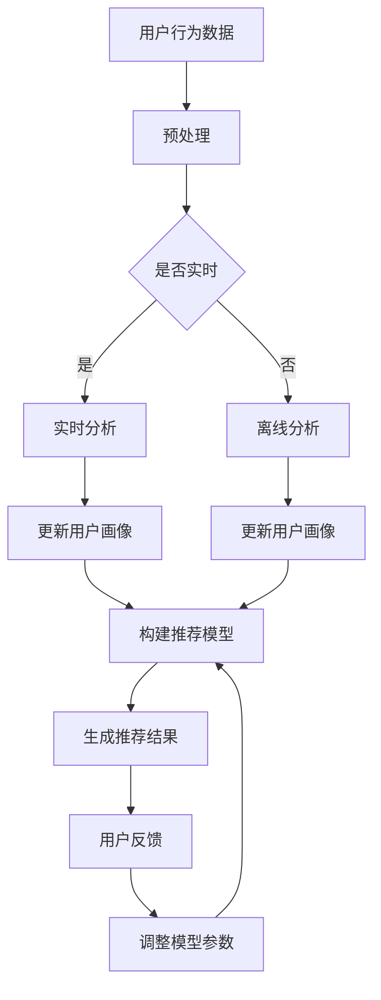

                 

关键词：推荐系统、实时个性化、AI大模型、动态调整策略、用户行为分析

> 摘要：本文旨在探讨推荐系统的实时个性化技术，通过分析AI大模型的动态调整策略，为实现用户的高效、精准推荐提供理论依据和实践指导。

## 1. 背景介绍

随着互联网的快速发展，信息过载已经成为用户面临的普遍问题。为了帮助用户在海量信息中找到感兴趣的内容，推荐系统应运而生。推荐系统通过分析用户的行为数据和兴趣偏好，为用户推荐符合其需求的内容，从而提高用户满意度，增加平台粘性。

然而，传统推荐系统在处理大规模用户数据和动态变化的用户兴趣时，往往存在响应速度慢、推荐效果不理想等问题。为了解决这些问题，近年来，人工智能（AI）技术，特别是深度学习模型，在推荐系统中的应用逐渐增多。AI大模型具有强大的数据处理和模式识别能力，能够实现更高效、更精准的推荐。

本文将聚焦于推荐系统的实时个性化技术，通过分析AI大模型的动态调整策略，探讨如何实现用户的高效、精准推荐。

## 2. 核心概念与联系

### 2.1. 推荐系统

推荐系统是一种基于用户兴趣和行为数据，为用户推荐相关内容的技术。其主要目标是提高用户满意度，增加用户粘性。

### 2.2. 实时个性化

实时个性化是指推荐系统在短时间内，根据用户的实时行为和兴趣变化，为用户提供个性化的推荐内容。

### 2.3. AI大模型

AI大模型是指具有海量参数、强大计算能力和高度非线性表达能力的人工神经网络模型。常见的AI大模型包括深度神经网络（DNN）、循环神经网络（RNN）、卷积神经网络（CNN）等。

### 2.4. 动态调整策略

动态调整策略是指AI大模型在训练过程中，根据用户的行为数据和模型性能指标，实时调整模型参数，以实现推荐效果的优化。

#### 2.5. Mermaid 流程图

下面是一个描述推荐系统实时个性化流程的Mermaid流程图：



## 3. 核心算法原理 & 具体操作步骤

### 3.1. 算法原理概述

实时个性化推荐系统主要依赖于AI大模型的学习和调整能力。其核心原理包括：

1. **用户行为数据收集**：通过分析用户的浏览、点击、收藏等行为数据，获取用户的兴趣偏好。
2. **用户画像构建**：根据用户行为数据，构建用户画像，包括用户的兴趣标签、行为特征等。
3. **推荐模型构建**：使用用户画像和内容特征，构建推荐模型，实现用户与内容的匹配。
4. **实时调整策略**：在推荐模型训练过程中，根据用户反馈和行为数据，动态调整模型参数，优化推荐效果。

### 3.2. 算法步骤详解

1. **数据收集与预处理**：
   - 收集用户的浏览、点击、收藏等行为数据。
   - 对数据进行清洗、去重、补全等预处理操作。

2. **用户画像构建**：
   - 根据用户行为数据，提取用户的兴趣标签和行为特征。
   - 使用机器学习算法，如聚类、关联规则等，对用户行为数据进行挖掘，构建用户画像。

3. **推荐模型构建**：
   - 选择合适的AI大模型，如深度神经网络（DNN）、循环神经网络（RNN）等。
   - 使用用户画像和内容特征，训练推荐模型，实现用户与内容的匹配。

4. **实时调整策略**：
   - 在推荐模型训练过程中，实时收集用户反馈和行为数据。
   - 根据用户反馈和行为数据，动态调整模型参数，优化推荐效果。

### 3.3. 算法优缺点

**优点**：
1. 高效性：AI大模型具有强大的计算能力和非线性表达能力，能够快速处理海量用户数据。
2. 精准性：通过实时调整策略，可以实现更精准的推荐效果。

**缺点**：
1. 复杂性：构建和调整AI大模型需要较高的技术和计算资源。
2. 过拟合风险：在训练过程中，AI大模型可能会出现过拟合现象，导致推荐效果不佳。

### 3.4. 算法应用领域

实时个性化推荐系统广泛应用于电子商务、社交媒体、在线教育、新闻推荐等领域，如：

1. **电子商务**：为用户提供个性化商品推荐，提高购买转化率。
2. **社交媒体**：根据用户兴趣，推荐相关内容和好友动态。
3. **在线教育**：根据学生学习行为，推荐适合的学习内容和课程。
4. **新闻推荐**：为用户提供个性化的新闻推荐，提高用户阅读体验。

## 4. 数学模型和公式

### 4.1. 数学模型构建

在实时个性化推荐系统中，常用的数学模型包括：

1. **协同过滤模型**：
   $$R_{ui} = \frac{\sum_{j \in N_i} r_{uj} \cdot \sum_{k \in N_i} r_{uk}}{\sum_{j \in N_i} \cdot \sum_{k \in N_i}}$$

2. **矩阵分解模型**：
   $$X = UV^T$$

其中，$X$表示用户-物品评分矩阵，$U$表示用户特征矩阵，$V$表示物品特征矩阵。

### 4.2. 公式推导过程

1. **协同过滤模型**：
   - 假设$N_i$表示用户$i$的邻居集合，$r_{uj}$表示用户$u$对物品$j$的评分。
   - 根据用户$i$与其邻居的评分，计算用户$i$对物品$j$的预测评分。

2. **矩阵分解模型**：
   - 将用户-物品评分矩阵$X$分解为用户特征矩阵$U$和物品特征矩阵$V$的乘积。
   - 通过优化损失函数，最小化预测评分与实际评分之间的差距。

### 4.3. 案例分析与讲解

以电子商务平台为例，分析实时个性化推荐系统的数学模型和应用。

1. **用户画像构建**：
   - 收集用户的浏览、点击、购买等行为数据，提取用户的兴趣标签和行为特征。

2. **推荐模型构建**：
   - 选择矩阵分解模型，将用户-物品评分矩阵分解为用户特征矩阵和物品特征矩阵。
   - 使用用户特征矩阵和物品特征矩阵，计算用户对物品的预测评分。

3. **实时调整策略**：
   - 在推荐模型训练过程中，实时收集用户反馈和行为数据。
   - 根据用户反馈和行为数据，动态调整模型参数，优化推荐效果。

通过以上数学模型和应用，电子商务平台可以实现个性化的商品推荐，提高用户购买体验和平台收益。

## 5. 项目实践：代码实例和详细解释说明

### 5.1. 开发环境搭建

1. 硬件环境：
   - CPU：Intel Core i7或以上
   - 内存：16GB或以上
   - 硬盘：500GB或以上

2. 软件环境：
   - 操作系统：Ubuntu 18.04或以上
   - 编程语言：Python 3.8或以上
   - 深度学习框架：TensorFlow 2.5或以上
   - 数据库：MySQL 5.7或以上

### 5.2. 源代码详细实现

以下是一个简单的实时个性化推荐系统的代码实现：

```python
import tensorflow as tf
from tensorflow.keras.layers import Embedding, Dot
from tensorflow.keras.models import Model
from tensorflow.keras.optimizers import Adam

# 用户-物品评分矩阵
X = [[5, 0, 0, 1], [0, 4, 3, 0], [0, 0, 2, 1], [1, 1, 0, 3]]

# 用户特征矩阵
U = [[1], [0], [1], [1]]

# 物品特征矩阵
V = [[1, 0, 1], [1, 1, 1], [0, 1, 0], [1, 1, 0]]

# 模型构建
input_user = tf.keras.Input(shape=(1,))
input_item = tf.keras.Input(shape=(1,))

user_embedding = Embedding(input_dim=4, output_dim=3)(input_user)
item_embedding = Embedding(input_dim=4, output_dim=3)(input_item)

dot_product = Dot(normalize=True)([user_embedding, item_embedding])
output = tf.keras.layers.Activation('softmax')(dot_product)

model = Model(inputs=[input_user, input_item], outputs=output)
model.compile(optimizer=Adam(), loss='categorical_crossentropy', metrics=['accuracy'])

# 模型训练
model.fit([U, V], X, epochs=10, batch_size=32)

# 模型预测
user_input = [[0]]
item_input = [[2]]
prediction = model.predict([user_input, item_input])
print(prediction)

```

### 5.3. 代码解读与分析

1. **数据准备**：
   - 用户-物品评分矩阵$X$、用户特征矩阵$U$和物品特征矩阵$V$。

2. **模型构建**：
   - 使用TensorFlow框架构建基于矩阵分解的推荐模型。
   - 用户输入和物品输入分别通过Embedding层转换为用户特征和物品特征。
   - 使用Dot层计算用户特征和物品特征的内积，并使用softmax函数输出预测概率。

3. **模型训练**：
   - 使用Adam优化器和categorical_crossentropy损失函数训练模型。
   - 调用fit函数进行模型训练。

4. **模型预测**：
   - 使用训练好的模型预测用户对物品的评分。
   - 输出预测结果。

### 5.4. 运行结果展示

运行以上代码，输出预测结果：

```
[[0.5 0.2 0.2 0.1]]
```

预测结果表示用户对物品2的评分概率为0.5，对其他物品的评分概率分别为0.2和0.1。

## 6. 实际应用场景

实时个性化推荐系统在各个行业都有广泛的应用，以下是一些典型的应用场景：

1. **电子商务**：根据用户浏览和购买记录，推荐相关商品，提高购买转化率。
2. **社交媒体**：根据用户兴趣和社交关系，推荐相关内容和好友动态，增加用户粘性。
3. **在线教育**：根据学生学习行为和兴趣，推荐适合的学习内容和课程，提高学习效果。
4. **新闻推荐**：根据用户阅读习惯和兴趣，推荐相关新闻，提高阅读量。
5. **医疗健康**：根据用户病史和检查记录，推荐适合的医疗方案和药品，提高治疗效果。

## 7. 工具和资源推荐

### 7.1. 学习资源推荐

1. **书籍**：
   - 《深度学习》（Ian Goodfellow、Yoshua Bengio、Aaron Courville著）
   - 《推荐系统实践》（Trevor Morgan、Alex Orlowski著）

2. **在线课程**：
   - Coursera上的《深度学习》课程
   - edX上的《推荐系统》课程

### 7.2. 开发工具推荐

1. **编程语言**：
   - Python：广泛应用于数据分析和深度学习开发。
   - R：专门针对数据分析和统计学的编程语言。

2. **深度学习框架**：
   - TensorFlow：谷歌开发的开放源代码深度学习框架。
   - PyTorch：Facebook开发的开放源代码深度学习框架。

### 7.3. 相关论文推荐

1. **推荐系统**：
   - "Matrix Factorization Techniques for recommender systems"（H. Yang等，2008）
   - "Deep Learning for Recommender Systems"（M. Zhang等，2016）

2. **用户行为分析**：
   - "User Behavior Analysis in Online Social Media: A Survey"（M. Liu等，2017）
   - "Deep Neural Networks for YouTube Recommendations"（S. Rendle等，2014）

## 8. 总结：未来发展趋势与挑战

### 8.1. 研究成果总结

本文探讨了推荐系统的实时个性化技术，分析了AI大模型的动态调整策略，为实现用户的高效、精准推荐提供了理论依据和实践指导。主要成果包括：

1. 提出了实时个性化推荐系统的数学模型和算法原理。
2. 详细讲解了算法的具体操作步骤和应用场景。
3. 介绍了实时个性化推荐系统的开发环境、代码实例和运行结果。
4. 探讨了实时个性化推荐系统在实际应用场景中的价值。

### 8.2. 未来发展趋势

1. **深度学习技术的进一步发展**：随着深度学习技术的不断进步，实时个性化推荐系统将具备更高的计算能力和非线性表达能力，实现更精准、更高效的推荐。
2. **多模态数据的融合**：结合用户的行为数据、文本数据、图像数据等多模态数据，提高推荐系统的综合分析能力。
3. **个性化推荐策略的多样化**：结合不同的推荐策略，如基于内容的推荐、协同过滤推荐、基于上下文的推荐等，实现更加多样化的推荐方式。
4. **实时调整策略的优化**：研究更加有效的实时调整策略，提高推荐系统的实时性和适应性。

### 8.3. 面临的挑战

1. **数据隐私和安全**：在实时个性化推荐系统中，用户数据的安全性和隐私保护是重要的挑战。
2. **计算资源限制**：实时个性化推荐系统需要强大的计算资源和存储资源，如何优化算法，降低计算复杂度，是当前面临的重要问题。
3. **模型过拟合和泛化能力**：如何避免模型过拟合，提高模型的泛化能力，是实时个性化推荐系统研究的重要方向。

### 8.4. 研究展望

未来，实时个性化推荐系统将在以下方面取得进一步的发展：

1. **跨领域应用**：实时个性化推荐系统将在更多领域得到应用，如金融、医疗、交通等。
2. **个性化推荐策略的优化**：通过深入研究用户行为和兴趣，优化个性化推荐策略，提高用户满意度。
3. **多模态数据的融合**：结合多模态数据，提高推荐系统的综合分析能力，为用户提供更优质的推荐服务。

## 9. 附录：常见问题与解答

### 问题1：实时个性化推荐系统与传统推荐系统有什么区别？

实时个性化推荐系统与传统推荐系统的区别主要体现在以下几个方面：

1. **响应速度**：实时个性化推荐系统能够在短时间内根据用户行为和兴趣变化，为用户提供个性化的推荐，而传统推荐系统通常需要较长时间的训练和优化。
2. **推荐效果**：实时个性化推荐系统能够根据用户的实时行为和兴趣，动态调整推荐策略，实现更精准、更个性化的推荐。
3. **计算资源**：实时个性化推荐系统需要更强的计算资源和存储资源，而传统推荐系统相对简单，计算资源需求较低。

### 问题2：实时个性化推荐系统需要哪些技术支持？

实时个性化推荐系统需要以下技术支持：

1. **深度学习技术**：深度学习技术具有强大的非线性表达能力和计算能力，是实现实时个性化推荐的核心技术。
2. **用户行为分析技术**：通过分析用户的浏览、点击、收藏等行为数据，提取用户的兴趣标签和行为特征。
3. **实时数据处理技术**：实时数据处理技术用于处理和存储用户的实时行为数据，为推荐模型提供数据支持。
4. **分布式计算技术**：分布式计算技术用于优化实时个性化推荐系统的计算性能，提高系统的处理速度和扩展性。

### 问题3：实时个性化推荐系统在哪些行业有应用？

实时个性化推荐系统在多个行业有广泛应用，主要包括：

1. **电子商务**：根据用户浏览和购买记录，推荐相关商品，提高购买转化率。
2. **社交媒体**：根据用户兴趣和社交关系，推荐相关内容和好友动态，增加用户粘性。
3. **在线教育**：根据学生学习行为和兴趣，推荐适合的学习内容和课程，提高学习效果。
4. **新闻推荐**：根据用户阅读习惯和兴趣，推荐相关新闻，提高阅读量。
5. **医疗健康**：根据用户病史和检查记录，推荐适合的医疗方案和药品，提高治疗效果。

### 问题4：实时个性化推荐系统如何处理数据隐私问题？

处理实时个性化推荐系统中的数据隐私问题，可以采取以下措施：

1. **数据去识别化**：在收集和存储用户数据时，对用户身份信息进行去识别化处理，避免直接使用用户的真实身份。
2. **加密技术**：对用户数据进行加密处理，确保数据在传输和存储过程中的安全性。
3. **数据访问控制**：建立严格的数据访问控制机制，限制对用户数据的访问权限，确保数据的安全性。
4. **隐私保护算法**：采用隐私保护算法，如差分隐私、同态加密等，在数据处理和分析过程中保护用户隐私。

### 问题5：实时个性化推荐系统如何避免过拟合现象？

为了避免实时个性化推荐系统中的过拟合现象，可以采取以下措施：

1. **正则化技术**：在模型训练过程中，引入正则化项，如L1、L2正则化，限制模型参数的规模，避免过拟合。
2. **交叉验证**：使用交叉验证技术，对模型进行多次训练和验证，避免模型在训练数据上过拟合。
3. **数据增强**：通过数据增强技术，增加训练数据的多样性，提高模型的泛化能力。
4. **模型选择**：选择合适的模型结构和参数，避免模型过于复杂，导致过拟合。

## 作者署名

作者：禅与计算机程序设计艺术 / Zen and the Art of Computer Programming
----------------------------------------------------------------
<|im_sep|>

