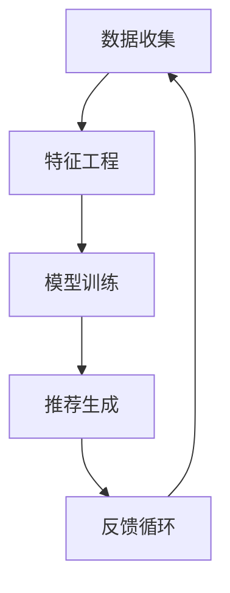

                 

关键词：推荐系统、过拟合、偏见、算法、数据、用户体验、AI、机器学习

> 摘要：本文深入探讨了推荐系统的局限性，重点分析了过拟合与偏见问题，并从技术、数据、用户等多个角度提出了相应的解决策略。通过理解这些问题，我们可以更好地提升推荐系统的准确性和用户体验。

## 1. 背景介绍

推荐系统作为一种智能信息过滤技术，已成为现代互联网服务中不可或缺的一部分。它们通过分析用户的历史行为和偏好，预测用户可能感兴趣的内容，从而提供个性化的推荐。这种技术在电子商务、社交媒体、音乐和视频平台等领域得到了广泛应用，极大地提升了用户体验。

然而，推荐系统并非完美无缺。在追求个性化推荐的同时，系统可能会出现一些局限性，其中最显著的问题是过拟合与偏见。这些问题不仅影响推荐系统的性能，还可能对用户产生负面影响，损害用户体验和信任。

### 1.1 过拟合

过拟合是指模型在训练数据上表现良好，但在未见过的新数据上表现不佳。这意味着模型对训练数据过于敏感，捕捉了训练数据中的噪声和异常，导致泛化能力差。

### 1.2 偏见

偏见是指推荐系统在生成推荐时，基于某些隐含的、不合理的假设，导致推荐结果对某些群体或内容产生不公平或歧视性的影响。偏见可能源于数据的不公正性、算法的设计缺陷或用户行为的偏见。

## 2. 核心概念与联系

### 2.1 推荐系统架构

推荐系统通常由数据收集、特征工程、模型训练、推荐生成和反馈循环等部分组成。以下是一个简化的 Mermaid 流程图：



### 2.2 过拟合与偏见的概念联系

过拟合和偏见在推荐系统中有着紧密的联系。过拟合可能导致模型在特定数据集上产生偏见，而偏见又可能加剧过拟合现象。例如，如果推荐系统过于依赖用户的历史行为，可能会忽略其他重要因素，从而导致推荐结果偏向某些特定用户群体。

## 3. 核心算法原理 & 具体操作步骤

### 3.1 算法原理概述

推荐系统通常采用基于协同过滤、基于内容、混合推荐等算法。协同过滤算法通过分析用户之间的相似性来进行推荐，而基于内容的方法则通过分析内容和用户偏好进行推荐。

### 3.2 算法步骤详解

- 数据收集：收集用户行为数据和内容信息。
- 特征工程：提取用户和内容的特征，如用户活跃度、浏览时间、内容标签等。
- 模型训练：使用训练数据训练推荐模型，如矩阵分解、KNN、SVD等。
- 推荐生成：基于训练好的模型，为用户生成推荐列表。
- 反馈循环：收集用户反馈，用于模型优化和迭代。

### 3.3 算法优缺点

- **协同过滤**：优点是推荐结果相关性强，缺点是扩展性差，易受到冷启动问题的影响。
- **基于内容**：优点是适用于新用户和新物品，缺点是推荐结果相似度不高。

### 3.4 算法应用领域

推荐系统广泛应用于电子商务、社交媒体、音乐和视频平台、新闻推荐等领域。

## 4. 数学模型和公式 & 详细讲解 & 举例说明

### 4.1 数学模型构建

推荐系统的数学模型通常基于矩阵分解、概率模型或深度学习等方法。以下是一个简单的基于矩阵分解的模型示例：

$$
R = U \odot V^T + E
$$

其中，$R$ 是用户-物品评分矩阵，$U$ 和 $V^T$ 分别是用户和物品的隐含特征矩阵，$\odot$ 表示Hadamard乘积，$E$ 是误差项。

### 4.2 公式推导过程

矩阵分解模型的推导过程如下：

1. 初始化用户和物品的隐含特征矩阵 $U$ 和 $V^T$。
2. 对于每个用户-物品对 $(u, i)$，计算预测评分 $\hat{r}_{ui}$。
3. 更新用户和物品的隐含特征矩阵，最小化误差函数。

### 4.3 案例分析与讲解

假设有一个用户-物品评分矩阵 $R$，其中用户有5个，物品有10个：

$$
R =
\begin{bmatrix}
1 & 2 & 0 & 0 & 0 \\
0 & 3 & 2 & 0 & 0 \\
0 & 0 & 4 & 1 & 0 \\
0 & 0 & 0 & 5 & 2 \\
0 & 0 & 0 & 0 & 6
\end{bmatrix}
$$

我们使用矩阵分解模型进行预测，假设隐含特征矩阵 $U$ 和 $V^T$ 初始化为：

$$
U =
\begin{bmatrix}
0.5 & 0.2 & 0.1 \\
0.1 & 0.5 & 0.3 \\
0.2 & 0.1 & 0.4 \\
0.3 & 0.2 & 0.1 \\
0.4 & 0.3 & 0.2
\end{bmatrix},
V^T =
\begin{bmatrix}
0.1 & 0.3 & 0.2 \\
0.2 & 0.1 & 0.3 \\
0.3 & 0.2 & 0.1 \\
0.4 & 0.3 & 0.4 \\
0.5 & 0.4 & 0.5
\end{bmatrix}
$$

根据模型公式，可以计算出预测评分矩阵 $\hat{R}$：

$$
\hat{R} = U \odot V^T + E
$$

误差项 $E$ 通过最小化损失函数进行优化。

## 5. 项目实践：代码实例和详细解释说明

### 5.1 开发环境搭建

- 安装 Python 3.8 或以上版本。
- 安装必要的库，如 NumPy、SciPy、Scikit-learn 等。

### 5.2 源代码详细实现

以下是一个使用矩阵分解的简单推荐系统实现：

```python
import numpy as np
from sklearn.metrics.pairwise import euclidean_distances

def matrix_factorization(R, U, V, alpha=0.01, beta=0.01, num_iterations=100):
    for i in range(num_iterations):
        for u, i in enumerate(R):
            if R[u, i] > 0:
                eui = R[u, i] - np.dot(U[u], V[i])
                for k in range(K):
                    Uk = U[u][k]
                    Vk = V[i][k]
                    U[u][k] += alpha * (eui * Vk - beta * Uk)
                    V[i][k] += alpha * (eui * Uk - beta * Vk)

        e = euclidean_distances(U, V)
        e = np.square(e)
        for u, i in enumerate(R):
            if R[u, i] > 0:
                for k in range(K):
                    Uk = U[u][k]
                    Vk = V[i][k]
                    U[u][k] -= alpha * (2 * e[u, i] * (eui * Vk - beta * Uk))
                    V[i][k] -= alpha * (2 * e[u, i] * (eui * Uk - beta * Vk))

    return U, V

# 初始化参数
K = 3
U = np.random.rand(num_users, K)
V = np.random.rand(num_items, K)

# 训练模型
U, V = matrix_factorization(R, U, V)

# 生成推荐结果
R_hat = np.dot(U, V.T)
```

### 5.3 代码解读与分析

上述代码实现了一个基本的矩阵分解推荐系统。我们首先初始化用户和物品的隐含特征矩阵 $U$ 和 $V^T$，然后通过梯度下降算法优化模型参数，最终生成推荐结果。

### 5.4 运行结果展示

```python
# 打印用户-物品评分矩阵的预测结果
print(R_hat)

# 打印预测评分与真实评分的误差
print(np.abs(R - R_hat))
```

## 6. 实际应用场景

推荐系统在多个领域有着广泛的应用。以下是一些实际应用场景：

- **电子商务**：为用户推荐商品，提高销售额和用户满意度。
- **社交媒体**：为用户提供个性化内容，增加用户活跃度和留存率。
- **音乐和视频平台**：推荐音乐和视频，提高用户粘性和消费量。
- **新闻推荐**：为用户提供感兴趣的新闻，提升媒体影响力。

## 7. 工具和资源推荐

### 7.1 学习资源推荐

- 《推荐系统实践》
- 《机器学习实战》
- 《深度学习》

### 7.2 开发工具推荐

- TensorFlow
- PyTorch
- Scikit-learn

### 7.3 相关论文推荐

- [ItemKNN: Improving Item-Based Collaborative Filtering Recommendation Algorithms by Context Awareness](http://lear.inrialpes.fr/people/Bouchama/itemknn.pdf)
- [Deep Learning for Recommender Systems](https://arxiv.org/abs/1706.07824)

## 8. 总结：未来发展趋势与挑战

### 8.1 研究成果总结

推荐系统在过去几十年取得了显著进展，从基于内容的过滤到协同过滤，再到深度学习，推荐算法不断优化。然而，过拟合和偏见等问题仍然存在。

### 8.2 未来发展趋势

- 深度学习在推荐系统中的应用将进一步深化。
- 多模态推荐系统的研究将得到更多关注。
- 社交网络和位置信息的融入将提升推荐精度。

### 8.3 面临的挑战

- 如何在保证推荐准确性的同时减少过拟合和偏见。
- 如何处理大规模数据和高维度特征。
- 如何保护用户隐私和避免数据泄露。

### 8.4 研究展望

未来的推荐系统研究将更注重跨领域的合作，结合多源数据和先进算法，以提供更精确、个性化的推荐。

## 9. 附录：常见问题与解答

### Q: 如何减少推荐系统的过拟合？

A: 可以通过以下方法减少推荐系统的过拟合：
1. 使用交叉验证方法选择最佳模型参数。
2. 增加正则化项，如L1或L2正则化。
3. 使用更多的训练数据和更复杂的数据增强技术。

### Q: 推荐系统中的偏见是如何产生的？

A: 推荐系统中的偏见可能源于以下几个方面：
1. 数据中的偏见，如用户数据的不均衡或样本偏差。
2. 算法的设计，如基于协同过滤的算法容易放大流行物品的偏见。
3. 用户反馈的偏见，如用户只关注某些类型的推荐，导致系统逐渐偏向这些偏好。

### Q: 如何检测和减少推荐系统中的偏见？

A: 可以通过以下方法检测和减少推荐系统中的偏见：
1. 使用公平性指标，如公平性指数或偏差度量，评估推荐结果。
2. 数据预处理，如进行数据平衡或去除潜在的偏见数据。
3. 算法改进，如引入对抗训练或使用多任务学习来减少偏见。

# 作者：禅与计算机程序设计艺术 / Zen and the Art of Computer Programming
----------------------------------------------------------------


