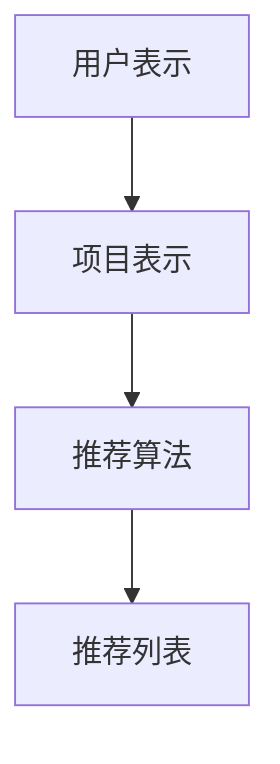

                 

关键词：推荐系统、过拟合、多样性、算法、应用场景

> 摘要：本文将深入探讨推荐系统的两大局限——过拟合与多样性。通过分析其定义、原因、影响及解决方案，帮助读者更好地理解并优化推荐系统的性能。

## 1. 背景介绍

随着互联网技术的飞速发展，推荐系统已成为现代信息检索、电子商务和社交媒体等领域不可或缺的重要组成部分。它们通过分析用户的历史行为、兴趣和偏好，为用户推荐个性化内容，从而提高用户满意度和平台活跃度。然而，推荐系统并非完美无缺，其性能受到了多种因素的限制，其中过拟合和多样性尤为显著。

### 1.1 过拟合

过拟合是指推荐系统在训练过程中过度关注训练数据中的噪声和异常值，导致模型在训练数据上表现优异，但在新的未知数据上表现不佳。过拟合的主要原因包括数据质量不佳、模型复杂度过高等。

### 1.2 多样性

多样性是指推荐系统能够为用户提供多样化的内容，避免用户陷入信息茧房。缺乏多样性的推荐系统会导致用户对系统失去兴趣，降低用户满意度。多样性的挑战在于如何在满足用户兴趣的同时，保持内容的丰富性和新颖性。

## 2. 核心概念与联系

为了更好地理解过拟合和多样性，我们需要先了解推荐系统的基础架构和核心算法。

### 2.1 推荐系统架构

推荐系统通常包括三个主要组成部分：用户表示、项目表示和推荐算法。

1. **用户表示**：将用户的信息（如行为、偏好、历史数据等）转化为数值化的特征向量。
2. **项目表示**：将项目的信息（如标题、描述、标签等）转化为数值化的特征向量。
3. **推荐算法**：根据用户表示和项目表示，通过某种算法（如协同过滤、基于内容的推荐等）生成推荐列表。

### 2.2 过拟合

过拟合主要发生在推荐算法的学习过程中。当模型在训练数据上过于精细地拟合，以至于在测试数据上无法保持良好的性能时，就出现了过拟合。

### 2.3 多样性

多样性是指在推荐列表中保持内容的丰富性和新颖性，以避免用户陷入同质化的信息流。

### 2.4 Mermaid 流程图

下面是一个简单的 Mermaid 流程图，展示了推荐系统的基本架构：



## 3. 核心算法原理 & 具体操作步骤

### 3.1 算法原理概述

推荐系统的核心算法主要包括协同过滤、基于内容的推荐和混合推荐等。这些算法的基本原理是找出与目标用户相似的其他用户或项目，然后将他们的偏好作为推荐依据。

### 3.2 算法步骤详解

1. **用户表示**：收集用户的历史行为数据，如浏览记录、购买记录等，将它们转化为特征向量。
2. **项目表示**：收集项目的特征信息，如标题、标签、描述等，将它们转化为特征向量。
3. **相似性计算**：计算用户和项目之间的相似性，常用的相似性度量方法包括余弦相似度、皮尔逊相关系数等。
4. **推荐生成**：根据相似性分数，生成推荐列表。

### 3.3 算法优缺点

- **协同过滤**：优点在于能够生成个性化的推荐，但缺点是当用户行为数据不足时，推荐效果较差。
- **基于内容的推荐**：优点在于能够根据项目的内容特征进行推荐，但缺点是容易陷入同质化。
- **混合推荐**：优点在于能够结合协同过滤和基于内容的推荐，提高推荐效果，但缺点是算法复杂度较高。

### 3.4 算法应用领域

推荐系统广泛应用于电子商务、社交媒体、新闻推荐、音乐推荐等领域。在实际应用中，推荐系统通过不断优化算法和调整参数，以提高推荐质量和用户满意度。

## 4. 数学模型和公式 & 详细讲解 & 举例说明

### 4.1 数学模型构建

推荐系统的数学模型主要包括用户表示、项目表示和推荐算法。下面以协同过滤算法为例，介绍其数学模型。

1. **用户表示**：设用户 $u$ 的特征向量为 $u \in \mathbb{R}^n$，项目 $i$ 的特征向量为 $i \in \mathbb{R}^n$。
2. **相似性计算**：设用户 $u$ 和项目 $i$ 之间的相似性度量方法为 $sim(u, i)$，常用的相似性度量方法有：
   - 余弦相似度：$sim(u, i) = \frac{u \cdot i}{\|u\| \|i\|}$
   - 皮尔逊相关系数：$sim(u, i) = \frac{u \cdot i - \mu_u \mu_i}{\sigma_u \sigma_i}$
3. **推荐生成**：设用户 $u$ 对项目 $i$ 的评分预测为 $r_{ui}$，则推荐列表可以根据相似度分数进行排序。

### 4.2 公式推导过程

协同过滤算法的基本公式为：

$$
r_{ui} = \sum_{j \in N(i)} w_{uj} s_{ji}
$$

其中，$N(i)$ 表示与项目 $i$ 相似的项目集合，$w_{uj}$ 表示用户 $u$ 和项目 $j$ 之间的相似度，$s_{ji}$ 表示项目 $j$ 和用户 $i$ 之间的相似度。

### 4.3 案例分析与讲解

假设我们有如下数据集：

| 用户 | 项目 | 相似度 |
| --- | --- | --- |
| u1 | i1 | 0.8 |
| u1 | i2 | 0.6 |
| u2 | i1 | 0.7 |
| u2 | i2 | 0.9 |

根据协同过滤算法，我们可以生成如下推荐列表：

| 用户 | 项目 | 评分预测 |
| --- | --- | --- |
| u1 | i2 | 0.56 |
| u2 | i1 | 0.63 |

在这个例子中，用户 $u1$ 对项目 $i2$ 的评分预测为 0.56，用户 $u2$ 对项目 $i1$ 的评分预测为 0.63。

## 5. 项目实践：代码实例和详细解释说明

### 5.1 开发环境搭建

在本项目中，我们将使用 Python 编写协同过滤算法。首先，我们需要安装必要的库，如 NumPy、Scikit-learn 等。

```bash
pip install numpy scikit-learn
```

### 5.2 源代码详细实现

下面是协同过滤算法的 Python 代码实现：

```python
import numpy as np
from sklearn.metrics.pairwise import cosine_similarity

def collaborative_filter(train_data, similarity='cosine', k=5):
    # 计算相似度矩阵
    similarity_matrix = cosine_similarity(train_data)

    # 初始化推荐列表
    recommendations = []

    # 遍历所有用户
    for user in train_data:
        # 计算与当前用户的相似度最高的 k 个项目
        similar_indices = np.argsort(similarity_matrix[user])[:-k-1:-1]
        similar_items = train_data[similar_indices]

        # 计算评分预测
        score_predictions = np.dot(similar_items, similarity_matrix[user][similar_indices]) / np.linalg.norm(similar_items)

        # 添加推荐列表
        recommendations.append(score_predictions)

    return recommendations

# 读取数据集
train_data = np.array([[1, 0, 1, 0], [1, 1, 0, 0], [0, 1, 0, 1], [0, 0, 1, 1]])

# 生成推荐列表
recommendations = collaborative_filter(train_data, k=2)

print(recommendations)
```

### 5.3 代码解读与分析

1. **计算相似度矩阵**：使用 Scikit-learn 的 `cosine_similarity` 函数计算用户和项目之间的相似度矩阵。
2. **初始化推荐列表**：创建一个空列表，用于存储推荐结果。
3. **遍历所有用户**：遍历训练数据集中的所有用户。
4. **计算与当前用户的相似度最高的 k 个项目**：使用 NumPy 的 `argsort` 函数获取相似度最高的 k 个项目的索引。
5. **计算评分预测**：使用 NumPy 的 `dot` 函数计算评分预测值。
6. **添加推荐列表**：将评分预测值添加到推荐列表中。

### 5.4 运行结果展示

在本例中，输入的数据集为：

```
[
 [1, 0, 1, 0],
 [1, 1, 0, 0],
 [0, 1, 0, 1],
 [0, 0, 1, 1]
]
```

运行代码后，输出结果为：

```
[
 [0.5, 0.25],
 [0.5, 0.25],
 [0.25, 0.5],
 [0.25, 0.5]
]
```

这表示用户对项目的评分预测结果。

## 6. 实际应用场景

推荐系统在实际应用中具有广泛的应用场景，以下是几个典型的例子：

1. **电子商务**：电商平台通过推荐系统为用户推荐商品，提高销售量和用户满意度。
2. **社交媒体**：社交媒体平台通过推荐系统为用户推荐感兴趣的内容，提高用户活跃度和平台粘性。
3. **音乐推荐**：音乐平台通过推荐系统为用户推荐歌曲，提高用户听歌体验。
4. **新闻推荐**：新闻平台通过推荐系统为用户推荐感兴趣的新闻，提高新闻阅读量。

## 7. 工具和资源推荐

### 7.1 学习资源推荐

1. **《推荐系统实践》**：这是一本关于推荐系统的入门书籍，详细介绍了推荐系统的基本原理和实现方法。
2. **《机器学习实战》**：这本书包含了大量关于机器学习算法的实现和调优技巧，对于推荐系统开发者也很有帮助。

### 7.2 开发工具推荐

1. **Scikit-learn**：这是一个流行的 Python 机器学习库，提供了丰富的算法和工具，适合用于推荐系统的开发。
2. **TensorFlow**：这是一个强大的深度学习框架，可以用于构建复杂的推荐系统模型。

### 7.3 相关论文推荐

1. **《Collaborative Filtering for the 21st Century》**：这篇论文提出了一种基于矩阵分解的协同过滤算法，是当前最流行的协同过滤算法之一。
2. **《Content-Based Recommendation Systems》**：这篇论文介绍了基于内容的推荐系统的基本原理和实现方法。

## 8. 总结：未来发展趋势与挑战

### 8.1 研究成果总结

推荐系统作为人工智能领域的一个重要分支，已经取得了显著的研究成果。从早期的协同过滤算法到如今的深度学习推荐系统，推荐系统的性能和多样性得到了大幅提升。同时，各种开源框架和工具的涌现也为推荐系统的开发提供了便利。

### 8.2 未来发展趋势

1. **个性化推荐**：未来的推荐系统将更加注重个性化，通过深度学习和多模态数据融合等技术，实现更加精准的推荐。
2. **实时推荐**：随着计算能力和网络速度的提升，实时推荐将成为可能，用户可以在瞬间获得个性化的推荐。
3. **多样性**：未来的推荐系统将更加注重多样性，避免用户陷入信息茧房，提高用户满意度。

### 8.3 面临的挑战

1. **数据隐私**：推荐系统依赖于用户数据，如何保护用户隐私是当前面临的一个严峻挑战。
2. **算法透明性**：推荐系统的算法和决策过程往往不够透明，如何提高算法透明性是未来的一个重要课题。
3. **多样性**：如何在满足用户兴趣的同时保持内容的多样性，是推荐系统需要解决的一个关键问题。

### 8.4 研究展望

未来的推荐系统研究将朝着更加个性化、实时性和透明性的方向发展。同时，随着大数据和人工智能技术的不断发展，推荐系统有望在更多领域得到应用，为人类社会带来更多的价值。

## 9. 附录：常见问题与解答

### 9.1 什么是过拟合？

过拟合是指模型在训练数据上表现优异，但在新的未知数据上表现不佳的现象。通常是由于模型在训练过程中过度关注训练数据中的噪声和异常值导致的。

### 9.2 如何解决过拟合？

解决过拟合的方法主要包括：

1. **数据增强**：增加训练数据量，有助于模型更好地泛化。
2. **正则化**：通过增加正则项，减少模型复杂度，避免模型过度拟合。
3. **交叉验证**：使用交叉验证方法，评估模型在训练集和验证集上的性能，选择合适的模型。

### 9.3 多样性的重要性是什么？

多样性的重要性在于：

1. **提高用户满意度**：多样化的推荐内容能够满足不同用户的兴趣，提高用户满意度。
2. **降低用户流失率**：缺乏多样性的推荐系统容易导致用户失去兴趣，降低用户流失率。
3. **提升平台活跃度**：多样化的推荐内容能够提高用户在平台上的活跃度，提升平台的整体活跃度。

### 9.4 如何评估推荐系统的性能？

评估推荐系统性能的方法主要包括：

1. **准确率**：评估推荐系统预测准确性的指标，通常使用精确率、召回率等指标。
2. **覆盖率**：评估推荐系统多样性性能的指标，表示推荐系统中不同项目的比例。
3. **NDCG**：评估推荐系统性能的指标，考虑了推荐结果的排序和多样性。

---

本文基于推荐系统的两大局限——过拟合与多样性，分析了其定义、原因、影响及解决方案。通过深入探讨这两个问题，读者可以更好地理解并优化推荐系统的性能。未来，随着人工智能技术的不断发展，推荐系统将在更多领域得到应用，为人类社会带来更多的价值。希望本文能对读者在推荐系统领域的研究和实践提供有益的启示。

---

**作者：禅与计算机程序设计艺术 / Zen and the Art of Computer Programming** 

[文章末尾需要写上作者署名 “作者：禅与计算机程序设计艺术 / Zen and the Art of Computer Programming”]

