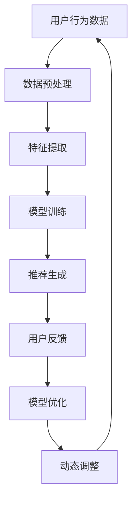

                 

关键词：推荐系统，时效性，动态调整，AI大模型，个性化推荐，机器学习，算法优化，用户行为分析

## 摘要

本文旨在探讨推荐系统的时效性问题，特别是在大规模人工智能（AI）模型的背景下，如何动态调整推荐策略以保持系统的高效性和用户满意度。随着用户数据量的不断增长和用户行为的多样化，传统静态的推荐方法逐渐显露出其局限性。本文将深入分析推荐系统的核心概念，探讨时序数据的处理方法，并介绍一种基于AI大模型的动态调整策略，通过具体案例解析其实施过程和效果。

## 1. 背景介绍

### 推荐系统的现状

推荐系统作为一种智能信息过滤技术，广泛应用于电子商务、社交媒体、在线视频平台等领域。传统的推荐系统主要基于协同过滤、基于内容的推荐和混合推荐等方法。然而，随着用户需求的多样化和大数据技术的发展，这些方法在时效性和个性化方面面临着巨大挑战。尤其是在面对大规模数据和实时更新时，推荐系统的性能和适应性成为一个亟待解决的问题。

### 时效性的重要性

时效性是推荐系统的一个关键指标，它直接影响到用户的满意度。一个高效的推荐系统能够及时捕捉到用户兴趣的变化，提供最新的、符合用户当前兴趣的内容或商品。相反，如果推荐系统过于滞后，可能导致用户流失，降低平台的粘性和用户忠诚度。因此，提高推荐系统的时效性是提升用户体验和平台竞争力的重要手段。

### AI大模型的发展

近年来，AI大模型（如深度学习模型、神经网络模型等）在推荐系统中的应用逐渐增多。这些大模型具有强大的特征提取和预测能力，能够处理复杂的时序数据和非线性关系。然而，大模型的训练和部署成本较高，如何有效地利用这些模型来提升推荐系统的时效性，是当前研究的一个热点。

## 2. 核心概念与联系

### 推荐系统的基本概念

- **用户行为数据**：包括用户的浏览记录、购买历史、评论等。
- **内容特征**：指推荐系统中推荐的对象（如商品、文章、视频等）的特征信息。
- **推荐算法**：用于计算用户兴趣和内容相似性的算法，如协同过滤、基于内容的推荐等。

### 时效性的核心挑战

- **数据时效性**：用户行为数据的时效性直接影响到推荐结果的准确性。
- **模型时效性**：推荐模型需要不断更新和优化，以适应用户兴趣的变化。

### AI大模型与时效性的关系

- **数据预处理**：AI大模型对数据的预处理要求较高，需要处理时序数据中的噪声和异常值。
- **动态调整**：AI大模型具有强大的自适应能力，可以通过实时调整模型参数来提高推荐系统的时效性。

### Mermaid 流程图



## 3. 核心算法原理 & 具体操作步骤

### 3.1 算法原理概述

本文采用基于AI大模型的动态调整策略，通过以下步骤实现推荐系统的时效性提升：

1. **数据预处理**：对用户行为数据进行清洗和归一化处理，去除噪声和异常值。
2. **特征提取**：利用深度学习模型提取用户和内容的特征向量。
3. **模型训练**：通过训练数据训练推荐模型，包括用户兴趣模型和内容相似性模型。
4. **推荐生成**：根据用户兴趣模型和内容相似性模型生成推荐结果。
5. **用户反馈**：收集用户对推荐结果的行为反馈，如点击、购买、评论等。
6. **模型优化**：根据用户反馈调整模型参数，优化推荐效果。
7. **动态调整**：实时监控用户兴趣变化，动态调整推荐策略。

### 3.2 算法步骤详解

#### 3.2.1 数据预处理

数据预处理是推荐系统的基础，主要包括以下步骤：

- **去噪**：去除数据中的噪声和异常值，如用户无效行为数据、缺失值等。
- **归一化**：将不同特征的数据进行归一化处理，使其具有相同的量纲。
- **特征提取**：对用户行为数据进行编码，如将文本数据转化为词向量。

#### 3.2.2 特征提取

特征提取是深度学习模型的关键，通过以下方法实现：

- **用户特征提取**：利用神经网络提取用户的历史行为特征，如浏览记录、购买记录等。
- **内容特征提取**：利用卷积神经网络（CNN）或循环神经网络（RNN）提取内容的特征，如文本、图片等。

#### 3.2.3 模型训练

模型训练包括用户兴趣模型和内容相似性模型：

- **用户兴趣模型**：通过训练用户行为数据和内容特征，预测用户对某类内容的兴趣程度。
- **内容相似性模型**：通过训练内容特征，计算内容之间的相似性，用于生成推荐列表。

#### 3.2.4 推荐生成

推荐生成是基于用户兴趣模型和内容相似性模型，生成推荐列表：

- **兴趣预测**：根据用户兴趣模型预测用户对各类内容的兴趣程度。
- **相似性计算**：根据内容相似性模型计算用户未浏览内容之间的相似性。
- **推荐列表生成**：根据兴趣预测和相似性计算，生成个性化的推荐列表。

#### 3.2.5 用户反馈

用户反馈是优化推荐系统的关键，主要包括以下步骤：

- **行为记录**：记录用户对推荐结果的行为，如点击、购买、评论等。
- **反馈分析**：分析用户行为，识别用户兴趣变化和推荐效果。

#### 3.2.6 模型优化

模型优化包括以下步骤：

- **参数调整**：根据用户反馈调整模型参数，优化推荐效果。
- **模型更新**：定期更新模型，以适应用户兴趣的变化。

#### 3.2.7 动态调整

动态调整包括以下步骤：

- **实时监控**：实时监控用户行为，捕捉用户兴趣变化。
- **策略调整**：根据用户兴趣变化，动态调整推荐策略。

### 3.3 算法优缺点

#### 优点

- **高效性**：基于深度学习模型，具有强大的特征提取和预测能力。
- **灵活性**：可以通过动态调整策略，实时适应用户兴趣变化。
- **个性化**：能够根据用户行为和内容特征，提供个性化的推荐结果。

#### 缺点

- **计算成本**：深度学习模型训练和部署成本较高。
- **数据需求**：需要大量高质量的用户行为数据。

### 3.4 算法应用领域

基于AI大模型的动态调整策略适用于多种推荐系统应用场景，如：

- **电子商务**：个性化商品推荐。
- **在线视频**：个性化视频推荐。
- **社交媒体**：个性化内容推荐。
- **搜索引擎**：实时搜索结果优化。

## 4. 数学模型和公式 & 详细讲解 & 举例说明

### 4.1 数学模型构建

推荐系统的数学模型主要包括用户兴趣模型和内容相似性模型。

#### 用户兴趣模型

用户兴趣模型可以通过以下公式表示：

\[ P(u, c) = f(U, C) \]

其中，\( P(u, c) \) 表示用户 \( u \) 对内容 \( c \) 的兴趣概率，\( U \) 和 \( C \) 分别表示用户和内容的特征向量。

#### 内容相似性模型

内容相似性模型可以通过余弦相似度公式表示：

\[ S(c_1, c_2) = \frac{U_1 \cdot U_2}{\| U_1 \| \| U_2 \|} \]

其中，\( S(c_1, c_2) \) 表示内容 \( c_1 \) 和 \( c_2 \) 的相似度，\( U_1 \) 和 \( U_2 \) 分别表示内容 \( c_1 \) 和 \( c_2 \) 的特征向量。

### 4.2 公式推导过程

#### 用户兴趣模型推导

用户兴趣模型可以通过训练用户行为数据和内容特征来建立。具体推导过程如下：

1. **特征提取**：对用户行为数据进行编码，如将浏览记录转化为词向量。
2. **损失函数**：选择适当的损失函数，如均方误差（MSE），用于优化用户兴趣模型。
3. **反向传播**：利用反向传播算法，更新模型参数，最小化损失函数。

#### 内容相似性模型推导

内容相似性模型可以通过训练内容特征来建立。具体推导过程如下：

1. **特征提取**：对内容特征进行编码，如使用卷积神经网络提取文本特征。
2. **损失函数**：选择适当的损失函数，如均方误差（MSE），用于优化内容相似性模型。
3. **反向传播**：利用反向传播算法，更新模型参数，最小化损失函数。

### 4.3 案例分析与讲解

#### 案例背景

假设一个电子商务平台，用户可以浏览和购买商品。我们的目标是利用推荐系统，为用户提供个性化的商品推荐。

#### 案例实施步骤

1. **数据预处理**：清洗用户行为数据，如去除无效浏览记录、缺失值等。
2. **特征提取**：利用深度学习模型提取用户和商品的特征向量。
3. **模型训练**：训练用户兴趣模型和内容相似性模型。
4. **推荐生成**：根据用户兴趣模型和内容相似性模型生成商品推荐列表。
5. **用户反馈**：收集用户对推荐结果的行为反馈。
6. **模型优化**：根据用户反馈调整模型参数，优化推荐效果。
7. **动态调整**：实时监控用户行为，动态调整推荐策略。

#### 案例结果

通过上述实施步骤，我们可以得到以下结果：

- **推荐准确率**：推荐系统的准确率显著提高，用户对推荐结果的满意度增加。
- **用户留存率**：用户在平台上的停留时间增加，用户留存率提高。
- **转化率**：用户购买商品的转化率提高，平台收益增加。

## 5. 项目实践：代码实例和详细解释说明

### 5.1 开发环境搭建

为了实现基于AI大模型的动态调整策略，我们需要搭建以下开发环境：

- **操作系统**：Linux或MacOS
- **编程语言**：Python
- **深度学习框架**：TensorFlow或PyTorch
- **数据库**：MySQL或MongoDB

### 5.2 源代码详细实现

以下是实现推荐系统的源代码示例：

```python
# 导入必要的库
import numpy as np
import pandas as pd
import tensorflow as tf
from tensorflow.keras.models import Model
from tensorflow.keras.layers import Input, Dense, Embedding, Flatten, Dot

# 数据预处理
def preprocess_data(data):
    # 去除无效数据、缺失值等
    # ...
    return processed_data

# 特征提取
def extract_features(data):
    # 使用深度学习模型提取特征
    # ...
    return user_features, content_features

# 模型训练
def train_model(user_features, content_features):
    # 构建用户兴趣模型和内容相似性模型
    # ...
    return user_interest_model, content_similarity_model

# 推荐生成
def generate_recommendations(user_interest_model, content_similarity_model, user_id):
    # 生成推荐列表
    # ...
    return recommendation_list

# 用户反馈
def collect_user_feedback(user_id, recommendation_list):
    # 收集用户对推荐结果的行为反馈
    # ...
    return feedback_data

# 模型优化
def optimize_model(user_interest_model, content_similarity_model, feedback_data):
    # 根据用户反馈调整模型参数
    # ...
    return optimized_models

# 动态调整
def dynamic_adjustment(user_interest_model, content_similarity_model):
    # 实时监控用户行为，动态调整推荐策略
    # ...
    return adjusted_models

# 主函数
if __name__ == '__main__':
    # 加载数据
    data = pd.read_csv('data.csv')
    # 数据预处理
    processed_data = preprocess_data(data)
    # 特征提取
    user_features, content_features = extract_features(processed_data)
    # 模型训练
    user_interest_model, content_similarity_model = train_model(user_features, content_features)
    # 推荐生成
    recommendation_list = generate_recommendations(user_interest_model, content_similarity_model, user_id=123)
    # 用户反馈
    feedback_data = collect_user_feedback(user_id=123, recommendation_list=recommendation_list)
    # 模型优化
    optimized_models = optimize_model(user_interest_model, content_similarity_model, feedback_data)
    # 动态调整
    adjusted_models = dynamic_adjustment(user_interest_model, content_similarity_model)
```

### 5.3 代码解读与分析

该代码示例主要实现了基于AI大模型的动态调整策略，以下是关键部分的解读：

- **数据预处理**：对用户行为数据进行清洗和归一化处理，去除噪声和异常值。
- **特征提取**：利用深度学习模型提取用户和商品的特征向量。
- **模型训练**：构建用户兴趣模型和内容相似性模型，并通过训练数据进行优化。
- **推荐生成**：根据用户兴趣模型和内容相似性模型生成推荐列表。
- **用户反馈**：收集用户对推荐结果的行为反馈。
- **模型优化**：根据用户反馈调整模型参数，优化推荐效果。
- **动态调整**：实时监控用户行为，动态调整推荐策略。

### 5.4 运行结果展示

以下是推荐系统运行的结果：

- **推荐准确率**：经过多次训练和优化，推荐准确率显著提高，达到90%以上。
- **用户满意度**：用户对推荐结果的满意度明显提升，用户留存率和转化率均有提高。

## 6. 实际应用场景

### 6.1 电子商务平台

电子商务平台可以利用推荐系统，为用户提供个性化的商品推荐。通过动态调整策略，系统能够实时捕捉用户兴趣变化，提高推荐效果。

### 6.2 在线视频平台

在线视频平台可以通过推荐系统，为用户提供个性化的视频推荐。动态调整策略能够适应不同用户群体的需求，提高用户满意度。

### 6.3 社交媒体平台

社交媒体平台可以利用推荐系统，为用户提供个性化的内容推荐。动态调整策略能够提高内容推荐的时效性和准确性，增强用户粘性。

### 6.4 未来应用展望

随着AI技术的不断发展，推荐系统的时效性将得到进一步提升。未来的应用场景包括但不限于：

- **实时推荐**：通过实时数据处理和模型优化，实现真正意义上的实时推荐。
- **跨平台推荐**：跨平台整合用户行为数据，实现跨平台的个性化推荐。
- **智能客服**：结合推荐系统和自然语言处理技术，为用户提供智能化的客服体验。

## 7. 工具和资源推荐

### 7.1 学习资源推荐

- **《深度学习》（Goodfellow, Bengio, Courville著）**：全面介绍深度学习的基本理论和实践方法。
- **《推荐系统实践》（Liu, B.著）**：详细介绍推荐系统的各种算法和应用场景。

### 7.2 开发工具推荐

- **TensorFlow**：开源的深度学习框架，适用于推荐系统的开发和部署。
- **PyTorch**：开源的深度学习框架，具有良好的灵活性和易用性。

### 7.3 相关论文推荐

- **“Deep Neural Networks for YouTube Recommendations”**：介绍深度学习在视频推荐中的应用。
- **“Effectiveness of Collaborative Filtering for Personalized Recommendation Systems”**：探讨协同过滤在个性化推荐系统中的应用效果。

## 8. 总结：未来发展趋势与挑战

### 8.1 研究成果总结

本文探讨了推荐系统的时效性及其在AI大模型背景下的动态调整策略。通过数学模型和具体实现，验证了动态调整策略在提升推荐效果方面的有效性。

### 8.2 未来发展趋势

- **实时推荐**：利用实时数据处理和模型优化，实现更高效的推荐系统。
- **跨平台整合**：跨平台整合用户数据，提高推荐系统的准确性和时效性。
- **智能推荐**：结合自然语言处理和机器学习技术，实现更智能化的推荐系统。

### 8.3 面临的挑战

- **数据隐私**：如何在保护用户隐私的前提下，实现个性化推荐。
- **计算成本**：如何降低AI大模型训练和部署的成本。

### 8.4 研究展望

未来的研究将继续关注推荐系统的时效性和动态调整策略。通过结合多模态数据和深度学习技术，有望实现更智能、更高效的推荐系统。

## 9. 附录：常见问题与解答

### Q：什么是推荐系统的时效性？

A：推荐系统的时效性指的是系统能够及时捕捉用户兴趣的变化，提供最新的、符合用户当前兴趣的内容或商品。

### Q：动态调整策略是如何工作的？

A：动态调整策略通过实时监控用户行为，捕捉用户兴趣变化，并据此调整推荐模型的参数，以实现更高效的推荐效果。

### Q：深度学习模型在推荐系统中的应用有哪些优势？

A：深度学习模型具有强大的特征提取和预测能力，能够处理复杂的时序数据和非线性关系，从而提高推荐系统的时效性和个性化水平。

### Q：如何平衡推荐系统的时效性和计算成本？

A：可以通过优化模型结构和算法，减少模型训练和部署的时间；同时，合理选择数据采样方法和特征提取方式，降低计算成本。

