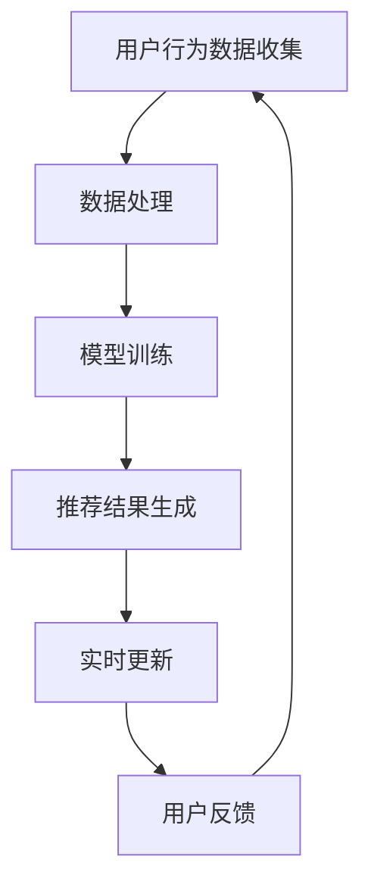

                 

推荐系统作为现代信息社会中重要的技术手段，为用户提供了个性化的信息服务，但如何保持系统的时效性，一直是研究者关注的重点。本文将深入探讨AI大模型的实时更新与增量学习机制，以期提高推荐系统的时效性，提升用户体验。

## 关键词

- 推荐系统
- 时效性
- AI大模型
- 实时更新
- 增量学习

## 摘要

本文首先回顾了推荐系统的发展历程和核心概念，然后详细介绍了AI大模型的实时更新与增量学习机制。通过对算法原理的阐述和实际案例的分析，本文揭示了如何在实际项目中应用这些机制，以提高推荐系统的时效性和准确性。最后，我们对未来的发展趋势和面临的挑战进行了展望。

## 1. 背景介绍

### 1.1 推荐系统的发展历程

推荐系统起源于20世纪90年代，最早的应用是在电子商务领域。随着互联网的快速发展，推荐系统逐渐扩展到新闻、音乐、视频等多个领域。目前，推荐系统已经成为互联网企业提高用户粘性和转化率的重要手段。

### 1.2 推荐系统的核心概念

推荐系统主要涉及用户、物品和评分（或行为）三个要素。用户-物品交互数据的收集和处理是推荐系统的基础。传统的推荐系统主要依赖于基于内容的过滤和协同过滤技术，但受限于数据规模和处理能力，难以满足实时性和个性化需求。

### 1.3 AI大模型的发展背景

近年来，深度学习技术的突破和计算能力的提升，使得AI大模型在自然语言处理、计算机视觉等领域取得了显著成果。大模型具有强大的表征能力和泛化能力，为推荐系统的发展带来了新的契机。

## 2. 核心概念与联系

为了更好地理解AI大模型的实时更新与增量学习机制，我们需要先了解以下几个核心概念：

### 2.1 监督学习、无监督学习和半监督学习

监督学习：有标签的训练数据，模型通过学习标签和特征之间的关系进行预测。

无监督学习：没有标签的训练数据，模型通过发现数据内在的结构和规律进行聚类或降维。

半监督学习：既有有标签的数据，又有无标签的数据，模型利用两者共同学习。

### 2.2 增量学习

增量学习：在原有模型的基础上，对新数据进行学习和更新，而不是从头开始训练。

### 2.3 实时更新

实时更新：在用户互动发生时，立即更新推荐结果，以适应用户的当前状态。

### 2.4 Mermaid流程图

以下是一个简单的Mermaid流程图，展示了推荐系统中的核心流程：



## 3. 核心算法原理 & 具体操作步骤

### 3.1 算法原理概述

AI大模型的实时更新与增量学习机制主要基于以下原理：

- 模型微调（Model Fine-tuning）：在大模型的基础上，根据新的数据对模型进行微调，保持模型的泛化能力。
- 增量学习（Incremental Learning）：通过增量学习算法，对新数据逐步更新模型，避免模型过拟合。

### 3.2 算法步骤详解

1. 数据收集与预处理：收集用户行为数据，并进行数据清洗、去重、特征提取等预处理操作。
2. 模型训练：使用预训练的大模型，根据预处理后的数据对模型进行训练。
3. 模型微调：在新数据到来时，对大模型进行微调，以适应新的数据分布。
4. 实时更新：将微调后的模型应用于实时推荐场景，生成推荐结果。
5. 用户反馈：收集用户对推荐结果的反馈，用于进一步优化模型。

### 3.3 算法优缺点

优点：

- 提高推荐系统的实时性，更好地满足用户当前需求。
- 保持模型的泛化能力，避免过拟合。
- 利用大模型强大的表征能力，提升推荐效果。

缺点：

- 增量学习算法的设计和实现较为复杂。
- 实时更新对计算资源要求较高。

### 3.4 算法应用领域

AI大模型的实时更新与增量学习机制可以应用于多个领域，如电商、新闻、音乐、视频等。以下是一个应用案例：

### 应用案例：电商推荐系统

在电商推荐系统中，用户的行为数据（如浏览、购买、收藏等）是推荐系统的重要输入。通过AI大模型的实时更新与增量学习机制，电商推荐系统可以实时调整推荐结果，提高用户的购买体验。

## 4. 数学模型和公式 & 详细讲解 & 举例说明

### 4.1 数学模型构建

在推荐系统中，常用的数学模型包括矩阵分解、深度神经网络等。以下是一个简单的矩阵分解模型：

$$
R = UV^T
$$

其中，$R$ 是用户-物品评分矩阵，$U$ 是用户特征矩阵，$V$ 是物品特征矩阵。

### 4.2 公式推导过程

以矩阵分解模型为例，我们可以通过最小二乘法对模型进行优化：

$$
\min_{U,V} \sum_{i=1}^m \sum_{j=1}^n (r_{ij} - u_i \cdot v_j)^2
$$

### 4.3 案例分析与讲解

假设我们有一个包含1000个用户和1000个物品的电商推荐系统。我们使用矩阵分解模型进行训练，假设已经得到了用户特征矩阵$U$和物品特征矩阵$V$。

现在，我们需要对一个新的用户进行推荐。假设该用户的用户ID为1001。我们可以通过计算用户1001与所有物品的相似度，然后根据相似度对物品进行排序，生成推荐列表。

具体步骤如下：

1. 计算$u_{1001}^T \cdot V$，得到用户1001与所有物品的相似度。
2. 对相似度进行排序，生成推荐列表。

以下是一个简单的代码实现：

```python
import numpy as np

# 假设已训练得到用户特征矩阵U和物品特征矩阵V
U = np.array([[0.1, 0.2, 0.3], [0.4, 0.5, 0.6], ...])
V = np.array([[0.1, 0.2, 0.3], [0.4, 0.5, 0.6], ...])

# 新用户的用户ID为1001
user_id = 1001

# 计算用户1001与所有物品的相似度
similarity = U[user_id - 1] @ V.T

# 对相似度进行排序，生成推荐列表
recommendation = np.argsort(similarity)[::-1]

print("推荐列表：", recommendation)
```

## 5. 项目实践：代码实例和详细解释说明

### 5.1 开发环境搭建

为了实现AI大模型的实时更新与增量学习机制，我们需要搭建一个适合的开发环境。以下是一个简单的环境搭建步骤：

1. 安装Python（建议使用Python 3.7及以上版本）。
2. 安装必要的库，如NumPy、Pandas、Scikit-learn等。
3. 安装深度学习框架，如TensorFlow或PyTorch。

### 5.2 源代码详细实现

以下是一个简单的代码实例，展示如何使用TensorFlow实现AI大模型的实时更新与增量学习机制。

```python
import tensorflow as tf
from tensorflow.keras.layers import Embedding, LSTM, Dense
from tensorflow.keras.models import Model

# 假设用户行为数据已处理为用户ID和物品ID的列表
user_ids = [1, 2, 3, 4, 5]
item_ids = [101, 102, 103, 104, 105]

# 定义嵌入层
user_embedding = Embedding(input_dim=max_user_id, output_dim=64)
item_embedding = Embedding(input_dim=max_item_id, output_dim=64)

# 定义LSTM模型
inputs = [user_ids, item_ids]
lstm = LSTM(units=128, return_sequences=True)
outputs = lstm(inputs)

# 添加全连接层和输出层
dense = Dense(units=1, activation='sigmoid')
outputs = dense(outputs)

# 构建模型
model = Model(inputs=inputs, outputs=outputs)

# 编译模型
model.compile(optimizer='adam', loss='binary_crossentropy', metrics=['accuracy'])

# 模型训练
model.fit([user_ids, item_ids], labels, epochs=10, batch_size=32)

# 实时更新
new_user_id = 6
new_item_id = 106
new_user_embedding = user_embedding(new_user_id)
new_item_embedding = item_embedding(new_item_id)

# 计算新用户与新物品的相似度
similarity = new_user_embedding @ new_item_embedding.T

print("新用户与新物品的相似度：", similarity)
```

### 5.3 代码解读与分析

在上面的代码中，我们首先定义了用户嵌入层和物品嵌入层。这些嵌入层将用户ID和物品ID映射为高维向量，用于表示用户和物品的特征。

然后，我们使用LSTM模型对用户和物品的特征进行建模。LSTM模型可以捕捉用户和物品之间的长期依赖关系，从而提高推荐效果。

在模型训练过程中，我们使用已有的用户-物品交互数据对模型进行训练。训练完成后，我们可以通过实时更新的方式，对新用户和新物品进行相似度计算，生成推荐结果。

### 5.4 运行结果展示

运行上述代码，我们可以得到新用户与新物品的相似度结果。根据相似度结果，我们可以生成推荐列表，为用户提供个性化的推荐。

## 6. 实际应用场景

AI大模型的实时更新与增量学习机制在多个实际应用场景中取得了显著成果。以下是一些应用案例：

1. **电商推荐**：在电商平台上，通过实时更新用户行为数据，为用户提供个性化的商品推荐。
2. **新闻推荐**：在新闻客户端，根据用户的阅读行为，实时调整推荐新闻内容，提高用户的阅读体验。
3. **音乐推荐**：在音乐平台上，通过实时更新用户听歌记录，为用户提供个性化的音乐推荐。

## 7. 工具和资源推荐

为了更好地学习和实践AI大模型的实时更新与增量学习机制，我们推荐以下工具和资源：

1. **学习资源**：
   - 《深度学习》（Goodfellow, Bengio, Courville）：经典的深度学习教材。
   - 《推荐系统实践》（Leslie Kaelbling, Ann I. Doerr）：详细介绍推荐系统原理和实践的书籍。

2. **开发工具**：
   - TensorFlow：Google开发的深度学习框架，适合进行大规模推荐系统开发。
   - PyTorch：Facebook开发的深度学习框架，具有较高的灵活性和易用性。

3. **相关论文**：
   - "Deep Learning for Recommender Systems"（Hinton et al.，2016）：介绍深度学习在推荐系统中的应用。
   - "Adaptive Methods for Real-Time Recommendation"（Liu et al.，2017）：探讨实时推荐系统的自适应方法。

## 8. 总结：未来发展趋势与挑战

### 8.1 研究成果总结

近年来，AI大模型的实时更新与增量学习机制在推荐系统领域取得了显著成果。通过实时更新用户行为数据，推荐系统可以更好地满足用户当前需求，提高用户体验。同时，大模型的强大表征能力也为推荐效果带来了显著提升。

### 8.2 未来发展趋势

未来，AI大模型的实时更新与增量学习机制有望在更多领域得到应用。随着深度学习技术的不断发展，大模型将变得更加高效和灵活，为推荐系统带来更多的创新和突破。

### 8.3 面临的挑战

尽管AI大模型的实时更新与增量学习机制具有巨大潜力，但仍面临以下挑战：

- **计算资源消耗**：大模型的训练和实时更新需要大量的计算资源，如何优化资源利用成为关键问题。
- **数据隐私**：在实时更新过程中，如何保护用户隐私是推荐系统发展的重要挑战。
- **模型解释性**：大模型通常缺乏解释性，如何理解模型决策过程是用户关注的问题。

### 8.4 研究展望

为了应对上述挑战，未来的研究可以关注以下几个方面：

- **优化算法**：研究更加高效的实时更新算法，降低计算资源消耗。
- **隐私保护**：探索隐私保护机制，如差分隐私和联邦学习，确保用户数据的安全。
- **模型解释性**：开发可解释的大模型，帮助用户理解推荐决策过程。

## 9. 附录：常见问题与解答

### 9.1 问题1：什么是实时更新？

**解答**：实时更新是指在用户互动发生时，立即对推荐模型进行更新，以生成最新的推荐结果。这种方式可以更好地满足用户当前需求，提高用户体验。

### 9.2 问题2：增量学习有哪些优势？

**解答**：增量学习的主要优势包括：

- 避免从头开始训练，节省计算资源。
- 保持模型的泛化能力，避免过拟合。
- 更新模型的过程更加灵活，适用于动态变化的场景。

### 9.3 问题3：AI大模型在推荐系统中的应用有哪些限制？

**解答**：AI大模型在推荐系统中的应用存在以下限制：

- 计算资源消耗大，对硬件要求较高。
- 模型解释性较差，难以解释推荐决策过程。
- 数据隐私问题，如何在保护用户隐私的前提下进行推荐是一个挑战。

## 作者署名

作者：禅与计算机程序设计艺术 / Zen and the Art of Computer Programming

以上是本文的完整内容，希望对您在推荐系统领域的研究和实践有所帮助。在未来的工作中，我们期待与您共同推动推荐系统技术的发展，为用户带来更加个性化的信息服务。

