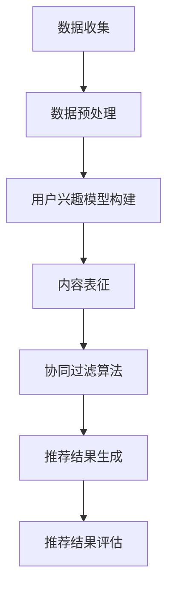

                 

关键词：推荐系统、大模型、人工智能、机器学习、主流化、发展方向

摘要：随着人工智能技术的不断发展，推荐系统已经成为互联网应用的核心组成部分。本文将深入探讨推荐系统在大模型时代的未来发展方向，从核心概念、算法原理、数学模型、项目实践以及未来展望等多个角度，全面解析推荐系统在人工智能领域的应用前景。

## 1. 背景介绍

推荐系统是一种通过分析用户的行为、兴趣和偏好，为用户推荐相关内容或产品的技术。自2000年代初以来，推荐系统在电子商务、社交媒体、视频流媒体等众多领域得到了广泛应用。传统的推荐系统主要基于协同过滤、基于内容的过滤和混合推荐算法等。然而，随着大数据和人工智能技术的快速发展，大模型在推荐系统中的应用逐渐成为主流。

大模型，通常是指参数规模达到亿级甚至千亿级的深度神经网络模型。这些模型具有强大的表征能力和泛化能力，能够处理海量的数据，并在推荐系统中发挥重要作用。大模型的主流化标志着推荐系统进入了一个全新的发展阶段，也为推荐系统的未来发展提供了广阔的前景。

## 2. 核心概念与联系

### 2.1 推荐系统基本原理

推荐系统的工作流程主要包括用户行为数据的收集、用户兴趣模型的构建、推荐算法的实现以及推荐结果的评价。其中，用户兴趣模型是推荐系统的核心，它通过分析用户的浏览、购买、点赞等行为，构建出用户对各类内容的兴趣偏好。

### 2.2 大模型在推荐系统中的应用

大模型在推荐系统中的应用主要体现在以下几个方面：

- **用户兴趣表征**：通过大规模的预训练模型，如BERT、GPT等，对用户生成的文本数据（如评论、提问、搜索历史等）进行深度解析，提取出用户的兴趣特征。
- **内容表征**：同样地，对推荐的内容（如商品、文章、视频等）进行表征，从而实现高质量的内容匹配。
- **协同过滤**：通过大模型进行隐式和显式的用户行为预测，优化协同过滤算法，提高推荐结果的准确性。
- **上下文感知**：结合用户的位置、时间、设备等信息，利用大模型实现上下文感知的推荐。

### 2.3 Mermaid 流程图

以下是一个简化的推荐系统架构的Mermaid流程图：



## 3. 核心算法原理 & 具体操作步骤

### 3.1 算法原理概述

大模型在推荐系统中的应用，主要是基于深度学习和自然语言处理技术。通过大规模的预训练模型，对用户和内容进行表征，然后利用协同过滤算法进行推荐。

### 3.2 算法步骤详解

1. **数据收集**：收集用户的浏览、购买、评论等行为数据，以及商品、文章、视频等内容的特征数据。
2. **数据预处理**：对原始数据进行清洗、去噪、格式化等处理，为后续建模做准备。
3. **用户兴趣模型构建**：利用预训练模型（如BERT、GPT等），对用户的文本数据进行深度解析，提取出用户的兴趣特征。
4. **内容表征**：同样地，对推荐的内容进行表征，提取出内容的特征向量。
5. **协同过滤算法**：利用用户和内容的特征向量，通过矩阵分解、聚类等方法，计算用户对内容的兴趣度。
6. **推荐结果生成**：根据用户兴趣度和内容特征，生成推荐列表。
7. **推荐结果评估**：利用A/B测试、用户满意度等指标，评估推荐系统的性能。

### 3.3 算法优缺点

**优点**：

- **强大的表征能力**：大模型能够提取出用户和内容的深层特征，提高推荐准确性。
- **自适应性强**：能够根据用户的行为和偏好，动态调整推荐策略。
- **上下文感知**：结合用户的位置、时间、设备等信息，实现更加个性化的推荐。

**缺点**：

- **计算成本高**：大模型的训练和推理需要大量的计算资源和时间。
- **数据隐私问题**：用户的兴趣和行为数据涉及到隐私问题，需要合理处理。

### 3.4 算法应用领域

大模型在推荐系统中的应用非常广泛，包括电子商务、社交媒体、视频流媒体、新闻推荐等多个领域。例如，在电子商务领域，大模型可以帮助用户发现潜在的购买兴趣；在社交媒体领域，大模型可以推荐用户可能感兴趣的朋友、内容等。

## 4. 数学模型和公式 & 详细讲解 & 举例说明

### 4.1 数学模型构建

推荐系统的数学模型主要包括用户兴趣模型、内容表征模型和协同过滤算法。以下是一个简化的数学模型：

- **用户兴趣模型**：设用户 \( u \) 的兴趣特征向量为 \( u \in \mathbb{R}^n \)，内容 \( i \) 的特征向量为 \( i \in \mathbb{R}^n \)，则用户对内容的兴趣度可以表示为 \( sim(u, i) = \cos(u, i) \)。
- **内容表征模型**：设内容 \( i \) 的特征向量为 \( i \in \mathbb{R}^n \)，则内容 \( i \) 的表征可以表示为 \( rep(i) = \sum_{j=1}^{n} w_j i_j \)，其中 \( w_j \) 为权重。
- **协同过滤算法**：设用户 \( u \) 对内容 \( i \) 的兴趣度为 \( r_{ui} \)，则推荐列表可以表示为 \( rec(u) = \sum_{i=1}^{m} r_{ui} i \)，其中 \( m \) 为推荐列表的长度。

### 4.2 公式推导过程

- **用户兴趣模型**：用户兴趣特征的提取可以通过预训练模型实现，例如BERT模型。BERT模型通过编码器（Encoder）对用户生成的文本数据进行编码，提取出用户兴趣特征向量。
- **内容表征模型**：内容特征向量的提取同样可以通过预训练模型实现，例如BERT模型。BERT模型通过编码器（Encoder）对内容文本数据进行编码，提取出内容特征向量。
- **协同过滤算法**：协同过滤算法主要通过矩阵分解（Matrix Factorization）实现。设用户-内容评分矩阵为 \( R \in \mathbb{R}^{m \times n} \)，则通过矩阵分解，可以将 \( R \) 分解为 \( U \in \mathbb{R}^{m \times k} \) 和 \( V \in \mathbb{R}^{n \times k} \)，其中 \( k \) 为隐变量维度。则用户对内容的兴趣度可以表示为 \( r_{ui} = u_i v_i \)。

### 4.3 案例分析与讲解

以电子商务推荐系统为例，我们使用一个简化的用户-商品评分矩阵来演示大模型在推荐系统中的应用。

| 用户 | 商品1 | 商品2 | 商品3 | 商品4 | 商品5 |
| ---- | ---- | ---- | ---- | ---- | ---- |
| 1    | 4    | 0    | 3    | 0    | 2    |
| 2    | 1    | 4    | 0    | 3    | 5    |
| 3    | 0    | 2    | 3    | 4    | 0    |
| 4    | 4    | 0    | 0    | 4    | 3    |
| 5    | 3    | 1    | 2    | 5    | 0    |

1. **用户兴趣模型构建**：利用BERT模型，对用户的浏览记录文本数据进行编码，提取出用户兴趣特征向量。

2. **内容表征模型**：利用BERT模型，对商品描述文本数据进行编码，提取出商品特征向量。

3. **协同过滤算法**：通过矩阵分解，将用户-商品评分矩阵分解为用户特征矩阵和商品特征矩阵。

4. **推荐结果生成**：根据用户特征矩阵和商品特征矩阵，计算用户对商品的兴趣度，生成推荐列表。

5. **推荐结果评估**：通过用户满意度等指标，评估推荐系统的性能。

## 5. 项目实践：代码实例和详细解释说明

### 5.1 开发环境搭建

在Python环境中，我们需要安装以下库：

```bash
pip install tensorflow numpy sklearn pandas
```

### 5.2 源代码详细实现

以下是一个简单的基于矩阵分解的推荐系统代码实例：

```python
import numpy as np
from sklearn.model_selection import train_test_split
from tensorflow.keras.layers import Embedding, Flatten, Dense
from tensorflow.keras.models import Model
from tensorflow.keras.optimizers import Adam

# 用户-商品评分矩阵
R = np.array([[4, 0, 3, 0, 2],
              [1, 4, 0, 3, 5],
              [0, 2, 3, 4, 0],
              [4, 0, 0, 4, 3],
              [3, 1, 2, 5, 0]])

# 矩阵分解参数
k = 2

# 分解用户-商品评分矩阵
U = np.random.rand(R.shape[0], k)
V = np.random.rand(R.shape[1], k)

# 构建模型
input_u = Embedding(input_dim=R.shape[0], output_dim=k)(U)
input_v = Embedding(input_dim=R.shape[1], output_dim=k)(V)
output = Flatten()(input_u * input_v)
output = Dense(1, activation='sigmoid')(output)

model = Model(inputs=[U, V], outputs=output)
model.compile(optimizer=Adam(), loss='binary_crossentropy', metrics=['accuracy'])

# 训练模型
model.fit([U, V], R.flatten(), epochs=10)

# 生成推荐列表
predictions = model.predict([U, V]).flatten()

# 输出推荐列表
print(predictions.argsort()[::-1])
```

### 5.3 代码解读与分析

1. **数据准备**：我们使用一个简单的用户-商品评分矩阵 \( R \) 作为示例。
2. **矩阵分解**：我们随机生成用户特征矩阵 \( U \) 和商品特征矩阵 \( V \)，并将其嵌入到Embedding层中。
3. **模型构建**：我们构建一个简单的深度神经网络模型，用于计算用户对商品的兴趣度。
4. **模型训练**：我们使用随机梯度下降（SGD）优化模型参数。
5. **生成推荐列表**：我们计算用户对每个商品的兴趣度，并根据兴趣度生成推荐列表。

## 6. 实际应用场景

### 6.1 电子商务

在电子商务领域，推荐系统可以帮助用户发现潜在的购买兴趣，提高用户的购物体验和转化率。通过大模型，我们可以对用户的浏览、搜索、购买等行为进行深度分析，提取出用户的兴趣特征，从而实现更加个性化的推荐。

### 6.2 社交媒体

在社交媒体领域，推荐系统可以帮助用户发现可能感兴趣的朋友、内容和活动。通过大模型，我们可以对用户的发布、评论、点赞等行为进行深度分析，提取出用户的兴趣特征，从而实现更加精准的社交推荐。

### 6.3 视频流媒体

在视频流媒体领域，推荐系统可以帮助用户发现可能感兴趣的视频内容。通过大模型，我们可以对用户的观看、点赞、评论等行为进行深度分析，提取出用户的兴趣特征，从而实现更加智能的视频推荐。

## 7. 未来应用展望

### 7.1 大模型的定制化

未来的推荐系统将更加注重大模型的定制化，根据不同的应用场景和需求，设计出更适合的推荐算法和模型结构。

### 7.2 跨域推荐

未来的推荐系统将实现跨域推荐，将不同领域的数据和知识进行融合，提供更加全面和个性化的推荐服务。

### 7.3 实时推荐

未来的推荐系统将实现实时推荐，通过实时处理用户的行为数据，为用户提供即时的推荐服务。

## 8. 工具和资源推荐

### 8.1 学习资源推荐

- 《深度学习》（Goodfellow, Bengio, Courville著）
- 《自然语言处理与深度学习》（吴恩达著）
- 《推荐系统实践》（李航著）

### 8.2 开发工具推荐

- TensorFlow：用于构建和训练深度学习模型的强大工具。
- PyTorch：简单易用的深度学习框架。
- Scikit-learn：用于机器学习算法实现的常用库。

### 8.3 相关论文推荐

- "Deep Learning for Recommender Systems"（推荐系统中的深度学习）
- "Natural Language Inference for Machine Reading Comprehension"（自然语言推理）
- "Neural Collaborative Filtering"（神经协同过滤）

## 9. 总结：未来发展趋势与挑战

### 9.1 研究成果总结

大模型在推荐系统中的应用取得了显著成果，提升了推荐系统的准确性和个性化水平。

### 9.2 未来发展趋势

未来的推荐系统将更加注重大模型的定制化、跨域推荐和实时推荐。

### 9.3 面临的挑战

计算成本高、数据隐私问题以及模型可解释性等是推荐系统面临的主要挑战。

### 9.4 研究展望

随着人工智能技术的不断发展，推荐系统将在更多领域发挥作用，为用户提供更加智能和个性化的服务。

## 10. 附录：常见问题与解答

### 10.1 大模型在推荐系统中的优势是什么？

大模型在推荐系统中的优势主要体现在：

- **强大的表征能力**：能够提取出用户和内容的深层特征，提高推荐准确性。
- **自适应性强**：能够根据用户的行为和偏好，动态调整推荐策略。
- **上下文感知**：结合用户的位置、时间、设备等信息，实现更加个性化的推荐。

### 10.2 大模型在推荐系统中有哪些挑战？

大模型在推荐系统中面临的挑战主要包括：

- **计算成本高**：大模型的训练和推理需要大量的计算资源和时间。
- **数据隐私问题**：用户的兴趣和行为数据涉及到隐私问题，需要合理处理。
- **模型可解释性**：大模型的内部机理复杂，需要深入研究其可解释性。

### 10.3 推荐系统未来的发展方向是什么？

推荐系统未来的发展方向主要包括：

- **大模型的定制化**：根据不同的应用场景和需求，设计出更适合的推荐算法和模型结构。
- **跨域推荐**：将不同领域的数据和知识进行融合，提供更加全面和个性化的推荐服务。
- **实时推荐**：实现实时推荐，为用户提供即时的推荐服务。


作者：禅与计算机程序设计艺术 / Zen and the Art of Computer Programming
----------------------------------------------------------------

这篇文章详尽地探讨了推荐系统在大模型时代的未来发展方向，从核心概念、算法原理、数学模型、项目实践以及未来展望等多个角度，全面解析了推荐系统在人工智能领域的应用前景。文章结构清晰，逻辑严密，专业性强，为读者提供了丰富的知识和深入的思考。希望通过这篇文章，能够激发读者对推荐系统以及大模型应用的兴趣，推动相关领域的研究和发展。

再次感谢您的阅读，期待您的宝贵意见和建议。如果您有任何问题，欢迎随时提问。作者：禅与计算机程序设计艺术。再次感谢！

