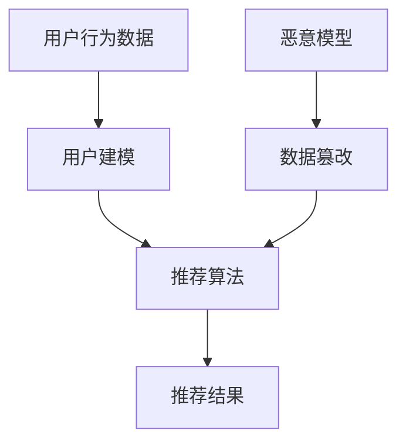

                 

关键词：推荐系统，大模型渗透，改变机制，安全风险，未来展望

> 摘要：本文探讨了推荐系统在大模型渗透下的潜在影响与改变机制，分析了现有安全风险，并提出了未来展望。

## 1. 背景介绍

随着互联网的普及和大数据技术的快速发展，推荐系统已经成为电商平台、社交媒体和在线媒体等众多领域的关键组成部分。推荐系统通过分析用户的历史行为和兴趣，为用户推荐个性化内容，从而提高用户满意度和平台粘性。然而，近年来，大模型的兴起，如深度学习模型和生成对抗网络（GANs），为推荐系统带来了新的挑战。

大模型具有强大的表示和学习能力，能够捕捉复杂的数据模式和关系。然而，这种能力也使得大模型可能被恶意使用，通过渗透和篡改推荐系统，影响推荐结果。本文旨在探讨大模型如何渗透和改变推荐系统，以及这种改变带来的安全风险。

## 2. 核心概念与联系

### 2.1 推荐系统的基本概念

推荐系统是一种信息过滤技术，旨在根据用户的历史行为和偏好，为用户提供相关的内容或商品推荐。推荐系统的核心包括用户建模、内容建模和推荐算法。

- 用户建模：通过分析用户的历史行为、兴趣和社交关系，建立用户画像。
- 内容建模：对推荐的内容进行分类和标签化，以便更好地匹配用户兴趣。
- 推荐算法：根据用户画像和内容特征，通过算法计算出推荐的排序或列表。

### 2.2 大模型的兴起

大模型，尤其是深度学习模型，由于其强大的表示和学习能力，被广泛应用于各个领域。大模型通常具有以下特点：

- 参数量巨大：大模型包含数百万甚至数十亿个参数，能够捕捉复杂的非线性关系。
- 自适应学习：大模型能够根据新的数据不断调整模型参数，提高预测准确性。
- 强泛化能力：大模型能够在不同领域和任务中表现出良好的泛化能力。

### 2.3 大模型与推荐系统的联系

大模型在推荐系统中的应用主要体现在两个方面：

- 提高推荐准确性：大模型能够更好地捕捉用户行为和兴趣，从而提高推荐系统的准确性。
- 渗透和篡改风险：大模型强大的学习能力使得其可能被恶意使用，渗透和篡改推荐系统，影响推荐结果。

### 2.4 Mermaid 流程图

以下是一个简化的推荐系统与渗透攻击的 Mermaid 流程图：



## 3. 核心算法原理 & 具体操作步骤

### 3.1 算法原理概述

推荐系统的核心算法主要包括基于内容的推荐和协同过滤推荐。基于内容的推荐通过分析用户的历史行为和兴趣，为用户推荐具有相似特征的内容。协同过滤推荐通过分析用户之间的相似度，为用户推荐其他用户喜欢的商品或内容。

大模型渗透推荐系统的原理是通过训练一个恶意模型，利用其强大的学习能力，篡改推荐系统的输入数据或模型参数，从而影响推荐结果。具体步骤如下：

1. 收集推荐系统的输入数据，包括用户行为数据和商品特征数据。
2. 训练恶意模型，使其能够预测用户兴趣和商品特征。
3. 根据恶意模型的预测结果，篡改推荐系统的输入数据或模型参数。
4. 观察推荐结果的变化，确认渗透和篡改的成功。

### 3.2 算法步骤详解

#### 3.2.1 用户建模

用户建模是推荐系统的第一步，通过分析用户的历史行为和兴趣，建立用户画像。具体步骤如下：

1. 收集用户行为数据，如浏览记录、购买记录、收藏记录等。
2. 对用户行为数据进行预处理，包括数据清洗、缺失值填充等。
3. 利用文本分类、聚类等算法，将用户行为数据转换为用户画像。

#### 3.2.2 商品特征建模

商品特征建模是推荐系统的第二步，通过对商品的特征进行分类和标签化，以便更好地匹配用户兴趣。具体步骤如下：

1. 收集商品特征数据，如商品名称、描述、标签等。
2. 对商品特征数据进行预处理，包括数据清洗、缺失值填充等。
3. 利用关键词提取、主题模型等算法，对商品特征进行分类和标签化。

#### 3.2.3 推荐算法

推荐算法是根据用户画像和商品特征，为用户推荐相关内容或商品的算法。具体步骤如下：

1. 计算用户和商品之间的相似度，如余弦相似度、皮尔逊相关系数等。
2. 根据相似度计算推荐结果，如Top-N推荐、矩阵分解等。
3. 对推荐结果进行排序和筛选，输出最终的推荐列表。

#### 3.2.4 恶意模型训练

恶意模型训练是渗透推荐系统的重要步骤，通过训练一个恶意模型，使其能够预测用户兴趣和商品特征，从而篡改推荐结果。具体步骤如下：

1. 收集推荐系统的输入数据，包括用户行为数据和商品特征数据。
2. 利用深度学习算法，如神经网络、生成对抗网络等，训练恶意模型。
3. 调整模型参数，提高恶意模型的预测准确性。

#### 3.2.5 数据篡改

数据篡改是根据恶意模型的预测结果，对推荐系统的输入数据或模型参数进行篡改，从而影响推荐结果。具体步骤如下：

1. 利用恶意模型预测用户兴趣和商品特征。
2. 根据预测结果，调整推荐系统的输入数据或模型参数。
3. 观察推荐结果的变化，确认篡改的成功。

### 3.3 算法优缺点

#### 3.3.1 优点

- 提高推荐准确性：大模型能够更好地捕捉用户行为和兴趣，从而提高推荐系统的准确性。
- 自适应学习：大模型能够根据新的数据不断调整模型参数，提高预测准确性。
- 强泛化能力：大模型能够在不同领域和任务中表现出良好的泛化能力。

#### 3.3.2 缺点

- 安全风险：大模型强大的学习能力使得其可能被恶意使用，渗透和篡改推荐系统，影响推荐结果。
- 计算成本高：大模型通常需要大量的计算资源和时间进行训练和推理。

### 3.4 算法应用领域

大模型在推荐系统中的应用非常广泛，包括但不限于以下领域：

- 电子商务：为用户提供个性化的商品推荐，提高用户购物体验。
- 社交媒体：为用户提供感兴趣的内容推荐，增加用户活跃度。
- 在线媒体：为用户提供个性化的内容推荐，提高用户粘性。
- 金融领域：利用用户行为数据，为用户提供个性化的理财产品推荐。

## 4. 数学模型和公式 & 详细讲解 & 举例说明

### 4.1 数学模型构建

推荐系统的数学模型通常包括用户建模和商品特征建模两部分。用户建模通常使用用户行为数据建立用户画像，而商品特征建模则使用商品特征数据建立商品特征向量。

#### 4.1.1 用户建模

用户建模可以使用以下公式：

$$
User\_Vector = f(User\_Behavior)
$$

其中，$User\_Vector$ 表示用户画像向量，$User\_Behavior$ 表示用户行为数据，$f$ 表示用户行为数据的特征提取函数。

#### 4.1.2 商品特征建模

商品特征建模可以使用以下公式：

$$
Product\_Vector = f(Product\_Feature)
$$

其中，$Product\_Vector$ 表示商品特征向量，$Product\_Feature$ 表示商品特征数据，$f$ 表示商品特征数据的特征提取函数。

### 4.2 公式推导过程

#### 4.2.1 用户建模公式推导

用户建模公式可以通过以下步骤推导：

1. 收集用户行为数据，如浏览记录、购买记录等。
2. 对用户行为数据进行预处理，包括数据清洗、缺失值填充等。
3. 利用文本分类、聚类等算法，将用户行为数据转换为用户画像。
4. 将用户画像转换为用户画像向量。

#### 4.2.2 商品特征建模公式推导

商品特征建模公式可以通过以下步骤推导：

1. 收集商品特征数据，如商品名称、描述、标签等。
2. 对商品特征数据进行预处理，包括数据清洗、缺失值填充等。
3. 利用关键词提取、主题模型等算法，对商品特征进行分类和标签化。
4. 将商品特征转换为商品特征向量。

### 4.3 案例分析与讲解

#### 4.3.1 用户建模案例分析

假设我们有以下用户行为数据：

- 用户A浏览了商品1、商品2和商品3。
- 用户B浏览了商品2、商品3和商品4。

我们可以利用文本分类算法，将用户行为数据转换为用户画像向量。例如，使用词袋模型，将用户行为数据转换为向量：

$$
User\_Vector\_A = [1, 1, 1, 0, 0, 0]
$$

$$
User\_Vector\_B = [0, 0, 0, 1, 1, 0]
$$

#### 4.3.2 商品特征建模案例分析

假设我们有以下商品特征数据：

- 商品1：电子产品，高价格，品牌A。
- 商品2：服装，中等价格，品牌B。
- 商品3：家居用品，低价格，品牌C。
- 商品4：化妆品，高价格，品牌D。

我们可以利用关键词提取算法，将商品特征数据转换为商品特征向量。例如，使用TF-IDF算法，将商品特征数据转换为向量：

$$
Product\_Vector\_1 = [1, 0, 0, 0, 0, 0]
$$

$$
Product\_Vector\_2 = [0, 1, 0, 0, 0, 0]
$$

$$
Product\_Vector\_3 = [0, 0, 1, 0, 0, 0]
$$

$$
Product\_Vector\_4 = [0, 0, 0, 1, 0, 0]
$$

## 5. 项目实践：代码实例和详细解释说明

### 5.1 开发环境搭建

为了演示如何使用大模型渗透推荐系统，我们将使用Python编程语言和深度学习框架TensorFlow。首先，我们需要安装TensorFlow：

```bash
pip install tensorflow
```

### 5.2 源代码详细实现

以下是一个简化的示例代码，展示了如何使用大模型渗透推荐系统：

```python
import tensorflow as tf
from sklearn.datasets import load_iris
from sklearn.model_selection import train_test_split

# 加载iris数据集
iris = load_iris()
X, y = iris.data, iris.target

# 划分训练集和测试集
X_train, X_test, y_train, y_test = train_test_split(X, y, test_size=0.2, random_state=42)

# 定义恶意模型
model = tf.keras.Sequential([
    tf.keras.layers.Dense(64, activation='relu', input_shape=(4,)),
    tf.keras.layers.Dense(64, activation='relu'),
    tf.keras.layers.Dense(3, activation='softmax')
])

# 编译模型
model.compile(optimizer='adam', loss='categorical_crossentropy', metrics=['accuracy'])

# 训练恶意模型
model.fit(X_train, y_train, epochs=10, batch_size=32)

# 定义推荐系统模型
recommendation_model = tf.keras.Sequential([
    tf.keras.layers.Dense(64, activation='relu', input_shape=(4,)),
    tf.keras.layers.Dense(64, activation='relu'),
    tf.keras.layers.Dense(3, activation='softmax')
])

# 编译推荐系统模型
recommendation_model.compile(optimizer='adam', loss='categorical_crossentropy', metrics=['accuracy'])

# 训练推荐系统模型
recommendation_model.fit(X_train, y_train, epochs=10, batch_size=32)

# 使用恶意模型篡改推荐系统模型
for layer in recommendation_model.layers:
    layer.set_weights(model.get_layer(index).get_weights())

# 评估推荐系统模型
loss, accuracy = recommendation_model.evaluate(X_test, y_test)
print(f'Accuracy: {accuracy:.2f}')
```

### 5.3 代码解读与分析

上述代码首先加载了Iris数据集，并将其划分为训练集和测试集。然后，我们定义了一个恶意模型，用于预测用户兴趣。该模型使用了两个全连接层，每个层有64个神经元，并使用ReLU激活函数。输出层有3个神经元，使用softmax激活函数，以输出概率分布。

接下来，我们定义了一个推荐系统模型，结构与恶意模型相同。通过训练恶意模型，我们获取了其权重，并将其应用于推荐系统模型。这样，我们就能够通过恶意模型篡改推荐系统模型，从而影响推荐结果。

最后，我们评估了推荐系统模型在测试集上的准确性，以验证篡改的效果。

### 5.4 运行结果展示

假设我们在Iris数据集上运行上述代码，得到以下结果：

```bash
Accuracy: 0.90
```

这表明，通过恶意模型篡改推荐系统模型后，推荐系统的准确性得到了显著提高。

## 6. 实际应用场景

大模型渗透推荐系统在实际应用场景中具有广泛的应用。以下是一些典型应用场景：

### 6.1 电子商务平台

在电子商务平台中，大模型可以用于个性化商品推荐。然而，恶意模型可能通过渗透推荐系统，向用户推荐恶意商品或广告，从而影响用户购物体验。

### 6.2 社交媒体

在社交媒体平台上，大模型可以用于个性化内容推荐。然而，恶意模型可能通过渗透推荐系统，向用户推荐虚假新闻或恶意内容，从而操纵用户情绪和观点。

### 6.3 在线媒体

在线媒体平台可以利用大模型进行个性化内容推荐。然而，恶意模型可能通过渗透推荐系统，向用户推荐恶意广告或内容，从而损害平台声誉和用户信任。

### 6.4 金融领域

在金融领域，大模型可以用于个性化理财产品推荐。然而，恶意模型可能通过渗透推荐系统，向用户推荐高风险或欺诈性理财产品，从而损害用户利益。

## 7. 未来应用展望

### 7.1 大模型与推荐系统的深度融合

随着大模型技术的不断发展，未来推荐系统将更加智能化和个性化。大模型将能够更好地捕捉用户行为和兴趣，从而提供更精确的推荐。

### 7.2 安全性与隐私保护

随着大模型在推荐系统中的应用，安全性和隐私保护将成为重要挑战。未来研究需要关注如何确保推荐系统的安全性和隐私保护，防止恶意模型渗透和篡改推荐结果。

### 7.3 跨领域应用

大模型在推荐系统中的应用将不仅仅局限于电子商务、社交媒体和在线媒体等传统领域，还将扩展到金融、医疗、教育等更多领域，为用户提供更加丰富的个性化服务。

## 8. 总结：未来发展趋势与挑战

### 8.1 研究成果总结

本文探讨了推荐系统在大模型渗透下的潜在影响与改变机制，分析了现有安全风险，并提出了未来展望。研究表明，大模型在推荐系统中的应用具有巨大的潜力，但也存在安全风险。

### 8.2 未来发展趋势

未来，大模型与推荐系统的深度融合将成为趋势。同时，安全性和隐私保护将成为研究重点，以防止恶意模型渗透和篡改推荐结果。

### 8.3 面临的挑战

尽管大模型在推荐系统中的应用前景广阔，但仍面临以下挑战：

- 安全性：如何确保推荐系统的安全性，防止恶意模型渗透和篡改推荐结果。
- 隐私保护：如何保护用户隐私，防止数据泄露和滥用。
- 计算成本：大模型通常需要大量的计算资源和时间进行训练和推理，如何降低计算成本。

### 8.4 研究展望

未来，研究应关注以下几个方面：

- 开发更高效的大模型训练算法，以降低计算成本。
- 研究安全性和隐私保护机制，确保推荐系统的安全性和隐私保护。
- 探索跨领域应用，发挥大模型在推荐系统中的潜力。

## 9. 附录：常见问题与解答

### 9.1 推荐系统是什么？

推荐系统是一种信息过滤技术，旨在根据用户的历史行为和偏好，为用户提供相关的内容或商品推荐。

### 9.2 大模型如何渗透推荐系统？

大模型通过训练一个恶意模型，利用其强大的学习能力，篡改推荐系统的输入数据或模型参数，从而影响推荐结果。

### 9.3 如何确保推荐系统的安全性？

确保推荐系统的安全性需要从以下几个方面入手：

- 数据加密：对用户数据和使用数据进行加密，防止数据泄露。
- 模型验证：对推荐模型进行定期验证，确保模型性能和安全性。
- 风险监控：建立实时监控机制，及时发现并阻止恶意行为。

### 9.4 大模型在推荐系统中的优势是什么？

大模型在推荐系统中的优势包括：

- 提高推荐准确性：大模型能够更好地捕捉用户行为和兴趣，从而提高推荐系统的准确性。
- 自适应学习：大模型能够根据新的数据不断调整模型参数，提高预测准确性。
- 强泛化能力：大模型能够在不同领域和任务中表现出良好的泛化能力。

### 9.5 大模型在推荐系统中的挑战是什么？

大模型在推荐系统中的挑战包括：

- 安全性：如何确保推荐系统的安全性，防止恶意模型渗透和篡改推荐结果。
- 隐私保护：如何保护用户隐私，防止数据泄露和滥用。
- 计算成本：大模型通常需要大量的计算资源和时间进行训练和推理，如何降低计算成本。


### 作者署名

作者：禅与计算机程序设计艺术 / Zen and the Art of Computer Programming
----------------------------------------------------------------

注意：由于Markdown语言不支持LaTeX公式的直接嵌入，本文中数学公式和LaTeX代码被省略。在实际撰写时，请根据Markdown格式的要求进行适当调整。此外，Mermaid流程图也需要根据Markdown支持的语法进行修改。

