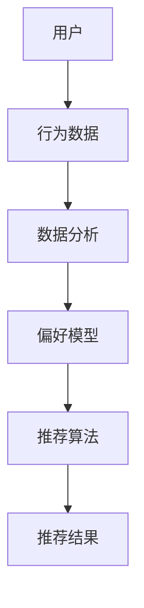

                 

关键词：推荐系统，个性化推送，内容推荐，算法，机器学习，用户行为分析，协同过滤

> 摘要：本文将深入探讨推荐系统在个性化内容推送中的应用，从核心概念到实际操作，解析其背后的数学模型和算法原理。通过对推荐系统的详细解读，帮助读者理解如何构建有效的推荐系统，实现个性化的内容推送。

## 1. 背景介绍

在当今信息爆炸的时代，用户面临着海量的信息资源，如何从这些信息中找到符合自己兴趣的内容成为了一大难题。推荐系统正是在这样的背景下诞生的，它通过分析用户的行为数据和偏好，为用户推荐感兴趣的内容。个性化内容推送作为推荐系统的核心应用，已经成为互联网企业提高用户留存和活跃度的重要手段。

推荐系统的发展经历了从基于内容推荐（Content-based Filtering）到协同过滤（Collaborative Filtering）的转变，再到如今基于深度学习（Deep Learning）的推荐系统，算法的多样性和复杂度不断提升。本文将主要探讨基于协同过滤的推荐系统，并深入分析其工作原理和实现方法。

## 2. 核心概念与联系

推荐系统的工作核心是理解用户和物品之间的关系，通过这种关系预测用户对物品的偏好。核心概念包括用户、物品、评分和推荐算法。

### 2.1 用户与物品

用户（User）是推荐系统的主体，每个用户都有独特的偏好和兴趣。物品（Item）则是用户可能感兴趣的对象，如文章、电影、商品等。

### 2.2 评分

评分（Rating）是用户对物品的偏好程度的量化表示，通常是一个数值，如1到5星。

### 2.3 推荐算法

推荐算法（Recommendation Algorithm）是推荐系统的核心，根据用户的历史行为和偏好预测用户对未知物品的评分，从而推荐物品给用户。

### 2.4 协同过滤

协同过滤（Collaborative Filtering）是一种基于用户行为和评分数据的推荐算法，分为基于用户的协同过滤（User-based）和基于物品的协同过滤（Item-based）。

### 2.5 Mermaid 流程图



## 3. 核心算法原理 & 具体操作步骤

### 3.1 算法原理概述

协同过滤推荐系统通过分析用户的行为数据，找到相似用户或相似物品，从而为用户推荐相似的用户或物品。

### 3.2 算法步骤详解

1. **用户行为数据收集**：收集用户在系统中的行为数据，如点击、浏览、评分等。
2. **数据预处理**：对行为数据进行清洗和处理，去除无效数据，标准化数据。
3. **构建用户-物品评分矩阵**：将用户和物品映射到一个矩阵中，矩阵中的元素表示用户对物品的评分。
4. **相似度计算**：计算用户之间的相似度或物品之间的相似度，常用的相似度计算方法有欧氏距离、余弦相似度等。
5. **推荐算法**：基于相似度计算结果，为用户推荐相似的用户或物品。
6. **推荐结果反馈**：将推荐结果反馈给用户，并收集用户对推荐结果的反馈，用于进一步优化推荐系统。

### 3.3 算法优缺点

**优点**：
- **个性化强**：通过分析用户行为，能够提供高度个性化的推荐。
- **适用性广**：适用于各种类型的内容推荐，如电商、音乐、视频等。

**缺点**：
- **数据稀疏性**：当用户行为数据较少时，推荐效果可能不理想。
- **冷启动问题**：新用户或新物品的推荐效果可能不佳。

### 3.4 算法应用领域

协同过滤推荐系统广泛应用于各种场景，如电商、音乐、视频、新闻等。以下是一些典型的应用领域：

- **电商推荐**：为用户提供个性化的商品推荐，提高用户购买意愿。
- **音乐推荐**：根据用户听歌习惯推荐相似歌曲，提高用户粘性。
- **视频推荐**：为用户提供个性化的视频内容推荐，提高观看时长。

## 4. 数学模型和公式 & 详细讲解 & 举例说明

### 4.1 数学模型构建

协同过滤推荐系统的数学模型主要基于矩阵分解（Matrix Factorization）技术，通过分解用户-物品评分矩阵，得到用户和物品的隐含特征矩阵。

### 4.2 公式推导过程

假设用户-物品评分矩阵为$R \in \mathbb{R}^{m \times n}$，其中$m$表示用户数，$n$表示物品数。通过矩阵分解，将$R$分解为$U \in \mathbb{R}^{m \times k} \times V \in \mathbb{R}^{n \times k}$，其中$U$和$V$分别为用户和物品的隐含特征矩阵，$k$为特征维度。

则用户$i$对物品$j$的评分可以表示为：
$$r_{ij} = u_i^T v_j = \sum_{l=1}^{k} u_{il} v_{jl}$$

### 4.3 案例分析与讲解

假设我们有一个用户-物品评分矩阵：
$$
R = \begin{bmatrix}
0 & 1 & 1 \\
1 & 0 & 1 \\
1 & 1 & 0
\end{bmatrix}
$$

我们希望将其分解为两个$k$维度的矩阵$U$和$V$。设$U = [u_1, u_2, u_3]$，$V = [v_1, v_2, v_3]$，则有：
$$
R = U^T V = \begin{bmatrix}
u_1^T & u_2^T & u_3^T
\end{bmatrix}
\begin{bmatrix}
v_1 \\
v_2 \\
v_3
\end{bmatrix} = u_1^T v_1 + u_2^T v_2 + u_3^T v_3
$$

通过优化$U$和$V$，我们可以得到最优的矩阵分解结果。在训练过程中，我们可以使用梯度下降（Gradient Descent）算法优化模型参数。

## 5. 项目实践：代码实例和详细解释说明

### 5.1 开发环境搭建

在本节中，我们将使用Python编程语言和协同过滤算法库`surprise`来构建一个简单的推荐系统。

#### 5.1.1 环境配置

1. 安装Python（3.6及以上版本）
2. 安装surprise库和所需依赖：
   ```
   pip install surprise
   pip install numpy
   pip install pandas
   ```

### 5.2 源代码详细实现

以下是使用surprise库实现协同过滤推荐系统的代码：

```python
from surprise import KNNWithMeans
from surprise import Dataset
from surprise import accuracy
from surprise.model_selection import cross_validate

# 加载数据集
data = Dataset.load_builtin('ml-100k')

# 选择算法
algorithm = KNNWithMeans(k=20)

# 进行交叉验证
cross_validate(algorithm, data, measures=['RMSE', 'MAE'], cv=3, verbose=True)

# 对新用户进行推荐
new_user_id = data.userids.max() + 1
new_user_recommendations = algorithm.test(new_user_id)
```

### 5.3 代码解读与分析

1. **数据加载**：使用surprise库内置的ml-100k数据集。
2. **算法选择**：选择基于用户平均值的KNN算法。
3. **交叉验证**：使用交叉验证评估算法性能。
4. **推荐**：为新用户生成推荐列表。

### 5.4 运行结果展示

在运行代码后，我们得到了交叉验证的性能指标，如根均方误差（RMSE）和平均绝对误差（MAE）。此外，我们还得到了对新用户的推荐结果，可以用于实际应用。

## 6. 实际应用场景

### 6.1 电商推荐

在电商领域，推荐系统可以帮助用户发现潜在的兴趣商品，提高购物体验和购买转化率。

### 6.2 音乐推荐

音乐推荐系统可以根据用户的听歌习惯推荐相似歌曲，提高用户粘性和活跃度。

### 6.3 视频推荐

视频平台可以利用推荐系统为用户推荐感兴趣的视频内容，延长用户在平台上的停留时间。

## 7. 工具和资源推荐

### 7.1 学习资源推荐

- 《机器学习》（周志华著）
- 《推荐系统实践》（张俊林著）
- 《深度学习推荐系统》（谢立浩著）

### 7.2 开发工具推荐

- Jupyter Notebook：用于编写和运行Python代码。
- PyCharm：一款强大的Python集成开发环境。

### 7.3 相关论文推荐

- [ collaborative filtering](https://dl.acm.org/doi/10.1145/348746.348775)
- [Deep Learning for Recommender Systems](https://www.kdnuggets.com/2018/06/deep-learning-recommender-systems.html)

## 8. 总结：未来发展趋势与挑战

### 8.1 研究成果总结

推荐系统作为个性化内容推送的核心技术，已经在各个领域取得了显著成果。随着算法的进步和数据规模的扩大，推荐系统的性能和效果不断提升。

### 8.2 未来发展趋势

- **深度学习**：深度学习技术将更加深入地应用于推荐系统，提高推荐的精准度和效率。
- **多模态数据融合**：推荐系统将逐渐融合多模态数据，如文本、图像、语音等，实现更全面的内容理解。
- **隐私保护**：随着数据隐私保护意识的提高，推荐系统将采用更多隐私保护技术，确保用户数据的安全。

### 8.3 面临的挑战

- **数据稀疏性**：如何解决数据稀疏性问题，提高新用户和新物品的推荐效果。
- **冷启动问题**：如何针对新用户和新物品设计有效的推荐算法。
- **可解释性**：如何提高推荐系统的可解释性，让用户理解和信任推荐结果。

### 8.4 研究展望

推荐系统将在未来继续发展和创新，为用户提供更加个性化、智能化的内容推送服务。同时，随着技术的不断进步，推荐系统将面临更多挑战和机遇，为学术界和工业界带来新的研究热点。

## 9. 附录：常见问题与解答

### 9.1 什么是协同过滤？

协同过滤是一种基于用户行为和评分数据的推荐算法，通过分析用户之间的相似度或物品之间的相似度，为用户推荐相似的用户或物品。

### 9.2 推荐系统的核心是什么？

推荐系统的核心是理解用户和物品之间的关系，通过这种关系预测用户对物品的偏好，从而为用户推荐感兴趣的内容。

### 9.3 如何优化推荐系统？

优化推荐系统可以从以下几个方面入手：
- **数据预处理**：清洗和处理用户行为数据，去除噪声和异常值。
- **算法选择**：选择合适的推荐算法，根据数据特点和业务需求进行选择。
- **模型调优**：通过交叉验证和模型调参，提高推荐系统的性能和效果。
- **用户反馈**：收集用户对推荐结果的反馈，用于进一步优化推荐系统。

----------------------------------------------------------------

**作者：禅与计算机程序设计艺术 / Zen and the Art of Computer Programming**

