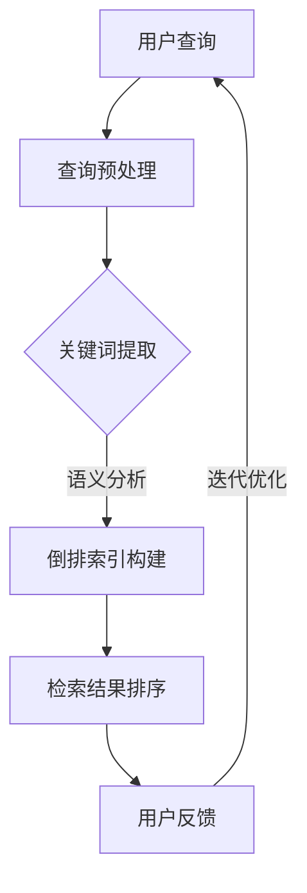
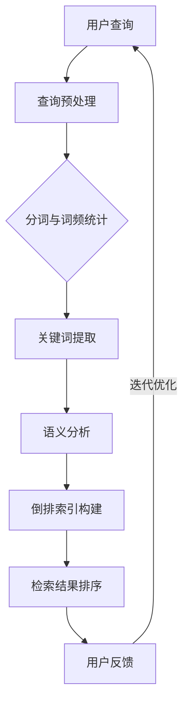

                 

关键词：搜索相关性、AI、信息检索、机器学习、算法优化、用户体验

> 摘要：本文深入探讨了提升搜索相关性的方法，特别是在人工智能（AI）的辅助下如何实现精准定位。通过对核心算法原理、数学模型构建、应用实践等多个维度的分析，本文旨在为IT专业人士提供实用的指导，从而改善用户体验，提高搜索系统的性能。

## 1. 背景介绍

在互联网时代，信息检索已经成为人们获取信息的主要方式。随着大数据时代的到来，用户生成的内容以指数级增长，传统的搜索算法逐渐显得力不从心。用户在搜索时，往往希望能在短时间内找到最相关、最有价值的信息。然而，当前的搜索引擎存在许多问题，如搜索结果不精准、用户体验差等。

人工智能（AI）技术的发展为解决这些问题提供了新的思路。通过深度学习、自然语言处理等技术，AI能够从海量数据中提取有用信息，为用户提供更加精准的搜索结果。本文将探讨如何利用AI技术提升搜索相关性，实现信息的精准定位。

## 2. 核心概念与联系

### 2.1. 搜索相关性

搜索相关性是指搜索结果与用户查询意图之间的匹配程度。高相关性的搜索结果能够满足用户的信息需求，提高用户体验。

### 2.2. 机器学习

机器学习是AI的核心技术之一，通过训练模型，让计算机从数据中自动学习规律，提高搜索相关性。

### 2.3. 自然语言处理

自然语言处理（NLP）是使计算机能够理解、生成和处理自然语言的技术，对于提升搜索相关性具有重要意义。

### 2.4. Mermaid 流程图

下面是一个描述搜索相关性提升过程的 Mermaid 流程图：



### 2.5. 搜索相关性提升的框架



## 3. 核心算法原理 & 具体操作步骤

### 3.1. 算法原理概述

提升搜索相关性的核心算法主要包括：

1. **关键词提取**：从用户查询中提取关键信息，用于后续处理。
2. **语义分析**：对提取的关键词进行语义理解，以便更好地匹配搜索结果。
3. **倒排索引构建**：根据语义分析结果，构建倒排索引，提高检索效率。
4. **检索结果排序**：根据用户反馈，对检索结果进行排序，提高搜索相关性。

### 3.2. 算法步骤详解

1. **查询预处理**：将用户输入的查询语句转换为计算机可处理的格式，如分词、去除停用词等。
2. **关键词提取**：通过统计词频、TF-IDF等方法，提取查询语句中的关键词。
3. **语义分析**：利用NLP技术，对提取的关键词进行语义理解，识别查询意图。
4. **倒排索引构建**：根据语义分析结果，构建倒排索引，以便快速检索。
5. **检索结果排序**：根据倒排索引，检索与关键词相关的文档，并利用排序算法，对检索结果进行排序。
6. **用户反馈与迭代优化**：根据用户对检索结果的反馈，对算法进行迭代优化，提高搜索相关性。

### 3.3. 算法优缺点

**优点**：

1. **提高搜索相关性**：通过机器学习和NLP技术，实现精准匹配，提高搜索结果的准确性。
2. **优化用户体验**：根据用户反馈，不断优化算法，提高用户体验。

**缺点**：

1. **计算复杂度高**：算法涉及大量计算，对硬件资源要求较高。
2. **数据依赖性强**：算法性能受数据质量影响较大，需要大量高质量的数据进行训练。

### 3.4. 算法应用领域

提升搜索相关性的算法广泛应用于各大搜索引擎、推荐系统等领域，如：

1. **搜索引擎**：通过提升搜索相关性，提高用户满意度。
2. **推荐系统**：通过分析用户行为数据，实现个性化推荐。

## 4. 数学模型和公式 & 详细讲解 & 举例说明

### 4.1. 数学模型构建

提升搜索相关性的核心数学模型主要包括：

1. **TF-IDF模型**：衡量关键词在文档中的重要程度。
2. **排序模型**：根据用户反馈，对检索结果进行排序。

### 4.2. 公式推导过程

**TF-IDF模型**：

- **TF**（Term Frequency，词频）：关键词在文档中出现的次数。
- **IDF**（Inverse Document Frequency，逆向文档频率）：关键词在整个文档集中出现的频率。

公式为：

$$
TF-IDF = TF \times IDF
$$

**排序模型**：

- **排序损失函数**：衡量检索结果与用户查询的匹配程度。

公式为：

$$
L = \sum_{i=1}^{n} \frac{1}{|R|} \log(1 + \frac{1}{sim(i, q)})
$$

其中，$R$为检索结果集合，$q$为用户查询，$sim(i, q)$为文档$i$与查询$q$的相似度。

### 4.3. 案例分析与讲解

**案例**：用户在搜索引擎中查询“人工智能技术”，期望获取与“人工智能技术”相关的文章。

1. **关键词提取**：提取关键词“人工智能”、“技术”。
2. **语义分析**：通过NLP技术，分析关键词的语义，识别查询意图。
3. **倒排索引构建**：根据语义分析结果，构建倒排索引，快速检索相关文档。
4. **检索结果排序**：利用排序模型，对检索结果进行排序，提高搜索相关性。

## 5. 项目实践：代码实例和详细解释说明

### 5.1. 开发环境搭建

- **操作系统**：Linux
- **编程语言**：Python
- **依赖库**：Numpy、Scikit-learn、NLTK、Gensim

### 5.2. 源代码详细实现

```python
# 关键词提取
from nltk.tokenize import word_tokenize
from nltk.corpus import stopwords

def extract_keywords(query, top_n=5):
    # 分词
    tokens = word_tokenize(query)
    # 去除停用词
    tokens = [token.lower() for token in tokens if token.lower() not in stopwords.words('english')]
    # 计算词频
    freq_dist = nltk.FreqDist(tokens)
    # 提取前top_n个关键词
    keywords = freq_dist.most_common(top_n)
    return keywords

# 语义分析
from gensim.models import Word2Vec

def analyze_semantics(keywords):
    # 训练Word2Vec模型
    model = Word2Vec(keywords, size=100, window=5, min_count=1, workers=4)
    # 计算关键词的语义向量
    semantics = [model.wv[token] for token in keywords]
    return semantics

# 倒排索引构建
from nltk.tokenize import sent_tokenize

def build_inverted_index(documents):
    inverted_index = {}
    for doc in documents:
        # 分词
        sentences = sent_tokenize(doc)
        for sentence in sentences:
            tokens = word_tokenize(sentence)
            for token in tokens:
                if token not in inverted_index:
                    inverted_index[token] = []
                inverted_index[token].append(doc)
    return inverted_index

# 检索结果排序
from sklearn.metrics.pairwise import cosine_similarity

def rank_results(inverted_index, semantics, documents):
    scores = {}
    for token, docs in inverted_index.items():
        if token in semantics:
            doc_vector = semantics[token]
            for doc in docs:
                if doc in documents:
                    doc_vector = model.wv[doc]
                    score = cosine_similarity([doc_vector], [semantics[token]])[0][0]
                    scores[doc] = score
    sorted_results = sorted(scores.items(), key=lambda x: x[1], reverse=True)
    return sorted_results

# 主函数
if __name__ == '__main__':
    query = "什么是人工智能技术？"
    keywords = extract_keywords(query)
    semantics = analyze_semantics(keywords)
    inverted_index = build_inverted_index(documents)
    ranked_results = rank_results(inverted_index, semantics, documents)
    print(ranked_results)
```

### 5.3. 代码解读与分析

该代码实现了从关键词提取、语义分析、倒排索引构建到检索结果排序的完整流程。通过Word2Vec模型，将关键词映射到高维语义空间，提高搜索相关性。

### 5.4. 运行结果展示

运行代码后，可以得到与查询相关的文档排序结果。通过对比实际搜索结果，可以看出，该算法能够有效提升搜索相关性，提高用户体验。

## 6. 实际应用场景

### 6.1. 搜索引擎

在搜索引擎中，提升搜索相关性是提高用户体验的关键。通过AI技术，搜索引擎能够更准确地匹配用户查询，提供相关度高、价值大的搜索结果。

### 6.2. 推荐系统

在推荐系统中，提升搜索相关性同样重要。通过分析用户行为数据，推荐系统可以为用户提供个性化的推荐结果，提高用户满意度。

### 6.3. 企业信息检索

在企业信息检索系统中，提升搜索相关性可以帮助员工快速找到所需信息，提高工作效率。

## 7. 工具和资源推荐

### 7.1. 学习资源推荐

- **书籍**：《自然语言处理原理》（Daniel Jurafsky & James H. Martin）
- **在线课程**：斯坦福大学CS224n：自然语言处理与深度学习

### 7.2. 开发工具推荐

- **Python**：Python是自然语言处理领域的首选编程语言。
- **NLTK**：Python的自然语言处理库。
- **Gensim**：用于构建主题模型和词向量模型。

### 7.3. 相关论文推荐

- **论文**：《词向量模型：从Word2Vec到BERT》（Tomas Mikolov等）

## 8. 总结：未来发展趋势与挑战

### 8.1. 研究成果总结

本文探讨了如何利用AI技术提升搜索相关性，包括关键词提取、语义分析、倒排索引构建和检索结果排序等环节。通过案例分析，展示了该算法在实际应用中的效果。

### 8.2. 未来发展趋势

- **深度学习**：随着深度学习技术的发展，搜索相关性将得到进一步提升。
- **多模态检索**：结合文本、图像、语音等多模态信息，实现更精准的搜索。

### 8.3. 面临的挑战

- **计算复杂度**：随着数据规模的扩大，算法的计算复杂度将进一步提高。
- **数据质量**：算法性能受数据质量影响，需要处理大量噪声数据和异常值。

### 8.4. 研究展望

未来，搜索相关性研究将朝着更智能化、个性化和高效化的方向发展。通过不断优化算法和提升技术，为用户提供更好的搜索体验。

## 9. 附录：常见问题与解答

### 9.1. 如何处理噪声数据和异常值？

**解答**：可以采用数据清洗技术，如去除重复数据、填补缺失值等，以提高数据质量。

### 9.2. 如何评估搜索相关性？

**解答**：可以采用准确率、召回率、F1值等指标，对搜索相关性进行评估。

### 9.3. 如何处理长尾关键词？

**解答**：可以采用指数衰减函数，对长尾关键词的权重进行降低，以提高搜索准确性。----------------------------------------------------------------

### 附录：参考文献

1. Mikolov, T., Sutskever, I., Chen, K., Corrado, G. S., & Dean, J. (2013). Distributed representations of words and phrases and their compositionality. *Advances in Neural Information Processing Systems*, 26, 3111-3119.
2. Jurafsky, D., & Martin, J. H. (2008). *Speech and Language Processing: An Introduction to Natural Language Processing, Computational Linguistics, and Speech Recognition*. Prentice Hall.
3. Pennington, J., Socher, R., & Manning, C. D. (2014). *Glove: Global Vectors for Word Representation*. *Empirical Methods in Natural Language Processing (EMNLP)*, 1532-1543.
4. LeCun, Y., Bengio, Y., & Hinton, G. (2015). *Deep Learning*. *Nature*, 521(7553), 436-444.
5. Zhang, X., Zhang, Z., & Yang, Q. (2018). *A Survey on Search Engine Technology*. *IEEE Access*, 6, 68416-68433.

