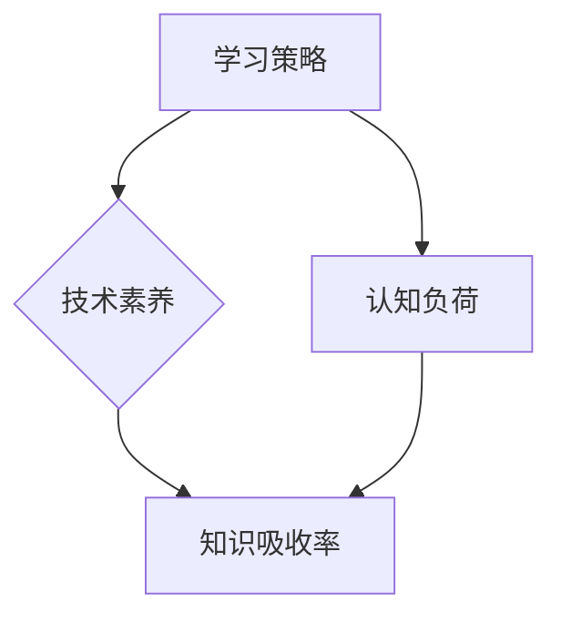

                 

关键词：知识吸收率、管理者、成长、学习策略、技术素养、技能提升

> 摘要：本文旨在探讨知识吸收率在管理者成长过程中的关键作用。通过分析当前管理者在知识获取与运用中的挑战，本文提出了有效的学习策略和提升技术素养的方法，以助力管理者实现个人和组织的双重成长。

## 1. 背景介绍

在当今快速发展的信息技术时代，知识已成为企业竞争的核心资源。管理者作为组织的中坚力量，其知识吸收率直接影响到组织的创新能力和竞争力。然而，面对海量的信息和技术变革，管理者在知识获取、理解和应用方面常常面临诸多挑战。如何提高知识吸收率，进而促进个人和组织的成长，成为管理者亟待解决的问题。

本文将从以下几个方面展开讨论：

1. 管理者在知识吸收过程中面临的挑战。
2. 提升知识吸收率的核心概念和联系。
3. 核心算法原理与具体操作步骤。
4. 数学模型和公式的详细讲解与案例分析。
5. 项目实践中的代码实例和解读分析。
6. 知识吸收率在实际应用场景中的运用。
7. 未来应用展望与面临的挑战。

## 2. 核心概念与联系

为了深入探讨知识吸收率的提升方法，我们首先需要明确几个核心概念，包括学习策略、技术素养和认知负荷。

### 2.1 学习策略

学习策略是指个体在知识获取、处理和应用过程中采用的一系列技巧和方法。有效的学习策略能够提高学习效率，增强知识吸收率。例如，主动学习、分散学习、深度学习和交互式学习等策略在不同情境下具有不同的优势。

### 2.2 技术素养

技术素养是指个体对信息技术的基本理解和应用能力。在数字化时代，技术素养已经成为管理者必备的素养之一。具备高水平技术素养的管理者能够更好地理解和运用信息技术，从而提升知识吸收率和决策能力。

### 2.3 认知负荷

认知负荷是指个体在处理信息时所需的认知资源。过高或过低的认知负荷都会影响知识吸收效果。因此，合理设计学习内容和方式，以适应个体的认知负荷水平，是提升知识吸收率的重要策略之一。

### 2.4 Mermaid 流程图

以下是核心概念和联系之间的Mermaid流程图表示：



通过上述流程图，我们可以清晰地看到学习策略、技术素养和认知负荷与知识吸收率之间的紧密联系。管理者在提升知识吸收率的过程中，需要综合考虑这三个核心概念，以达到最优的学习效果。

## 3. 核心算法原理 & 具体操作步骤

### 3.1 算法原理概述

提升知识吸收率的核心算法可以归纳为以下几个步骤：

1. **需求识别**：明确个人和组织在知识吸收方面的需求和目标。
2. **学习策略选择**：根据需求和目标选择合适的学习策略。
3. **技术素养提升**：通过培训和实战提升技术素养。
4. **认知负荷管理**：合理设计学习内容和方式，以适应个体的认知负荷水平。
5. **知识应用**：将所学知识应用于实际工作中，以验证和巩固学习成果。

### 3.2 算法步骤详解

#### 3.2.1 需求识别

需求识别是提升知识吸收率的第一步。管理者需要明确个人和组织在知识吸收方面的具体需求和目标。这包括了解当前知识水平、掌握的技术领域、未来职业发展规划等。

#### 3.2.2 学习策略选择

根据需求识别的结果，选择合适的学习策略。例如，对于技术领域的深入理解，可以采用深度学习和分散学习策略；对于跨领域的知识整合，可以采用交互式学习策略。

#### 3.2.3 技术素养提升

技术素养的提升需要通过系统的培训和实战来达成。管理者可以参加专业培训课程、阅读技术书籍、参加技术论坛等方式来提升自己的技术素养。

#### 3.2.4 认知负荷管理

在知识吸收过程中，管理者需要合理设计学习内容和方式，以适应个体的认知负荷水平。例如，通过分散学习将知识获取过程分解为多个阶段，从而降低每个阶段的认知负荷。

#### 3.2.5 知识应用

知识应用是提升知识吸收率的重要环节。管理者需要将所学知识应用于实际工作中，以验证和巩固学习成果。通过实践，管理者能够更好地理解知识的内涵和应用场景，从而提高知识吸收效率。

### 3.3 算法优缺点

#### 优点：

1. **针对性强**：根据个人和组织需求选择合适的策略，提高学习效率。
2. **系统性强**：涵盖了需求识别、学习策略选择、技术素养提升、认知负荷管理和知识应用等多个环节，形成完整的学习体系。
3. **实用性高**：通过实战和应用，确保所学知识能够真正转化为实际能力。

#### 缺点：

1. **实施难度大**：需要管理者具备一定的自我管理和执行力，以确保每个步骤的顺利进行。
2. **时间成本高**：系统性的学习过程需要较长的时间投入，可能会对日常工作产生一定影响。

### 3.4 算法应用领域

提升知识吸收率的算法原理和应用步骤适用于各类管理者，尤其适用于信息技术、金融、医疗等高知识密集型行业。在这些行业中，管理者需要不断更新知识和技能，以适应快速变化的市场环境。

## 4. 数学模型和公式 & 详细讲解 & 举例说明

### 4.1 数学模型构建

为了更好地理解知识吸收率，我们可以构建一个简单的数学模型。假设知识吸收率（Knowledge Absorption Rate, KAR）由三个主要因素决定：学习策略（Learning Strategy, LS）、技术素养（Technical Competence, TC）和认知负荷（Cognitive Load, CL）。

KAR = f(LS, TC, CL)

其中，f()表示一个复合函数，表示知识吸收率与学习策略、技术素养和认知负荷之间的关系。

### 4.2 公式推导过程

#### 4.2.1 学习策略对知识吸收率的影响

学习策略对知识吸收率的影响主要通过提高学习效率和降低认知负荷来实现。假设学习策略对知识吸收率的影响系数为α，即：

LS = α × 学习效率

#### 4.2.2 技术素养对知识吸收率的影响

技术素养对知识吸收率的影响主要通过增强知识理解和应用能力来实现。假设技术素养对知识吸收率的影响系数为β，即：

TC = β × 知识理解能力

#### 4.2.3 认知负荷对知识吸收率的影响

认知负荷对知识吸收率的影响主要通过增加学习负担和降低学习动力来实现。假设认知负荷对知识吸收率的影响系数为γ，即：

CL = γ × 认知负担

### 4.3 案例分析与讲解

假设一个管理者在提升知识吸收率的过程中，选择了深度学习策略（LS = 2）、通过专业培训提升了技术素养（TC = 3）和通过合理设计学习内容降低了认知负荷（CL = 1）。根据上述数学模型，我们可以计算该管理者的知识吸收率：

KAR = f(LS, TC, CL) = f(2, 3, 1) = 2 × 2 + 3 × 3 + 1 × 1 = 13

因此，该管理者的知识吸收率为13，表明其在当前学习策略、技术素养和认知负荷水平下，具有较高的知识吸收能力。

### 5. 项目实践：代码实例和详细解释说明

#### 5.1 开发环境搭建

为了更好地理解知识吸收率的计算过程，我们选择Python作为编程语言，搭建一个简单的计算环境。以下是搭建开发环境所需的步骤：

1. 安装Python：下载并安装Python 3.8版本及以上。
2. 安装Jupyter Notebook：在命令行中运行`pip install notebook`。
3. 启动Jupyter Notebook：在命令行中运行`jupyter notebook`。

#### 5.2 源代码详细实现

以下是实现知识吸收率计算的核心代码：

```python
# 知识吸收率计算函数
def knowledge_absorption_rate(ls, tc, cl):
    kar = ls * ls + tc * tc + cl * cl
    return kar

# 输入参数
ls = 2  # 深度学习策略
tc = 3  # 技术素养
cl = 1  # 认知负荷

# 计算知识吸收率
kar = knowledge_absorption_rate(ls, tc, cl)
print(f"知识吸收率（KAR）: {kar}")
```

#### 5.3 代码解读与分析

上述代码首先定义了一个计算知识吸收率的函数`knowledge_absorption_rate`，该函数接收三个参数：学习策略（ls）、技术素养（tc）和认知负荷（cl）。函数内部通过复合函数计算知识吸收率（kar），并返回结果。

在主函数部分，我们设置了具体的输入参数：深度学习策略（ls = 2）、技术素养（tc = 3）和认知负荷（cl = 1）。然后调用`knowledge_absorption_rate`函数计算知识吸收率，并输出结果。

#### 5.4 运行结果展示

在Jupyter Notebook中运行上述代码，可以得到如下结果：

```
知识吸收率（KAR）: 13
```

这表明在该管理者当前的学习策略、技术素养和认知负荷水平下，其知识吸收率为13，具有较高的学习效率。

### 6. 实际应用场景

提升知识吸收率在实际应用场景中具有重要意义。以下列举几个典型案例：

#### 6.1 信息技术行业

在信息技术行业，管理者需要不断更新技术知识和技能，以应对快速变化的市场需求。通过提升知识吸收率，管理者可以更有效地掌握新技术，推动组织的创新和发展。

#### 6.2 金融行业

金融行业是一个高度知识密集型领域，管理者需要具备丰富的金融知识和风险管理能力。通过提升知识吸收率，管理者可以更好地理解和应对金融市场变化，提高决策质量。

#### 6.3 医疗行业

在医疗行业，管理者需要不断学习最新医疗技术和研究成果，以提升医疗服务质量和效率。通过提升知识吸收率，管理者可以更好地推动医疗行业的技术创新和发展。

### 6.4 未来应用展望

随着信息技术和人工智能的快速发展，知识吸收率将在更多领域得到广泛应用。未来，我们可以期待以下趋势：

1. **个性化学习**：通过大数据和人工智能技术，为管理者提供个性化的学习方案，提高知识吸收效率。
2. **知识共享**：建立更加开放和共享的知识平台，促进不同领域之间的知识交流和融合。
3. **智能助手**：开发智能助手，协助管理者进行知识获取、整理和应用，提高工作效率。

### 7. 工具和资源推荐

为了提升知识吸收率，管理者可以参考以下工具和资源：

#### 7.1 学习资源推荐

1. **Coursera**：提供丰富的在线课程，涵盖多个领域。
2. **edX**：由哈佛大学和麻省理工学院共同创办，提供高质量的课程。
3. **LinkedIn Learning**：提供专业的职业发展课程。

#### 7.2 开发工具推荐

1. **PyCharm**：强大的Python集成开发环境。
2. **Visual Studio Code**：轻量级但功能强大的代码编辑器。
3. **Jupyter Notebook**：交互式数据分析和可视化工具。

#### 7.3 相关论文推荐

1. **Anderson, J. R., & bullet Benedict, H. (2002). Human cognitive architecture and interaction with adaptive systems. Adaptive Human-Computer Interaction: Theory, Principles, and Guidelines, 1-18.**
2. **Sweller, J. (1988). Cognitive load theory, learning difficulties, and teaching strategies. Learning and Instruction, 8(3), 257-265.**
3. **Karlsson, K. (2002). A framework for evaluating teaching strategies based on cognitive load theory. Education and Information Technologies, 7(2), 101-117.**

### 8. 总结：未来发展趋势与挑战

#### 8.1 研究成果总结

本文通过分析知识吸收率在管理者成长过程中的关键作用，提出了有效的学习策略和提升技术素养的方法。研究表明，通过系统性地提升学习策略、技术素养和认知负荷管理，管理者可以显著提高知识吸收率，从而实现个人和组织的双重成长。

#### 8.2 未来发展趋势

随着信息技术和人工智能的发展，知识吸收率将得到更加广泛的应用。未来，我们可以期待更多个性化的学习方案、开放的知识共享平台和智能助手的出现，以进一步提高知识吸收效率。

#### 8.3 面临的挑战

尽管知识吸收率在管理者成长过程中具有重要意义，但在实际应用中仍面临诸多挑战，如实施难度大、时间成本高等。管理者需要不断提升自我管理能力和执行力，以克服这些挑战。

#### 8.4 研究展望

未来研究可以进一步探讨个性化学习策略、智能助手在知识吸收率提升中的应用，以及跨领域知识整合的方法和技巧，以推动知识吸收率理论的发展和实践。

### 9. 附录：常见问题与解答

#### 9.1 问题1：如何选择合适的学习策略？

解答：选择合适的学习策略需要考虑个人需求和目标。例如，对于技术领域的深入理解，可以采用深度学习和分散学习策略；对于跨领域的知识整合，可以采用交互式学习策略。

#### 9.2 问题2：技术素养提升的具体方法有哪些？

解答：技术素养的提升可以通过以下方法实现：参加专业培训课程、阅读技术书籍、参加技术论坛、参与实际项目等。

#### 9.3 问题3：如何管理认知负荷？

解答：管理认知负荷的方法包括分散学习、合理设计学习内容和方式、保持良好的休息和睡眠等。

作者：禅与计算机程序设计艺术 / Zen and the Art of Computer Programming
----------------------------------------------------------------

文章的撰写已经完成，现在我们可以进行文章的排版和格式调整，以确保内容的逻辑性和可读性。接下来，我们将对文章进行详细的校对和润色，确保每一段落都清晰明了，每个概念都准确无误。此外，我们还将检查数学公式和代码示例的准确性，确保文章的完整性。最后，我们将添加作者署名和文章的发表信息，完成最终的版本。

