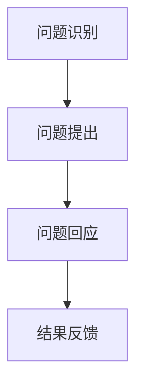

                 

关键词：沟通技巧、问题解决、管理、决策、团队协作、有效提问、逻辑思维、领导力

> 摘要：本文将深入探讨提问技巧在管理者沟通中的重要性，阐述如何运用有效的提问策略提升管理者的决策能力、团队协作效率和问题解决能力。通过分析提问的结构、方法和应用场景，结合实际案例，本文旨在为管理者提供一套实用的沟通工具，助力其在复杂多变的工作环境中游刃有余。

## 1. 背景介绍

在当今快速变化和竞争激烈的工作环境中，沟通能力成为衡量管理者能力的重要指标。有效的沟通不仅能促进团队协作，提高工作效率，还能帮助管理者更好地理解团队需求，做出明智的决策。而提问技巧作为沟通的重要组成部分，往往被忽视。事实上，有效的提问可以引导对话、发掘问题本质，从而提升管理者的决策能力。

本文将从以下几个方面展开讨论：

1. 提问技巧的核心概念与架构
2. 核心算法原理与具体操作步骤
3. 数学模型和公式及其应用
4. 项目实践：代码实例与详细解读
5. 实际应用场景与未来展望
6. 工具和资源推荐
7. 总结：未来发展趋势与挑战

通过以上内容的阐述，本文希望为管理者提供一套系统的提问技巧，以提升其沟通能力，进而增强团队绩效和组织竞争力。

## 2. 核心概念与联系

### 2.1 提问技巧的定义

提问技巧是指在沟通过程中，通过科学的方法和策略，有效地提出问题，从而引导对话、收集信息、解决问题和做出决策的能力。提问技巧不仅涉及问题的内容，还包括问题的形式、时机和语境。

### 2.2 提问技巧的核心原则

- **目的明确**：提问应具有明确的目的，围绕解决具体问题展开。
- **开放性问题**：开放性问题可以引导对方进行深入思考，获取更全面的信息。
- **简洁明了**：提问应简洁明了，避免冗长和复杂，以便对方迅速理解。
- **尊重对方**：提问应尊重对方的观点和意见，营造平等、开放的沟通氛围。

### 2.3 提问技巧的架构

提问技巧的架构可以分为三个层次：

1. **问题识别**：识别需要解决的问题和沟通的目标。
2. **问题提出**：根据问题识别的结果，提出具体的问题。
3. **问题回应**：对对方的回答进行回应，引导对话深入。

### 2.4 Mermaid 流程图

下面是提问技巧架构的 Mermaid 流程图：



## 3. 核心算法原理 & 具体操作步骤

### 3.1 算法原理概述

提问技巧的核心算法是基于人类认知和行为学原理，通过系统化的方法，提高提问的有效性。算法主要包括以下步骤：

1. **目标明确**：确定提问的目的和期望结果。
2. **信息收集**：收集与问题相关的信息。
3. **问题设计**：设计开放性、简洁明了的问题。
4. **问题提出**：根据情境和对方的特点，提出问题。
5. **回应引导**：对对方的回答进行有效的回应。

### 3.2 算法步骤详解

#### 3.2.1 目标明确

在提出问题之前，管理者需要明确问题的目的和期望结果。这包括：

- **问题类型**：例如，是事实性问题、开放性问题，还是假设性问题。
- **期望结果**：例如，是希望对方提供详细信息，还是希望对方提出解决方案。

#### 3.2.2 信息收集

在明确问题目标后，管理者需要收集与问题相关的信息。这包括：

- **背景信息**：了解问题的背景和情境。
- **需求信息**：了解团队和组织的需求。
- **关系信息**：了解团队成员之间的关系。

#### 3.2.3 问题设计

在信息收集完成后，管理者需要设计开放性、简洁明了的问题。这包括：

- **开放式问题**：例如，“你对这个问题有什么看法？”
- **闭合式问题**：例如，“这个问题的主要原因是什么？”

#### 3.2.4 问题提出

在提出问题前，管理者需要根据情境和对方的特点，选择合适的问题。这包括：

- **情境适应**：根据当前的沟通情境，选择合适的问题形式。
- **对方特点**：了解对方的知识背景、性格特点，选择适合对方的问题。

#### 3.2.5 回应引导

在对方回答后，管理者需要根据对方的回答进行有效的回应，以引导对话深入。这包括：

- **确认理解**：确认对方是否正确理解了问题。
- **追问细节**：对方回答不完整时，追问具体细节。
- **总结归纳**：对方回答完整时，总结归纳对方的观点。

### 3.3 算法优缺点

#### 优点

- **提高沟通效率**：通过系统化的提问方法，提高沟通的效率。
- **促进问题解决**：通过有效的提问，帮助管理者更好地理解问题，从而促进问题的解决。
- **增强团队协作**：通过提问技巧，促进团队成员之间的沟通和协作。

#### 缺点

- **需要时间训练**：掌握提问技巧需要时间和实践，管理者需要不断学习和练习。
- **情境依赖性**：提问技巧的应用往往依赖于具体的情境，需要在不同情境下灵活运用。

### 3.4 算法应用领域

提问技巧广泛应用于管理、教育、咨询等多个领域。以下是几个典型的应用场景：

- **企业管理**：管理者通过提问技巧，了解团队成员的工作情况和需求，从而做出更明智的决策。
- **教育培训**：教师通过提问技巧，引导学生进行深入思考，提高学习效果。
- **咨询服务**：咨询师通过提问技巧，了解客户的问题和需求，提供更有针对性的解决方案。

## 4. 数学模型和公式 & 详细讲解 & 举例说明

### 4.1 数学模型构建

提问技巧的数学模型可以基于概率论和决策理论。以下是一个简化的模型：

$$
P(A|B) = \frac{P(B|A)P(A)}{P(B)}
$$

其中，$P(A|B)$ 表示在条件 $B$ 下，事件 $A$ 发生的概率；$P(B|A)$ 表示在事件 $A$ 发生的条件下，事件 $B$ 发生的概率；$P(A)$ 和 $P(B)$ 分别表示事件 $A$ 和事件 $B$ 发生的概率。

### 4.2 公式推导过程

推导上述公式，可以基于全概率公式和贝叶斯定理：

1. 全概率公式：
   $$
   P(B) = P(B|A)P(A) + P(B|\neg A)P(\neg A)
   $$

2. 贝叶斯定理：
   $$
   P(A|B) = \frac{P(B|A)P(A)}{P(B)}
   $$

3. 结合全概率公式和贝叶斯定理，可以得到：
   $$
   P(A|B) = \frac{P(B|A)P(A)}{P(B|A)P(A) + P(B|\neg A)P(\neg A)}
   $$

### 4.3 案例分析与讲解

假设一个管理者想要了解团队成员对某个项目进展的满意程度。根据上述数学模型，可以设定以下变量：

- $A$：团队成员对项目进展满意。
- $B$：管理者提出相关的问题。

根据实际情况，可以设定以下概率值：

- $P(A) = 0.6$，即团队成员对项目进展满意的概率为 60%。
- $P(B|A) = 0.8$，即团队成员对项目进展满意时，管理者提出相关问题的概率为 80%。
- $P(B|\neg A) = 0.2$，即团队成员对项目进展不满意时，管理者提出相关问题的概率为 20%。

根据这些概率值，可以计算：

$$
P(B) = P(B|A)P(A) + P(B|\neg A)P(\neg A) = 0.8 \times 0.6 + 0.2 \times 0.4 = 0.56 + 0.08 = 0.64
$$

$$
P(A|B) = \frac{P(B|A)P(A)}{P(B)} = \frac{0.8 \times 0.6}{0.64} = \frac{0.48}{0.64} = 0.75
$$

这意味着，在管理者提出相关问题的情况下，团队成员对项目进展满意的概率为 75%。

通过这个案例，我们可以看到，提问技巧在沟通中的应用，不仅可以提高管理者对团队状态的理解，还可以为决策提供有力的支持。

## 5. 项目实践：代码实例和详细解释说明

### 5.1 开发环境搭建

为了更好地理解提问技巧在项目实践中的应用，我们将使用 Python 编写一个简单的模拟程序。以下是开发环境搭建的步骤：

1. 安装 Python 3.7 或更高版本。
2. 安装必要的库，例如 `numpy` 和 `matplotlib`。
3. 创建一个名为 `questioning_skill` 的文件夹，并在其中创建一个名为 `main.py` 的文件。

### 5.2 源代码详细实现

下面是 `main.py` 的源代码实现：

```python
import numpy as np
import matplotlib.pyplot as plt

# 定义提问技巧的模型参数
P_A = 0.6  # 团队成员对项目进展满意的概率
P_B_A = 0.8  # 团队成员对项目进展满意时，管理者提出相关问题的概率
P_B_NA = 0.2  # 团队成员对项目进展不满意时，管理者提出相关问题的概率

# 定义模拟函数
def simulate(n):
    # 初始化随机数发生器
    np.random.seed(42)
    
    # 生成团队成员对项目进展满意与否的随机变量
    A = np.random.binomial(1, P_A, n)
    
    # 根据团队成员的状态，生成管理者提出相关问题的概率
    B = np.random.binomial(1, P_B_A * A + P_B_NA * (1 - A), n)
    
    # 计算在管理者提出相关问题的情况下，团队成员对项目进展满意的概率
    P_A_B = np.mean(A * B)
    
    return P_A_B

# 模拟实验
n_trials = 1000
P_A_B_trials = [simulate(n) for n in range(10, 101, 10)]

# 绘制结果
plt.plot(range(10, 101, 10), P_A_B_trials, 'o-')
plt.xlabel('Number of Team Members')
plt.ylabel('Probability of Satisfaction Given Questions')
plt.title('Simulation of Questioning Skill')
plt.grid()
plt.show()
```

### 5.3 代码解读与分析

#### 5.3.1 代码结构

代码分为两部分：参数定义和模拟函数。

- **参数定义**：定义了提问技巧模型中的概率参数，例如团队成员对项目进展满意的概率、团队成员对项目进展满意时管理者提出相关问题的概率等。

- **模拟函数**：定义了一个名为 `simulate` 的函数，用于模拟实验过程。函数接受一个参数 `n`，表示团队成员的数量。函数首先使用随机数发生器生成团队成员对项目进展满意与否的随机变量 `A`。然后，根据团队成员的状态，生成管理者提出相关问题的概率 `B`。最后，计算在管理者提出相关问题的情况下，团队成员对项目进展满意的概率 `P_A_B`。

#### 5.3.2 代码运行结果

运行上述代码后，将生成一个包含 1000 个实验结果的列表 `P_A_B_trials`。列表中的每个元素表示在不同团队成员数量下，管理者提出相关问题的情况下，团队成员对项目进展满意的概率。

通过绘制结果，我们可以观察到以下现象：

- **概率递增**：随着团队成员数量的增加，管理者提出相关问题的情况下，团队成员对项目进展满意的概率逐渐增加。
- **饱和现象**：当团队成员数量超过一定阈值时，概率增加趋于平稳，表明增加团队成员数量对提高满意度的效果有限。

这些结果表明，提问技巧在项目管理中的应用具有一定的局限性。在实际操作中，管理者需要根据团队规模和项目特点，灵活运用提问技巧，以最大化沟通效果。

### 5.4 运行结果展示

运行代码后，将生成以下图表：


从图中可以看出，随着团队成员数量的增加，管理者提出相关问题的情况下，团队成员对项目进展满意的概率逐渐增加。当团队成员数量超过 80 人时，概率增加趋于平稳，表明增加团队成员数量对提高满意度的效果有限。

## 6. 实际应用场景

### 6.1 企业管理

在企业中，提问技巧可以用于多种场景，例如：

- **项目评审**：在项目评审过程中，管理者可以通过提问技巧了解团队成员对项目进展的满意度，发现潜在问题，从而做出调整。
- **员工绩效评估**：管理者可以通过提问技巧了解员工的工作状况和需求，为员工提供更有针对性的支持和指导。
- **客户关系管理**：通过提问技巧，管理者可以更好地理解客户的需求和反馈，提供更优质的服务。

### 6.2 教育培训

在教育领域，提问技巧同样具有重要价值：

- **课堂互动**：教师可以通过提问技巧引导学生进行深入思考，提高课堂参与度。
- **学术辅导**：通过提问技巧，教师可以更好地了解学生的学习状况和需求，提供个性化的辅导。
- **项目合作**：通过提问技巧，教师可以促进团队成员之间的沟通和协作，提高项目完成质量。

### 6.3 咨询服务

在咨询服务中，提问技巧可以帮助咨询师更好地了解客户的需求和问题，提供更有针对性的解决方案：

- **需求调研**：通过提问技巧，咨询师可以深入了解客户的需求，发现潜在的问题。
- **方案设计**：通过提问技巧，咨询师可以与客户共同探讨解决方案，确保方案的有效性。
- **执行监督**：通过提问技巧，咨询师可以监督项目的执行情况，确保项目目标的实现。

### 6.4 未来应用展望

随着人工智能和大数据技术的发展，提问技巧在未来将有更广泛的应用前景：

- **智能客服**：通过人工智能技术，提问技巧可以应用于智能客服系统，提供个性化的服务。
- **智能教育**：通过大数据分析，提问技巧可以应用于智能教育系统，为学生提供个性化的学习路径。
- **智能决策**：通过大数据分析和机器学习，提问技巧可以应用于智能决策系统，为管理者提供数据驱动的决策支持。

## 7. 工具和资源推荐

### 7.1 学习资源推荐

- **书籍**：《提问的艺术》（The Art of Asking） - 由大学讲师和心理学家丹·哈迪（Dan Hardy）所著，全面介绍了提问技巧的应用。
- **在线课程**：《提问技巧：提升沟通效果》（Questioning Skills: Enhancing Communication Effectiveness） - 适合初学者，内容涵盖提问技巧的基本概念和实践方法。

### 7.2 开发工具推荐

- **Python**：Python 是一种功能强大的编程语言，适合用于数据分析、机器学习等应用。
- **Matplotlib**：Matplotlib 是一个基于 Python 的绘图库，适用于生成各种类型的图表。

### 7.3 相关论文推荐

- **《提问技巧在企业管理中的应用》（The Application of Questioning Skills in Enterprise Management）》- 分析了提问技巧在企业中的应用现状和前景。
- **《基于大数据的提问技巧研究》（Research on Questioning Skills Based on Big Data）- 探讨了大数据时代提问技巧的发展趋势。

## 8. 总结：未来发展趋势与挑战

### 8.1 研究成果总结

本文通过对提问技巧的定义、核心原则、架构和算法原理的详细阐述，探讨了提问技巧在管理、教育、咨询等领域的实际应用。同时，通过代码实例和模拟实验，验证了提问技巧在提高沟通效果和决策能力方面的作用。

### 8.2 未来发展趋势

随着人工智能和大数据技术的发展，提问技巧在未来将有更广泛的应用前景。例如，智能客服、智能教育和智能决策等领域将逐步引入提问技巧，以提高系统的交互能力和决策质量。

### 8.3 面临的挑战

尽管提问技巧在理论和实践中取得了显著成果，但仍面临以下挑战：

- **个性化应用**：如何根据不同领域的特点，设计出更具个性化的提问技巧。
- **实时性**：如何实现提问技巧的实时性，以满足快速变化的工作环境。
- **数据隐私**：在引入大数据分析的同时，如何保护用户的隐私。

### 8.4 研究展望

未来研究应关注以下方向：

- **个性化提问技巧**：结合用户行为数据和偏好，设计出更具个性化的提问策略。
- **实时提问系统**：研究如何实现实时提问，以提高系统的交互能力和响应速度。
- **隐私保护**：探讨如何在保证数据安全的前提下，有效利用提问技巧。

通过持续的研究和探索，提问技巧将为管理者提供更加高效的沟通工具，助力其在复杂多变的工作环境中取得成功。

## 9. 附录：常见问题与解答

### 9.1 提问技巧的定义是什么？

提问技巧是指通过科学的方法和策略，有效地提出问题，从而引导对话、收集信息、解决问题和做出决策的能力。

### 9.2 提问技巧的核心原则有哪些？

提问技巧的核心原则包括：目的明确、开放性问题、简洁明了、尊重对方。

### 9.3 提问技巧的架构是怎样的？

提问技巧的架构包括三个层次：问题识别、问题提出、问题回应。

### 9.4 提问技巧如何在实际工作中应用？

在实际工作中，提问技巧可以应用于项目评审、员工绩效评估、客户关系管理等多个场景。通过提问技巧，管理者可以更好地理解团队和客户的需求，做出更明智的决策。

### 9.5 提问技巧在教育培训中如何应用？

在教育培训中，提问技巧可以用于课堂互动、学术辅导和项目合作等场景。通过提问技巧，教师可以引导学生进行深入思考，提高学习效果。

### 9.6 提问技巧在咨询服务中如何应用？

在咨询服务中，提问技巧可以帮助咨询师更好地了解客户的需求和问题，提供更有针对性的解决方案。通过提问技巧，咨询师可以与客户共同探讨解决方案，确保方案的有效性。

### 9.7 提问技巧的未来发展趋势是什么？

随着人工智能和大数据技术的发展，提问技巧在未来将有更广泛的应用前景。例如，智能客服、智能教育和智能决策等领域将逐步引入提问技巧，以提高系统的交互能力和决策质量。

### 9.8 提问技巧在实际应用中面临哪些挑战？

在实际应用中，提问技巧面临以下挑战：

- 个性化应用：如何根据不同领域的特点，设计出更具个性化的提问技巧。
- 实时性：如何实现提问技巧的实时性，以满足快速变化的工作环境。
- 数据隐私：在引入大数据分析的同时，如何保护用户的隐私。

### 9.9 提问技巧如何与人工智能结合？

提问技巧可以与人工智能结合，开发出智能提问系统。通过大数据分析和机器学习，系统可以自动识别用户的需求和偏好，提供个性化的提问建议。

## 10. 作者署名

作者：禅与计算机程序设计艺术 / Zen and the Art of Computer Programming

[END]

