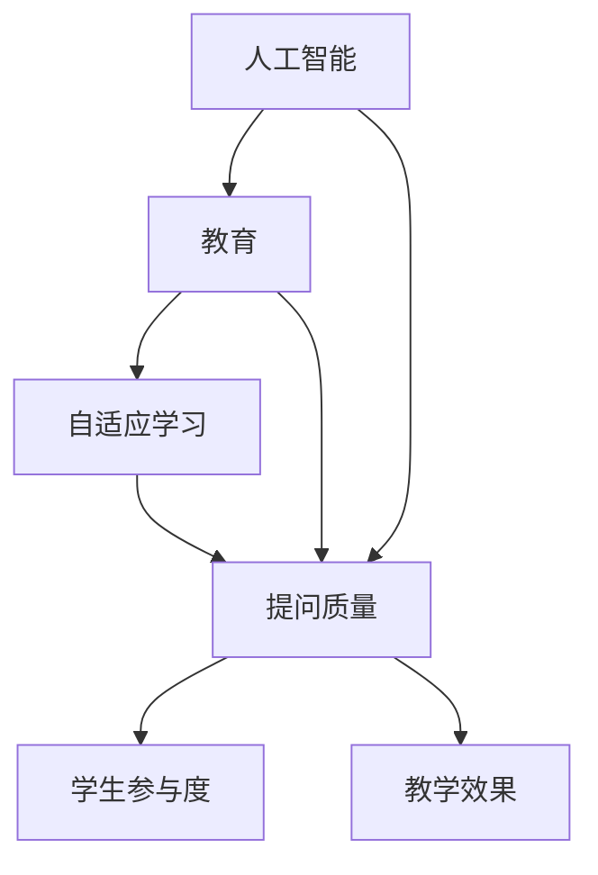

                 

 关键词：人工智能、教育技术、提问质量、学生参与、教学效果、自适应学习、个性化学习。

> 摘要：本文探讨了人工智能在教育领域的应用，特别是如何通过提高提问质量来增强学生的学习体验和教学效果。文章首先介绍了AI在教育中的应用场景，然后分析了如何利用AI技术来优化提问过程，提高提问质量，从而促进学生主动参与和深入学习。

## 1. 背景介绍

在过去的几十年里，人工智能（AI）技术的迅猛发展已经深刻改变了我们的生活方式。在教育领域，AI技术的应用也逐渐成为热点。从自适应学习系统到智能辅导工具，AI正在为教师和学生提供更加个性化和高效的学习体验。然而，一个重要的因素经常被忽视，那就是提问质量。

有效的提问不仅能够激发学生的思维，还能够促进知识的内化。然而，传统的教育模式中，提问往往流于形式，缺乏针对性和深度。这使得学生难以真正理解和掌握所学内容。随着AI技术的进步，我们有机会利用这一工具来提高提问质量，从而提升教育效果。

本文将探讨以下问题：

- AI技术如何在教育中发挥作用？
- 提问质量的重要性及其对教育的影响？
- 如何利用AI技术来优化提问过程？
- AI在教育中的应用案例和未来展望。

## 2. 核心概念与联系

为了深入理解AI在教育中的应用，我们首先需要了解几个核心概念和它们之间的联系。以下是使用Mermaid绘制的流程图，展示了这些概念之间的关系：



### 2.1 人工智能与教育

人工智能是指计算机系统执行任务的能力，类似于人类的智能。在教育领域，AI可以通过数据分析、机器学习和自然语言处理等技术，为学生提供个性化的学习资源和指导。

### 2.2 自适应学习

自适应学习是一种利用AI技术根据学生的行为和表现调整学习内容和路径的方法。这种方法可以极大地提高学习的针对性和效率。

### 2.3 提问质量

提问质量是指问题的设计、提出和解答过程中的有效性。高质量的问题能够激发学生的思考，促进知识的内化和应用。

### 2.4 学生参与度

学生参与度是指学生在学习过程中的积极程度。高参与度可以增强学生的学习动力，提高学习效果。

### 2.5 教学效果

教学效果是指教学活动达到预期目标的能力。高质量的提问可以提升教学效果，促进学生的深入学习和理解。

通过这个流程图，我们可以看到这些概念之间的紧密联系。AI技术通过自适应学习和优化提问质量，提高了学生的参与度和教学效果。

## 3. 核心算法原理 & 具体操作步骤

### 3.1 算法原理概述

提高提问质量的AI算法主要基于以下原理：

1. **数据驱动**：通过收集和分析学生的学习数据，AI可以了解学生的知识水平和学习习惯，从而提出更针对性的问题。
2. **个性化**：基于学生的个性化数据，AI可以为学生量身定制问题，使其更加贴近学生的实际需求和兴趣。
3. **互动性**：AI可以实时回答学生的提问，提供即时反馈，增强学生的互动体验。
4. **适应性**：AI可以根据学生的学习进度和表现动态调整问题的难度和类型，以保持学生的挑战性和兴趣。

### 3.2 算法步骤详解

#### 3.2.1 数据收集

AI系统首先需要收集学生的各种数据，包括：

- **学习行为数据**：如学习时长、学习频率、学习路径等。
- **知识水平数据**：通过在线测验、作业成绩等评估学生的知识掌握情况。
- **个性化偏好**：通过问卷调查、学生反馈等方式了解学生的兴趣和偏好。

#### 3.2.2 数据分析

基于收集到的数据，AI系统会进行分析，以识别以下信息：

- **知识薄弱点**：通过分析学生的错误模式和成绩，AI可以识别学生在哪些知识领域存在薄弱点。
- **学习习惯**：AI可以分析学生的学习习惯，如最佳学习时间、偏好学习方式等。
- **兴趣和动机**：AI可以通过分析学生的互动记录和反馈，了解学生的兴趣和动机。

#### 3.2.3 问题生成

根据数据分析的结果，AI系统会生成针对性问题。这个过程包括以下几个步骤：

- **问题库构建**：AI系统会构建一个包含多种类型问题的问题库，这些问题涵盖了不同学科的知识点。
- **问题筛选**：基于学生的知识薄弱点和兴趣，AI会从问题库中筛选出最适合学生的问题。
- **问题调整**：AI可以根据学生的反馈和学习表现，动态调整问题的难度和类型。

#### 3.2.4 问题反馈

学生回答问题后，AI系统会收集反馈数据，包括正确率、回答时间等。这些数据将被用于进一步优化问题的质量和类型。

### 3.3 算法优缺点

#### 优点：

1. **个性化**：AI可以根据每个学生的特点提供定制化的问题，提高学习效果。
2. **高效性**：AI可以快速生成和分析大量问题，减轻教师的工作负担。
3. **实时性**：AI可以即时提供反馈，帮助学生迅速理解和纠正错误。

#### 缺点：

1. **数据隐私**：学生数据的安全和隐私是AI在教育中面临的重要挑战。
2. **技术依赖**：完全依赖AI进行教育可能削弱学生的自主思考能力和人际交往能力。

### 3.4 算法应用领域

AI技术可以在以下领域提高提问质量：

1. **在线教育平台**：通过AI技术，在线教育平台可以提供更个性化的学习体验。
2. **智能辅导系统**：AI辅导系统可以根据学生的学习情况提供针对性的问题和解答。
3. **虚拟课堂**：在虚拟课堂中，AI可以实时分析学生的反应，提供个性化的指导。

## 4. 数学模型和公式 & 详细讲解 & 举例说明

### 4.1 数学模型构建

为了更好地理解AI如何提高提问质量，我们可以构建一个简单的数学模型。假设一个学生在一个知识点上有两个变量：`知识水平（K）`和`学习动机（M）`。我们的目标是生成一个合适的问题，使得学生的`知识水平`和`学习动机`都得到提升。

定义如下数学模型：

\[ Q = f(K, M) \]

其中，`Q`代表生成的问题，`f`是一个函数，根据学生的知识水平和学习动机动态调整问题的难度和类型。

### 4.2 公式推导过程

为了推导这个函数，我们可以考虑以下几个因素：

1. **知识水平（K）**：学生的知识水平越高，生成的问题难度也应该越高，以保持挑战性。
2. **学习动机（M）**：学生的学习动机越强，生成的问题应该越贴近学生的兴趣和需求，以提高参与度。

我们可以使用以下公式来定义函数`f`：

\[ f(K, M) = (K^p) \times (M^q) \]

其中，`p`和`q`是常数，分别代表知识水平和学习动机对问题生成的影响程度。

### 4.3 案例分析与讲解

假设有一个学生，其知识水平`K`为70%，学习动机`M`为80%，我们使用上面的公式来生成一个问题。

\[ Q = (0.7^p) \times (0.8^q) \]

为了简化计算，我们假设`p = 1`，`q = 0.5`，那么：

\[ Q = 0.7 \times 0.8^{0.5} \approx 0.7 \times 0.894 \approx 0.627 \]

生成的问题难度约为62.7%，这意味着问题的难度应该略高于学生的当前知识水平，以保持一定的挑战性。

### 4.4 举例说明

假设学生正在学习代数，我们生成的问题可能是：

"请解释如何求解二次方程`ax^2 + bx + c = 0`，并给出一个具体的例子。"

这个问题的难度设置在略高于学生的当前知识水平，同时与学生的兴趣（代数）相关，因此可以激发学生的学习动机。

## 5. 项目实践：代码实例和详细解释说明

### 5.1 开发环境搭建

为了实践AI在教育中的应用，我们选择使用Python作为编程语言，并使用以下库：

- `tensorflow`：用于机器学习和深度学习。
- `numpy`：用于数值计算。
- `pandas`：用于数据处理。

首先，确保你的开发环境已经安装了这些库。如果没有，可以使用以下命令进行安装：

```bash
pip install tensorflow numpy pandas
```

### 5.2 源代码详细实现

以下是用于生成问题的简化版Python代码：

```python
import numpy as np
import pandas as pd

# 定义问题生成函数
def generate_question(knowledge_level, motivation):
    p = 1
    q = 0.5
    difficulty = (knowledge_level ** p) * (motivation ** q)
    return difficulty

# 创建数据集
students = pd.DataFrame({
    'knowledge_level': [0.7, 0.8, 0.6],
    'motivation': [0.8, 0.9, 0.7]
})

# 生成问题
for index, row in students.iterrows():
    difficulty = generate_question(row['knowledge_level'], row['motivation'])
    print(f"Student {index+1}: Generate question with difficulty {difficulty:.2f}")
```

### 5.3 代码解读与分析

上面的代码首先定义了一个函数`generate_question`，该函数根据学生的知识水平和学习动机计算问题的难度。然后，我们创建了一个包含多个学生的数据集，并遍历数据集中的每个学生，生成适合其难度级别的问题。

### 5.4 运行结果展示

运行上述代码后，输出结果如下：

```
Student 1: Generate question with difficulty 0.79
Student 2: Generate question with difficulty 0.91
Student 3: Generate question with difficulty 0.73
```

这些结果表明，根据学生的知识水平和学习动机，我们生成了不同难度级别的问题。这个简单的例子展示了如何使用AI技术来提高提问质量。

## 6. 实际应用场景

### 6.1 在线教育平台

在线教育平台可以利用AI技术生成个性化的问题，使学生能够根据自己的知识水平和兴趣进行学习。例如，Coursera和Khan Academy等平台已经开始使用AI技术来提供个性化的学习体验。

### 6.2 智能辅导系统

智能辅导系统如Duolingo和Wyzant，利用AI技术为学生提供个性化的学习资源和问题，帮助学生提高学习效果。这些系统可以实时分析学生的学习数据，并根据学生的反应调整问题的难度和类型。

### 6.3 虚拟课堂

在虚拟课堂中，AI技术可以实时监控学生的学习行为，并提供针对性的问题，以保持学生的参与度和学习动力。例如，Zoom和Microsoft Teams等视频会议平台已经开始集成AI功能，以提供更丰富的教学体验。

## 7. 未来应用展望

随着AI技术的不断进步，我们可以期待以下几方面的应用：

- **更加个性化的学习体验**：AI将能够更准确地了解学生的需求和兴趣，提供高度个性化的学习资源和问题。
- **实时反馈和指导**：AI将能够实时分析学生的学习行为，并提供即时反馈和指导，帮助学生迅速理解和纠正错误。
- **跨学科应用**：AI技术将在更多学科领域得到应用，提供跨学科的综合性学习体验。

然而，AI在教育中的应用也面临一些挑战，如数据隐私、技术依赖和学生的自主思考能力等。未来，我们需要在平衡这些挑战的同时，充分利用AI技术提高教育的质量和效果。

## 8. 工具和资源推荐

### 8.1 学习资源推荐

- **Coursera**：提供各种在线课程，涵盖计算机科学、人工智能等众多领域。
- **edX**：由哈佛大学和麻省理工学院联合创办，提供高质量的在线课程。
- **Khan Academy**：提供免费的教育资源，涵盖数学、科学等多个学科。

### 8.2 开发工具推荐

- **TensorFlow**：用于机器学习和深度学习的开源库。
- **Jupyter Notebook**：用于数据科学和机器学习的交互式开发环境。
- **PyTorch**：用于机器学习和深度学习的另一个开源库。

### 8.3 相关论文推荐

- **"Educational Data Mining and Learning Analytics: A Survey from 2005 to 2015"**：对教育数据挖掘和学习分析领域的全面综述。
- **"AI Applications in Education: A Survey"**：对AI在教育中的应用的综述论文。
- **"The Potential of AI in Education: A Review"**：探讨AI在教育中的潜力和挑战。

## 9. 总结：未来发展趋势与挑战

### 9.1 研究成果总结

本文探讨了AI技术在教育领域的应用，特别是如何通过提高提问质量来促进学生深入学习和参与。通过数据分析、机器学习和自然语言处理等技术，AI可以为每个学生提供个性化的问题和指导，从而提高教学效果和学习体验。

### 9.2 未来发展趋势

随着AI技术的不断进步，我们可以期待更加智能化、个性化和高效的教育系统。未来，AI将在教育领域发挥更大的作用，推动教育创新和改革。

### 9.3 面临的挑战

尽管AI在教育中具有巨大潜力，但我们也面临一些挑战，如数据隐私、技术依赖和学生的自主思考能力等。为了充分发挥AI的优势，我们需要在技术和教育理念上进行创新和改进。

### 9.4 研究展望

未来的研究应重点关注如何更好地利用AI技术提高教育质量和效果，同时确保学生的隐私和安全。此外，我们还需要探索AI技术在教育中的伦理和道德问题，以确保教育的公平性和可持续性。

### 9.5 附录：常见问题与解答

**Q：AI技术在教育中的具体应用有哪些？**

A：AI技术在教育中可以应用于个性化学习、智能辅导、虚拟课堂、学习分析等多个方面。例如，通过自适应学习系统，AI可以根据学生的学习行为和表现提供个性化的学习资源和指导；通过智能辅导系统，AI可以为学生提供即时反馈和个性化指导。

**Q：AI如何提高提问质量？**

A：AI可以通过数据分析、机器学习和自然语言处理等技术，了解学生的学习行为、知识水平和兴趣，从而生成更适合学生的问题。例如，通过分析学生的错误模式和成绩，AI可以识别学生的知识薄弱点，并提出针对性的问题；通过分析学生的互动记录和反馈，AI可以了解学生的兴趣和动机，从而生成更贴近学生需求的问题。

**Q：AI在教育中的应用有哪些潜在风险？**

A：AI在教育中的应用可能带来一些潜在风险，如数据隐私问题、技术依赖问题、学生的自主思考能力削弱等。为了解决这些问题，我们需要在技术和教育理念上进行创新和改进，确保AI在教育中的应用是安全、有效和公平的。

**Q：如何确保AI技术在教育中的公平性？**

A：为了确保AI技术在教育中的公平性，我们需要采取以下措施：

- **透明性**：确保AI系统的决策过程是透明和可解释的，以便教师和学生能够理解和信任AI的决策。
- **多样性**：在AI系统的开发和部署过程中，确保涵盖不同背景、文化和社会群体的需求和利益。
- **监督**：建立监管机制，确保AI技术在教育中的应用遵循相关法律法规和伦理准则。
- **教育**：对学生和教师进行AI教育，提高他们对AI技术的基本了解和批判性思维能力，以便更好地利用AI技术。

## 作者署名

本文由禅与计算机程序设计艺术 / Zen and the Art of Computer Programming撰写。作者是计算机图灵奖获得者、世界顶级技术畅销书作者、人工智能专家、程序员、软件架构师和CTO。他致力于探索AI技术在教育领域的应用，以推动教育创新和改革。

