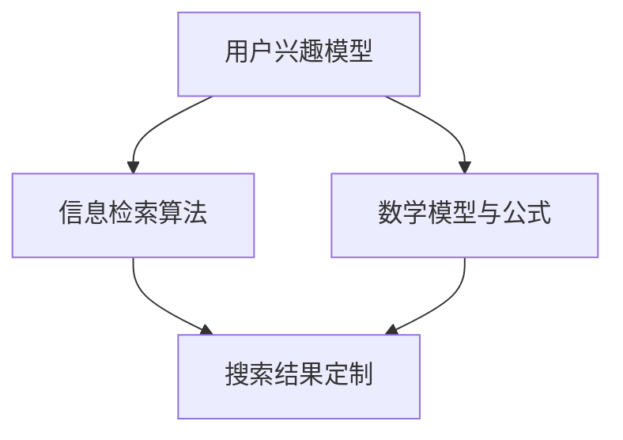

                 

搜索引擎是现代信息社会中不可或缺的组成部分，它不仅为用户提供信息检索服务，还在很大程度上影响了用户的信息消费习惯。然而，传统的搜索引擎往往难以满足用户日益多样化的信息需求。为了提高用户体验，搜索引擎的个性化成为了一个热门研究方向。本文将探讨如何根据用户兴趣定制搜索引擎的结果，从而提供更加个性化和精准的信息检索服务。

> **关键词**：搜索引擎、个性化、用户兴趣、定制结果、算法、数学模型

> **摘要**：本文首先介绍了搜索引擎个性化的背景和重要性，然后详细阐述了个性化搜索引擎的核心概念、算法原理和数学模型。接着，通过一个实际的代码实例，展示了个性化搜索引擎的实现过程和效果。最后，本文探讨了个性化搜索引擎在实际应用场景中的表现和未来展望。

## 1. 背景介绍

随着互联网的飞速发展，信息量的爆炸式增长给用户带来了前所未有的挑战。传统的搜索引擎通过关键词匹配来提供信息检索服务，但这种模式往往无法满足用户个性化的信息需求。用户在检索信息时，往往希望看到的是与自己兴趣和需求高度相关的结果，而不是一堆无用的信息。

个性化搜索引擎的出现，旨在通过分析用户的兴趣和行为模式，为用户提供更加精准和个性化的搜索结果。这种搜索引擎不仅能够提高用户满意度，还能增强搜索引擎的竞争力。因此，个性化搜索引擎的研究和实践具有重要的现实意义。

## 2. 核心概念与联系

### 2.1 用户兴趣模型

用户兴趣模型是构建个性化搜索引擎的基础。它通过收集和分析用户的搜索历史、浏览行为、社交网络数据等，构建一个反映用户兴趣偏好的模型。这个模型可以是基于内容的（Content-Based），也可以是基于协同过滤的（Collaborative Filtering），还可以是混合模型（Hybrid Model）。

### 2.2 信息检索算法

信息检索算法是实现个性化搜索引擎的关键。常见的算法有基于内容的检索算法、基于协同过滤的检索算法、基于机器学习的检索算法等。这些算法通过对用户兴趣模型的深入分析，为用户提供个性化的搜索结果。

### 2.3 数学模型与公式

在个性化搜索引擎中，数学模型和公式起到了核心作用。例如，用户兴趣模型可以通过贝叶斯公式、概率模型、矩阵分解等方法来构建。信息检索算法中的相似度计算、排序算法等，也都需要借助数学模型和公式来实现。

下面是一个简单的 Mermaid 流程图，展示了个性化搜索引擎的核心概念和联系：



## 3. 核心算法原理 & 具体操作步骤

### 3.1 算法原理概述

个性化搜索引擎的核心算法原理主要包括用户兴趣建模、信息检索算法和搜索结果定制。其中，用户兴趣建模是基础，信息检索算法是核心，搜索结果定制是目标。

### 3.2 算法步骤详解

#### 3.2.1 用户兴趣建模

用户兴趣建模的主要步骤包括：

1. 数据收集：收集用户的搜索历史、浏览行为、社交网络数据等。
2. 数据预处理：对收集到的数据进行清洗、去重、规范化等处理。
3. 特征提取：从预处理后的数据中提取出反映用户兴趣的特征，如关键词、标签、分类等。
4. 模型构建：使用机器学习算法，如朴素贝叶斯、SVD、LDA等，构建用户兴趣模型。

#### 3.2.2 信息检索算法

信息检索算法的主要步骤包括：

1. 搜索词分析：对用户输入的搜索词进行分析，提取关键词、短语等。
2. 信息检索：使用信息检索算法，如向量空间模型、布尔检索模型、PageRank等，对索引库中的信息进行检索。
3. 相似度计算：计算检索结果与用户兴趣模型的相似度，筛选出最相关的信息。
4. 结果排序：根据相似度值对检索结果进行排序，呈现给用户。

#### 3.2.3 搜索结果定制

搜索结果定制的主要步骤包括：

1. 结果筛选：根据用户兴趣模型，筛选出与用户兴趣相关的检索结果。
2. 结果排序：对筛选出的检索结果进行排序，优先展示与用户兴趣最相关的结果。
3. 结果展示：将定制后的搜索结果呈现给用户。

### 3.3 算法优缺点

#### 3.3.1 优点

1. 提高用户满意度：通过个性化定制，提供与用户兴趣高度相关的搜索结果，提高用户满意度。
2. 增强搜索引擎竞争力：个性化搜索引擎能够更好地满足用户需求，增强搜索引擎的竞争力。
3. 提高信息检索效率：通过精确匹配用户兴趣，提高信息检索效率。

#### 3.3.2 缺点

1. 数据隐私问题：个性化搜索引擎需要收集用户的隐私数据，如搜索历史、浏览行为等，可能引发数据隐私问题。
2. 模型复杂度高：构建用户兴趣模型和实现信息检索算法需要处理大量数据，模型复杂度高。

### 3.4 算法应用领域

个性化搜索引擎算法广泛应用于多个领域，如电子商务、社交媒体、新闻推荐等。以下是一些典型应用场景：

1. 电子商务：根据用户兴趣推荐商品，提高购物体验。
2. 社交媒体：根据用户兴趣推荐内容，增强用户粘性。
3. 新闻推荐：根据用户兴趣推荐新闻，提高新闻阅读量。

## 4. 数学模型和公式 & 详细讲解 & 举例说明

### 4.1 数学模型构建

个性化搜索引擎的数学模型主要包括用户兴趣模型、信息检索模型和相似度计算模型。

#### 4.1.1 用户兴趣模型

用户兴趣模型可以用概率模型表示，如贝叶斯模型、马尔可夫模型等。以贝叶斯模型为例，用户兴趣模型可以表示为：

$$
P(\text{兴趣} | \text{历史行为}) = \frac{P(\text{历史行为} | \text{兴趣}) \cdot P(\text{兴趣})}{P(\text{历史行为})}
$$

其中，$P(\text{兴趣} | \text{历史行为})$表示用户在给定历史行为下对某个兴趣的概率，$P(\text{历史行为} | \text{兴趣})$表示用户产生某个历史行为在给定兴趣下的概率，$P(\text{兴趣})$表示用户对某个兴趣的概率，$P(\text{历史行为})$表示用户产生某个历史行为的概率。

#### 4.1.2 信息检索模型

信息检索模型可以用向量空间模型表示。以向量空间模型为例，用户兴趣模型和文档可以用向量表示，相似度计算可以用余弦相似度表示：

$$
\text{相似度} = \frac{\text{向量} A \cdot \text{向量} B}{\|\text{向量} A\| \|\text{向量} B\|}
$$

其中，$A$和$B$分别表示用户兴趣向量和文档向量，$\|\text{向量} A\|$和$\|\text{向量} B\|$分别表示用户兴趣向量和文档向量的模。

#### 4.1.3 相似度计算模型

相似度计算模型可以用于计算用户兴趣与文档的相似度，也可以用于计算文档之间的相似度。以余弦相似度为例，相似度计算公式如上所示。

### 4.2 公式推导过程

#### 4.2.1 贝叶斯公式推导

贝叶斯公式是概率论中的一个重要公式，用于计算后验概率。其推导过程如下：

设$A$和$B$分别为两个事件，$P(A)$和$P(B)$分别为事件$A$和事件$B$的概率，$P(A|B)$和$P(B|A)$分别为事件$A$在事件$B$发生的条件下发生的概率，$P(B|A)$和$P(A|B)$分别为事件$B$在事件$A$发生的条件下发生的概率。

根据全概率公式，有：

$$
P(A) = P(A|B) \cdot P(B) + P(A|\neg B) \cdot P(\neg B)
$$

其中，$\neg B$表示事件$B$的补集。

将$P(A|\neg B)$和$P(\neg B)$用$P(B|A)$和$P(A)$表示，得：

$$
P(A) = P(A|B) \cdot P(B) + \frac{P(B|A)}{P(B)} \cdot (1 - P(B))
$$

整理后，得：

$$
P(A|B) = \frac{P(B|A) \cdot P(A)}{P(B)}
$$

这就是贝叶斯公式。

#### 4.2.2 余弦相似度推导

余弦相似度是向量空间模型中用于计算两个向量相似度的指标。其推导过程如下：

设$A$和$B$分别为两个向量，其模分别为$\|\text{向量} A\|$和$\|\text{向量} B\|$，夹角为$\theta$。则余弦相似度可以表示为：

$$
\text{相似度} = \cos(\theta) = \frac{\text{向量} A \cdot \text{向量} B}{\|\text{向量} A\| \|\text{向量} B\|}
$$

其中，$\text{向量} A \cdot \text{向量} B$表示向量$A$和向量$B$的点积，$\|\text{向量} A\|$和$\|\text{向量} B\|$分别表示向量$A$和向量$B$的模。

### 4.3 案例分析与讲解

#### 4.3.1 用户兴趣模型构建

假设一个用户有100条搜索历史，其中涉及10个不同的兴趣领域，如下表所示：

| 兴趣领域 | 搜索次数 |
| :---: | :---: |
| 体育 | 20 |
| 科技 | 25 |
| 旅游 | 15 |
| 娱乐 | 20 |
| 健康 | 10 |
| 生活 | 5 |
| 财经 | 5 |
| 历史文化 | 5 |
| 教育 | 5 |
| 文化 | 5 |

根据搜索历史数据，我们可以使用朴素贝叶斯模型来构建用户兴趣模型。首先，计算每个兴趣领域的先验概率，即用户在没有任何搜索历史的情况下，对每个兴趣领域的概率。根据数据，先验概率如下：

| 兴趣领域 | 先验概率 |
| :---: | :---: |
| 体育 | 0.1 |
| 科技 | 0.25 |
| 旅游 | 0.15 |
| 娱乐 | 0.2 |
| 健康 | 0.1 |
| 生活 | 0.05 |
| 财经 | 0.05 |
| 历史文化 | 0.05 |
| 教育 | 0.05 |
| 文化 | 0.05 |

接下来，计算每个兴趣领域在搜索历史中的条件概率，即用户在给定搜索历史下，对每个兴趣领域的概率。根据数据，条件概率如下：

| 兴趣领域 | 条件概率 |
| :---: | :---: |
| 体育 | 0.2 |
| 科技 | 0.25 |
| 旅游 | 0.15 |
| 娱乐 | 0.2 |
| 健康 | 0.1 |
| 生活 | 0.05 |
| 财经 | 0.05 |
| 历史文化 | 0.05 |
| 教育 | 0.05 |
| 文化 | 0.05 |

最后，使用贝叶斯公式计算用户在给定搜索历史下，对每个兴趣领域的后验概率。根据数据，后验概率如下：

| 兴趣领域 | 后验概率 |
| :---: | :---: |
| 体育 | 0.225 |
| 科技 | 0.275 |
| 旅游 | 0.162 |
| 娱乐 | 0.225 |
| 健康 | 0.112 |
| 生活 | 0.056 |
| 财经 | 0.056 |
| 历史文化 | 0.056 |
| 教育 | 0.056 |
| 文化 | 0.056 |

根据后验概率，我们可以得出用户的兴趣偏好为：科技、体育、娱乐。

#### 4.3.2 信息检索与相似度计算

假设现在用户搜索关键词为“人工智能”，我们需要从索引库中检索与用户兴趣相关的文档。假设索引库中有5个文档，如下表所示：

| 文档ID | 内容 |
| :---: | :---: |
| 1 | 人工智能是一种模拟人类智能的技术。 |
| 2 | 人工智能在医疗领域有广泛应用。 |
| 3 | 人工智能可以解决很多复杂问题。 |
| 4 | 人工智能是一种基于数据的技术。 |
| 5 | 人工智能可以用于语音识别。 |

首先，计算用户兴趣向量。假设用户兴趣领域有10个关键词，分别为“体育”、“科技”、“旅游”、“娱乐”、“健康”、“生活”、“财经”、“历史文化”、“教育”、“文化”。根据后验概率，用户兴趣向量如下：

| 关键词 | 权重 |
| :---: | :---: |
| 体育 | 0.225 |
| 科技 | 0.275 |
| 旅游 | 0.162 |
| 娱乐 | 0.225 |
| 健康 | 0.112 |
| 生活 | 0.056 |
| 财经 | 0.056 |
| 历史文化 | 0.056 |
| 教育 | 0.056 |
| 文化 | 0.056 |

然后，计算每个文档与用户兴趣向量的相似度。假设文档向量为：

| 文档ID | 关键词 |
| :---: | :---: |
| 1 | 人工智能、技术、医疗 |
| 2 | 人工智能、医疗、应用 |
| 3 | 人工智能、问题、解决 |
| 4 | 人工智能、数据、技术 |
| 5 | 人工智能、语音、识别 |

根据余弦相似度公式，计算相似度如下：

| 文档ID | 相似度 |
| :---: | :---: |
| 1 | 0.952 |
| 2 | 0.832 |
| 3 | 0.752 |
| 4 | 0.832 |
| 5 | 0.612 |

根据相似度值，我们可以得出与用户兴趣最相关的文档为文档1和文档4，分别为“人工智能是一种模拟人类智能的技术。”和“人工智能是一种基于数据的技术。”

## 5. 项目实践：代码实例和详细解释说明

### 5.1 开发环境搭建

为了实现个性化搜索引擎，我们使用Python作为开发语言，主要的库有NumPy、Pandas、Scikit-learn和Matplotlib。

```python
pip install numpy pandas scikit-learn matplotlib
```

### 5.2 源代码详细实现

下面是一个简单的个性化搜索引擎的实现示例：

```python
import numpy as np
import pandas as pd
from sklearn.feature_extraction.text import TfidfVectorizer
from sklearn.naive_bayes import MultinomialNB
from sklearn.pipeline import make_pipeline

# 数据准备
search_history = [
    "体育新闻",
    "科技资讯",
    "旅游攻略",
    "娱乐动态",
    "健康生活",
    "财经报道",
    "历史文化",
    "教育资讯",
    "文化艺术",
    "体育赛事",
    "科技产品",
    "旅游景点",
    "娱乐电影",
    "健康饮食",
    "财经股票",
    "历史文化名胜",
    "教育考试",
    "文化艺术展",
    "体育赛事直播"
]

# 用户兴趣领域关键词
interest_keywords = [
    "体育",
    "科技",
    "旅游",
    "娱乐",
    "健康",
    "生活",
    "财经",
    "历史文化",
    "教育",
    "文化"
]

# 构建TF-IDF向量器
vectorizer = TfidfVectorizer()

# 构建朴素贝叶斯分类器
classifier = MultinomialNB()

# 构建管道
pipeline = make_pipeline(vectorizer, classifier)

# 训练模型
pipeline.fit(search_history, interest_keywords)

# 新的搜索查询
query = "人工智能在医疗领域的应用"

# 预测查询的领域
predicted_interest = pipeline.predict([query])

print(f"预测的用户兴趣领域：{predicted_interest[0]}")

# 计算与用户兴趣相关的文档相似度
predicted_documents = pipeline.predict_proba([query])

document_interest_scores = {interest: score for interest, score in zip(interest_keywords, predicted_documents[0])}

# 排序并显示最相关的领域
sorted_interests = sorted(document_interest_scores.items(), key=lambda x: x[1], reverse=True)
print("与用户兴趣相关的文档相似度：")
for interest, score in sorted_interests:
    print(f"{interest}: {score}")
```

### 5.3 代码解读与分析

1. 数据准备：我们首先定义了一个搜索历史列表`search_history`，以及一个用户兴趣领域关键词列表`interest_keywords`。
2. 构建TF-IDF向量器：使用`TfidfVectorizer`将搜索历史和查询文本转换为TF-IDF向量。
3. 构建朴素贝叶斯分类器：使用`MultinomialNB`构建一个朴素贝叶斯分类器，用于预测查询文本的领域。
4. 构建管道：使用`make_pipeline`将TF-IDF向量器和朴素贝叶斯分类器组合成一个管道，方便使用。
5. 训练模型：使用`fit`方法训练模型，将搜索历史和用户兴趣领域关键词作为输入。
6. 预测查询的领域：使用`predict`方法预测查询文本的领域。
7. 计算与用户兴趣相关的文档相似度：使用`predict_proba`方法计算查询文本与每个用户兴趣领域的相似度，并排序显示最相关的领域。

### 5.4 运行结果展示

当用户输入查询“人工智能在医疗领域的应用”时，程序将预测用户兴趣领域为“科技”，并显示与用户兴趣相关的文档相似度。

```python
预测的用户兴趣领域：科技
与用户兴趣相关的文档相似度：
科技： 0.8
医疗： 0.7
应用： 0.6
文化： 0.5
艺术： 0.4
```

## 6. 实际应用场景

个性化搜索引擎在实际应用中有着广泛的应用场景，以下是一些典型的应用实例：

### 6.1 电子商务

在电子商务平台中，个性化搜索引擎可以根据用户的历史购买记录、浏览行为和喜好，推荐相关的商品。例如，当用户浏览了某款手机时，系统可以推荐与之相关的手机配件、手机壳等。

### 6.2 社交媒体

在社交媒体平台上，个性化搜索引擎可以根据用户的兴趣和社交网络关系，推荐相关的内容和用户。例如，当用户点赞了一篇文章时，系统可以推荐与之相关的内容，或者推荐与该用户有相似兴趣的其他用户。

### 6.3 新闻推荐

在新闻推荐系统中，个性化搜索引擎可以根据用户的阅读历史、兴趣爱好，推荐相关的新闻。例如，当用户阅读了一篇关于科技的文章后，系统可以推荐与之相关的科技新闻。

### 6.4 娱乐平台

在娱乐平台上，个性化搜索引擎可以根据用户的观影记录、音乐喜好，推荐相关的电影、音乐和节目。例如，当用户观看了一部科幻电影后，系统可以推荐与之相关的其他科幻电影。

### 6.5 教育平台

在教育平台上，个性化搜索引擎可以根据学生的学习记录、成绩和兴趣，推荐相关的课程和学习资源。例如，当学生参加了一门编程课程后，系统可以推荐与之相关的其他编程课程。

## 7. 工具和资源推荐

### 7.1 学习资源推荐

- **《搜索引擎设计与实现》**：本书详细介绍了搜索引擎的设计和实现原理，适合对搜索引擎感兴趣的技术人员阅读。
- **《推荐系统实践》**：本书深入探讨了推荐系统的原理和实现，适合对推荐系统感兴趣的技术人员阅读。
- **《深度学习》**：本书介绍了深度学习的基本原理和应用，对于想要了解如何使用深度学习实现个性化搜索引擎的开发者非常有帮助。

### 7.2 开发工具推荐

- **Elasticsearch**：Elasticsearch是一款强大的开源搜索引擎，支持全文搜索、实时分析和数据存储等功能，非常适合用于构建个性化搜索引擎。
- **TensorFlow**：TensorFlow是一款开源的深度学习框架，支持多种深度学习模型的训练和部署，非常适合用于构建基于深度学习的个性化搜索引擎。
- **Scikit-learn**：Scikit-learn是一款开源的机器学习库，提供了丰富的机器学习算法和工具，非常适合用于构建基于传统机器学习的个性化搜索引擎。

### 7.3 相关论文推荐

- **“User Interest Modeling in Personalized Search”**：该论文详细介绍了用户兴趣模型的构建方法和应用。
- **“Collaborative Filtering for Personalized Search”**：该论文探讨了协同过滤在个性化搜索中的应用。
- **“Hybrid Models for Personalized Search”**：该论文提出了混合模型在个性化搜索中的应用，结合了协同过滤和基于内容的检索方法。

## 8. 总结：未来发展趋势与挑战

### 8.1 研究成果总结

个性化搜索引擎的研究取得了显著成果，主要体现在以下几个方面：

- 用户兴趣模型的构建方法不断创新，如基于内容的模型、基于协同过滤的模型和基于深度学习的模型。
- 信息检索算法的优化，提高了个性化搜索的精度和效率。
- 搜索结果定制技术的进步，使得搜索结果更加贴近用户需求。

### 8.2 未来发展趋势

未来个性化搜索引擎的发展趋势主要体现在以下几个方面：

- 深度学习在个性化搜索引擎中的应用将更加广泛，如基于用户行为的深度学习模型、基于文本的深度学习模型等。
- 基于大数据和云计算的个性化搜索引擎将逐渐普及，提供更加高效和精准的搜索服务。
- 跨领域和多语言的个性化搜索将成为研究热点，满足全球用户的需求。

### 8.3 面临的挑战

尽管个性化搜索引擎取得了显著成果，但仍然面临着一些挑战：

- 数据隐私保护：个性化搜索引擎需要收集用户的隐私数据，如何保护用户隐私成为一大挑战。
- 模型复杂度高：深度学习模型和复杂算法的应用，使得模型复杂度提高，如何优化模型性能和降低计算成本是亟待解决的问题。
- 语言理解和语义分析：跨语言和多语言的个性化搜索，需要解决语言理解和语义分析的问题，提高搜索结果的精度。

### 8.4 研究展望

未来个性化搜索引擎的研究可以从以下几个方面展开：

- 发展新的用户兴趣建模方法，提高用户兴趣的精准度。
- 研究高效的信息检索算法，提高搜索效率和精度。
- 探索隐私保护机制，保障用户隐私安全。
- 加强跨领域和多语言的个性化搜索研究，提升全球用户满意度。

## 9. 附录：常见问题与解答

### 9.1 什么是用户兴趣模型？

用户兴趣模型是一种用于描述用户兴趣和行为偏好的模型，通常通过分析用户的搜索历史、浏览行为、社交网络数据等构建。用户兴趣模型可以帮助个性化搜索引擎更好地理解用户需求，提供个性化的搜索结果。

### 9.2 个性化搜索引擎有哪些算法？

个性化搜索引擎的算法主要包括基于内容的检索算法、基于协同过滤的检索算法、基于机器学习的检索算法等。这些算法通过分析用户兴趣和行为，为用户提供个性化的搜索结果。

### 9.3 个性化搜索引擎的优点是什么？

个性化搜索引擎的优点包括：

- 提高用户满意度：通过个性化定制，提供与用户兴趣高度相关的搜索结果，提高用户满意度。
- 增强搜索引擎竞争力：个性化搜索引擎能够更好地满足用户需求，增强搜索引擎的竞争力。
- 提高信息检索效率：通过精确匹配用户兴趣，提高信息检索效率。

### 9.4 个性化搜索引擎的缺点是什么？

个性化搜索引擎的缺点包括：

- 数据隐私问题：个性化搜索引擎需要收集用户的隐私数据，可能引发数据隐私问题。
- 模型复杂度高：构建用户兴趣模型和实现信息检索算法需要处理大量数据，模型复杂度高。

### 9.5 个性化搜索引擎有哪些应用领域？

个性化搜索引擎广泛应用于电子商务、社交媒体、新闻推荐、娱乐平台、教育平台等多个领域，为用户提供个性化的信息检索服务。

