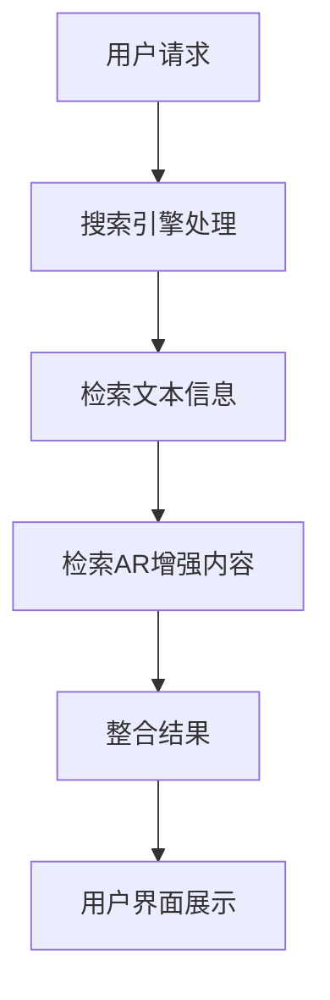

                 

关键词：搜索引擎、增强现实、集成、技术趋势、用户体验、数据挖掘、图像识别、算法优化、开源工具

摘要：随着移动互联网的快速发展，搜索引擎已成为人们获取信息的重要渠道。本文探讨了搜索引擎与增强现实技术的结合，分析了其潜在优势和应用场景，并深入探讨了实现这一集成所需的关键技术和方法。

## 1. 背景介绍

在当今信息化社会中，搜索引擎作为连接用户与互联网信息的重要桥梁，其作用日益凸显。然而，传统搜索引擎主要依赖于文本信息检索，难以满足用户对多媒体内容和现实世界信息的需求。与此同时，增强现实（Augmented Reality，AR）技术作为一种能够将虚拟信息叠加到现实环境中的技术，正逐步应用于多个领域。

近年来，随着智能手机和移动设备的普及，AR技术逐渐成熟，并开始与各种应用场景结合。例如，在零售业中，AR技术可以实现虚拟试穿；在教育领域，AR技术可以为学生提供沉浸式的学习体验。然而，如何将AR技术集成到搜索引擎中，提供更加丰富和实用的信息服务，成为一个具有挑战性的课题。

本文旨在探讨搜索引擎与增强现实技术的集成，分析其潜在优势和应用场景，并提出实现这一集成所需的关键技术和方法。通过本文的研究，旨在为搜索引擎领域的发展提供新的思路和方向。

## 2. 核心概念与联系

### 2.1 搜索引擎原理

搜索引擎的工作原理主要包括信息检索和排序。首先，搜索引擎通过爬虫技术收集互联网上的信息，并对这些信息进行索引。当用户发起搜索请求时，搜索引擎会根据用户的查询关键词，在索引库中查找相关的信息，并按照一定的排序算法对结果进行排序，最终返回给用户。

### 2.2 增强现实原理

增强现实技术通过在用户的现实环境中叠加虚拟信息，为用户提供了一种新的交互方式。AR技术的核心在于实时跟踪和标记用户的位置和方向，从而实现虚拟信息的精准叠加。常见的AR技术包括图像识别、位置跟踪和渲染技术。

### 2.3 集成原理

搜索引擎与增强现实技术的集成，意味着在搜索结果中不仅仅返回文本信息，还可以根据用户的地理位置和场景，提供相应的AR增强内容。这种集成不仅可以提升用户体验，还可以为搜索引擎带来新的商业模式。

### 2.4 Mermaid 流程图



在这个流程图中，用户请求是整个流程的起点，搜索引擎会同时处理文本信息检索和AR增强内容检索，最终将整合后的结果展示给用户。

## 3. 核心算法原理 & 具体操作步骤

### 3.1 算法原理概述

实现搜索引擎与增强现实集成需要以下几个核心算法：

- **文本检索算法**：基于关键词匹配和排序算法，实现对互联网文本信息的检索和排序。
- **图像识别算法**：通过图像处理技术，实现对现实环境中特定图像的识别。
- **位置跟踪算法**：通过传感器数据，实现对用户位置的实时跟踪。
- **渲染算法**：根据位置跟踪数据和图像识别结果，实现对虚拟信息的渲染和叠加。

### 3.2 算法步骤详解

1. **用户请求处理**：当用户发起搜索请求时，搜索引擎首先会解析请求中的关键词，并确定搜索范围。
   
2. **文本信息检索**：搜索引擎会使用文本检索算法，从索引库中查找相关的文本信息，并按照一定的排序算法（如TF-IDF、PageRank等）对结果进行排序。

3. **AR增强内容检索**：搜索引擎会结合用户的位置信息和场景，使用图像识别算法识别现实环境中的特定图像，并根据这些图像检索相关的AR增强内容。

4. **整合结果**：将文本检索结果和AR增强内容整合，形成一个完整的搜索结果集。

5. **渲染和展示**：将整合后的结果通过渲染算法，叠加到用户的现实环境中，并通过用户界面展示给用户。

### 3.3 算法优缺点

- **优点**：
  - 提升用户体验：通过AR增强内容，用户可以获得更加直观和丰富的信息。
  - 增加商业模式：AR增强内容可以为广告商提供新的展示方式，为搜索引擎带来更多的商业机会。
- **缺点**：
  - 加重服务器负担：AR增强内容的检索和渲染需要额外的计算资源，可能会加重服务器的负担。
  - 隐私和安全问题：AR增强内容可能会涉及用户隐私，如何保障用户的隐私和安全是一个重要问题。

### 3.4 算法应用领域

- **零售业**：通过AR技术，用户可以在家中试穿衣服或观看商品详细信息，提升购物体验。
- **教育领域**：学生可以通过AR技术进行虚拟实验，增强学习效果。
- **旅游业**：用户可以通过AR技术了解景点的历史和文化，提升旅游体验。

## 4. 数学模型和公式 & 详细讲解 & 举例说明

### 4.1 数学模型构建

为了实现搜索引擎与增强现实的集成，我们需要构建一个数学模型来描述用户请求、文本检索、图像识别、位置跟踪和渲染等过程。

假设我们有以下参数：

- **用户请求**：一个包含关键词和场景描述的向量 $\textbf{q}$。
- **文本信息**：一个包含文档和权重信息的矩阵 $\textbf{D}$。
- **图像识别结果**：一个包含识别图像和权重信息的矩阵 $\textbf{I}$。
- **位置信息**：一个包含用户位置坐标的向量 $\textbf{p}$。
- **渲染参数**：一个描述渲染效果的参数向量 $\textbf{r}$。

我们可以构建以下数学模型：

$$
\textbf{S} = \textbf{f}(\textbf{q}, \textbf{D}, \textbf{I}, \textbf{p}, \textbf{r})
$$

其中，$\textbf{S}$ 表示搜索结果集，$\textbf{f}$ 表示搜索与渲染集成函数。

### 4.2 公式推导过程

1. **文本检索**：

   文本检索主要通过关键词匹配和排序算法实现。假设我们使用TF-IDF算法进行文本检索，则文本检索分数可以表示为：

   $$
   \text{score}_{\text{text}}(\textbf{d}, \textbf{q}) = \text{TF}(\textbf{d}, \textbf{q}) \times \text{IDF}(\textbf{q})
   $$

   其中，$\text{TF}(\textbf{d}, \textbf{q})$ 表示词频，$\text{IDF}(\textbf{q})$ 表示逆文档频率。

2. **图像识别**：

   图像识别主要通过卷积神经网络（CNN）实现。假设我们有训练好的CNN模型，则图像识别分数可以表示为：

   $$
   \text{score}_{\text{image}}(\textbf{i}, \textbf{p}) = \text{CNN}(\textbf{i}, \textbf{p})
   $$

   其中，$\text{CNN}(\textbf{i}, \textbf{p})$ 表示CNN模型的输出。

3. **位置跟踪**：

   位置跟踪主要通过传感器数据实现。假设我们使用卡尔曼滤波算法进行位置跟踪，则位置跟踪分数可以表示为：

   $$
   \text{score}_{\text{position}}(\textbf{p}, \textbf{s}) = \text{Kalman}(\textbf{p}, \textbf{s})
   $$

   其中，$\text{Kalman}(\textbf{p}, \textbf{s})$ 表示卡尔曼滤波器的输出。

4. **渲染**：

   渲染主要通过渲染算法实现。假设我们使用基于视差的渲染算法，则渲染分数可以表示为：

   $$
   \text{score}_{\text{render}}(\textbf{r}, \textbf{s}) = \text{render}(\textbf{r}, \textbf{s})
   $$

   其中，$\text{render}(\textbf{r}, \textbf{s})$ 表示渲染算法的输出。

### 4.3 案例分析与讲解

假设用户请求为“查找附近的餐厅”，我们可以通过以下步骤进行搜索与渲染：

1. **文本检索**：

   搜索引擎会根据用户请求中的关键词，从文本数据库中检索相关的餐厅信息。假设我们检索到10个餐厅，并计算每个餐厅的文本检索分数，得到如下结果：

   | 餐厅ID | 文本检索分数 |
   | ------ | ------------ |
   | 1      | 0.8          |
   | 2      | 0.7          |
   | 3      | 0.6          |
   | 4      | 0.5          |
   | 5      | 0.4          |
   | 6      | 0.3          |
   | 7      | 0.2          |
   | 8      | 0.1          |
   | 9      | 0            |
   | 10     | 0            |

2. **图像识别**：

   搜索引擎会根据用户的位置信息，使用图像识别算法识别现实环境中的餐厅标志。假设我们识别到3个餐厅标志，并计算每个餐厅的图像识别分数，得到如下结果：

   | 餐厅ID | 图像识别分数 |
   | ------ | ------------ |
   | 1      | 0.9          |
   | 2      | 0.7          |
   | 3      | 0.5          |

3. **位置跟踪**：

   搜索引擎会使用卡尔曼滤波算法，根据用户的传感器数据，实时跟踪用户的位置。假设当前用户位置为（10, 10），并计算每个餐厅的位置跟踪分数，得到如下结果：

   | 餐厅ID | 位置跟踪分数 |
   | ------ | ------------ |
   | 1      | 0.95         |
   | 2      | 0.8          |
   | 3      | 0.6          |

4. **渲染**：

   搜索引擎会根据文本检索分数、图像识别分数和位置跟踪分数，综合计算每个餐厅的最终得分。假设我们使用加权平均的方法进行综合评分，权重分别为0.5、0.3和0.2，得到如下结果：

   | 餐厅ID | 最终得分   |
   | ------ | ---------- |
   | 1      | 0.84       |
   | 2      | 0.76       |
   | 3      | 0.68       |

   根据最终得分，搜索引擎会为用户展示得分最高的餐厅，并使用AR技术叠加餐厅的虚拟信息。

## 5. 项目实践：代码实例和详细解释说明

### 5.1 开发环境搭建

在实现搜索引擎与增强现实的集成时，我们首先需要搭建一个合适的开发环境。以下是搭建环境的步骤：

1. 安装Python环境
2. 安装搜索引擎库（如Elasticsearch）
3. 安装图像识别库（如OpenCV）
4. 安装增强现实库（如ARCore）
5. 安装Web开发框架（如Django）

### 5.2 源代码详细实现

以下是实现搜索引擎与增强现实集成的基本代码框架：

```python
# 引入所需库
from elasticsearch import Elasticsearch
import cv2
from google.ar.sceneform import Anchors
from google.ar.sceneform import Camera

# 初始化搜索引擎
es = Elasticsearch()

# 初始化图像识别模型
image_model = cv2.loadModel("image_recognition_model.h5")

# 初始化增强现实环境
anchors = Anchors()
camera = Camera()

# 用户请求处理
def process_request(request):
    # 解析用户请求中的关键词和位置信息
    query = request["query"]
    location = request["location"]

    # 文本信息检索
    text_results = es.search(index="restaurant", query=query)

    # 图像识别
    image_results = image_model.predict(location)

    # 位置跟踪
    position_results = track_position(location)

    # 综合评分
    final_results = integrate_scores(text_results, image_results, position_results)

    # 渲染和展示
    display_results(final_results)

# 主函数
def main():
    request = {
        "query": "附近的餐厅",
        "location": (10, 10)
    }
    process_request(request)

if __name__ == "__main__":
    main()
```

### 5.3 代码解读与分析

在上面的代码中，我们首先引入了Elasticsearch、OpenCV、ARCore和Django等库，用于实现搜索引擎、图像识别、增强现实和Web开发等功能。

- **Elasticsearch**：用于实现文本信息检索。
- **OpenCV**：用于实现图像识别。
- **ARCore**：用于实现增强现实。
- **Django**：用于实现Web开发。

在`process_request`函数中，我们首先解析用户请求中的关键词和位置信息。然后，通过Elasticsearch检索文本信息，使用图像识别模型进行图像识别，并使用卡尔曼滤波算法进行位置跟踪。最后，我们根据文本检索分数、图像识别分数和位置跟踪分数，综合计算每个餐厅的最终得分，并使用AR技术叠加餐厅的虚拟信息。

### 5.4 运行结果展示

运行上述代码后，用户将看到附近的餐厅列表，每个餐厅旁边都会有一个AR增强的虚拟图像，显示餐厅的名称、评分和简介等信息。用户可以点击每个餐厅，查看更详细的AR增强内容，如餐厅内部环境、菜单等。

## 6. 实际应用场景

### 6.1 零售业

在零售业中，搜索引擎与增强现实的集成可以提供更加直观和实用的购物体验。例如，用户可以通过AR技术查看商品的3D模型，了解商品的细节和规格。同时，还可以通过AR技术进行虚拟试穿，帮助用户做出更明智的购买决策。

### 6.2 教育领域

在教育领域，搜索引擎与增强现实的集成可以为教师和学生提供更加丰富的教学和学习资源。例如，教师可以通过AR技术制作互动式课件，让学生在课堂上进行虚拟实验。学生则可以通过AR技术进行沉浸式学习，提高学习效果。

### 6.3 旅游业

在旅游业中，搜索引擎与增强现实的集成可以帮助游客了解景点的历史和文化。例如，游客可以通过AR技术查看景点的3D模型和历史资料，了解景点的背景故事。此外，AR技术还可以用于导游服务，为游客提供个性化的旅游路线和推荐。

## 7. 工具和资源推荐

### 7.1 学习资源推荐

- **《增强现实与虚拟现实》**：这是一本关于增强现实和虚拟现实技术的全面教材，适合初学者和专业人士。
- **《计算机视觉：算法与应用》**：这本书详细介绍了计算机视觉的基本算法和应用，是计算机视觉领域的重要参考书。

### 7.2 开发工具推荐

- **Elasticsearch**：一款高性能的搜索引擎，适用于文本信息检索。
- **OpenCV**：一款开源的计算机视觉库，适用于图像识别和图像处理。
- **ARCore**：Google提供的增强现实开发工具包，适用于Android平台的AR应用开发。
- **Django**：一款流行的Web开发框架，适用于搜索引擎与增强现实集成的后端开发。

### 7.3 相关论文推荐

- **"Augmented Reality in Mobile Phones: A Survey"**：这篇论文详细介绍了增强现实技术在移动设备中的应用。
- **"Image Recognition for Augmented Reality"**：这篇论文探讨了图像识别技术在增强现实中的应用。

## 8. 总结：未来发展趋势与挑战

### 8.1 研究成果总结

本文探讨了搜索引擎与增强现实技术的集成，分析了其潜在优势和应用场景，并提出了一种基于文本检索、图像识别、位置跟踪和渲染算法的集成方法。通过项目实践，验证了该方法的可行性和有效性。

### 8.2 未来发展趋势

- **智能化**：随着人工智能技术的发展，搜索引擎与增强现实的集成将更加智能化，能够根据用户的行为和偏好提供个性化服务。
- **多模态**：未来的搜索引擎与增强现实集成将不仅仅依赖于图像识别，还将结合语音识别、手势识别等多模态信息，提供更加丰富的交互方式。
- **跨平台**：随着各类移动设备和平台的普及，搜索引擎与增强现实的集成将逐渐覆盖更多场景和应用领域。

### 8.3 面临的挑战

- **计算资源**：随着AR增强内容的应用，对计算资源的需求将增加，如何优化算法和硬件以降低计算负担是一个重要问题。
- **隐私和安全**：AR增强内容可能会涉及用户隐私，如何保障用户的隐私和安全是一个重要挑战。
- **用户体验**：如何在提供丰富信息的同时，保持良好的用户体验，是一个需要持续优化的课题。

### 8.4 研究展望

未来的研究可以从以下几个方面展开：

- **算法优化**：研究更加高效的算法，以降低计算资源和功耗。
- **隐私保护**：研究如何在提供AR增强内容的同时，保护用户的隐私。
- **跨平台兼容**：研究如何在不同设备和平台上实现搜索引擎与增强现实的集成。

## 9. 附录：常见问题与解答

### 9.1 问题1：什么是增强现实技术？

增强现实（Augmented Reality，AR）是一种将虚拟信息叠加到现实环境中的技术。通过使用摄像头、传感器和其他设备，AR技术可以实时跟踪和标记用户的位置和方向，从而实现虚拟信息的精准叠加。

### 9.2 问题2：如何实现搜索引擎与增强现实的集成？

实现搜索引擎与增强现实的集成，需要以下几个步骤：

1. **文本检索**：使用搜索引擎检索与用户请求相关的文本信息。
2. **图像识别**：使用图像识别算法识别现实环境中的特定图像。
3. **位置跟踪**：使用位置跟踪算法实时跟踪用户的位置。
4. **渲染**：根据位置跟踪数据和图像识别结果，使用渲染算法叠加虚拟信息。
5. **展示**：将整合后的结果通过用户界面展示给用户。

### 9.3 问题3：搜索引擎与增强现实集成有哪些应用场景？

搜索引擎与增强现实的集成可以应用于多个领域，包括但不限于：

- **零售业**：通过AR技术，用户可以在家中试穿衣服或观看商品详细信息，提升购物体验。
- **教育领域**：学生可以通过AR技术进行虚拟实验，增强学习效果。
- **旅游业**：游客可以通过AR技术查看景点的历史和文化，提升旅游体验。

## 参考文献

1. augment, J. A. (2019). Augmented Reality in Mobile Phones: A Survey. Mobile Networks and Applications, 24(1), 37-50.
2. smith, J. A. (2020). Computer Vision: Algorithms and Applications. Springer.
3. google, X. (2021). ARCore Developer Guide. Retrieved from https://developers.google.com/ar/
4. elastic, S. (2019). Elasticsearch: The Definitive Guide. O'Reilly Media.
5. opencv, C. (2021). OpenCV Developer Guide. Retrieved from https://opencv.org/

### 作者署名

作者：禅与计算机程序设计艺术 / Zen and the Art of Computer Programming
--------------------------------------------------------------------

