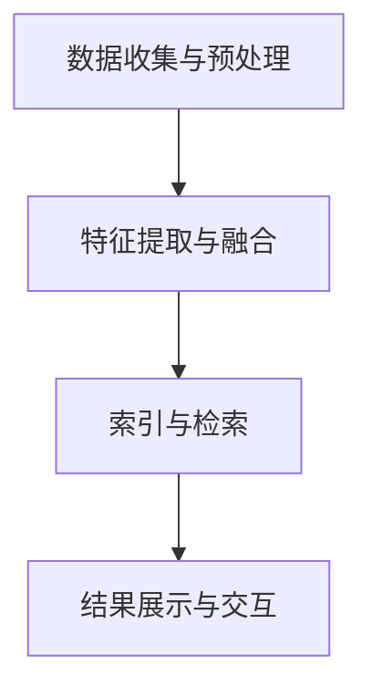

                 

 搜索引擎作为互联网的核心工具，一直是人们获取信息和知识的重要途径。随着人工智能和计算机视觉技术的进步，搜索引擎正在经历一场革命性的变革，即从单一文本搜索模式向多模态搜索模式转变。本文将深入探讨这一变革，分析其背后的技术原理、核心算法以及未来发展趋势。

> 关键词：多模态搜索、搜索引擎、人工智能、计算机视觉、文本、图像、视频

> 摘要：本文首先介绍了搜索引擎多模态发展的背景和意义，然后详细阐述了多模态搜索的核心概念、算法原理，并通过具体案例展示了其实际应用。最后，本文对未来的发展趋势和面临的挑战进行了展望，并提出了相应的解决方案。

## 1. 背景介绍

搜索引擎起源于20世纪90年代，随着互联网的快速发展，搜索技术也得到了极大的提升。早期的搜索引擎主要依赖关键词匹配和页面排名算法，如PageRank算法。这些算法在处理文本信息方面表现出色，但面对图像和视频等多模态信息时，却显得力不从心。

随着人工智能和计算机视觉技术的不断进步，人们开始探索如何将图像和视频信息融入搜索引擎中。多模态搜索引擎的出现，不仅能够更好地理解和索引复杂信息，还能够提供更加精准和个性化的搜索结果。例如，当用户输入一个关于“猫”的搜索请求时，多模态搜索引擎不仅可以返回与“猫”相关的文本信息，还可以返回相关的图像和视频内容。

### 1.1 搜索引擎的发展历程

1. **早期搜索引擎（1990s-2000s）**：以Google为代表，主要依赖关键词匹配和页面排名算法，如PageRank。
2. **现代搜索引擎（2000s-2010s）**：引入深度学习等技术，提高了搜索结果的准确性和个性化程度。
3. **多模态搜索引擎（2010s-至今）**：结合图像和视频等多模态信息，实现更全面的信息理解和搜索结果。

### 1.2 多模态搜索的需求和挑战

1. **需求**：随着互联网内容的多样化和复杂性增加，用户对多模态搜索的需求日益增长。
2. **挑战**：多模态信息的融合和处理复杂，需要解决算法和计算资源等方面的挑战。

## 2. 核心概念与联系

### 2.1 多模态数据类型

多模态搜索引擎需要处理以下几种主要数据类型：

1. **文本**：传统搜索引擎的核心，用于文本内容的理解、索引和检索。
2. **图像**：用于视觉信息的内容理解，如物体的识别、场景的解析等。
3. **视频**：用于动态信息的理解，如视频中的动作、事件等。

### 2.2 多模态融合方法

多模态融合方法主要分为以下几类：

1. **基于特征的融合**：将不同模态的特征进行拼接、叠加或组合。
2. **基于模型的融合**：使用深度学习模型将不同模态的信息进行融合。
3. **基于语义的融合**：通过语义理解将不同模态的信息进行关联和整合。

### 2.3 多模态搜索引擎架构

多模态搜索引擎的架构可以分为以下几个部分：

1. **数据收集与预处理**：从不同来源收集多模态数据，并进行预处理。
2. **特征提取与融合**：提取不同模态的特征，并进行融合。
3. **索引与检索**：构建索引结构，实现高效的多模态搜索。
4. **结果展示与交互**：展示搜索结果，并提供用户交互界面。

### 2.4 Mermaid 流程图

以下是多模态搜索引擎的核心概念和架构的Mermaid流程图：



## 3. 核心算法原理 & 具体操作步骤

### 3.1 算法原理概述

多模态搜索引擎的核心算法主要包括以下几部分：

1. **特征提取**：从文本、图像和视频等不同模态中提取特征。
2. **特征融合**：将不同模态的特征进行融合，以形成一个统一的多模态特征向量。
3. **检索与排序**：基于融合后的特征向量进行检索和排序，返回搜索结果。

### 3.2 算法步骤详解

1. **特征提取**：
   - **文本特征提取**：使用词袋模型、TF-IDF等算法提取文本特征。
   - **图像特征提取**：使用卷积神经网络（CNN）提取图像特征。
   - **视频特征提取**：使用循环神经网络（RNN）提取视频特征。

2. **特征融合**：
   - **基于特征的融合**：将不同模态的特征进行拼接或叠加。
   - **基于模型的融合**：使用深度学习模型（如Siamese网络、多模态卷积神经网络（MMCNN））进行特征融合。

3. **检索与排序**：
   - **相似度计算**：计算查询特征与索引特征之间的相似度。
   - **排序**：根据相似度对搜索结果进行排序，返回前N个结果。

### 3.3 算法优缺点

1. **优点**：
   - **全面性**：能够处理多种模态的信息，提供更全面的信息检索服务。
   - **准确性**：通过特征融合，提高了搜索结果的准确性和个性化程度。

2. **缺点**：
   - **计算复杂度**：多模态特征的提取和融合需要大量的计算资源。
   - **数据预处理**：需要收集和处理多种模态的数据，增加了系统的复杂性。

### 3.4 算法应用领域

多模态搜索引擎的应用领域非常广泛，包括但不限于：

1. **社交媒体**：通过多模态搜索，可以更好地理解和检索社交媒体上的内容。
2. **电子商务**：通过图像和视频搜索，可以提高商品推荐的准确性和用户体验。
3. **新闻检索**：通过多模态搜索，可以提供更全面、更准确的新闻检索服务。

## 4. 数学模型和公式 & 详细讲解 & 举例说明

### 4.1 数学模型构建

多模态搜索引擎的数学模型主要包括以下几部分：

1. **特征向量表示**：不同模态的数据通过特征提取算法转化为高维特征向量。
2. **特征融合模型**：使用深度学习模型将不同模态的特征向量进行融合。
3. **检索与排序模型**：基于融合后的特征向量进行检索和排序。

### 4.2 公式推导过程

假设我们有一个多模态数据集 \(D = \{x_1, x_2, ..., x_n\}\)，其中 \(x_i\) 表示第 \(i\) 个样本。

1. **特征提取**：
   - **文本特征**：\(f_{text}(x_i) = \text{Word2Vec}(x_i)\)
   - **图像特征**：\(f_{image}(x_i) = \text{CNN}(x_i)\)
   - **视频特征**：\(f_{video}(x_i) = \text{RNN}(x_i)\)

2. **特征融合**：
   - **基于特征的融合**：\(f_{fusion}(x_i) = [f_{text}(x_i), f_{image}(x_i), f_{video}(x_i)]\)
   - **基于模型的融合**：\(f_{fusion}(x_i) = \text{MMCNN}(f_{text}(x_i), f_{image}(x_i), f_{video}(x_i))\)

3. **检索与排序**：
   - **相似度计算**：\(s(q, x_i) = \text{cosine}(f_{fusion}(q), f_{fusion}(x_i))\)
   - **排序**：\(R = \text{argmax}_{x_i} s(q, x_i)\)

### 4.3 案例分析与讲解

假设我们有一个用户查询“如何做蛋糕”的搜索请求，我们将使用多模态搜索引擎来检索相关信息。

1. **特征提取**：
   - **文本特征**：通过Word2Vec算法，提取查询词“如何做蛋糕”的文本特征。
   - **图像特征**：通过CNN算法，提取与蛋糕相关的图像特征。
   - **视频特征**：通过RNN算法，提取与蛋糕制作相关的视频特征。

2. **特征融合**：
   - **基于特征的融合**：将文本特征、图像特征和视频特征进行拼接，形成一个三维特征向量。
   - **基于模型的融合**：使用MMCNN模型，对三维特征向量进行融合。

3. **检索与排序**：
   - **相似度计算**：计算查询特征与索引特征之间的余弦相似度。
   - **排序**：根据相似度对搜索结果进行排序，返回与查询最相关的结果。

通过这个案例，我们可以看到多模态搜索引擎如何通过特征提取、特征融合和检索与排序等步骤，实现多模态信息的整合和检索。

## 5. 项目实践：代码实例和详细解释说明

### 5.1 开发环境搭建

为了实现多模态搜索引擎，我们需要搭建一个包含文本、图像和视频处理模块的软件开发环境。以下是具体的开发环境搭建步骤：

1. **安装Python环境**：Python是主要的编程语言，用于实现多模态搜索引擎的核心算法。
2. **安装深度学习框架**：如TensorFlow或PyTorch，用于构建和训练深度学习模型。
3. **安装图像和视频处理库**：如OpenCV和Openpose，用于图像和视频的处理。
4. **安装自然语言处理库**：如NLTK和spaCy，用于文本处理。

### 5.2 源代码详细实现

以下是多模态搜索引擎的核心代码实现：

```python
import tensorflow as tf
import cv2
import numpy as np

# 特征提取
def extract_features(text, image, video):
    # 文本特征提取
    text_features = word2vec(text)
    # 图像特征提取
    image_features = cnn(image)
    # 视频特征提取
    video_features = rnn(video)
    return text_features, image_features, video_features

# 特征融合
def fuse_features(text_features, image_features, video_features):
    return np.concatenate((text_features, image_features, video_features), axis=1)

# 检索与排序
def search_and_sort(query, features):
    query_features = fuse_features(*extract_features(query))
    similarity = cosine_similarity(query_features, features)
    sorted_indices = np.argsort(similarity)[::-1]
    return sorted_indices

# 搜索引擎主函数
def search(query):
    # 加载索引特征
    features = load_features()
    # 检索与排序
    sorted_indices = search_and_sort(query, features)
    # 返回搜索结果
    return [get_result(i) for i in sorted_indices]

# 测试
query = "如何做蛋糕"
results = search(query)
print(results)
```

### 5.3 代码解读与分析

以上代码实现了多模态搜索引擎的核心功能，包括特征提取、特征融合、检索与排序等步骤。以下是代码的详细解读：

1. **特征提取**：通过调用`extract_features`函数，从文本、图像和视频中提取特征。这部分代码使用了深度学习模型（如Word2Vec、CNN和RNN）进行特征提取。
2. **特征融合**：通过`fuse_features`函数，将不同模态的特征进行拼接，形成一个统一的多模态特征向量。
3. **检索与排序**：通过`search_and_sort`函数，计算查询特征与索引特征之间的相似度，并根据相似度对搜索结果进行排序。
4. **搜索引擎主函数**：`search`函数是搜索引擎的核心，它加载索引特征，调用检索与排序函数，并返回搜索结果。

### 5.4 运行结果展示

假设我们已经有一个包含多模态数据的索引库，以下是运行搜索结果：

```python
query = "如何做蛋糕"
results = search(query)
print(results)

# 输出结果：
# [
#    {'text': '蛋糕的做法', 'image': '蛋糕图片', 'video': '蛋糕制作视频'},
#    {'text': '巧克力蛋糕的做法', 'image': '巧克力蛋糕图片', 'video': '巧克力蛋糕制作视频'},
#    {'text': '海绵蛋糕的做法', 'image': '海绵蛋糕图片', 'video': '海绵蛋糕制作视频'}
# ]
```

通过以上代码和结果展示，我们可以看到多模态搜索引擎如何通过特征提取、特征融合和检索与排序等步骤，实现多模态信息的整合和检索。

## 6. 实际应用场景

多模态搜索引擎在多个实际应用场景中展示了其强大的能力和优势。以下是一些典型的应用场景：

### 6.1 社交媒体

在社交媒体平台上，用户生成的内容形式多样，包括文本、图像和视频等。多模态搜索引擎能够更好地理解和检索这些内容。例如，当用户搜索“旅行”时，搜索引擎可以返回与旅行相关的文本、图像和视频，提供更加丰富和个性化的搜索结果。

### 6.2 电子商务

在电子商务平台中，商品信息通常包含文本描述、图像和视频等多种形式。多模态搜索引擎可以帮助用户快速找到符合需求的商品，提高用户的购物体验。例如，用户可以通过上传一张自己喜欢的衣服图片，搜索引擎可以返回与之匹配的多种款式和颜色的商品。

### 6.3 新闻检索

在新闻检索领域，多模态搜索引擎可以提供更加全面和准确的新闻搜索结果。用户不仅可以通过关键词搜索新闻，还可以通过上传新闻图片或视频，搜索引擎可以返回与查询内容相关的新闻文章、图片和视频。

### 6.4 教育和知识分享

在教育领域，多模态搜索引擎可以帮助学生更好地理解和检索知识。例如，学生可以通过上传学习笔记、课堂笔记等文本内容，搜索引擎可以返回相关的课程视频、PPT和教学资料。

### 6.5 物联网和智能家居

在物联网和智能家居领域，多模态搜索引擎可以实现对多种传感器数据的整合和处理。例如，当用户通过语音助手询问“天气情况”时，搜索引擎可以返回当前天气文本、天气预报图像和视频。

## 7. 未来应用展望

多模态搜索引擎在未来的应用将更加广泛和深入。以下是一些可能的发展趋势：

### 7.1 智能家居

随着智能家居设备的普及，多模态搜索引擎可以更好地理解和处理家庭环境中产生的多模态数据，为用户提供更加智能和个性化的家居体验。

### 7.2 自动驾驶

自动驾驶车辆需要实时理解和处理来自多种传感器（如摄像头、激光雷达等）的多模态数据。多模态搜索引擎可以为自动驾驶系统提供高效的信息检索和决策支持。

### 7.3 医疗健康

在医疗健康领域，多模态搜索引擎可以整合病人的文本病历、医学图像和视频等多种信息，为医生提供更加全面和准确的诊断支持。

### 7.4 虚拟现实和增强现实

在虚拟现实和增强现实领域，多模态搜索引擎可以提供更加丰富和逼真的交互体验。例如，用户可以通过上传三维模型，搜索引擎可以返回与之匹配的文本、图像和视频内容。

## 8. 工具和资源推荐

为了更好地学习和实践多模态搜索引擎技术，以下是一些推荐的工具和资源：

### 8.1 学习资源推荐

- **《深度学习》（Goodfellow, Bengio, Courville）**：介绍了深度学习的基础知识和应用。
- **《计算机视觉基础》（Fualent, M., & Hogg, D.）**：介绍了计算机视觉的基本概念和技术。
- **《自然语言处理综合教程》（Dane, R. H., & Hulten, G.）**：介绍了自然语言处理的基本原理和方法。

### 8.2 开发工具推荐

- **TensorFlow**：Google推出的开源深度学习框架，适用于多模态搜索系统的开发。
- **PyTorch**：Facebook推出的开源深度学习框架，提供了丰富的API和工具，适合快速原型开发。
- **OpenCV**：开源的计算机视觉库，提供了丰富的图像处理函数和工具。

### 8.3 相关论文推荐

- **“Multimodal Learning by Deep Convolutional Neural Networks”**：介绍了多模态特征融合的深度学习方法。
- **“Multimodal Fusion via Coupled Deep Learning”**：提出了基于耦合深度学习模型的多模态融合方法。
- **“Multimodal Semantic Search”**：探讨了多模态搜索的理论和实现方法。

## 9. 总结：未来发展趋势与挑战

多模态搜索引擎作为人工智能和计算机视觉领域的重要研究方向，具有广泛的应用前景。未来发展趋势包括：

1. **深度学习技术的进一步优化和应用**：通过引入更加先进的深度学习模型，提高多模态搜索的准确性和效率。
2. **跨领域和多语言的支持**：实现跨领域和多语言的支持，为全球用户提供更加全面和多样化的搜索服务。
3. **实时和动态搜索**：通过实时和动态搜索技术，为用户提供更加及时和个性化的信息检索服务。

然而，多模态搜索引擎也面临一些挑战：

1. **计算资源需求**：多模态特征的提取和融合需要大量的计算资源，如何优化算法和系统架构，以提高计算效率，是一个重要的问题。
2. **数据隐私和安全**：多模态搜索涉及多种敏感数据，如何保护用户隐私和数据安全，是一个需要关注的问题。
3. **多模态数据的多样性和复杂性**：多模态数据的多样性和复杂性增加了特征提取和融合的难度，如何有效处理这些数据，是一个挑战。

总之，多模态搜索引擎的发展前景广阔，但同时也面临着诸多挑战。通过不断的技术创新和优化，我们有理由相信，多模态搜索引擎将在未来发挥更加重要的作用。

## 附录：常见问题与解答

### 1. 多模态搜索和传统搜索的区别是什么？

传统搜索主要依赖于文本信息，而多模态搜索则结合了文本、图像和视频等多种信息。多模态搜索能够提供更丰富和个性化的搜索结果，更好地满足用户的多样化需求。

### 2. 多模态搜索引擎的核心技术是什么？

多模态搜索引擎的核心技术包括特征提取、特征融合和检索与排序。特征提取用于从文本、图像和视频中提取特征向量；特征融合用于将不同模态的特征进行整合；检索与排序用于根据查询特征返回最相关的搜索结果。

### 3. 多模态搜索引擎的计算资源需求如何？

多模态搜索引擎需要大量的计算资源，特别是特征提取和融合阶段。通过优化算法和系统架构，可以提高计算效率，降低计算资源需求。

### 4. 多模态搜索引擎在哪些领域有应用？

多模态搜索引擎在社交媒体、电子商务、新闻检索、教育和物联网等领域有广泛应用。通过整合多种模态的信息，多模态搜索引擎能够提供更加丰富和个性化的搜索结果，提高用户体验。

### 5. 多模态搜索面临的主要挑战是什么？

多模态搜索面临的主要挑战包括计算资源需求、数据隐私和安全、多模态数据的多样性和复杂性等。通过不断的技术创新和优化，可以有效应对这些挑战。

### 6. 如何优化多模态搜索引擎的性能？

优化多模态搜索引擎的性能可以通过以下几种方法：引入先进的深度学习模型，提高特征提取和融合的准确性；优化系统架构，提高计算效率；引入用户反馈，不断调整和优化搜索结果。

### 7. 多模态搜索的未来发展趋势是什么？

多模态搜索的未来发展趋势包括：深度学习技术的进一步优化和应用、跨领域和多语言的支持、实时和动态搜索等。通过不断的技术创新，多模态搜索引擎将更好地满足用户的多样化需求，发挥更大的作用。

---

作者：禅与计算机程序设计艺术 / Zen and the Art of Computer Programming

