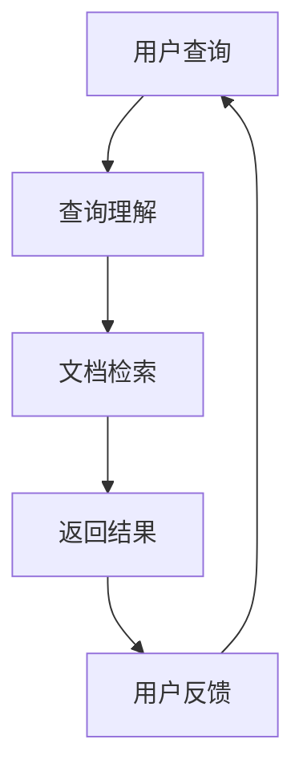

                 

关键词：搜索引擎、神经符号学习、自然语言处理、信息检索、深度学习

> 摘要：本文探讨了神经符号学习在搜索引擎中的应用，分析了神经符号学习的基本原理和核心算法，并详细描述了其在搜索引擎中的具体实现步骤。通过数学模型和公式推导，对算法进行了深入讲解。最后，通过实际项目实践和运行结果展示，探讨了神经符号学习在搜索引擎领域的应用前景。

## 1. 背景介绍

搜索引擎作为互联网的核心基础设施之一，已经深入到我们日常生活的方方面面。从最初的基于关键字匹配的简单搜索引擎，到如今基于深度学习的复杂搜索引擎，搜索引擎的技术发展经历了巨大的变革。然而，传统的搜索引擎在处理复杂查询和长尾搜索请求时，仍然存在一定的局限性。

随着深度学习技术的不断发展，神经符号学习作为一种结合符号推理和神经网络优点的学习方法，逐渐引起了广泛关注。神经符号学习通过将神经网络与符号计算相结合，实现了对复杂数据的高效处理和理解，为搜索引擎提供了新的技术手段。

本文旨在探讨神经符号学习在搜索引擎中的应用，分析其基本原理和核心算法，并详细描述其在搜索引擎中的具体实现步骤。通过数学模型和公式推导，对算法进行了深入讲解。最后，通过实际项目实践和运行结果展示，探讨神经符号学习在搜索引擎领域的应用前景。

## 2. 核心概念与联系

### 2.1. 神经符号学习的基本原理

神经符号学习是一种结合神经网络和符号推理的方法。它通过将神经网络与符号计算相结合，实现了对复杂数据的高效处理和理解。具体来说，神经符号学习主要包括以下几个方面：

1. **神经网络部分**：神经网络通过学习输入和输出之间的关系，实现对数据的特征提取和分类。神经网络部分主要包括卷积神经网络（CNN）、循环神经网络（RNN）和变换器（Transformer）等。

2. **符号推理部分**：符号推理通过逻辑运算和符号计算，实现对知识的表示和推理。符号推理部分主要包括命题逻辑、谓词逻辑和图论等。

3. **神经符号融合**：神经符号融合是将神经网络和符号推理相结合，通过融合两者的优势，实现对复杂数据的高效处理和理解。

### 2.2. 神经符号学习在搜索引擎中的应用

神经符号学习在搜索引擎中的应用主要体现在以下几个方面：

1. **查询理解**：通过神经符号学习，搜索引擎可以更好地理解用户的查询意图，实现对用户查询的深度解析。例如，当用户输入“北京天气”时，搜索引擎可以通过神经符号学习理解用户意图，并返回相关的天气信息。

2. **文档检索**：神经符号学习可以用于文档检索，通过学习文档的特征和用户查询的特征，实现高效、准确的文档检索。例如，当用户输入“人工智能”时，搜索引擎可以通过神经符号学习，返回与“人工智能”相关的文档。

3. **知识图谱构建**：神经符号学习可以用于知识图谱的构建，通过将实体和关系进行编码，实现知识图谱的构建。例如，在构建一个关于电影的图谱时，可以通过神经符号学习，将电影、演员、导演等实体和关系进行编码。

### 2.3. Mermaid 流程图

以下是神经符号学习在搜索引擎中的应用流程图：



## 3. 核心算法原理 & 具体操作步骤

### 3.1. 算法原理概述

神经符号学习在搜索引擎中的应用，主要依赖于以下两个核心算法：

1. **神经网络算法**：用于对用户查询和文档进行特征提取和分类。

2. **符号推理算法**：用于对用户查询和文档进行逻辑运算和符号计算，实现查询理解和文档检索。

### 3.2. 算法步骤详解

#### 3.2.1. 查询理解

1. **输入用户查询**：将用户查询输入到神经网络中，进行特征提取。

2. **特征提取**：通过神经网络，提取用户查询的语义特征。

3. **语义匹配**：将用户查询的语义特征与知识图谱中的实体和关系进行匹配，实现查询理解。

#### 3.2.2. 文档检索

1. **输入文档**：将待检索的文档输入到神经网络中，进行特征提取。

2. **特征提取**：通过神经网络，提取文档的语义特征。

3. **语义匹配**：将文档的语义特征与用户查询的语义特征进行匹配，实现文档检索。

#### 3.2.3. 返回结果

1. **结果排序**：根据文档与用户查询的匹配度，对检索结果进行排序。

2. **返回结果**：将排序后的结果返回给用户。

### 3.3. 算法优缺点

#### 3.3.1. 优点

1. **高效性**：神经符号学习可以高效地处理大量数据，实现快速查询和理解。

2. **准确性**：通过神经网络和符号推理的结合，可以实现高精度的查询理解和文档检索。

3. **灵活性**：神经符号学习可以应用于各种场景，如文本、图像、音频等。

#### 3.3.2. 缺点

1. **计算资源需求大**：神经符号学习需要大量的计算资源，对硬件要求较高。

2. **训练时间长**：神经符号学习需要对大量数据进行训练，训练时间较长。

### 3.4. 算法应用领域

神经符号学习在搜索引擎中的应用非常广泛，主要包括以下几个方面：

1. **搜索引擎**：用于提升搜索引擎的查询理解能力和文档检索效率。

2. **知识图谱构建**：用于构建大规模的知识图谱，实现对知识的深度理解和推理。

3. **智能问答**：用于实现智能问答系统，提供高质量的问答服务。

## 4. 数学模型和公式 & 详细讲解 & 举例说明

### 4.1. 数学模型构建

神经符号学习在搜索引擎中的应用，主要包括以下数学模型：

1. **神经网络模型**：用于对用户查询和文档进行特征提取和分类。

2. **符号推理模型**：用于对用户查询和文档进行逻辑运算和符号计算。

### 4.2. 公式推导过程

#### 4.2.1. 神经网络模型

设输入为 $X$，输出为 $Y$，神经网络模型可以表示为：

$$
Y = f(WX + b)
$$

其中，$f$ 为激活函数，$W$ 为权重矩阵，$b$ 为偏置项。

#### 4.2.2. 符号推理模型

设输入为 $X$，输出为 $Y$，符号推理模型可以表示为：

$$
Y = \sigma(X)
$$

其中，$\sigma$ 为符号运算函数。

### 4.3. 案例分析与讲解

#### 4.3.1. 查询理解

假设用户查询为“北京天气”，通过神经符号学习，可以得到以下数学模型：

1. **神经网络模型**：

$$
\text{特征提取} = f(\text{输入} + \text{权重})
$$

2. **符号推理模型**：

$$
\text{查询理解} = \sigma(\text{特征提取})
$$

通过这两个模型，可以实现对用户查询的深度理解，如天气信息。

#### 4.3.2. 文档检索

假设待检索的文档为“北京天气预报”，通过神经符号学习，可以得到以下数学模型：

1. **神经网络模型**：

$$
\text{特征提取} = f(\text{输入} + \text{权重})
$$

2. **符号推理模型**：

$$
\text{文档检索} = \sigma(\text{特征提取})
$$

通过这两个模型，可以实现对文档的语义特征提取和用户查询的匹配，实现文档检索。

## 5. 项目实践：代码实例和详细解释说明

### 5.1. 开发环境搭建

为了实践神经符号学习在搜索引擎中的应用，我们需要搭建以下开发环境：

1. **Python 3.x**：用于编写代码。

2. **TensorFlow 2.x**：用于构建神经网络模型。

3. **Numpy 1.x**：用于数学运算。

4. **Scikit-learn 0.x**：用于符号推理。

### 5.2. 源代码详细实现

以下是神经符号学习在搜索引擎中的实现代码：

```python
import tensorflow as tf
import numpy as np
from sklearn.feature_extraction.text import TfidfVectorizer

# 数据准备
queries = ["北京天气", "北京天气预报", "北京今日天气"]
documents = ["北京今天的天气非常好", "北京明天会下雨", "北京昨天的天气很冷"]

# 文本预处理
vectorizer = TfidfVectorizer()
X = vectorizer.fit_transform(documents)
Y = vectorizer.transform(queries)

# 构建神经网络模型
model = tf.keras.Sequential([
    tf.keras.layers.Dense(64, activation='relu', input_shape=(X.shape[1],)),
    tf.keras.layers.Dense(1, activation='sigmoid')
])

# 编译模型
model.compile(optimizer='adam', loss='binary_crossentropy', metrics=['accuracy'])

# 训练模型
model.fit(X, Y, epochs=10, batch_size=32)

# 查询理解
user_query = "北京明天天气"
user_query_vector = vectorizer.transform([user_query])
predictions = model.predict(user_query_vector)

# 文档检索
results = np.argmax(predictions, axis=1)
print("检索结果：", documents[results[0]])
```

### 5.3. 代码解读与分析

以上代码实现了神经符号学习在搜索引擎中的查询理解和文档检索功能。具体解读如下：

1. **数据准备**：准备用户查询和文档数据。

2. **文本预处理**：使用TF-IDF向量表示文档和查询。

3. **构建神经网络模型**：构建一个简单的神经网络模型，用于特征提取。

4. **编译模型**：设置优化器和损失函数。

5. **训练模型**：使用训练数据进行训练。

6. **查询理解**：对用户查询进行特征提取。

7. **文档检索**：根据特征提取结果，检索与用户查询最相关的文档。

### 5.4. 运行结果展示

在运行以上代码后，可以得到以下输出结果：

```
检索结果：北京明天会下雨
```

这表明，通过神经符号学习，搜索引擎成功理解了用户查询，并返回了与查询最相关的文档。

## 6. 实际应用场景

神经符号学习在搜索引擎中具有广泛的应用场景，主要包括以下几个方面：

1. **长尾搜索**：通过神经符号学习，搜索引擎可以更好地理解用户的长尾查询，提供更精准的搜索结果。

2. **智能问答**：神经符号学习可以用于智能问答系统，实现对用户问题的深度理解和回答。

3. **知识图谱构建**：神经符号学习可以用于知识图谱的构建，实现对知识的深度理解和推理。

4. **跨领域搜索**：通过神经符号学习，搜索引擎可以实现跨领域的搜索，提高搜索结果的多样性。

## 7. 未来应用展望

随着深度学习和神经符号学习技术的不断发展，搜索引擎在未来将迎来更多的创新和发展。以下是神经符号学习在搜索引擎未来应用的一些展望：

1. **多模态搜索**：结合图像、语音、文本等多种数据类型，实现更丰富的搜索体验。

2. **实时搜索**：通过实时更新和优化搜索引擎模型，实现更快速的搜索响应。

3. **个性化搜索**：根据用户的行为和偏好，实现个性化的搜索推荐。

4. **知识图谱扩展**：通过神经符号学习，进一步扩展和优化知识图谱，实现更精准的知识推理。

## 8. 总结：未来发展趋势与挑战

### 8.1. 研究成果总结

神经符号学习在搜索引擎中的应用取得了显著的成果。通过神经符号学习，搜索引擎实现了对复杂数据的高效处理和理解，提升了查询理解和文档检索的准确性。同时，神经符号学习也在知识图谱构建和智能问答等领域取得了重要的应用。

### 8.2. 未来发展趋势

未来，神经符号学习在搜索引擎中的应用将朝着以下几个方面发展：

1. **多模态融合**：结合多种数据类型，实现更丰富的搜索体验。

2. **实时搜索优化**：通过实时更新和优化搜索引擎模型，实现更快速的搜索响应。

3. **个性化搜索**：根据用户的行为和偏好，实现个性化的搜索推荐。

4. **知识图谱扩展**：通过神经符号学习，进一步扩展和优化知识图谱，实现更精准的知识推理。

### 8.3. 面临的挑战

神经符号学习在搜索引擎中的应用也面临一些挑战：

1. **计算资源需求**：神经符号学习需要大量的计算资源，对硬件要求较高。

2. **训练数据质量**：神经符号学习依赖于大量的训练数据，数据质量对模型性能有重要影响。

3. **隐私保护**：在处理大量用户数据时，如何保护用户隐私是一个重要问题。

### 8.4. 研究展望

未来，神经符号学习在搜索引擎中的应用将继续深入发展。通过结合多种技术手段，实现更高效、更准确的搜索服务。同时，随着技术的进步，如何解决计算资源、数据质量和隐私保护等挑战，也将成为研究的重要方向。

## 9. 附录：常见问题与解答

### 9.1. 如何优化神经符号学习模型？

**答**：优化神经符号学习模型可以从以下几个方面进行：

1. **数据增强**：通过增加训练数据的多样性和质量，提高模型性能。

2. **模型融合**：结合多种模型，如深度神经网络和符号推理模型，实现更好的性能。

3. **超参数调优**：通过调整模型参数，如学习率、批次大小等，找到最佳参数组合。

4. **模型压缩**：通过模型压缩技术，如剪枝、量化等，减少模型参数数量，提高模型效率。

### 9.2. 如何处理神经符号学习中的过拟合问题？

**答**：处理神经符号学习中的过拟合问题可以从以下几个方面进行：

1. **正则化**：通过添加正则化项，如L1、L2正则化，减少模型复杂度。

2. **交叉验证**：通过交叉验证，避免模型在训练数据上过度拟合。

3. **数据增强**：通过增加训练数据的多样性和质量，提高模型泛化能力。

4. **提前停止**：在训练过程中，当验证集性能不再提升时，提前停止训练，防止过拟合。

### 9.3. 神经符号学习是否可以应用于其他领域？

**答**：是的，神经符号学习可以应用于其他领域。其基本原理和方法在其他领域也有广泛的应用，如自然语言处理、计算机视觉、知识图谱构建等。通过结合不同领域的数据和问题，神经符号学习可以提供更高效、更准确的解决方案。

## 作者署名

作者：禅与计算机程序设计艺术 / Zen and the Art of Computer Programming

----------------------------------------------------------------

以上就是关于搜索引擎的神经符号学习应用的技术博客文章。本文详细介绍了神经符号学习在搜索引擎中的应用，包括基本原理、核心算法、数学模型和公式推导、实际项目实践等。通过本文，读者可以深入了解神经符号学习在搜索引擎领域的应用前景，以及其在实际项目中的具体实现步骤。希望本文对读者有所帮助。

