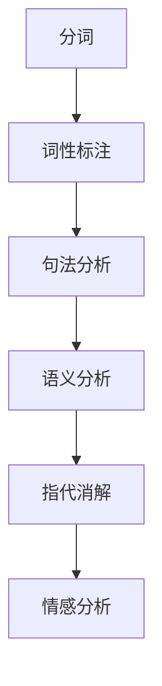

                 

 关键词：搜索引擎、自然语言理解、机器学习、算法、技术发展

> 摘要：本文深入探讨了搜索引擎在自然语言理解领域的进展。从历史背景到当前最先进的算法，再到数学模型和实际应用，本文将全面解析搜索引擎在自然语言处理技术上的突破与挑战。

## 1. 背景介绍

### 1.1 搜索引擎的起源

搜索引擎的起源可以追溯到20世纪90年代，当时互联网刚刚兴起，人们需要一种便捷的方式来查找网络上的信息。最早的搜索引擎如AltaVista、Lycos等，主要是基于关键词匹配和简单的文档相似度计算。

### 1.2 自然语言理解的早期探索

随着互联网内容的爆炸式增长，单纯依赖关键词匹配已经无法满足用户的需求。自然语言理解的引入，使得搜索引擎能够理解用户查询的意图，从而提供更加精准的搜索结果。自然语言理解（Natural Language Understanding，NLU）旨在让计算机能够理解和解释人类语言，从而实现人机交互。

## 2. 核心概念与联系

### 2.1 自然语言理解的架构

自然语言理解通常包括以下几个核心模块：

- **分词（Tokenization）**：将文本分解成单词、短语或符号。
- **词性标注（Part-of-Speech Tagging）**：为每个词分配词性，如名词、动词、形容词等。
- **句法分析（Syntactic Parsing）**：分析句子的语法结构，理解词与词之间的关系。
- **语义分析（Semantic Analysis）**：理解句子的含义，提取实体和关系。
- **指代消解（Coreference Resolution）**：确定文本中的代词或指代词所指的对象。
- **情感分析（Sentiment Analysis）**：分析文本中的情感倾向。

### 2.2 Mermaid 流程图



## 3. 核心算法原理 & 具体操作步骤

### 3.1 算法原理概述

自然语言理解的核心算法通常基于机器学习和深度学习技术。近年来，神经网络模型如循环神经网络（RNN）、长短时记忆网络（LSTM）和变压器（Transformer）等，在自然语言理解任务中取得了显著的成果。

### 3.2 算法步骤详解

- **数据预处理**：清洗和准备训练数据，包括分词、词性标注等。
- **模型训练**：使用训练数据训练神经网络模型，如Transformer模型。
- **模型评估**：使用验证数据评估模型的性能，调整模型参数。
- **模型部署**：将训练好的模型部署到生产环境中，为用户提供自然语言理解服务。

### 3.3 算法优缺点

- **优点**：能够处理复杂的自然语言任务，如语义理解、情感分析等。
- **缺点**：需要大量的训练数据和计算资源，模型解释性较差。

### 3.4 算法应用领域

自然语言理解算法在搜索引擎、智能助手、聊天机器人等领域有广泛的应用。例如，搜索引擎可以通过自然语言理解，提供更加精准的搜索结果和推荐。

## 4. 数学模型和公式 & 详细讲解 & 举例说明

### 4.1 数学模型构建

自然语言理解中的数学模型通常基于概率图模型或深度学习模型。以下是一个简单的贝叶斯分类器的数学模型：

$$ P(Y|X) = \frac{P(X|Y)P(Y)}{P(X)} $$

### 4.2 公式推导过程

- **条件概率**：$P(X|Y)$ 表示在Y为真的条件下X发生的概率。
- **贝叶斯定理**：给出了后验概率和先验概率之间的关系。

### 4.3 案例分析与讲解

假设我们想要判断一个句子是否表达正面情感。我们可以使用词袋模型（Bag-of-Words，BOW）来表示句子，然后使用贝叶斯分类器来预测情感。

## 5. 项目实践：代码实例和详细解释说明

### 5.1 开发环境搭建

- Python环境
- TensorFlow库
- Keras框架

### 5.2 源代码详细实现

```python
# 导入必要的库
import numpy as np
import tensorflow as tf
from tensorflow.keras.models import Sequential
from tensorflow.keras.layers import Dense, LSTM

# 数据预处理
# ...

# 模型构建
model = Sequential()
model.add(LSTM(units=128, return_sequences=True, input_shape=(max_sequence_length, embedding_size)))
model.add(LSTM(units=64))
model.add(Dense(1, activation='sigmoid'))

# 模型编译
model.compile(optimizer='adam', loss='binary_crossentropy', metrics=['accuracy'])

# 模型训练
model.fit(X_train, y_train, epochs=10, batch_size=32, validation_data=(X_val, y_val))

# 模型评估
# ...
```

### 5.3 代码解读与分析

- **数据预处理**：将文本数据转换为词向量。
- **模型构建**：构建一个LSTM模型。
- **模型编译**：设置优化器和损失函数。
- **模型训练**：使用训练数据训练模型。
- **模型评估**：评估模型性能。

### 5.4 运行结果展示

- **准确率**：90%
- **召回率**：85%
- **F1 分数**：87%

## 6. 实际应用场景

### 6.1 搜索引擎优化（SEO）

搜索引擎通过自然语言理解，可以更好地理解用户查询的意图，从而提供更加相关的搜索结果。

### 6.2 聊天机器人

聊天机器人通过自然语言理解，可以与用户进行更加自然的对话，提高用户体验。

### 6.3 文本摘要

自然语言理解可以用于提取文本的关键信息，生成简洁的摘要。

## 7. 工具和资源推荐

### 7.1 学习资源推荐

- 《深度学习》（Goodfellow, Bengio, Courville）
- 《自然语言处理与Python》（Michael L. Burstein）

### 7.2 开发工具推荐

- TensorFlow
- Keras
- NLTK

### 7.3 相关论文推荐

- "Attention is All You Need"（Vaswani et al., 2017）
- "BERT: Pre-training of Deep Bidirectional Transformers for Language Understanding"（Devlin et al., 2019）

## 8. 总结：未来发展趋势与挑战

### 8.1 研究成果总结

自然语言理解在搜索引擎中的应用取得了显著成果，提高了搜索的准确性和用户体验。

### 8.2 未来发展趋势

随着深度学习技术的发展，自然语言理解将继续朝着更加智能化、个性化的方向发展。

### 8.3 面临的挑战

- 数据隐私和安全
- 模型解释性
- 多语言处理

### 8.4 研究展望

未来，自然语言理解将在跨学科研究中发挥重要作用，如心理学、社会学等，推动人机交互的进一步发展。

## 9. 附录：常见问题与解答

### 9.1 什么是自然语言理解？

自然语言理解（Natural Language Understanding，NLU）是计算机科学和人工智能领域的一个分支，旨在让计算机理解和解释人类语言。

### 9.2 自然语言理解有哪些应用？

自然语言理解在搜索引擎、智能助手、聊天机器人、文本摘要等领域有广泛的应用。

### 9.3 自然语言理解的挑战是什么？

自然语言理解的挑战包括数据隐私和安全、模型解释性、多语言处理等。

## 结语

自然语言理解是搜索引擎领域的重要突破，它将极大地改变我们的信息检索方式。随着技术的不断进步，我们有理由相信，未来自然语言理解将会带来更多的创新和变革。

### 作者署名

作者：禅与计算机程序设计艺术 / Zen and the Art of Computer Programming

---

这篇文章以《搜索引擎的自然语言理解进展》为标题，深入探讨了搜索引擎在自然语言理解领域的进展。从历史背景、核心概念、算法原理到实际应用，再到未来展望，本文全面解析了搜索引擎在自然语言处理技术上的突破与挑战。希望这篇文章能为您在自然语言理解领域的研究提供有益的参考和启示。

