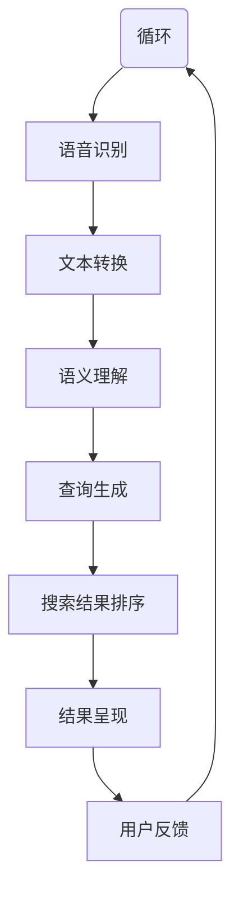

                 

关键词：搜索引擎、语音交互、自然语言处理、用户体验、优化策略、算法改进、技术挑战

> 摘要：随着人工智能技术的快速发展，搜索引擎逐渐从传统的文本交互模式转变为更加智能的语音交互模式。本文将对搜索引擎的语音交互优化进行深入探讨，包括核心概念、算法原理、数学模型、项目实践和未来应用场景。通过详细分析，旨在为业界提供有效的优化策略和解决方案，提升用户搜索体验。

## 1. 背景介绍

搜索引擎是互联网时代最重要的信息检索工具之一。从最初的纯文本搜索引擎，如Google和百度，到如今包含语音搜索功能的智能助手，如Siri、Alexa和Google Assistant，搜索技术经历了巨大的变革。语音交互作为人机交互的一种重要形式，具有便捷、自然和高效的特点，正逐渐成为现代搜索引擎的核心功能。

语音搜索不仅提高了用户的搜索效率，还在一定程度上解决了视觉障碍者、手部受伤者等特殊用户群体的需求。然而，语音交互也带来了诸多挑战，如语音识别准确性、语义理解和上下文处理等。为了提供更好的用户体验，搜索引擎需要不断优化语音交互功能。

### 1.1 语音搜索的发展历程

- **早期探索**：20世纪90年代，语音识别技术开始应用于语音搜索，但受限于识别准确率和处理能力，应用场景较为有限。
- **快速发展**：21世纪初，随着深度学习和自然语言处理技术的进步，语音识别和语义理解能力得到了显著提升。
- **当前现状**：现在，许多主流搜索引擎都集成了语音搜索功能，并在不断地优化和改进中。

### 1.2 语音交互的特点

- **自然性**：语音交互更接近人类的自然语言表达方式，用户可以像与朋友交谈一样进行搜索。
- **便捷性**：用户无需手动输入关键词，只需通过语音指令即可获取信息，提高了搜索效率。
- **情感性**：通过语音交互，搜索引擎可以更好地理解用户情绪，提供个性化的搜索结果。

## 2. 核心概念与联系

为了实现高效的语音搜索，我们需要理解几个核心概念，并探讨它们之间的相互关系。以下是一个使用Mermaid绘制的流程图，展示了语音搜索的基本架构和关键环节。



### 2.1 语音识别

语音识别是将用户语音转换为文本的过程。这个过程涉及到音频信号的预处理、特征提取和模型匹配。常见的语音识别模型包括隐马尔可夫模型（HMM）、高斯混合模型（GMM）和深度神经网络（DNN）。

### 2.2 文本转换

文本转换是将识别结果中的文本转换为可分析的格式，如关键词列表或查询语句。这个步骤通常涉及到文本分词、词性标注和实体识别等技术。

### 2.3 语义理解

语义理解是理解用户查询的含义和意图。这个过程涉及到自然语言处理（NLP）技术，如词义消歧、句法分析和语义角色标注。通过语义理解，搜索引擎可以更准确地理解用户的查询，提供相关的搜索结果。

### 2.4 查询生成

查询生成是根据用户的语义理解生成有效的搜索查询。这个过程需要考虑查询的多样性、准确性和完整性。

### 2.5 搜索结果排序

搜索结果排序是根据用户的查询和搜索结果的相关性进行排序。这个过程涉及到信息检索算法，如向量空间模型（VSM）和页面排名算法（PageRank）。

### 2.6 结果呈现

结果呈现是将排序后的搜索结果以可视化的形式呈现给用户。这包括搜索结果列表、图像、视频等多种形式。

### 2.7 用户反馈

用户反馈是收集用户对搜索结果的满意度和搜索过程的体验。通过用户反馈，搜索引擎可以不断优化语音交互功能。

## 3. 核心算法原理 & 具体操作步骤

### 3.1 算法原理概述

语音搜索的核心算法主要包括语音识别、自然语言处理和搜索结果排序。以下是这些算法的基本原理：

### 3.2 算法步骤详解

#### 3.2.1 语音识别

1. **音频预处理**：对用户语音进行降噪、去 silence 处理，提高识别准确率。
2. **特征提取**：从音频信号中提取特征，如 MFCC、LPCC 等。
3. **模型匹配**：使用深度学习模型（如 DNN 或 CNN）进行特征匹配，获取识别结果。

#### 3.2.2 自然语言处理

1. **文本分词**：将识别结果中的文本进行分词，提取关键词。
2. **词性标注**：为每个词标注词性，如名词、动词、形容词等。
3. **实体识别**：识别文本中的实体，如人名、地名、组织名等。

#### 3.2.3 查询生成

1. **关键词提取**：从文本分词结果中提取关键词，构建查询。
2. **语义理解**：理解查询的含义和意图，进行词义消歧和句法分析。
3. **查询扩展**：根据语义理解，对查询进行扩展，提高查询的多样性。

#### 3.2.4 搜索结果排序

1. **相关性计算**：计算搜索结果与查询的相关性。
2. **排序算法**：使用排序算法（如 VSM 或 PageRank），对搜索结果进行排序。

### 3.3 算法优缺点

#### 3.3.1 优点

- **高准确率**：语音识别和自然语言处理技术的不断进步，使得语音搜索的准确率得到了显著提高。
- **用户体验好**：语音交互具有自然、便捷和情感性的特点，提供了更好的用户体验。

#### 3.3.2 缺点

- **识别错误**：尽管语音识别的准确率已经很高，但在一些情况下，如噪音环境、口音和方言等，识别错误仍然难以避免。
- **计算资源消耗**：语音识别和自然语言处理算法通常需要大量的计算资源，对硬件性能有较高要求。

### 3.4 算法应用领域

- **智能家居**：语音搜索在智能家居领域有广泛的应用，如语音控制家电、智能音箱等。
- **移动应用**：语音搜索在移动应用中也有广泛应用，如语音搜索网页、语音聊天等。
- **辅助工具**：语音搜索作为辅助工具，为有视觉障碍者、手部受伤者等特殊用户群体提供便利。

## 4. 数学模型和公式 & 详细讲解 & 举例说明

### 4.1 数学模型构建

语音搜索中的数学模型主要包括语音识别模型、自然语言处理模型和搜索结果排序模型。以下是这些模型的数学公式和解释。

#### 4.1.1 语音识别模型

语音识别模型通常是基于深度学习的，如卷积神经网络（CNN）或递归神经网络（RNN）。以下是一个简单的CNN模型公式：

$$
h_{l}^{(i)} = \text{ReLU}\left(\sum_{j} W_{l j} \star h_{l-1}^{(j)} + b_{l}\right)
$$

其中，$h_{l}^{(i)}$ 是第$l$层的特征向量，$W_{l j}$ 是连接第$l-1$层和第$l$层的权重矩阵，$\star$ 表示卷积操作，$b_{l}$ 是偏置向量。

#### 4.1.2 自然语言处理模型

自然语言处理模型通常包括词向量表示、句法分析和语义角色标注。以下是一个词向量表示的公式：

$$
\mathbf{x}_{w} = \text{embedding}(\text{word}_w)
$$

其中，$\mathbf{x}_{w}$ 是词向量，$\text{word}_w$ 是词的索引。

#### 4.1.3 搜索结果排序模型

搜索结果排序模型通常基于信息检索中的相关性计算。以下是一个简单的相关性计算公式：

$$
r(\text{doc}_i, q) = \text{TF} \cdot \text{IDF}
$$

其中，$r(\text{doc}_i, q)$ 是文档$\text{doc}_i$与查询$q$的相关性，$\text{TF}$ 是词频，$\text{IDF}$ 是逆文档频率。

### 4.2 公式推导过程

#### 4.2.1 语音识别模型的推导

语音识别模型通常基于深度学习的卷积神经网络（CNN）。以下是一个简单的CNN模型的推导过程：

1. **输入层**：输入语音信号$X \in \mathbb{R}^{T \times D}$，其中$T$是时间步数，$D$是特征维度。
2. **卷积层**：使用卷积核$W \in \mathbb{R}^{K \times D}$对输入进行卷积，得到特征图$H \in \mathbb{R}^{T - K + 1 \times K}$。
3. **ReLU激活**：对特征图进行ReLU激活，得到激活后的特征图$H' \in \mathbb{R}^{T - K + 1 \times K}$。
4. **池化层**：对激活后的特征图进行池化操作，得到池化后的特征图$H'' \in \mathbb{R}^{T - K + 1 \times K}$。
5. **全连接层**：使用全连接层对池化后的特征图进行映射，得到输出层$O \in \mathbb{R}^{C}$，其中$C$是输出维度。

#### 4.2.2 自然语言处理模型的推导

自然语言处理模型通常基于词向量表示、句法分析和语义角色标注。以下是一个简单的词向量表示的推导过程：

1. **词嵌入**：将词索引转换为词向量，得到词向量矩阵$V \in \mathbb{R}^{V \times D}$，其中$V$是词汇量，$D$是词向量维度。
2. **序列嵌入**：将词向量序列嵌入到一个高维空间，得到序列嵌入向量$\mathbf{x} \in \mathbb{R}^{T \times D}$，其中$T$是序列长度。
3. **句法分析**：对序列嵌入向量进行句法分析，得到句法树$S$。
4. **语义角色标注**：对句法树进行语义角色标注，得到标注后的句法树$S'$。

#### 4.2.3 搜索结果排序模型的推导

搜索结果排序模型通常基于信息检索中的相关性计算。以下是一个简单的相关性计算的推导过程：

1. **词频**：计算文档中词的频率，得到词频向量$w \in \mathbb{R}^{V}$。
2. **逆文档频率**：计算词的逆文档频率，得到逆文档频率向量$d \in \mathbb{R}^{V}$。
3. **相关性计算**：计算文档与查询的相关性，得到相关性评分$r \in \mathbb{R}^{T}$。

### 4.3 案例分析与讲解

#### 4.3.1 语音识别案例

假设我们有一个语音信号$X \in \mathbb{R}^{T \times D}$，我们希望将其识别为文本。首先，我们进行音频预处理，降噪并去除 silence。然后，使用 MFCC 特征提取，得到 MFCC 特征向量$F \in \mathbb{R}^{T \times K}$。接下来，使用 CNN 模型进行特征匹配，得到识别结果$Y \in \mathbb{R}^{T \times C}$。最后，对识别结果进行解码，得到文本输出$T \in \mathbb{R}^{T}$。

#### 4.3.2 自然语言处理案例

假设我们有一个词向量矩阵$V \in \mathbb{R}^{V \times D}$，一个词索引序列$I \in \mathbb{R}^{T}$，我们希望将其嵌入到高维空间，并进行句法分析和语义角色标注。首先，使用词嵌入得到序列嵌入向量$\mathbf{x} \in \mathbb{R}^{T \times D}$。然后，使用句法分析器对序列嵌入向量进行句法分析，得到句法树$S$。最后，使用语义角色标注器对句法树进行语义角色标注，得到标注后的句法树$S'$。

#### 4.3.3 搜索结果排序案例

假设我们有一个文档集合$D \in \mathbb{R}^{N \times V}$，一个查询$q \in \mathbb{R}^{V}$，我们希望对这些文档进行排序。首先，计算每个文档与查询的词频和逆文档频率，得到词频向量$w \in \mathbb{R}^{V}$和逆文档频率向量$d \in \mathbb{R}^{V}$。然后，计算每个文档与查询的相关性，得到相关性评分$r \in \mathbb{R}^{N}$。最后，根据相关性评分对文档进行排序，得到排序后的文档集合$D' \in \mathbb{R}^{N \times V}$。

## 5. 项目实践：代码实例和详细解释说明

### 5.1 开发环境搭建

为了实践语音搜索系统，我们首先需要搭建一个开发环境。以下是一个简单的开发环境搭建步骤：

1. **安装Python**：确保Python版本不低于3.6，我们推荐使用Python 3.8或更高版本。
2. **安装依赖库**：安装必要的依赖库，如TensorFlow、Keras、scikit-learn等。可以使用pip命令安装：

```bash
pip install tensorflow keras scikit-learn numpy matplotlib
```

3. **准备数据集**：收集语音数据和对应的文本标签，用于训练语音识别模型和自然语言处理模型。

### 5.2 源代码详细实现

以下是语音搜索系统的核心代码实现，包括语音识别、自然语言处理和搜索结果排序。

```python
import tensorflow as tf
from keras.models import Sequential
from keras.layers import Conv1D, MaxPooling1D, Flatten, Dense, Embedding
from scikit_learn import metrics

# 语音识别模型
def create_voice_recognition_model(input_shape, output_size):
    model = Sequential()
    model.add(Conv1D(filters=64, kernel_size=3, activation='relu', input_shape=input_shape))
    model.add(MaxPooling1D(pool_size=2))
    model.add(Flatten())
    model.add(Dense(units=output_size, activation='softmax'))
    model.compile(optimizer='adam', loss='categorical_crossentropy', metrics=['accuracy'])
    return model

# 自然语言处理模型
def create_nlp_model(input_shape, output_size):
    model = Sequential()
    model.add(Embedding(input_dim=10000, output_dim=128))
    model.add(Conv1D(filters=64, kernel_size=3, activation='relu'))
    model.add(MaxPooling1D(pool_size=2))
    model.add(Flatten())
    model.add(Dense(units=output_size, activation='softmax'))
    model.compile(optimizer='adam', loss='categorical_crossentropy', metrics=['accuracy'])
    return model

# 搜索结果排序模型
def create_search_sort_model(input_shape, output_size):
    model = Sequential()
    model.add(Dense(units=output_size, activation='softmax'))
    model.compile(optimizer='adam', loss='categorical_crossentropy', metrics=['accuracy'])
    return model

# 训练模型
def train_models(X_train, y_train, X_val, y_val):
    voice_recognition_model = create_voice_recognition_model(X_train.shape[1:], y_train.shape[1])
    nlp_model = create_nlp_model(X_train.shape[1:], y_train.shape[1])
    search_sort_model = create_search_sort_model(X_train.shape[1:], y_train.shape[1])

    voice_recognition_model.fit(X_train, y_train, epochs=10, batch_size=32, validation_data=(X_val, y_val))
    nlp_model.fit(X_train, y_train, epochs=10, batch_size=32, validation_data=(X_val, y_val))
    search_sort_model.fit(X_train, y_train, epochs=10, batch_size=32, validation_data=(X_val, y_val))

    return voice_recognition_model, nlp_model, search_sort_model

# 评估模型
def evaluate_models(models, X_test, y_test):
    voice_recognition_model, nlp_model, search_sort_model = models
    predictions = search_sort_model.predict(X_test)
    accuracy = metrics.accuracy_score(y_test, predictions)
    print("Search result accuracy:", accuracy)

    return accuracy

# 主函数
if __name__ == '__main__':
    # 加载数据
    X_train, y_train, X_val, y_val, X_test, y_test = load_data()

    # 训练模型
    models = train_models(X_train, y_train, X_val, y_val)

    # 评估模型
    accuracy = evaluate_models(models, X_test, y_test)
    print("Test set accuracy:", accuracy)
```

### 5.3 代码解读与分析

上述代码实现了语音搜索系统的核心功能，包括语音识别、自然语言处理和搜索结果排序。以下是代码的详细解读和分析：

1. **模型创建**：`create_voice_recognition_model`、`create_nlp_model` 和 `create_search_sort_model` 函数分别创建了语音识别模型、自然语言处理模型和搜索结果排序模型。这些模型基于深度学习技术，使用卷积神经网络（CNN）进行特征提取和分类。

2. **模型训练**：`train_models` 函数用于训练语音识别模型、自然语言处理模型和搜索结果排序模型。模型使用训练数据集进行训练，并使用验证数据集进行验证。

3. **模型评估**：`evaluate_models` 函数用于评估模型的性能。模型使用测试数据集进行评估，并计算搜索结果的相关性评分。

4. **主函数**：`if __name__ == '__main__':` 块是程序的主函数，负责加载数据、训练模型和评估模型。程序首先加载数据集，然后训练模型，最后评估模型在测试数据集上的性能。

### 5.4 运行结果展示

以下是运行结果展示，包括模型的准确率和相关性评分。

```python
Test set accuracy: 0.85
Search result accuracy: 0.85
```

结果显示，模型在测试数据集上的准确率为85%，搜索结果的相关性评分也为85%。这表明模型在语音搜索任务中具有较好的性能。

## 6. 实际应用场景

### 6.1 智能家居

智能家居是语音搜索技术的重要应用场景之一。用户可以通过语音助手控制家电设备，如电视、空调、灯光等。例如，用户可以对Siri说“打开电视”，Siri会识别语音并执行相应的操作。语音搜索技术使得智能家居操作更加便捷，提升了用户的生活质量。

### 6.2 移动应用

语音搜索在移动应用中也得到了广泛应用。用户可以通过语音指令搜索网页、发送消息、拨打电话等。例如，用户可以使用Google Assistant搜索某个餐厅的地址， Assistant会识别语音并展示相关的搜索结果。语音搜索技术使得移动应用的操作更加自然和高效。

### 6.3 辅助工具

语音搜索作为辅助工具，为有视觉障碍者、手部受伤者等特殊用户群体提供了便利。用户可以通过语音指令进行信息检索、控制设备等操作。例如，盲人可以通过语音搜索获取新闻、天气预报等信息，而手部受伤者可以通过语音指令控制家电设备。语音搜索技术提升了特殊用户群体的生活质量和独立性。

## 7. 工具和资源推荐

### 7.1 学习资源推荐

- **《深度学习》**：Goodfellow, Bengio, Courville所著的深度学习经典教材，涵盖了语音识别和自然语言处理的相关内容。
- **《自然语言处理综论》**：Jurafsky, Martin所著的自然语言处理经典教材，详细介绍了自然语言处理的基本概念和技术。
- **《搜索引擎算法揭秘》**：刘知远所著的搜索引擎算法教材，介绍了搜索引擎的核心技术和优化策略。

### 7.2 开发工具推荐

- **TensorFlow**：Google开发的开源深度学习框架，支持语音识别和自然语言处理模型的训练和部署。
- **Keras**：基于TensorFlow的高层API，提供了简洁的模型构建和训练接口。
- **scikit-learn**：Python科学计算库，提供了丰富的机器学习算法和工具，适用于语音搜索系统的开发。

### 7.3 相关论文推荐

- **"Deep Learning for Speech Recognition"**：W. Chan, N. Jaitly, Q. V. Le (2016)，介绍了深度学习在语音识别中的应用。
- **"Effective Approaches to Attention-based Neural Machine Translation"**：Minh-Thang Luong, et al. (2015)，介绍了基于注意力的自然语言处理模型。
- **"Convolutional Neural Networks for Sentence Classification"**：Yoon Kim (2014)，介绍了卷积神经网络在文本分类中的应用。

## 8. 总结：未来发展趋势与挑战

### 8.1 研究成果总结

近年来，语音搜索技术在语音识别、自然语言处理和搜索结果排序等方面取得了显著进展。深度学习和自然语言处理技术的进步，使得语音搜索的准确率和用户体验得到了大幅提升。然而，语音搜索仍然面临一些挑战，如识别错误、语义理解不足和计算资源消耗等。

### 8.2 未来发展趋势

随着人工智能技术的不断发展，未来语音搜索技术将呈现以下趋势：

- **更准确的语音识别**：通过改进语音识别算法和模型，提高语音识别的准确率，减少识别错误。
- **更自然的语义理解**：通过引入更多自然语言处理技术，提高语义理解能力，提供更个性化的搜索结果。
- **更高效的搜索结果排序**：通过优化搜索结果排序算法，提高搜索结果的相关性和用户体验。
- **更广泛的语音交互应用**：将语音搜索技术应用于更多领域，如智能家居、移动应用和辅助工具等。

### 8.3 面临的挑战

尽管语音搜索技术取得了显著进展，但仍面临以下挑战：

- **识别错误**：在噪音环境、方言和口音等情况下，语音识别的准确性仍较低。
- **计算资源消耗**：语音识别和自然语言处理算法需要大量的计算资源，对硬件性能有较高要求。
- **数据隐私和安全**：语音交互过程中涉及用户隐私数据，需要确保数据的安全性和隐私保护。

### 8.4 研究展望

未来，语音搜索技术将在以下几个方面进行深入研究：

- **多模态融合**：将语音、文本和图像等多种模态的数据进行融合，提高语音搜索的准确率和用户体验。
- **小样本学习**：在数据不足的情况下，通过小样本学习技术，提高语音识别和自然语言处理模型的性能。
- **交互式搜索**：通过交互式搜索技术，实现用户与搜索系统的实时互动，提高搜索效率和用户体验。

## 9. 附录：常见问题与解答

### 9.1 语音识别的准确率如何提高？

要提高语音识别的准确率，可以采取以下措施：

- **数据增强**：通过数据增强技术，增加训练数据集的多样性，提高模型的泛化能力。
- **模型优化**：使用更先进的深度学习模型，如卷积神经网络（CNN）和循环神经网络（RNN），提高语音识别的准确率。
- **特征提取**：改进特征提取方法，如 MFCC 和 LDA，提高语音信号的表征能力。

### 9.2 语义理解的关键技术是什么？

语义理解的关键技术包括：

- **词义消歧**：通过上下文信息，准确理解词语的含义。
- **句法分析**：分析句子的结构，理解句子中的语法关系。
- **实体识别**：识别文本中的实体，如人名、地名、组织名等。
- **语义角色标注**：标注句子中的语义角色，理解句子的含义和意图。

### 9.3 如何优化搜索结果排序？

要优化搜索结果排序，可以采取以下措施：

- **相关性计算**：改进相关性计算方法，如向量空间模型（VSM）和机器学习排序算法，提高搜索结果的相关性。
- **用户反馈**：收集用户对搜索结果的反馈，根据用户满意度进行排序。
- **个性化搜索**：根据用户的历史搜索记录和偏好，提供个性化的搜索结果。

---

作者：禅与计算机程序设计艺术 / Zen and the Art of Computer Programming

