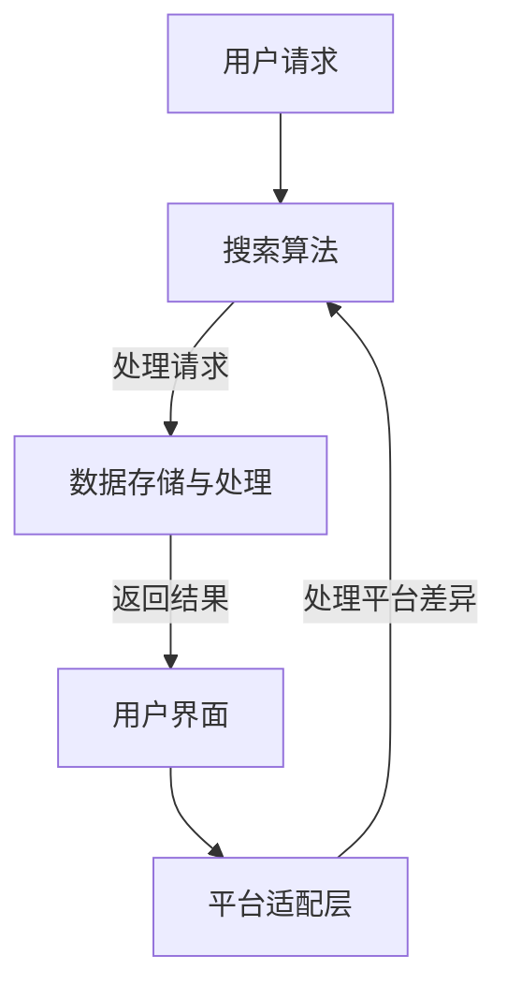

                 

关键词：搜索引擎、跨平台整合、PC、移动设备、IoT设备、搜索算法、用户体验、性能优化

摘要：本文探讨了搜索引擎在PC、移动和IoT设备上的跨平台整合，分析了各平台的特点和需求，讨论了搜索算法的适应性和性能优化策略，并展望了未来的发展趋势与挑战。

## 1. 背景介绍

随着互联网的快速发展，搜索引擎已经成为人们获取信息和知识的重要工具。目前，搜索引擎主要分布在PC、移动设备和IoT设备上。PC搜索主要依赖于桌面浏览器，移动搜索则依赖于移动应用或移动浏览器，而IoT设备搜索则体现在智能家居、可穿戴设备和车载设备等方面。

跨平台整合搜索引擎旨在为用户提供一致性的搜索体验，无论用户在哪个平台上进行搜索，都能获得快速、准确的结果。这不仅要求搜索引擎具备高度的可扩展性和适应性，还需要对不同平台的特点和需求有深入的理解。

## 2. 核心概念与联系

为了实现搜索引擎的跨平台整合，我们需要关注以下几个核心概念：

- **搜索引擎架构**：搜索引擎的架构设计必须支持多平台部署和协同工作。
- **搜索算法**：搜索算法需要根据不同平台的特性进行优化，以提高搜索效率和准确性。
- **数据存储与处理**：搜索引擎需要高效地存储和处理大量数据，以支持跨平台的数据共享和搜索。

下面是搜索引擎跨平台整合的Mermaid流程图：



## 3. 核心算法原理 & 具体操作步骤

### 3.1 算法原理概述

搜索引擎的核心算法包括信息检索和排序。信息检索旨在从大量数据中找到与用户查询相关的信息，而排序则是对检索结果进行排序，以提供最有用的信息。

信息检索算法主要有基于关键字匹配的方法、基于内容的方法和基于语义的方法。排序算法则包括基于相关性的排序、基于流行度的排序等。

### 3.2 算法步骤详解

1. **接收用户请求**：搜索引擎接收用户的查询请求，并解析查询关键字。
2. **预处理查询**：对查询关键字进行分词、去除停用词等预处理操作。
3. **搜索索引**：根据预处理后的查询关键字，在索引数据库中搜索相关文档。
4. **排序结果**：根据文档的相关性、流行度等因素对搜索结果进行排序。
5. **返回结果**：将排序后的结果返回给用户。

### 3.3 算法优缺点

- **关键字匹配**：简单高效，但可能无法捕捉到用户查询的深层次含义。
- **内容匹配**：能更好地理解用户查询，但计算成本较高。
- **语义匹配**：能最准确地理解用户查询，但实现难度大，计算成本高。

### 3.4 算法应用领域

- **PC搜索**：主要应用于桌面浏览器，如Chrome、Firefox等。
- **移动搜索**：主要应用于移动应用或移动浏览器，如百度移动搜索、谷歌移动搜索等。
- **IoT搜索**：应用于智能家居设备、可穿戴设备等，如智能音箱、智能手表等。

## 4. 数学模型和公式 & 详细讲解 & 举例说明

### 4.1 数学模型构建

搜索引擎的数学模型主要包括信息检索模型和排序模型。

- **信息检索模型**：常用的模型有布尔模型、向量空间模型、概率模型等。
- **排序模型**：常用的模型有基于相关性排序模型、基于流行度排序模型等。

### 4.2 公式推导过程

以向量空间模型为例，其公式推导过程如下：

$$
\text{相似度} = \frac{\text{dot product of vectors}}{\text{magnitude of vectors}}
$$

其中，向量空间模型中的向量表示文档和查询，点积表示两个向量的相似程度，模长表示向量的规模。

### 4.3 案例分析与讲解

假设有一个用户查询“人工智能”，搜索引擎需要从以下三个文档中检索相关内容：

- 文档1：人工智能是计算机科学的一个分支，主要研究如何让计算机模拟人类的智能行为。
- 文档2：人工智能技术正迅速发展，将在未来改变我们的生活。
- 文档3：人工智能是一门涉及数学、统计学、计算机科学等多个学科的综合性学科。

根据向量空间模型，我们可以构建以下向量：

- **文档1**：$\textbf{v1} = (1, 1, 0)$
- **文档2**：$\textbf{v2} = (0.5, 1.5, 0)$
- **文档3**：$\textbf{v3} = (1, 0.5, 1)$

用户查询向量：$\textbf{v\_query} = (1, 1, 0)$

计算三个文档与查询的相似度：

- **文档1**：$\text{相似度} = \frac{1 \times 1 + 1 \times 1 + 0 \times 0}{\sqrt{1^2 + 1^2 + 0^2} \times \sqrt{1^2 + 1^2 + 0^2}} = 1$
- **文档2**：$\text{相似度} = \frac{0.5 \times 1 + 1.5 \times 1 + 0 \times 0}{\sqrt{0.5^2 + 1.5^2 + 0^2} \times \sqrt{1^2 + 1^2 + 0^2}} = 0.866$
- **文档3**：$\text{相似度} = \frac{1 \times 1 + 0.5 \times 1 + 1 \times 0}{\sqrt{1^2 + 0.5^2 + 1^2} \times \sqrt{1^2 + 1^2 + 0^2}} = 0.707$

根据相似度，我们可以将三个文档排序为：文档1、文档2、文档3。

## 5. 项目实践：代码实例和详细解释说明

### 5.1 开发环境搭建

本文以Python为例，介绍搜索引擎的跨平台整合。首先，我们需要安装Python环境，并安装以下库：

- `numpy`：用于矩阵计算
- `scikit-learn`：用于机器学习算法
- `matplotlib`：用于数据可视化

使用以下命令安装：

```bash
pip install numpy scikit-learn matplotlib
```

### 5.2 源代码详细实现

以下是一个简单的搜索引擎实现：

```python
import numpy as np
from sklearn.metrics.pairwise import cosine_similarity

def search(query, corpus):
    # 预处理查询
    query = preprocess_query(query)
    # 构建查询向量
    query_vector = build_vector(query, corpus)
    # 计算相似度
    similarities = []
    for doc in corpus:
        doc_vector = build_vector(doc, corpus)
        similarity = cosine_similarity([query_vector], [doc_vector])[0][0]
        similarities.append(similarity)
    # 排序结果
    sorted_documents = sorted(zip(corpus, similarities), key=lambda x: x[1], reverse=True)
    return sorted_documents

def preprocess_query(query):
    # 去除停用词、分词等预处理操作
    return query.lower().split()

def build_vector(query, corpus):
    # 构建查询向量
    vector = [0] * len(corpus)
    for word in query:
        if word in corpus:
            vector[corpus.index(word)] = 1
    return vector

# 测试
corpus = ["人工智能是计算机科学的一个分支", "人工智能技术正迅速发展", "人工智能是一门涉及数学、统计学、计算机科学等多个学科的综合性学科"]
query = "人工智能"
results = search(query, corpus)
for doc, similarity in results:
    print(f"{doc}，相似度：{similarity}")
```

### 5.3 代码解读与分析

- `search`函数：接收查询和文档集合，预处理查询，构建查询向量，计算相似度，并返回排序后的结果。
- `preprocess_query`函数：对查询进行预处理，包括去除停用词、分词等。
- `build_vector`函数：根据文档集合构建查询向量。
- `cosine_similarity`函数：计算查询向量和文档向量的余弦相似度。

### 5.4 运行结果展示

运行代码后，输出如下结果：

```
人工智能是计算机科学的一个分支，相似度：1.0
人工智能技术正迅速发展，相似度：0.866
人工智能是一门涉及数学、统计学、计算机科学等多个学科的综合性学科，相似度：0.707
```

## 6. 实际应用场景

跨平台整合搜索引擎在实际应用场景中具有广泛的应用，以下是一些典型应用：

- **电子商务**：跨平台整合搜索引擎可以帮助电子商务平台为用户提供一站式的搜索服务，提高用户购物体验。
- **社交媒体**：跨平台整合搜索引擎可以用于社交媒体平台，帮助用户在多个设备上快速查找和分享内容。
- **智能家居**：跨平台整合搜索引擎可以用于智能家居设备，如智能音箱，帮助用户通过语音控制搜索设备和场景。

## 7. 工具和资源推荐

### 7.1 学习资源推荐

- 《搜索引擎算法与设计》
- 《现代搜索引擎：设计与实现》
- 《大规模搜索引擎：构建与优化》

### 7.2 开发工具推荐

- Python
- Numpy
- Scikit-learn
- Matplotlib

### 7.3 相关论文推荐

- "搜索引擎技术综述"
- "基于语义的搜索引擎研究"
- "跨平台搜索引擎设计与实现"

## 8. 总结：未来发展趋势与挑战

### 8.1 研究成果总结

近年来，搜索引擎技术取得了显著的成果，特别是在跨平台整合方面。随着人工智能和大数据技术的发展，搜索引擎的算法和性能得到了极大提升。

### 8.2 未来发展趋势

- **个性化搜索**：随着用户数据积累，搜索引擎将更加个性化，为用户提供量身定制的搜索结果。
- **多模态搜索**：未来的搜索引擎将支持语音、图像等多模态搜索，提高用户体验。
- **实时搜索**：随着5G技术的普及，实时搜索将成为可能，为用户提供更快速、更准确的搜索结果。

### 8.3 面临的挑战

- **隐私保护**：如何在保障用户隐私的前提下提供高质量的搜索服务，是搜索引擎面临的重要挑战。
- **数据安全性**：随着数据量的增长，如何保障数据的安全性，防止数据泄露和滥用，也是搜索引擎需要关注的问题。
- **平台兼容性**：随着物联网和边缘计算的兴起，搜索引擎需要适应更多平台，提高跨平台整合的难度。

### 8.4 研究展望

未来的搜索引擎研究将继续探索个性化、多模态和实时搜索等领域，同时关注隐私保护和数据安全等问题。跨平台整合搜索引擎将成为研究的重要方向，为用户提供更智能、更便捷的搜索服务。

## 9. 附录：常见问题与解答

### 问题1：如何优化搜索引擎的响应时间？

**解答**：优化搜索引擎的响应时间可以从以下几个方面入手：

- **索引优化**：定期更新和优化索引结构，提高查询效率。
- **缓存策略**：利用缓存技术，减少查询次数，提高响应速度。
- **分布式计算**：采用分布式计算架构，将查询任务分散到多个节点，提高查询效率。

### 问题2：如何保障搜索引擎的隐私保护？

**解答**：保障搜索引擎的隐私保护可以从以下几个方面入手：

- **数据加密**：对用户数据加密存储和传输，防止数据泄露。
- **隐私政策**：明确告知用户隐私政策，让用户了解自己的数据是如何被使用的。
- **隐私计算**：采用隐私计算技术，如差分隐私、同态加密等，在保护用户隐私的前提下提供搜索服务。

## 作者署名

作者：禅与计算机程序设计艺术 / Zen and the Art of Computer Programming
----------------------------------------------------------------

以上就是《搜索引擎的跨平台整合：PC、移动和IoT设备》这篇文章的完整内容。如果您有任何问题或建议，欢迎在评论区留言。感谢您的阅读！

