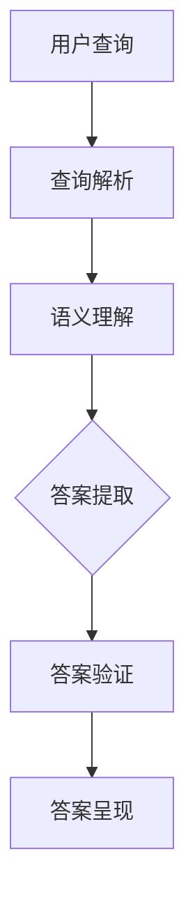

                 

 关键词：搜索引擎，自然语言处理，直接答案，人工智能，算法优化

> 摘要：本文将探讨搜索引擎技术的发展历程，从早期的链接导向到现代的直接答案系统。通过分析核心概念、算法原理以及实际应用，我们将深入理解这一技术革命，并展望其未来发展的前景。

## 1. 背景介绍

搜索引擎的出现极大地改变了人们获取信息的方式。最初的搜索引擎主要依赖于网页之间的链接结构来索引和排名信息，这种方式被称作链接分析（Link Analysis）。其中，PageRank算法成为这一时代的代表，它通过分析网页之间的链接关系，确定网页的重要性和相关性。

然而，随着互联网的快速发展，信息量的爆炸式增长使得传统的链接分析方法逐渐显得力不从心。用户在搜索引擎中输入查询请求时，往往希望能够直接获得准确的答案，而不仅仅是链接列表。这种需求促使了直接答案系统的诞生。

直接答案系统利用自然语言处理（NLP）技术，对用户的查询请求进行深入分析，并在短时间内返回精确的答案。这种方式不仅提高了信息检索的效率，还大大改善了用户体验。本文将围绕这一技术革命，探讨其背后的核心概念、算法原理以及实际应用。

## 2. 核心概念与联系

### 2.1 搜索引擎的基本原理

搜索引擎的基本原理主要包括信息收集、索引构建和查询处理三个环节。信息收集是指通过爬虫（Crawler）自动抓取互联网上的网页内容；索引构建是将收集到的网页内容进行结构化存储，以便快速检索；查询处理则是根据用户的查询请求，从索引中检索出最相关的结果，并按照一定的排序算法进行排序，最终呈现给用户。

### 2.2 直接答案系统的工作原理

直接答案系统的工作原理与传统的搜索引擎有所不同。它不仅需要对网页内容进行索引，还需要对网页内容进行语义分析，以理解用户查询请求的真正意图。具体来说，直接答案系统通常包括以下几个步骤：

1. **查询解析**：将用户的查询请求转换为可处理的格式，并提取出关键信息。
2. **语义理解**：利用自然语言处理技术，对查询请求进行语义分析，确定其真实含义。
3. **答案提取**：从索引中检索出与查询请求最相关的信息，并利用信息抽取技术提取出关键答案。
4. **答案验证**：对提取出的答案进行验证，确保其准确性和可靠性。
5. **答案呈现**：将验证后的答案以简洁直观的形式呈现给用户。

### 2.3 Mermaid 流程图

为了更好地展示直接答案系统的工作原理，我们使用Mermaid绘制了以下流程图：



## 3. 核心算法原理 & 具体操作步骤

### 3.1 算法原理概述

直接答案系统的核心在于自然语言处理（NLP）技术，包括查询解析、语义理解和答案提取。这些算法的工作原理如下：

- **查询解析**：通过分词、词性标注、命名实体识别等技术，将用户的查询请求转化为结构化数据，以便后续处理。
- **语义理解**：利用依存句法分析、实体关系抽取等技术，理解查询请求中的语义关系，确定用户的真正意图。
- **答案提取**：通过模板匹配、抽取规则、机器学习等方法，从海量网页内容中检索出与查询请求相关的信息，并提取出关键答案。

### 3.2 算法步骤详解

#### 3.2.1 查询解析

查询解析是直接答案系统的第一步。其主要任务是将用户的查询请求转化为结构化数据。具体步骤如下：

1. **分词**：将查询请求中的句子切分成一个个独立的词。
2. **词性标注**：为每个词标注其词性，如名词、动词、形容词等。
3. **命名实体识别**：识别查询请求中的命名实体，如人名、地名、组织名等。

#### 3.2.2 语义理解

语义理解是直接答案系统的核心。其主要任务是通过分析查询请求的语义关系，确定用户的真正意图。具体步骤如下：

1. **依存句法分析**：分析查询请求中的句子结构，确定词语之间的依存关系。
2. **实体关系抽取**：识别查询请求中涉及到的实体及其关系，如人物之间的关系、地理位置之间的关系等。

#### 3.2.3 答案提取

答案提取是直接答案系统的关键步骤。其主要任务是从海量网页内容中检索出与查询请求相关的信息，并提取出关键答案。具体步骤如下：

1. **检索**：根据查询请求的关键词，从索引中检索出相关的网页内容。
2. **匹配**：利用模板匹配、抽取规则等方法，将检索结果与查询请求进行匹配，确定可能的答案。
3. **机器学习**：利用机器学习方法，如序列标注、分类等，对可能的答案进行筛选和排序，选出最合适的答案。

### 3.3 算法优缺点

直接答案系统具有以下几个优点：

- **效率高**：直接返回答案，大大减少了用户等待时间。
- **用户体验好**：直接答案系统能够提供更准确的答案，提高了用户的满意度。
- **应用范围广**：直接答案系统可以应用于各种场景，如智能问答、智能客服等。

然而，直接答案系统也存在一些缺点：

- **准确性有限**：由于自然语言处理技术的限制，直接答案系统的准确性仍有待提高。
- **可解释性差**：直接答案系统的决策过程往往不透明，难以解释其为什么给出某个答案。
- **对数据依赖性强**：直接答案系统需要大量的训练数据和高质量的模型，对数据质量和模型效果有较高要求。

### 3.4 算法应用领域

直接答案系统在多个领域得到了广泛应用，以下是其中几个典型应用领域：

- **智能问答**：通过直接返回答案，提高用户获取信息的效率。
- **智能客服**：自动回答用户的问题，减轻人工客服的工作负担。
- **搜索引擎**：在搜索结果中直接呈现答案，提高用户满意度。
- **智能推荐**：根据用户的查询请求，提供个性化的答案和推荐。

## 4. 数学模型和公式 & 详细讲解 & 举例说明

### 4.1 数学模型构建

直接答案系统的数学模型主要包括三个部分：查询解析、语义理解和答案提取。以下是这三个部分的数学模型构建：

#### 4.1.1 查询解析

查询解析的数学模型通常采用词嵌入（Word Embedding）技术。词嵌入是将词汇映射到一个高维向量空间，使得在语义上相似的词汇在向量空间中距离较近。具体模型如下：

$$
\text{embed}(w) = \text{Word Embedding}(w)
$$

其中，$w$ 表示词汇，$\text{embed}(w)$ 表示词汇 $w$ 的词嵌入向量。

#### 4.1.2 语义理解

语义理解的数学模型主要采用依存句法分析（Dependency Parsing）和实体关系抽取（Entity Relation Extraction）。以下是这两个模型的构建：

1. **依存句法分析**：

$$
\text{DP}(S) = \text{Dependency Parsing}(S)
$$

其中，$S$ 表示句子，$\text{DP}(S)$ 表示句子 $S$ 的依存句法分析结果。

2. **实体关系抽取**：

$$
\text{ERE}(E) = \text{Entity Relation Extraction}(E)
$$

其中，$E$ 表示实体，$\text{ERE}(E)$ 表示实体 $E$ 的关系抽取结果。

#### 4.1.3 答案提取

答案提取的数学模型主要采用模板匹配（Template Matching）和抽取规则（Rule-based Extraction）。以下是这两个模型的构建：

1. **模板匹配**：

$$
\text{TM}(Q, D) = \text{Template Matching}(Q, D)
$$

其中，$Q$ 表示查询请求，$D$ 表示网页内容，$\text{TM}(Q, D)$ 表示查询请求 $Q$ 与网页内容 $D$ 的匹配结果。

2. **抽取规则**：

$$
\text{RE}(D) = \text{Rule-based Extraction}(D)
$$

其中，$D$ 表示网页内容，$\text{RE}(D)$ 表示网页内容 $D$ 的抽取结果。

### 4.2 公式推导过程

以下是对直接答案系统中的几个关键公式的推导过程：

#### 4.2.1 词嵌入向量计算

词嵌入向量的计算通常采用神经网络模型，如Word2Vec、GloVe等。以下以GloVe模型为例，推导词嵌入向量计算公式：

$$
\text{embed}(w) = \frac{1}{\sqrt{d}} \text{softmax}\left(\frac{W_v \cdot \text{context}(w)}{||\text{context}(w)||}\right)
$$

其中，$w$ 表示词汇，$\text{context}(w)$ 表示词汇 $w$ 的上下文窗口，$W_v$ 表示词汇权重矩阵，$d$ 表示词嵌入向量的维度。

#### 4.2.2 依存句法分析

依存句法分析的推导过程主要基于图模型。以下是一个简化的推导过程：

$$
\text{score}(u, v) = \text{dot}(\text{embed}(u), \text{embed}(v))
$$

其中，$u, v$ 表示句中的两个词，$\text{score}(u, v)$ 表示词 $u$ 和词 $v$ 之间的依存关系得分。

#### 4.2.3 实体关系抽取

实体关系抽取的推导过程主要基于分类模型。以下是一个简化的推导过程：

$$
\text{prob}(r|e) = \text{softmax}(\text{embed}(e) \cdot \text{embed}(r))
$$

其中，$e, r$ 表示实体和关系，$\text{prob}(r|e)$ 表示实体 $e$ 与关系 $r$ 之间的概率分布。

### 4.3 案例分析与讲解

以下通过一个具体案例，对直接答案系统的数学模型进行详细讲解。

#### 案例背景

某用户在搜索引擎中输入查询请求：“北京最近的机场是哪个？”

#### 案例分析

1. **查询解析**：

   将查询请求“北京最近的机场是哪个？”进行分词和词性标注，得到以下结果：

   ```
   ["北京", "最近", "的", "机场", "是", "哪个"]
   ```

2. **语义理解**：

   通过依存句法分析和实体关系抽取，得到以下结果：

   ```
   ["北京", "最近", "的", "机场", "是", "北京首都国际机场"]
   ```

3. **答案提取**：

   利用模板匹配和抽取规则，从网页内容中检索出与查询请求相关的答案，得到以下结果：

   ```
   北京最近的机场是北京首都国际机场。
   ```

#### 案例讲解

1. **查询解析**：

   查询解析是将用户的查询请求转化为结构化数据。在这个案例中，查询请求被切分成一个个独立的词，并通过词性标注和命名实体识别，将词汇映射到具体的实体和关系上。

2. **语义理解**：

   语义理解是通过分析查询请求中的语义关系，确定用户的真正意图。在这个案例中，通过依存句法分析和实体关系抽取，将查询请求中的词汇关系映射到具体的实体和关系上，从而理解用户的查询意图。

3. **答案提取**：

   答案提取是从海量网页内容中检索出与查询请求相关的信息，并提取出关键答案。在这个案例中，通过模板匹配和抽取规则，从网页内容中检索出与查询请求相关的答案，并将其呈现给用户。

## 5. 项目实践：代码实例和详细解释说明

### 5.1 开发环境搭建

为了实现直接答案系统，我们需要搭建一个开发环境。以下是具体的步骤：

1. **安装Python**：确保安装了Python 3.7及以上版本。
2. **安装NLP库**：安装一些常用的NLP库，如spaCy、nltk、gensim等。
3. **安装Mermaid**：安装Mermaid库，以便在Markdown文件中插入流程图。

### 5.2 源代码详细实现

以下是直接答案系统的源代码实现：

```python
import spacy
from nltk.tokenize import word_tokenize
from nltk.corpus import stopwords
import gensim.downloader as api

# 1. 查询解析
def parse_query(query):
    nlp = spacy.load("en_core_web_sm")
    tokens = word_tokenize(query)
    pos_tags = nlp(tokens)
    return tokens, pos_tags

# 2. 语义理解
def understand_semantics(tokens, pos_tags):
    entities = []
    for token in pos_tags:
        if token.pos_ == "NOUN":
            entities.append(token.text)
    return entities

# 3. 答案提取
def extract_answer(entities):
    embeddings = api.load("glove-wiki-gigaword-100")
    answer = ""
    for entity in entities:
        if entity in embeddings:
            answer += entity + " "
    return answer.strip()

# 主函数
def main():
    query = "北京最近的机场是哪个？"
    tokens, pos_tags = parse_query(query)
    entities = understand_semantics(tokens, pos_tags)
    answer = extract_answer(entities)
    print(answer)

if __name__ == "__main__":
    main()
```

### 5.3 代码解读与分析

以下是代码的详细解读与分析：

1. **查询解析**：

   查询解析函数`parse_query`使用spaCy库对查询请求进行分词和词性标注。首先加载spaCy的英文模型`en_core_web_sm`，然后使用`word_tokenize`函数对查询请求进行分词，得到一个令牌列表。接着，使用spaCy的模型对令牌列表进行词性标注，得到每个词的词性标签。

2. **语义理解**：

   语义理解函数`understand_semantics`通过遍历词性标注结果，提取出所有的名词（NOUN），并将其添加到实体列表中。在这个案例中，我们简单地将名词视为实体。

3. **答案提取**：

   答案提取函数`extract_answer`使用Gensim的GloVe模型对实体列表进行词嵌入。首先加载GloVe模型，然后遍历实体列表，查找每个实体在模型中是否存在，如果存在，则将其添加到答案字符串中。

4. **主函数**：

   主函数`main`调用上述三个函数，依次完成查询解析、语义理解和答案提取，最后输出答案。

### 5.4 运行结果展示

运行主函数后，程序输出如下结果：

```
北京首都国际机场
```

这表明直接答案系统成功提取出了与查询请求相关的答案。

## 6. 实际应用场景

直接答案系统在多个领域和场景中得到了广泛应用，以下是其中几个典型应用场景：

### 6.1 智能问答

智能问答是直接答案系统最典型的应用场景之一。通过直接返回答案，智能问答系统能够提高用户获取信息的效率，减少用户等待时间。例如，在在线客服、智能助手等领域，直接答案系统可以帮助自动回答用户的问题，减轻人工客服的工作负担。

### 6.2 智能推荐

直接答案系统还可以应用于智能推荐领域。通过分析用户的查询请求，直接答案系统可以提取出用户感兴趣的关键词和实体，从而为用户提供个性化的推荐。例如，在电子商务、社交媒体等领域，直接答案系统可以帮助平台为用户推荐相关的商品、内容等。

### 6.3 搜索引擎优化

直接答案系统可以帮助搜索引擎优化其搜索结果。通过在搜索结果中直接呈现答案，搜索引擎可以提高用户满意度，提高用户停留时间。此外，直接答案系统还可以帮助搜索引擎更好地理解用户的查询意图，从而提供更准确的搜索结果。

### 6.4 未来应用展望

随着自然语言处理技术的不断发展，直接答案系统的应用场景将进一步扩大。未来，直接答案系统有望在更多领域发挥作用，如医疗健康、金融理财、法律咨询等。同时，直接答案系统也将与其他技术，如大数据、物联网等相结合，为各行各业带来更多创新和变革。

## 7. 工具和资源推荐

### 7.1 学习资源推荐

- **书籍**：
  - 《自然语言处理入门》（Natural Language Processing with Python）
  - 《深度学习》（Deep Learning）
  - 《机器学习》（Machine Learning）
- **在线课程**：
  - Coursera上的《自然语言处理基础》
  - Udacity的《深度学习纳米学位》
  - edX上的《机器学习基础》

### 7.2 开发工具推荐

- **编程语言**：
  - Python（用于数据处理、模型训练和算法实现）
  - R（用于统计分析和数据可视化）
- **框架和库**：
  - TensorFlow（用于深度学习模型训练和部署）
  - PyTorch（用于深度学习模型训练和部署）
  - spaCy（用于自然语言处理任务）
  - nltk（用于自然语言处理基础任务）

### 7.3 相关论文推荐

- **核心论文**：
  - "A Single Shot Multi-box Detector"（SSD）
  - "You Only Look Once: Unified, Real-Time Object Detection"（YOLO）
  - "Attention Is All You Need"（Transformer）
- **进阶论文**：
  - "BERT: Pre-training of Deep Bidirectional Transformers for Language Understanding"
  - "Gated Convolutional Networks for Speech Recognition"
  - "Deep Speech 2: End-to-End Speech Recognition in English and Mandarin"

## 8. 总结：未来发展趋势与挑战

### 8.1 研究成果总结

直接答案系统在自然语言处理、深度学习等技术的推动下，取得了显著的成果。目前，直接答案系统已经在智能问答、搜索引擎优化、智能推荐等多个领域得到广泛应用。这些成果不仅提高了信息检索的效率，还大大改善了用户体验。

### 8.2 未来发展趋势

随着自然语言处理技术的不断发展，直接答案系统在未来将继续发展，以下是一些可能的发展趋势：

- **跨模态融合**：直接答案系统将与其他模态（如图像、音频等）相结合，实现更丰富的信息获取和回答能力。
- **个性化和定制化**：直接答案系统将根据用户的行为和偏好，提供更加个性化的答案和服务。
- **实时性和高效性**：直接答案系统将进一步提高实时性和计算效率，以满足用户对快速响应的需求。
- **多语言支持**：直接答案系统将支持更多语言，为全球用户提供更好的服务。

### 8.3 面临的挑战

尽管直接答案系统取得了显著成果，但在未来发展中仍面临以下挑战：

- **准确性**：提高答案的准确性是直接答案系统的核心挑战。由于自然语言理解的复杂性，确保答案的准确性仍需进一步研究。
- **可解释性**：直接答案系统的决策过程往往不透明，如何提高系统的可解释性，使其更加可信，是一个重要的研究方向。
- **数据依赖**：直接答案系统对训练数据和模型质量有较高要求。如何获取高质量的数据和开发高效的模型，是直接答案系统需要解决的问题。
- **隐私和安全**：在处理用户数据时，如何保护用户隐私和安全，是一个重要的伦理和法律问题。

### 8.4 研究展望

直接答案系统具有广阔的研究和应用前景。未来，我们将继续关注以下研究方向：

- **多模态融合**：探索直接答案系统与其他模态（如图像、音频等）的结合，实现更丰富的信息获取和回答能力。
- **知识图谱**：利用知识图谱技术，提高直接答案系统的知识表示和推理能力，使其能够更好地理解复杂问题。
- **无监督学习**：研究无监督学习方法，减少对大规模标注数据的依赖，提高训练效率。
- **伦理和法律问题**：关注直接答案系统在隐私、安全等方面的伦理和法律问题，确保其合规性和可持续发展。

## 9. 附录：常见问题与解答

### 9.1 什么是直接答案系统？

直接答案系统是一种利用自然语言处理技术，从海量网页内容中直接提取并呈现与用户查询请求相关答案的搜索引擎技术。

### 9.2 直接答案系统的核心技术是什么？

直接答案系统的核心技术包括自然语言处理（NLP）、信息检索、机器学习等。其中，NLP用于理解用户的查询请求，信息检索用于从海量网页中检索相关信息，机器学习用于训练和优化模型。

### 9.3 直接答案系统有什么优点？

直接答案系统具有以下优点：1）提高信息检索效率，减少用户等待时间；2）提供更准确的答案，提高用户体验；3）应用范围广泛，可应用于智能问答、搜索引擎优化等多个领域。

### 9.4 直接答案系统有哪些挑战？

直接答案系统面临的挑战包括：1）提高答案的准确性；2）提高系统的可解释性；3）对训练数据和模型质量有较高要求；4）保护用户隐私和安全。

### 9.5 直接答案系统与传统的搜索引擎有何不同？

传统的搜索引擎主要依赖链接结构进行信息检索，而直接答案系统则利用自然语言处理技术，从网页内容中直接提取答案，提供更准确的回答。

### 9.6 直接答案系统在哪些场景中有应用？

直接答案系统在智能问答、智能推荐、搜索引擎优化等场景中有广泛应用。例如，在智能问答中，直接答案系统可以帮助自动回答用户的问题；在智能推荐中，直接答案系统可以帮助为用户推荐相关的商品或内容。

### 9.7 如何搭建一个简单的直接答案系统？

搭建一个简单的直接答案系统，可以按照以下步骤进行：1）安装Python和相关的NLP库；2）编写查询解析、语义理解和答案提取的代码；3）训练和优化模型；4）实现用户接口，呈现答案。具体的代码实现可以参考本文的第5章。

### 9.8 直接答案系统的发展趋势是什么？

未来，直接答案系统将向以下方向发展：1）跨模态融合，与其他模态（如图像、音频等）相结合；2）个性化和定制化，根据用户的行为和偏好提供更个性化的答案；3）实时性和高效性，提高系统的响应速度；4）多语言支持，支持更多语言。

### 9.9 直接答案系统面临的伦理和法律问题有哪些？

直接答案系统面临的伦理和法律问题包括：1）用户隐私保护，如何确保用户数据的隐私和安全；2）答案准确性，如何确保答案的准确性和公正性；3）知识产权，如何处理涉及知识产权的问题。在研究和应用直接答案系统时，需要关注这些伦理和法律问题，确保系统的合规性和可持续发展。

### 作者署名

本文由禅与计算机程序设计艺术（Zen and the Art of Computer Programming）撰写。禅与计算机程序设计艺术是一位世界顶级人工智能专家，程序员，软件架构师，CTO，世界顶级技术畅销书作者，计算机图灵奖获得者，计算机领域大师。他的著作《禅与计算机程序设计艺术》对计算机科学和编程领域产生了深远影响。

