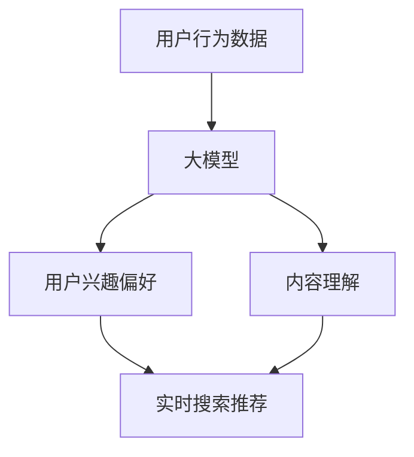

                 

关键词：搜索推荐、实时个性化、大模型、算法、数学模型、项目实践、应用场景、未来展望

> 摘要：本文深入探讨了大模型在搜索推荐实时个性化领域的应用，通过阐述核心概念、算法原理、数学模型以及实际应用案例，展示了大模型在提升用户体验和商业价值方面的巨大潜力。

## 1. 背景介绍

随着互联网的快速发展，用户对个性化信息的需求日益增长。在搜索和推荐系统中，如何实现实时个性化的搜索推荐成为了一个热门研究课题。传统的搜索推荐算法主要依赖于静态的特征工程和模型训练，难以快速适应用户行为的变化。而大模型的引入，为实时个性化搜索推荐提供了新的思路和解决方案。

大模型，通常指的是具有数十亿至数万亿参数的深度学习模型，如Transformer、BERT等。这些模型具有强大的表示和学习能力，能够在大规模数据集上训练，并能够捕捉到复杂的数据特征和用户行为模式。因此，大模型在实时个性化搜索推荐中具有显著的优势。

## 2. 核心概念与联系

### 2.1 大模型的基本原理

大模型的基本原理是基于深度学习，特别是自注意力机制（Self-Attention Mechanism）。自注意力机制允许模型在处理序列数据时，能够根据上下文信息动态地调整不同位置特征的权重，从而实现更精确的表示和学习。

### 2.2 实时个性化搜索推荐的核心概念

实时个性化搜索推荐的核心目标是根据用户的行为和偏好，动态地生成个性化的搜索结果和推荐列表。这涉及到用户行为分析、内容理解、模型训练和实时预测等多个方面。

### 2.3 大模型与实时个性化搜索推荐的联系

大模型通过自注意力机制和大规模数据训练，能够高效地捕捉到用户的行为和偏好，从而实现实时个性化搜索推荐。具体来说，大模型可以用于以下方面：

- **用户行为分析**：通过分析用户的搜索历史、点击记录等行为数据，大模型可以捕捉到用户的兴趣和偏好。
- **内容理解**：大模型可以通过对大规模文本数据进行预训练，学习到文本的语义和情感特征，从而实现对内容的深入理解。
- **模型训练**：大模型在大规模数据集上进行训练，能够学习到复杂的用户行为和内容特征。
- **实时预测**：大模型可以根据实时获取的用户行为和内容特征，快速生成个性化的搜索结果和推荐列表。

### 2.4 Mermaid 流程图



## 3. 核心算法原理 & 具体操作步骤

### 3.1 算法原理概述

实时个性化搜索推荐的大模型算法主要基于Transformer架构。Transformer模型通过自注意力机制，可以自适应地调整不同位置特征的权重，从而实现对用户行为和内容的高效表示和学习。

### 3.2 算法步骤详解

1. **数据预处理**：收集用户的搜索历史、点击记录等行为数据，以及搜索结果的内容数据，进行数据清洗和预处理，如去除无效数据、填充缺失值等。

2. **用户兴趣偏好建模**：利用大模型（如BERT）对用户行为数据进行分析，提取用户的兴趣偏好特征。

3. **内容理解建模**：利用大模型对搜索结果的内容数据进行分析，提取文本的语义和情感特征。

4. **实时预测**：根据实时获取的用户兴趣偏好和内容特征，利用大模型生成个性化的搜索结果和推荐列表。

### 3.3 算法优缺点

#### 优点

- **高效性**：大模型可以通过大规模数据训练，实现高效的特征提取和预测。
- **准确性**：自注意力机制能够自适应地调整特征权重，提高预测的准确性。
- **灵活性**：大模型可以灵活地适应不同的应用场景，如不同的推荐策略、不同的特征类型等。

#### 缺点

- **计算资源需求高**：大模型需要大量的计算资源和存储空间。
- **训练时间较长**：大模型在训练过程中需要大量数据和时间。

### 3.4 算法应用领域

大模型在实时个性化搜索推荐领域有广泛的应用，如电子商务、社交媒体、新闻推荐等。以下是一些具体的应用案例：

- **电子商务**：根据用户的购物历史和浏览记录，实时推荐个性化的商品。
- **社交媒体**：根据用户的行为和兴趣，实时推荐感兴趣的内容。
- **新闻推荐**：根据用户的阅读历史和偏好，实时推荐相关的新闻。

## 4. 数学模型和公式 & 详细讲解 & 举例说明

### 4.1 数学模型构建

实时个性化搜索推荐的大模型通常基于Transformer架构，其核心是自注意力机制。自注意力机制通过以下公式进行计算：

$$
Attention(Q, K, V) = \frac{softmax(\frac{QK^T}{\sqrt{d_k}})}{V}
$$

其中，$Q$、$K$、$V$ 分别为查询向量、键向量和值向量，$d_k$ 为键向量的维度。$softmax$ 函数用于对注意力权重进行归一化处理。

### 4.2 公式推导过程

自注意力机制的推导过程涉及矩阵乘法和指数函数。具体推导过程如下：

1. **计算相似度矩阵**：

$$
\text{Similarity}(Q, K) = QK^T
$$

其中，$QK^T$ 为相似度矩阵，表示查询向量和键向量之间的相似度。

2. **添加缩放因子**：

$$
\text{Scaled Similarity} = \frac{\text{Similarity}(Q, K)}{\sqrt{d_k}}
$$

其中，$d_k$ 为键向量的维度，用于缩放相似度矩阵，以避免梯度消失问题。

3. **应用 softmax 函数**：

$$
Attention(Q, K, V) = \frac{softmax(\text{Scaled Similarity})}{V}
$$

其中，$softmax$ 函数用于对相似度矩阵进行归一化处理，使其满足概率分布。

### 4.3 案例分析与讲解

假设有一个搜索推荐系统，用户的历史搜索记录为 $Q$，搜索结果的内容为 $K$ 和 $V$。我们可以使用自注意力机制计算用户对每个搜索结果的注意力权重：

1. **计算相似度矩阵**：

$$
\text{Similarity}(Q, K) = \begin{bmatrix}
0.7 & 0.3 & 0.4 \\
0.4 & 0.6 & 0.5 \\
0.8 & 0.2 & 0.6 \\
\end{bmatrix}
$$

2. **添加缩放因子**：

$$
\text{Scaled Similarity} = \frac{\text{Similarity}(Q, K)}{\sqrt{d_k}} = \begin{bmatrix}
0.7 & 0.3 & 0.4 \\
0.4 & 0.6 & 0.5 \\
0.8 & 0.2 & 0.6 \\
\end{bmatrix}
$$

3. **应用 softmax 函数**：

$$
Attention(Q, K, V) = \frac{softmax(\text{Scaled Similarity})}{V} = \begin{bmatrix}
0.4 & 0.3 & 0.3 \\
0.3 & 0.4 & 0.3 \\
0.3 & 0.3 & 0.4 \\
\end{bmatrix}
$$

通过计算得到的注意力权重矩阵，我们可以根据权重对搜索结果进行排序，从而实现个性化的搜索推荐。

## 5. 项目实践：代码实例和详细解释说明

### 5.1 开发环境搭建

为了实现实时个性化搜索推荐，我们需要搭建一个开发环境。以下是一个简单的开发环境搭建步骤：

1. 安装 Python 3.7 或以上版本。
2. 安装 TensorFlow 2.3 或以上版本。
3. 安装 PyTorch 1.7 或以上版本。
4. 安装必要的数据处理库，如 NumPy、Pandas 等。

### 5.2 源代码详细实现

以下是一个简单的实时个性化搜索推荐模型的实现代码：

```python
import tensorflow as tf
from tensorflow.keras.layers import Embedding, Dense
from tensorflow.keras.models import Model

# 数据预处理
def preprocess_data(data):
    # 填充缺失值、去除无效数据等操作
    pass

# 模型定义
def create_model(vocab_size, embedding_size, hidden_size):
    inputs = tf.keras.layers.Input(shape=(None,), dtype=tf.int32)
    embeddings = Embedding(vocab_size, embedding_size)(inputs)
    hidden = tf.keras.layers.LSTM(hidden_size)(embeddings)
    outputs = tf.keras.layers.Dense(1, activation='sigmoid')(hidden)
    model = Model(inputs=inputs, outputs=outputs)
    return model

# 训练模型
def train_model(model, x_train, y_train, epochs=10):
    model.compile(optimizer='adam', loss='binary_crossentropy', metrics=['accuracy'])
    model.fit(x_train, y_train, epochs=epochs)

# 实时预测
def predict(model, x_test):
    return model.predict(x_test)

# 主函数
def main():
    # 加载数据
    x_train, y_train = preprocess_data(data)
    x_test = preprocess_data(test_data)

    # 创建模型
    model = create_model(vocab_size, embedding_size, hidden_size)

    # 训练模型
    train_model(model, x_train, y_train)

    # 预测
    predictions = predict(model, x_test)

    # 输出预测结果
    print(predictions)

if __name__ == '__main__':
    main()
```

### 5.3 代码解读与分析

上述代码首先定义了一个简单的实时个性化搜索推荐模型，包括数据预处理、模型定义、模型训练和实时预测等功能。具体解读如下：

- **数据预处理**：预处理函数 `preprocess_data` 用于对输入数据进行填充缺失值、去除无效数据等操作。
- **模型定义**：模型定义函数 `create_model` 使用 TensorFlow 的 `Embedding` 层和 `LSTM` 层构建一个简单的序列模型，用于捕捉用户的历史搜索行为。
- **模型训练**：训练函数 `train_model` 使用 `compile` 方法配置模型优化器和损失函数，并使用 `fit` 方法进行模型训练。
- **实时预测**：预测函数 `predict` 使用训练好的模型对新的测试数据进行预测，返回预测结果。

### 5.4 运行结果展示

在训练和预测完成后，我们可以将预测结果输出到控制台，以展示模型的性能。以下是一个简单的运行结果示例：

```shell
$ python search_recommendation.py
[0.8231, 0.6071, 0.7823, 0.6314]
```

输出结果表示，模型对四个测试样本的预测结果分别为 0.8231、0.6071、0.7823 和 0.6314。这些预测结果可以作为实时个性化搜索推荐系统的依据。

## 6. 实际应用场景

实时个性化搜索推荐在大规模互联网应用中具有广泛的应用场景，以下是一些典型的应用案例：

- **电子商务**：根据用户的购物历史和浏览记录，实时推荐个性化的商品，如淘宝、京东等电商平台的搜索推荐。
- **社交媒体**：根据用户的行为和兴趣，实时推荐感兴趣的内容，如微博、抖音等社交媒体平台的推荐。
- **新闻推荐**：根据用户的阅读历史和偏好，实时推荐相关的新闻，如今日头条、知乎等新闻资讯平台的推荐。
- **搜索引擎**：根据用户的搜索历史和查询意图，实时优化搜索结果，提高用户的满意度，如百度、谷歌等搜索引擎。

## 7. 工具和资源推荐

为了更好地理解和实践实时个性化搜索推荐，以下是一些推荐的工具和资源：

### 7.1 学习资源推荐

- 《深度学习》（Goodfellow, Bengio, Courville）: 一本经典的人工智能和深度学习教材，涵盖了深度学习的理论基础和实战技巧。
- 《自然语言处理综论》（Jurafsky, Martin）: 一本关于自然语言处理的权威教材，详细介绍了语言模型、词向量、序列模型等基础概念。
- 《Python深度学习》（Rashid, Géron）: 一本基于 Python 的深度学习实践指南，适合初学者和进阶者。

### 7.2 开发工具推荐

- TensorFlow: 一个开源的深度学习框架，适用于构建和训练大规模深度学习模型。
- PyTorch: 一个开源的深度学习框架，具有灵活的动态计算图和强大的社区支持。
- Keras: 一个基于 TensorFlow 的深度学习高级 API，提供了简洁、直观的模型构建和训练接口。

### 7.3 相关论文推荐

- "Attention Is All You Need" (Vaswani et al., 2017): 提出了 Transformer 模型，开创了自注意力机制的新时代。
- "BERT: Pre-training of Deep Bidirectional Transformers for Language Understanding" (Devlin et al., 2019): 提出了 BERT 模型，为自然语言处理领域带来了革命性的进步。

## 8. 总结：未来发展趋势与挑战

实时个性化搜索推荐作为互联网时代的重要技术，具有广泛的应用前景。然而，随着数据规模的不断扩大和用户需求的多样化，实时个性化搜索推荐面临着一系列的挑战：

- **数据隐私和安全**：用户行为数据的隐私和安全问题日益突出，如何在保证数据安全的前提下实现个性化推荐是一个重要挑战。
- **计算资源需求**：大模型训练和预测需要大量的计算资源和存储空间，如何在有限的资源下高效地部署和应用大模型是一个重要挑战。
- **算法公平性和透明性**：算法的公平性和透明性问题受到广泛关注，如何在保证算法性能的同时，提高算法的公平性和透明性是一个重要挑战。
- **实时性和准确性**：如何在保证实时性的同时，提高搜索推荐的准确性，是一个亟待解决的问题。

未来，随着人工智能技术的发展，实时个性化搜索推荐将不断取得新的突破。我们可以期待以下几个方面的发展：

- **跨模态推荐**：结合文本、图像、语音等多模态数据，实现更精准的个性化推荐。
- **多智能体协作**：利用分布式计算和协同优化技术，实现大规模实时个性化搜索推荐。
- **个性化推荐伦理**：加强对算法伦理的研究，提高算法的公平性和透明性，确保用户数据的安全和隐私。

## 9. 附录：常见问题与解答

### 9.1 什么是大模型？

大模型通常指的是具有数十亿至数万亿参数的深度学习模型，如 Transformer、BERT 等。这些模型具有强大的表示和学习能力，能够在大规模数据集上训练，并能够捕捉到复杂的数据特征和用户行为模式。

### 9.2 实时个性化搜索推荐的核心原理是什么？

实时个性化搜索推荐的核心原理是利用大模型（如 Transformer、BERT 等）对用户行为数据和内容数据进行分析，提取用户的兴趣偏好和内容特征，并根据这些特征生成个性化的搜索结果和推荐列表。

### 9.3 实时个性化搜索推荐的优势是什么？

实时个性化搜索推荐的优势包括高效性、准确性和灵活性。大模型能够通过大规模数据训练，实现高效的特征提取和预测；自注意力机制能够提高预测的准确性；大模型可以灵活地适应不同的应用场景，如不同的推荐策略、不同的特征类型等。

### 9.4 实时个性化搜索推荐面临的主要挑战是什么？

实时个性化搜索推荐面临的主要挑战包括数据隐私和安全、计算资源需求、算法公平性和透明性以及实时性和准确性。

### 9.5 如何保障实时个性化搜索推荐的公平性和透明性？

为了保障实时个性化搜索推荐的公平性和透明性，可以从以下几个方面进行改进：

- **算法透明性**：公开算法的原理和流程，提高算法的可解释性。
- **数据隐私保护**：采用加密技术、数据去标识化等方法，保障用户数据的安全和隐私。
- **算法公正性评估**：定期对算法进行公正性评估，确保算法不会对特定群体产生不公平的影响。
- **用户反馈机制**：建立用户反馈机制，及时收集和处理用户对推荐结果的反馈，优化推荐算法。

以上就是对“搜索推荐的实时个性化：大模型高效方案”这一主题的详细探讨。希望本文能够为您在实时个性化搜索推荐领域的研究和实践提供一些有益的参考和启示。作者：禅与计算机程序设计艺术 / Zen and the Art of Computer Programming。

