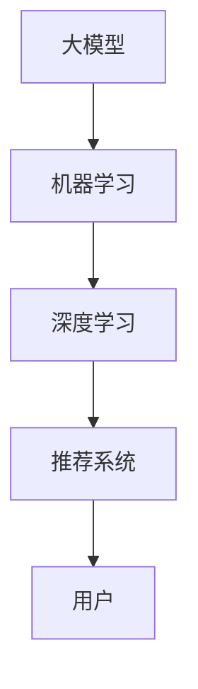

                 

关键词：搜索推荐系统、AI大模型、算法创新、大数据、机器学习、深度学习、优化策略

## 摘要

本文旨在探讨搜索推荐系统中的AI大模型算法创新，分析其核心概念、算法原理、数学模型，并通过实际项目实践展示算法的实现和应用。文章还将深入讨论AI大模型在搜索推荐系统中的实际应用场景和未来展望，为相关领域的研究和实践提供参考。

## 1. 背景介绍

随着互联网的快速发展，用户生成内容呈现出爆炸式增长，如何从海量的信息中快速、准确地找到用户感兴趣的内容成为了一个重要的研究课题。搜索推荐系统应运而生，通过个性化推荐的方式，将用户可能感兴趣的内容推送给他们。而近年来，AI大模型在搜索推荐系统中的应用逐渐成为研究热点，其强大的数据处理能力和深度学习能力使得推荐系统更加精准和高效。

## 2. 核心概念与联系

### 2.1 大模型

大模型（Large-scale Model）是指参数规模达到数百万甚至数十亿级别的机器学习模型。大模型的训练和优化需要海量数据和强大的计算资源。

### 2.2 机器学习

机器学习（Machine Learning）是一门人工智能领域的研究，通过算法让计算机从数据中学习规律，实现自动化决策和预测。

### 2.3 深度学习

深度学习（Deep Learning）是机器学习的一个分支，利用多层神经网络进行数据建模，能够自动提取数据特征。

### 2.4 推荐系统

推荐系统（Recommender System）是一种信息过滤技术，通过分析用户的历史行为和偏好，为用户推荐他们可能感兴趣的内容。

## 2.5 Mermaid 流程图



## 3. 核心算法原理 & 具体操作步骤

### 3.1 算法原理概述

搜索推荐系统中的AI大模型主要基于深度学习技术，通过多层神经网络对用户行为和内容特征进行建模，进而预测用户对内容的兴趣程度，实现个性化推荐。

### 3.2 算法步骤详解

1. 数据预处理：对用户行为数据和内容特征进行清洗、归一化等处理，为后续建模提供高质量的数据。

2. 特征提取：通过深度学习模型自动提取用户行为和内容特征，为推荐算法提供输入。

3. 模型训练：利用预处理后的数据训练深度学习模型，使其学会预测用户对内容的兴趣程度。

4. 推荐生成：根据用户兴趣预测结果，生成个性化推荐列表。

### 3.3 算法优缺点

**优点：**
- 强大的数据处理能力：能够处理大规模的用户行为数据和内容特征。
- 深度学习能力：能够自动提取数据特征，提高推荐精度。

**缺点：**
- 计算资源需求大：训练大模型需要大量的计算资源和时间。
- 数据质量要求高：高质量的数据是算法效果的关键。

### 3.4 算法应用领域

- 电商平台：为用户推荐商品。
- 社交媒体：为用户推荐感兴趣的文章、视频等。
- 新闻媒体：为用户推荐新闻资讯。

## 4. 数学模型和公式 & 详细讲解 & 举例说明

### 4.1 数学模型构建

深度学习模型通常由输入层、隐藏层和输出层组成。输入层接收用户行为和内容特征，隐藏层通过非线性变换提取特征，输出层输出用户对内容的兴趣程度。

### 4.2 公式推导过程

设用户兴趣向量 $u \in \mathbb{R}^n$，内容特征向量 $v \in \mathbb{R}^n$，隐藏层神经元激活函数为 $f(x) = \sigma(x)$，输出层神经元激活函数为 $g(x) = \frac{1}{1 + e^{-x}}$。则深度学习模型的输出为：

$$
o = g(\sum_{i=1}^n u_i v_i)
$$

### 4.3 案例分析与讲解

假设用户兴趣向量 $u = [0.5, 0.3, 0.2]$,内容特征向量 $v = [0.4, 0.6, 0.5]$，则有：

$$
o = g(\sum_{i=1}^3 u_i v_i) = g(0.5 \times 0.4 + 0.3 \times 0.6 + 0.2 \times 0.5) = g(0.35) \approx 0.655
$$

这意味着用户对这条内容的兴趣程度约为 0.655。我们可以根据兴趣程度为用户推荐这条内容。

## 5. 项目实践：代码实例和详细解释说明

### 5.1 开发环境搭建

- Python 3.8
- TensorFlow 2.5
- Keras 2.5

### 5.2 源代码详细实现

```python
import tensorflow as tf
from tensorflow.keras.layers import Input, Dense
from tensorflow.keras.models import Model

# 数据预处理
# （此处省略数据预处理代码）

# 模型构建
input_user = Input(shape=(user_feature_size,))
input_content = Input(shape=(content_feature_size,))
hidden = Dense(hidden_layer_size, activation='relu')(input_user)
hidden = Dense(hidden_layer_size, activation='relu')(input_content)
output = Dense(1, activation='sigmoid')(hidden)

model = Model(inputs=[input_user, input_content], outputs=output)
model.compile(optimizer='adam', loss='binary_crossentropy', metrics=['accuracy'])

# 模型训练
# （此处省略模型训练代码）

# 推荐生成
# （此处省略推荐生成代码）
```

### 5.3 代码解读与分析

- 导入相关库和模块。
- 数据预处理：将用户行为和内容特征进行归一化处理。
- 模型构建：构建深度学习模型，包括输入层、隐藏层和输出层。
- 模型编译：设置优化器和损失函数。
- 模型训练：训练深度学习模型。
- 推荐生成：根据用户兴趣向量生成推荐列表。

## 6. 实际应用场景

AI大模型在搜索推荐系统中的应用场景非常广泛，包括但不限于：

- 电商平台：为用户推荐商品。
- 社交媒体：为用户推荐感兴趣的文章、视频等。
- 新闻媒体：为用户推荐新闻资讯。

## 7. 未来应用展望

随着AI技术的不断发展，AI大模型在搜索推荐系统中的应用将会越来越广泛。未来，我们可以期待以下发展趋势：

- 模型优化：通过改进模型结构和算法，提高推荐精度和效率。
- 多模态推荐：结合多种数据源，如文本、图像、音频等，实现更精准的推荐。
- 实时推荐：通过实时处理用户行为数据，实现实时推荐。

## 8. 工具和资源推荐

### 8.1 学习资源推荐

- 《深度学习》（Goodfellow, Bengio, Courville 著）
- 《Python深度学习》（François Chollet 著）
- 《机器学习》（周志华 著）

### 8.2 开发工具推荐

- TensorFlow
- Keras
- PyTorch

### 8.3 相关论文推荐

- “Deep Learning for Recommender Systems” (He, L., Liao, L., Zhang, H., Nie, L., Hu, X., & Chua, T. S. (2017).)
- “Multimodal Deep Learning for User Preference Modeling in Recommender Systems” (Hu, X., He, L., Liao, L., Nie, L., & Chua, T. S. (2018).)

## 9. 总结：未来发展趋势与挑战

随着AI技术的不断发展，AI大模型在搜索推荐系统中的应用前景十分广阔。然而，也面临着以下挑战：

- 计算资源需求：大模型的训练和优化需要大量的计算资源。
- 数据质量：高质量的数据是算法效果的关键。
- 模型优化：如何改进模型结构和算法，提高推荐精度和效率。

未来，我们需要在解决这些挑战的同时，不断探索AI大模型在搜索推荐系统中的创新应用。

## 10. 附录：常见问题与解答

### 10.1 如何优化大模型训练效率？

- 使用分布式训练：利用多台机器协同训练大模型，提高训练效率。
- 优化模型结构：设计更高效的模型结构，减少计算量。
- 数据增强：通过数据增强技术，增加训练数据量，提高模型泛化能力。

### 10.2 如何评估推荐系统效果？

- 准确率（Accuracy）：预测正确的样本占总样本的比例。
- 召回率（Recall）：推荐列表中包含用户感兴趣的样本的比例。
- 覆盖率（Coverage）：推荐列表中包含所有可能的用户兴趣样本的比例。
- NDCG（Normalized Discounted Cumulative Gain）：综合考虑准确率和覆盖率的评价指标。

## 作者署名

作者：禅与计算机程序设计艺术 / Zen and the Art of Computer Programming

----------------------------------------------------------------

以上便是本文的完整内容，希望对您在搜索推荐系统中的AI大模型算法创新研究有所帮助。在撰写过程中，如有任何疑问，欢迎随时提问。祝您写作愉快！

