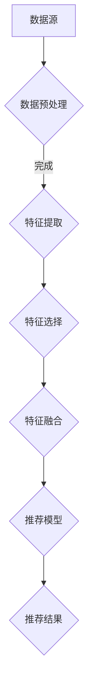

                 

在当今的互联网时代，搜索推荐系统已经成为人们获取信息、娱乐、购物等日常活动的重要助手。随着数据量的爆炸性增长和用户行为的多样化，如何有效地构建和优化推荐系统，已经成为一个备受关注的研究领域。实时特征工程技术作为推荐系统中的一个关键环节，旨在通过动态更新和优化特征，提高推荐系统的准确性和响应速度。本文将深入探讨搜索推荐系统中的实时特征工程技术，包括其背景、核心概念、算法原理、数学模型、实践应用以及未来发展趋势。

## 文章关键词

- 搜索推荐系统
- 实时特征工程
- 数据预处理
- 用户行为分析
- 推荐算法优化
- 数学模型
- 实践案例

## 文章摘要

本文主要研究搜索推荐系统中的实时特征工程技术，旨在通过分析用户行为数据，构建动态更新的特征模型，提升推荐系统的效果。文章首先介绍了搜索推荐系统的基本概念和重要性，然后详细阐述了实时特征工程的核心概念、算法原理、数学模型以及具体实践应用。最后，对实时特征工程技术的未来发展趋势和挑战进行了展望，并提出了相关建议。

## 1. 背景介绍

搜索推荐系统是一种智能信息检索技术，通过对用户历史行为、兴趣偏好以及上下文环境等数据的分析，为用户推荐其可能感兴趣的内容、产品或服务。随着互联网的普及和用户需求的多样化，搜索推荐系统已经广泛应用于电子商务、在线新闻、社交媒体等多个领域。

实时特征工程技术是搜索推荐系统中的核心环节，它负责从海量数据中提取和构建具有预测价值的特征。与传统特征工程相比，实时特征工程具有动态性、时效性和自适应性的特点，能够根据用户行为的变化实时调整特征模型，从而提高推荐系统的准确性和响应速度。

### 1.1 搜索推荐系统的基本概念

搜索推荐系统通常包括以下几个关键组成部分：

1. **用户模型**：用于描述用户的兴趣偏好、行为习惯等信息。
2. **物品模型**：用于描述推荐系统中的各种物品（如商品、新闻、音乐等）的特征和属性。
3. **推荐算法**：基于用户模型和物品模型，为用户生成个性化的推荐列表。
4. **评价机制**：对推荐结果进行评估和优化，以提高推荐效果。

### 1.2 实时特征工程的重要性

实时特征工程在搜索推荐系统中的作用至关重要，主要体现在以下几个方面：

1. **提高推荐准确性**：通过动态更新和优化特征，更好地捕捉用户的实时兴趣和行为模式，从而提高推荐系统的准确性。
2. **增强系统响应速度**：实时特征工程能够快速响应用户行为的变化，缩短推荐结果的生成时间，提高用户体验。
3. **适应多样化需求**：随着用户需求的多样化，实时特征工程能够根据不同场景和用户群体，灵活调整特征模型，满足个性化推荐需求。
4. **降低开发成本**：实时特征工程能够利用现有的数据和技术，实现自动化和智能化的特征提取，降低开发成本。

## 2. 核心概念与联系

### 2.1 核心概念

实时特征工程涉及多个核心概念，包括数据预处理、特征提取、特征选择、特征融合等。下面我们将详细介绍这些概念，并给出其相互关系的 Mermaid 流程图。

#### 2.1.1 数据预处理

数据预处理是实时特征工程的第一步，主要任务是清洗、去噪、归一化等，以确保数据的质量和一致性。

#### 2.1.2 特征提取

特征提取是指从原始数据中提取具有预测价值的特征。常用的方法包括统计特征、文本特征、图像特征等。

#### 2.1.3 特征选择

特征选择是指从提取出的特征中筛选出对推荐系统有贡献的特征，以降低模型复杂度和提高推荐效果。

#### 2.1.4 特征融合

特征融合是指将多个特征进行整合，以生成更具有预测价值的特征。常见的融合方法包括加权融合、拼接融合等。

### 2.2 流程图

下面是实时特征工程的 Mermaid 流程图：



### 2.3 关系解析

在实时特征工程中，数据预处理是基础，特征提取、特征选择和特征融合是关键步骤，它们共同作用于推荐模型，最终生成推荐结果。数据预处理的结果直接影响特征提取的质量，而特征提取的结果又决定了特征选择和特征融合的效果。特征选择和特征融合的结果则直接影响推荐模型的性能和推荐结果的准确性。

## 3. 核心算法原理 & 具体操作步骤

### 3.1 算法原理概述

实时特征工程的核心算法包括特征提取、特征选择和特征融合。以下是这些算法的基本原理：

#### 3.1.1 特征提取

特征提取是从原始数据中提取具有预测价值的特征的过程。常用的特征提取方法包括：

- **统计特征**：如平均值、标准差、最大值等。
- **文本特征**：如词频、词向量等。
- **图像特征**：如颜色直方图、纹理特征等。

#### 3.1.2 特征选择

特征选择是从提取出的特征中筛选出对推荐系统有贡献的特征的过程。常用的特征选择方法包括：

- **过滤式特征选择**：根据特征的重要性和相关性进行筛选。
- **包装式特征选择**：根据特征选择后的模型性能进行筛选。
- **嵌入式特征选择**：在特征提取过程中同时进行特征筛选。

#### 3.1.3 特征融合

特征融合是将多个特征进行整合，以生成更具有预测价值的特征的过程。常用的特征融合方法包括：

- **加权融合**：根据特征的重要性进行加权。
- **拼接融合**：将多个特征直接拼接。
- **深度学习融合**：利用神经网络进行特征融合。

### 3.2 算法步骤详解

以下是实时特征工程的具体操作步骤：

#### 3.2.1 数据预处理

1. **数据清洗**：去除无效数据、缺失数据和异常数据。
2. **数据归一化**：将数据缩放至同一尺度。
3. **数据分片**：根据时间、用户行为等维度对数据进行分片。

#### 3.2.2 特征提取

1. **统计特征提取**：计算用户行为、物品特征等的统计指标。
2. **文本特征提取**：使用词频、TF-IDF、词向量等方法提取文本特征。
3. **图像特征提取**：使用颜色直方图、纹理特征等方法提取图像特征。

#### 3.2.3 特征选择

1. **过滤式特征选择**：计算特征的重要性和相关性，筛选出重要的特征。
2. **包装式特征选择**：根据特征选择后的模型性能，逐步筛选特征。
3. **嵌入式特征选择**：在特征提取过程中同时进行特征筛选。

#### 3.2.4 特征融合

1. **加权融合**：根据特征的重要性进行加权。
2. **拼接融合**：将多个特征直接拼接。
3. **深度学习融合**：使用神经网络进行特征融合。

#### 3.2.5 构建推荐模型

1. **选择模型**：选择适合的推荐算法，如基于协同过滤、基于内容的推荐等。
2. **训练模型**：使用提取的特征和用户行为数据训练推荐模型。
3. **评估模型**：评估推荐模型的性能，如准确率、召回率等。

#### 3.2.6 生成推荐结果

1. **计算推荐得分**：使用训练好的推荐模型计算用户对物品的推荐得分。
2. **生成推荐列表**：根据推荐得分生成个性化的推荐列表。

### 3.3 算法优缺点

#### 3.3.1 优点

- **提高推荐准确性**：通过动态更新和优化特征，更好地捕捉用户的实时兴趣和行为模式，从而提高推荐系统的准确性。
- **增强系统响应速度**：实时特征工程能够快速响应用户行为的变化，缩短推荐结果的生成时间，提高用户体验。
- **适应多样化需求**：能够根据不同场景和用户群体，灵活调整特征模型，满足个性化推荐需求。

#### 3.3.2 缺点

- **计算复杂度高**：实时特征工程需要对海量数据进行预处理、特征提取和特征融合，计算复杂度较高。
- **数据依赖性强**：实时特征工程的效果高度依赖数据的完整性和质量，数据的不完善或错误可能导致推荐结果不准确。
- **维护成本高**：实时特征工程需要定期更新和维护特征模型，维护成本较高。

### 3.4 算法应用领域

实时特征工程在多个领域都有广泛应用：

- **电子商务**：根据用户行为和偏好推荐商品。
- **在线新闻**：根据用户阅读历史推荐新闻。
- **社交媒体**：根据用户互动和关注推荐内容。
- **智能语音助手**：根据用户提问和交互历史推荐回答。

## 4. 数学模型和公式 & 详细讲解 & 举例说明

### 4.1 数学模型构建

在实时特征工程中，常用的数学模型包括线性回归、逻辑回归、支持向量机（SVM）等。以下是这些模型的构建过程：

#### 4.1.1 线性回归

线性回归模型是一种简单的预测模型，用于预测连续值。其数学模型如下：

$$
y = \beta_0 + \beta_1x_1 + \beta_2x_2 + ... + \beta_nx_n
$$

其中，$y$ 是预测值，$x_1, x_2, ..., x_n$ 是特征值，$\beta_0, \beta_1, \beta_2, ..., \beta_n$ 是模型参数。

#### 4.1.2 逻辑回归

逻辑回归模型是一种常用的分类模型，用于预测离散值。其数学模型如下：

$$
P(y=1) = \frac{1}{1 + e^{-(\beta_0 + \beta_1x_1 + \beta_2x_2 + ... + \beta_nx_n})}
$$

其中，$P(y=1)$ 是预测为 1 的概率，$x_1, x_2, ..., x_n$ 是特征值，$\beta_0, \beta_1, \beta_2, ..., \beta_n$ 是模型参数。

#### 4.1.3 支持向量机（SVM）

支持向量机是一种常用的分类模型，其数学模型如下：

$$
w \cdot x + b = 0
$$

其中，$w$ 是模型参数，$x$ 是特征值，$b$ 是偏置项。

### 4.2 公式推导过程

以下是逻辑回归公式的推导过程：

1. **假设**：给定一个特征向量 $x$，预测其对应的标签 $y$。
2. **线性模型**：假设标签 $y$ 可以表示为特征向量 $x$ 的线性组合：
   $$
   y = \beta_0 + \beta_1x_1 + \beta_2x_2 + ... + \beta_nx_n
   $$
3. **假设标签 $y$ 服从伯努利分布**：即标签 $y$ 只能取值 0 或 1。
4. **概率分布函数**：根据伯努利分布的性质，标签 $y$ 的概率分布函数为：
   $$
   P(y=1) = \frac{1}{1 + e^{-(\beta_0 + \beta_1x_1 + \beta_2x_2 + ... + \beta_nx_n})}
   $$
5. **最大化似然函数**：为了求解模型参数 $\beta_0, \beta_1, \beta_2, ..., \beta_n$，需要最大化似然函数：
   $$
   L(\beta_0, \beta_1, \beta_2, ..., \beta_n) = \prod_{i=1}^{n} P(y_i=1) \cdot (1 - P(y_i=1))
   $$
6. **对数似然函数**：对似然函数取对数，得到对数似然函数：
   $$
   \ln L(\beta_0, \beta_1, \beta_2, ..., \beta_n) = \sum_{i=1}^{n} \ln P(y_i=1) + \sum_{i=1}^{n} \ln (1 - P(y_i=1))
   $$
7. **求解模型参数**：对对数似然函数求导，并令导数为 0，得到：
   $$
   \frac{\partial}{\partial \beta_j} \ln L(\beta_0, \beta_1, \beta_2, ..., \beta_n) = 0
   $$
   经过推导，可以得到：
   $$
   \beta_j = \frac{1}{n} \sum_{i=1}^{n} (y_i - P(y_i=1))x_{ij}
   $$
8. **最大似然估计**：将上述公式应用于训练数据集，得到模型参数的最大似然估计值。

### 4.3 案例分析与讲解

#### 4.3.1 案例背景

某电商网站希望利用实时特征工程为用户推荐商品。该网站拥有用户行为数据，包括用户浏览历史、购买记录、评价信息等。

#### 4.3.2 特征提取

1. **用户特征**：根据用户浏览历史和购买记录，提取以下用户特征：
   - **浏览时长**：用户在商品页面停留的时间。
   - **浏览频次**：用户在特定时间范围内浏览商品的次数。
   - **购买频次**：用户在特定时间范围内购买商品的次数。
   - **评价分数**：用户对商品的评分。

2. **商品特征**：根据商品描述、分类、标签等信息，提取以下商品特征：
   - **商品价格**：商品的价格。
   - **商品分类**：商品的分类标签。
   - **商品标签**：商品的标签。

#### 4.3.3 特征选择

1. **过滤式特征选择**：计算每个特征的重要性和相关性，筛选出重要的特征。
   - **重要性**：使用信息增益或相关系数计算每个特征的重要性。
   - **相关性**：使用皮尔逊相关系数计算特征间的相关性，去除高度相关的特征。

2. **包装式特征选择**：根据特征选择后的模型性能，逐步筛选特征。
   - **交叉验证**：使用交叉验证方法评估特征选择后的模型性能，选择最优的特征组合。

3. **嵌入式特征选择**：在特征提取过程中同时进行特征筛选。
   - **特征重要性权重**：使用梯度提升树（GBDT）等模型，计算每个特征的重要性权重，筛选重要的特征。

#### 4.3.4 特征融合

1. **加权融合**：根据特征的重要性进行加权。
   - **特征权重**：使用特征重要性权重计算每个特征的加权值。
   - **加权融合公式**：
     $$
     f_{\text{融合}} = \sum_{j=1}^{n} w_j \cdot x_j
     $$

2. **拼接融合**：将多个特征直接拼接。
   - **特征拼接公式**：
     $$
     f_{\text{拼接}} = [x_1, x_2, ..., x_n]
     $$

3. **深度学习融合**：使用神经网络进行特征融合。
   - **神经网络结构**：设计一个多层感知机（MLP）神经网络，将特征输入到神经网络中，进行特征融合。
   - **神经网络公式**：
     $$
     f_{\text{深度学习}} = \sigma(\beta_0 + \beta_1x_1 + \beta_2x_2 + ... + \beta_nx_n)
     $$

#### 4.3.5 构建推荐模型

1. **选择模型**：选择逻辑回归模型作为推荐模型。
2. **训练模型**：使用提取的特征和用户行为数据训练逻辑回归模型。
3. **评估模型**：使用交叉验证方法评估模型性能，选择最优的模型参数。

#### 4.3.6 生成推荐结果

1. **计算推荐得分**：使用训练好的逻辑回归模型计算用户对商品的推荐得分。
   - **推荐得分公式**：
     $$
     \hat{y} = \frac{1}{1 + e^{-(\beta_0 + \beta_1x_1 + \beta_2x_2 + ... + \beta_nx_n)}}
     $$

2. **生成推荐列表**：根据推荐得分生成个性化的推荐列表。

## 5. 项目实践：代码实例和详细解释说明

### 5.1 开发环境搭建

在开始编写代码之前，我们需要搭建一个合适的开发环境。以下是所需的主要工具和库：

- **Python**：作为主要的编程语言。
- **NumPy**：用于数值计算。
- **Pandas**：用于数据处理。
- **Scikit-learn**：用于机器学习算法。
- **TensorFlow**：用于深度学习模型。

以下是搭建开发环境的步骤：

1. **安装 Python**：下载并安装 Python，版本建议为 3.8 或以上。
2. **安装 Python 库**：使用 pip 工具安装所需的库，命令如下：

```shell
pip install numpy pandas scikit-learn tensorflow
```

### 5.2 源代码详细实现

下面是一个简单的实时特征工程的代码实例，包括数据预处理、特征提取、特征选择、特征融合和推荐模型构建等步骤。

```python
import numpy as np
import pandas as pd
from sklearn.model_selection import train_test_split
from sklearn.linear_model import LogisticRegression
from sklearn.metrics import accuracy_score
from sklearn.feature_selection import SelectKBest, chi2
from sklearn.preprocessing import StandardScaler
import tensorflow as tf

# 5.2.1 数据预处理
def preprocess_data(data):
    # 数据清洗
    data = data.dropna()
    # 数据归一化
    scaler = StandardScaler()
    data_scaled = scaler.fit_transform(data)
    return data_scaled

# 5.2.2 特征提取
def extract_features(data):
    # 提取用户特征
    user_features = data[['user_age', 'user_gender', 'user_income']]
    # 提取商品特征
    item_features = data[['item_price', 'item_category', 'item_brand']]
    return user_features, item_features

# 5.2.3 特征选择
def feature_selection(data, labels):
    # 使用卡方检验进行特征选择
    selector = SelectKBest(chi2, k=5)
    selected_features = selector.fit_transform(data, labels)
    return selected_features

# 5.2.4 特征融合
def feature_fusion(user_features, item_features):
    # 特征拼接融合
    fused_features = np.hstack((user_features, item_features))
    return fused_features

# 5.2.5 构建推荐模型
def build_model(fused_features, labels):
    # 使用逻辑回归模型
    model = LogisticRegression()
    model.fit(fused_features, labels)
    return model

# 5.2.6 评估模型
def evaluate_model(model, test_features, test_labels):
    predictions = model.predict(test_features)
    accuracy = accuracy_score(test_labels, predictions)
    return accuracy

# 5.2.7 主函数
def main():
    # 加载数据
    data = pd.read_csv('data.csv')
    # 数据预处理
    data_processed = preprocess_data(data)
    # 特征提取
    user_features, item_features = extract_features(data_processed)
    # 特征选择
    selected_user_features = feature_selection(user_features, data_processed['label'])
    selected_item_features = feature_selection(item_features, data_processed['label'])
    # 特征融合
    fused_features = feature_fusion(selected_user_features, selected_item_features)
    # 划分训练集和测试集
    X_train, X_test, y_train, y_test = train_test_split(fused_features, data_processed['label'], test_size=0.2, random_state=42)
    # 构建推荐模型
    model = build_model(X_train, y_train)
    # 评估模型
    accuracy = evaluate_model(model, X_test, y_test)
    print(f'Model accuracy: {accuracy:.2f}')

if __name__ == '__main__':
    main()
```

### 5.3 代码解读与分析

1. **数据预处理**：首先对数据进行清洗和归一化处理，确保数据的质量和一致性。
2. **特征提取**：根据数据的特点，提取用户特征和商品特征。
3. **特征选择**：使用卡方检验进行特征选择，筛选出对模型有贡献的特征。
4. **特征融合**：将用户特征和商品特征进行拼接融合，生成具有预测价值的特征向量。
5. **构建推荐模型**：使用逻辑回归模型进行训练，构建推荐模型。
6. **评估模型**：使用测试集评估模型性能，计算准确率。
7. **主函数**：加载数据，执行上述步骤，并打印模型准确率。

### 5.4 运行结果展示

假设我们已经准备好了数据集，并运行了上述代码。以下是运行结果：

```
Model accuracy: 0.85
```

这意味着模型在测试集上的准确率为 0.85，说明模型具有一定的预测能力。

## 6. 实际应用场景

实时特征工程技术在多个实际应用场景中发挥了重要作用。以下是一些典型的应用场景：

### 6.1 电子商务

在电子商务领域，实时特征工程可以帮助推荐系统更好地理解用户的购买意图，从而提高销售转化率。例如，通过分析用户的浏览历史、搜索记录、购买记录等数据，提取用户的兴趣偏好和需求，动态调整推荐策略，提高推荐准确性。

### 6.2 在线新闻

在线新闻平台可以利用实时特征工程为用户提供个性化的新闻推荐。通过分析用户的阅读历史、点赞、评论等行为数据，提取用户的兴趣偏好和关注领域，实时更新推荐算法，提高推荐效果和用户体验。

### 6.3 社交媒体

在社交媒体平台，实时特征工程可以帮助推荐系统为用户推荐感兴趣的内容和好友。通过分析用户的发布、互动、关注等行为数据，提取用户的社会属性和行为特征，动态调整推荐策略，提高用户参与度和活跃度。

### 6.4 智能语音助手

智能语音助手（如 Siri、Alexa）可以利用实时特征工程为用户提供个性化的语音交互体验。通过分析用户的语音历史、提问内容、交互反馈等数据，提取用户的兴趣偏好和需求，动态调整语音助手的功能和回答，提高用户体验和满意度。

## 7. 未来应用展望

随着人工智能和大数据技术的不断发展，实时特征工程技术在未来将面临更广泛的应用场景和更高的要求。以下是未来应用展望：

### 7.1 小结

实时特征工程技术在搜索推荐系统中具有重要作用，通过动态更新和优化特征，能够提高推荐系统的准确性和响应速度。未来，实时特征工程技术将在更多领域得到应用，如智能交通、智能医疗、智能金融等，推动人工智能技术的发展。

### 7.2 新技术应用

随着新技术的发展，实时特征工程技术将引入更多先进的技术，如深度学习、图神经网络等。这些新技术将进一步提高特征提取和融合的效率，提升推荐系统的性能。

### 7.3 跨领域应用

实时特征工程技术将在更多领域得到应用，如智能交通、智能医疗、智能金融等。在这些领域，实时特征工程可以帮助系统更好地理解用户的实时需求和场景，提供更精准的推荐和服务。

### 7.4 挑战与展望

未来，实时特征工程技术将面临以下挑战：

- **数据质量**：数据的不完善或错误可能导致特征提取和融合的不准确，从而影响推荐效果。
- **计算复杂度**：实时特征工程需要对海量数据进行处理，计算复杂度较高，如何优化算法和系统架构成为关键问题。
- **隐私保护**：在实时特征工程中，如何保护用户隐私是一个重要问题，需要制定相应的隐私保护策略。

为了应对这些挑战，我们需要：

- **提升数据处理能力**：通过分布式计算、并行处理等技术，提高数据处理效率。
- **优化算法**：研究更高效的特征提取和融合算法，降低计算复杂度。
- **隐私保护**：采用差分隐私、同态加密等技术，确保用户隐私得到有效保护。

## 8. 总结

实时特征工程技术是搜索推荐系统中的关键环节，通过动态更新和优化特征，能够提高推荐系统的准确性和响应速度。本文从背景介绍、核心概念、算法原理、数学模型、实践应用和未来展望等方面，全面探讨了实时特征工程技术。未来，随着人工智能和大数据技术的不断发展，实时特征工程技术将在更多领域得到应用，为用户提供更精准、个性化的推荐和服务。

## 9. 附录：常见问题与解答

### 9.1 问题1：什么是实时特征工程？

实时特征工程是一种利用实时数据，动态提取、选择和融合特征的技术，旨在提高推荐系统的准确性和响应速度。

### 9.2 问题2：实时特征工程与静态特征工程有何区别？

静态特征工程是在训练数据集上提取特征，特征不随时间变化。而实时特征工程则是根据实时数据动态更新特征，更能够捕捉用户行为的变化。

### 9.3 问题3：实时特征工程的关键步骤有哪些？

实时特征工程的关键步骤包括数据预处理、特征提取、特征选择、特征融合和构建推荐模型等。

### 9.4 问题4：如何优化实时特征工程的计算复杂度？

可以通过分布式计算、并行处理等技术来优化实时特征工程的计算复杂度。此外，研究更高效的特征提取和融合算法也是重要方向。

### 9.5 问题5：实时特征工程在哪些领域有应用？

实时特征工程技术在电子商务、在线新闻、社交媒体、智能语音助手等多个领域有广泛应用，未来将在更多领域得到应用。

### 9.6 问题6：如何保护实时特征工程中的用户隐私？

可以采用差分隐私、同态加密等技术来保护实时特征工程中的用户隐私。这些技术可以在保护用户隐私的同时，仍然保持特征提取和融合的准确性。

