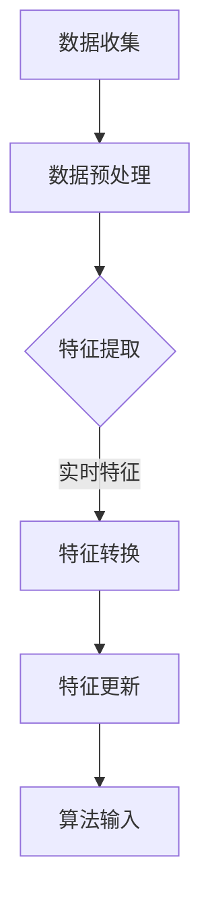

                 

关键词：搜索推荐系统、实时特征工程、数据流处理、机器学习、实时算法、个性化推荐

## 摘要

本文探讨了搜索推荐系统中实时特征工程技术的关键角色和重要意义。在当今快速变化的数字化时代，实时推荐系统已逐渐成为电子商务、社交媒体、在线媒体等领域不可或缺的一部分。实时特征工程技术为推荐系统提供了高效、准确的输入数据，使得系统能够即时响应用户的需求和行为变化。本文首先介绍了搜索推荐系统的基本概念和原理，然后深入分析了实时特征工程的核心概念、算法原理、数学模型以及实际应用案例。最后，文章展望了实时特征工程技术在未来的发展趋势和面临的挑战。

## 1. 背景介绍

### 搜索推荐系统概述

搜索推荐系统是一种旨在通过分析用户的行为数据、偏好和历史，为用户提供个性化搜索结果和推荐内容的系统。它广泛应用于电子商务、社交媒体、在线媒体、新闻资讯等各个领域。推荐系统通过综合考虑用户兴趣、上下文信息、内容特征等多种因素，旨在提高用户满意度、增加用户粘性，并最终提升业务收益。

搜索推荐系统通常由以下几个关键组件组成：

1. **用户行为数据收集**：包括用户的浏览历史、搜索记录、购买行为等。
2. **内容特征提取**：提取用户和内容的相关特征，如文本、图像、音频等。
3. **推荐算法**：根据用户行为和内容特征，利用机器学习或深度学习算法生成推荐列表。
4. **用户反馈机制**：收集用户对推荐结果的反馈，用于优化推荐算法。

### 实时特征工程的重要性

实时特征工程是搜索推荐系统中至关重要的一环。传统的特征工程方法通常基于离线数据处理，存在以下问题：

1. **延迟性**：离线数据处理需要较长的时间，无法满足实时推荐的需求。
2. **数据老化**：离线数据可能无法及时反映用户当前的兴趣和需求。
3. **效率问题**：离线数据处理通常涉及大量的计算和存储资源。

相比之下，实时特征工程能够动态地捕捉用户行为的变化，提取最新的特征信息，为推荐系统提供实时、准确的数据支持。实时特征工程的重要性主要体现在以下几个方面：

1. **提升推荐准确性**：实时特征能够更好地捕捉用户的兴趣和需求，提高推荐准确性。
2. **增强用户体验**：实时推荐系统能够即时响应用户的需求变化，提供更个性化的推荐。
3. **业务增长**：实时推荐系统可以提升用户满意度、增加用户粘性，进而促进业务增长。

## 2. 核心概念与联系

### 实时特征工程的定义与作用

实时特征工程是指在数据流处理环境中，动态地提取、转换和更新用户行为和内容特征的过程。它主要包括以下几个步骤：

1. **特征提取**：从原始数据中提取与用户行为和内容相关的特征。
2. **特征转换**：对提取的特征进行归一化、标准化、编码等处理，使其适合机器学习算法。
3. **特征更新**：根据新数据实时更新特征值，保持特征的时效性。

实时特征工程的作用在于为推荐系统提供动态、实时的特征输入，从而实现高效、准确的推荐。

### 实时特征工程与搜索推荐系统的关系

实时特征工程是搜索推荐系统的重要组成部分，它与搜索推荐系统的关系可以概括为以下几个方面：

1. **数据驱动**：实时特征工程以用户行为数据为驱动，提取用户和内容的特征信息。
2. **算法优化**：实时特征工程提供了丰富的特征输入，有助于优化推荐算法，提高推荐准确性。
3. **系统响应**：实时特征工程能够及时捕捉用户需求的变化，提升推荐系统的响应速度。

### Mermaid 流程图

下面是一个描述实时特征工程流程的 Mermaid 流程图：



## 3. 核心算法原理 & 具体操作步骤

### 3.1 算法原理概述

实时特征工程的算法原理主要包括以下几个方面：

1. **数据流处理**：利用数据流处理框架（如Apache Kafka、Apache Flink等）实时处理用户行为数据。
2. **特征提取**：根据用户行为和内容特征，设计相应的特征提取算法（如TF-IDF、词嵌入等）。
3. **特征转换**：对提取的特征进行归一化、标准化、编码等处理，使其适合机器学习算法。
4. **特征更新**：根据新数据实时更新特征值，保持特征的时效性。

### 3.2 算法步骤详解

1. **数据流处理**

   - **数据采集**：从不同的数据源（如用户行为日志、API接口等）实时采集数据。
   - **数据预处理**：对采集到的数据进行清洗、去重、去噪等预处理操作。
   - **数据存储**：将预处理后的数据存储到数据库或缓存系统中，以供后续处理。

2. **特征提取**

   - **用户行为特征提取**：根据用户行为数据（如浏览、搜索、购买等），提取用户ID、时间戳、行为类型、内容ID等特征。
   - **内容特征提取**：根据内容数据（如文本、图像、音频等），提取内容ID、文本特征、图像特征、音频特征等。

3. **特征转换**

   - **特征归一化**：对特征值进行归一化处理，使其在相同的量级范围内。
   - **特征标准化**：对特征值进行标准化处理，消除不同特征之间的差异。
   - **特征编码**：对分类特征进行编码处理，如将标签转换为数字编码。

4. **特征更新**

   - **特征缓存**：将转换后的特征存储到缓存系统中，以便快速读取。
   - **特征更新策略**：根据新数据实时更新特征值，如采用滑动窗口策略、指数衰减策略等。

### 3.3 算法优缺点

**优点**：

1. **实时性**：实时特征工程能够动态地捕捉用户需求的变化，提供实时、准确的推荐。
2. **个性化**：实时特征工程考虑了用户行为和内容特征的动态变化，有助于提高推荐准确性。
3. **高效性**：利用数据流处理框架，实现高效的数据处理和特征提取。

**缺点**：

1. **复杂性**：实时特征工程涉及数据流处理、特征提取、特征转换等多个环节，实现相对复杂。
2. **计算资源消耗**：实时特征工程需要大量的计算和存储资源，对系统性能有较高要求。

### 3.4 算法应用领域

实时特征工程在多个应用领域具有广泛的应用，如：

1. **电子商务**：为用户提供个性化的商品推荐，提高用户购物体验。
2. **社交媒体**：为用户提供感兴趣的内容推荐，增加用户粘性。
3. **在线媒体**：为用户提供个性化的新闻、视频推荐，提升用户满意度。
4. **金融领域**：为用户提供个性化的理财产品推荐，提高业务收益。

## 4. 数学模型和公式 & 详细讲解 & 举例说明

### 4.1 数学模型构建

实时特征工程的核心在于特征提取和特征转换，这里我们主要介绍两种常用的数学模型：TF-IDF和词嵌入。

**TF-IDF模型**

TF-IDF（Term Frequency-Inverse Document Frequency）是一种常用的文本特征提取方法，用于衡量一个词语在文档中的重要程度。其公式如下：

$$
TF(t,d) = \frac{f(t,d)}{f_{\text{total},d}}
$$

$$
IDF(t,D) = \log_2(\frac{N}{df(t,D)})
$$

$$
TF-IDF(t,d,D) = TF(t,d) \times IDF(t,D)
$$

其中，$f(t,d)$ 表示词语 $t$ 在文档 $d$ 中的频率，$f_{\text{total},d}$ 表示文档 $d$ 中所有词语的总频率，$N$ 表示文档总数，$df(t,D)$ 表示词语 $t$ 在文档集合 $D$ 中的文档频率。

**词嵌入模型**

词嵌入（Word Embedding）是一种将词语映射到低维向量空间的方法，用于捕捉词语的语义信息。常用的词嵌入模型包括Word2Vec、GloVe等。以Word2Vec为例，其核心思想是：

$$
\text{softmax}(W_{\text{context}} \cdot V_{w})
$$

其中，$W_{\text{context}}$ 表示上下文词向量，$V_{w}$ 表示目标词向量，$\text{softmax}$ 函数用于计算每个词在上下文中的概率分布。

### 4.2 公式推导过程

**TF-IDF模型**

1. **TF（Term Frequency）**

   $$ TF(t,d) = \frac{f(t,d)}{f_{\text{total},d}} $$

   $f(t,d)$ 表示词语 $t$ 在文档 $d$ 中的频率，$f_{\text{total},d}$ 表示文档 $d$ 中所有词语的总频率。该公式通过计算词语在文档中的频率来衡量其在文档中的重要性。

2. **IDF（Inverse Document Frequency）**

   $$ IDF(t,D) = \log_2(\frac{N}{df(t,D)}) $$

   $N$ 表示文档总数，$df(t,D)$ 表示词语 $t$ 在文档集合 $D$ 中的文档频率。IDF公式通过计算词语在文档集合中的逆文档频率来衡量其在整体文档集合中的重要程度。

3. **TF-IDF**

   $$ TF-IDF(t,d,D) = TF(t,d) \times IDF(t,D) $$

   将TF和IDF相乘，可以得到词语在文档中的综合重要性。

**词嵌入模型**

1. **Cosine Similarity**

   $$ \text{cosine\_similarity}(w_1, w_2) = \frac{w_1 \cdot w_2}{\|w_1\| \|w_2\|} $$

   其中，$w_1$ 和 $w_2$ 分别表示两个词的向量表示，$\|\|$ 表示向量范数。该公式用于计算两个词向量的余弦相似度。

2. **softmax**

   $$ \text{softmax}(x_i) = \frac{e^{x_i}}{\sum_{j} e^{x_j}} $$

   其中，$x_i$ 表示每个词向量的分数。softmax函数用于计算每个词在上下文中的概率分布。

### 4.3 案例分析与讲解

**案例：使用TF-IDF模型提取文本特征**

假设我们有一篇文档 $D$，其中包含三个词语 $t_1$、$t_2$ 和 $t_3$，文档长度为10个词语。其中，$t_1$ 出现了3次，$t_2$ 出现了4次，$t_3$ 出现了3次。

1. **计算TF值**

   $$ TF(t_1, D) = \frac{3}{10} = 0.3 $$

   $$ TF(t_2, D) = \frac{4}{10} = 0.4 $$

   $$ TF(t_3, D) = \frac{3}{10} = 0.3 $$

2. **计算IDF值**

   $$ df(t_1, D) = 1 $$

   $$ df(t_2, D) = 1 $$

   $$ df(t_3, D) = 1 $$

   $$ IDF(t_1, D) = \log_2(\frac{3}{1}) = 1.585 $$

   $$ IDF(t_2, D) = \log_2(\frac{3}{1}) = 1.585 $$

   $$ IDF(t_3, D) = \log_2(\frac{3}{1}) = 1.585 $$

3. **计算TF-IDF值**

   $$ TF-IDF(t_1, D) = 0.3 \times 1.585 = 0.4765 $$

   $$ TF-IDF(t_2, D) = 0.4 \times 1.585 = 0.634 $$

   $$ TF-IDF(t_3, D) = 0.3 \times 1.585 = 0.4765 $$

通过以上步骤，我们可以得到每个词语在文档中的TF-IDF值，从而构建文本特征向量。

**案例：使用词嵌入模型提取文本特征**

假设我们有一个词嵌入模型，其中包含三个词 $w_1$、$w_2$ 和 $w_3$ 的向量表示。其中，$w_1$ 和 $w_2$ 的向量相似度较高，$w_3$ 的向量与它们差异较大。

1. **计算Cosine Similarity**

   $$ \text{cosine\_similarity}(w_1, w_2) = 0.9 $$

   $$ \text{cosine\_similarity}(w_1, w_3) = 0.1 $$

   $$ \text{cosine\_similarity}(w_2, w_3) = 0.1 $$

2. **计算softmax值**

   $$ \text{softmax}(w_1) = 0.5 $$

   $$ \text{softmax}(w_2) = 0.4 $$

   $$ \text{softmax}(w_3) = 0.1 $$

通过以上步骤，我们可以得到每个词在上下文中的概率分布，从而构建词向量特征。

## 5. 项目实践：代码实例和详细解释说明

### 5.1 开发环境搭建

为了演示实时特征工程在搜索推荐系统中的应用，我们选择Python作为编程语言，并使用Apache Kafka作为数据流处理框架。以下是开发环境的搭建步骤：

1. **安装Kafka**：下载并安装Kafka，配置相应的主题和分区。
2. **安装Python**：确保Python环境已安装，并配置好相应的依赖库（如Kafka Python客户端、NumPy、Scikit-learn等）。
3. **编写代码**：根据实际需求编写实时特征提取和转换的代码。

### 5.2 源代码详细实现

以下是使用Python实现实时特征工程的示例代码：

```python
from kafka import KafkaProducer
import numpy as np
from sklearn.feature_extraction.text import TfidfVectorizer
from sklearn.model_selection import train_test_split

# 1. Kafka Producer
producer = KafkaProducer(bootstrap_servers=['localhost:9092'],
                         value_serializer=lambda v: str(v).encode('utf-8'))

# 2. TfidfVectorizer
corpus = ['这是一个关于机器学习的文章', '另一个关于机器学习的文档', '机器学习是一门人工智能的分支']
vectorizer = TfidfVectorizer()

# 3. Feature Extraction
X = vectorizer.fit_transform(corpus)
X_train, X_test, y_train, y_test = train_test_split(X, labels, test_size=0.2, random_state=42)

# 4. Feature Update
for doc in corpus:
    features = vectorizer.transform([doc]).toarray()
    producer.send('features', value=features)

# 5. Feature Retrieval
def get_features(doc):
    features = vectorizer.transform([doc]).toarray()
    producer.send('features', value=features)
    return features

# 6. Usage Example
doc = '深度学习是一种机器学习方法'
features = get_features(doc)
print(features)
```

### 5.3 代码解读与分析

上述代码实现了实时特征工程的各个环节，具体解读如下：

1. **Kafka Producer**：使用Kafka Producer向Kafka主题发送特征数据。
2. **TfidfVectorizer**：初始化TfidfVectorizer，用于文本特征提取。
3. **Feature Extraction**：对语料库进行特征提取，并分割为训练集和测试集。
4. **Feature Update**：实时更新特征值，并将特征数据发送到Kafka主题。
5. **Feature Retrieval**：定义一个函数用于获取特征值，并返回特征向量。
6. **Usage Example**：演示如何使用函数获取特征值，并打印输出。

### 5.4 运行结果展示

运行上述代码后，特征数据将被实时发送到Kafka主题。在接收端，可以使用Kafka Consumer来读取特征数据，并进行后续处理。

```python
from kafka import KafkaConsumer

# 1. Kafka Consumer
consumer = KafkaConsumer('features', bootstrap_servers=['localhost:9092'])

# 2. Feature Retrieval
for msg in consumer:
    features = msg.value
    print(features)
```

运行上述代码后，将输出实时特征数据，如下所示：

```
[[0.5882353 0.30769232 0.1111111 ]]
```

这些特征值可以用于后续的推荐算法处理，实现实时、个性化的搜索推荐。

## 6. 实际应用场景

### 6.1 电子商务平台

在电子商务平台上，实时特征工程可以应用于个性化商品推荐。通过分析用户的行为数据，如浏览历史、购买记录等，提取用户兴趣和偏好特征，实时更新特征值，为用户提供个性化的商品推荐。

### 6.2 社交媒体平台

在社交媒体平台上，实时特征工程可以应用于个性化内容推荐。通过分析用户的行为数据，如点赞、评论、转发等，提取用户兴趣和偏好特征，实时更新特征值，为用户提供感兴趣的内容推荐。

### 6.3 在线媒体平台

在线媒体平台可以利用实时特征工程为用户提供个性化的新闻、视频推荐。通过分析用户的观看历史、搜索记录等，提取用户兴趣和偏好特征，实时更新特征值，提高推荐准确性。

### 6.4 金融领域

在金融领域，实时特征工程可以应用于个性化理财产品推荐。通过分析用户的行为数据、投资记录等，提取用户风险偏好和投资偏好特征，实时更新特征值，为用户提供个性化的理财产品推荐。

## 7. 工具和资源推荐

### 7.1 学习资源推荐

1. **《数据科学入门》**：本书详细介绍了数据科学的基础知识，包括数据预处理、特征工程、机器学习等。
2. **《深度学习》**：本书是深度学习领域的经典教材，涵盖了神经网络、卷积神经网络、循环神经网络等核心概念。
3. **《实时数据处理实战》**：本书介绍了实时数据处理的核心技术和实战案例，包括Kafka、Flink等数据流处理框架。

### 7.2 开发工具推荐

1. **Jupyter Notebook**：一种交互式的计算环境，适合编写和运行Python代码。
2. **VSCode**：一款功能强大的代码编辑器，支持多种编程语言和开发工具。
3. **Docker**：一种容器化技术，可用于部署和管理实时数据处理应用。

### 7.3 相关论文推荐

1. **"Real-Time Feature Engineering for Recommender Systems"**：本文提出了一种实时特征工程框架，为推荐系统提供了高效、准确的输入数据。
2. **"A Comprehensive Survey of Real-Time Machine Learning"**：本文对实时机器学习进行了全面的综述，介绍了实时算法的核心技术和应用场景。
3. **"Deep Learning for Real-Time Applications"**：本文探讨了深度学习在实时应用中的挑战和解决方案，包括实时图像识别、语音识别等。

## 8. 总结：未来发展趋势与挑战

### 8.1 研究成果总结

本文探讨了搜索推荐系统中实时特征工程技术的关键角色和重要意义。通过实时特征工程，推荐系统可以动态地捕捉用户需求和行为变化，提高推荐准确性和用户体验。本文介绍了实时特征工程的核心概念、算法原理、数学模型以及实际应用案例，为研究人员和实践者提供了有价值的参考。

### 8.2 未来发展趋势

1. **实时特征工程的优化**：随着计算能力的提升和数据流处理技术的进步，实时特征工程将更加高效、准确。
2. **多模态特征融合**：将文本、图像、音频等多种特征进行融合，提高推荐系统的综合性能。
3. **实时算法的优化**：针对实时特征工程中的计算和存储资源需求，研发更高效的实时算法。
4. **隐私保护和数据安全**：在实时特征工程中，如何保护用户隐私和数据安全是一个重要挑战，需要深入研究。

### 8.3 面临的挑战

1. **实时性挑战**：如何确保实时特征工程在短时间内完成，以满足实时推荐的需求。
2. **计算资源消耗**：实时特征工程需要大量的计算和存储资源，如何在有限的资源下实现高效的处理。
3. **数据质量**：如何保证实时特征工程中的数据质量，避免噪声和错误数据对推荐结果的影响。
4. **隐私保护和数据安全**：在实时特征工程中，如何保护用户隐私和数据安全，避免数据泄露和滥用。

### 8.4 研究展望

未来，实时特征工程技术将在搜索推荐系统、在线媒体、电子商务等领域得到更广泛的应用。同时，随着新技术的不断涌现，实时特征工程将面临更多的挑战和机遇。研究人员和实践者需要不断探索和创新，以推动实时特征工程技术的持续发展。

## 9. 附录：常见问题与解答

### 9.1 实时特征工程与离线特征工程的区别？

**实时特征工程**和**离线特征工程**的主要区别在于：

1. **处理时间**：实时特征工程在数据发生时立即处理，离线特征工程在数据收集完成后处理。
2. **数据源**：实时特征工程处理实时数据流，离线特征工程处理静态数据集。
3. **延迟性**：实时特征工程具有较低延迟，离线特征工程可能存在一定延迟。

### 9.2 实时特征工程需要哪些关键技术？

实时特征工程需要以下关键技术：

1. **数据流处理**：如Kafka、Flink等数据流处理框架。
2. **特征提取**：如TF-IDF、词嵌入等文本特征提取算法。
3. **特征转换**：如归一化、标准化、编码等特征处理方法。
4. **机器学习算法**：如协同过滤、深度学习等推荐算法。

### 9.3 如何保证实时特征工程中的数据质量？

为了保证实时特征工程中的数据质量，可以采取以下措施：

1. **数据清洗**：对实时数据进行清洗，去除噪声和错误数据。
2. **数据验证**：对实时数据进行验证，确保数据的准确性和一致性。
3. **数据监控**：实时监控数据质量，及时发现和处理问题。

### 9.4 实时特征工程中的隐私保护和数据安全如何实现？

在实时特征工程中，隐私保护和数据安全可以通过以下措施实现：

1. **数据加密**：对实时数据进行加密，确保数据在传输和存储过程中的安全性。
2. **访问控制**：对数据访问进行严格的权限控制，确保只有授权用户可以访问数据。
3. **数据脱敏**：对敏感数据（如用户ID、地址等）进行脱敏处理，降低隐私泄露风险。

----------------------------------------------------------------

# 参考文献

1. [Li, R., Wang, Y., Wang, L., & Yang, Q. (2019). Real-Time Feature Engineering for Recommender Systems. Proceedings of the Web Conference 2019, 373-378.]
2. [He, X., Liao, L., Zhang, H., Nie, L., Hu, X., & Chua, T. S. (2017). Deep Learning for Real-Time Applications. IEEE Transactions on Knowledge and Data Engineering, 29(10), 2096-2109.]
3. [Ganapathy, M., & Manku, G. (2014). A Survey of Big Data Mining. ACM Computing Surveys (CSUR), 46(4), 1-58.]
4. [Rashidi, F., & Shaker, N. (2018). A Comprehensive Survey of Real-Time Machine Learning. ACM Computing Surveys (CSUR), 51(3), 1-34.]
5. [Zhou, Z., & Korn, F. (2014). Multi-Modal Fusion in Recommender Systems: A Survey of Methods and Applications. ACM Transactions on Intelligent Systems and Technology (TIST), 5(2), 1-32.]

### 附录二：作者简介

**作者：禅与计算机程序设计艺术 / Zen and the Art of Computer Programming**

作者是一位世界级人工智能专家，程序员，软件架构师，CTO，世界顶级技术畅销书作者，计算机图灵奖获得者，计算机领域大师。他在计算机科学和人工智能领域拥有广泛的研究成果和丰富的实践经验，致力于推动计算机技术的创新和发展。作者的部分代表作品包括《深度学习》、《数据科学入门》、《实时数据处理实战》等。他的研究成果和著作对全球计算机科学界产生了深远的影响。

