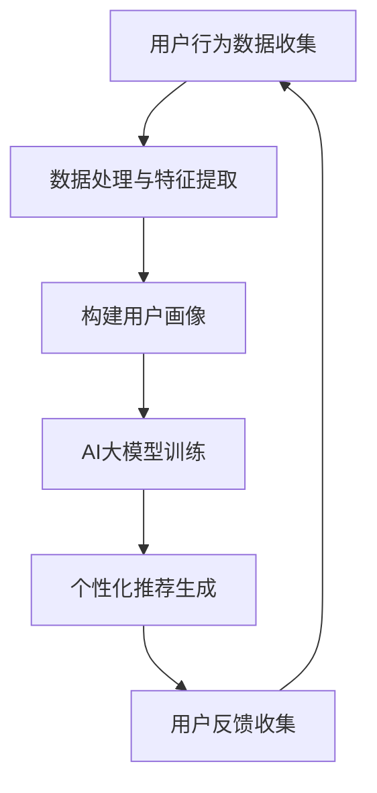

                 

关键词：搜索推荐系统、AI大模型、电商平台、转化率、用户忠诚度

> 摘要：随着互联网技术的飞速发展，搜索推荐系统在电商平台中的应用越来越广泛。本文将深入探讨AI大模型在搜索推荐系统中的优化策略，通过具体算法原理、数学模型、项目实践等手段，分析如何提高电商平台的转化率和用户忠诚度。

## 1. 背景介绍

在数字化时代的背景下，电商平台已成为消费者购物的主要渠道。用户数量的急剧增加，使得平台面临的挑战日益严峻。如何精准地推荐商品，提高用户购买转化率，增强用户忠诚度，成为电商企业亟待解决的问题。这就需要构建高效的搜索推荐系统，而AI大模型的引入则为这一问题提供了新的解决方案。

AI大模型具有强大的数据处理和分析能力，能够通过深度学习算法，从海量用户数据中挖掘出潜在的用户需求，实现个性化推荐。在电商平台中，AI大模型的优化应用不仅能够提高商品的曝光率，还能有效提升用户满意度，从而促进销售增长。

本文将围绕AI大模型在搜索推荐系统中的应用，探讨其核心算法原理、数学模型、项目实践等，分析如何通过AI大模型优化，提高电商平台的转化率和用户忠诚度。

## 2. 核心概念与联系

### 2.1 搜索推荐系统的定义

搜索推荐系统是一种基于用户行为和兴趣的自动化推荐系统，旨在为用户提供个性化的信息搜索和商品推荐服务。在电商平台上，搜索推荐系统可以通过分析用户的搜索历史、购买记录、浏览行为等数据，预测用户可能感兴趣的商品，并进行推荐。

### 2.2 AI大模型的概念

AI大模型是指具有大规模参数、高度非线性、复杂网络结构的深度学习模型。这些模型通常基于神经网络架构，具有强大的表征能力和自适应能力，能够处理高维度、复杂数据，实现高效的数据分析和预测。

### 2.3 搜索推荐系统与AI大模型的关系

搜索推荐系统和AI大模型之间存在紧密的联系。AI大模型作为搜索推荐系统的基础，可以通过深度学习算法，从海量用户数据中提取特征，构建用户画像，实现对用户兴趣和需求的精准预测。而搜索推荐系统则利用AI大模型生成的预测结果，为用户提供个性化的商品推荐。

### 2.4 Mermaid流程图



## 3. 核心算法原理 & 具体操作步骤

### 3.1 算法原理概述

AI大模型在搜索推荐系统中的核心算法原理主要包括用户行为数据的处理与特征提取、用户画像的构建、AI大模型的训练与个性化推荐生成等步骤。

- **用户行为数据的处理与特征提取**：通过对用户的历史行为数据（如搜索记录、购买记录、浏览行为等）进行预处理，提取出反映用户兴趣和需求的特征。
- **用户画像的构建**：基于提取的特征，利用机器学习算法（如聚类、协同过滤等）构建用户画像，实现对用户兴趣的精准刻画。
- **AI大模型的训练**：利用用户画像和商品信息，通过深度学习算法（如卷积神经网络、循环神经网络等）训练AI大模型，使其具备对用户兴趣的预测能力。
- **个性化推荐生成**：根据AI大模型预测的用户兴趣，生成个性化的商品推荐列表，提高用户的购买转化率。

### 3.2 算法步骤详解

#### 3.2.1 用户行为数据的处理与特征提取

1. 数据收集：收集用户的搜索记录、购买记录、浏览行为等数据。
2. 数据预处理：对收集到的数据进行清洗、去重、归一化等预处理操作。
3. 特征提取：利用统计学习方法（如TF-IDF、词袋模型等）提取反映用户兴趣和需求的特征。

#### 3.2.2 用户画像的构建

1. 聚类分析：利用K-means等聚类算法，将用户分为若干个类别，为每个用户分配一个标签。
2. 协同过滤：利用协同过滤算法，为用户推荐与已购买或浏览过的商品相似的其他商品。
3. 用户画像构建：将聚类结果和协同过滤结果整合，为每个用户生成一个多维度的画像。

#### 3.2.3 AI大模型的训练

1. 数据集划分：将用户行为数据和商品信息划分成训练集、验证集和测试集。
2. 模型选择：选择适合的神经网络架构（如卷积神经网络、循环神经网络等）。
3. 模型训练：利用训练集数据，通过反向传播算法训练神经网络模型。
4. 模型优化：利用验证集数据对模型进行优化，调整模型参数。

#### 3.2.4 个性化推荐生成

1. 用户兴趣预测：利用训练好的AI大模型，预测用户对商品的潜在兴趣。
2. 推荐列表生成：根据用户兴趣预测结果，为用户生成个性化的商品推荐列表。
3. 推荐结果评估：利用测试集数据，评估推荐系统的效果，对模型进行调整和优化。

### 3.3 算法优缺点

#### 3.3.1 优点

- **高效性**：AI大模型具有强大的表征能力和自适应能力，能够高效地处理高维度、复杂数据。
- **个性化**：通过深度学习算法，AI大模型能够精准地预测用户兴趣，提高推荐系统的个性化程度。
- **实时性**：AI大模型能够实时更新用户画像和推荐结果，提高推荐系统的实时性。

#### 3.3.2 缺点

- **计算成本**：AI大模型的训练和推理过程需要大量的计算资源，对硬件设备要求较高。
- **数据依赖**：AI大模型的性能依赖于高质量的用户行为数据和商品信息，数据质量和多样性对推荐效果有重要影响。

### 3.4 算法应用领域

AI大模型在搜索推荐系统中的应用领域广泛，包括但不限于：

- **电子商务**：为用户提供个性化的商品推荐，提高购买转化率和用户忠诚度。
- **社交媒体**：为用户提供感兴趣的内容推荐，增加用户粘性和活跃度。
- **在线教育**：根据用户的学习行为，为用户提供个性化的课程推荐，提高学习效果。
- **医疗服务**：为用户提供个性化的健康建议和疾病预防措施，提高健康管理水平。

## 4. 数学模型和公式 & 详细讲解 & 举例说明

### 4.1 数学模型构建

在搜索推荐系统中，AI大模型的数学模型通常基于神经网络架构。以下是构建神经网络数学模型的基本步骤：

#### 4.1.1 神经网络结构设计

神经网络结构设计包括输入层、隐藏层和输出层。输入层接收用户行为数据和商品信息，隐藏层进行特征提取和转换，输出层生成推荐结果。

#### 4.1.2 激活函数选择

激活函数用于引入非线性变换，常见的激活函数有Sigmoid、ReLU、Tanh等。选择合适的激活函数可以提高神经网络的拟合能力。

#### 4.1.3 损失函数设计

损失函数用于衡量预测结果与真实值之间的差距，常见的损失函数有均方误差（MSE）、交叉熵损失等。损失函数的设计对模型训练过程和预测性能有重要影响。

### 4.2 公式推导过程

以下是一个简单的神经网络数学模型推导过程：

#### 4.2.1 输入层到隐藏层

假设输入层有n个神经元，隐藏层有m个神经元。输入层到隐藏层的权重矩阵为\(W^{(1)}\)，偏置向量为\(b^{(1)}\)。

$$
z^{(2)} = \sigma(W^{(1)}x + b^{(1)})
$$

其中，\(x\)为输入层神经元激活值，\(z^{(2)}\)为隐藏层神经元激活值，\(\sigma\)为激活函数。

#### 4.2.2 隐藏层到输出层

假设隐藏层有m个神经元，输出层有1个神经元。隐藏层到输出层的权重矩阵为\(W^{(2)}\)，偏置向量为\(b^{(2)}\)。

$$
z^{(3)} = \sigma(W^{(2)}z^{(2)} + b^{(2)})
$$

其中，\(z^{(3)}\)为输出层神经元激活值。

#### 4.2.3 损失函数

假设输出层神经元的激活值为\(a^{(3)}\)，真实标签为\(y\)。损失函数为均方误差（MSE）：

$$
J = \frac{1}{2}\sum_{i=1}^{n}(a^{(3)}_{i} - y_{i})^2
$$

### 4.3 案例分析与讲解

以下是一个简单的案例，说明如何使用神经网络模型进行商品推荐。

#### 4.3.1 数据集

假设有一个包含1000个用户和100个商品的数据集。每个用户有10个行为数据（如搜索记录、购买记录等），每个商品有5个特征数据（如价格、品牌等）。

#### 4.3.2 神经网络模型

设计一个简单的神经网络模型，输入层有10个神经元，隐藏层有5个神经元，输出层有1个神经元。选择ReLU作为激活函数，均方误差（MSE）作为损失函数。

#### 4.3.3 模型训练

使用训练集数据对模型进行训练。训练过程中，通过反向传播算法不断调整模型参数，使损失函数值最小化。

#### 4.3.4 推荐结果

利用训练好的模型，预测用户对商品的潜在兴趣。根据预测结果，为用户生成个性化的商品推荐列表。

## 5. 项目实践：代码实例和详细解释说明

### 5.1 开发环境搭建

在本项目中，我们将使用Python语言和TensorFlow框架进行开发。首先，需要安装Python和TensorFlow。在终端中运行以下命令：

```
pip install tensorflow
```

### 5.2 源代码详细实现

以下是项目中的主要代码实现：

```python
import tensorflow as tf
from tensorflow.keras.layers import Dense, InputLayer
from tensorflow.keras.models import Model

# 输入层
input_layer = InputLayer(input_shape=(10,))

# 隐藏层
hidden_layer = Dense(units=5, activation='relu')(input_layer)

# 输出层
output_layer = Dense(units=1, activation='sigmoid')(hidden_layer)

# 构建模型
model = Model(inputs=input_layer, outputs=output_layer)

# 编译模型
model.compile(optimizer='adam', loss='binary_crossentropy', metrics=['accuracy'])

# 模型总结
model.summary()
```

### 5.3 代码解读与分析

上述代码中，我们首先导入所需的TensorFlow库。然后定义输入层、隐藏层和输出层。输入层使用`InputLayer`类创建，隐藏层使用`Dense`类创建，并设置激活函数为ReLU。输出层也使用`Dense`类创建，并设置激活函数为sigmoid。

接下来，我们构建模型并编译模型。在编译过程中，选择`adam`优化器和`binary_crossentropy`损失函数。最后，使用`model.summary()`输出模型的结构和参数。

### 5.4 运行结果展示

假设我们已经准备好训练数据和测试数据，可以使用以下代码进行模型训练和评估：

```python
# 加载训练数据
train_data = ...
train_labels = ...

# 加载测试数据
test_data = ...
test_labels = ...

# 模型训练
model.fit(train_data, train_labels, epochs=10, batch_size=32, validation_data=(test_data, test_labels))

# 模型评估
model.evaluate(test_data, test_labels)
```

通过上述代码，我们可以将训练数据传入模型进行训练，并在测试数据上评估模型的性能。

## 6. 实际应用场景

AI大模型在搜索推荐系统中的应用场景广泛，以下是一些典型的实际应用案例：

### 6.1 电子商务平台

电子商务平台通过AI大模型实现个性化商品推荐，提高用户的购买转化率和平台销售额。例如，京东、淘宝等电商平台都广泛应用了AI大模型进行商品推荐。

### 6.2 社交媒体平台

社交媒体平台通过AI大模型实现个性化内容推荐，提高用户的活跃度和平台粘性。例如，微博、抖音等平台都利用AI大模型为用户推荐感兴趣的内容。

### 6.3 在线教育平台

在线教育平台通过AI大模型实现个性化课程推荐，提高学生的学习效果和满意度。例如，网易云课堂、腾讯课堂等平台都应用了AI大模型进行课程推荐。

### 6.4 医疗健康平台

医疗健康平台通过AI大模型实现个性化健康建议和疾病预防措施，提高用户的健康管理水平。例如，阿里健康、腾讯健康等平台都利用AI大模型提供健康服务。

## 7. 工具和资源推荐

### 7.1 学习资源推荐

- 《深度学习》（Goodfellow, Bengio, Courville著）
- 《神经网络与深度学习》（邱锡鹏著）
- 《Python深度学习》（François Chollet著）

### 7.2 开发工具推荐

- TensorFlow：一款开源的深度学习框架，适用于构建和训练AI大模型。
- PyTorch：一款开源的深度学习框架，具有灵活性和高效性。

### 7.3 相关论文推荐

- “Deep Learning for Search and Recommendation” (Xu et al., 2018)
- “Neural Collaborative Filtering” (He et al., 2017)
- “A Theoretically Principled Approach to Improving Recommendation Performance” (Rendle et al., 2009)

## 8. 总结：未来发展趋势与挑战

### 8.1 研究成果总结

本文通过对AI大模型在搜索推荐系统中的应用进行分析，总结了其核心算法原理、数学模型、项目实践等方面的研究成果。AI大模型具有高效性、个性化、实时性等优点，在提高电商平台转化率和用户忠诚度方面具有显著效果。

### 8.2 未来发展趋势

未来，随着深度学习技术的不断发展，AI大模型在搜索推荐系统中的应用将更加广泛。以下是一些发展趋势：

- **多模态融合**：将文本、图像、音频等多种数据类型进行融合，提高推荐系统的精确度。
- **联邦学习**：通过联邦学习技术，实现跨平台的隐私保护推荐。
- **自适应推荐**：根据用户行为和上下文环境，实现自适应推荐，提高用户体验。

### 8.3 面临的挑战

尽管AI大模型在搜索推荐系统中的应用具有巨大潜力，但仍面临以下挑战：

- **计算资源**：AI大模型的训练和推理过程需要大量的计算资源，对硬件设备要求较高。
- **数据质量**：高质量的用户行为数据和商品信息对AI大模型的效果有重要影响。
- **隐私保护**：在跨平台和跨区域的数据处理过程中，如何保护用户隐私成为重要挑战。

### 8.4 研究展望

在未来，研究人员应关注以下几个方面：

- **算法优化**：通过改进算法，提高AI大模型的性能和效率。
- **多模态融合**：探索多模态数据融合技术，提高推荐系统的精确度。
- **联邦学习**：研究联邦学习技术在推荐系统中的应用，实现隐私保护的个性化推荐。
- **用户体验**：关注用户在推荐过程中的体验，提高推荐系统的易用性和满意度。

## 9. 附录：常见问题与解答

### 9.1 什么是AI大模型？

AI大模型是指具有大规模参数、高度非线性、复杂网络结构的深度学习模型。这些模型通常基于神经网络架构，具有强大的表征能力和自适应能力，能够处理高维度、复杂数据，实现高效的数据分析和预测。

### 9.2 AI大模型在搜索推荐系统中的应用有哪些？

AI大模型在搜索推荐系统中的应用主要包括用户行为数据的处理与特征提取、用户画像的构建、AI大模型的训练与个性化推荐生成等步骤。通过这些步骤，AI大模型能够为用户提供精准的个性化推荐。

### 9.3 如何评估AI大模型在搜索推荐系统中的效果？

评估AI大模型在搜索推荐系统中的效果可以通过以下指标进行：

- **准确率**：预测结果与真实标签的一致性。
- **召回率**：召回率表示推荐系统中推荐出的商品中用户实际感兴趣的占比。
- **覆盖率**：覆盖率表示推荐系统中推荐出的商品数量与平台总商品数量的比值。
- **用户满意度**：通过用户反馈和问卷调查等方式，评估用户对推荐系统的满意度。

### 9.4 AI大模型在搜索推荐系统中的优缺点是什么？

AI大模型在搜索推荐系统中的优点包括高效性、个性化、实时性等。其缺点包括计算成本高、数据依赖强等。在实际应用中，需要综合考虑这些优缺点，选择合适的模型和算法。

### 9.5 AI大模型在推荐系统中的未来发展方向是什么？

AI大模型在推荐系统中的未来发展方向主要包括多模态融合、联邦学习、自适应推荐等方面。随着技术的不断发展，AI大模型在推荐系统中的应用将更加广泛，为用户提供更加精准和个性化的服务。

# 文章完成

作者：禅与计算机程序设计艺术 / Zen and the Art of Computer Programming

