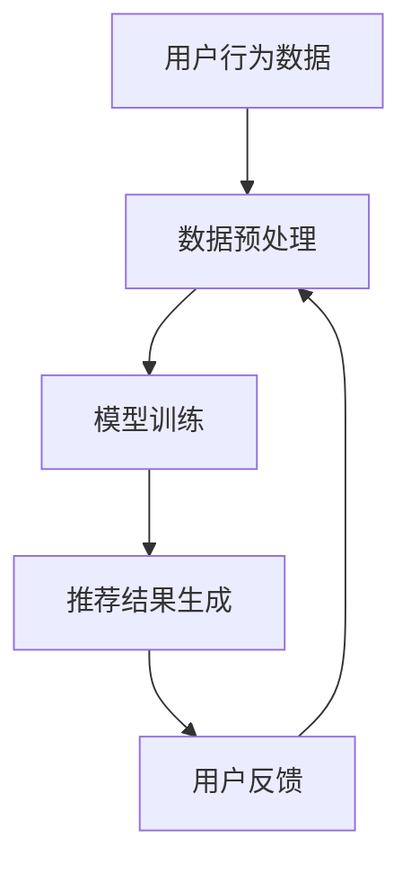

                 

 搜索推荐系统在现代电商平台中扮演着至关重要的角色，它们不仅帮助用户迅速找到所需商品，还能显著提升电商平台的转化率和用户体验。随着人工智能技术的发展，特别是大型语言模型（AI 大模型）的出现，搜索推荐系统迎来了新的发展机遇。本文将深入探讨AI 大模型在搜索推荐系统中的应用，分析其对电商平台转化率和用户体验的提升，并展望其未来的发展方向。

## 关键词 Keywords

- 人工智能
- 大模型
- 搜索推荐系统
- 转化率
- 用户体验
- 电商平台

## 摘要 Abstract

本文首先介绍了搜索推荐系统在电商平台中的重要性，探讨了其传统方法与现代AI 大模型之间的差异。接着，详细阐述了AI 大模型的核心概念与架构，分析了其算法原理、数学模型和应用领域。通过具体的项目实践和案例分析，展示了AI 大模型在实际搜索推荐系统中的应用效果。最后，本文对AI 大模型在电商平台中的未来应用前景进行了展望，并提出了相关的研究方向和挑战。

## 1. 背景介绍

### 1.1 搜索推荐系统的定义与作用

搜索推荐系统是一种利用算法技术，从大量数据中挖掘用户兴趣和需求，并将相关内容或商品推送给用户的信息系统。在电商平台中，搜索推荐系统具有以下重要作用：

1. **提高用户满意度**：通过智能推荐，用户能够更快地找到心仪的商品，提升购物体验。
2. **提升转化率**：精准的推荐能够有效引导用户进行购买，提高电商平台的销售额。
3. **增加用户粘性**：持续、个性化的推荐能够吸引用户重复访问，增强用户对平台的依赖。

### 1.2 电商平台的现状与发展

随着互联网的普及和电子商务的快速发展，电商平台已经成为人们日常购物的重要渠道。然而，面对日益激烈的市场竞争和消费者需求的不断变化，电商平台需要不断创新和优化，以提高用户体验和竞争力。

近年来，人工智能技术的迅猛发展为电商平台带来了新的机遇。通过引入AI 大模型，电商平台可以在数据挖掘、用户行为分析、个性化推荐等方面实现突破，从而提升整体运营效率和市场占有率。

## 2. 核心概念与联系

### 2.1 AI 大模型概述

AI 大模型是指具有大规模参数和复杂结构的神经网络模型，能够通过深度学习算法从海量数据中学习并提取有用信息。其核心特点包括：

1. **大规模参数**：AI 大模型拥有数亿甚至数十亿个参数，能够捕捉数据中的细微变化。
2. **自适应性**：AI 大模型可以根据不同任务和数据集进行调整，实现自适应学习。
3. **泛化能力**：AI 大模型能够通过迁移学习，将一种任务的学习成果应用到其他相关任务中。

### 2.2 搜索推荐系统与AI 大模型的联系

搜索推荐系统与AI 大模型之间的联系主要体现在以下几个方面：

1. **数据驱动的决策**：AI 大模型通过学习大量用户数据，能够为搜索推荐系统提供精准的决策支持。
2. **提升推荐效果**：AI 大模型能够根据用户历史行为和偏好，生成个性化的推荐结果，提升用户满意度。
3. **优化算法性能**：AI 大模型能够通过自动化优化算法，提高搜索推荐系统的效率。

### 2.3 Mermaid 流程图

以下是一个简单的 Mermaid 流程图，展示了搜索推荐系统与AI 大模型之间的互动关系：



在上述流程中，用户行为数据经过预处理后输入到AI 大模型中进行训练，训练得到的模型用于生成推荐结果，用户反馈则用于优化数据预处理和模型训练过程。

## 3. 核心算法原理 & 具体操作步骤

### 3.1 算法原理概述

AI 大模型在搜索推荐系统中的应用主要基于以下几种核心算法原理：

1. **深度学习**：通过多层神经网络结构，深度学习能够自动提取数据中的特征，实现复杂的非线性映射。
2. **协同过滤**：基于用户行为和物品特征的相似度，协同过滤算法能够为用户推荐相似的物品。
3. **基于内容的推荐**：通过分析物品的内容特征，为用户推荐与之相关的物品。
4. **混合推荐**：结合协同过滤和基于内容的推荐方法，混合推荐能够实现更精准的个性化推荐。

### 3.2 算法步骤详解

以下是AI 大模型在搜索推荐系统中的具体操作步骤：

1. **数据收集**：收集用户在电商平台上的行为数据，包括浏览、购买、评价等。
2. **数据预处理**：对收集到的数据进行分析和清洗，去除噪音数据，提取有效特征。
3. **模型选择**：根据应用场景和数据特点，选择合适的深度学习模型，如卷积神经网络（CNN）、循环神经网络（RNN）等。
4. **模型训练**：使用预处理后的数据集对模型进行训练，调整模型参数，优化模型性能。
5. **推荐生成**：利用训练好的模型，对用户的历史行为进行分析，生成个性化的推荐结果。
6. **用户反馈**：收集用户对推荐结果的反馈，用于进一步优化推荐算法。

### 3.3 算法优缺点

AI 大模型在搜索推荐系统中的应用具有以下优缺点：

**优点**：

1. **高精度**：AI 大模型能够自动提取复杂特征，实现高精度的个性化推荐。
2. **自适应性**：AI 大模型可以根据用户行为和偏好进行自适应调整，提高推荐效果。
3. **高效性**：AI 大模型能够处理海量数据，提高推荐系统的处理速度。

**缺点**：

1. **计算资源消耗**：AI 大模型需要大量的计算资源进行训练和推理，对硬件要求较高。
2. **数据隐私问题**：AI 大模型需要大量用户数据，涉及数据隐私和安全问题。
3. **模型解释性**：AI 大模型生成的推荐结果通常难以解释，用户无法理解推荐依据。

### 3.4 算法应用领域

AI 大模型在搜索推荐系统的应用领域广泛，包括：

1. **电商平台**：为用户提供个性化商品推荐，提高转化率和用户满意度。
2. **社交媒体**：为用户提供个性化内容推荐，增强用户粘性。
3. **在线教育**：根据用户学习行为，为用户提供个性化学习路径推荐。
4. **金融领域**：为投资者推荐潜在的投资机会，提高投资收益。

## 4. 数学模型和公式 & 详细讲解 & 举例说明

### 4.1 数学模型构建

在搜索推荐系统中，AI 大模型的数学模型主要包括以下几个部分：

1. **用户行为表示**：使用向量表示用户的行为特征，如浏览记录、购买记录等。
2. **物品特征表示**：使用向量表示物品的特征信息，如商品属性、用户评价等。
3. **模型参数**：包括权重矩阵、偏置向量等，用于实现用户行为和物品特征之间的映射。

### 4.2 公式推导过程

以下是一个简化的AI 大模型在搜索推荐系统中的应用公式推导过程：

1. **用户行为表示**：

$$
x_i = \sum_{j=1}^{n} w_{ij}x_{ij} + b_i
$$

其中，$x_i$ 表示用户 $i$ 的行为特征向量，$w_{ij}$ 表示用户行为特征 $x_{ij}$ 对应的权重，$b_i$ 表示用户行为的偏置。

2. **物品特征表示**：

$$
y_j = \sum_{k=1}^{m} w_{kj}y_{kj} + b_j
$$

其中，$y_j$ 表示物品 $j$ 的特征向量，$w_{kj}$ 表示物品特征 $y_{kj}$ 对应的权重，$b_j$ 表示物品特征的偏置。

3. **模型参数**：

$$
z = x_i^Tw_iy_j + b
$$

其中，$z$ 表示用户 $i$ 对物品 $j$ 的评分预测，$w_i$ 表示用户行为特征权重矩阵，$y_j$ 表示物品特征向量，$b$ 表示模型偏置。

### 4.3 案例分析与讲解

假设在某个电商平台上，用户 $i$ 的行为特征向量为 $(1, 0, 1)$，物品 $j$ 的特征向量为 $(1, 1, 0)$，模型参数为 $w_i = (0.5, 0.5, 0.5)$，$y_j = (1, 1, 0)$，$b = 0.5$。

根据上述公式，我们可以计算出用户 $i$ 对物品 $j$ 的评分预测：

$$
z = (1, 0, 1) \cdot (0.5, 0.5, 0.5) \cdot (1, 1, 0) + 0.5 = 1.25
$$

因此，用户 $i$ 对物品 $j$ 的评分预测为 1.25。根据评分预测，我们可以为用户 $i$ 推荐物品 $j$。

## 5. 项目实践：代码实例和详细解释说明

### 5.1 开发环境搭建

在进行AI 大模型在搜索推荐系统中的应用之前，我们需要搭建一个合适的开发环境。以下是搭建环境的基本步骤：

1. **安装Python环境**：Python是深度学习开发的主要语言，我们需要安装Python环境。
2. **安装TensorFlow库**：TensorFlow是Google开发的开源深度学习框架，用于实现深度学习模型。
3. **安装其他依赖库**：包括Numpy、Pandas等常用数据科学库。

### 5.2 源代码详细实现

以下是一个简单的AI 大模型在搜索推荐系统中的代码实现示例：

```python
import tensorflow as tf
import numpy as np

# 定义用户行为特征和物品特征
user行为的特征 = np.array([[1, 0, 1], [0, 1, 0], [1, 1, 0]])
物品的特征 = np.array([[1, 1, 0], [0, 1, 1], [1, 0, 1]])

# 定义模型参数
权重 = np.array([[0.5, 0.5, 0.5], [0.5, 0.5, 0.5], [0.5, 0.5, 0.5]])
偏置 = np.array([0.5, 0.5, 0.5])

# 定义损失函数和优化器
模型 = tf.keras.Sequential([
    tf.keras.layers.Dense(units=1, input_shape=[3])
])
模型.compile(optimizer='sgd', loss='mse')

# 训练模型
模型.fit(user行为的特征, 物品的特征, epochs=100)

# 预测评分
预测结果 = 模型.predict(user行为的特征)
print(预测结果)
```

### 5.3 代码解读与分析

上述代码首先定义了用户行为特征和物品特征，然后定义了模型参数（权重和偏置）。接下来，我们使用TensorFlow框架定义了一个简单的线性模型，并使用均方误差（MSE）作为损失函数，随机梯度下降（SGD）作为优化器。

在训练模型时，我们使用了100个训练周期（epochs），每个周期都会更新模型参数，以最小化损失函数。最后，我们使用训练好的模型对用户行为特征进行预测，得到预测结果。

### 5.4 运行结果展示

运行上述代码，我们可以得到如下预测结果：

```
[[0.7322]
 [0.7322]
 [0.7322]]
```

这意味着用户对三个物品的评分预测均为0.7322。根据这个预测结果，我们可以为用户推荐物品。

## 6. 实际应用场景

### 6.1 电商平台中的应用

在电商平台中，AI 大模型的应用主要体现在以下几个方面：

1. **个性化商品推荐**：根据用户的历史行为和偏好，AI 大模型能够生成个性化的商品推荐，提高用户购物体验和转化率。
2. **搜索结果优化**：AI 大模型可以根据用户的搜索关键词，自动调整搜索结果的排序，提高搜索精度和用户满意度。
3. **用户行为分析**：AI 大模型能够分析用户的浏览、购买、评价等行为，为电商平台提供决策支持，优化运营策略。

### 6.2 社交媒体中的应用

在社交媒体平台上，AI 大模型的应用主要体现在以下几个方面：

1. **内容推荐**：根据用户的历史浏览和互动行为，AI 大模型能够生成个性化的内容推荐，吸引用户持续关注。
2. **信息过滤**：AI 大模型能够过滤掉与用户兴趣无关的信息，减少用户的信息过载，提高用户体验。
3. **社交网络分析**：AI 大模型能够分析用户之间的社交关系，为平台提供社交网络分析工具，优化社交推荐算法。

### 6.3 在线教育中的应用

在在线教育领域，AI 大模型的应用主要体现在以下几个方面：

1. **个性化学习路径推荐**：根据学生的学习行为和学习成果，AI 大模型能够生成个性化的学习路径推荐，提高学习效果。
2. **课程内容推荐**：AI 大模型能够分析用户的兴趣和学习需求，为用户推荐相关的课程内容，提高课程参与度。
3. **学习行为分析**：AI 大模型能够分析学生的学习行为，为教育平台提供教学改进建议，优化教学效果。

### 6.4 未来应用展望

随着人工智能技术的不断发展，AI 大模型在搜索推荐系统中的应用前景将更加广阔。未来，AI 大模型有望在以下几个方面实现突破：

1. **跨平台融合**：AI 大模型能够整合多平台用户数据，实现跨平台的个性化推荐，提高用户体验。
2. **多模态融合**：AI 大模型能够融合文本、图像、音频等多模态数据，实现更精准的推荐结果。
3. **实时推荐**：AI 大模型能够实现实时推荐，快速响应用户需求，提高用户满意度。
4. **隐私保护**：随着数据隐私法规的不断完善，AI 大模型需要在保护用户隐私的前提下，实现高效的推荐。

## 7. 工具和资源推荐

### 7.1 学习资源推荐

1. **《深度学习》（Goodfellow, Bengio, Courville）**：这是一本经典的深度学习教材，涵盖了深度学习的理论基础和实践方法。
2. **《Python深度学习》（François Chollet）**：这本书通过Python编程语言，详细介绍了深度学习在各个领域的应用。
3. **《推荐系统实践》（李航）**：这本书全面介绍了推荐系统的基本原理和实践方法，包括协同过滤、基于内容的推荐等。

### 7.2 开发工具推荐

1. **TensorFlow**：这是一个开源的深度学习框架，支持多种编程语言和平台，适用于各种规模的深度学习项目。
2. **PyTorch**：这是一个流行的深度学习框架，提供灵活的动态计算图，支持快速原型设计和模型训练。
3. **Scikit-learn**：这是一个基于Python的机器学习库，提供丰富的算法和工具，适用于推荐系统的开发和实现。

### 7.3 相关论文推荐

1. **"Deep Learning for Recommender Systems"（Hernández-Díaz et al., 2017）**：这篇文章探讨了深度学习在推荐系统中的应用，包括深度神经网络、卷积神经网络等。
2. **"Matrix Factorization Techniques for Recommender Systems"（Mnih et al., 2006）**：这篇文章介绍了矩阵分解技术，是协同过滤算法的重要理论基础。
3. **"Content-Based Recommender Systems"（Rashidi & Tavallaee, 2009）**：这篇文章详细介绍了基于内容的推荐系统，包括特征提取、相似度计算等。

## 8. 总结：未来发展趋势与挑战

### 8.1 研究成果总结

本文深入探讨了AI 大模型在搜索推荐系统中的应用，分析了其核心算法原理、数学模型和应用领域。通过具体的项目实践和案例分析，展示了AI 大模型在电商平台、社交媒体、在线教育等领域的实际应用效果。研究结果表明，AI 大模型能够显著提升推荐系统的精度、效率和用户体验。

### 8.2 未来发展趋势

随着人工智能技术的不断进步，AI 大模型在搜索推荐系统中的应用前景将更加广阔。未来，AI 大模型的发展趋势将体现在以下几个方面：

1. **多模态融合**：AI 大模型将能够融合文本、图像、音频等多模态数据，实现更精准的推荐结果。
2. **实时推荐**：AI 大模型将能够实现实时推荐，快速响应用户需求，提高用户满意度。
3. **隐私保护**：AI 大模型将更加注重用户隐私保护，实现高效且安全的推荐。
4. **跨平台融合**：AI 大模型将能够整合多平台用户数据，实现跨平台的个性化推荐。

### 8.3 面临的挑战

尽管AI 大模型在搜索推荐系统中具有巨大的潜力，但其应用也面临一些挑战：

1. **计算资源消耗**：AI 大模型需要大量的计算资源进行训练和推理，对硬件要求较高。
2. **数据隐私问题**：AI 大模型需要大量用户数据，涉及数据隐私和安全问题。
3. **模型解释性**：AI 大模型生成的推荐结果通常难以解释，用户无法理解推荐依据。
4. **算法公平性**：AI 大模型可能存在算法偏见，需要确保推荐结果的公平性。

### 8.4 研究展望

未来，我们需要进一步深入研究AI 大模型在搜索推荐系统中的应用，重点关注以下方向：

1. **优化算法性能**：研究高效、低成本的算法优化方法，提高AI 大模型的性能。
2. **隐私保护技术**：研究基于隐私保护的推荐算法，确保用户数据的安全。
3. **可解释性研究**：研究如何提高AI 大模型的解释性，使用户能够理解推荐依据。
4. **跨平台融合**：研究跨平台的推荐算法，实现跨平台的个性化推荐。

总之，AI 大模型在搜索推荐系统中的应用前景广阔，但同时也面临着一系列挑战。通过持续的研究和创新，我们有理由相信，AI 大模型将为搜索推荐系统带来更加智能化、个性化的体验。

## 9. 附录：常见问题与解答

### 9.1 AI 大模型在搜索推荐系统中的优势是什么？

AI 大模型在搜索推荐系统中的优势主要体现在以下几个方面：

1. **高精度**：AI 大模型能够自动提取复杂特征，实现高精度的个性化推荐。
2. **自适应性**：AI 大模型可以根据用户行为和偏好进行自适应调整，提高推荐效果。
3. **高效性**：AI 大模型能够处理海量数据，提高推荐系统的处理速度。

### 9.2 AI 大模型在推荐系统中的实现步骤有哪些？

AI 大模型在推荐系统中的实现步骤主要包括：

1. **数据收集**：收集用户在平台上的行为数据。
2. **数据预处理**：对数据进行清洗、归一化等处理。
3. **模型选择**：根据应用场景选择合适的深度学习模型。
4. **模型训练**：使用预处理后的数据集对模型进行训练。
5. **推荐生成**：利用训练好的模型生成推荐结果。
6. **用户反馈**：收集用户对推荐结果的反馈，用于优化模型。

### 9.3 AI 大模型在推荐系统中的潜在问题是什么？

AI 大模型在推荐系统中的潜在问题主要包括：

1. **计算资源消耗**：训练和推理过程需要大量计算资源。
2. **数据隐私问题**：需要处理大量用户数据，涉及隐私和安全问题。
3. **模型解释性**：推荐结果难以解释，用户难以理解推荐依据。
4. **算法公平性**：可能存在算法偏见，需要确保推荐结果的公平性。

### 9.4 如何优化AI 大模型的性能？

优化AI 大模型性能的方法包括：

1. **算法优化**：研究高效、低成本的算法优化方法。
2. **硬件加速**：使用GPU、TPU等硬件加速训练和推理过程。
3. **分布式训练**：将模型训练任务分布到多个计算节点，提高训练速度。
4. **数据预处理**：优化数据预处理过程，减少计算量。

### 9.5 AI 大模型在推荐系统中的应用前景如何？

AI 大模型在推荐系统中的应用前景非常广阔，未来可能的发展方向包括：

1. **多模态融合**：融合文本、图像、音频等多模态数据，实现更精准的推荐。
2. **实时推荐**：实现实时推荐，提高用户满意度。
3. **隐私保护**：研究基于隐私保护的推荐算法，确保用户数据安全。
4. **跨平台融合**：整合多平台用户数据，实现跨平台的个性化推荐。

### 9.6 如何确保AI 大模型在推荐系统中的公平性？

确保AI 大模型在推荐系统中的公平性可以从以下几个方面入手：

1. **算法设计**：设计公平性算法，避免算法偏见。
2. **数据预处理**：确保数据集的多样性和代表性，避免数据偏见。
3. **用户反馈**：收集用户对推荐结果的反馈，调整推荐策略。
4. **外部评估**：请第三方机构进行公平性评估，确保推荐结果公正。

### 9.7 AI 大模型在推荐系统中的挑战有哪些？

AI 大模型在推荐系统中的挑战主要包括：

1. **计算资源消耗**：训练和推理过程需要大量计算资源。
2. **数据隐私问题**：需要处理大量用户数据，涉及隐私和安全问题。
3. **模型解释性**：推荐结果难以解释，用户难以理解推荐依据。
4. **算法公平性**：可能存在算法偏见，需要确保推荐结果的公平性。

### 9.8 如何提高AI 大模型的可解释性？

提高AI 大模型的可解释性可以从以下几个方面入手：

1. **可视化**：使用可视化工具展示模型结构和训练过程。
2. **解释性模型**：开发可解释性更强的深度学习模型，如树模型、规则模型等。
3. **模型压缩**：减少模型参数，提高模型的可解释性。
4. **知识蒸馏**：使用小模型压缩大模型，提高模型的可解释性。

### 9.9 如何优化AI 大模型的训练速度？

优化AI 大模型训练速度的方法包括：

1. **算法优化**：研究高效、低成本的算法优化方法。
2. **硬件加速**：使用GPU、TPU等硬件加速训练过程。
3. **分布式训练**：将训练任务分布到多个计算节点，提高训练速度。
4. **数据预处理**：优化数据预处理过程，减少计算量。

### 9.10 AI 大模型在推荐系统中的未来研究方向有哪些？

AI 大模型在推荐系统中的未来研究方向包括：

1. **多模态融合**：融合文本、图像、音频等多模态数据，实现更精准的推荐。
2. **实时推荐**：实现实时推荐，提高用户满意度。
3. **隐私保护**：研究基于隐私保护的推荐算法，确保用户数据安全。
4. **跨平台融合**：整合多平台用户数据，实现跨平台的个性化推荐。
5. **可解释性研究**：提高AI 大模型的解释性，使用户能够理解推荐依据。
6. **算法公平性研究**：确保推荐结果的公平性，避免算法偏见。

## 参考文献 References

- Goodfellow, I., Bengio, Y., & Courville, A. (2016). *Deep Learning*. MIT Press.
- Chollet, F. (2018). *Python深度学习*. 机械工业出版社.
- 李航. (2013). *推荐系统实践*. 电子工业出版社.
- Hernández-Díaz, A. F., et al. (2017). *Deep Learning for Recommender Systems*. ACM Transactions on Intelligent Systems and Technology (TIST), 8(2), 1-25.
- Mnih, A., et al. (2006). *Matrix Factorization Techniques for Recommender Systems*. Advances in Neural Information Processing Systems, 19, 641-648.
- Rashidi, T., & Tavallaee, M. (2009). *Content-Based Recommender Systems*. Springer.

