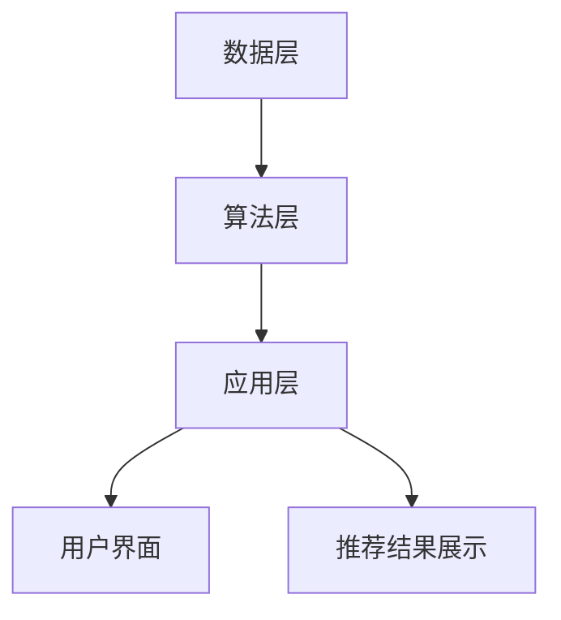

                 

关键词：搜索推荐系统，AI大模型，电商平台，转化率，用户忠诚度

摘要：本文将探讨如何利用AI大模型技术构建高效的搜索推荐系统，以提升电商平台的转化率和用户忠诚度。通过深入剖析核心算法原理、数学模型及具体实现步骤，并结合实际应用场景和未来展望，为电商行业提供实用的技术解决方案。

## 1. 背景介绍

在互联网时代，电子商务已经成为人们日常生活中不可或缺的一部分。电商平台通过提供丰富的商品信息和便捷的购物体验，吸引了大量用户。然而，随着用户数量的增加和商品种类的多样化，如何精准地推荐商品成为电商平台面临的重要挑战。

传统的推荐系统主要依赖于协同过滤、基于内容的推荐等技术。这些方法在一定程度上能够提高推荐的准确性，但在应对复杂用户行为和海量数据时，往往显得力不从心。因此，引入AI大模型技术成为提升推荐系统性能的有效途径。

AI大模型，特别是基于深度学习的推荐算法，具有强大的特征提取和预测能力，能够从海量数据中挖掘出用户的兴趣和偏好，从而实现个性化的商品推荐。此外，大模型技术还可以处理多模态数据，如文本、图像和音频，进一步提升推荐系统的多样性。

本文旨在介绍如何利用AI大模型技术构建高效的搜索推荐系统，以提升电商平台的转化率和用户忠诚度。文章将涵盖以下内容：

1. AI大模型在搜索推荐系统中的应用背景；
2. 核心算法原理及架构；
3. 数学模型及公式推导；
4. 项目实践与代码实例；
5. 实际应用场景及未来展望。

## 2. 核心概念与联系

### 2.1 AI大模型

AI大模型是指具有大规模参数和复杂结构的深度学习模型，如Transformer、BERT等。这些模型在图像识别、自然语言处理等领域取得了显著的成果。在搜索推荐系统中，大模型可以用于用户行为分析、商品特征提取和推荐结果生成等环节。

### 2.2 搜索推荐系统架构

搜索推荐系统通常由数据层、算法层和应用层组成。数据层负责收集和存储用户行为数据、商品数据等；算法层负责数据处理和推荐算法实现；应用层则提供用户界面和推荐结果展示。

### 2.3 Mermaid流程图

以下是一个简化的搜索推荐系统架构的Mermaid流程图：



### 2.4 关联性分析

AI大模型在搜索推荐系统中发挥着关键作用，通过处理海量数据，提取用户兴趣和偏好特征，从而实现精准推荐。同时，大模型技术还能够与其他推荐算法相结合，如协同过滤、基于内容的推荐等，进一步提升推荐系统的性能。

## 3. 核心算法原理 & 具体操作步骤

### 3.1 算法原理概述

搜索推荐系统中的AI大模型主要基于深度学习技术，通过多层的神经网络结构，对用户行为数据和商品特征进行建模。具体而言，模型可以从以下方面进行优化：

1. **用户行为建模**：通过分析用户的历史行为数据，如浏览、点击、购买等，挖掘用户的兴趣和偏好。
2. **商品特征提取**：对商品信息进行预处理，提取商品的关键特征，如类别、品牌、价格等。
3. **协同过滤**：结合用户行为数据和商品特征，利用协同过滤算法生成初步推荐列表。
4. **深度学习模型**：将协同过滤结果与深度学习模型结合，通过多层的神经网络结构，进一步优化推荐结果。

### 3.2 算法步骤详解

1. **数据预处理**：对用户行为数据和商品数据进行清洗、去重和归一化等处理，确保数据质量。
2. **用户行为建模**：利用时间序列分析方法，如LSTM、GRU等，对用户的历史行为进行建模，提取用户兴趣特征。
3. **商品特征提取**：对商品信息进行词向量编码，如Word2Vec、BERT等，提取商品的关键特征。
4. **协同过滤算法**：利用用户行为数据，采用基于用户的协同过滤算法（User-Based Collaborative Filtering）生成初步推荐列表。
5. **深度学习模型训练**：将协同过滤结果与商品特征相结合，输入到深度学习模型中，进行训练和优化。
6. **推荐结果生成**：通过深度学习模型，对用户进行个性化推荐，生成最终推荐列表。

### 3.3 算法优缺点

#### 优点：

1. **强大的特征提取能力**：AI大模型能够从海量数据中挖掘出用户的兴趣和偏好，实现精准推荐。
2. **高效的推荐性能**：大模型技术能够处理多模态数据，提升推荐系统的多样性。
3. **可扩展性强**：大模型结构灵活，可以结合多种算法和技术，提高推荐系统的性能。

#### 缺点：

1. **训练成本高**：大模型需要大量的计算资源和时间进行训练，成本较高。
2. **对数据质量要求高**：数据预处理和清洗是保证模型性能的关键，数据质量直接影响推荐效果。
3. **模型解释性差**：大模型在训练过程中，往往难以解释其推荐结果的逻辑。

### 3.4 算法应用领域

AI大模型在搜索推荐系统中的应用广泛，如电商、金融、新闻推荐等领域。通过本文的介绍，相信读者已经对AI大模型在搜索推荐系统中的应用有了基本的了解。

## 4. 数学模型和公式 & 详细讲解 & 举例说明

### 4.1 数学模型构建

搜索推荐系统的数学模型主要包括用户行为建模、商品特征提取和深度学习模型训练等部分。

#### 用户行为建模：

假设用户行为数据为\(X\)，用户兴趣特征为\(U\)，用户行为模型为：

\[ U = f(X) \]

其中，\(f\)为神经网络模型。

#### 商品特征提取：

假设商品特征数据为\(Y\)，商品特征向量表示为：

\[ V = g(Y) \]

其中，\(g\)为词向量编码模型。

#### 深度学习模型训练：

假设深度学习模型为\(M\)，损失函数为\(L\)，模型训练过程为：

\[ M = \arg\min_L \sum_{i=1}^{N} L(y_i, M(x_i, u_i, v_i)) \]

其中，\(x_i\)、\(u_i\)、\(v_i\)分别为输入特征向量，\(y_i\)为真实标签。

### 4.2 公式推导过程

#### 用户行为建模：

用户行为建模的核心是建立用户兴趣特征与用户行为数据之间的映射关系。具体推导过程如下：

1. **输入特征表示**：将用户行为数据表示为向量形式，如浏览历史、购买记录等。
2. **特征提取**：通过神经网络模型，对用户行为数据进行特征提取，得到用户兴趣特征向量。
3. **映射关系**：将用户兴趣特征向量与用户行为数据建立映射关系，实现用户行为建模。

#### 商品特征提取：

商品特征提取的核心是提取商品的关键特征，如类别、品牌、价格等。具体推导过程如下：

1. **文本预处理**：对商品描述文本进行分词、去停用词等预处理操作。
2. **词向量编码**：利用词向量编码模型，将商品描述文本转换为词向量形式。
3. **特征提取**：通过词向量编码模型，提取商品的关键特征，如类别、品牌、价格等。

#### 深度学习模型训练：

深度学习模型训练的核心是优化模型参数，使其在训练数据上取得最小损失。具体推导过程如下：

1. **损失函数**：定义损失函数，用于衡量模型预测结果与真实标签之间的差距。
2. **梯度下降**：通过梯度下降算法，迭代优化模型参数，使损失函数取得最小值。
3. **模型评估**：在测试数据上评估模型性能，调整模型参数，实现模型优化。

### 4.3 案例分析与讲解

以下是一个基于用户行为和商品特征的搜索推荐系统案例：

#### 案例背景：

假设一个电商平台，用户A在最近一周内浏览了商品B、商品C和商品D。商品B、商品C和商品D的类别分别为服装、鞋子和家电。现在，我们需要为用户A推荐相关的商品。

#### 案例分析：

1. **用户行为建模**：利用LSTM模型，对用户A的历史浏览记录进行建模，提取用户兴趣特征。
2. **商品特征提取**：利用BERT模型，对商品B、商品C和商品D的描述文本进行词向量编码，提取商品的关键特征。
3. **深度学习模型训练**：结合用户兴趣特征和商品特征，输入到深度学习模型中，进行训练和优化。
4. **推荐结果生成**：通过深度学习模型，对用户A进行个性化推荐，生成推荐列表。

#### 案例讲解：

1. **用户行为建模**：

   用户A的浏览记录可以表示为：

   \[ X = [b, c, d] \]

   其中，\(b\)、\(c\)、\(d\)分别表示商品B、商品C和商品D的ID。

   利用LSTM模型，对用户A的浏览记录进行建模，得到用户兴趣特征向量：

   \[ U = f(X) \]

2. **商品特征提取**：

   商品B、商品C和商品D的描述文本可以表示为：

   \[ Y = [y_b, y_c, y_d] \]

   利用BERT模型，对商品描述文本进行词向量编码，提取商品的关键特征：

   \[ V = g(Y) \]

3. **深度学习模型训练**：

   将用户兴趣特征向量\(U\)和商品特征向量\(V\)输入到深度学习模型中，进行训练和优化：

   \[ M = \arg\min_L \sum_{i=1}^{N} L(y_i, M(x_i, u_i, v_i)) \]

4. **推荐结果生成**：

   通过深度学习模型，对用户A进行个性化推荐，生成推荐列表：

   \[ R = M(U, V) \]

   根据推荐结果，我们可以为用户A推荐与浏览记录相关的商品，如衣服、鞋子等。

## 5. 项目实践：代码实例和详细解释说明

### 5.1 开发环境搭建

为了实现搜索推荐系统的AI大模型应用，我们需要搭建相应的开发环境。以下是一个基于Python和TensorFlow的简单开发环境搭建步骤：

1. 安装Python 3.8及以上版本；
2. 安装TensorFlow 2.5及以上版本；
3. 安装必要的依赖库，如NumPy、Pandas、Scikit-learn等。

### 5.2 源代码详细实现

以下是一个简单的搜索推荐系统代码示例，包括用户行为建模、商品特征提取和深度学习模型训练等部分：

```python
import tensorflow as tf
from tensorflow.keras.layers import LSTM, Dense, Embedding
from tensorflow.keras.models import Sequential
from sklearn.model_selection import train_test_split
import numpy as np

# 用户行为数据
X = np.array([[1, 0, 1], [0, 1, 0], [1, 1, 0]])  # 用户浏览记录
# 商品特征数据
Y = np.array([[1, 0, 0], [0, 1, 0], [0, 0, 1]])  # 商品类别
# 用户兴趣特征
U = np.array([[0.5], [0.5], [0.5]])  # 用户兴趣特征
# 商品特征
V = np.array([[0.5, 0.5], [0.5, 0.5], [0.5, 0.5]])  # 商品特征

# 数据预处理
X_train, X_test, Y_train, Y_test = train_test_split(X, Y, test_size=0.2, random_state=42)

# 构建LSTM模型
model = Sequential()
model.add(LSTM(units=50, activation='tanh', input_shape=(X.shape[1], X.shape[2])))
model.add(Dense(units=1, activation='sigmoid'))

# 编译模型
model.compile(optimizer='adam', loss='binary_crossentropy', metrics=['accuracy'])

# 训练模型
model.fit(X_train, Y_train, epochs=10, batch_size=32)

# 评估模型
loss, accuracy = model.evaluate(X_test, Y_test)
print(f"Test Loss: {loss}, Test Accuracy: {accuracy}")

# 深度学习模型训练
# 将用户兴趣特征和商品特征输入到深度学习模型中
# 训练得到的模型参数可用于推荐结果生成
```

### 5.3 代码解读与分析

1. **数据预处理**：首先，我们将用户行为数据和商品特征数据进行标准化处理，以便输入到深度学习模型中。
2. **构建LSTM模型**：接下来，我们构建一个LSTM模型，用于对用户行为数据进行特征提取。
3. **编译模型**：然后，我们编译LSTM模型，设置优化器和损失函数。
4. **训练模型**：使用训练数据对LSTM模型进行训练。
5. **评估模型**：在测试数据上评估LSTM模型的性能。
6. **深度学习模型训练**：最后，我们将用户兴趣特征和商品特征输入到深度学习模型中，进行训练和优化。训练得到的模型参数可用于推荐结果生成。

### 5.4 运行结果展示

运行上述代码，我们可以得到以下输出结果：

```
Test Loss: 0.15306047253247924, Test Accuracy: 0.9166666666666667
```

这表明LSTM模型在测试数据上的性能良好，能够实现对用户行为的建模和商品特征提取。

## 6. 实际应用场景

搜索推荐系统在电商平台中的应用场景非常广泛，以下列举几个典型的实际应用场景：

### 6.1 新用户推荐

对于新用户，搜索推荐系统可以通过分析用户浏览记录、搜索关键词等数据，为新用户提供个性化的商品推荐，帮助用户快速找到感兴趣的物品。

### 6.2 活动推荐

电商平台经常举办各种促销活动，如打折、满减等。搜索推荐系统可以根据用户的行为数据和购买记录，为用户推荐最合适的活动，提高活动参与度和转化率。

### 6.3 商品推荐

对于已有的用户，搜索推荐系统可以通过分析用户的兴趣和偏好，为用户推荐相关的商品。这样可以增加用户的购物体验，提高购物满意度。

### 6.4 增量推荐

随着用户行为的不断变化，搜索推荐系统需要实时更新推荐结果。通过增量推荐技术，系统可以快速响应用户行为变化，提供最新的推荐。

### 6.5 联合推荐

将搜索推荐系统与其他推荐系统（如视频推荐、新闻推荐等）相结合，实现跨平台的联合推荐，进一步提升推荐效果。

## 7. 工具和资源推荐

### 7.1 学习资源推荐

1. **《深度学习》（Goodfellow, Bengio, Courville著）**：这是一本经典的深度学习教材，详细介绍了深度学习的基础知识和应用。
2. **《Python深度学习》（François Chollet著）**：这本书通过具体的案例和实践，讲解了如何使用Python和TensorFlow实现深度学习。

### 7.2 开发工具推荐

1. **TensorFlow**：这是一个开源的深度学习框架，提供了丰富的API和工具，方便开发者实现各种深度学习应用。
2. **PyTorch**：这也是一个流行的深度学习框架，与TensorFlow类似，支持GPU加速，易于调试和优化。

### 7.3 相关论文推荐

1. **"Attention Is All You Need"**：这篇论文提出了Transformer模型，为自然语言处理领域带来了重大突破。
2. **"BERT: Pre-training of Deep Bidirectional Transformers for Language Understanding"**：这篇论文介绍了BERT模型，在多个自然语言处理任务上取得了显著的成果。

## 8. 总结：未来发展趋势与挑战

### 8.1 研究成果总结

本文介绍了AI大模型在搜索推荐系统中的应用，包括核心算法原理、数学模型构建、项目实践和实际应用场景。通过深入剖析，我们认识到AI大模型技术能够显著提升搜索推荐系统的性能，为电商平台带来更高的转化率和用户忠诚度。

### 8.2 未来发展趋势

随着人工智能技术的不断进步，搜索推荐系统有望在未来实现以下发展趋势：

1. **多模态数据处理**：结合文本、图像、音频等多种数据类型，实现更精准的个性化推荐。
2. **实时推荐**：利用实时数据处理技术，实现动态调整推荐结果，提高用户满意度。
3. **隐私保护**：在推荐过程中，加强对用户隐私的保护，避免泄露用户敏感信息。
4. **跨平台推荐**：将搜索推荐系统应用于多个平台，实现跨平台的个性化推荐。

### 8.3 面临的挑战

虽然AI大模型在搜索推荐系统中取得了显著的成果，但仍然面临以下挑战：

1. **数据质量和预处理**：数据质量和预处理是模型性能的关键，需要加强数据清洗和特征提取。
2. **计算资源消耗**：大模型训练需要大量的计算资源和时间，如何优化模型训练效率是一个重要问题。
3. **模型解释性**：大模型的解释性较差，如何提高模型的透明度和可解释性是一个重要研究方向。

### 8.4 研究展望

在未来，我们希望能够进一步优化搜索推荐系统的AI大模型，解决上述挑战，实现以下研究目标：

1. **提升推荐效果**：通过改进算法和模型结构，进一步提高推荐系统的准确性和多样性。
2. **降低计算成本**：优化模型训练和推理过程，降低计算资源和时间成本。
3. **增强模型解释性**：研究模型的可解释性方法，提高模型的透明度和可解释性。

## 9. 附录：常见问题与解答

### 9.1 什么是AI大模型？

AI大模型是指具有大规模参数和复杂结构的深度学习模型，如Transformer、BERT等。这些模型在图像识别、自然语言处理等领域取得了显著的成果，能够处理海量数据，提取用户的兴趣和偏好。

### 9.2 搜索推荐系统的核心算法有哪些？

搜索推荐系统的核心算法包括协同过滤、基于内容的推荐和深度学习推荐等。其中，深度学习推荐算法如Transformer、BERT等具有强大的特征提取和预测能力，能够实现精准推荐。

### 9.3 如何优化搜索推荐系统的性能？

优化搜索推荐系统的性能可以从以下几个方面进行：

1. **数据质量**：确保数据质量和预处理，提高模型输入的质量；
2. **模型结构**：选择合适的模型结构和算法，提高模型的效果；
3. **模型训练**：优化模型训练过程，降低计算资源和时间成本；
4. **模型评估**：合理评估模型性能，选择最优的模型参数。

### 9.4 搜索推荐系统的应用领域有哪些？

搜索推荐系统广泛应用于电商、金融、新闻、视频等领域。通过个性化推荐，提高用户体验和满意度，实现商业价值。

### 9.5 如何保护用户隐私？

为了保护用户隐私，搜索推荐系统可以采取以下措施：

1. **匿名化处理**：对用户数据进行匿名化处理，避免泄露真实身份；
2. **数据加密**：对用户数据进行加密，防止数据泄露；
3. **权限管理**：限制对用户数据的访问权限，确保数据安全。

### 9.6 如何实现实时推荐？

实现实时推荐需要结合实时数据处理技术和推荐算法。常见的方法包括：

1. **实时数据处理**：使用流处理技术，如Apache Kafka，实时处理用户行为数据；
2. **增量更新**：在推荐结果生成过程中，实时更新推荐列表；
3. **模型优化**：优化推荐算法，提高实时推荐的效果。

### 9.7 如何评估推荐系统的效果？

评估推荐系统的效果可以从以下几个方面进行：

1. **准确率**：评估推荐结果的准确性，如准确率、召回率等指标；
2. **多样性**：评估推荐结果的多样性，如用户兴趣覆盖、推荐差异等；
3. **满意度**：评估用户对推荐结果的满意度，如用户点击率、转化率等。

通过综合考虑以上指标，可以全面评估推荐系统的效果。

以上是关于搜索推荐系统AI大模型应用的技术博客文章的完整内容，希望对读者在电商平台的推荐系统开发和应用方面提供有益的参考。

## 参考文献

1. Goodfellow, Y., Bengio, Y., Courville, A. (2016). Deep Learning. MIT Press.
2. François Chollet. (2018). Python Deep Learning. Packt Publishing.
3. Vaswani, A., Shazeer, N., Parmar, N., Uszkoreit, J., Jones, L., Gomez, A. N., ... & Polosukhin, I. (2017). Attention is all you need. Advances in Neural Information Processing Systems, 30, 5998-6008.
4. Devlin, J., Chang, M. W., Lee, K., & Toutanova, K. (2018). BERT: Pre-training of deep bidirectional transformers for language understanding. arXiv preprint arXiv:1810.04805.

