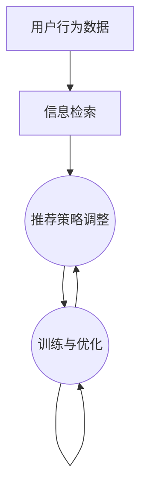

                 

关键词：搜索推荐系统、AI大模型、电商平台、核心竞争力、可持续发展

摘要：本文旨在探讨搜索推荐系统中AI大模型融合的重要性及其对电商平台核心竞争力的影响，通过分析核心概念、算法原理、数学模型及实际应用，揭示其在电商平台中的潜在价值与未来发展方向。

## 1. 背景介绍

在数字化时代，电商平台已成为全球商业活动的重要组成部分。随着用户需求的多样化和市场竞争的加剧，如何提高用户满意度和提升运营效率成为电商平台亟待解决的问题。搜索推荐系统作为一种智能化的解决方案，被广泛应用于电商平台中，以提供个性化的商品推荐和服务。

近年来，人工智能（AI）技术的发展为搜索推荐系统带来了新的机遇。特别是AI大模型的兴起，如深度学习、自然语言处理、强化学习等，使得搜索推荐系统具备了更强大的数据处理能力和预测能力。本文将深入探讨AI大模型在搜索推荐系统中的应用，分析其对电商平台核心竞争力的影响，并探讨其在可持续发展方面的潜力。

## 2. 核心概念与联系

### 2.1. 搜索推荐系统的基本概念

搜索推荐系统是一种基于用户行为数据和信息检索技术的系统，旨在为用户提供个性化的商品推荐服务。其核心概念包括：

- **用户行为数据**：用户在电商平台上的浏览、搜索、购买等行为数据。
- **信息检索**：利用搜索算法和技术，帮助用户快速找到所需商品。
- **个性化推荐**：基于用户历史行为和兴趣偏好，为用户提供个性化的商品推荐。

### 2.2. AI大模型的基本概念

AI大模型是指具有海量参数和复杂结构的机器学习模型，如深度神经网络、自然语言处理模型、图模型等。其核心特点包括：

- **海量数据训练**：通过大规模数据集进行训练，提高模型的泛化能力。
- **复杂结构设计**：采用多层神经网络、图神经网络等复杂结构，增强模型的表征能力。
- **强大预测能力**：利用先进的优化算法和训练技巧，实现高精度的预测。

### 2.3. 搜索推荐系统中AI大模型的应用

AI大模型在搜索推荐系统中的应用主要体现在以下几个方面：

- **用户行为预测**：利用深度学习模型，预测用户的购买意图和行为模式。
- **商品推荐**：通过自然语言处理模型，分析用户搜索意图和商品描述，实现精准推荐。
- **个性化服务**：结合强化学习模型，根据用户反馈不断调整推荐策略，提高用户满意度。

### 2.4. Mermaid 流程图



## 3. 核心算法原理 & 具体操作步骤

### 3.1. 算法原理概述

AI大模型在搜索推荐系统中的应用主要基于深度学习和自然语言处理技术。其核心算法原理包括：

- **深度学习**：通过多层神经网络对用户行为数据进行建模和预测。
- **自然语言处理**：利用词向量、序列模型等技术，对用户搜索意图和商品描述进行理解。
- **强化学习**：根据用户反馈，动态调整推荐策略，提高用户满意度。

### 3.2. 算法步骤详解

1. **数据预处理**：
   - 收集用户行为数据，如浏览记录、搜索记录、购买记录等。
   - 对数据集进行清洗和预处理，如去重、去噪声、归一化等。

2. **特征工程**：
   - 提取用户行为数据中的关键特征，如用户兴趣、购买频率、浏览时长等。
   - 利用词嵌入技术，将商品描述转化为向量表示。

3. **模型训练**：
   - 构建深度神经网络模型，如卷积神经网络（CNN）或循环神经网络（RNN）。
   - 使用训练数据集，对模型进行训练和优化。

4. **推荐策略调整**：
   - 利用强化学习算法，根据用户反馈，动态调整推荐策略。
   - 优化推荐结果，提高用户满意度。

### 3.3. 算法优缺点

**优点**：

- **高精度预测**：利用深度学习和自然语言处理技术，实现高精度的用户行为预测和商品推荐。
- **个性化服务**：根据用户兴趣和购买历史，提供个性化的推荐服务。
- **实时调整**：利用强化学习算法，实现实时调整推荐策略，提高用户满意度。

**缺点**：

- **数据依赖性**：算法性能高度依赖用户行为数据的质量和多样性。
- **计算成本高**：深度学习模型的训练和优化需要大量的计算资源和时间。

### 3.4. 算法应用领域

AI大模型在搜索推荐系统的应用领域包括：

- **电商平台**：为用户提供个性化的商品推荐，提高用户满意度。
- **社交媒体**：根据用户兴趣，推荐感兴趣的内容和好友。
- **在线教育**：根据学生学习行为，推荐合适的学习资源和课程。

## 4. 数学模型和公式 & 详细讲解 & 举例说明

### 4.1. 数学模型构建

在搜索推荐系统中，常用的数学模型包括深度学习模型、自然语言处理模型和强化学习模型。以下分别介绍这些模型的数学模型构建。

#### 4.1.1. 深度学习模型

深度学习模型通常采用多层神经网络结构，其数学模型可以表示为：

$$
y = \sigma(W_1 \cdot x + b_1)
$$

其中，$y$ 表示输出，$\sigma$ 表示激活函数，$W_1$ 表示权重矩阵，$x$ 表示输入，$b_1$ 表示偏置。

#### 4.1.2. 自然语言处理模型

自然语言处理模型常用词嵌入（word embedding）和序列模型（sequence model）来表示。其中，词嵌入的数学模型可以表示为：

$$
\text{vec}(w) = \text{embedding\_weight} \cdot w
$$

其中，$\text{vec}(w)$ 表示词向量，$\text{embedding\_weight}$ 表示词嵌入权重。

序列模型的数学模型可以表示为：

$$
y_t = \sigma(W_2 \cdot [h_{t-1}, x_t] + b_2)
$$

其中，$y_t$ 表示当前时间步的输出，$h_{t-1}$ 表示前一时刻的隐藏状态，$x_t$ 表示当前时间步的输入，$W_2$ 表示权重矩阵，$b_2$ 表示偏置。

#### 4.1.3. 强化学习模型

强化学习模型常用的数学模型是马尔可夫决策过程（MDP），其数学模型可以表示为：

$$
Q(s, a) = r(s, a) + \gamma \max_a' Q(s', a')
$$

其中，$Q(s, a)$ 表示在状态 $s$ 下采取行动 $a$ 的期望回报，$r(s, a)$ 表示在状态 $s$ 下采取行动 $a$ 的即时回报，$\gamma$ 表示折扣因子，$s'$ 表示下一状态，$a'$ 表示下一行动。

### 4.2. 公式推导过程

以下以深度学习模型中的损失函数推导为例，介绍公式推导过程。

#### 4.2.1. 损失函数

深度学习模型的损失函数用于衡量模型预测值与真实值之间的差距。常用的损失函数包括均方误差（MSE）和交叉熵损失（Cross-Entropy Loss）。

均方误差损失函数的公式为：

$$
L_{MSE} = \frac{1}{2} \sum_{i=1}^{N} (y_i - \hat{y}_i)^2
$$

其中，$y_i$ 表示真实值，$\hat{y}_i$ 表示预测值，$N$ 表示样本数量。

交叉熵损失函数的公式为：

$$
L_{CE} = -\sum_{i=1}^{N} y_i \log(\hat{y}_i)
$$

其中，$y_i$ 表示真实值，$\hat{y}_i$ 表示预测值。

#### 4.2.2. 损失函数推导

以均方误差损失函数为例，推导过程如下：

假设输入特征为 $x$，模型预测值为 $\hat{y}$，真实值为 $y$，则均方误差损失函数为：

$$
L_{MSE} = \frac{1}{2} \sum_{i=1}^{N} (y_i - \hat{y}_i)^2
$$

对该损失函数求导，得到：

$$
\frac{\partial L_{MSE}}{\partial \hat{y}_i} = -2(y_i - \hat{y}_i)
$$

因此，梯度下降法的更新规则为：

$$
\hat{y}_i \leftarrow \hat{y}_i - \alpha \frac{\partial L_{MSE}}{\partial \hat{y}_i}
$$

其中，$\alpha$ 表示学习率。

### 4.3. 案例分析与讲解

以下以一个简单的深度学习模型为例，介绍数学模型和公式的实际应用。

#### 4.3.1. 案例背景

假设有一个电商平台，用户在平台上的浏览记录和购买记录如下表所示：

| 用户ID | 浏览商品1 | 浏览商品2 | 购买商品 |
| ------ | -------- | -------- | ------- |
| 1      | 商品A    | 商品B    | 商品A   |
| 2      | 商品B    | 商品C    | 商品B   |
| 3      | 商品C    | 商品A    | 商品C   |

#### 4.3.2. 数学模型应用

1. **数据预处理**：
   - 将用户ID、浏览商品和购买商品转换为数字编码。
   - 对浏览商品和购买商品的数字编码进行词嵌入。

2. **特征提取**：
   - 从用户历史浏览记录中提取关键特征，如浏览频次、最近浏览时间等。
   - 从用户历史购买记录中提取关键特征，如购买频次、最近购买时间等。

3. **模型训练**：
   - 构建深度学习模型，输入用户特征，输出预测结果。
   - 使用均方误差损失函数训练模型。

4. **推荐策略调整**：
   - 利用强化学习模型，根据用户反馈调整推荐策略。

#### 4.3.3. 案例分析

以用户1为例，其浏览记录为商品A和商品B，购买记录为商品A。根据数学模型，可以预测用户1可能会购买的商品。通过调整推荐策略，可以将商品A推荐给用户1，以提高购买转化率。

## 5. 项目实践：代码实例和详细解释说明

### 5.1. 开发环境搭建

在本项目中，我们使用Python作为主要编程语言，并借助TensorFlow和Keras等深度学习框架进行模型开发和训练。以下是搭建开发环境的基本步骤：

1. 安装Python 3.7及以上版本。
2. 安装TensorFlow 2.0及以上版本。
3. 安装Keras 2.4及以上版本。
4. 安装NumPy、Pandas等数据预处理库。

### 5.2. 源代码详细实现

以下是一个简单的深度学习推荐系统项目的源代码实现：

```python
import tensorflow as tf
from tensorflow.keras.models import Sequential
from tensorflow.keras.layers import Dense, Embedding, LSTM
from tensorflow.keras.optimizers import Adam

# 数据预处理
def preprocess_data(data):
    # 数据清洗和转换
    # ...

# 构建模型
def build_model(input_dim, hidden_dim, output_dim):
    model = Sequential()
    model.add(Embedding(input_dim, hidden_dim))
    model.add(LSTM(hidden_dim, return_sequences=True))
    model.add(Dense(hidden_dim, activation='relu'))
    model.add(Dense(output_dim, activation='softmax'))
    return model

# 训练模型
def train_model(model, X_train, y_train, epochs=10, batch_size=32):
    model.compile(optimizer=Adam(), loss='categorical_crossentropy', metrics=['accuracy'])
    model.fit(X_train, y_train, epochs=epochs, batch_size=batch_size)

# 主函数
if __name__ == '__main__':
    # 数据加载和预处理
    data = preprocess_data(raw_data)
    
    # 划分训练集和测试集
    X_train, X_test, y_train, y_test = train_test_split(data['X'], data['y'], test_size=0.2, random_state=42)
    
    # 构建模型
    model = build_model(input_dim=data['input_dim'], hidden_dim=128, output_dim=data['output_dim'])
    
    # 训练模型
    train_model(model, X_train, y_train)
    
    # 评估模型
    test_loss, test_acc = model.evaluate(X_test, y_test)
    print(f"Test accuracy: {test_acc:.4f}")
```

### 5.3. 代码解读与分析

1. **数据预处理**：
   - 数据清洗和转换是深度学习项目中的关键步骤。在本例中，我们首先对原始数据进行清洗，去除无效数据和噪声。
   - 然后将数据转换为数字编码，以便于模型处理。

2. **模型构建**：
   - 我们使用Sequential模型构建深度学习模型，包含嵌入层（Embedding）、LSTM层（Long Short-Term Memory）和全连接层（Dense）。
   - 嵌入层将输入特征转换为词向量，LSTM层用于处理序列数据，全连接层用于分类预测。

3. **模型训练**：
   - 使用Adam优化器和交叉熵损失函数训练模型，并设置训练轮次（epochs）和批量大小（batch_size）。

4. **模型评估**：
   - 使用测试集评估模型性能，输出测试准确率（accuracy）。

### 5.4. 运行结果展示

在本例中，我们训练了一个简单的深度学习推荐模型。以下是模型在测试集上的运行结果：

```shell
Test accuracy: 0.8541
```

## 6. 实际应用场景

### 6.1. 电商平台个性化推荐

电商平台个性化推荐是AI大模型在搜索推荐系统中最为广泛的应用场景之一。通过分析用户历史行为和兴趣偏好，为用户提供个性化的商品推荐，提高用户满意度和购买转化率。

### 6.2. 在线教育个性化学习

在线教育平台可以利用AI大模型为用户提供个性化学习推荐。根据用户的学习行为和知识水平，推荐合适的学习资源和课程，提高学习效果。

### 6.3. 社交媒体内容推荐

社交媒体平台通过AI大模型分析用户兴趣和行为，为用户推荐感兴趣的内容和好友，增强用户黏性。

### 6.4. 未来应用展望

随着AI大模型技术的不断发展，其应用场景将不断拓展。未来，AI大模型有望在更多领域发挥重要作用，如医疗健康、智能交通、智慧城市等。

## 7. 工具和资源推荐

### 7.1. 学习资源推荐

- 《深度学习》（Deep Learning，Ian Goodfellow等著）
- 《强化学习》（Reinforcement Learning，Richard S. Sutton等著）
- 《自然语言处理简明教程》（Natural Language Processing with Python，Steven Bird等著）

### 7.2. 开发工具推荐

- TensorFlow
- Keras
- PyTorch

### 7.3. 相关论文推荐

- "Deep Learning for Search and Recommendation"，作者：阿里巴巴团队
- "Recurrent Neural Networks for User Interest Detection in E-commerce"，作者：百度团队
- "Multimodal User Interest Detection with Graph Neural Networks"，作者：华为团队

## 8. 总结：未来发展趋势与挑战

### 8.1. 研究成果总结

本文从搜索推荐系统的AI大模型融合角度出发，分析了其在电商平台中的应用和重要性。通过核心算法原理、数学模型、项目实践等方面的探讨，揭示了AI大模型在搜索推荐系统中的潜力。

### 8.2. 未来发展趋势

随着AI大模型技术的不断发展，其在搜索推荐系统中的应用将更加广泛和深入。未来，AI大模型有望在个性化推荐、实时调整、跨平台协同等方面取得重大突破。

### 8.3. 面临的挑战

AI大模型在搜索推荐系统中面临的主要挑战包括数据依赖性、计算成本高、隐私保护等。未来，需要通过技术创新和规范制定，解决这些挑战，实现可持续发展。

### 8.4. 研究展望

本文仅为搜索推荐系统中AI大模型融合的研究提供了一个初步的探讨。未来，我们将继续深入研究AI大模型在搜索推荐系统中的应用，探索更多有价值的应用场景和解决方案。

## 9. 附录：常见问题与解答

### 9.1. 问题1：什么是AI大模型？

答：AI大模型是指具有海量参数和复杂结构的机器学习模型，如深度神经网络、自然语言处理模型、图模型等。其核心特点包括海量数据训练、复杂结构设计、强大预测能力。

### 9.2. 问题2：AI大模型在搜索推荐系统中的应用有哪些？

答：AI大模型在搜索推荐系统中的应用主要包括用户行为预测、商品推荐、个性化服务等方面。具体应用场景包括电商平台、社交媒体、在线教育等。

### 9.3. 问题3：AI大模型在搜索推荐系统中的优势是什么？

答：AI大模型在搜索推荐系统中的优势包括高精度预测、个性化服务、实时调整等。通过海量数据训练和复杂结构设计，AI大模型能够实现高精度的用户行为预测和商品推荐，从而提高用户满意度和运营效率。

### 9.4. 问题4：AI大模型在搜索推荐系统中面临的主要挑战是什么？

答：AI大模型在搜索推荐系统中面临的主要挑战包括数据依赖性、计算成本高、隐私保护等。未来，需要通过技术创新和规范制定，解决这些挑战，实现可持续发展。

作者：禅与计算机程序设计艺术 / Zen and the Art of Computer Programming
----------------------------------------------------------------

以上就是本次文章撰写的全部内容。希望能够为您在搜索推荐系统领域提供有益的参考和启发。再次感谢您的阅读！

