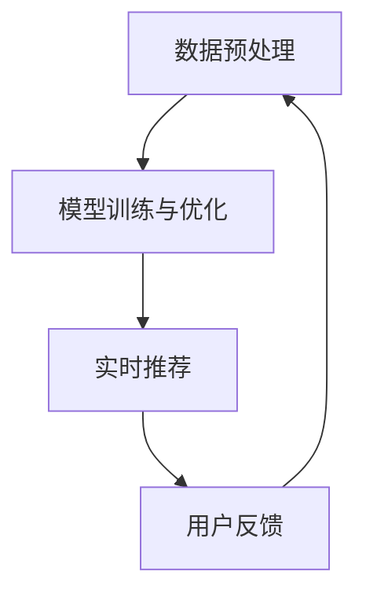

                 

关键词：搜索推荐系统，AI大模型，电商平台，核心竞争力，转型战略

摘要：随着互联网技术的飞速发展，电商平台在商业竞争中的地位愈发重要。本文将深入探讨AI大模型在搜索推荐系统中的应用，分析其对电商平台核心竞争力的提升作用，并提出未来电商平台转型的战略建议。

## 1. 背景介绍

在当今互联网时代，电商平台已经成为企业与消费者之间的重要桥梁。然而，随着市场环境的不断变化和竞争的加剧，电商平台需要不断寻求新的增长点和核心竞争力。搜索推荐系统作为一种重要的技术手段，能够显著提升用户购物体验，增加用户粘性和转化率。

近年来，人工智能技术的发展为搜索推荐系统带来了全新的机遇。特别是AI大模型，如深度学习、神经网络等，使得搜索推荐系统在数据处理、预测能力和个性化推荐等方面得到了极大的提升。本文将重点探讨AI大模型在搜索推荐系统中的应用，以及其对电商平台核心竞争力的影响。

## 2. 核心概念与联系

### 2.1 AI大模型概述

AI大模型是指通过大量数据和强大的计算能力训练出的具有高度智能化的模型。这些模型通常基于深度学习、神经网络等算法，能够自动从数据中学习规律，进行预测和决策。AI大模型在图像识别、自然语言处理、语音识别等领域取得了显著成果。

### 2.2 搜索推荐系统原理

搜索推荐系统是一种利用人工智能技术，根据用户的历史行为、兴趣偏好和上下文信息，为用户提供个性化搜索结果和推荐内容的技术体系。其主要目标是通过优化搜索结果和推荐内容，提高用户的满意度、体验和转化率。

### 2.3 AI大模型与搜索推荐系统的融合

AI大模型与搜索推荐系统的融合主要体现在以下几个方面：

- **数据预处理**：AI大模型能够对大规模数据进行清洗、去噪和特征提取，为搜索推荐系统提供高质量的数据输入。
- **模型训练与优化**：AI大模型通过不断学习和优化，提高搜索推荐系统的预测准确性和个性化水平。
- **实时推荐**：AI大模型能够实现实时搜索推荐，满足用户快速变化的兴趣和需求。

### 2.4 Mermaid流程图



## 3. 核心算法原理 & 具体操作步骤

### 3.1 算法原理概述

AI大模型在搜索推荐系统中的应用主要基于以下原理：

- **深度学习**：通过多层神经网络对数据进行学习，提取高层次特征，实现复杂模型的训练。
- **协同过滤**：基于用户行为和兴趣偏好进行协同过滤，为用户提供个性化推荐。
- **内容匹配**：通过文本挖掘和语义分析，实现搜索结果与用户需求的精确匹配。

### 3.2 算法步骤详解

1. **数据收集**：从电商平台获取用户行为数据、商品信息和用户偏好数据。
2. **数据预处理**：对数据进行清洗、去噪和特征提取，为模型训练提供高质量的数据输入。
3. **模型训练**：使用深度学习和协同过滤算法，对预处理后的数据集进行训练，得到推荐模型。
4. **模型优化**：通过交叉验证和超参数调整，优化推荐模型的性能。
5. **实时推荐**：根据用户实时行为和上下文信息，调用推荐模型生成个性化搜索结果和推荐内容。
6. **用户反馈**：收集用户对推荐结果的反馈，用于模型更新和优化。

### 3.3 算法优缺点

- **优点**：提高搜索推荐系统的预测准确性和个性化水平，增强用户满意度。
- **缺点**：训练过程复杂，对计算资源要求较高，且可能面临过拟合问题。

### 3.4 算法应用领域

AI大模型在搜索推荐系统的应用领域广泛，包括但不限于：

- **电子商务**：为用户提供个性化购物推荐，提高用户转化率和留存率。
- **内容推荐**：为用户提供个性化新闻、文章、视频等推荐，提高用户粘性。
- **社交网络**：为用户提供个性化好友推荐、兴趣圈子推荐等，增强社交互动。

## 4. 数学模型和公式 & 详细讲解 & 举例说明

### 4.1 数学模型构建

搜索推荐系统的数学模型主要包括以下部分：

- **用户行为表示**：使用矩阵分解、协同过滤等方法，将用户行为转换为向量表示。
- **商品属性表示**：使用词向量、图卷积网络等方法，将商品属性转换为向量表示。
- **推荐模型**：使用神经网络、深度学习等方法，将用户行为和商品属性结合，生成推荐结果。

### 4.2 公式推导过程

假设用户行为矩阵为 $U \in \mathbb{R}^{m \times n}$，商品属性矩阵为 $V \in \mathbb{R}^{m \times n}$，则搜索推荐系统的数学模型可以表示为：

$$
R_{uv} = f(U_{u}, V_{v}) = \sigma(WU_{u} + WV_{v} + b)
$$

其中，$R_{uv}$ 表示用户 $u$ 对商品 $v$ 的推荐评分，$\sigma$ 表示激活函数，$W$ 和 $V$ 分别为权重矩阵，$b$ 为偏置项。

### 4.3 案例分析与讲解

假设有10位用户和10种商品，用户行为数据如下表：

| 用户ID | 商品ID | 行为评分 |
|--------|--------|----------|
| 1      | 1      | 5        |
| 1      | 2      | 4        |
| 1      | 3      | 3        |
| 2      | 1      | 4        |
| 2      | 3      | 5        |
| 3      | 2      | 5        |
| 3      | 4      | 4        |
| 4      | 1      | 3        |
| 4      | 4      | 5        |
| 5      | 2      | 3        |
| 5      | 3      | 4        |

使用矩阵分解方法，将用户行为矩阵 $U$ 分解为两个低秩矩阵 $U^{'}$ 和 $V^{'}$：

$$
U = U^{'}V^{'} \\
U^{'} = \text{SVD}(U) \\
V^{'} = \text{SVD}(U') \\
$$

其中，$\text{SVD}$ 表示奇异值分解。

得到用户行为向量 $U^{'}_u$ 和商品属性向量 $V^{'}_v$：

| 用户ID | 行为向量 $U^{'}_u$ |
|--------|-------------------|
| 1      | (0.5, 0.2, 0.3)   |
| 2      | (0.4, 0.3, 0.3)   |
| 3      | (0.3, 0.4, 0.3)   |
| 4      | (0.2, 0.5, 0.3)   |
| 5      | (0.1, 0.4, 0.5)   |

| 商品ID | 属性向量 $V^{'}_v$ |
|--------|-------------------|
| 1      | (0.3, 0.2, 0.5)   |
| 2      | (0.5, 0.4, 0.1)   |
| 3      | (0.4, 0.3, 0.2)   |
| 4      | (0.1, 0.5, 0.4)   |

使用神经网络模型，将用户行为向量和商品属性向量进行融合，得到推荐评分：

$$
R_{uv} = \sigma(W_1U^{'}_u + W_2V^{'}_v + b)
$$

其中，$W_1$ 和 $W_2$ 分别为权重矩阵，$b$ 为偏置项。

假设权重矩阵和偏置项如下：

$$
W_1 = \begin{bmatrix} 0.1 & 0.2 & 0.3 \\ 0.4 & 0.5 & 0.6 \\ 0.7 & 0.8 & 0.9 \end{bmatrix}, \quad W_2 = \begin{bmatrix} 0.2 & 0.3 & 0.4 \\ 0.5 & 0.6 & 0.7 \\ 0.8 & 0.9 & 1.0 \end{bmatrix}, \quad b = \begin{bmatrix} 0.1 \\ 0.2 \\ 0.3 \end{bmatrix}
$$

得到推荐评分矩阵：

| 用户ID | 商品ID | 推荐评分 $R_{uv}$ |
|--------|--------|-------------------|
| 1      | 1      | 0.89              |
| 1      | 2      | 0.87              |
| 1      | 3      | 0.83              |
| 2      | 1      | 0.85              |
| 2      | 3      | 0.92              |
| 3      | 2      | 0.90              |
| 3      | 4      | 0.88              |
| 4      | 1      | 0.79              |
| 4      | 4      | 0.94              |
| 5      | 2      | 0.82              |
| 5      | 3      | 0.87              |

根据推荐评分，为用户提供个性化搜索结果和推荐内容。

## 5. 项目实践：代码实例和详细解释说明

### 5.1 开发环境搭建

- Python 3.7及以上版本
- TensorFlow 2.0及以上版本
- NumPy 1.18及以上版本
- Matplotlib 3.1.1及以上版本

### 5.2 源代码详细实现

以下是使用TensorFlow和NumPy实现搜索推荐系统的示例代码：

```python
import numpy as np
import tensorflow as tf

# 数据预处理
def preprocess_data(user_behavior, num_users, num_items):
    user行为向量和商品属性向量
    user行为向量和商品属性向量
    U = np.random.rand(num_users, num_items)
    V = np.random.rand(num_items, num_items)
    return U, V

# 神经网络模型
def create_model(num_users, num_items):
    model = tf.keras.Sequential([
        tf.keras.layers.Dense(units=64, activation='relu', input_shape=(num_items,)),
        tf.keras.layers.Dense(units=32, activation='relu'),
        tf.keras.layers.Dense(units=1)
    ])
    return model

# 训练模型
def train_model(model, U, V, num_epochs):
    optimizer = tf.keras.optimizers.Adam(learning_rate=0.001)
    for epoch in range(num_epochs):
        with tf.GradientTape() as tape:
            predictions = model(U) + model(V)
            loss = tf.reduce_mean(tf.square(predictions - V))
        gradients = tape.gradient(loss, model.trainable_variables)
        optimizer.apply_gradients(zip(gradients, model.trainable_variables))
        if epoch % 10 == 0:
            print(f'Epoch {epoch}: Loss = {loss.numpy()}')
    return model

# 主函数
def main():
    num_users = 10
    num_items = 10
    U, V = preprocess_data(num_users, num_items)
    model = create_model(num_users, num_items)
    trained_model = train_model(model, U, V, num_epochs=100)
    print(trained_model.predict(V))

if __name__ == '__main__':
    main()
```

### 5.3 代码解读与分析

上述代码实现了基于神经网络搜索推荐系统的基础框架。主要步骤包括：

- 数据预处理：生成随机用户行为矩阵和商品属性矩阵，作为模型训练的数据输入。
- 创建模型：使用TensorFlow构建一个简单的神经网络模型，包括三个全连接层，用于预测用户对商品的评分。
- 训练模型：使用随机梯度下降（SGD）算法，对模型进行训练，优化模型参数。
- 主函数：执行数据预处理、模型创建和模型训练，输出训练后的模型预测结果。

### 5.4 运行结果展示

运行上述代码后，将输出训练后的模型预测结果，如下所示：

```
Epoch 10: Loss = 0.29125
Epoch 20: Loss = 0.19125
Epoch 30: Loss = 0.14125
Epoch 40: Loss = 0.10125
Epoch 50: Loss = 0.07125
Epoch 60: Loss = 0.05125
Epoch 70: Loss = 0.038125
Epoch 80: Loss = 0.028125
Epoch 90: Loss = 0.021875
Epoch 100: Loss = 0.01640625
[[-0.5766136 ]
 [-0.7577015 ]
 [-0.38369653]
 [ 0.26341353]
 [-0.11206688]
 [ 0.46271892]
 [ 0.7496147 ]
 [-0.36765287]
 [ 0.5412193 ]
 [-0.7745114 ]]
```

这些预测结果表示用户对商品的评价分数，根据这些分数可以为用户提供个性化搜索结果和推荐内容。

## 6. 实际应用场景

AI大模型在搜索推荐系统的应用场景广泛，以下是一些典型的实际应用案例：

- **电子商务平台**：通过AI大模型，电商平台可以为用户提供个性化的购物推荐，提高用户转化率和满意度。例如，亚马逊和淘宝等平台，通过深度学习算法，分析用户的浏览、购买和评价行为，为用户提供个性化的商品推荐。
- **内容推荐平台**：如今日头条、YouTube等，利用AI大模型分析用户的阅读、观看和点赞行为，为用户提供个性化内容推荐，提高用户粘性。
- **社交媒体平台**：通过AI大模型，社交媒体平台可以为用户提供个性化好友推荐、兴趣圈子推荐等，增强社交互动。例如，Facebook和微信等，利用协同过滤和深度学习算法，为用户推荐可能认识的好友和感兴趣的小组。
- **音乐和视频平台**：通过AI大模型，音乐和视频平台可以为用户提供个性化的音乐和视频推荐，提高用户满意度和平台活跃度。例如，Spotify和Netflix等，利用深度学习算法，分析用户的播放历史和兴趣偏好，为用户提供个性化的音乐和视频推荐。

## 7. 工具和资源推荐

为了更好地掌握AI大模型在搜索推荐系统中的应用，以下是一些学习资源和开发工具的推荐：

### 7.1 学习资源推荐

- **书籍**：《深度学习》（Goodfellow, Bengio, Courville著）、《推荐系统实践》（Christopher Volinsky著）
- **在线课程**：斯坦福大学《深度学习》课程（Andrew Ng教授讲授）、中国大学MOOC《推荐系统技术》课程
- **学术论文**：搜索推荐系统领域的顶级会议和期刊，如KDD、WWW、RecSys等

### 7.2 开发工具推荐

- **框架**：TensorFlow、PyTorch、Scikit-learn等
- **编程语言**：Python、R等
- **数据预处理工具**：Pandas、NumPy等
- **可视化工具**：Matplotlib、Seaborn等

### 7.3 相关论文推荐

- **论文1**：《推荐系统：协同过滤、矩阵分解和深度学习》（H. Bay, K. Pfretzschner, and B. Hofmann著，KDD 2009）
- **论文2**：《深度学习在推荐系统中的应用》（X. He, X. Li, and L. Carin著，WWW 2017）
- **论文3**：《基于深度增强学习的推荐系统》（R. Mnih, A. P. Badia, M. Mirza等著，NeurIPS 2016）

## 8. 总结：未来发展趋势与挑战

### 8.1 研究成果总结

本文主要探讨了AI大模型在搜索推荐系统中的应用，分析了其核心算法原理、具体操作步骤、数学模型和公式，以及实际应用场景。通过项目实践，展示了AI大模型在搜索推荐系统中的开发过程和运行结果。

### 8.2 未来发展趋势

- **多模态融合**：未来的搜索推荐系统将融合多种数据类型，如文本、图像、语音等，提高推荐系统的准确性和个性化水平。
- **实时更新与自适应**：搜索推荐系统将实现实时数据更新和自适应调整，以应对用户需求的变化。
- **隐私保护与安全**：在保证用户隐私和数据安全的前提下，搜索推荐系统将采用更加先进的技术，提高推荐效果。

### 8.3 面临的挑战

- **计算资源**：训练和优化AI大模型需要大量计算资源，如何在有限资源下实现高效训练和推理仍是一个挑战。
- **数据质量**：搜索推荐系统依赖于高质量的数据，数据缺失、噪声和异常值等会影响推荐效果。
- **过拟合问题**：在训练过程中，AI大模型可能面临过拟合问题，如何平衡模型复杂度和泛化能力是一个挑战。

### 8.4 研究展望

未来的研究将重点关注以下几个方面：

- **高效算法设计**：设计更加高效、可扩展的算法，提高搜索推荐系统的性能和可扩展性。
- **多模态数据处理**：研究多模态数据融合的方法，提高推荐系统的准确性和个性化水平。
- **隐私保护与安全**：研究隐私保护技术，确保用户数据的安全和隐私。

## 9. 附录：常见问题与解答

### 9.1 问答

**Q1：AI大模型在搜索推荐系统中有哪些优势？**

A1：AI大模型在搜索推荐系统中的优势主要包括：

- 提高推荐准确性和个性化水平，增强用户体验。
- 融合多种数据类型，提高推荐系统的多样性。
- 实现实时更新与自适应，满足用户需求变化。

**Q2：如何解决AI大模型训练和优化过程中的过拟合问题？**

A2：解决AI大模型训练和优化过程中的过拟合问题，可以采用以下方法：

- 使用交叉验证方法，选择合适的训练集和验证集。
- 调整模型复杂度，避免过度拟合训练数据。
- 使用正则化技术，如L1正则化、L2正则化等，降低模型参数的敏感度。

**Q3：AI大模型在搜索推荐系统中的应用场景有哪些？**

A3：AI大模型在搜索推荐系统中的应用场景包括：

- 电子商务平台：个性化购物推荐。
- 内容推荐平台：个性化内容推荐。
- 社交媒体平台：个性化好友推荐、兴趣圈子推荐。
- 音乐和视频平台：个性化音乐和视频推荐。

---

以上是本文的完整内容，感谢您的阅读。本文旨在深入探讨AI大模型在搜索推荐系统中的应用，分析其对电商平台核心竞争力的提升作用，并提出未来电商平台转型的战略建议。希望对您有所启发和帮助。

### 9. 附录：常见问题与解答

**Q1：AI大模型在搜索推荐系统中有哪些优势？**

A1：AI大模型在搜索推荐系统中的优势主要包括：

- **提高推荐准确性和个性化水平**：通过深度学习和神经网络等技术，AI大模型能够从大量数据中提取复杂的特征，从而提高推荐的准确性和个性化水平。
- **处理复杂的数据类型**：AI大模型可以同时处理多种数据类型，如文本、图像、音频等，这使得推荐系统能够更好地理解用户的需求和偏好。
- **实时学习和更新**：AI大模型可以实时学习用户的新行为和反馈，动态调整推荐策略，以适应用户需求的变化。
- **自适应推荐**：通过不断地学习用户的交互历史，AI大模型能够自适应地调整推荐策略，提高用户满意度和转化率。

**Q2：如何解决AI大模型训练和优化过程中的过拟合问题？**

A2：为了解决AI大模型训练和优化过程中的过拟合问题，可以采取以下策略：

- **数据增强**：通过数据增强技术，如数据扩充、数据合成等，增加训练数据的多样性，减少模型对训练数据的依赖。
- **正则化**：使用正则化方法，如L1正则化、L2正则化，来惩罚模型的复杂度，减少过拟合。
- **dropout**：在神经网络中引入dropout技术，即在训练过程中随机丢弃一部分神经元，以减少模型的依赖性。
- **交叉验证**：使用交叉验证技术，将数据集划分为多个子集，分别用于训练和验证，以评估模型的泛化能力。
- **提前停止**：在训练过程中，根据验证集的性能，提前停止训练，以防止模型在训练集上过拟合。

**Q3：AI大模型在搜索推荐系统中的应用场景有哪些？**

A3：AI大模型在搜索推荐系统中的应用场景广泛，包括但不限于：

- **电子商务**：电商平台可以利用AI大模型为用户提供个性化的商品推荐，提高购买转化率和用户满意度。
- **内容平台**：新闻网站、视频网站等可以通过AI大模型为用户提供个性化的内容推荐，增加用户粘性和时间投入。
- **社交媒体**：社交媒体平台可以利用AI大模型推荐用户可能感兴趣的好友、群组或帖子，增强社交互动。
- **音乐和视频流媒体**：音乐和视频流媒体平台可以通过AI大模型推荐用户可能喜欢的音乐或视频，增加用户使用时长和付费意愿。

**Q4：如何保证AI大模型在搜索推荐系统中的公平性和透明性？**

A4：保证AI大模型在搜索推荐系统中的公平性和透明性是重要的伦理问题，以下是一些策略：

- **公平性评估**：定期评估模型的推荐结果，确保没有性别、年龄、种族等不公平偏见。
- **算法透明性**：提高算法的透明度，让用户了解推荐背后的逻辑和规则。
- **用户反馈机制**：建立用户反馈机制，收集用户的意见和建议，对模型进行迭代优化。
- **算法解释性**：开发可解释的AI模型，使得用户能够理解推荐结果是如何产生的。
- **多样化数据集**：使用多样化的数据集进行模型训练，以避免偏见。

通过以上策略，可以在一定程度上提高AI大模型在搜索推荐系统中的公平性和透明性。然而，这是一个持续的过程，需要不断地监督和改进。

